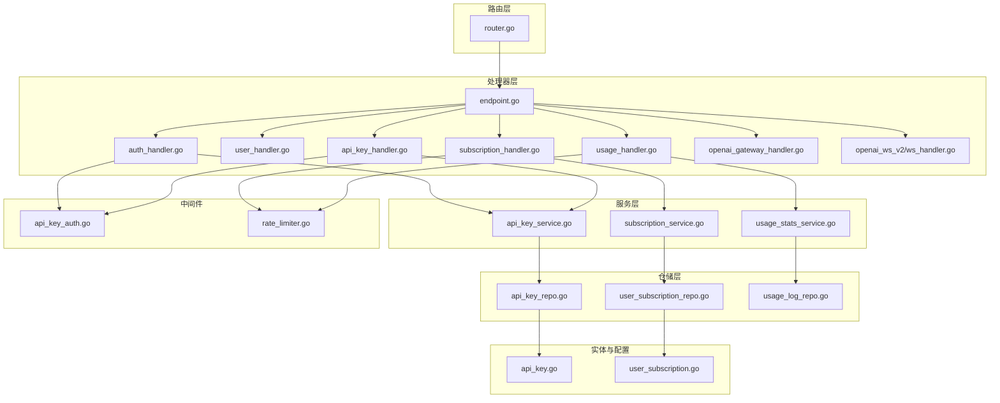
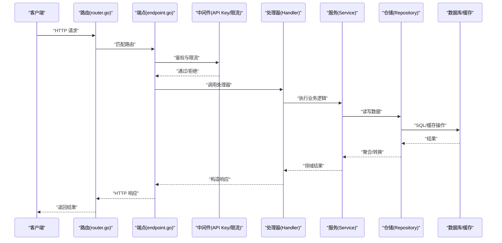
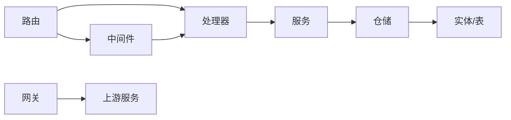

# API参考文档

<cite>
**本文档引用的文件**
- [backend/internal/server/router.go](file://backend/internal/server/router.go)
- [backend/internal/handler/endpoint.go](file://backend/internal/handler/endpoint.go)
- [backend/internal/handler/auth_handler.go](file://backend/internal/handler/auth_handler.go)
- [backend/internal/handler/user_handler.go](file://backend/internal/handler/user_handler.go)
- [backend/internal/handler/api_key_handler.go](file://backend/internal/handler/api_key_handler.go)
- [backend/internal/handler/subscription_handler.go](file://backend/internal/handler/subscription_handler.go)
- [backend/internal/handler/usage_handler.go](file://backend/internal/handler/usage_handler.go)
- [backend/internal/handler/openai_gateway_handler.go](file://backend/internal/handler/openai_gateway_handler.go)
- [backend/internal/handler/gateway_handler_chat_completions.go](file://backend/internal/handler/gateway_handler_chat_completions.go)
- [backend/internal/server/middleware/api_key_auth.go](file://backend/internal/server/middleware/api_key_auth.go)
- [backend/internal/server/middleware/rate_limiter.go](file://backend/internal/server/middleware/rate_limiter.go)
- [backend/internal/repository/api_key_repo.go](file://backend/internal/repository/api_key_repo.go)
- [backend/internal/repository/user_subscription_repo.go](file://backend/internal/repository/user_subscription_repo.go)
- [backend/internal/repository/usage_log_repo.go](file://backend/internal/repository/usage_log_repo.go)
- [backend/internal/service/api_key_service.go](file://backend/internal/service/api_key_service.go)
- [backend/internal/service/subscription_service.go](file://backend/internal/service/subscription_service.go)
- [backend/internal/service/usage_stats_service.go](file://backend/internal/service/usage_stats_service.go)
- [backend/internal/pkg/openai/oauth.go](file://backend/internal/pkg/openai/oauth.go)
- [backend/internal/pkg/geminicli/oauth.go](file://backend/internal/pkg/geminicli/oauth.go)
- [backend/internal/pkg/antigravity/oauth.go](file://backend/internal/pkg/antigravity/oauth.go)
- [backend/ent/schema/api_key.go](file://backend/ent/schema/api_key.go)
- [backend/ent/schema/user_subscription.go](file://backend/ent/schema/user_subscription.go)
- [backend/internal/handler/openai_ws_v2/ws_handler.go](file://backend/internal/service/openai_ws_v2/ws_handler.go)
</cite>

## 目录
1. [简介](#简介)
2. [项目结构](#项目结构)
3. [核心组件](#核心组件)
4. [架构总览](#架构总览)
5. [详细组件分析](#详细组件分析)
6. [依赖关系分析](#依赖关系分析)
7. [性能考量](#性能考量)
8. [故障排除指南](#故障排除指南)
9. [结论](#结论)
10. [附录](#附录)

## 简介
本文件为Sub2API的完整RESTful API参考文档，覆盖认证与授权、用户管理、API密钥管理、订阅与用量统计、网关代理与实时通信等模块。文档提供各端点的HTTP方法、URL模式、请求参数、响应格式、状态码与错误处理说明，并补充认证机制（JWT与API Key）、请求限流、数据校验与安全策略。同时给出常见使用场景与示例路径，说明API版本控制与向后兼容策略。

## 项目结构
后端采用分层架构：路由层负责HTTP路由与中间件装配；处理器层（Handler）实现业务逻辑；服务层（Service）封装领域服务；仓储层（Repository）负责数据访问；实体（Ent）定义数据模型；包（pkg）提供通用能力（如OAuth、HTTP客户端等）。前端通过API接口与后端交互，支付模块独立于主服务。

**图表来源**
- [backend/internal/server/router.go:1-200](file://backend/internal/server/router.go#L1-L200)
- [backend/internal/handler/endpoint.go:1-300](file://backend/internal/handler/endpoint.go#L1-L300)
- [backend/internal/handler/auth_handler.go:1-200](file://backend/internal/handler/auth_handler.go#L1-L200)
- [backend/internal/handler/api_key_handler.go:1-200](file://backend/internal/handler/api_key_handler.go#L1-L200)
- [backend/internal/handler/subscription_handler.go:1-200](file://backend/internal/handler/subscription_handler.go#L1-L200)
- [backend/internal/handler/usage_handler.go:1-200](file://backend/internal/handler/usage_handler.go#L1-L200)
- [backend/internal/handler/openai_gateway_handler.go:1-200](file://backend/internal/handler/openai_gateway_handler.go#L1-L200)
- [backend/internal/service/openai_ws_v2/ws_handler.go:1-200](file://backend/internal/service/openai_ws_v2/ws_handler.go#L1-L200)
- [backend/internal/server/middleware/api_key_auth.go:1-200](file://backend/internal/server/middleware/api_key_auth.go#L1-L200)
- [backend/internal/server/middleware/rate_limiter.go:1-200](file://backend/internal/server/middleware/rate_limiter.go#L1-L200)
- [backend/internal/repository/api_key_repo.go:1-200](file://backend/internal/repository/api_key_repo.go#L1-L200)
- [backend/internal/repository/user_subscription_repo.go:1-200](file://backend/internal/repository/user_subscription_repo.go#L1-L200)
- [backend/internal/repository/usage_log_repo.go:1-200](file://backend/internal/repository/usage_log_repo.go#L1-L200)
- [backend/internal/service/api_key_service.go:1-200](file://backend/internal/service/api_key_service.go#L1-L200)
- [backend/internal/service/subscription_service.go:1-200](file://backend/internal/service/subscription_service.go#L1-L200)
- [backend/internal/service/usage_stats_service.go:1-200](file://backend/internal/service/usage_stats_service.go#L1-L200)
- [backend/ent/schema/api_key.go:1-200](file://backend/ent/schema/api_key.go#L1-L200)
- [backend/ent/schema/user_subscription.go:1-200](file://backend/ent/schema/user_subscription.go#L1-L200)

**章节来源**
- [backend/internal/server/router.go:1-200](file://backend/internal/server/router.go#L1-L200)
- [backend/internal/handler/endpoint.go:1-300](file://backend/internal/handler/endpoint.go#L1-L300)

## 核心组件
- 路由与端点：统一在路由层注册HTTP端点，按功能拆分到不同处理器。
- 认证与授权：支持JWT与API Key两种认证方式，结合限流中间件进行访问控制。
- 用户与订阅：提供用户资料管理、订阅计划查询与进度跟踪。
- API密钥：支持创建、删除、权限设置与额度限制。
- 用量统计：提供历史用量与报表聚合。
- 网关与实时：OpenAI兼容网关与WebSocket实时通信。

**章节来源**
- [backend/internal/handler/endpoint.go:1-300](file://backend/internal/handler/endpoint.go#L1-L300)
- [backend/internal/server/middleware/api_key_auth.go:1-200](file://backend/internal/server/middleware/api_key_auth.go#L1-L200)
- [backend/internal/server/middleware/rate_limiter.go:1-200](file://backend/internal/server/middleware/rate_limiter.go#L1-L200)

## 架构总览
下图展示从HTTP请求到业务处理与数据持久化的整体流程，以及与外部上游服务的交互。

**图表来源**
- [backend/internal/server/router.go:1-200](file://backend/internal/server/router.go#L1-L200)
- [backend/internal/handler/endpoint.go:1-300](file://backend/internal/handler/endpoint.go#L1-L300)
- [backend/internal/server/middleware/api_key_auth.go:1-200](file://backend/internal/server/middleware/api_key_auth.go#L1-L200)
- [backend/internal/server/middleware/rate_limiter.go:1-200](file://backend/internal/server/middleware/rate_limiter.go#L1-L200)

## 详细组件分析

### 认证API
- 登录（OAuth）
  - 方法与路径：GET /oauth/{provider}/login
  - 功能：重定向至第三方OAuth授权页
  - 认证：无
  - 响应：302跳转或JSON错误
  - 状态码：200/302/400/500
- 回调（OAuth）
  - 方法与路径：GET /oauth/{provider}/callback
  - 功能：接收授权码并换取访问令牌，创建/更新用户会话
  - 认证：无
  - 响应：302跳转或JSON错误
  - 状态码：200/302/400/500
- 刷新令牌
  - 方法与路径：POST /auth/refresh
  - 功能：使用刷新令牌换取新访问令牌
  - 认证：刷新令牌
  - 请求体：{ refresh_token: string }
  - 响应：{ access_token: string, expires_in: number }
  - 状态码：200/400/401/500
- 注销
  - 方法与路径：POST /auth/logout
  - 功能：使当前会话失效
  - 认证：访问令牌
  - 响应：空对象或错误
  - 状态码：200/401/500

安全与限流
- JWT：短期访问令牌，配合刷新令牌轮换
- API Key：可替代JWT用于程序化调用
- 限流：基于IP/Key维度的QPS限制，超限返回429

示例路径
- [OAuth登录:1-200](file://backend/internal/pkg/openai/oauth.go#L1-L200)
- [OAuth回调:1-200](file://backend/internal/pkg/geminicli/oauth.go#L1-L200)
- [刷新令牌:1-200](file://backend/internal/handler/auth_handler.go#L1-L200)

**章节来源**
- [backend/internal/handler/auth_handler.go:1-200](file://backend/internal/handler/auth_handler.go#L1-L200)
- [backend/internal/pkg/openai/oauth.go:1-200](file://backend/internal/pkg/openai/oauth.go#L1-L200)
- [backend/internal/pkg/geminicli/oauth.go:1-200](file://backend/internal/pkg/geminicli/oauth.go#L1-L200)

### 用户管理API
- 获取当前用户信息
  - 方法与路径：GET /user/me
  - 认证：访问令牌
  - 响应：用户对象（含基础字段）
  - 状态码：200/401/500
- 更新用户资料
  - 方法与路径：PUT /user/me
  - 认证：访问令牌
  - 请求体：部分用户字段
  - 响应：更新后的用户对象
  - 状态码：200/400/401/500
- 查询订阅状态
  - 方法与路径：GET /user/me/subscription
  - 认证：访问令牌
  - 响应：订阅计划与到期时间
  - 状态码：200/401/500

示例路径
- [用户处理器:1-200](file://backend/internal/handler/user_handler.go#L1-L200)
- [订阅仓储:1-200](file://backend/internal/repository/user_subscription_repo.go#L1-L200)

**章节来源**
- [backend/internal/handler/user_handler.go:1-200](file://backend/internal/handler/user_handler.go#L1-L200)
- [backend/internal/repository/user_subscription_repo.go:1-200](file://backend/internal/repository/user_subscription_repo.go#L1-L200)

### API密钥管理API
- 创建密钥
  - 方法与路径：POST /api-keys
  - 认证：访问令牌
  - 请求体：{ name: string, permissions: string[], ip_whitelist?: string[] }
  - 响应：新建密钥对象（含明文密钥一次可见）
  - 状态码：201/400/401/500
- 列出密钥
  - 方法与路径：GET /api-keys
  - 认证：访问令牌
  - 响应：密钥列表（脱敏）
  - 状态码：200/401/500
- 更新密钥
  - 方法与路径：PATCH /api-keys/{id}
  - 认证：访问令牌
  - 请求体：{ permissions: string[], ip_whitelist?: string[] }
  - 响应：更新后的密钥
  - 状态码：200/400/401/404/500
- 删除密钥
  - 方法与路径：DELETE /api-keys/{id}
  - 认证：访问令牌
  - 响应：空对象
  - 状态码：200/401/404/500
- 密钥鉴权
  - 中间件：API Key鉴权，支持IP白名单与权限位校验

实体与仓储
- 实体：api_key（名称、权限、IP白名单、最后使用时间等）
- 仓储：提供创建、查询、更新、删除与缓存

示例路径
- [密钥处理器:1-200](file://backend/internal/handler/api_key_handler.go#L1-L200)
- [密钥服务:1-200](file://backend/internal/service/api_key_service.go#L1-L200)
- [密钥仓储:1-200](file://backend/internal/repository/api_key_repo.go#L1-L200)
- [密钥实体:1-200](file://backend/ent/schema/api_key.go#L1-L200)

**章节来源**
- [backend/internal/handler/api_key_handler.go:1-200](file://backend/internal/handler/api_key_handler.go#L1-L200)
- [backend/internal/service/api_key_service.go:1-200](file://backend/internal/service/api_key_service.go#L1-L200)
- [backend/internal/repository/api_key_repo.go:1-200](file://backend/internal/repository/api_key_repo.go#L1-L200)
- [backend/ent/schema/api_key.go:1-200](file://backend/ent/schema/api_key.go#L1-L200)

### 订阅API
- 查询订阅计划
  - 方法与路径：GET /subscriptions/plans
  - 认证：访问令牌或API Key
  - 响应：可用计划列表
  - 状态码：200/401/403/500
- 查询用户订阅
  - 方法与路径：GET /users/{userId}/subscription
  - 认证：访问令牌（管理员）
  - 响应：订阅详情与到期时间
  - 状态码：200/401/403/404/500
- 进度跟踪
  - 方法与路径：GET /users/{userId}/subscription/progress
  - 认证：访问令牌（管理员）
  - 响应：用量进度与阈值
  - 状态码：200/401/403/404/500

实体与服务
- 实体：user_subscription（用户、计划、到期时间、配额等）
- 服务：计算进度、重置配额、到期处理

示例路径
- [订阅处理器:1-200](file://backend/internal/handler/subscription_handler.go#L1-L200)
- [订阅服务:1-200](file://backend/internal/service/subscription_service.go#L1-L200)
- [订阅仓储:1-200](file://backend/internal/repository/user_subscription_repo.go#L1-L200)
- [订阅实体:1-200](file://backend/ent/schema/user_subscription.go#L1-L200)

**章节来源**
- [backend/internal/handler/subscription_handler.go:1-200](file://backend/internal/handler/subscription_handler.go#L1-L200)
- [backend/internal/service/subscription_service.go:1-200](file://backend/internal/service/subscription_service.go#L1-L200)
- [backend/internal/repository/user_subscription_repo.go:1-200](file://backend/internal/repository/user_subscription_repo.go#L1-L200)
- [backend/ent/schema/user_subscription.go:1-200](file://backend/ent/schema/user_subscription.go#L1-L200)

### 用量统计API
- 历史用量
  - 方法与路径：GET /usage/logs
  - 认证：访问令牌或API Key
  - 查询参数：时间范围、分页、过滤条件
  - 响应：用量日志列表
  - 状态码：200/400/401/500
- 报表聚合
  - 方法与路径：GET /usage/reports
  - 认证：访问令牌或API Key
  - 查询参数：聚合维度（日/周/月）、指标类型
  - 响应：聚合报表
  - 状态码：200/400/401/500

仓储与服务
- 仓储：提供分页查询、索引优化与聚合
- 服务：统计口径与缓存策略

示例路径
- [用量处理器:1-200](file://backend/internal/handler/usage_handler.go#L1-L200)
- [用量仓储:1-200](file://backend/internal/repository/usage_log_repo.go#L1-L200)

**章节来源**
- [backend/internal/handler/usage_handler.go:1-200](file://backend/internal/handler/usage_handler.go#L1-L200)
- [backend/internal/repository/usage_log_repo.go:1-200](file://backend/internal/repository/usage_log_repo.go#L1-L200)

### 网关与实时通信API
- OpenAI兼容网关
  - 方法与路径：POST /v1/chat/completions
  - 认证：API Key或访问令牌
  - 请求体：OpenAI兼容格式
  - 响应：流式/非流式响应
  - 状态码：200/400/401/429/500
- 流式回退与拦截
  - 支持失败回退与降级处理
- WebSocket实时通信
  - 方法与路径：WS /ws/v1/chat
  - 认证：访问令牌
  - 功能：实时消息推送与事件通知
  - 协议：自定义帧格式

示例路径
- [网关处理器:1-200](file://backend/internal/handler/openai_gateway_handler.go#L1-L200)
- [聊天补全网关:1-200](file://backend/internal/handler/gateway_handler_chat_completions.go#L1-L200)
- [WebSocket处理器:1-200](file://backend/internal/service/openai_ws_v2/ws_handler.go#L1-L200)

**章节来源**
- [backend/internal/handler/openai_gateway_handler.go:1-200](file://backend/internal/handler/openai_gateway_handler.go#L1-L200)
- [backend/internal/handler/gateway_handler_chat_completions.go:1-200](file://backend/internal/handler/gateway_handler_chat_completions.go#L1-L200)
- [backend/internal/service/openai_ws_v2/ws_handler.go:1-200](file://backend/internal/service/openai_ws_v2/ws_handler.go#L1-L200)

## 依赖关系分析
- 处理器依赖服务层，服务层依赖仓储层，仓储层依赖实体与数据库/缓存。
- 中间件贯穿路由与处理器，提供统一的鉴权与限流。
- 网关层对接上游服务，具备失败回退与拦截能力。

**图表来源**
- [backend/internal/handler/endpoint.go:1-300](file://backend/internal/handler/endpoint.go#L1-L300)
- [backend/internal/server/middleware/api_key_auth.go:1-200](file://backend/internal/server/middleware/api_key_auth.go#L1-L200)
- [backend/internal/server/middleware/rate_limiter.go:1-200](file://backend/internal/server/middleware/rate_limiter.go#L1-L200)
- [backend/internal/service/api_key_service.go:1-200](file://backend/internal/service/api_key_service.go#L1-L200)
- [backend/internal/repository/api_key_repo.go:1-200](file://backend/internal/repository/api_key_repo.go#L1-L200)
- [backend/ent/schema/api_key.go:1-200](file://backend/ent/schema/api_key.go#L1-L200)

**章节来源**
- [backend/internal/handler/endpoint.go:1-300](file://backend/internal/handler/endpoint.go#L1-L300)
- [backend/internal/server/middleware/api_key_auth.go:1-200](file://backend/internal/server/middleware/api_key_auth.go#L1-L200)
- [backend/internal/server/middleware/rate_limiter.go:1-200](file://backend/internal/server/middleware/rate_limiter.go#L1-L200)

## 性能考量
- 缓存策略：对高频查询（如密钥鉴权、订阅状态、用量聚合）使用缓存，降低数据库压力。
- 分页与索引：用量查询使用分页与复合索引，避免全表扫描。
- 流式响应：网关支持流式输出，减少大响应的内存占用。
- 限流与熔断：基于IP/Key维度的QPS限制，异常时快速失败与回退。
- 数据库连接池：合理配置连接数与超时，避免阻塞。

[本节为通用指导，无需特定文件来源]

## 故障排除指南
- 401未授权
  - 检查访问令牌/刷新令牌是否正确传递
  - 确认API Key是否启用且未过期
- 403禁止访问
  - 权限不足或IP不在白名单内
- 429请求过快
  - 触发限流，降低请求频率或申请更高配额
- 5xx服务器错误
  - 查看服务日志与上游错误事件，定位具体环节

**章节来源**
- [backend/internal/server/middleware/api_key_auth.go:1-200](file://backend/internal/server/middleware/api_key_auth.go#L1-L200)
- [backend/internal/server/middleware/rate_limiter.go:1-200](file://backend/internal/server/middleware/rate_limiter.go#L1-L200)

## 结论
本文档提供了Sub2API的完整RESTful API参考，涵盖认证、用户、密钥、订阅、用量与网关/实时通信等模块。建议在生产环境中结合API Key与JWT双重认证，配合严格的限流与缓存策略，确保高可用与安全性。

[本节为总结，无需特定文件来源]

## 附录

### 安全与合规
- 认证机制
  - JWT：短期访问令牌，配合刷新令牌轮换
  - API Key：支持IP白名单与权限位控制
- 数据验证
  - 输入参数严格校验，错误返回明确的错误码与提示
- 隐私保护
  - 密钥明文仅在创建时可见，后续脱敏返回
- 合规审计
  - 用量日志保留与可追溯，支持合规报表导出

**章节来源**
- [backend/internal/handler/api_key_handler.go:1-200](file://backend/internal/handler/api_key_handler.go#L1-L200)
- [backend/internal/handler/usage_handler.go:1-200](file://backend/internal/handler/usage_handler.go#L1-L200)

### 版本控制与兼容性
- 版本策略
  - 采用语义化版本号，遵循向后兼容原则
  - 新增字段以可选形式出现，不破坏现有客户端
- 迁移指南
  - 重大变更前提供过渡期与弃用警告
  - 提供自动化迁移脚本与回滚方案

[本节为通用指导，无需特定文件来源]

### 常见使用场景
- 使用API Key进行批量任务调用
  - 在请求头中携带X-API-Key，设置必要权限位
- 通过OAuth集成第三方登录
  - 先发起登录重定向，再处理回调并保存会话
- 实时对话与流式输出
  - 使用WebSocket建立长连接，或使用流式网关端点

**章节来源**
- [backend/internal/handler/api_key_handler.go:1-200](file://backend/internal/handler/api_key_handler.go#L1-L200)
- [backend/internal/pkg/openai/oauth.go:1-200](file://backend/internal/pkg/openai/oauth.go#L1-L200)
- [backend/internal/handler/openai_gateway_handler.go:1-200](file://backend/internal/handler/openai_gateway_handler.go#L1-L200)
- [backend/internal/service/openai_ws_v2/ws_handler.go:1-200](file://backend/internal/service/openai_ws_v2/ws_handler.go#L1-L200)