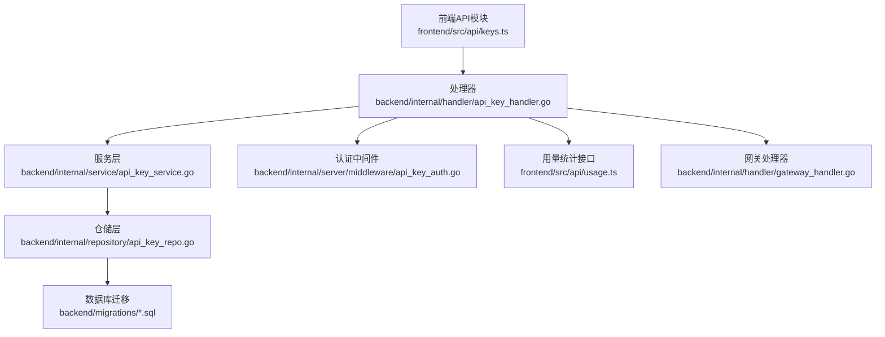
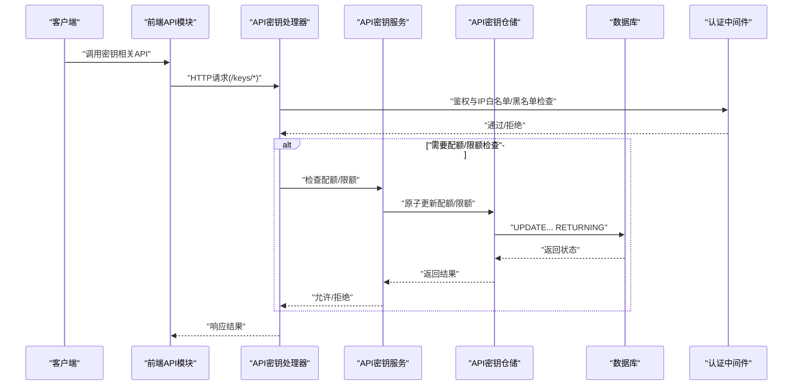
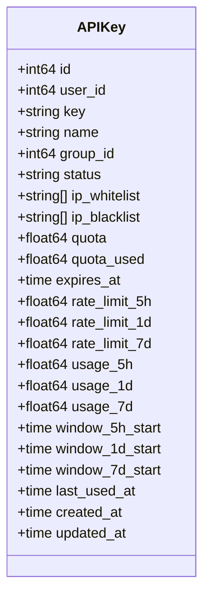
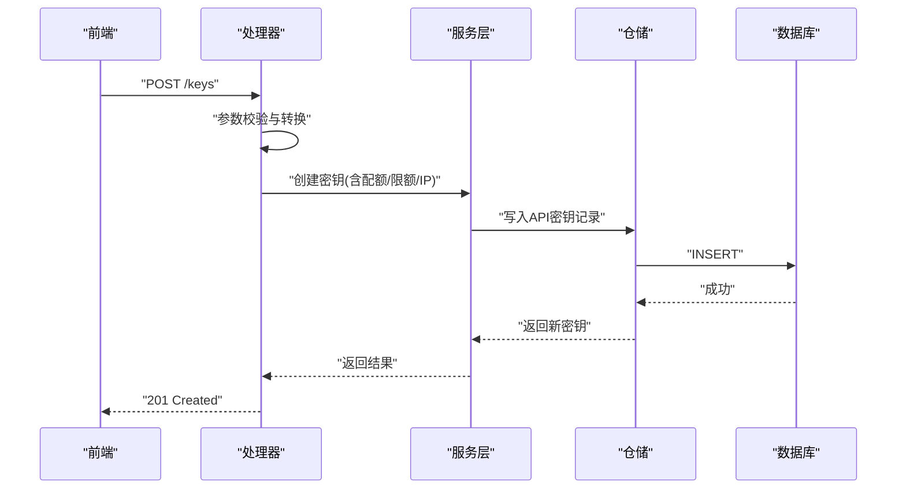
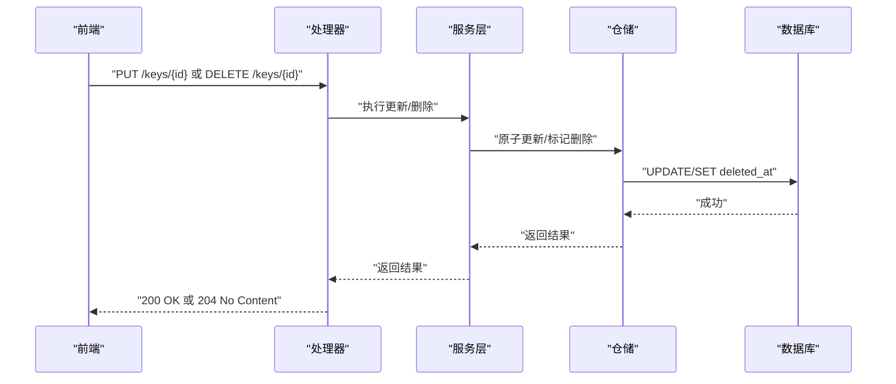
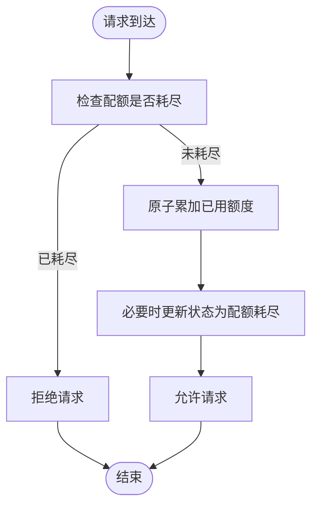
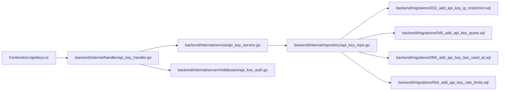

# API密钥管理API

<cite>
**本文档引用的文件**
- [backend/internal/handler/api_key_handler.go](file://backend/internal/handler/api_key_handler.go)
- [backend/internal/handler/dto/types.go](file://backend/internal/handler/dto/types.go)
- [backend/internal/service/api_key.go](file://backend/internal/service/api_key.go)
- [backend/internal/service/api_key_service.go](file://backend/internal/service/api_key_service.go)
- [backend/internal/repository/api_key_repo.go](file://backend/internal/repository/api_key_repo.go)
- [backend/internal/repository/usage_billing_repo.go](file://backend/internal/repository/usage_billing_repo.go)
- [backend/internal/server/middleware/api_key_auth.go](file://backend/internal/server/middleware/api_key_auth.go)
- [backend/migrations/032_add_api_key_ip_restriction.sql](file://backend/migrations/032_add_api_key_ip_restriction.sql)
- [backend/migrations/045_add_api_key_quota.sql](file://backend/migrations/045_add_api_key_quota.sql)
- [backend/migrations/056_add_api_key_last_used_at.sql](file://backend/migrations/056_add_api_key_last_used_at.sql)
- [backend/migrations/064_add_api_key_rate_limits.sql](file://backend/migrations/064_add_api_key_rate_limits.sql)
- [frontend/src/api/keys.ts](file://frontend/src/api/keys.ts)
- [frontend/src/api/usage.ts](file://frontend/src/api/usage.ts)
- [backend/internal/handler/gateway_handler.go](file://backend/internal/handler/gateway_handler.go)
</cite>

## 目录
1. [简介](#简介)
2. [项目结构](#项目结构)
3. [核心组件](#核心组件)
4. [架构总览](#架构总览)
5. [详细组件分析](#详细组件分析)
6. [依赖关系分析](#依赖关系分析)
7. [性能考虑](#性能考虑)
8. [故障排除指南](#故障排除指南)
9. [结论](#结论)
10. [附录](#附录)

## 简介
本文件面向API密钥管理API的技术与业务实现，系统性梳理密钥的创建、查询、更新、删除、状态切换、轮换与批量管理等能力；详述权限控制（IP白名单/黑名单）、配额与限额（总额度、周期限额）、过期时间管理、使用统计与审计等特性，并给出密钥轮换最佳实践与安全建议。

## 项目结构
后端采用分层架构：路由与处理器（Handler）负责HTTP接口定义与请求校验，服务层（Service）封装业务规则与流程，仓储层（Repository）负责数据持久化与原子操作，中间件负责认证与授权，前端通过API模块调用后端接口。

**图表来源**
- [backend/internal/handler/api_key_handler.go](file://backend/internal/handler/api_key_handler.go)
- [backend/internal/service/api_key_service.go](file://backend/internal/service/api_key_service.go)
- [backend/internal/repository/api_key_repo.go](file://backend/internal/repository/api_key_repo.go)
- [backend/internal/server/middleware/api_key_auth.go](file://backend/internal/server/middleware/api_key_auth.go)
- [frontend/src/api/keys.ts](file://frontend/src/api/keys.ts)
- [frontend/src/api/usage.ts](file://frontend/src/api/usage.ts)
- [backend/migrations/032_add_api_key_ip_restriction.sql](file://backend/migrations/032_add_api_key_ip_restriction.sql)
- [backend/migrations/045_add_api_key_quota.sql](file://backend/migrations/045_add_api_key_quota.sql)
- [backend/migrations/056_add_api_key_last_used_at.sql](file://backend/migrations/056_add_api_key_last_used_at.sql)
- [backend/migrations/064_add_api_key_rate_limits.sql](file://backend/migrations/064_add_api_key_rate_limits.sql)

**章节来源**
- [backend/internal/handler/api_key_handler.go](file://backend/internal/handler/api_key_handler.go)
- [frontend/src/api/keys.ts](file://frontend/src/api/keys.ts)

## 核心组件
- 数据模型与DTO：APIKey结构体承载密钥基本信息、配额、限额、时间窗口、最后使用时间等字段，用于前后端传输与服务层计算。
- 服务层：封装密钥生命周期管理、配额与限额检查、过期判断、状态切换、轮换与批量操作等业务逻辑。
- 仓储层：提供原子更新（配额、限额重置、最后使用时间）、查询与索引支持，确保并发安全与一致性。
- 认证中间件：在请求进入业务处理前进行密钥有效性、状态、IP白名单/黑名单、配额与限额检查。
- 前端API模块：提供密钥的增删改查、状态切换、用量统计查询等接口封装。

**章节来源**
- [backend/internal/handler/dto/types.go](file://backend/internal/handler/dto/types.go)
- [backend/internal/service/api_key.go](file://backend/internal/service/api_key.go)
- [backend/internal/repository/api_key_repo.go](file://backend/internal/repository/api_key_repo.go)
- [backend/internal/server/middleware/api_key_auth.go](file://backend/internal/server/middleware/api_key_auth.go)
- [frontend/src/api/keys.ts](file://frontend/src/api/keys.ts)

## 架构总览
下图展示从前端到后端的关键交互路径，包括认证、配额/限额检查、用量统计与网关处理。

**图表来源**
- [frontend/src/api/keys.ts](file://frontend/src/api/keys.ts)
- [backend/internal/handler/api_key_handler.go](file://backend/internal/handler/api_key_handler.go)
- [backend/internal/server/middleware/api_key_auth.go](file://backend/internal/server/middleware/api_key_auth.go)
- [backend/internal/service/api_key_service.go](file://backend/internal/service/api_key_service.go)
- [backend/internal/repository/api_key_repo.go](file://backend/internal/repository/api_key_repo.go)

## 详细组件分析

### API密钥数据模型与字段
APIKey结构体包含以下关键字段：
- 基本信息：ID、用户ID、密钥值、名称、所属分组、状态
- 权限控制：IP白名单、IP黑名单
- 配额管理：总额度、已用额度、到期时间
- 限额管理：5小时、1天、7天限额与使用量、窗口起始时间、下次重置时间
- 使用统计：最后使用时间、创建/更新时间

**图表来源**
- [backend/internal/handler/dto/types.go](file://backend/internal/handler/dto/types.go)
- [backend/internal/service/api_key.go](file://backend/internal/service/api_key.go)

**章节来源**
- [backend/internal/handler/dto/types.go](file://backend/internal/handler/dto/types.go)
- [backend/internal/service/api_key.go](file://backend/internal/service/api_key.go)

### 密钥创建与参数
前端提供创建密钥的API，支持指定名称、分组、自定义密钥值、IP白名单/黑名单、配额（美元）、过期天数、周期限额（5小时/1天/7天）等参数。处理器接收并校验请求，服务层生成密钥并写入仓储。

**图表来源**
- [frontend/src/api/keys.ts](file://frontend/src/api/keys.ts)
- [backend/internal/handler/api_key_handler.go](file://backend/internal/handler/api_key_handler.go)
- [backend/internal/service/api_key_service.go](file://backend/internal/service/api_key_service.go)
- [backend/internal/repository/api_key_repo.go](file://backend/internal/repository/api_key_repo.go)

**章节来源**
- [frontend/src/api/keys.ts](file://frontend/src/api/keys.ts)
- [backend/internal/handler/api_key_handler.go](file://backend/internal/handler/api_key_handler.go)

### 密钥查询与列表
- 支持按ID查询单个密钥详情
- 支持分页与过滤查询密钥列表（如按状态、分组、时间范围）

**章节来源**
- [frontend/src/api/keys.ts](file://frontend/src/api/keys.ts)
- [backend/internal/handler/api_key_handler.go](file://backend/internal/handler/api_key_handler.go)

### 密钥更新与状态切换
- 更新：可修改名称、分组、IP白名单/黑名单、配额、过期时间、周期限额等
- 状态切换：支持启用/停用密钥
- 删除：软删除机制，保留审计痕迹

**图表来源**
- [frontend/src/api/keys.ts](file://frontend/src/api/keys.ts)
- [backend/internal/handler/api_key_handler.go](file://backend/internal/handler/api_key_handler.go)
- [backend/internal/service/api_key_service.go](file://backend/internal/service/api_key_service.go)
- [backend/internal/repository/api_key_repo.go](file://backend/internal/repository/api_key_repo.go)

**章节来源**
- [frontend/src/api/keys.ts](file://frontend/src/api/keys.ts)
- [backend/internal/handler/api_key_handler.go](file://backend/internal/handler/api_key_handler.go)

### 权限控制：IP白名单与黑名单
- 白名单：仅允许指定IP/CIDR访问
- 黑名单：禁止指定IP/CIDR访问
- 认证中间件在请求到达业务处理器前进行IP匹配，命中黑名单直接拒绝，未配置白名单则不限制

**章节来源**
- [backend/migrations/032_add_api_key_ip_restriction.sql](file://backend/migrations/032_add_api_key_ip_restriction.sql)
- [backend/internal/server/middleware/api_key_auth.go](file://backend/internal/server/middleware/api_key_auth.go)

### 配额管理：总额度与使用统计
- 总额度：以美元计，超过即触发配额耗尽
- 已用额度：每次请求根据实际用量原子累加
- 用量统计：提供按时间段的用量统计接口，支持按API Key过滤

**图表来源**
- [backend/internal/service/api_key_service.go](file://backend/internal/service/api_key_service.go)
- [backend/internal/repository/usage_billing_repo.go](file://backend/internal/repository/usage_billing_repo.go)
- [frontend/src/api/usage.ts](file://frontend/src/api/usage.ts)

**章节来源**
- [backend/internal/service/api_key_service.go](file://backend/internal/service/api_key_service.go)
- [backend/internal/repository/usage_billing_repo.go](file://backend/internal/repository/usage_billing_repo.go)
- [frontend/src/api/usage.ts](file://frontend/src/api/usage.ts)

### 限额管理：周期限额与窗口重置
- 支持5小时、1天、7天三种限额
- 每个窗口维护开始时间与已用额度，到期自动归零并重置窗口
- 仓储层提供原子重置逻辑，保证并发安全

**章节来源**
- [backend/migrations/064_add_api_key_rate_limits.sql](file://backend/migrations/064_add_api_key_rate_limits.sql)
- [backend/internal/repository/api_key_repo.go](file://backend/internal/repository/api_key_repo.go)

### 过期时间管理
- 支持设置密钥过期时间，到期后自动失效
- 服务层提供过期判断方法，认证中间件在鉴权时检查过期状态

**章节来源**
- [backend/internal/service/api_key.go](file://backend/internal/service/api_key.go)
- [backend/migrations/045_add_api_key_quota.sql](file://backend/migrations/045_add_api_key_quota.sql)

### 使用统计与审计
- 最后使用时间：记录密钥最近一次被使用的时刻，便于审计与清理
- 用量统计：支持按自然日聚合的用量统计，支持日期范围查询
- 网关层：在响应中嵌入用量与模型统计信息，便于前端展示

**章节来源**
- [backend/migrations/056_add_api_key_last_used_at.sql](file://backend/migrations/056_add_api_key_last_used_at.sql)
- [frontend/src/api/usage.ts](file://frontend/src/api/usage.ts)
- [backend/internal/handler/gateway_handler.go](file://backend/internal/handler/gateway_handler.go)

### 密钥轮换与批量管理
- 轮换：建议先创建新密钥，验证通过后再停用旧密钥并删除，避免服务中断
- 批量：可通过脚本或定时任务批量创建、更新、删除密钥，注意幂等性与并发控制
- 审计：所有变更均保留记录，配合用量统计进行合规审计

**章节来源**
- [frontend/src/api/keys.ts](file://frontend/src/api/keys.ts)
- [backend/internal/handler/api_key_handler.go](file://backend/internal/handler/api_key_handler.go)

## 依赖关系分析
- 处理器依赖服务层进行业务编排，依赖认证中间件进行统一鉴权
- 服务层依赖仓储层进行数据持久化，仓储层依赖数据库迁移定义的表结构
- 前端API模块依赖处理器提供的REST接口

**图表来源**
- [frontend/src/api/keys.ts](file://frontend/src/api/keys.ts)
- [backend/internal/handler/api_key_handler.go](file://backend/internal/handler/api_key_handler.go)
- [backend/internal/service/api_key_service.go](file://backend/internal/service/api_key_service.go)
- [backend/internal/repository/api_key_repo.go](file://backend/internal/repository/api_key_repo.go)
- [backend/internal/server/middleware/api_key_auth.go](file://backend/internal/server/middleware/api_key_auth.go)
- [backend/migrations/032_add_api_key_ip_restriction.sql](file://backend/migrations/032_add_api_key_ip_restriction.sql)
- [backend/migrations/045_add_api_key_quota.sql](file://backend/migrations/045_add_api_key_quota.sql)
- [backend/migrations/056_add_api_key_last_used_at.sql](file://backend/migrations/056_add_api_key_last_used_at.sql)
- [backend/migrations/064_add_api_key_rate_limits.sql](file://backend/migrations/064_add_api_key_rate_limits.sql)

**章节来源**
- [backend/internal/handler/api_key_handler.go](file://backend/internal/handler/api_key_handler.go)
- [backend/internal/service/api_key_service.go](file://backend/internal/service/api_key_service.go)
- [backend/internal/repository/api_key_repo.go](file://backend/internal/repository/api_key_repo.go)
- [backend/internal/server/middleware/api_key_auth.go](file://backend/internal/server/middleware/api_key_auth.go)
- [frontend/src/api/keys.ts](file://frontend/src/api/keys.ts)

## 性能考虑
- 原子更新：配额与限额的累加与窗口重置通过单条UPDATE语句完成，减少锁竞争
- 索引优化：对最后使用时间等常用查询字段建立索引，提升查询效率
- 缓存与失效：在配额耗尽时主动使相关密钥的认证缓存失效，降低脏读风险
- 并发安全：仓储层提供事务级原子操作，避免竞态条件导致的数据不一致

## 故障排除指南
- 请求被拒绝
  - 检查密钥状态是否为启用
  - 检查是否命中IP黑名单
  - 检查是否超出配额或周期限额
  - 检查密钥是否已过期
- 配额未生效
  - 确认用量统计接口返回的已用额度是否正确
  - 检查数据库中的配额字段是否被原子更新
- 限额未重置
  - 确认窗口起始时间是否正确推进
  - 检查重置逻辑是否被执行

**章节来源**
- [backend/internal/server/middleware/api_key_auth.go](file://backend/internal/server/middleware/api_key_auth.go)
- [backend/internal/service/api_key_service.go](file://backend/internal/service/api_key_service.go)
- [backend/internal/repository/api_key_repo.go](file://backend/internal/repository/api_key_repo.go)

## 结论
该API密钥管理方案通过清晰的分层设计与完善的数据库迁移，实现了从创建到轮换的全生命周期管理。结合IP白名单/黑名单、配额与周期限额、过期时间与使用统计，既满足了安全与合规要求，也为用户提供了灵活的资源管控能力。建议在生产环境中配合监控与告警，持续优化性能与可用性。

## 附录

### API端点概览（基于前端封装）
- 创建密钥：POST /keys
- 查询密钥：GET /keys/{id}
- 更新密钥：PUT /keys/{id}
- 删除密钥：DELETE /keys/{id}
- 切换状态：PUT /keys/{id}（传入status字段）
- 用量统计：GET /usage/stats（支持period或start_date/end_date）

**章节来源**
- [frontend/src/api/keys.ts](file://frontend/src/api/keys.ts)
- [frontend/src/api/usage.ts](file://frontend/src/api/usage.ts)