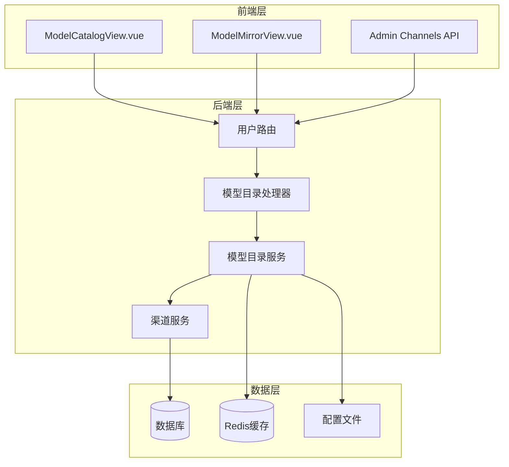
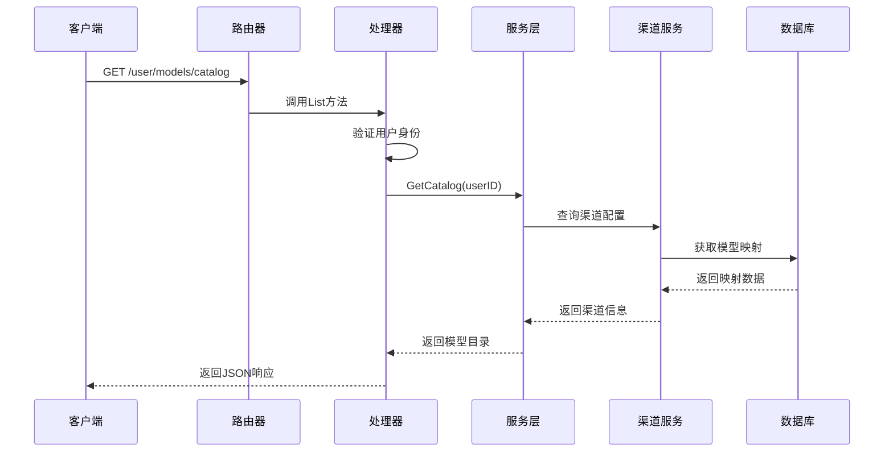
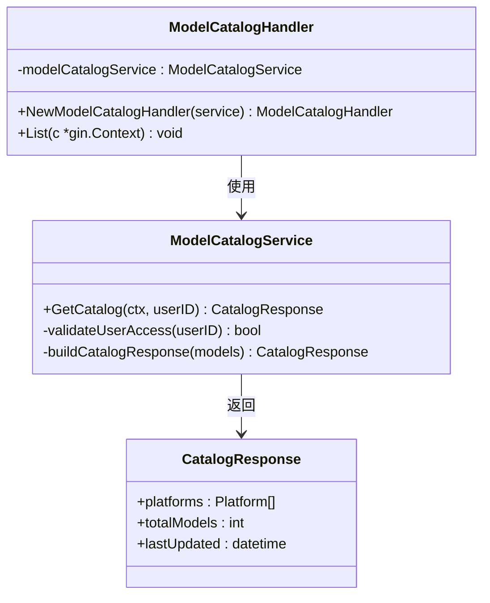
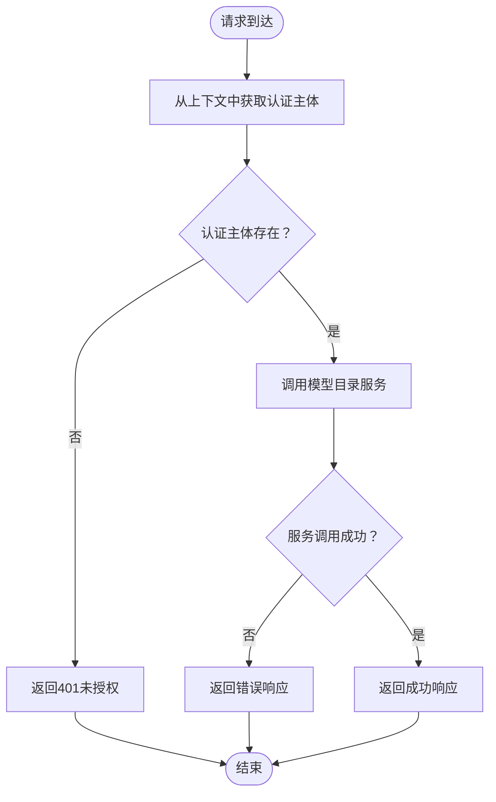
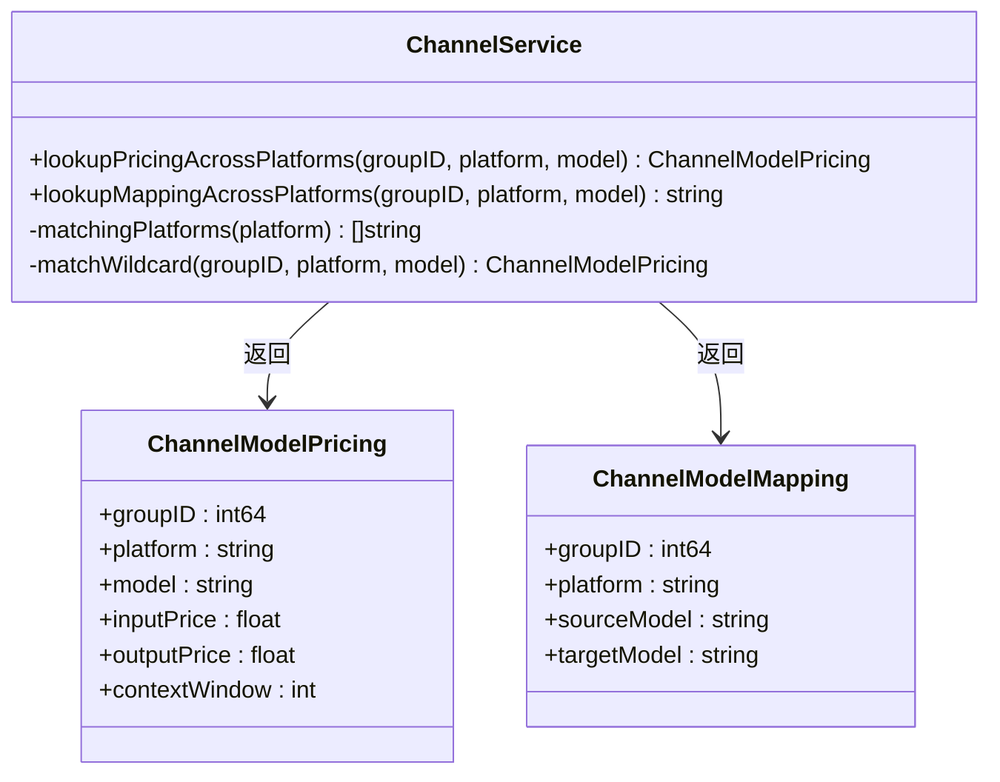
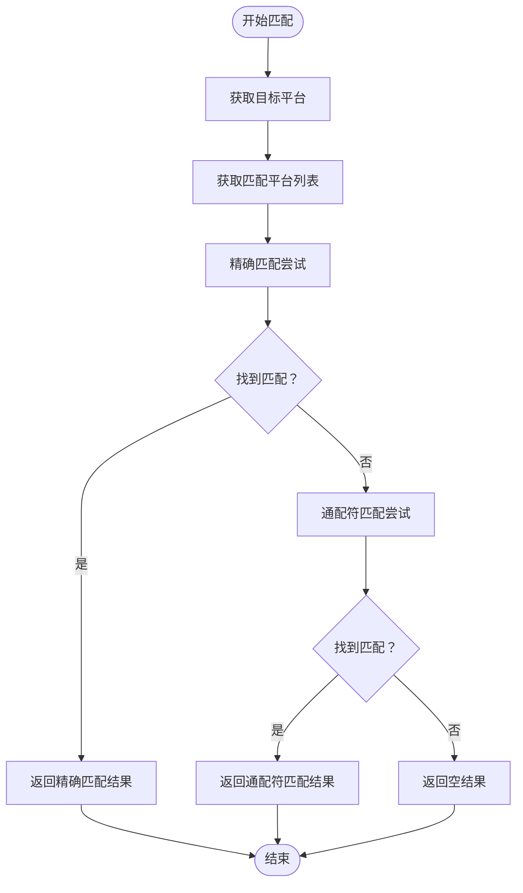
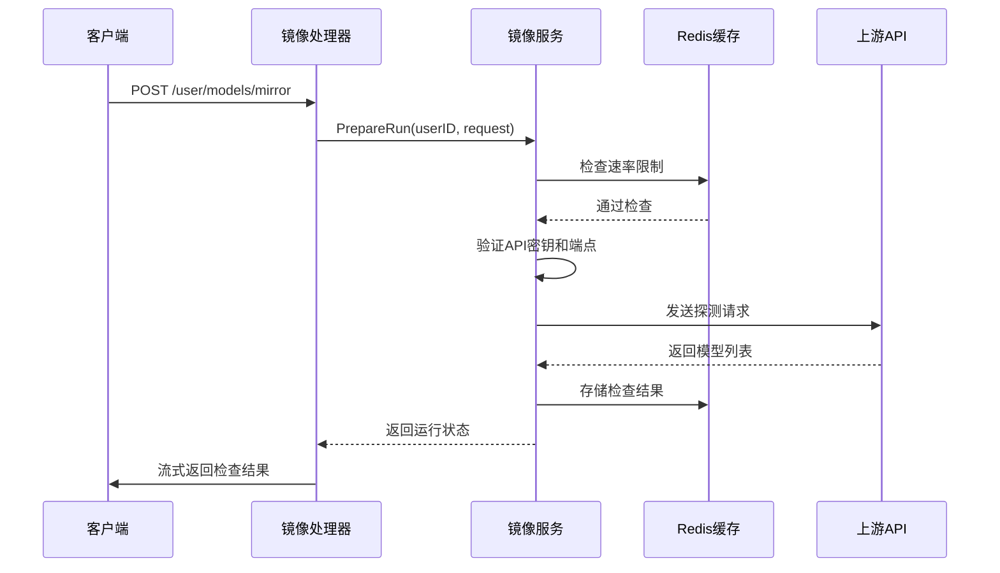
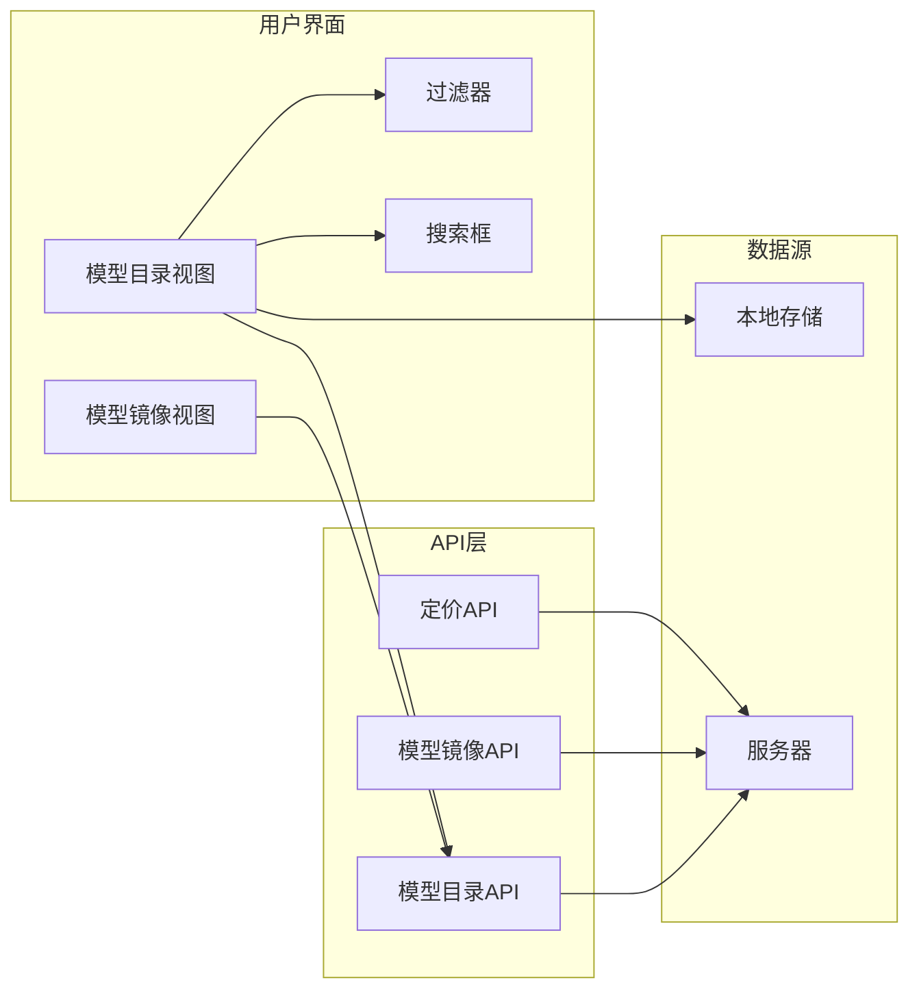
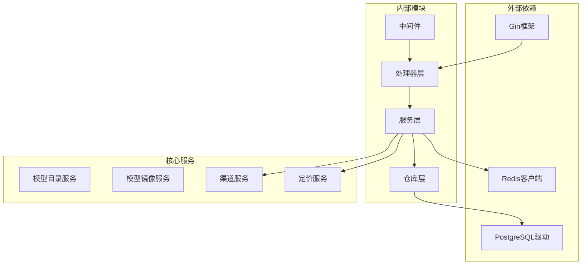
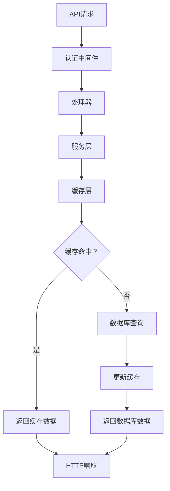

# 模型目录API

<cite>
**本文档引用的文件**
- [backend/internal/handler/model_catalog_handler.go](file://backend/internal/handler/model_catalog_handler.go)
- [backend/internal/service/model_catalog_service.go](file://backend/internal/service/model_catalog_service.go)
- [backend/internal/server/routes/user.go](file://backend/internal/server/routes/user.go)
- [backend/internal/handler/model_mirror_handler.go](file://backend/internal/handler/model_mirror_handler.go)
- [backend/internal/service/model_mirror_service.go](file://backend/internal/service/model_mirror_service.go)
- [backend/internal/service/channel_service.go](file://backend/internal/service/channel_service.go)
- [backend/migrations/086_channel_platform_pricing.sql](file://backend/migrations/086_channel_platform_pricing.sql)
- [backend/resources/model-pricing/model_prices_and_context_window.json](file://backend/resources/model-pricing/model_prices_and_context_window.json)
- [frontend/src/views/user/ModelCatalogView.vue](file://frontend/src/views/user/ModelCatalogView.vue)
- [frontend/src/views/user/ModelMirrorView.vue](file://frontend/src/views/user/ModelMirrorView.vue)
- [frontend/src/api/admin/channels.ts](file://frontend/src/api/admin/channels.ts)
- [backend/internal/handler/handler.go](file://backend/internal/handler/handler.go)
- [backend/internal/handler/wire.go](file://backend/internal/handler/wire.go)
</cite>

## 目录
1. [简介](#简介)
2. [项目结构](#项目结构)
3. [核心组件](#核心组件)
4. [架构概览](#架构概览)
5. [详细组件分析](#详细组件分析)
6. [依赖关系分析](#依赖关系分析)
7. [性能考虑](#性能考虑)
8. [故障排除指南](#故障排除指南)
9. [结论](#结论)
10. [附录](#附录)

## 简介
本文档详细记录了模型目录API的完整技术实现，涵盖可用模型查询、模型详情、平台映射、价格信息等所有相关端点。系统实现了多平台模型目录管理，支持模型能力对比、兼容性检查、动态配置等功能，并提供了模型选择策略、价格比较、性能评估的API使用示例和最佳实践。

## 项目结构
模型目录API位于后端服务的用户路由下，通过Gin框架提供RESTful接口。前端通过Vue.js实现用户界面，支持模型目录浏览和镜像检测功能。

**图表来源**
- [backend/internal/server/routes/user.go:108](file://backend/internal/server/routes/user.go#L108)
- [backend/internal/handler/model_catalog_handler.go:18](file://backend/internal/handler/model_catalog_handler.go#L18)
- [backend/internal/service/model_catalog_service.go:129](file://backend/internal/service/model_catalog_service.go#L129)

**章节来源**
- [backend/internal/server/routes/user.go:108](file://backend/internal/server/routes/user.go#L108)
- [backend/internal/handler/model_catalog_handler.go:18](file://backend/internal/handler/model_catalog_handler.go#L18)

## 核心组件
模型目录API由以下核心组件构成：

### 处理器层
- **ModelCatalogHandler**: 负责处理模型目录查询请求
- **ModelMirrorHandler**: 负责处理模型镜像验证请求

### 服务层
- **ModelCatalogService**: 提供模型目录查询和管理功能
- **ModelMirrorService**: 提供模型兼容性检查和镜像验证功能

### 数据层
- **ChannelService**: 管理渠道配置、平台映射和价格信息
- **PriceService**: 处理模型定价和上下文窗口配置

**章节来源**
- [backend/internal/handler/model_catalog_handler.go:10](file://backend/internal/handler/model_catalog_handler.go#L10)
- [backend/internal/handler/model_mirror_handler.go:10](file://backend/internal/handler/model_mirror_handler.go#L10)
- [backend/internal/service/model_catalog_service.go:129](file://backend/internal/service/model_catalog_service.go#L129)

## 架构概览
模型目录API采用分层架构设计，实现了清晰的关注点分离和职责划分。

**图表来源**
- [backend/internal/server/routes/user.go:108](file://backend/internal/server/routes/user.go#L108)
- [backend/internal/handler/model_catalog_handler.go:18](file://backend/internal/handler/model_catalog_handler.go#L18)
- [backend/internal/service/model_catalog_service.go:129](file://backend/internal/service/model_catalog_service.go#L129)

## 详细组件分析

### 模型目录处理器
模型目录处理器负责处理用户发起的模型查询请求，实现了完整的认证和授权机制。

**图表来源**
- [backend/internal/handler/model_catalog_handler.go:10](file://backend/internal/handler/model_catalog_handler.go#L10)
- [backend/internal/service/model_catalog_service.go:129](file://backend/internal/service/model_catalog_service.go#L129)

#### 认证流程
处理器实现了基于JWT的用户认证机制，确保只有已认证用户才能访问模型目录。

**图表来源**
- [backend/internal/handler/model_catalog_handler.go:18](file://backend/internal/handler/model_catalog_handler.go#L18)

**章节来源**
- [backend/internal/handler/model_catalog_handler.go:18](file://backend/internal/handler/model_catalog_handler.go#L18)

### 渠道服务与平台映射
渠道服务实现了复杂的平台映射和定价逻辑，支持多平台模型的统一管理。

**图表来源**
- [backend/internal/service/channel_service.go:368](file://backend/internal/service/channel_service.go#L368)
- [backend/internal/service/channel_service.go:388](file://backend/internal/service/channel_service.go#L388)

#### 平台匹配算法
系统实现了智能的平台匹配算法，支持精确匹配和通配符匹配两种模式。

**图表来源**
- [backend/internal/service/channel_service.go:368](file://backend/internal/service/channel_service.go#L368)

**章节来源**
- [backend/internal/service/channel_service.go:368](file://backend/internal/service/channel_service.go#L368)
- [backend/internal/service/channel_service.go:388](file://backend/internal/service/channel_service.go#L388)

### 模型镜像服务
模型镜像服务提供了强大的模型兼容性检查功能，帮助用户验证第三方API的模型支持情况。

**图表来源**
- [backend/internal/handler/model_mirror_handler.go:20](file://backend/internal/handler/model_mirror_handler.go#L20)
- [backend/internal/service/model_mirror_service.go:142](file://backend/internal/service/model_mirror_service.go#L142)

#### 速率限制机制
模型镜像服务实现了严格的速率限制，防止滥用和资源耗尽。

| 维度 | 限制值 | 说明 |
|------|--------|------|
| 时间窗口 | 10分钟 | 评估周期长度 |
| 最大请求数 | 3次 | 单用户最大调用次数 |
| 锁定时间 | 10分钟 | 临时锁定时长 |
| 主超时 | 90秒 | 主要操作超时时间 |
| 探测超时 | 30秒 | 模型探测超时时间 |

**章节来源**
- [backend/internal/service/model_mirror_service.go:23](file://backend/internal/service/model_mirror_service.go#L23)

### 前端集成
前端实现了完整的模型目录展示和交互功能，支持多种平台的模型浏览和筛选。

**图表来源**
- [frontend/src/views/user/ModelCatalogView.vue:57](file://frontend/src/views/user/ModelCatalogView.vue#L57)
- [frontend/src/views/user/ModelMirrorView.vue:57](file://frontend/src/views/user/ModelMirrorView.vue#L57)

**章节来源**
- [frontend/src/views/user/ModelCatalogView.vue:57](file://frontend/src/views/user/ModelCatalogView.vue#L57)
- [frontend/src/views/user/ModelMirrorView.vue:57](file://frontend/src/views/user/ModelMirrorView.vue#L57)

## 依赖关系分析

**图表来源**
- [backend/internal/handler/handler.go:37](file://backend/internal/handler/handler.go#L37)
- [backend/internal/handler/wire.go:91](file://backend/internal/handler/wire.go#L91)

### 数据流分析
系统实现了复杂的数据流管理，确保模型信息的一致性和实时性。

**图表来源**
- [backend/internal/service/model_catalog_service.go:129](file://backend/internal/service/model_catalog_service.go#L129)

**章节来源**
- [backend/internal/handler/handler.go:37](file://backend/internal/handler/handler.go#L37)
- [backend/internal/handler/wire.go:91](file://backend/internal/handler/wire.go#L91)

## 性能考虑
模型目录API在设计时充分考虑了性能优化，采用了多种策略来提升响应速度和系统稳定性。

### 缓存策略
- **多级缓存**: 实现了Redis缓存和内存缓存的双重保护
- **智能过期**: 不同类型的数据设置不同的过期时间
- **预热机制**: 系统启动时自动预加载常用模型数据

### 并发控制
- **连接池**: 数据库连接采用池化管理，避免频繁创建销毁
- **限流机制**: 对热点接口实施流量控制，防止系统过载
- **异步处理**: 非关键操作采用异步执行，提升用户体验

### 优化建议
1. **CDN加速**: 对静态模型图片和元数据使用CDN分发
2. **数据库索引**: 为常用查询字段建立复合索引
3. **批量查询**: 支持批量模型查询减少网络往返
4. **压缩传输**: 启用Gzip压缩减少带宽消耗

## 故障排除指南

### 常见问题诊断
| 问题类型 | 症状 | 可能原因 | 解决方案 |
|----------|------|----------|----------|
| 认证失败 | 401未授权 | JWT令牌无效或过期 | 检查令牌格式和有效期 |
| 数据查询失败 | 500服务器错误 | 数据库连接异常 | 检查数据库连接状态 |
| 缓存失效 | 数据不一致 | 缓存过期或损坏 | 清理缓存并重新加载 |
| 平台映射错误 | 模型名称不匹配 | 映射配置错误 | 检查渠道配置和映射规则 |

### 调试工具
- **日志分析**: 查看服务日志定位具体错误
- **监控指标**: 监控响应时间、错误率等关键指标
- **性能分析**: 使用pprof分析CPU和内存使用情况

**章节来源**
- [backend/internal/service/model_mirror_service.go:142](file://backend/internal/service/model_mirror_service.go#L142)

## 结论
模型目录API提供了一个完整、高效、可扩展的模型管理解决方案。通过多平台支持、智能映射、动态定价和强大的兼容性检查功能，系统能够满足各种复杂的模型管理需求。建议在生产环境中结合监控和告警机制，确保系统的稳定运行。

## 附录

### API端点规范

#### 模型目录查询
- **端点**: `GET /user/models/catalog`
- **认证**: 需要用户登录
- **响应**: 包含所有可用模型的完整信息

#### 模型镜像验证
- **端点**: `POST /user/models/mirror`
- **请求体**: 包含上游API的端点、密钥和模型信息
- **响应**: 流式返回模型兼容性检查结果

### 配置文件说明
系统使用JSON格式的配置文件来管理模型价格和上下文窗口信息，支持灵活的价格配置和模型参数调整。

**章节来源**
- [backend/resources/model-pricing/model_prices_and_context_window.json](file://backend/resources/model-pricing/model_prices_and_context_window.json#L1)
- [backend/migrations/086_channel_platform_pricing.sql](file://backend/migrations/086_channel_platform_pricing.sql#L1)