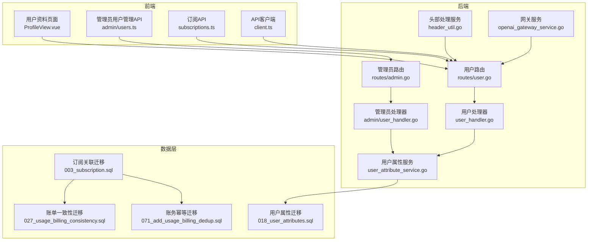
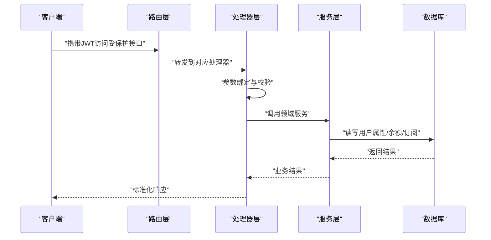
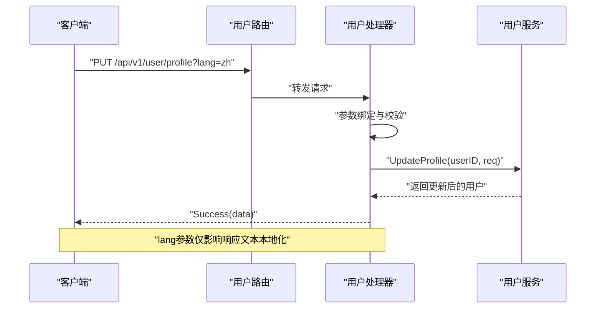
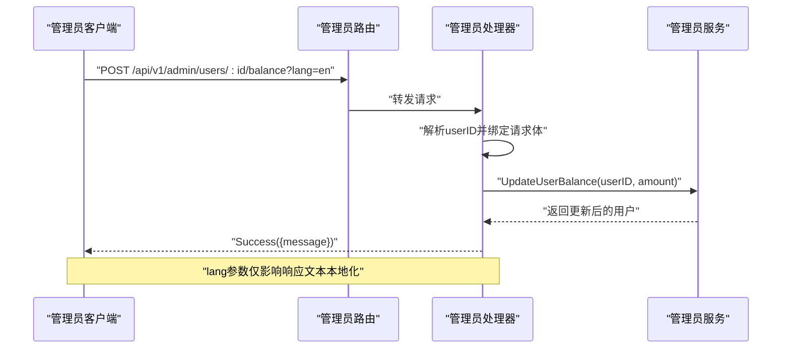
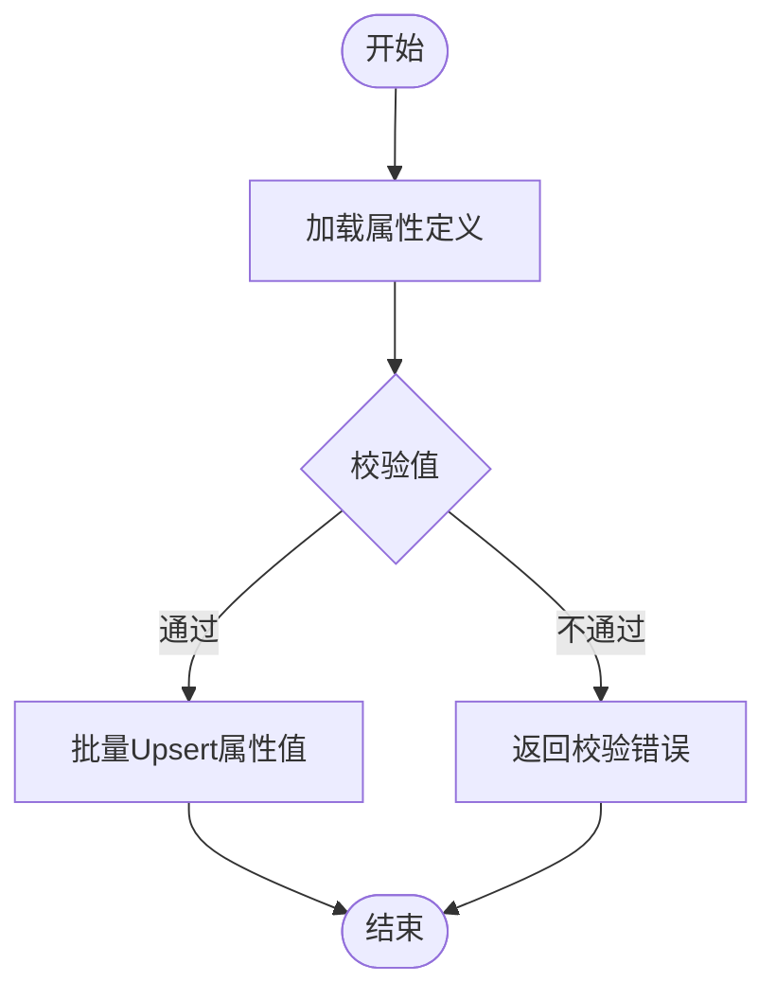
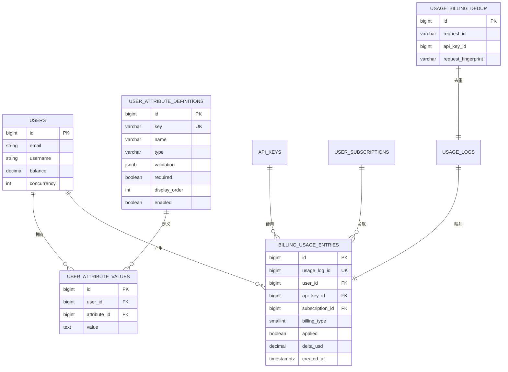
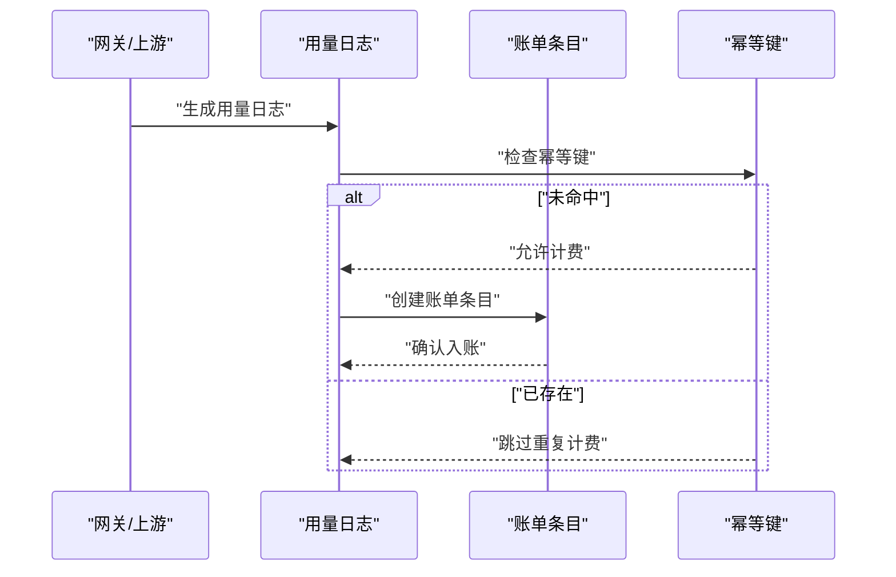
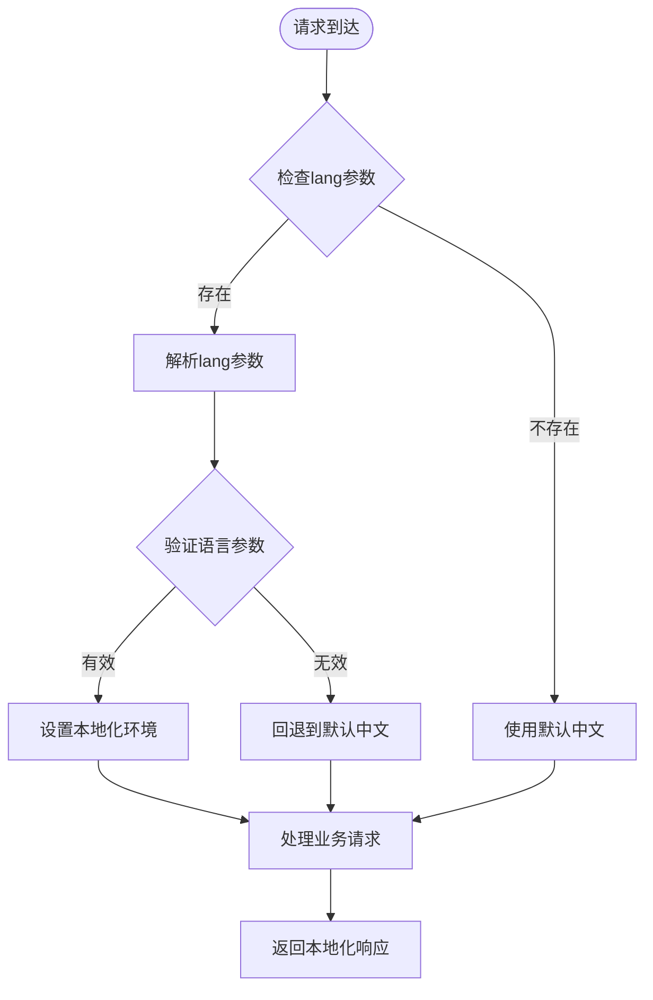
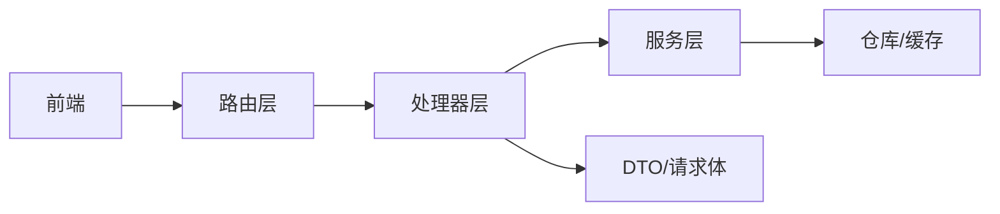

# 用户管理API

<cite>
**本文档引用的文件**
- [backend/internal/server/routes/user.go](file://backend/internal/server/routes/user.go)
- [backend/internal/server/routes/admin.go](file://backend/internal/server/routes/admin.go)
- [backend/internal/handler/user_handler.go](file://backend/internal/handler/user_handler.go)
- [backend/internal/handler/admin/user_handler.go](file://backend/internal/handler/admin/user_handler.go)
- [backend/internal/service/user_attribute_service.go](file://backend/internal/service/user_attribute_service.go)
- [backend/migrations/018_user_attributes.sql](file://backend/migrations/018_user_attributes.sql)
- [backend/migrations/003_subscription.sql](file://backend/migrations/003_subscription.sql)
- [backend/migrations/027_usage_billing_consistency.sql](file://backend/migrations/027_usage_billing_consistency.sql)
- [backend/migrations/071_add_usage_billing_dedup.sql](file://backend/migrations/071_add_usage_billing_dedup.sql)
- [backend/internal/server/api_contract_test.go](file://backend/internal/server/api_contract_test.go)
- [frontend/src/views/user/ProfileView.vue](file://frontend/src/views/user/ProfileView.vue)
- [frontend/src/api/admin/users.ts](file://frontend/src/api/admin/users.ts)
- [frontend/src/api/subscriptions.ts](file://frontend/src/api/subscriptions.ts)
- [frontend/src/api/client.ts](file://frontend/src/api/client.ts)
- [backend/internal/service/header_util.go](file://backend/internal/service/header_util.go)
- [backend/internal/service/openai_gateway_service.go](file://backend/internal/service/openai_gateway_service.go)
- [backend/internal/repository/claude_oauth_service.go](file://backend/internal/repository/claude_oauth_service.go)
</cite>

## 更新摘要
**所做更改**
- 新增语言参数处理章节，说明本地化参数处理逻辑改进
- 更新用户资料与个人设置章节，增加lang参数说明
- 更新管理员用户管理与余额章节，增加lang参数说明
- 更新API使用示例，补充语言参数使用说明
- 新增语言参数处理的技术细节说明

## 目录
1. [简介](#简介)
2. [项目结构](#项目结构)
3. [核心组件](#核心组件)
4. [架构总览](#架构总览)
5. [详细组件分析](#详细组件分析)
6. [语言参数处理机制](#语言参数处理机制)
7. [依赖分析](#依赖分析)
8. [性能考虑](#性能考虑)
9. [故障排除指南](#故障排除指南)
10. [结论](#结论)
11. [附录](#附录)

## 简介
本文件系统化梳理用户管理API的设计与实现，覆盖用户资料管理、个人设置、自定义属性配置、余额查询与变动记录等能力，并明确请求参数校验、响应数据结构、权限控制机制。同时给出用户自助服务的API使用示例，说明与订阅系统的关联关系及数据一致性保障。

**重要更新**：用户管理API现已改进本地化参数处理逻辑，移除了对Accept-Language头的依赖，现在仅基于显式lang参数进行语言控制。

## 项目结构
用户管理API由后端路由层、处理器层、服务层与数据库迁移共同组成，前端通过API客户端调用后端接口，形成完整的用户自助与后台管理闭环。

**图表来源**
- [backend/internal/server/routes/user.go:11-49](file://backend/internal/server/routes/user.go#L11-L49)
- [backend/internal/server/routes/admin.go:213-231](file://backend/internal/server/routes/admin.go#L213-L231)
- [backend/internal/handler/user_handler.go:50-106](file://backend/internal/handler/user_handler.go#L50-L106)
- [backend/internal/handler/admin/user_handler.go:170-259](file://backend/internal/handler/admin/user_handler.go#L170-L259)
- [backend/internal/service/user_attribute_service.go:152-237](file://backend/internal/service/user_attribute_service.go#L152-L237)
- [backend/internal/service/header_util.go:34](file://backend/internal/service/header_util.go#L34)
- [backend/internal/service/openai_gateway_service.go:63](file://backend/internal/service/openai_gateway_service.go#L63)
- [backend/migrations/018_user_attributes.sql:1-48](file://backend/migrations/018_user_attributes.sql#L1-L48)
- [backend/migrations/003_subscription.sql:56-65](file://backend/migrations/003_subscription.sql#L56-L65)
- [backend/migrations/027_usage_billing_consistency.sql:35-57](file://backend/migrations/027_usage_billing_consistency.sql#L35-L57)
- [backend/migrations/071_add_usage_billing_dedup.sql:1-13](file://backend/migrations/071_add_usage_billing_dedup.sql#L1-L13)

**章节来源**
- [backend/internal/server/routes/user.go:11-49](file://backend/internal/server/routes/user.go#L11-L49)
- [backend/internal/server/routes/admin.go:213-231](file://backend/internal/server/routes/admin.go#L213-L231)

## 核心组件
- 路由层：分别在用户域与管理员域注册认证保护的路由，统一前缀为/api/v1。
- 处理器层：实现具体业务逻辑，负责参数绑定、鉴权校验与错误处理。
- 服务层：封装领域服务，如用户属性的定义与值管理、余额与订阅状态等。
- 数据层：通过迁移脚本建立用户属性、订阅关联与账单一致性等表结构。

**章节来源**
- [backend/internal/handler/user_handler.go:50-106](file://backend/internal/handler/user_handler.go#L50-L106)
- [backend/internal/handler/admin/user_handler.go:170-259](file://backend/internal/handler/admin/user_handler.go#L170-L259)
- [backend/internal/service/user_attribute_service.go:152-237](file://backend/internal/service/user_attribute_service.go#L152-L237)

## 架构总览
用户管理API采用分层架构，前端通过认证令牌访问后端接口；后端路由根据角色区分用户自助与管理员管理功能；服务层协调仓库与缓存，确保余额与订阅状态的一致性。

**图表来源**
- [backend/internal/server/routes/user.go:18-39](file://backend/internal/server/routes/user.go#L18-L39)
- [backend/internal/handler/user_handler.go:50-106](file://backend/internal/handler/user_handler.go#L50-L106)
- [backend/internal/handler/admin/user_handler.go:170-259](file://backend/internal/handler/admin/user_handler.go#L170-L259)

## 详细组件分析

### 用户资料与个人设置
- 接口列表
  - 获取当前用户资料：GET /api/v1/user/profile
  - 更新当前用户资料：PUT /api/v1/user/profile
  - 修改密码：PUT /api/v1/user/password
  - TOTP相关：GET/POST /api/v1/user/totp/*
- 语言参数支持
  - 支持显式lang参数：lang=zh 或 lang=en
  - 移除了对Accept-Language头的依赖
  - 语言参数仅影响响应文本的本地化，不影响其他业务逻辑
- 权限控制
  - 需要JWT认证，且处于用户模式（非后台维护模式）。
- 参数与响应
  - 更新资料请求体包含用户名等字段；修改密码请求体包含旧密码与新密码。
  - 成功时返回标准化成功响应或更新后的用户对象。
- 错误处理
  - 认证失败、参数非法、业务异常均返回相应错误码与消息。

**图表来源**
- [backend/internal/server/routes/user.go:22-39](file://backend/internal/server/routes/user.go#L22-L39)
- [backend/internal/handler/user_handler.go:81-106](file://backend/internal/handler/user_handler.go#L81-L106)

**章节来源**
- [backend/internal/server/routes/user.go:18-39](file://backend/internal/server/routes/user.go#L18-L39)
- [backend/internal/handler/user_handler.go:50-106](file://backend/internal/handler/user_handler.go#L50-L106)

### 管理员用户管理与余额
- 接口列表
  - 列表/详情：GET /api/v1/admin/users
  - 创建：POST /api/v1/admin/users
  - 更新：PUT /api/v1/admin/users/:id
  - 删除：DELETE /api/v1/admin/users/:id
  - 更新余额：POST /api/v1/admin/users/:id/balance
  - 用户API密钥：GET /api/v1/admin/users/:id/api-keys
  - 用户用量：GET /api/v1/admin/users/:id/usage
  - 余额历史：GET /api/v1/admin/users/:id/balance-history
  - 替换分组：POST /api/v1/admin/users/:id/replace-group
- 语言参数支持
  - 支持显式lang参数：lang=zh 或 lang=en
  - 移除了对Accept-Language头的依赖
  - 语言参数仅影响响应文本的本地化，不影响其他业务逻辑
- 权限控制
  - 需要管理员角色。
- 参数与响应
  - 创建/更新请求体包含邮箱、密码、用户名、备注、余额、并发限制、允许分组等字段。
  - 余额变更支持批量与单次操作；余额历史返回充值、使用等明细。
- 错误处理
  - 用户ID非法、请求体校验失败、业务异常等均有明确错误码。

**图表来源**
- [backend/internal/server/routes/admin.go:213-231](file://backend/internal/server/routes/admin.go#L213-L231)
- [backend/internal/handler/admin/user_handler.go:252-259](file://backend/internal/handler/admin/user_handler.go#L252-L259)

**章节来源**
- [backend/internal/server/routes/admin.go:213-231](file://backend/internal/server/routes/admin.go#L213-L231)
- [backend/internal/handler/admin/user_handler.go:170-259](file://backend/internal/handler/admin/user_handler.go#L170-L259)

### 自定义属性配置与值管理
- 功能概述
  - 支持定义属性（名称、类型、必填、校验规则、显示顺序等），并为用户批量设置属性值。
  - 属性值按用户维度唯一存储，支持字符串/数字类型与长度、范围等校验。
- 数据模型
  - 定义表：键、名称、描述、类型、选项、必填、校验、占位符、显示顺序、启用状态等。
  - 值表：用户ID、属性ID、值、时间戳，唯一约束(user_id, attribute_id)。
- 服务流程
  - 定义管理：创建、更新、删除（软删除，关联值硬删除）、重排显示顺序。
  - 值管理：批量插入/更新，按定义进行格式与范围校验。

**图表来源**
- [backend/internal/service/user_attribute_service.go:152-237](file://backend/internal/service/user_attribute_service.go#L152-L237)
- [backend/migrations/018_user_attributes.sql:1-48](file://backend/migrations/018_user_attributes.sql#L1-L48)

**章节来源**
- [backend/internal/service/user_attribute_service.go:152-237](file://backend/internal/service/user_attribute_service.go#L152-L237)
- [backend/migrations/018_user_attributes.sql:1-48](file://backend/migrations/018_user_attributes.sql#L1-L48)

### 余额查询与变动记录
- 余额查询
  - 用户自助：前端展示账户余额卡片，来源于后端用户资料与设置。
  - 管理员：通过余额历史接口查看充值、使用等明细。
- 余额变动
  - 管理员可通过更新余额接口调整用户余额。
  - 后端服务层与缓存配合，确保余额读写一致。
- 账单一致性与幂等
  - 通过账单条目表与幂等键表，确保用量计费不会重复入账。

**图表来源**
- [backend/migrations/018_user_attributes.sql:1-48](file://backend/migrations/018_user_attributes.sql#L1-L48)
- [backend/migrations/027_usage_billing_consistency.sql:35-57](file://backend/migrations/027_usage_billing_consistency.sql#L35-L57)
- [backend/migrations/071_add_usage_billing_dedup.sql:1-13](file://backend/migrations/071_add_usage_billing_dedup.sql#L1-L13)

**章节来源**
- [frontend/src/views/user/ProfileView.vue:1-43](file://frontend/src/views/user/ProfileView.vue#L1-L43)
- [frontend/src/api/admin/users.ts:147-203](file://frontend/src/api/admin/users.ts#L147-L203)
- [backend/migrations/027_usage_billing_consistency.sql:35-57](file://backend/migrations/027_usage_billing_consistency.sql#L35-L57)
- [backend/migrations/071_add_usage_billing_dedup.sql:1-13](file://backend/migrations/071_add_usage_billing_dedup.sql#L1-L13)

### 与订阅系统的关联与一致性
- 关联关系
  - usage_logs扩展了分组与订阅ID字段，并建立索引以支持高效查询。
  - 账单条目表记录每次用量对应的用户、API密钥、订阅与金额变动，确保对账一致。
- 一致性保障
  - 幂等键表避免重复计费；账单条目表提供审计线索。
  - 订阅进度与用量统计通过后端接口暴露，前端用于展示。

**图表来源**
- [backend/migrations/003_subscription.sql:56-65](file://backend/migrations/003_subscription.sql#L56-L65)
- [backend/migrations/027_usage_billing_consistency.sql:35-57](file://backend/migrations/027_usage_billing_consistency.sql#L35-L57)
- [backend/migrations/071_add_usage_billing_dedup.sql:1-13](file://backend/migrations/071_add_usage_billing_dedup.sql#L1-L13)

**章节来源**
- [backend/migrations/003_subscription.sql:56-65](file://backend/migrations/003_subscription.sql#L56-L65)
- [backend/migrations/027_usage_billing_consistency.sql:35-57](file://backend/migrations/027_usage_billing_consistency.sql#L35-L57)
- [backend/internal/server/api_contract_test.go:224-268](file://backend/internal/server/api_contract_test.go#L224-L268)

## 语言参数处理机制

### 本地化参数处理逻辑改进
用户管理API已移除对Accept-Language头的依赖，改为仅基于显式lang参数进行语言控制：

- **显式lang参数优先**：当提供lang参数时，系统使用该参数指定的语言
- **Accept-Language头忽略**：即使请求包含Accept-Language头，也会被忽略
- **默认语言处理**：当lang参数缺失时，默认使用中文(zh)
- **响应文本本地化**：仅影响响应中的文本内容本地化，不影响业务逻辑

### 语言参数处理流程

**图表来源**
- [backend/internal/service/header_util.go:34](file://backend/internal/service/header_util.go#L34)
- [backend/internal/service/openai_gateway_service.go:63](file://backend/internal/service/openai_gateway_service.go#L63)

### 语言参数支持范围
- **支持的语言**：zh（中文）、en（英文）
- **参数格式**：lang=zh 或 lang=en
- **默认行为**：未提供lang参数时使用中文
- **兼容性**：向后兼容现有API调用，但推荐显式指定lang参数

### 技术实现细节
- **头部处理**：系统保留Accept-Language头处理逻辑，但不再用于语言决策
- **网关服务**：OpenAI网关服务仍处理Accept-Language头，但不影响用户管理API
- **第三方集成**：Claude OAuth服务等第三方集成仍使用Accept-Language头

**章节来源**
- [backend/internal/service/header_util.go:34](file://backend/internal/service/header_util.go#L34)
- [backend/internal/service/openai_gateway_service.go:63](file://backend/internal/service/openai_gateway_service.go#L63)
- [backend/internal/repository/claude_oauth_service.go:127](file://backend/internal/repository/claude_oauth_service.go#L127)

## 依赖分析
- 组件耦合
  - 路由层仅负责URL到处理器的映射，处理器依赖服务层完成业务逻辑。
  - 服务层依赖仓库与缓存，避免直接访问数据库。
- 外部依赖
  - JWT认证中间件提供身份与角色校验。
  - 前端通过API客户端调用后端接口，统一错误处理与国际化提示。

**图表来源**
- [backend/internal/server/routes/user.go:18-39](file://backend/internal/server/routes/user.go#L18-L39)
- [backend/internal/handler/user_handler.go:50-106](file://backend/internal/handler/user_handler.go#L50-L106)

**章节来源**
- [backend/internal/server/routes/user.go:18-39](file://backend/internal/server/routes/user.go#L18-L39)
- [backend/internal/handler/user_handler.go:50-106](file://backend/internal/handler/user_handler.go#L50-L106)

## 性能考虑
- 缓存与单飞（singleflight）
  - 余额与订阅缓存支持缓存穿透防护与并发去抖，降低数据库压力。
- 索引优化
  - 订阅与用量日志新增索引，提升查询效率。
- 幂等与去重
  - 幂等键表避免重复计费，减少无效写入。

**章节来源**
- [backend/migrations/003_subscription.sql:56-65](file://backend/migrations/003_subscription.sql#L56-L65)
- [backend/migrations/071_add_usage_billing_dedup.sql:1-13](file://backend/migrations/071_add_usage_billing_dedup.sql#L1-L13)

## 故障排除指南
- 常见错误
  - 认证失败：检查JWT是否有效、用户状态是否正常。
  - 参数非法：核对请求体字段类型与长度，参考接口定义。
  - 业务异常：查看后端错误码与消息，定位具体原因。
- 建议排查步骤
  - 确认路由前缀与路径正确。
  - 检查权限角色与认证中间件是否生效。
  - 查看服务层日志与数据库事务回滚情况。

**章节来源**
- [backend/internal/server/middleware/jwt_auth_test.go:188-224](file://backend/internal/server/middleware/jwt_auth_test.go#L188-L224)
- [backend/internal/server/api_contract_test.go:662-709](file://backend/internal/server/api_contract_test.go#L662-L709)

## 结论
用户管理API通过清晰的分层设计与完善的权限控制，实现了用户资料、个人设置、自定义属性与余额管理等核心能力；结合订阅系统与账单一致性机制，确保用量计费的准确性与可追溯性。**最新改进**包括本地化参数处理逻辑优化，移除了对Accept-Language头的依赖，现在仅基于显式lang参数进行语言控制，提高了API的可控性和一致性。建议在生产环境中配合缓存与幂等策略，持续优化查询性能与数据一致性。

## 附录
- API使用示例（用户自助）
  - 获取当前用户资料：GET /api/v1/user/profile?lang=zh
  - 更新个人资料：PUT /api/v1/user/profile?lang=en
  - 修改密码：PUT /api/v1/user/password?lang=zh
  - 查看余额：前端ProfileView展示账户余额
- API使用示例（管理员）
  - 查询余额历史：GET /api/v1/admin/users/:id/balance-history?lang=en
  - 更新余额：POST /api/v1/admin/users/:id/balance?lang=zh
  - 用户属性管理：GET/PUT /api/v1/admin/users/:id/attributes?lang=en
- 语言参数使用指南
  - 显式指定语言：lang=zh 或 lang=en
  - 默认语言：未提供lang参数时使用中文
  - 兼容性：向后兼容现有API调用

**章节来源**
- [frontend/src/views/user/ProfileView.vue:1-43](file://frontend/src/views/user/ProfileView.vue#L1-L43)
- [frontend/src/api/admin/users.ts:147-203](file://frontend/src/api/admin/users.ts#L147-L203)
- [backend/internal/server/routes/user.go:22-39](file://backend/internal/server/routes/user.go#L22-L39)
- [backend/internal/server/routes/admin.go:213-231](file://backend/internal/server/routes/admin.go#L213-L231)
- [frontend/src/api/client.ts:55-81](file://frontend/src/api/client.ts#L55-L81)