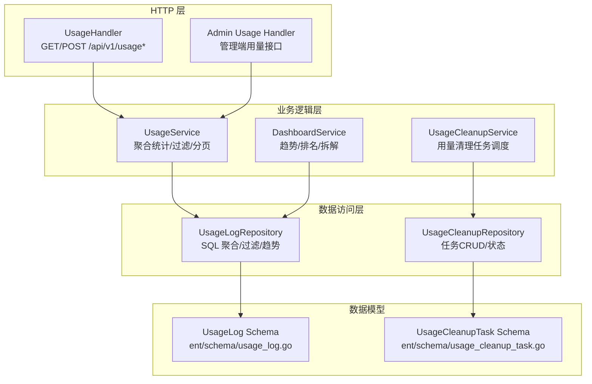
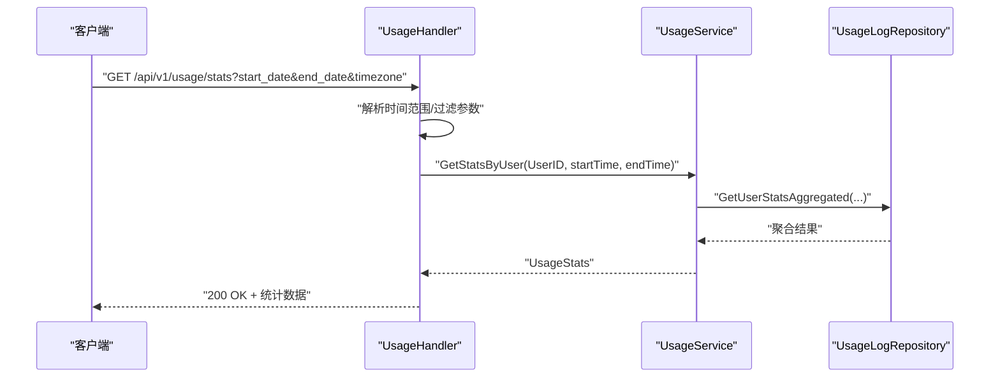
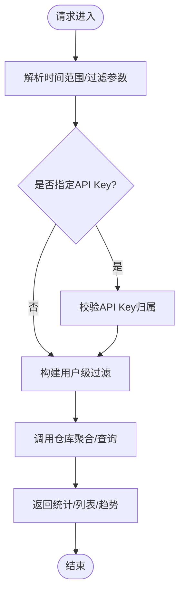
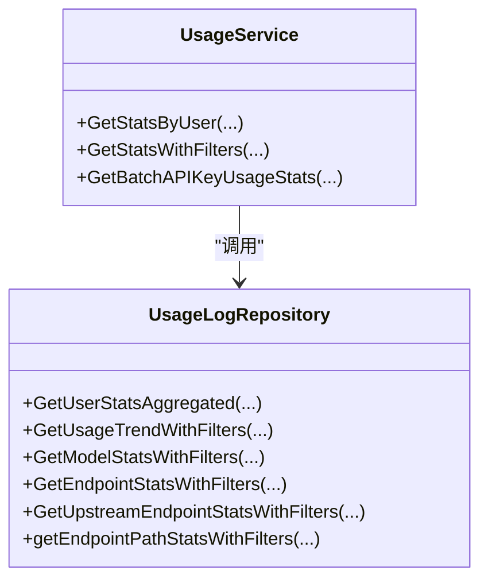
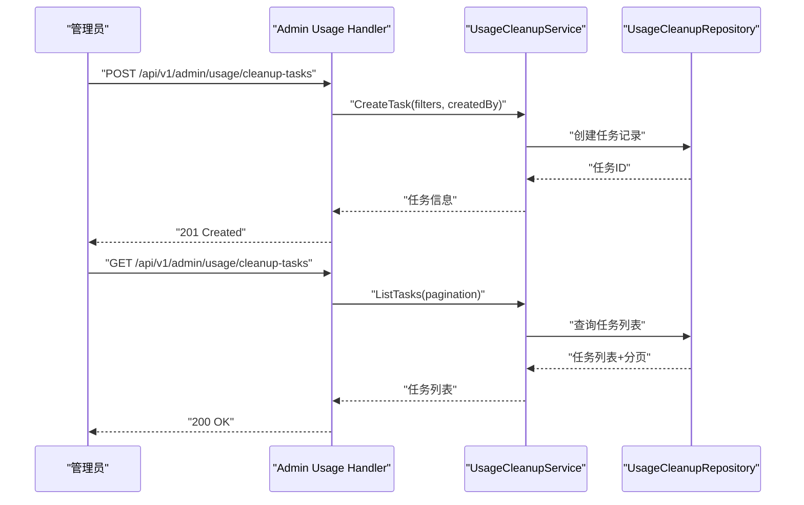
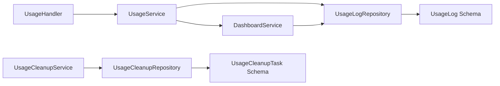

# 用量统计API

<cite>
**本文引用的文件**
- [backend/internal/handler/usage_handler.go](file://backend/internal/handler/usage_handler.go)
- [backend/internal/service/usage_service.go](file://backend/internal/service/usage_service.go)
- [backend/internal/repository/usage_log_repo.go](file://backend/internal/repository/usage_log_repo.go)
- [backend/internal/service/dashboard_service.go](file://backend/internal/service/dashboard_service.go)
- [backend/internal/service/usage_cleanup_service.go](file://backend/internal/service/usage_cleanup_service.go)
- [backend/internal/repository/usage_cleanup_repo.go](file://backend/internal/repository/usage_cleanup_repo.go)
- [backend/internal/pkg/usagestats/usage_log_types.go](file://backend/internal/pkg/usagestats/usage_log_types.go)
- [backend/ent/schema/usage_log.go](file://backend/ent/schema/usage_log.go)
- [backend/ent/schema/usage_cleanup_task.go](file://backend/ent/schema/usage_cleanup_task.go)
- [backend/internal/handler/admin/usage_handler.go](file://backend/internal/handler/admin/usage_handler.go)
- [backend/internal/handler/admin/usage_cleanup_handler_test.go](file://backend/internal/handler/admin/usage_cleanup_handler_test.go)
- [backend/internal/repository/usage_log_repo_integration_test.go](file://backend/internal/repository/usage_log_repo_integration_test.go)
</cite>

## 目录
1. [简介](#简介)
2. [项目结构](#项目结构)
3. [核心组件](#核心组件)
4. [架构总览](#架构总览)
5. [详细组件分析](#详细组件分析)
6. [依赖分析](#依赖分析)
7. [性能考虑](#性能考虑)
8. [故障排查指南](#故障排查指南)
9. [结论](#结论)
10. [附录](#附录)

## 简介
本文件系统化梳理“用量统计API”的设计与实现，覆盖用量查询、统计报表、历史记录、配额监控、实时用量更新、历史用量回溯、用量预警与导出等能力。重点说明用量日志的数据结构、聚合计算、时间范围查询、分类统计、批量查询与趋势分析等实现细节，并提供查询示例、性能优化建议与大数据量处理最佳实践。

## 项目结构
用量统计API围绕三层架构组织：HTTP层（Handler）、业务逻辑层（Service）、数据访问层（Repository），并辅以预聚合与清理任务保障性能与成本控制。

图表来源
- [backend/internal/handler/usage_handler.go:19-414](file://backend/internal/handler/usage_handler.go#L19-L414)
- [backend/internal/service/usage_service.go:55-361](file://backend/internal/service/usage_service.go#L55-L361)
- [backend/internal/repository/usage_log_repo.go:134-200](file://backend/internal/repository/usage_log_repo.go#L134-L200)
- [backend/internal/service/dashboard_service.go:352-382](file://backend/internal/service/dashboard_service.go#L352-L382)
- [backend/internal/service/usage_cleanup_service.go:96-134](file://backend/internal/service/usage_cleanup_service.go#L96-L134)
- [backend/internal/repository/usage_cleanup_repo.go:424-465](file://backend/internal/repository/usage_cleanup_repo.go#L424-L465)
- [backend/ent/schema/usage_log.go:1-200](file://backend/ent/schema/usage_log.go#L1-L200)
- [backend/ent/schema/usage_cleanup_task.go:1-200](file://backend/ent/schema/usage_cleanup_task.go#L1-L200)

章节来源
- [backend/internal/handler/usage_handler.go:19-414](file://backend/internal/handler/usage_handler.go#L19-L414)
- [backend/internal/service/usage_service.go:55-361](file://backend/internal/service/usage_service.go#L55-L361)
- [backend/internal/repository/usage_log_repo.go:134-200](file://backend/internal/repository/usage_log_repo.go#L134-L200)

## 核心组件
- 用量日志实体与字段：涵盖输入/输出/缓存/图片等Token与成本、请求类型、是否流式、耗时、UA/IP、镜像数量/尺寸、服务层级、推理努力、端点、渠道、计费模式/层级等。
- 用量统计服务：提供按用户/API Key/全局聚合统计、带过滤条件的统计、批量API Key统计、趋势与拆解等。
- 用量仓库：提供SQL聚合、过滤、分页、趋势、模型维度统计、端点/上游端点/路径统计等。
- 仪表盘服务：提供用户用量趋势、消费排名、维度拆解、批量用户用量统计。
- 清理服务：提供用量清理任务的创建、查询、取消、定时执行与配置。

章节来源
- [backend/ent/schema/usage_log.go:1-200](file://backend/ent/schema/usage_log.go#L1-L200)
- [backend/internal/service/usage_service.go:43-200](file://backend/internal/service/usage_service.go#L43-L200)
- [backend/internal/repository/usage_log_repo.go:31-108](file://backend/internal/repository/usage_log_repo.go#L31-L108)
- [backend/internal/service/dashboard_service.go:352-382](file://backend/internal/service/dashboard_service.go#L352-L382)
- [backend/internal/service/usage_cleanup_service.go:96-134](file://backend/internal/service/usage_cleanup_service.go#L96-L134)

## 架构总览
用量统计API遵循“Handler -> Service -> Repository -> 数据库”的调用链路，支持多维过滤、时间粒度聚合、趋势分析与批量查询；同时通过清理任务降低历史数据规模，提升查询性能。

图表来源
- [backend/internal/handler/usage_handler.go:177-261](file://backend/internal/handler/usage_handler.go#L177-L261)
- [backend/internal/service/usage_service.go:185-200](file://backend/internal/service/usage_service.go#L185-L200)
- [backend/internal/repository/usage_log_repo.go:2971-2987](file://backend/internal/repository/usage_log_repo.go#L2971-L2987)

## 详细组件分析

### 1) 用量查询与统计报表
- 端点
  - GET /api/v1/usage：分页列出当前用户用量记录，支持按API Key、模型、请求类型、是否流式、计费类型、起止日期过滤。
  - GET /api/v1/usage/stats：按用户或API Key统计总量、Token、成本、平均耗时等。
  - GET /api/v1/usage/dashboard/stats：用户仪表盘基础统计。
  - GET /api/v1/usage/dashboard/trend：用户用量趋势，支持粒度（hour/day/week/month）。
  - GET /api/v1/usage/dashboard/models：用户模型维度用量统计。
  - POST /api/v1/usage/dashboard/api-keys-usage：批量API Key用量统计。
- 时间范围与本地化
  - 支持 start_date/end_date（YYYY-MM-DD）与 period(today/week/month) 两种方式；自动根据 timezone 应用用户时区。
- 过滤与安全
  - 列表与统计均强制绑定当前用户；API Key过滤需验证归属，防止横向越权。
- 返回结构
  - 统计：总请求数、输入/输出/缓存Token、总Token、总成本、实际成本、平均耗时。
  - 趋势：按粒度聚合的时间序列点。
  - 模型/端点：按模型/端点/上游端点/路径的用量指标。

图表来源
- [backend/internal/handler/usage_handler.go:33-145](file://backend/internal/handler/usage_handler.go#L33-L145)
- [backend/internal/handler/usage_handler.go:177-261](file://backend/internal/handler/usage_handler.go#L177-L261)
- [backend/internal/handler/usage_handler.go:296-362](file://backend/internal/handler/usage_handler.go#L296-L362)
- [backend/internal/handler/usage_handler.go:369-413](file://backend/internal/handler/usage_handler.go#L369-L413)

章节来源
- [backend/internal/handler/usage_handler.go:33-145](file://backend/internal/handler/usage_handler.go#L33-L145)
- [backend/internal/handler/usage_handler.go:177-261](file://backend/internal/handler/usage_handler.go#L177-L261)
- [backend/internal/handler/usage_handler.go:296-362](file://backend/internal/handler/usage_handler.go#L296-L362)
- [backend/internal/handler/usage_handler.go:369-413](file://backend/internal/handler/usage_handler.go#L369-L413)

### 2) 用量日志数据结构与字段
- 关键字段
  - 用户/API Key/账号/分组/订阅标识
  - 模型（请求/上游/映射）、镜像输出Token与成本、图片数量/尺寸
  - Token（输入/输出/缓存创建/缓存读取）、成本（输入/输出/缓存创建/缓存读取/总计/实际）
  - 请求类型（枚举）、是否流式、WebSocket模式、耗时、首Token耗时
  - UA/IP地址、服务层级、推理努力、入站/上游端点、渠道、计费层级/模式
  - 创建时间（带时区）
- 字段一致性
  - 历史行可能存储上游/计费模型值，新行存储请求模型；分析时应使用模型维度表达式进行规范化。

章节来源
- [backend/ent/schema/usage_log.go:1-200](file://backend/ent/schema/usage_log.go#L1-L200)
- [backend/internal/repository/usage_log_repo.go:31-108](file://backend/internal/repository/usage_log_repo.go#L31-L108)
- [backend/internal/pkg/usagestats/usage_log_types.go:12-26](file://backend/internal/pkg/usagestats/usage_log_types.go#L12-L26)

### 3) 聚合计算与时间粒度
- 聚合维度
  - 用户/API Key/账号/分组/订阅
  - 模型（请求/上游/映射）、端点、上游端点、端点路径
  - 计费类型、请求类型、是否流式
- 时间粒度
  - hour/day/week/month，通过白名单映射到PostgreSQL TO_CHAR格式，避免注入。
- 趋势与拆解
  - 支持按天/小时粒度的趋势序列，以及按模型/端点/上游端点/路径的拆解统计。

图表来源
- [backend/internal/repository/usage_log_repo.go:2971-2987](file://backend/internal/repository/usage_log_repo.go#L2971-L2987)
- [backend/internal/service/usage_service.go:345-361](file://backend/internal/service/usage_service.go#L345-L361)

章节来源
- [backend/internal/repository/usage_log_repo.go:94-108](file://backend/internal/repository/usage_log_repo.go#L94-L108)
- [backend/internal/repository/usage_log_repo.go:2971-2987](file://backend/internal/repository/usage_log_repo.go#L2971-L2987)
- [backend/internal/service/usage_service.go:345-361](file://backend/internal/service/usage_service.go#L345-L361)

### 4) 实时用量更新与历史回溯
- 实时更新
  - 通过创建用量日志接口在事务中完成“日志写入+余额扣减”，确保原子性与一致性。
- 历史回溯
  - 通过时间范围与过滤条件回溯历史用量；仓库支持按小时粒度的趋势查询，便于定位异常波动。
- 查询示例
  - 获取用户近7天用量统计：start_date=“YYYY-MM-DD”，end_date=“YYYY-MM-DD” 或 period=“week”
  - 获取某API Key当日趋势：granularity=“hour”，start_date=“YYYY-MM-DD”，end_date=“YYYY-MM-DD”

章节来源
- [backend/internal/service/usage_service.go:73-140](file://backend/internal/service/usage_service.go#L73-L140)
- [backend/internal/repository/usage_log_repo_integration_test.go:1382-1399](file://backend/internal/repository/usage_log_repo_integration_test.go#L1382-L1399)
- [backend/internal/handler/usage_handler.go:33-145](file://backend/internal/handler/usage_handler.go#L33-L145)

### 5) 用量预警与导出
- 预警
  - 可结合仪表盘趋势与消费排名，设置阈值触发告警（建议在上层业务服务中实现）。
- 导出
  - 列表接口支持分页与过滤，可作为导出的基础数据源；建议在后台任务中生成CSV并提供下载链接。

章节来源
- [backend/internal/service/dashboard_service.go:352-382](file://backend/internal/service/dashboard_service.go#L352-L382)
- [backend/internal/handler/usage_handler.go:33-145](file://backend/internal/handler/usage_handler.go#L33-L145)

### 6) 管理端用量清理任务
- 端点
  - POST /api/v1/admin/usage/cleanup-tasks：创建清理任务
  - GET /api/v1/admin/usage/cleanup-tasks：分页列出任务
  - POST /api/v1/admin/usage/cleanup-tasks/:id/cancel：取消任务
- 功能
  - 定时轮询执行，按配置批量删除历史用量记录，降低查询压力。
- 测试
  - 提供端到端测试覆盖创建、列表、取消与生命周期行为。

图表来源
- [backend/internal/handler/admin/usage_cleanup_handler_test.go:117-119](file://backend/internal/handler/admin/usage_cleanup_handler_test.go#L117-L119)
- [backend/internal/service/usage_cleanup_service.go:118-134](file://backend/internal/service/usage_cleanup_service.go#L118-L134)
- [backend/internal/repository/usage_cleanup_repo.go:424-465](file://backend/internal/repository/usage_cleanup_repo.go#L424-L465)

章节来源
- [backend/internal/handler/admin/usage_cleanup_handler_test.go:117-119](file://backend/internal/handler/admin/usage_cleanup_handler_test.go#L117-L119)
- [backend/internal/service/usage_cleanup_service.go:96-134](file://backend/internal/service/usage_cleanup_service.go#L96-L134)
- [backend/internal/repository/usage_cleanup_repo.go:424-465](file://backend/internal/repository/usage_cleanup_repo.go#L424-L465)

## 依赖分析
- Handler依赖Service，Service依赖Repository，Repository依赖数据库Schema与索引。
- 仪表盘服务复用仓库的聚合能力，减少重复SQL。
- 清理服务通过定时器周期性执行，避免对在线查询造成影响。

图表来源
- [backend/internal/handler/usage_handler.go:19-414](file://backend/internal/handler/usage_handler.go#L19-L414)
- [backend/internal/service/usage_service.go:55-361](file://backend/internal/service/usage_service.go#L55-L361)
- [backend/internal/repository/usage_log_repo.go:134-200](file://backend/internal/repository/usage_log_repo.go#L134-L200)
- [backend/internal/service/dashboard_service.go:352-382](file://backend/internal/service/dashboard_service.go#L352-L382)
- [backend/internal/service/usage_cleanup_service.go:96-134](file://backend/internal/service/usage_cleanup_service.go#L96-L134)
- [backend/internal/repository/usage_cleanup_repo.go:424-465](file://backend/internal/repository/usage_cleanup_repo.go#L424-L465)
- [backend/ent/schema/usage_log.go:1-200](file://backend/ent/schema/usage_log.go#L1-L200)
- [backend/ent/schema/usage_cleanup_task.go:1-200](file://backend/ent/schema/usage_cleanup_task.go#L1-L200)

## 性能考虑
- 索引与分区
  - 已建立聚合相关索引与分区策略，建议保持按时间、用户、API Key、模型等常用维度的索引。
- 聚合与白名单
  - 时间粒度采用白名单映射，避免动态拼接导致的性能与安全问题。
- 批量与队列
  - 用量日志写入采用批处理与队列机制，降低写入抖动。
- 清理策略
  - 启用用量清理任务，限制保留窗口，降低查询扫描范围。
- 分页与过滤
  - 列表接口支持分页与多维过滤，建议前端按需传参，避免全量导出。

章节来源
- [backend/internal/repository/usage_log_repo.go:94-108](file://backend/internal/repository/usage_log_repo.go#L94-L108)
- [backend/internal/repository/usage_log_repo.go:146-156](file://backend/internal/repository/usage_log_repo.go#L146-L156)
- [backend/internal/service/usage_cleanup_service.go:96-134](file://backend/internal/service/usage_cleanup_service.go#L96-L134)

## 故障排查指南
- 常见错误
  - 未认证：Handler在多个端点中统一检查认证主体，未认证返回401。
  - 越权访问：API Key归属校验失败返回403。
  - 参数非法：日期格式、布尔值、数值类型不合法返回400。
  - 服务不可用：用量清理被禁用时返回503。
- 排查步骤
  - 确认时间范围与本地化参数是否正确。
  - 检查过滤参数（模型/请求类型/是否流式/计费类型）是否有效。
  - 查看清理任务状态与执行日志，确认清理窗口与批次大小配置合理。
  - 大数据量场景下，优先使用分页与粒度聚合，避免一次性拉取过多数据。

章节来源
- [backend/internal/handler/usage_handler.go:33-145](file://backend/internal/handler/usage_handler.go#L33-L145)
- [backend/internal/handler/usage_handler.go:177-261](file://backend/internal/handler/usage_handler.go#L177-L261)
- [backend/internal/service/usage_cleanup_service.go:118-134](file://backend/internal/service/usage_cleanup_service.go#L118-L134)

## 结论
用量统计API通过清晰的分层设计与完善的过滤/聚合能力，满足从日常用量查询到仪表盘趋势分析、从批量统计到清理任务的全场景需求。配合索引、分区与清理策略，可在高并发与大数据量下保持稳定性能。建议在业务侧补充预警与导出能力，并持续优化清理窗口与粒度配置以平衡成本与可观测性。

## 附录

### A. API 规范概览
- 用量查询
  - GET /api/v1/usage：分页列表，支持API Key、模型、请求类型、是否流式、计费类型、起止日期过滤。
  - GET /api/v1/usage/:id：按ID获取单条记录（需归属校验）。
- 统计报表
  - GET /api/v1/usage/stats：按用户或API Key统计总量、Token、成本、平均耗时。
- 仪表盘
  - GET /api/v1/usage/dashboard/stats：基础统计。
  - GET /api/v1/usage/dashboard/trend：趋势（hour/day/week/month）。
  - GET /api/v1/usage/dashboard/models：模型维度统计。
  - POST /api/v1/usage/dashboard/api-keys-usage：批量API Key统计。
- 管理端清理
  - POST /api/v1/admin/usage/cleanup-tasks：创建清理任务。
  - GET /api/v1/admin/usage/cleanup-tasks：分页列出任务。
  - POST /api/v1/admin/usage/cleanup-tasks/:id/cancel：取消任务。

章节来源
- [backend/internal/handler/usage_handler.go:33-145](file://backend/internal/handler/usage_handler.go#L33-L145)
- [backend/internal/handler/usage_handler.go:177-261](file://backend/internal/handler/usage_handler.go#L177-L261)
- [backend/internal/handler/usage_handler.go:296-362](file://backend/internal/handler/usage_handler.go#L296-L362)
- [backend/internal/handler/usage_handler.go:369-413](file://backend/internal/handler/usage_handler.go#L369-L413)
- [backend/internal/handler/admin/usage_cleanup_handler_test.go:117-119](file://backend/internal/handler/admin/usage_cleanup_handler_test.go#L117-L119)

### B. 查询示例
- 获取用户近7天用量统计
  - 请求：GET /api/v1/usage/stats?period=week&timezone=Asia/Shanghai
  - 响应：UsageStats（总请求数、Token、成本、平均耗时）
- 获取某API Key当日趋势
  - 请求：GET /api/v1/usage/dashboard/trend?granularity=hour&start_date=YYYY-MM-DD&end_date=YYYY-MM-DD&timezone=Asia/Shanghai
  - 响应：趋势数组与时间范围
- 批量API Key统计
  - 请求：POST /api/v1/usage/dashboard/api-keys-usage
  - 请求体：{ api_key_ids: [1,2,3,...] }
  - 响应：各API Key的统计

章节来源
- [backend/internal/handler/usage_handler.go:177-261](file://backend/internal/handler/usage_handler.go#L177-L261)
- [backend/internal/handler/usage_handler.go:314-362](file://backend/internal/handler/usage_handler.go#L314-L362)
- [backend/internal/handler/usage_handler.go:369-413](file://backend/internal/handler/usage_handler.go#L369-L413)