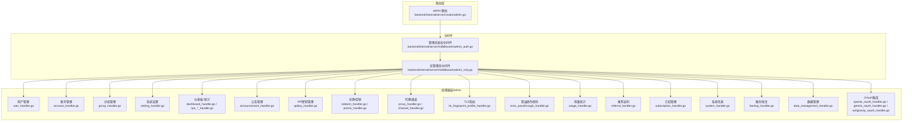
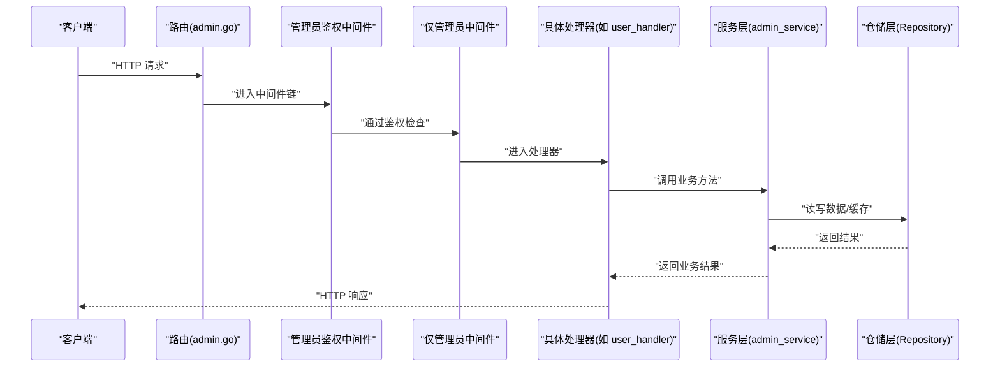
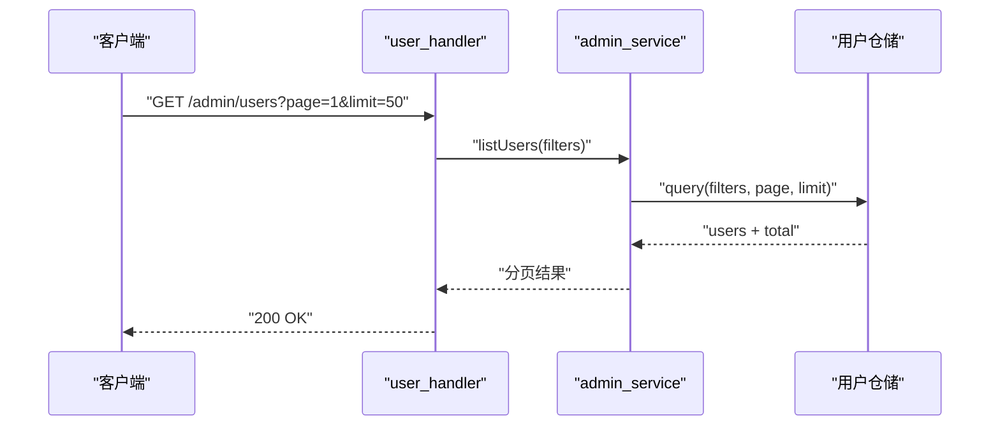
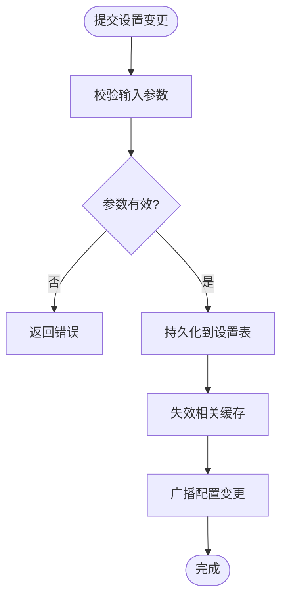
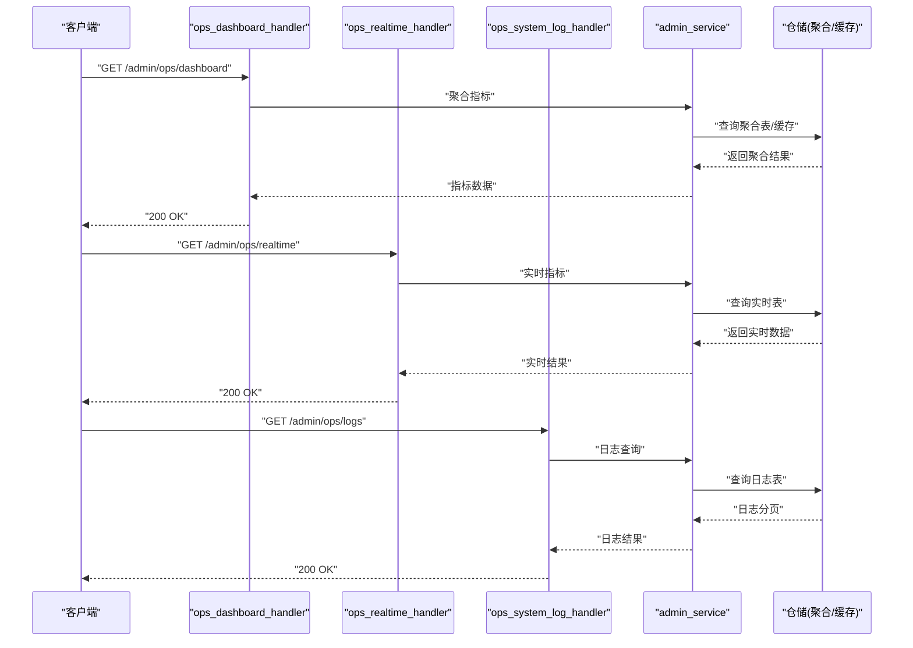
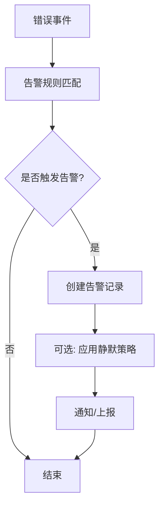
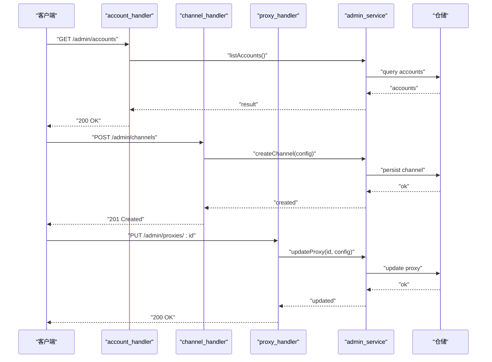
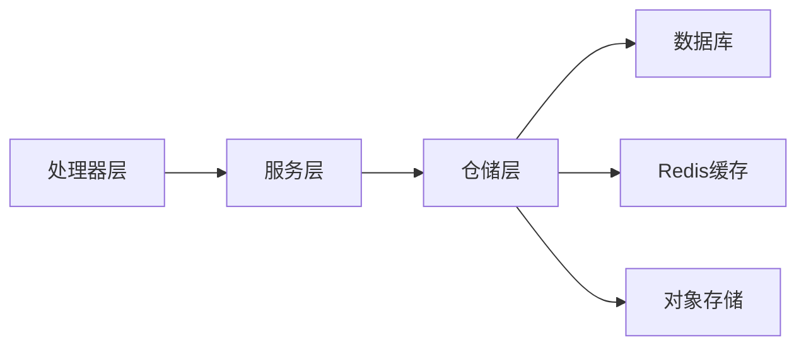

# 系统管理API

<cite>
**本文引用的文件**
- [backend/internal/handler/admin/admin_basic_handlers_test.go](file://backend/internal/handler/admin/admin_basic_handlers_test.go)
- [backend/internal/handler/admin/admin_helpers_test.go](file://backend/internal/handler/admin/admin_helpers_test.go)
- [backend/internal/handler/admin/admin_service_stub_test.go](file://backend/internal/handler/admin/admin_service_stub_test.go)
- [backend/internal/handler/admin/account_handler.go](file://backend/internal/handler/admin/account_handler.go)
- [backend/internal/handler/admin/announcement_handler.go](file://backend/internal/handler/admin/announcement_handler.go)
- [backend/internal/handler/admin/apikey_handler.go](file://backend/internal/handler/admin/apikey_handler.go)
- [backend/internal/handler/admin/dashboard_handler.go](file://backend/internal/handler/admin/dashboard_handler.go)
- [backend/internal/handler/admin/error_passthrough_handler.go](file://backend/internal/handler/admin/error_passthrough_handler.go)
- [backend/internal/handler/admin/group_handler.go](file://backend/internal/handler/admin/group_handler.go)
- [backend/internal/handler/admin/ops_alerts_handler.go](file://backend/internal/handler/admin/ops_alerts_handler.go)
- [backend/internal/handler/admin/ops_dashboard_handler.go](file://backend/internal/handler/admin/ops_dashboard_handler.go)
- [backend/internal/handler/admin/ops_handler.go](file://backend/internal/handler/admin/ops_handler.go)
- [backend/internal/handler/admin/ops_realtime_handler.go](file://backend/internal/handler/admin/ops_realtime_handler.go)
- [backend/internal/handler/admin/ops_settings_handler.go](file://backend/internal/handler/admin/ops_settings_handler.go)
- [backend/internal/handler/admin/ops_system_log_handler.go](file://backend/internal/handler/admin/ops_system_log_handler.go)
- [backend/internal/handler/admin/promo_handler.go](file://backend/internal/handler/admin/promo_handler.go)
- [backend/internal/handler/admin/proxy_handler.go](file://backend/internal/handler/admin/proxy_handler.go)
- [backend/internal/handler/admin/redeem_handler.go](file://backend/internal/handler/admin/redeem_handler.go)
- [backend/internal/handler/admin/referral_handler.go](file://backend/internal/handler/admin/referral_handler.go)
- [backend/internal/handler/admin/scheduled_test_handler.go](file://backend/internal/handler/admin/scheduled_test_handler.go)
- [backend/internal/handler/admin/setting_handler.go](file://backend/internal/handler/admin/setting_handler.go)
- [backend/internal/handler/admin/system_handler.go](file://backend/internal/handler/admin/system_handler.go)
- [backend/internal/handler/admin/tls_fingerprint_profile_handler.go](file://backend/internal/handler/admin/tls_fingerprint_profile_handler.go)
- [backend/internal/handler/admin/usage_handler.go](file://backend/internal/handler/admin/usage_handler.go)
- [backend/internal/handler/admin/user_handler.go](file://backend/internal/handler/admin/user_handler.go)
- [backend/internal/handler/admin/user_attribute_handler.go](file://backend/internal/handler/admin/user_attribute_handler.go)
- [backend/internal/handler/admin/channel_handler.go](file://backend/internal/handler/admin/channel_handler.go)
- [backend/internal/handler/admin/backup_handler.go](file://backend/internal/handler/admin/backup_handler.go)
- [backend/internal/handler/admin/data_management_handler.go](file://backend/internal/handler/admin/data_management_handler.go)
- [backend/internal/handler/admin/subscription_handler.go](file://backend/internal/handler/admin/subscription_handler.go)
- [backend/internal/handler/admin/antigravity_oauth_handler.go](file://backend/internal/handler/admin/antigravity_oauth_handler.go)
- [backend/internal/handler/admin/gemini_oauth_handler.go](file://backend/internal/handler/admin/gemini_oauth_handler.go)
- [backend/internal/handler/admin/openai_oauth_handler.go](file://backend/internal/handler/admin/openai_oauth_handler.go)
- [backend/internal/server/middleware/admin_auth.go](file://backend/internal/server/middleware/admin_auth.go)
- [backend/internal/server/middleware/admin_only.go](file://backend/internal/server/middleware/admin_only.go)
- [backend/internal/server/routes/admin.go](file://backend/internal/server/routes/admin.go)
- [backend/internal/service/admin_service.go](file://backend/internal/service/admin_service.go)
- [backend/internal/repository/simple_mode_admin_concurrency.go](file://backend/internal/repository/simple_mode_admin_concurrency.go)
</cite>

## 目录
1. [简介](#简介)
2. [项目结构](#项目结构)
3. [核心组件](#核心组件)
4. [架构总览](#架构总览)
5. [详细组件分析](#详细组件分析)
6. [依赖关系分析](#依赖关系分析)
7. [性能考量](#性能考量)
8. [故障排查指南](#故障排查指南)
9. [结论](#结论)
10. [附录](#附录)

## 简介
本文件系统性梳理后端“系统管理API”的设计与实现，覆盖管理员权限校验、用户管理、系统配置、仪表板与监控、告警管理、通道与代理、促销与兑换、订阅与用量统计、公告与用户属性、备份与数据管理、OAuth集成等模块。文档以“可操作”为目标，提供端点清单、调用流程、安全控制与最佳实践，帮助开发者快速理解并正确使用管理员工作台能力。

## 项目结构
后端采用分层架构：路由层负责HTTP入口与中间件装配；处理器层（Handler）封装业务端点；服务层（Service）承载领域逻辑；仓储层（Repository）处理数据访问；配置与中间件位于独立目录。管理员相关能力集中在“admin”命名空间下，统一由路由注册与权限中间件保护。

图表来源
- [backend/internal/server/routes/admin.go](file://backend/internal/server/routes/admin.go)
- [backend/internal/server/middleware/admin_auth.go](file://backend/internal/server/middleware/admin_auth.go)
- [backend/internal/server/middleware/admin_only.go](file://backend/internal/server/middleware/admin_only.go)
- [backend/internal/handler/admin/user_handler.go](file://backend/internal/handler/admin/user_handler.go)
- [backend/internal/handler/admin/account_handler.go](file://backend/internal/handler/admin/account_handler.go)
- [backend/internal/handler/admin/group_handler.go](file://backend/internal/handler/admin/group_handler.go)
- [backend/internal/handler/admin/setting_handler.go](file://backend/internal/handler/admin/setting_handler.go)
- [backend/internal/handler/admin/dashboard_handler.go](file://backend/internal/handler/admin/dashboard_handler.go)
- [backend/internal/handler/admin/announcement_handler.go](file://backend/internal/handler/admin/announcement_handler.go)
- [backend/internal/handler/admin/apikey_handler.go](file://backend/internal/handler/admin/apikey_handler.go)
- [backend/internal/handler/admin/redeem_handler.go](file://backend/internal/handler/admin/redeem_handler.go)
- [backend/internal/handler/admin/promo_handler.go](file://backend/internal/handler/admin/promo_handler.go)
- [backend/internal/handler/admin/proxy_handler.go](file://backend/internal/handler/admin/proxy_handler.go)
- [backend/internal/handler/admin/channel_handler.go](file://backend/internal/handler/admin/channel_handler.go)
- [backend/internal/handler/admin/tls_fingerprint_profile_handler.go](file://backend/internal/handler/admin/tls_fingerprint_profile_handler.go)
- [backend/internal/handler/admin/error_passthrough_handler.go](file://backend/internal/handler/admin/error_passthrough_handler.go)
- [backend/internal/handler/admin/usage_handler.go](file://backend/internal/handler/admin/usage_handler.go)
- [backend/internal/handler/admin/referral_handler.go](file://backend/internal/handler/admin/referral_handler.go)
- [backend/internal/handler/admin/subscription_handler.go](file://backend/internal/handler/admin/subscription_handler.go)
- [backend/internal/handler/admin/system_handler.go](file://backend/internal/handler/admin/system_handler.go)
- [backend/internal/handler/admin/backup_handler.go](file://backend/internal/handler/admin/backup_handler.go)
- [backend/internal/handler/admin/data_management_handler.go](file://backend/internal/handler/admin/data_management_handler.go)
- [backend/internal/handler/admin/openai_oauth_handler.go](file://backend/internal/handler/admin/openai_oauth_handler.go)
- [backend/internal/handler/admin/gemini_oauth_handler.go](file://backend/internal/handler/admin/gemini_oauth_handler.go)
- [backend/internal/handler/admin/antigravity_oauth_handler.go](file://backend/internal/handler/admin/antigravity_oauth_handler.go)

章节来源
- [backend/internal/server/routes/admin.go](file://backend/internal/server/routes/admin.go)
- [backend/internal/server/middleware/admin_auth.go](file://backend/internal/server/middleware/admin_auth.go)
- [backend/internal/server/middleware/admin_only.go](file://backend/internal/server/middleware/admin_only.go)

## 核心组件
- 权限中间件
  - 管理员鉴权中间件：负责识别管理员身份与令牌有效性。
  - 仅管理员中间件：在鉴权基础上进一步限制为管理员角色。
- 路由注册：集中注册所有管理员端点，确保统一的前缀与中间件链路。
- 服务层：封装管理员域内复杂业务，如批量更新、额度调整、用量统计聚合等。
- 处理器层：面向HTTP请求，编排DTO、调用服务层并返回响应。

章节来源
- [backend/internal/server/middleware/admin_auth.go](file://backend/internal/server/middleware/admin_auth.go)
- [backend/internal/server/middleware/admin_only.go](file://backend/internal/server/middleware/admin_only.go)
- [backend/internal/server/routes/admin.go](file://backend/internal/server/routes/admin.go)
- [backend/internal/service/admin_service.go](file://backend/internal/service/admin_service.go)

## 架构总览
管理员API遵循“路由 → 中间件 → 处理器 → 服务 → 仓储”的分层调用链。权限控制贯穿始终，确保只有具备管理员身份的请求才能访问管理端点。处理器层对输入参数进行校验与转换，服务层执行业务规则，仓储层负责持久化与缓存交互。

图表来源
- [backend/internal/server/routes/admin.go](file://backend/internal/server/routes/admin.go)
- [backend/internal/server/middleware/admin_auth.go](file://backend/internal/server/middleware/admin_auth.go)
- [backend/internal/server/middleware/admin_only.go](file://backend/internal/server/middleware/admin_only.go)
- [backend/internal/handler/admin/user_handler.go](file://backend/internal/handler/admin/user_handler.go)
- [backend/internal/service/admin_service.go](file://backend/internal/service/admin_service.go)

## 详细组件分析

### 用户管理
- 端点概览
  - 列表查询：支持分页、排序、过滤（邮箱/用户名/状态/创建时间范围等）。
  - 创建用户：批量或单个创建，设置初始属性与默认分组。
  - 更新用户：修改基本信息、状态、到期时间、余额等。
  - 删除用户：软删除或物理删除（按策略）。
  - 搜索与导出：支持关键词搜索与CSV导出。
- 关键流程
  - 列表查询：处理器接收查询参数，服务层构建过滤条件，仓储层执行查询并返回分页结果。
  - 批量操作：服务层对ID列表进行合法性校验与幂等处理，逐条执行业务规则。
- 安全与并发
  - 幂等性：使用幂等记录避免重复操作。
  - 并发限制：在简单模式下限制管理员并发度，防止资源争用。

图表来源
- [backend/internal/handler/admin/user_handler.go](file://backend/internal/handler/admin/user_handler.go)
- [backend/internal/service/admin_service.go](file://backend/internal/service/admin_service.go)

章节来源
- [backend/internal/handler/admin/user_handler.go](file://backend/internal/handler/admin/user_handler.go)
- [backend/internal/handler/admin/admin_basic_handlers_test.go](file://backend/internal/handler/admin/admin_basic_handlers_test.go)
- [backend/internal/handler/admin/admin_helpers_test.go](file://backend/internal/handler/admin/admin_helpers_test.go)
- [backend/internal/handler/admin/admin_service_stub_test.go](file://backend/internal/handler/admin/admin_service_stub_test.go)
- [backend/internal/repository/simple_mode_admin_concurrency.go](file://backend/internal/repository/simple_mode_admin_concurrency.go)

### 系统配置与设置
- 端点概览
  - 获取/更新系统设置：平台开关、默认配额、白名单、OAuth配置等。
  - 设置变更日志：审计设置变更历史。
  - 运行时配置：动态生效的运行参数（受控）。
- 流程要点
  - 变更前校验：确保字段合法与依赖关系满足。
  - 缓存同步：更新后同步到缓存与广播，保证多实例一致性。
  - 审计记录：记录变更人、时间、前后值，便于追溯。

图表来源
- [backend/internal/handler/admin/setting_handler.go](file://backend/internal/handler/admin/setting_handler.go)
- [backend/internal/handler/admin/ops_settings_handler.go](file://backend/internal/handler/admin/ops_settings_handler.go)

章节来源
- [backend/internal/handler/admin/setting_handler.go](file://backend/internal/handler/admin/setting_handler.go)
- [backend/internal/handler/admin/ops_settings_handler.go](file://backend/internal/handler/admin/ops_settings_handler.go)

### 仪表板与系统监控
- 端点概览
  - 实时流量：当前QPS、并发、错误率等。
  - 历史趋势：按小时/天聚合的用量、收入、错误事件。
  - 用户用量分布：Top用户、Top模型、Top渠道等。
  - 系统日志：错误日志、系统事件、慢查询等。
  - 快照与缓存：预聚合快照提升查询性能。
- 数据聚合
  - 使用预聚合表与缓存，降低实时计算压力。
  - 支持窗口滑动与多粒度聚合。

图表来源
- [backend/internal/handler/admin/ops_dashboard_handler.go](file://backend/internal/handler/admin/ops_dashboard_handler.go)
- [backend/internal/handler/admin/ops_realtime_handler.go](file://backend/internal/handler/admin/ops_realtime_handler.go)
- [backend/internal/handler/admin/ops_system_log_handler.go](file://backend/internal/handler/admin/ops_system_log_handler.go)
- [backend/internal/handler/admin/dashboard_handler.go](file://backend/internal/handler/admin/dashboard_handler.go)

章节来源
- [backend/internal/handler/admin/ops_dashboard_handler.go](file://backend/internal/handler/admin/ops_dashboard_handler.go)
- [backend/internal/handler/admin/ops_realtime_handler.go](file://backend/internal/handler/admin/ops_realtime_handler.go)
- [backend/internal/handler/admin/ops_system_log_handler.go](file://backend/internal/handler/admin/ops_system_log_handler.go)
- [backend/internal/handler/admin/dashboard_handler.go](file://backend/internal/handler/admin/dashboard_handler.go)

### 告警管理
- 端点概览
  - 查询告警：按类型、严重级别、时间范围筛选。
  - 屏蔽/解除屏蔽：临时静默某类告警。
  - 告警详情：关联的错误事件、上游信息、处理建议。
- 流程要点
  - 告警生成：基于错误事件与阈值触发。
  - 屏蔽策略：支持全局与按维度静默。
  - 历史归档：过期告警自动归档。

图表来源
- [backend/internal/handler/admin/ops_alerts_handler.go](file://backend/internal/handler/admin/ops_alerts_handler.go)
- [backend/internal/handler/admin/error_passthrough_handler.go](file://backend/internal/handler/admin/error_passthrough_handler.go)

章节来源
- [backend/internal/handler/admin/ops_alerts_handler.go](file://backend/internal/handler/admin/ops_alerts_handler.go)
- [backend/internal/handler/admin/error_passthrough_handler.go](file://backend/internal/handler/admin/error_passthrough_handler.go)

### 账号与通道管理
- 账号管理
  - 列表/详情/创建/更新/删除：支持批量导入、额度重置、到期时间管理。
  - 用量统计：今日用量、历史用量、上游计费口径。
- 通道与代理
  - 通道配置：模型映射、计费模式、负载均衡策略。
  - 代理管理：IP白名单、超时、回源策略。
- 流程要点
  - 账号与通道解耦：账号绑定通道，支持多通道轮询与熔断。
  - 配额与配额重置：支持周期性重置与手动调整。

图表来源
- [backend/internal/handler/admin/account_handler.go](file://backend/internal/handler/admin/account_handler.go)
- [backend/internal/handler/admin/channel_handler.go](file://backend/internal/handler/admin/channel_handler.go)
- [backend/internal/handler/admin/proxy_handler.go](file://backend/internal/handler/admin/proxy_handler.go)

章节来源
- [backend/internal/handler/admin/account_handler.go](file://backend/internal/handler/admin/account_handler.go)
- [backend/internal/handler/admin/channel_handler.go](file://backend/internal/handler/admin/channel_handler.go)
- [backend/internal/handler/admin/proxy_handler.go](file://backend/internal/handler/admin/proxy_handler.go)

### 分组与权限
- 端点概览
  - 分组CRUD：名称、描述、状态、默认权限。
  - 用户分组：批量分配/移除用户分组。
  - 分组速率限制：针对不同分组设置独立RPM/RPD。
- 流程要点
  - 分组状态事件：记录启用/停用等状态变更。
  - 与用户允许分组联动：影响用户可见与可用通道。

章节来源
- [backend/internal/handler/admin/group_handler.go](file://backend/internal/handler/admin/group_handler.go)
- [backend/internal/handler/admin/user_handler.go](file://backend/internal/handler/admin/user_handler.go)

### 公告与用户属性
- 公告管理
  - 发布/撤回：支持定时发布、目标受众定向。
  - 已读统计：按用户与公告维度统计已读情况。
- 用户属性
  - 自定义属性定义与赋值：用于标签化运营与定向策略。

章节来源
- [backend/internal/handler/admin/announcement_handler.go](file://backend/internal/handler/admin/announcement_handler.go)
- [backend/internal/handler/admin/user_attribute_handler.go](file://backend/internal/handler/admin/user_attribute_handler.go)

### API密钥与安全
- 端点概览
  - 密钥管理：创建、禁用、删除、查看使用统计。
  - IP限制：为密钥绑定IP白名单。
  - 限额配置：QPM/QPD级配额与熔断。
- 安全要点
  - 密钥轮换：支持生成新密钥并逐步替换。
  - 使用审计：记录密钥使用详情与异常行为。

章节来源
- [backend/internal/handler/admin/apikey_handler.go](file://backend/internal/handler/admin/apikey_handler.go)

### 促销、兑换与推荐
- 促销码
  - 创建/禁用/统计：限定使用次数、有效期、适用分组。
- 兑换码
  - 兑换流程：核销、记录使用人与时间。
- 推荐返利
  - 返利规则：邀请奖励、消费返利、层级返利。

章节来源
- [backend/internal/handler/admin/promo_handler.go](file://backend/internal/handler/admin/promo_handler.go)
- [backend/internal/handler/admin/redeem_handler.go](file://backend/internal/handler/admin/redeem_handler.go)
- [backend/internal/handler/admin/referral_handler.go](file://backend/internal/handler/admin/referral_handler.go)

### 订阅与用量统计
- 端点概览
  - 订阅管理：套餐变更、到期时间调整、欠费处理。
  - 用量统计：按用户、模型、渠道、时间维度聚合。
- 流程要点
  - 用量清理任务：定期归档与清理历史数据。
  - 超支与告警：超出配额时的处理策略与通知。

章节来源
- [backend/internal/handler/admin/subscription_handler.go](file://backend/internal/handler/admin/subscription_handler.go)
- [backend/internal/handler/admin/usage_handler.go](file://backend/internal/handler/admin/usage_handler.go)

### TLS指纹与错误透传
- TLS指纹配置：用于上游握手特征识别与风控。
- 错误透传规则：控制错误事件是否上报与分类。

章节来源
- [backend/internal/handler/admin/tls_fingerprint_profile_handler.go](file://backend/internal/handler/admin/tls_fingerprint_profile_handler.go)
- [backend/internal/handler/admin/error_passthrough_handler.go](file://backend/internal/handler/admin/error_passthrough_handler.go)

### 系统信息与备份/数据管理
- 系统信息：版本、部署环境、健康状态。
- 备份与恢复：数据库备份、对象存储上传、恢复流程。
- 数据管理：数据迁移、索引优化、归档策略。

章节来源
- [backend/internal/handler/admin/system_handler.go](file://backend/internal/handler/admin/system_handler.go)
- [backend/internal/handler/admin/backup_handler.go](file://backend/internal/handler/admin/backup_handler.go)
- [backend/internal/handler/admin/data_management_handler.go](file://backend/internal/handler/admin/data_management_handler.go)

### OAuth集成
- 支持OpenAI、Gemini、Antigravity等平台的OAuth接入，便于统一管理第三方认证与授权。

章节来源
- [backend/internal/handler/admin/openai_oauth_handler.go](file://backend/internal/handler/admin/openai_oauth_handler.go)
- [backend/internal/handler/admin/gemini_oauth_handler.go](file://backend/internal/handler/admin/gemini_oauth_handler.go)
- [backend/internal/handler/admin/antigravity_oauth_handler.go](file://backend/internal/handler/admin/antigravity_oauth_handler.go)

## 依赖关系分析
- 组件耦合
  - 处理器层依赖服务层，服务层依赖仓储层，职责清晰、耦合可控。
  - 权限中间件与路由层形成强约束，避免越权访问。
- 外部依赖
  - 数据库：Ent ORM与SQL扫描工具。
  - 缓存：Redis用于会话、配置与聚合快照。
  - 对象存储：用于备份与日志归档。
- 循环依赖
  - 未发现循环依赖迹象，分层清晰。

图表来源
- [backend/internal/handler/admin/user_handler.go](file://backend/internal/handler/admin/user_handler.go)
- [backend/internal/service/admin_service.go](file://backend/internal/service/admin_service.go)
- [backend/internal/server/middleware/admin_auth.go](file://backend/internal/server/middleware/admin_auth.go)

章节来源
- [backend/internal/service/admin_service.go](file://backend/internal/service/admin_service.go)
- [backend/internal/server/middleware/admin_auth.go](file://backend/internal/server/middleware/admin_auth.go)

## 性能考量
- 预聚合与缓存
  - 仪表板与监控数据采用预聚合表与缓存，减少实时计算开销。
- 分页与索引
  - 列表查询使用分页与合适索引，避免全表扫描。
- 并发控制
  - 简单模式下限制管理员并发度，避免热点操作导致抖动。
- 异步任务
  - 大数据量的备份、清理、统计任务异步执行，不阻塞主流程。

## 故障排查指南
- 权限问题
  - 确认请求头携带有效管理员令牌，并通过鉴权中间件。
  - 若提示无权限，请检查管理员角色与权限位。
- 查询缓慢
  - 检查是否使用了合适的过滤条件与索引。
  - 对于大范围统计，优先使用缓存或快照接口。
- 幂等性冲突
  - 批量操作时检查幂等记录，避免重复提交。
- 配置未生效
  - 确认设置已持久化并失效相关缓存，等待广播生效。
- 日志定位
  - 使用系统日志接口检索错误事件与慢查询，结合告警定位根因。

章节来源
- [backend/internal/server/middleware/admin_auth.go](file://backend/internal/server/middleware/admin_auth.go)
- [backend/internal/server/middleware/admin_only.go](file://backend/internal/server/middleware/admin_only.go)
- [backend/internal/handler/admin/ops_system_log_handler.go](file://backend/internal/handler/admin/ops_system_log_handler.go)
- [backend/internal/handler/admin/ops_alerts_handler.go](file://backend/internal/handler/admin/ops_alerts_handler.go)

## 结论
系统管理API围绕“权限可控、流程清晰、可观测、可扩展”的原则设计，覆盖管理员日常运维所需的核心能力。通过严格的中间件控制、完善的仓储与缓存策略、以及可观测的监控与告警体系，能够稳定支撑大规模场景下的管理工作台需求。

## 附录
- 端点清单（示例）
  - 用户管理：GET/POST/PUT/DELETE /admin/users
  - 账号管理：GET/POST/PUT/DELETE /admin/accounts
  - 分组管理：GET/POST/PUT/DELETE /admin/groups
  - 系统设置：GET/PUT /admin/settings
  - 仪表板：GET /admin/ops/dashboard
  - 实时监控：GET /admin/ops/realtime
  - 系统日志：GET /admin/ops/logs
  - 告警管理：GET /admin/ops/alerts
  - 通道与代理：GET/POST/PUT /admin/channels, /admin/proxies
  - 公告管理：GET/POST/PUT/DELETE /admin/announcements
  - API密钥：GET/POST/PUT/DELETE /admin/apikeys
  - 促销与兑换：GET/POST/PUT /admin/promocodes, /admin/redeem-codes
  - 订阅与用量：GET/PUT /admin/subscriptions, /admin/usage
  - TLS指纹与错误透传：GET/POST/PUT /admin/tls-fingerprint-profiles, /admin/error-passthrough-rules
  - 系统信息与备份：GET /admin/system, POST /admin/backup
  - 数据管理：POST /admin/data-management
  - OAuth集成：GET/POST /admin/oauth/{provider}