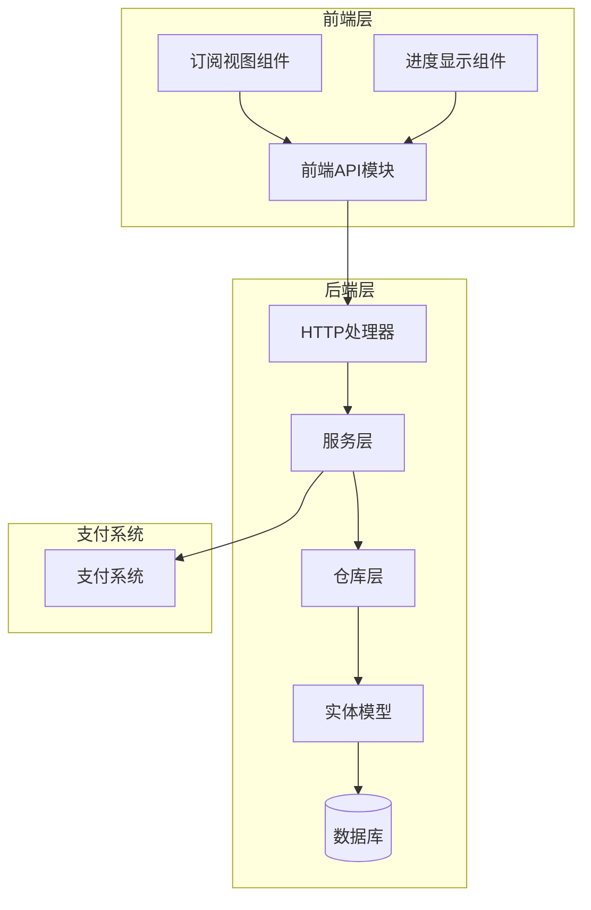
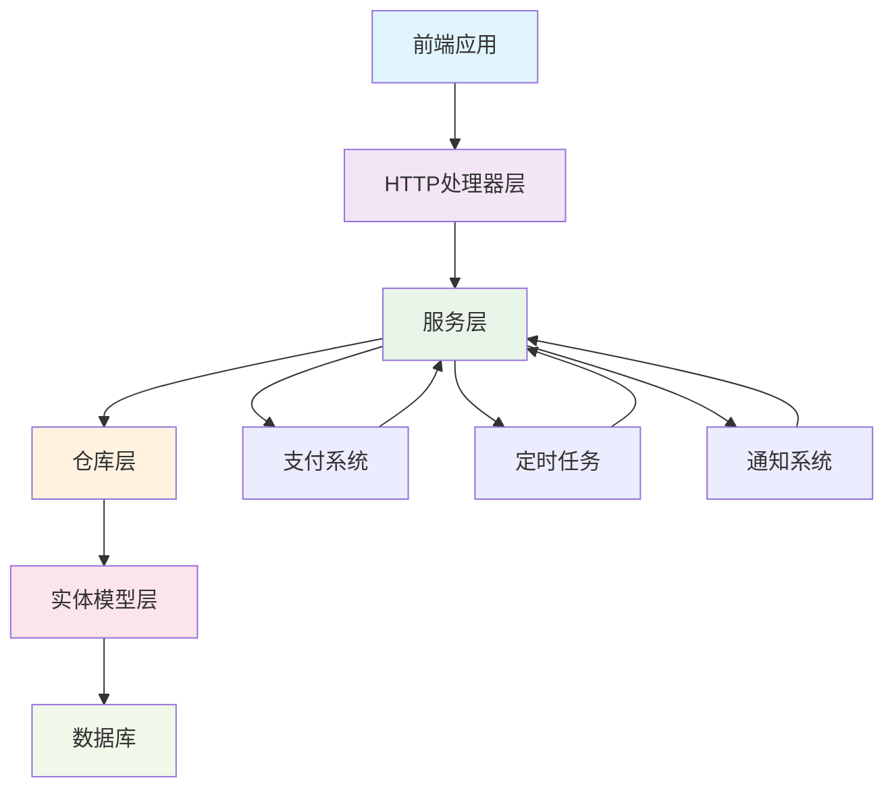
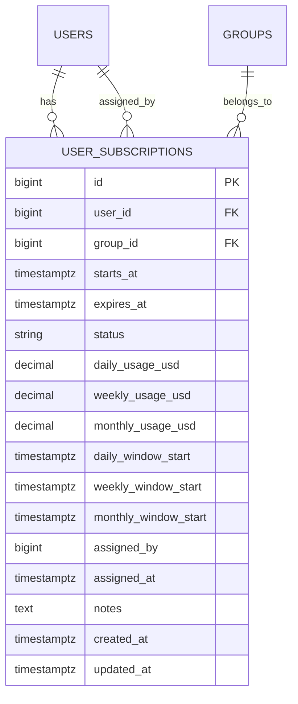
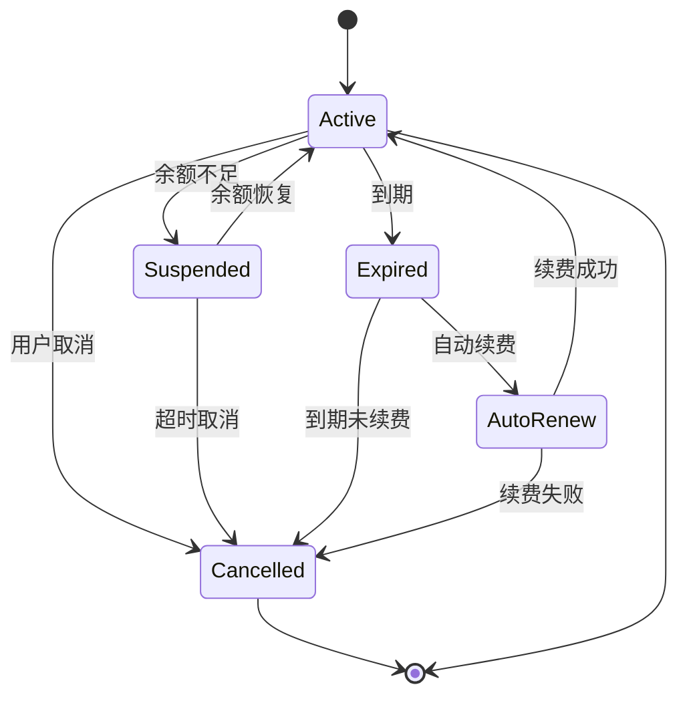
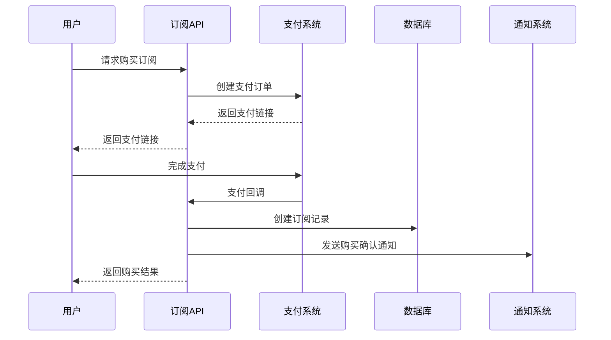
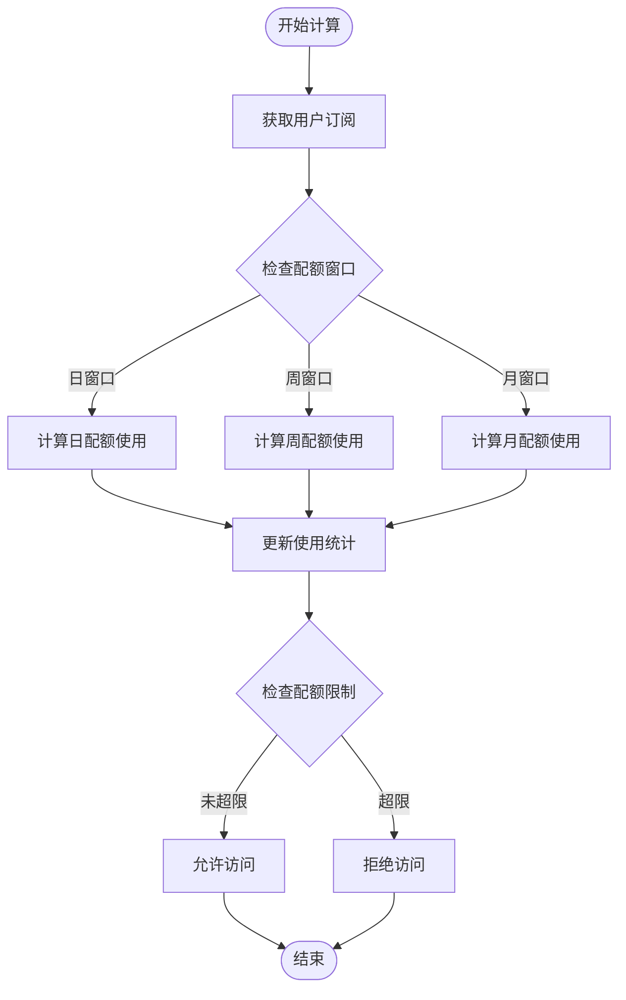
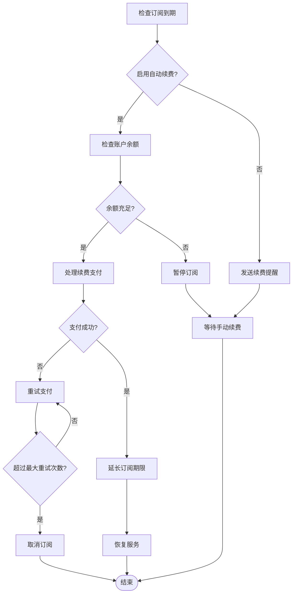
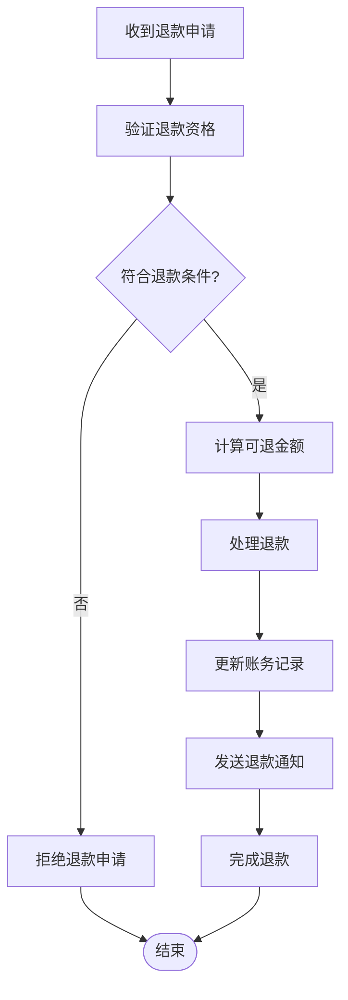
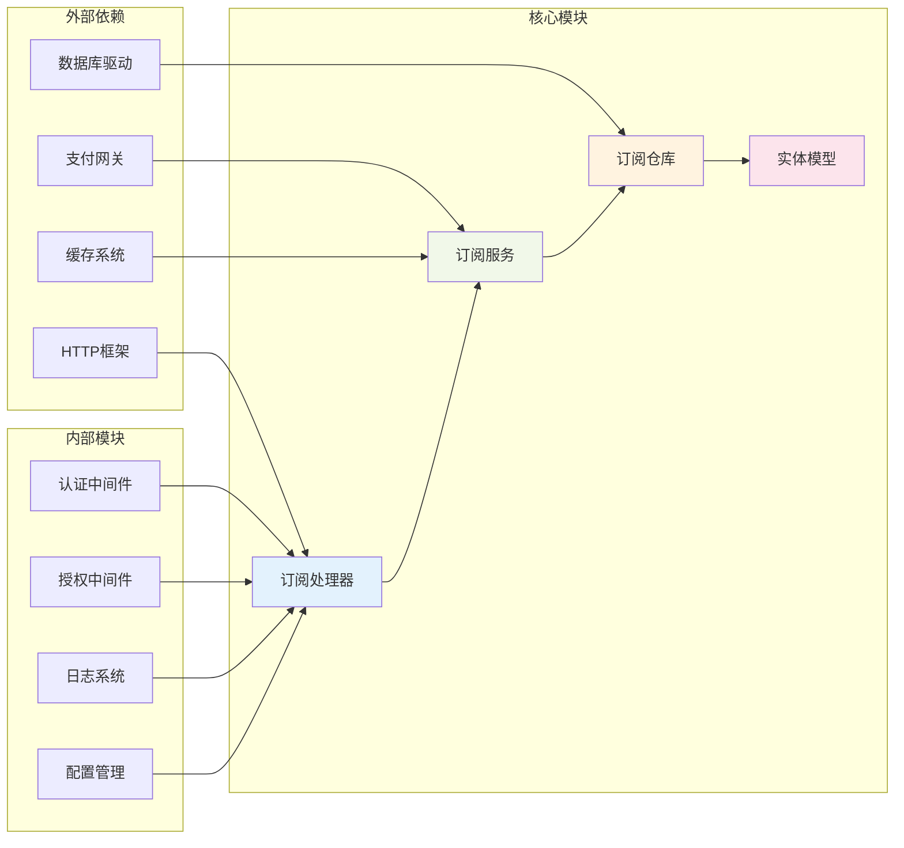
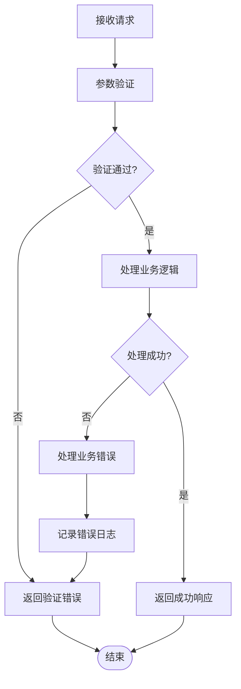

# 订阅管理API

<cite>
**本文档引用的文件**
- [backend/internal/handler/subscription_handler.go](file://backend/internal/handler/subscription_handler.go)
- [backend/internal/handler/admin/subscription_handler.go](file://backend/internal/handler/admin/subscription_handler.go)
- [backend/internal/service/subscription_service.go](file://backend/internal/service/subscription_service.go)
- [backend/internal/service/user_subscription.go](file://backend/internal/service/user_subscription.go)
- [backend/internal/repository/user_subscription_repo.go](file://backend/internal/repository/user_subscription_repo.go)
- [backend/ent/schema/user_subscription.go](file://backend/ent/schema/user_subscription.go)
- [backend/migrations/003_subscription.sql](file://backend/migrations/003_subscription.sql)
- [backend/internal/handler/handler.go](file://backend/internal/handler/handler.go)
- [backend/internal/handler/wire.go](file://backend/internal/handler/wire.go)
- [frontend/src/api/subscriptions.ts](file://frontend/src/api/subscriptions.ts)
- [frontend/src/views/user/SubscriptionsView.vue](file://frontend/src/views/user/SubscriptionsView.vue)
- [frontend/src/components/common/SubscriptionProgressMini.vue](file://frontend/src/components/common/SubscriptionProgressMini.vue)
- [sub2apipay/src/components/UserSubscriptions.tsx](file://sub2apipay/src/components/UserSubscriptions.tsx)
</cite>

## 目录
1. [简介](#简介)
2. [项目结构](#项目结构)
3. [核心组件](#核心组件)
4. [架构概览](#架构概览)
5. [详细组件分析](#详细组件分析)
6. [依赖分析](#依赖分析)
7. [性能考虑](#性能考虑)
8. [故障排除指南](#故障排除指南)
9. [结论](#结论)

## 简介

订阅管理API是系统中负责处理用户订阅生命周期管理的核心服务。该API提供了完整的订阅计划查询、购买流程、进度跟踪、自动续费管理等功能，涵盖了从订阅创建到到期处理的整个业务流程。

系统采用分层架构设计，包括HTTP处理器层、服务层、仓库层和数据访问层，确保了良好的代码组织和可维护性。订阅管理功能通过RESTful API接口提供，支持用户自助管理和管理员后台管理两种模式。

## 项目结构

订阅管理API在项目中的组织结构如下：

**图表来源**
- [backend/internal/handler/subscription_handler.go:1-100](file://backend/internal/handler/subscription_handler.go#L1-L100)
- [backend/internal/service/subscription_service.go:1-150](file://backend/internal/service/subscription_service.go#L1-L150)
- [backend/internal/repository/user_subscription_repo.go:1-100](file://backend/internal/repository/user_subscription_repo.go#L1-L100)

**章节来源**
- [backend/internal/handler/subscription_handler.go:1-100](file://backend/internal/handler/subscription_handler.go#L1-L100)
- [backend/internal/service/subscription_service.go:1-200](file://backend/internal/service/subscription_service.go#L1-L200)

## 核心组件

### 订阅处理器

订阅处理器负责处理HTTP请求和响应，提供RESTful API接口。

**章节来源**
- [backend/internal/handler/subscription_handler.go:33-80](file://backend/internal/handler/subscription_handler.go#L33-L80)
- [backend/internal/handler/admin/subscription_handler.go:29-47](file://backend/internal/handler/admin/subscription_handler.go#L29-L47)

### 订阅服务

订阅服务层包含核心业务逻辑，处理订阅状态转换、配额计算、费用结算等复杂业务规则。

**章节来源**
- [backend/internal/service/subscription_service.go:1-300](file://backend/internal/service/subscription_service.go#L1-L300)
- [backend/internal/service/user_subscription.go:1-200](file://backend/internal/service/user_subscription.go#L1-L200)

### 数据访问层

数据访问层通过仓库模式提供数据持久化功能，封装数据库操作细节。

**章节来源**
- [backend/internal/repository/user_subscription_repo.go:1-150](file://backend/internal/repository/user_subscription_repo.go#L1-L150)
- [backend/ent/schema/user_subscription.go:1-80](file://backend/ent/schema/user_subscription.go#L1-L80)

## 架构概览

订阅管理系统的整体架构采用分层设计，确保关注点分离和代码复用：

**图表来源**
- [backend/internal/handler/handler.go:1-35](file://backend/internal/handler/handler.go#L1-L35)
- [backend/internal/handler/wire.go:1-43](file://backend/internal/handler/wire.go#L1-L43)

## 详细组件分析

### 订阅数据模型

订阅系统的核心数据模型基于用户订阅实体，包含完整的订阅生命周期信息：

**图表来源**
- [backend/ent/schema/user_subscription.go:36-80](file://backend/ent/schema/user_subscription.go#L36-L80)
- [backend/migrations/003_subscription.sql:27-54](file://backend/migrations/003_subscription.sql#L27-L54)

### 订阅状态管理

订阅状态转换遵循严格的业务规则，确保状态的一致性和可追溯性：

**图表来源**
- [backend/internal/service/subscription_service.go:150-300](file://backend/internal/service/subscription_service.go#L150-L300)

### API端点设计

#### 用户端API

| 方法 | 路径 | 描述 | 权限 |
|------|------|------|------|
| GET | /api/v1/subscriptions | 获取当前用户的订阅列表 | 用户 |
| GET | /api/v1/subscriptions/active | 获取当前用户的活跃订阅 | 用户 |
| GET | /api/v1/subscriptions/{id}/progress | 获取指定订阅的使用进度 | 用户 |
| GET | /api/v1/subscriptions/summary | 获取订阅摘要信息 | 用户 |

#### 管理员API

| 方法 | 路径 | 描述 | 权限 |
|------|------|------|------|
| POST | /api/v1/admin/subscriptions/assign | 分配订阅给用户 | 管理员 |
| GET | /api/v1/admin/subscriptions | 查询所有订阅 | 管理员 |
| PUT | /api/v1/admin/subscriptions/{id} | 更新订阅状态 | 管理员 |
| DELETE | /api/v1/admin/subscriptions/{id} | 删除订阅 | 管理员 |

**章节来源**
- [backend/internal/handler/subscription_handler.go:45-120](file://backend/internal/handler/subscription_handler.go#L45-L120)
- [backend/internal/handler/admin/subscription_handler.go:41-100](file://backend/internal/handler/admin/subscription_handler.go#L41-L100)

### 订阅购买流程

订阅购买流程包含多个步骤，确保交易的安全性和可靠性：

**图表来源**
- [backend/internal/service/subscription_service.go:200-400](file://backend/internal/service/subscription_service.go#L200-L400)

### 配额计算机制

系统采用滑动窗口机制计算用户配额使用情况：

**图表来源**
- [backend/internal/service/subscription_service.go:1-150](file://backend/internal/service/subscription_service.go#L1-L150)

**章节来源**
- [backend/internal/service/subscription_service.go:1-200](file://backend/internal/service/subscription_service.go#L1-L200)

### 自动续费管理

自动续费功能确保订阅的连续性，提供灵活的续费策略：

**图表来源**
- [backend/internal/service/subscription_service.go:300-500](file://backend/internal/service/subscription_service.go#L300-L500)

**章节来源**
- [backend/internal/service/subscription_service.go:250-450](file://backend/internal/service/subscription_service.go#L250-L450)

### 退款处理流程

退款处理遵循严格的合规要求和业务规则：

**图表来源**
- [backend/internal/service/subscription_service.go:450-600](file://backend/internal/service/subscription_service.go#L450-L600)

**章节来源**
- [backend/internal/service/subscription_service.go:400-550](file://backend/internal/service/subscription_service.go#L400-L550)

## 依赖分析

订阅管理API的依赖关系体现了清晰的关注点分离：

**图表来源**
- [backend/internal/handler/wire.go:10-43](file://backend/internal/handler/wire.go#L10-L43)
- [backend/internal/handler/handler.go:7-35](file://backend/internal/handler/handler.go#L7-L35)

**章节来源**
- [backend/internal/handler/wire.go:1-43](file://backend/internal/handler/wire.go#L1-L43)
- [backend/internal/handler/handler.go:1-35](file://backend/internal/handler/handler.go#L1-L35)

## 性能考虑

订阅管理系统在设计时充分考虑了性能优化：

### 缓存策略
- 使用Redis缓存热门订阅数据
- 实现多级缓存层次结构
- 配置合理的缓存过期策略

### 数据库优化
- 为常用查询字段建立索引
- 实现分页查询避免大数据集加载
- 使用连接池管理数据库连接

### 异步处理
- 支付回调异步处理
- 订阅状态变更事件驱动
- 定时任务批量处理

## 故障排除指南

### 常见问题及解决方案

| 问题类型 | 症状 | 可能原因 | 解决方案 |
|----------|------|----------|----------|
| 订阅创建失败 | 返回400错误 | 参数验证失败 | 检查请求参数格式 |
| 支付处理异常 | 支付状态不一致 | 网络超时或重复回调 | 实现幂等性处理 |
| 配额计算错误 | 使用量统计异常 | 时间窗口计算错误 | 校验时间戳精度 |
| 自动续费失败 | 订阅提前到期 | 支付失败或余额不足 | 检查支付配置和账户余额 |

### 错误处理策略

系统实现了完善的错误处理机制：

**图表来源**
- [backend/internal/handler/subscription_handler.go:45-80](file://backend/internal/handler/subscription_handler.go#L45-L80)

**章节来源**
- [backend/internal/handler/subscription_handler.go:45-80](file://backend/internal/handler/subscription_handler.go#L45-L80)

## 结论

订阅管理API提供了完整的订阅生命周期管理功能，具有以下特点：

1. **完整的功能覆盖**：从订阅创建到到期处理的全生命周期管理
2. **灵活的扩展性**：支持多种订阅计划和计费模式
3. **可靠的稳定性**：完善的错误处理和异常恢复机制
4. **良好的性能**：优化的数据库查询和缓存策略
5. **清晰的架构**：分层设计确保代码的可维护性

该系统为用户提供便捷的订阅管理体验，为企业提供强大的订阅运营能力，是现代SaaS应用不可或缺的核心功能模块。