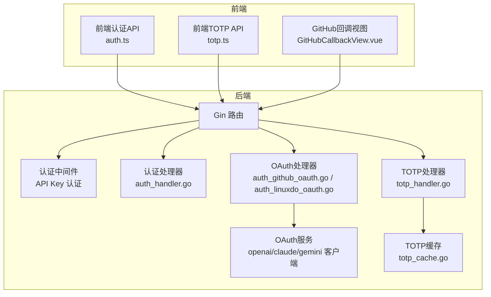
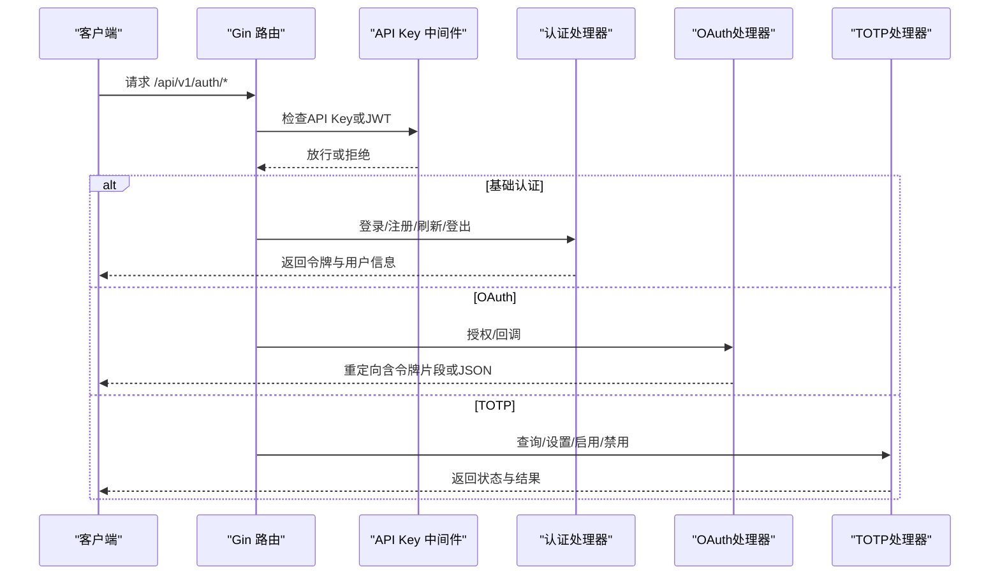
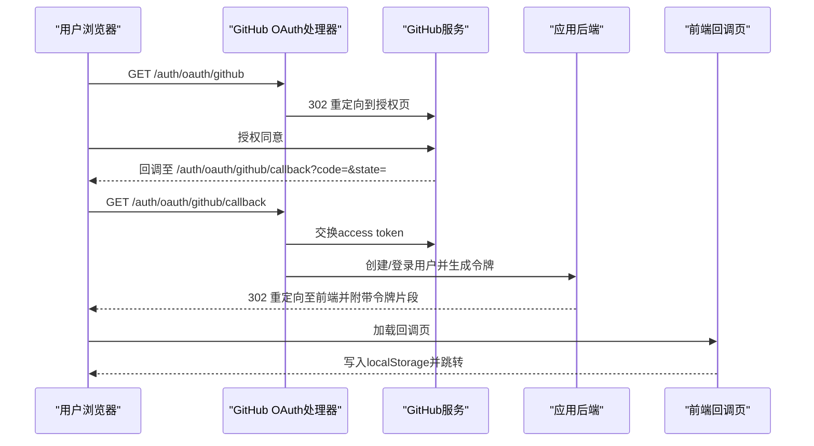
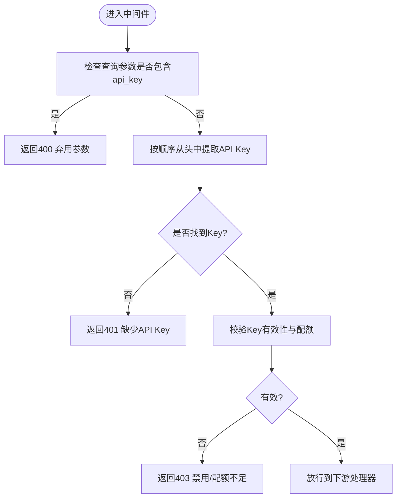
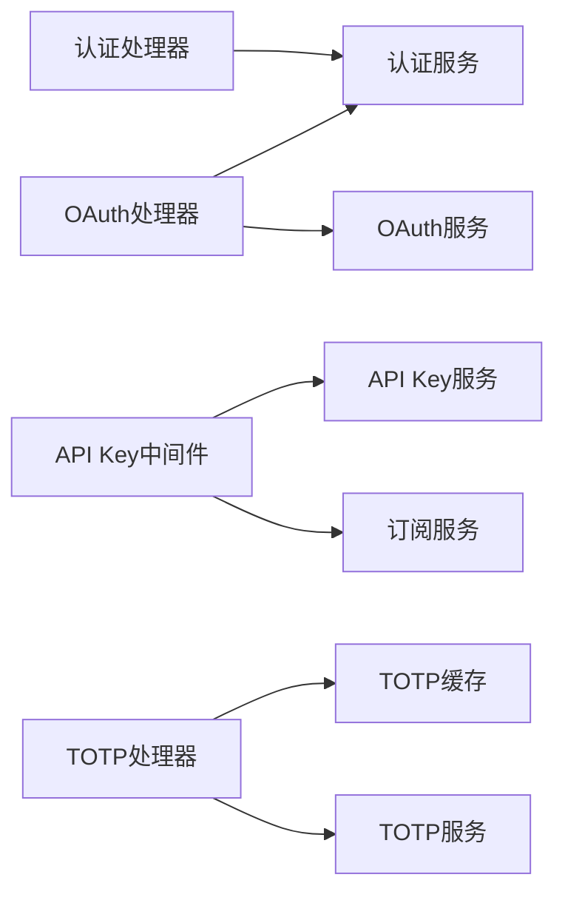

# 认证API

<cite>
**本文引用的文件**
- [backend/internal/handler/auth_handler.go](file://backend/internal/handler/auth_handler.go)
- [backend/internal/handler/auth_github_oauth.go](file://backend/internal/handler/auth_github_oauth.go)
- [backend/internal/handler/auth_linuxdo_oauth.go](file://backend/internal/handler/auth_linuxdo_oauth.go)
- [backend/internal/handler/totp_handler.go](file://backend/internal/handler/totp_handler.go)
- [backend/internal/server/middleware/api_key_auth.go](file://backend/internal/server/middleware/api_key_auth.go)
- [backend/internal/server/middleware/api_key_auth_google.go](file://backend/internal/server/middleware/api_key_auth_google.go)
- [backend/internal/pkg/oauth/oauth.go](file://backend/internal/pkg/oauth/oauth.go)
- [backend/internal/repository/gemini_oauth_client.go](file://backend/internal/repository/gemini_oauth_client.go)
- [backend/internal/repository/openai_oauth_service.go](file://backend/internal/repository/openai_oauth_service.go)
- [backend/internal/repository/claude_oauth_service.go](file://backend/internal/repository/claude_oauth_service.go)
- [backend/internal/repository/totp_cache.go](file://backend/internal/repository/totp_cache.go)
- [backend/internal/service/totp_service.go](file://backend/internal/service/totp_service.go)
- [frontend/src/api/auth.ts](file://frontend/src/api/auth.ts)
- [frontend/src/api/totp.ts](file://frontend/src/api/totp.ts)
- [frontend/src/views/auth/GitHubCallbackView.vue](file://frontend/src/views/auth/GitHubCallbackView.vue)
- [backend/cmd/jwtgen/main.go](file://backend/cmd/jwtgen/main.go)
</cite>

## 目录
1. [简介](#简介)
2. [项目结构](#项目结构)
3. [核心组件](#核心组件)
4. [架构总览](#架构总览)
5. [详细组件分析](#详细组件分析)
6. [依赖关系分析](#依赖关系分析)
7. [性能考量](#性能考量)
8. [故障排除指南](#故障排除指南)
9. [结论](#结论)
10. [附录](#附录)

## 简介
本文件系统性梳理认证API的设计与实现，覆盖用户登录、注册、令牌刷新、二次验证（TOTP）、OAuth第三方登录（GitHub、LinuxDo）等完整流程。文档同时阐述JWT令牌生成与验证机制、API Key认证方式、OAuth回调处理流程、请求参数与响应格式、状态码与错误处理策略，并给出认证中间件工作原理与安全考虑。为便于前后端对接，文档提供请求/响应示例与最佳实践。

## 项目结构
后端采用分层架构：路由与中间件位于 server 层，业务逻辑在 service 层，数据访问在 repository 层，领域模型与DTO在 internal 下对应模块。认证相关的核心入口为 handler 层中的认证处理器与TOTP处理器，以及中间件层的API Key认证中间件。前端通过API模块发起认证请求并在回调页处理OAuth结果。

图表来源
- [backend/internal/handler/auth_handler.go](file://backend/internal/handler/auth_handler.go)
- [backend/internal/handler/auth_github_oauth.go](file://backend/internal/handler/auth_github_oauth.go)
- [backend/internal/handler/auth_linuxdo_oauth.go](file://backend/internal/handler/auth_linuxdo_oauth.go)
- [backend/internal/handler/totp_handler.go](file://backend/internal/handler/totp_handler.go)
- [backend/internal/server/middleware/api_key_auth.go](file://backend/internal/server/middleware/api_key_auth.go)
- [backend/internal/pkg/oauth/oauth.go](file://backend/internal/pkg/oauth/oauth.go)
- [backend/internal/repository/totp_cache.go](file://backend/internal/repository/totp_cache.go)

章节来源
- [backend/internal/handler/auth_handler.go](file://backend/internal/handler/auth_handler.go)
- [backend/internal/handler/auth_github_oauth.go](file://backend/internal/handler/auth_github_oauth.go)
- [backend/internal/handler/auth_linuxdo_oauth.go](file://backend/internal/handler/auth_linuxdo_oauth.go)
- [backend/internal/handler/totp_handler.go](file://backend/internal/handler/totp_handler.go)
- [backend/internal/server/middleware/api_key_auth.go](file://backend/internal/server/middleware/api_key_auth.go)
- [backend/internal/pkg/oauth/oauth.go](file://backend/internal/pkg/oauth/oauth.go)
- [backend/internal/repository/totp_cache.go](file://backend/internal/repository/totp_cache.go)

## 核心组件
- 认证处理器：负责用户名密码登录、注册、令牌刷新、登出等基础认证能力。
- OAuth处理器：封装GitHub、LinuxDo等第三方登录授权与回调处理。
- TOTP处理器：提供TOTP（二次验证）的状态查询、设置、启用、禁用与验证码发送。
- API Key中间件：统一校验API Key，支持标准模式与Google风格错误响应。
- OAuth服务与客户端：封装OpenAI、Claude、Gemini等平台的OAuth交互细节。
- TOTP缓存与服务：维护TOTP密钥、计数器与时间窗口，保障一次性验证码安全。

章节来源
- [backend/internal/handler/auth_handler.go](file://backend/internal/handler/auth_handler.go)
- [backend/internal/handler/auth_github_oauth.go](file://backend/internal/handler/auth_github_oauth.go)
- [backend/internal/handler/auth_linuxdo_oauth.go](file://backend/internal/handler/auth_linuxdo_oauth.go)
- [backend/internal/handler/totp_handler.go](file://backend/internal/handler/totp_handler.go)
- [backend/internal/server/middleware/api_key_auth.go](file://backend/internal/server/middleware/api_key_auth.go)
- [backend/internal/server/middleware/api_key_auth_google.go](file://backend/internal/server/middleware/api_key_auth_google.go)
- [backend/internal/pkg/oauth/oauth.go](file://backend/internal/pkg/oauth/oauth.go)
- [backend/internal/repository/totp_cache.go](file://backend/internal/repository/totp_cache.go)
- [backend/internal/service/totp_service.go](file://backend/internal/service/totp_service.go)

## 架构总览
认证体系围绕“路由—中间件—处理器—服务—仓库”的分层设计展开。API Key中间件在进入业务处理器前进行统一鉴权；认证处理器与OAuth处理器分别处理传统认证与第三方登录；TOTP处理器独立管理二次验证；各平台OAuth客户端抽象统一的授权交换与用户信息获取流程。

图表来源
- [backend/internal/handler/auth_handler.go](file://backend/internal/handler/auth_handler.go)
- [backend/internal/handler/auth_github_oauth.go](file://backend/internal/handler/auth_github_oauth.go)
- [backend/internal/handler/totp_handler.go](file://backend/internal/handler/totp_handler.go)
- [backend/internal/server/middleware/api_key_auth.go](file://backend/internal/server/middleware/api_key_auth.go)

## 详细组件分析

### 用户认证（登录、注册、令牌刷新、登出）
- 登录
  - 方法与路径：POST /api/v1/auth/login
  - 请求体字段：用户名/邮箱、密码、是否记住登录
  - 响应字段：访问令牌、刷新令牌、过期秒数、用户信息
  - 状态码：200 成功；400 参数无效；401 未授权；429 请求频繁
  - 错误处理：对敏感错误不暴露具体原因，仅返回通用错误码
- 注册
  - 方法与路径：POST /api/v1/auth/register
  - 请求体字段：用户名、邮箱、密码、邀请码（可选）
  - 响应字段：访问令牌、刷新令牌、过期秒数、用户信息
  - 状态码：201 成功；400 参数无效；409 已存在；412 触发邀请限制
  - 错误处理：邀请码校验失败时返回邀请相关错误
- 刷新令牌
  - 方法与路径：POST /api/v1/auth/refresh
  - 请求体字段：刷新令牌
  - 响应字段：新的访问令牌、新的过期秒数
  - 状态码：200 成功；400 参数无效；401 未授权；404 不存在
  - 安全考虑：刷新令牌需安全存储，避免泄露
- 登出
  - 方法与路径：POST /api/v1/auth/logout
  - 请求体字段：刷新令牌
  - 响应字段：无
  - 状态码：200 成功；400 参数无效；401 未授权

章节来源
- [backend/internal/handler/auth_handler.go](file://backend/internal/handler/auth_handler.go)
- [frontend/src/api/auth.ts](file://frontend/src/api/auth.ts)

### 二次验证（TOTP）
- 获取状态
  - 方法与路径：GET /api/v1/user/totp/status
  - 响应字段：是否已启用、功能可用性
  - 状态码：200 成功；401 未授权
- 获取验证方式
  - 方法与路径：GET /api/v1/user/totp/verification-method
  - 响应字段：验证方式（邮箱/密码）
  - 状态码：200 成功；401 未授权
- 发送验证码
  - 方法与路径：POST /api/v1/user/totp/send-code
  - 响应字段：成功标志
  - 状态码：200 成功；400 参数无效；401 未授权
- 初始化设置
  - 方法与路径：POST /api/v1/user/totp/setup
  - 请求体字段：根据验证方式提供邮箱验证码或密码
  - 响应字段：密钥、二维码URL、设置令牌
  - 状态码：200 成功；400 参数无效；401 未授权
- 启用
  - 方法与路径：POST /api/v1/user/totp/enable
  - 请求体字段：设置令牌、一次性验证码
  - 响应字段：启用成功与启用时间
  - 状态码：200 成功；400 参数无效；401 未授权；422 校验失败
- 禁用
  - 方法与路径：POST /api/v1/user/totp/disable
  - 请求体字段：根据验证方式提供邮箱验证码或密码
  - 响应字段：成功标志
  - 状态码：200 成功；400 参数无效；401 未授权

章节来源
- [backend/internal/handler/totp_handler.go](file://backend/internal/handler/totp_handler.go)
- [backend/internal/repository/totp_cache.go](file://backend/internal/repository/totp_cache.go)
- [backend/internal/service/totp_service.go](file://backend/internal/service/totp_service.go)
- [frontend/src/api/totp.ts](file://frontend/src/api/totp.ts)

### OAuth第三方登录（GitHub、LinuxDo）
- GitHub授权
  - 授权入口：GET /api/v1/auth/oauth/github
  - 行为：生成随机nonce与state，拼装授权URL并302重定向
  - 安全要点：state用于防CSRF，nonce用于绑定会话
- GitHub回调
  - 回调入口：GET /api/v1/auth/oauth/github/callback
  - 行为：校验error、code、state；交换access token；获取用户信息；创建/登录用户；重定向至前端并携带令牌片段
  - 特殊情况：若触发邀请制，返回待完成注册令牌与重定向目标
  - 错误处理：对缺失参数、提供商错误、服务异常进行标准化错误返回
- LinuxDo授权与回调
  - 授权入口：GET /api/v1/auth/oauth/linuxdo
  - 回调入口：GET /api/v1/auth/oauth/linuxdo/callback
  - 行为：与GitHub类似，但使用LinuxDo配置与用户信息字段
- 前端回调处理
  - 解析URL片段中的令牌与错误信息，处理邀请制场景并跳转到仪表盘

图表来源
- [backend/internal/handler/auth_github_oauth.go](file://backend/internal/handler/auth_github_oauth.go)
- [frontend/src/views/auth/GitHubCallbackView.vue](file://frontend/src/views/auth/GitHubCallbackView.vue)

章节来源
- [backend/internal/handler/auth_github_oauth.go](file://backend/internal/handler/auth_github_oauth.go)
- [backend/internal/handler/auth_linuxdo_oauth.go](file://backend/internal/handler/auth_linuxdo_oauth.go)
- [frontend/src/views/auth/GitHubCallbackView.vue](file://frontend/src/views/auth/GitHubCallbackView.vue)

### API Key认证
- 支持位置
  - Authorization头（Bearer方案）
  - x-api-key头
  - x-goog-api-key头（兼容Gemini CLI）
- 行为
  - 若在查询参数中携带api_key，直接以400拒绝（弃用）
  - 从上述三个头中提取API Key并进行有效性与配额检查
  - 标准模式：返回通用错误格式
  - Google风格：返回Google兼容的错误结构（用于特定原生端点）
- 状态码
  - 400 弃用参数或格式错误
  - 401 缺少或无效API Key
  - 403 禁用或配额不足
  - 5xx 服务内部错误

图表来源
- [backend/internal/server/middleware/api_key_auth.go](file://backend/internal/server/middleware/api_key_auth.go)
- [backend/internal/server/middleware/api_key_auth_google.go](file://backend/internal/server/middleware/api_key_auth_google.go)

章节来源
- [backend/internal/server/middleware/api_key_auth.go](file://backend/internal/server/middleware/api_key_auth.go)
- [backend/internal/server/middleware/api_key_auth_google.go](file://backend/internal/server/middleware/api_key_auth_google.go)

### JWT令牌生成与验证
- 生成
  - 登录成功后签发访问令牌与刷新令牌，设置过期时间
  - 刷新令牌用于换取新的访问令牌，避免长期持有高权限令牌
- 验证
  - API Key中间件优先于JWT进行鉴权
  - 对于需要JWT的端点，通常通过Authorization头携带Bearer令牌
- 安全建议
  - 严格控制令牌过期时间与刷新频率
  - 刷新令牌应安全存储，防止泄露
  - 使用HTTPS传输，避免令牌在传输中被截获

章节来源
- [backend/internal/handler/auth_handler.go](file://backend/internal/handler/auth_handler.go)
- [backend/cmd/jwtgen/main.go](file://backend/cmd/jwtgen/main.go)

### OAuth平台适配（OpenAI、Claude、Gemini）
- OpenAI
  - 通过OpenAI OAuth服务封装授权交换与用户信息获取
- Claude
  - 通过Claude OAuth服务封装授权交换与用户信息获取
- Gemini
  - 通过Gemini OAuth客户端封装授权交换与用户信息获取
- 共同点
  - 统一的授权码交换流程
  - 统一的用户信息映射与账户绑定策略
  - 统一的错误处理与重定向策略

章节来源
- [backend/internal/repository/openai_oauth_service.go](file://backend/internal/repository/openai_oauth_service.go)
- [backend/internal/repository/claude_oauth_service.go](file://backend/internal/repository/claude_oauth_service.go)
- [backend/internal/repository/gemini_oauth_client.go](file://backend/internal/repository/gemini_oauth_client.go)
- [backend/internal/pkg/oauth/oauth.go](file://backend/internal/pkg/oauth/oauth.go)

## 依赖关系分析
- 认证处理器依赖服务层执行业务逻辑，服务层再依赖仓库层进行数据持久化
- OAuth处理器依赖平台OAuth服务与配置中心，回调阶段调用认证服务完成用户登录或注册
- API Key中间件依赖API Key服务与订阅服务，用于校验与配额检查
- TOTP处理器依赖TOTP缓存与服务，确保一次性验证码的安全性与时序正确性

图表来源
- [backend/internal/handler/auth_handler.go](file://backend/internal/handler/auth_handler.go)
- [backend/internal/handler/auth_github_oauth.go](file://backend/internal/handler/auth_github_oauth.go)
- [backend/internal/server/middleware/api_key_auth.go](file://backend/internal/server/middleware/api_key_auth.go)
- [backend/internal/repository/totp_cache.go](file://backend/internal/repository/totp_cache.go)
- [backend/internal/service/totp_service.go](file://backend/internal/service/totp_service.go)

章节来源
- [backend/internal/handler/auth_handler.go](file://backend/internal/handler/auth_handler.go)
- [backend/internal/handler/auth_github_oauth.go](file://backend/internal/handler/auth_github_oauth.go)
- [backend/internal/server/middleware/api_key_auth.go](file://backend/internal/server/middleware/api_key_auth.go)
- [backend/internal/repository/totp_cache.go](file://backend/internal/repository/totp_cache.go)
- [backend/internal/service/totp_service.go](file://backend/internal/service/totp_service.go)

## 性能考量
- API Key中间件应尽量减少数据库查询次数，必要时引入缓存
- OAuth回调阶段的令牌交换与用户信息获取应设置合理的超时与重试策略
- TOTP验证码生成与校验应使用时间同步算法，避免时钟漂移导致的失败
- 对高频认证接口开启限流与熔断，防止暴力破解与DDoS攻击

## 故障排除指南
- OAuth回调缺少参数
  - 现象：回调URL缺少code或state
  - 处理：检查授权配置与重定向地址，确认state与nonce一致性
- 提供商错误
  - 现象：回调携带provider_error
  - 处理：查看提供商返回的错误描述，修正客户端配置
- 邀请制触发
  - 现象：回调携带invitation_required
  - 处理：前端展示邀请码输入，提交后完成注册
- API Key弃用参数
  - 现象：查询参数携带api_key
  - 处理：改为Authorization头或x-api-key头
- API Key无效或禁用
  - 现象：401/403
  - 处理：检查API Key状态与配额，重新签发或提升配额

章节来源
- [backend/internal/handler/auth_github_oauth.go](file://backend/internal/handler/auth_github_oauth.go)
- [backend/internal/server/middleware/api_key_auth.go](file://backend/internal/server/middleware/api_key_auth.go)

## 结论
本认证体系通过清晰的分层设计与严格的中间件拦截，实现了从基础认证到第三方OAuth与二次验证的全链路覆盖。API Key与JWT双轨鉴权满足不同场景需求，TOTP增强了账户安全性，而平台化的OAuth适配保证了扩展性与一致性。建议在生产环境中结合限流、监控与审计日志，持续优化用户体验与系统安全。

## 附录
- 请求/响应示例（示意）
  - 登录
    - 请求：POST /api/v1/auth/login
    - 请求体：{"username_or_email":"user@example.com","password":"...","remember_me":true}
    - 响应：{"access_token":"...","refresh_token":"...","expires_in":3600,"user":{"id":1,"username":"user",...}}
  - 注册
    - 请求：POST /api/v1/auth/register
    - 请求体：{"username":"user","email":"user@example.com","password":"...","invitation_code":"ABC123"}
    - 响应：{"access_token":"...","refresh_token":"...","expires_in":3600,"user":{"id":1,...}}
  - 刷新令牌
    - 请求：POST /api/v1/auth/refresh
    - 请求体：{"refresh_token":"..."}
    - 响应：{"access_token":"...","expires_in":3600}
  - TOTP启用
    - 请求：POST /api/v1/user/totp/enable
    - 请求体：{"setup_token":"...","code":"123456"}
    - 响应：{"success":true,"enabled_at":"2025-01-01T00:00:00Z"}
  - GitHub回调
    - 回调URL片段：#access_token=...&refresh_token=...&expires_in=3600&token_type=Bearer&redirect=/dashboard
- 状态码速查
  - 200 OK：成功
  - 201 Created：注册成功
  - 400 Bad Request：参数无效或弃用参数
  - 401 Unauthorized：未授权
  - 403 Forbidden：禁用或配额不足
  - 404 Not Found：资源不存在
  - 409 Conflict：资源冲突（如用户名/邮箱已存在）
  - 412 Precondition Failed：触发邀请限制
  - 429 Too Many Requests：请求过于频繁
  - 500 Internal Server Error：服务器内部错误