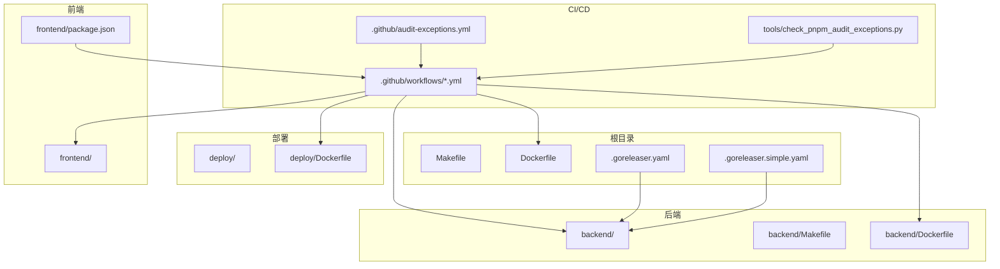
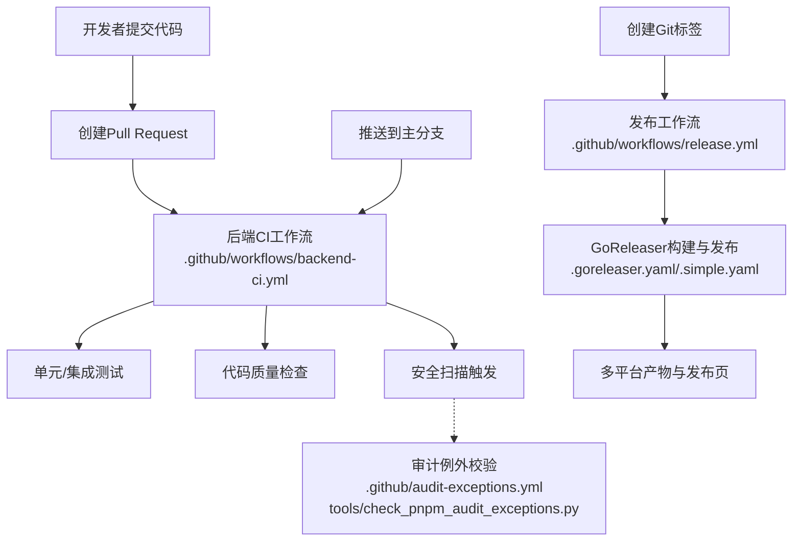
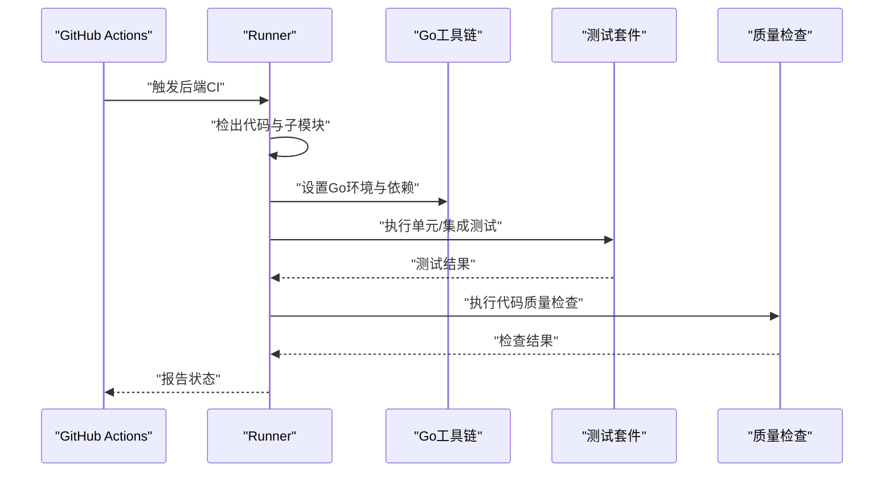
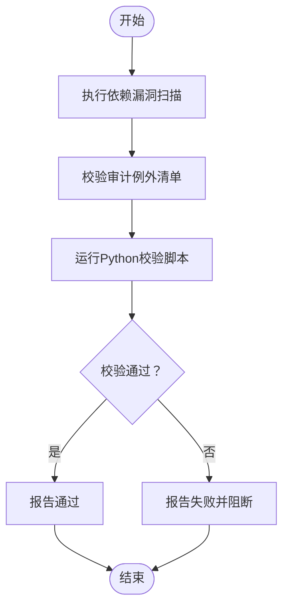
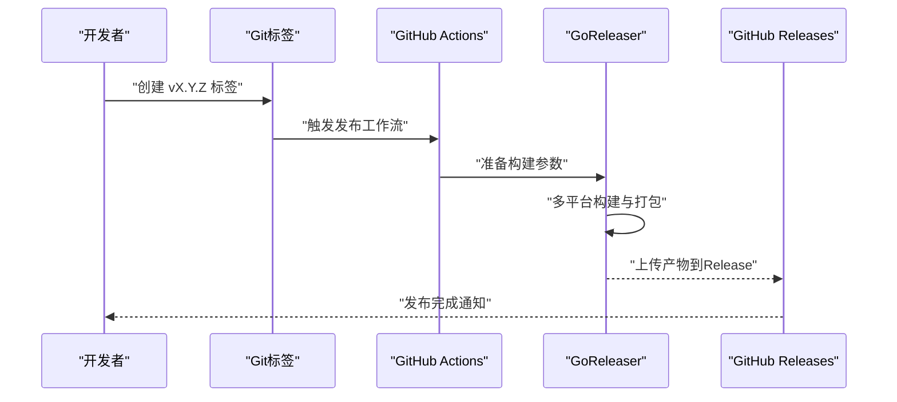
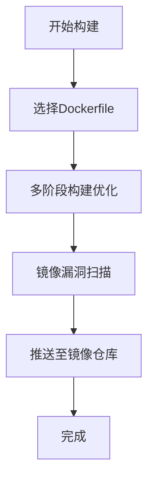
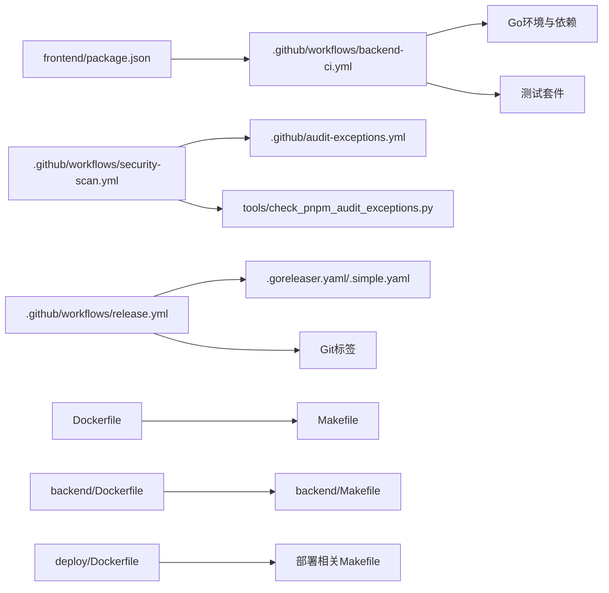

# CI/CD流水线配置

<cite>
**本文引用的文件**
- [.github/workflows/backend-ci.yml](file://.github/workflows/backend-ci.yml)
- [.github/workflows/release.yml](file://.github/workflows/release.yml)
- [.github/workflows/security-scan.yml](file://.github/workflows/security-scan.yml)
- [.goreleaser.yaml](file://.goreleaser.yaml)
- [.goreleaser.simple.yaml](file://.goreleaser.simple.yaml)
- [backend/Dockerfile](file://backend/Dockerfile)
- [deploy/Dockerfile](file://deploy/Dockerfile)
- [Dockerfile](file://Dockerfile)
- [Makefile](file://Makefile)
- [backend/Makefile](file://backend/Makefile)
- [frontend/package.json](file://frontend/package.json)
- [tools/check_pnpm_audit_exceptions.py](file://tools/check_pnpm_audit_exceptions.py)
- [.github/audit-exceptions.yml](file://.github/audit-exceptions.yml)
</cite>

## 目录
1. [简介](#简介)
2. [项目结构](#项目结构)
3. [核心组件](#核心组件)
4. [架构总览](#架构总览)
5. [详细组件分析](#详细组件分析)
6. [依赖关系分析](#依赖关系分析)
7. [性能考虑](#性能考虑)
8. [故障排除指南](#故障排除指南)
9. [结论](#结论)
10. [附录](#附录)

## 简介
本指南面向Sub2API项目的CI/CD流水线配置与使用，覆盖后端CI、安全扫描、发布流程、版本管理、容器化部署以及本地CI测试方法。文档基于仓库中现有的GitHub Actions工作流、GoReleaser配置、Dockerfile与Makefile等文件进行系统性梳理，帮助开发者快速理解并维护流水线。

## 项目结构
仓库采用多模块布局：后端服务位于backend目录，前端位于frontend目录，部署相关位于deploy目录，根目录包含通用的Dockerfile、Makefile与GoReleaser配置。CI/CD相关配置集中在.github/workflows目录下，另有安全审计例外配置与工具脚本。

**图表来源**
- [.github/workflows/backend-ci.yml](file://.github/workflows/backend-ci.yml)
- [.github/workflows/release.yml](file://.github/workflows/release.yml)
- [.github/workflows/security-scan.yml](file://.github/workflows/security-scan.yml)
- [.goreleaser.yaml](file://.goreleaser.yaml)
- [.goreleaser.simple.yaml](file://.goreleaser.simple.yaml)
- [backend/Dockerfile](file://backend/Dockerfile)
- [deploy/Dockerfile](file://deploy/Dockerfile)
- [Dockerfile](file://Dockerfile)
- [Makefile](file://Makefile)
- [backend/Makefile](file://backend/Makefile)
- [frontend/package.json](file://frontend/package.json)
- [.github/audit-exceptions.yml](file://.github/audit-exceptions.yml)
- [tools/check_pnpm_audit_exceptions.py](file://tools/check_pnpm_audit_exceptions.py)

**章节来源**
- [.github/workflows/backend-ci.yml](file://.github/workflows/backend-ci.yml)
- [.github/workflows/release.yml](file://.github/workflows/release.yml)
- [.github/workflows/security-scan.yml](file://.github/workflows/security-scan.yml)
- [.goreleaser.yaml](file://.goreleaser.yaml)
- [.goreleaser.simple.yaml](file://.goreleaser.simple.yaml)
- [backend/Dockerfile](file://backend/Dockerfile)
- [deploy/Dockerfile](file://deploy/Dockerfile)
- [Dockerfile](file://Dockerfile)
- [Makefile](file://Makefile)
- [backend/Makefile](file://backend/Makefile)
- [frontend/package.json](file://frontend/package.json)
- [.github/audit-exceptions.yml](file://.github/audit-exceptions.yml)
- [tools/check_pnpm_audit_exceptions.py](file://tools/check_pnpm_audit_exceptions.py)

## 核心组件
- 后端CI工作流：负责后端代码的单元测试、集成测试、代码质量检查（如静态分析）与安全扫描触发。
- 安全扫描工作流：独立执行依赖漏洞扫描与例外校验，确保供应链安全。
- 发布工作流：基于标签触发，使用GoReleaser进行跨平台构建、打包与发布。
- 版本管理：通过Git标签驱动发布；GoReleaser配置支持自定义发布元数据与产物命名。
- 容器化：提供多处Dockerfile用于不同场景（后端、部署、根目录），配合Makefile进行构建与推送。
- 前端CI：前端package.json中定义了脚本，可由CI工作流调用以执行测试与质量检查。
- 审计例外：GitHub审计例外清单与Python校验脚本共同保障依赖安全策略落地。

**章节来源**
- [.github/workflows/backend-ci.yml](file://.github/workflows/backend-ci.yml)
- [.github/workflows/security-scan.yml](file://.github/workflows/security-scan.yml)
- [.github/workflows/release.yml](file://.github/workflows/release.yml)
- [.goreleaser.yaml](file://.goreleaser.yaml)
- [.goreleaser.simple.yaml](file://.goreleaser.simple.yaml)
- [frontend/package.json](file://frontend/package.json)
- [.github/audit-exceptions.yml](file://.github/audit-exceptions.yml)
- [tools/check_pnpm_audit_exceptions.py](file://tools/check_pnpm_audit_exceptions.py)

## 架构总览
下图展示了CI/CD的整体交互：工作流在PR与主分支上触发，分别执行不同粒度的检查；安全扫描独立运行；发布工作流在打标签时触发并调用GoReleaser生成多平台产物。

**图表来源**
- [.github/workflows/backend-ci.yml](file://.github/workflows/backend-ci.yml)
- [.github/workflows/release.yml](file://.github/workflows/release.yml)
- [.github/workflows/security-scan.yml](file://.github/workflows/security-scan.yml)
- [.goreleaser.yaml](file://.goreleaser.yaml)
- [.goreleaser.simple.yaml](file://.goreleaser.simple.yaml)
- [.github/audit-exceptions.yml](file://.github/audit-exceptions.yml)
- [tools/check_pnpm_audit_exceptions.py](file://tools/check_pnpm_audit_exceptions.py)

## 详细组件分析

### 后端CI工作流
- 触发条件：PR与主分支推送。
- 关键步骤：
  - 检出代码与子模块
  - 设置Go环境
  - 还原依赖
  - 运行单元测试与集成测试
  - 代码质量检查（如静态分析）
  - 安全扫描触发
- 测试范围：后端服务的单元测试与集成测试，确保业务逻辑与数据库交互正确。
- 质量门禁：测试与质量检查失败将导致流水线失败，阻止合并。

**图表来源**
- [.github/workflows/backend-ci.yml](file://.github/workflows/backend-ci.yml)

**章节来源**
- [.github/workflows/backend-ci.yml](file://.github/workflows/backend-ci.yml)

### 安全扫描工作流
- 触发条件：独立于PR与主分支，可按需触发或作为后端CI的一部分。
- 关键步骤：
  - 执行依赖漏洞扫描（如Go依赖与前端依赖）
  - 校验审计例外清单
  - Python脚本验证pnpm审计例外是否合规
- 审计例外：GitHub提供例外清单，Python脚本辅助校验，避免误报与漏报。

**图表来源**
- [.github/workflows/security-scan.yml](file://.github/workflows/security-scan.yml)
- [.github/audit-exceptions.yml](file://.github/audit-exceptions.yml)
- [tools/check_pnpm_audit_exceptions.py](file://tools/check_pnpm_audit_exceptions.py)

**章节来源**
- [.github/workflows/security-scan.yml](file://.github/workflows/security-scan.yml)
- [.github/audit-exceptions.yml](file://.github/audit-exceptions.yml)
- [tools/check_pnpm_audit_exceptions.py](file://tools/check_pnpm_audit_exceptions.py)

### 发布工作流与版本管理
- 触发条件：创建Git标签（如vX.Y.Z）后自动触发。
- 关键步骤：
  - 检出代码与子模块
  - 设置Go环境与必要工具
  - 使用GoReleaser进行多平台构建、打包与发布
  - 上传产物至Release页面
- 版本管理：遵循语义化版本；GoReleaser配置支持自定义发布元信息与产物命名规则。

**图表来源**
- [.github/workflows/release.yml](file://.github/workflows/release.yml)
- [.goreleaser.yaml](file://.goreleaser.yaml)
- [.goreleaser.simple.yaml](file://.goreleaser.simple.yaml)

**章节来源**
- [.github/workflows/release.yml](file://.github/workflows/release.yml)
- [.goreleaser.yaml](file://.goreleaser.yaml)
- [.goreleaser.simple.yaml](file://.goreleaser.simple.yaml)

### 容器化部署CI配置
- 多处Dockerfile：
  - 根目录Dockerfile：通用镜像构建入口
  - backend/Dockerfile：后端服务专用镜像
  - deploy/Dockerfile：部署相关镜像
- 构建与推送：
  - Makefile提供构建与推送目标，便于CI调用
  - 可结合多阶段构建优化镜像体积与安全性
- 安全扫描：
  - 在CI中集成镜像漏洞扫描步骤，确保镜像基线符合要求

**图表来源**
- [Dockerfile](file://Dockerfile)
- [backend/Dockerfile](file://backend/Dockerfile)
- [deploy/Dockerfile](file://deploy/Dockerfile)
- [Makefile](file://Makefile)
- [backend/Makefile](file://backend/Makefile)

**章节来源**
- [Dockerfile](file://Dockerfile)
- [backend/Dockerfile](file://backend/Dockerfile)
- [deploy/Dockerfile](file://deploy/Dockerfile)
- [Makefile](file://Makefile)
- [backend/Makefile](file://backend/Makefile)

### 前端CI与质量检查
- 前端package.json中定义了脚本，可用于CI中执行测试与质量检查。
- 建议在后端CI工作流中调用前端脚本，统一在PR与主分支上执行质量门禁。

**章节来源**
- [frontend/package.json](file://frontend/package.json)

## 依赖关系分析
- 工作流与构建工具：
  - 后端CI依赖Go环境与测试框架
  - 发布工作流依赖GoReleaser与Git标签
  - 安全扫描依赖审计清单与校验脚本
- 容器化：
  - 多处Dockerfile与Makefile共同支撑镜像构建与推送
- 前端：
  - package.json中的脚本为前端质量检查提供入口

**图表来源**
- [.github/workflows/backend-ci.yml](file://.github/workflows/backend-ci.yml)
- [.github/workflows/security-scan.yml](file://.github/workflows/security-scan.yml)
- [.github/workflows/release.yml](file://.github/workflows/release.yml)
- [.goreleaser.yaml](file://.goreleaser.yaml)
- [.goreleaser.simple.yaml](file://.goreleaser.simple.yaml)
- [Dockerfile](file://Dockerfile)
- [backend/Dockerfile](file://backend/Dockerfile)
- [deploy/Dockerfile](file://deploy/Dockerfile)
- [Makefile](file://Makefile)
- [backend/Makefile](file://backend/Makefile)
- [frontend/package.json](file://frontend/package.json)
- [.github/audit-exceptions.yml](file://.github/audit-exceptions.yml)
- [tools/check_pnpm_audit_exceptions.py](file://tools/check_pnpm_audit_exceptions.py)

**章节来源**
- [.github/workflows/backend-ci.yml](file://.github/workflows/backend-ci.yml)
- [.github/workflows/security-scan.yml](file://.github/workflows/security-scan.yml)
- [.github/workflows/release.yml](file://.github/workflows/release.yml)
- [.goreleaser.yaml](file://.goreleaser.yaml)
- [.goreleaser.simple.yaml](file://.goreleaser.simple.yaml)
- [Dockerfile](file://Dockerfile)
- [backend/Dockerfile](file://backend/Dockerfile)
- [deploy/Dockerfile](file://deploy/Dockerfile)
- [Makefile](file://Makefile)
- [backend/Makefile](file://backend/Makefile)
- [frontend/package.json](file://frontend/package.json)
- [.github/audit-exceptions.yml](file://.github/audit-exceptions.yml)
- [tools/check_pnpm_audit_exceptions.py](file://tools/check_pnpm_audit_exceptions.py)

## 性能考虑
- 并行化：在后端CI中尽可能并行执行测试与质量检查，缩短流水线时长。
- 依赖缓存：利用Go与包管理器的缓存机制，减少重复下载时间。
- 镜像优化：多阶段构建降低最终镜像体积，提升拉取与启动速度。
- 分层构建：将测试与构建分离，仅在必要时执行完整构建。
- 缓存策略：为Go模块与前端依赖设置缓存，提高重复运行效率。

## 故障排除指南
- 后端CI失败：
  - 检查测试输出与日志定位失败原因
  - 确认依赖还原与Go版本兼容性
  - 核对质量检查规则是否变更
- 安全扫描失败：
  - 对照审计例外清单核对异常项
  - 运行Python校验脚本确认例外配置
  - 更新依赖修复已知漏洞
- 发布失败：
  - 确认标签格式与权限
  - 检查GoReleaser配置与环境变量
  - 查看Release页面上传状态
- 容器化问题：
  - 检查Dockerfile语法与构建上下文
  - 确认多阶段构建步骤顺序
  - 校验镜像漏洞扫描结果
- 本地CI测试：
  - 使用Makefile目标模拟CI步骤
  - 在本地运行测试与质量检查脚本
  - 使用容器镜像构建命令验证镜像可用性

**章节来源**
- [.github/workflows/backend-ci.yml](file://.github/workflows/backend-ci.yml)
- [.github/workflows/security-scan.yml](file://.github/workflows/security-scan.yml)
- [.github/workflows/release.yml](file://.github/workflows/release.yml)
- [.goreleaser.yaml](file://.goreleaser.yaml)
- [.goreleaser.simple.yaml](file://.goreleaser.simple.yaml)
- [Makefile](file://Makefile)
- [backend/Makefile](file://backend/Makefile)
- [Dockerfile](file://Dockerfile)
- [backend/Dockerfile](file://backend/Dockerfile)
- [deploy/Dockerfile](file://deploy/Dockerfile)

## 结论
本指南基于仓库现有配置，系统性梳理了Sub2API项目的CI/CD流水线：后端CI、安全扫描、发布流程、版本管理、容器化与前端质量检查。建议在实际使用中结合团队规范完善触发策略与质量门禁，持续优化构建与扫描性能，并定期更新GoReleaser与Docker配置以适配新版本工具链。

## 附录
- 快速参考
  - 后端CI：在PR与主分支触发，执行测试与质量检查
  - 安全扫描：独立运行，校验审计例外与依赖漏洞
  - 发布：基于Git标签，使用GoReleaser多平台构建
  - 容器化：多处Dockerfile与Makefile支撑镜像构建与推送
  - 本地测试：使用Makefile与脚本模拟CI步骤