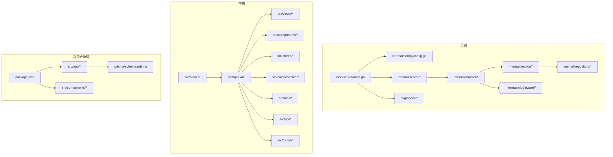
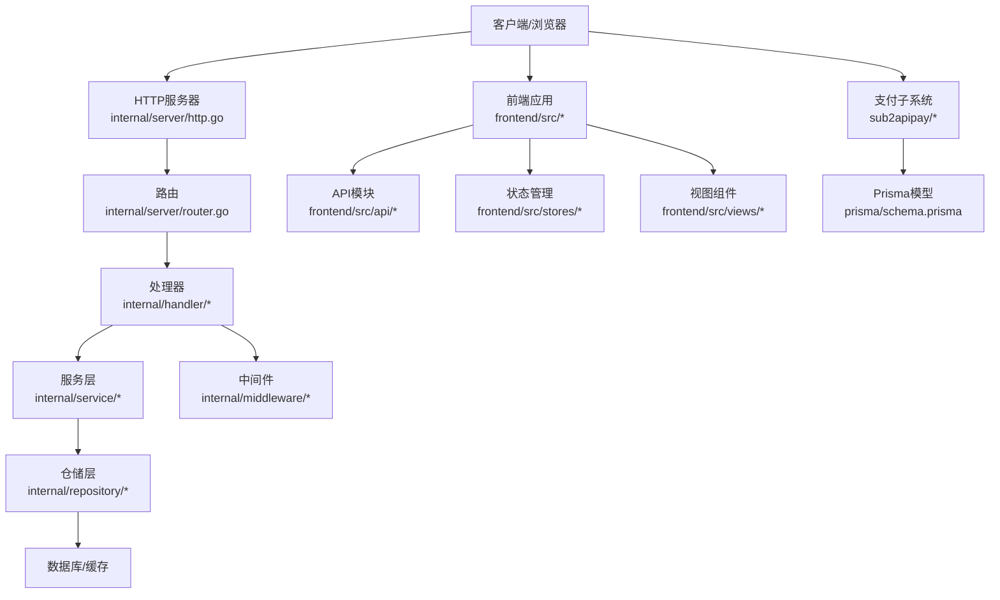
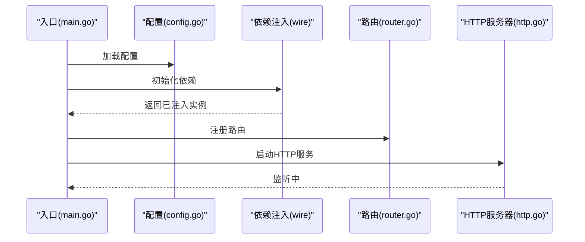
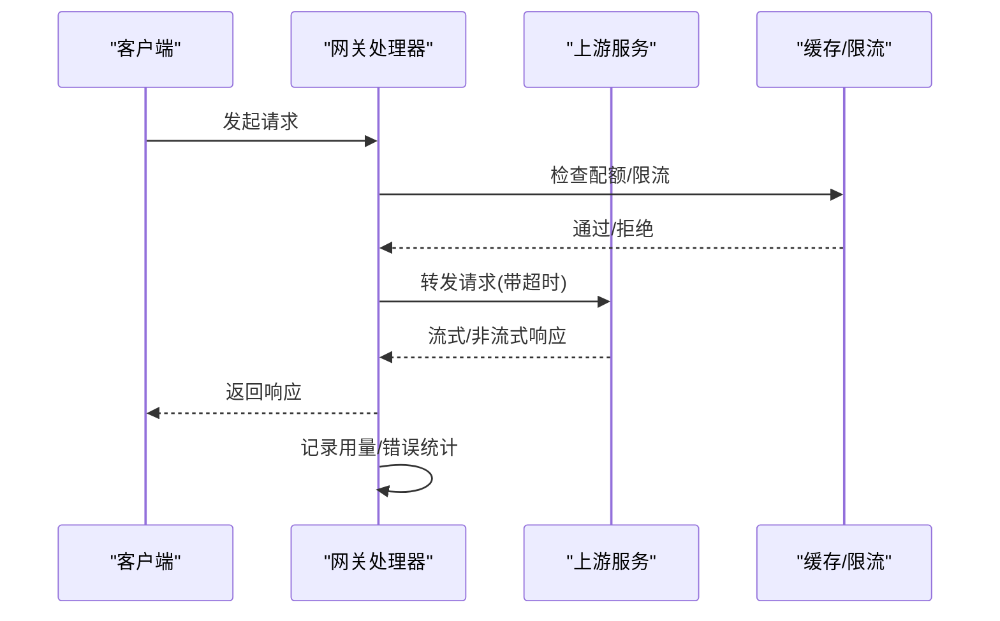
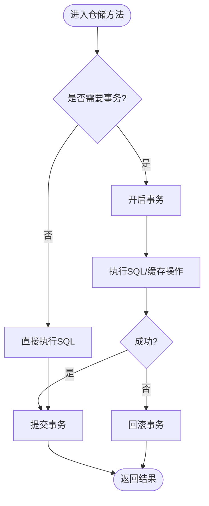
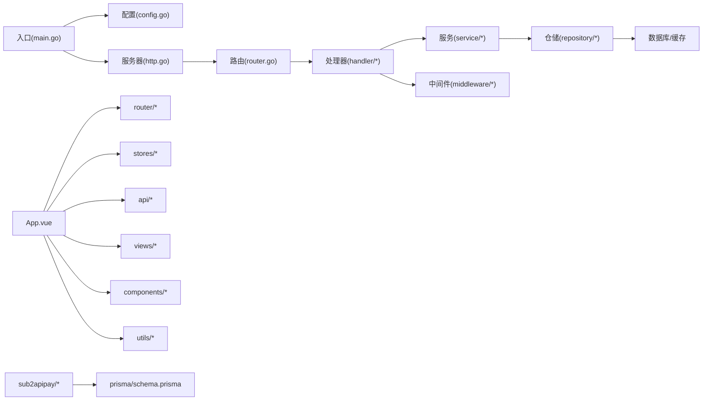

# 代码审查检查清单

<cite>
**本文引用的文件**
- [backend/cmd/server/main.go](file://backend/cmd/server/main.go)
- [backend/internal/config/config.go](file://backend/internal/config/config.go)
- [backend/internal/handler/gateway_handler.go](file://backend/internal/handler/gateway_handler.go)
- [backend/internal/handler/openai_gateway_handler.go](file://backend/internal/handler/openai_gateway_handler.go)
- [backend/internal/handler/announcement_handler.go](file://backend/internal/handler/announcement_handler.go)
- [backend/internal/repository/api_key_repo.go](file://backend/internal/repository/api_key_repo.go)
- [backend/internal/repository/user_repo.go](file://backend/internal/repository/user_repo.go)
- [backend/internal/service/account_service.go](file://backend/internal/service/account_service.go)
- [backend/internal/middleware/rate_limiter.go](file://backend/internal/middleware/rate_limiter.go)
- [backend/internal/server/router.go](file://backend/internal/server/router.go)
- [backend/internal/server/http.go](file://backend/internal/server/http.go)
- [backend/go.mod](file://backend/go.mod)
- [backend/.golangci.yml](file://backend/.golangci.yml)
- [frontend/package.json](file://frontend/package.json)
- [frontend/vite.config.ts](file://frontend/vite.config.ts)
- [frontend/tsconfig.json](file://frontend/tsconfig.json)
- [frontend/tailwind.config.js](file://frontend/tailwind.config.js)
- [frontend/.eslintrc.cjs](file://frontend/.eslintrc.cjs)
- [frontend/src/main.ts](file://frontend/src/main.ts)
- [frontend/src/App.vue](file://frontend/src/App.vue)
- [frontend/src/components/](file://frontend/src/components/)
- [frontend/src/stores/](file://frontend/src/stores/)
- [frontend/src/composables/](file://frontend/src/composables/)
- [frontend/src/views/](file://frontend/src/views/)
- [frontend/src/utils/](file://frontend/src/utils/)
- [frontend/src/api/](file://frontend/src/api/)
- [frontend/src/router/](file://frontend/src/router/)
- [sub2apipay/package.json](file://sub2apipay/package.json)
- [sub2apipay/src/app/](file://sub2apipay/src/app/)
- [sub2apipay/src/components/](file://sub2apipay/src/components/)
- [sub2apipay/prisma/schema.prisma](file://sub2apipay/prisma/schema.prisma)
- [.goreleaser.yaml](file://.goreleaser.yaml)
- [.goreleaser.simple.yaml](file://.goreleaser.simple.yaml)
- [Makefile](file://Makefile)
- [deploy/docker-compose.yml](file://deploy/docker-compose.yml)
- [deploy/Dockerfile](file://deploy/Dockerfile)
- [backend/migrations/README.md](file://backend/migrations/README.md)
- [backend/migrations/001_init.sql](file://backend/migrations/001_init.sql)
- [backend/migrations/002_account_type_migration.sql](file://backend/migrations/002_account_type_migration.sql)
- [backend/migrations/003_subscription.sql](file://backend/migrations/003_subscription.sql)
- [backend/migrations/004_add_redeem_code_notes.sql](file://backend/migrations/004_add_redeem_code_notes.sql)
- [backend/migrations/005_schema_parity.sql](file://backend/migrations/005_schema_parity.sql)
- [backend/migrations/006_add_users_allowed_groups_compat.sql](file://backend/migrations/006_add_users_allowed_groups_compat.sql)
- [backend/migrations/006b_guard_users_allowed_groups.sql](file://backend/migrations/006b_guard_users_allowed_groups.sql)
- [backend/migrations/007_add_user_allowed_groups.sql](file://backend/migrations/007_add_user_allowed_groups.sql)
- [backend/migrations/008_seed_default_group.sql](file://backend/migrations/008_seed_default_group.sql)
- [backend/migrations/009_fix_usage_logs_cache_columns.sql](file://backend/migrations/009_fix_usage_logs_cache_columns.sql)
- [backend/migrations/010_add_usage_logs_aggregated_indexes.sql](file://backend/migrations/010_add_usage_logs_aggregated_indexes.sql)
- [backend/migrations/011_remove_duplicate_unique_indexes.sql](file://backend/migrations/011_remove_duplicate_unique_indexes.sql)
- [backend/migrations/012_add_user_subscription_soft_delete.sql](file://backend/migrations/012_add_user_subscription_soft_delete.sql)
- [backend/migrations/013_log_orphan_allowed_groups.sql](file://backend/migrations/013_log_orphan_allowed_groups.sql)
- [backend/migrations/014_drop_legacy_allowed_groups.sql](file://backend/migrations/014_drop_legacy_allowed_groups.sql)
- [backend/migrations/015_fix_settings_unique_constraint.sql](file://backend/migrations/015_fix_settings_unique_constraint.sql)
- [backend/migrations/016_soft_delete_partial_unique_indexes.sql](file://backend/migrations/016_soft_delete_partial_unique_indexes.sql)
- [backend/migrations/018_user_attributes.sql](file://backend/migrations/018_user_attributes.sql)
- [backend/migrations/019_migrate_wechat_to_attributes.sql](file://backend/migrations/019_migrate_wechat_to_attributes.sql)
- [backend/migrations/020_add_temp_unschedulable.sql](file://backend/migrations/020_add_temp_unschedulable.sql)
- [backend/migrations/024_add_gemini_tier_id.sql](file://backend/migrations/024_add_gemini_tier_id.sql)
- [backend/migrations/026_ops_metrics_aggregation_tables.sql](file://backend/migrations/026_ops_metrics_aggregation_tables.sql)
- [backend/migrations/027_usage_billing_consistency.sql](file://backend/migrations/027_usage_billing_consistency.sql)
- [backend/migrations/028_add_account_notes.sql](file://backend/migrations/028_add_account_notes.sql)
- [backend/migrations/028_add_usage_logs_user_agent.sql](file://backend/migrations/028_add_usage_logs_user_agent.sql)
- [backend/migrations/028_group_image_pricing.sql](file://backend/migrations/028_group_image_pricing.sql)
- [backend/migrations/029_add_group_claude_code_restriction.sql](file://backend/migrations/029_add_group_claude_code_restriction.sql)
- [backend/migrations/029_usage_log_image_fields.sql](file://backend/migrations/029_usage_log_image_fields.sql)
- [backend/migrations/030_add_account_expires_at.sql](file://backend/migrations/030_add_account_expires_at.sql)
- [backend/migrations/031_add_ip_address.sql](file://backend/migrations/031_add_ip_address.sql)
- [backend/migrations/032_add_api_key_ip_restriction.sql](file://backend/migrations/032_add_api_key_ip_restriction.sql)
- [backend/migrations/033_add_promo_codes.sql](file://backend/migrations/033_add_promo_codes.sql)
- [backend/migrations/033_ops_monitoring_vnext.sql](file://backend/migrations/033_ops_monitoring_vnext.sql)
- [backend/migrations/034_ops_upstream_error_events.sql](file://backend/migrations/034_ops_upstream_error_events.sql)
- [backend/migrations/034_usage_dashboard_aggregation_tables.sql](file://backend/migrations/034_usage_dashboard_aggregation_tables.sql)
- [backend/migrations/035_usage_logs_partitioning.sql](file://backend/migrations/035_usage_logs_partitioning.sql)
- [backend/migrations/036_ops_error_logs_add_is_count_tokens.sql](file://backend/migrations/036_ops_error_logs_add_is_count_tokens.sql)
- [backend/migrations/036_scheduler_outbox.sql](file://backend/migrations/036_scheduler_outbox.sql)
- [backend/migrations/037_add_account_rate_multiplier.sql](file://backend/migrations/037_add_account_rate_multiplier.sql)
- [backend/migrations/037_ops_alert_silences.sql](file://backend/migrations/037_ops_alert_silences.sql)
- [backend/migrations/038_ops_errors_resolution_retry_results_and_standardize_classification.sql](file://backend/migrations/038_ops_errors_resolution_retry_results_and_standardize_classification.sql)
- [backend/migrations/039_ops_job_heartbeats_add_last_result.sql](file://backend/migrations/039_ops_job_heartbeats_add_last_result.sql)
- [backend/migrations/040_add_group_model_routing.sql](file://backend/migrations/040_add_group_model_routing.sql)
- [backend/migrations/041_add_model_routing_enabled.sql](file://backend/migrations/041_add_model_routing_enabled.sql)
- [backend/migrations/042_add_usage_cleanup_tasks.sql](file://backend/migrations/042_add_usage_cleanup_tasks.sql)
- [backend/migrations/042b_add_ops_system_metrics_switch_count.sql](file://backend/migrations/042b_add_ops_system_metrics_switch_count.sql)
- [backend/migrations/043_add_usage_cleanup_cancel_audit.sql](file://backend/migrations/043_add_usage_cleanup_cancel_audit.sql)
- [backend/migrations/043b_add_group_invalid_request_fallback.sql](file://backend/migrations/043b_add_group_invalid_request_fallback.sql)
- [backend/migrations/044_add_user_totp.sql](file://backend/migrations/044_add_user_totp.sql)
- [backend/migrations/044b_add_group_mcp_xml_inject.sql](file://backend/migrations/044b_add_group_mcp_xml_inject.sql)
- [backend/migrations/045_add_accounts_extra_index.sql](file://backend/migrations/045_add_accounts_extra_index.sql)
- [backend/migrations/045_add_announcements.sql](file://backend/migrations/045_add_announcements.sql)
- [backend/migrations/045_add_api_key_quota.sql](file://backend/migrations/045_add_api_key_quota.sql)
- [backend/migrations/046_add_sora_accounts.sql](file://backend/migrations/046_add_sora_accounts.sql)
- [backend/migrations/046_add_usage_log_reasoning_effort.sql](file://backend/migrations/046_add_usage_log_reasoning_effort.sql)
- [backend/migrations/046b_add_group_supported_model_scopes.sql](file://backend/migrations/046b_add_group_supported_model_scopes.sql)
- [backend/migrations/047_add_sora_pricing_and_media_type.sql](file://backend/migrations/047_add_sora_pricing_and_media_type.sql)
- [backend/migrations/047_add_user_group_rate_multipliers.sql](file://backend/migrations/047_add_user_group_rate_multipliers.sql)
- [backend/migrations/048_add_error_passthrough_rules.sql](file://backend/migrations/048_add_error_passthrough_rules.sql)
- [backend/migrations/049_unify_antigravity_model_mapping.sql](file://backend/migrations/049_unify_antigravity_model_mapping.sql)
- [backend/migrations/050_map_opus46_to_opus45.sql](file://backend/migrations/050_map_opus46_to_opus45.sql)
- [backend/migrations/051_migrate_opus45_to_opus46_thinking.sql](file://backend/migrations/051_migrate_opus45_to_opus46_thinking.sql)
- [backend/migrations/052_add_group_sort_order.sql](file://backend/migrations/052_add_group_sort_order.sql)
- [backend/migrations/052_migrate_upstream_to_apikey.sql](file://backend/migrations/052_migrate_upstream_to_apikey.sql)
- [backend/migrations/053_add_referral_system.sql](file://backend/migrations/053_add_referral_system.sql)
- [backend/migrations/053_add_security_secrets.sql](file://backend/migrations/053_add_security_secrets.sql)
- [backend/migrations/053_add_skip_monitoring_to_error_passthrough.sql](file://backend/migrations/053_add_skip_monitoring_to_error_passthrough.sql)
- [backend/migrations/054_drop_legacy_cache_columns.sql](file://backend/migrations/054_drop_legacy_cache_columns.sql)
- [backend/migrations/054_ops_system_logs.sql](file://backend/migrations/054_ops_system_logs.sql)
- [backend/migrations/055_add_cache_ttl_overridden.sql](file://backend/migrations/055_add_cache_ttl_overridden.sql)
- [backend/migrations/056_add_api_key_last_used_at.sql](file://backend/migrations/056_add_api_key_last_used_at.sql)
- [backend/migrations/057_add_idempotency_records.sql](file://backend/migrations/057_add_idempotency_records.sql)
- [backend/migrations/058_add_sonnet46_to_model_mapping.sql](file://backend/migrations/058_add_sonnet46_to_model_mapping.sql)
- [backend/migrations/059_add_gemini31_pro_to_model_mapping.sql](file://backend/migrations/059_add_gemini31_pro_to_model_mapping.sql)
- [backend/migrations/060_add_gemini31_flash_image_to_model_mapping.sql](file://backend/migrations/060_add_gemini31_flash_image_to_model_mapping.sql)
- [backend/migrations/060_add_usage_log_openai_ws_mode.sql](file://backend/migrations/060_add_usage_log_openai_ws_mode.sql)
- [backend/migrations/061_add_usage_log_request_type.sql](file://backend/migrations/061_add_usage_log_request_type.sql)
- [backend/migrations/062_add_scheduler_and_usage_composite_indexes_notx.sql](file://backend/migrations/062_add_scheduler_and_usage_composite_indexes_notx.sql)
- [backend/migrations/063_add_scheduled_test_tables.sql](file://backend/migrations/063_add_scheduled_test_tables.sql)
- [backend/migrations/064_add_api_key_rate_limits.sql](file://backend/migrations/064_add_api_key_rate_limits.sql)
- [backend/migrations/065_add_search_trgm_indexes.sql](file://backend/migrations/065_add_search_trgm_indexes.sql)
- [backend/migrations/066_add_scheduled_test_auto_recover.sql](file://backend/migrations/066_add_scheduled_test_auto_recover.sql)
- [backend/migrations/067_add_account_load_factor.sql](file://backend/migrations/067_add_account_load_factor.sql)
- [backend/migrations/068_add_announcement_notify_mode.sql](file://backend/migrations/068_add_announcement_notify_mode.sql)
- [backend/migrations/069_add_group_messages_dispatch.sql](file://backend/migrations/069_add_group_messages_dispatch.sql)
- [backend/migrations/070_add_scheduled_test_auto_recover.sql](file://backend/migrations/070_add_scheduled_test_auto_recover.sql)
- [backend/migrations/070_add_usage_log_service_tier.sql](file://backend/migrations/070_add_usage_log_service_tier.sql)
- [backend/migrations/071_add_gemini25_flash_image_to_model_mapping.sql](file://backend/migrations/071_add_gemini25_flash_image_to_model_mapping.sql)
- [backend/migrations/071_add_usage_billing_dedup.sql](file://backend/migrations/071_add_usage_billing_dedup.sql)
- [backend/migrations/072_add_usage_billing_dedup_created_at_brin_notx.sql](file://backend/migrations/072_add_usage_billing_dedup_created_at_brin_notx.sql)
- [backend/migrations/073_add_usage_billing_dedup_archive.sql](file://backend/migrations/073_add_usage_billing_dedup_archive.sql)
- [backend/migrations/074_add_usage_log_endpoints.sql](file://backend/migrations/074_add_usage_log_endpoints.sql)
- [backend/migrations/075_add_usage_log_upstream_model.sql](file://backend/migrations/075_add_usage_log_upstream_model.sql)
- [backend/migrations/075_map_haiku45_to_sonnet46.sql](file://backend/migrations/075_map_haiku45_to_sonnet46.sql)
- [backend/migrations/076_add_usage_log_upstream_model_index_notx.sql](file://backend/migrations/076_add_usage_log_upstream_model_index_notx.sql)
- [backend/migrations/077_add_usage_log_requested_model.sql](file://backend/migrations/077_add_usage_log_requested_model.sql)
- [backend/migrations/078_add_usage_log_requested_model_index_notx.sql](file://backend/migrations/078_add_usage_log_requested_model_index_notx.sql)
- [backend/migrations/079_ops_error_logs_add_endpoint_fields.sql](file://backend/migrations/079_ops_error_logs_add_endpoint_fields.sql)
- [backend/migrations/080_create_tls_fingerprint_profiles.sql](file://backend/migrations/080_create_tls_fingerprint_profiles.sql)
- [backend/migrations/081_add_group_account_filter.sql](file://backend/migrations/081_add_group_account_filter.sql)
- [backend/migrations/081_create_channels.sql](file://backend/migrations/081_create_channels.sql)
- [backend/migrations/082_refactor_channel_pricing.sql](file://backend/migrations/082_refactor_channel_pricing.sql)
- [backend/migrations/083_channel_model_mapping.sql](file://backend/migrations/083_channel_model_mapping.sql)
- [backend/migrations/084_channel_billing_model_source.sql](file://backend/migrations/084_channel_billing_model_source.sql)
- [backend/migrations/085_channel_restrict_and_per_request_price.sql](file://backend/migrations/085_channel_restrict_and_per_request_price.sql)
- [backend/migrations/086_channel_platform_pricing.sql](file://backend/migrations/086_channel_platform_pricing.sql)
- [backend/migrations/087_usage_log_billing_mode.sql](file://backend/migrations/087_usage_log_billing_mode.sql)
- [backend/migrations/088_channel_billing_model_source_channel_mapped.sql](file://backend/migrations/088_channel_billing_model_source_channel_mapped.sql)
- [backend/migrations/089_usage_log_image_output_tokens.sql](file://backend/migrations/089_usage_log_image_output_tokens.sql)
- [backend/migrations/090_drop_sora.sql](file://backend/migrations/090_drop_sora.sql)
- [backend/migrations/091_add_group_status_tables.sql](file://backend/migrations/091_add_group_status_tables.sql)
- [backend/migrations/144_add_opus48_to_model_mapping.sql](file://backend/migrations/144_add_opus48_to_model_mapping.sql)
- [backend/migrations/migrations.go](file://backend/migrations/migrations.go)
- [backend/internal/integration/e2e_gateway_test.go](file://backend/internal/integration/e2e_gateway_test.go)
- [backend/internal/integration/e2e_helpers_test.go](file://backend/internal/integration/e2e_helpers_test.go)
- [backend/internal/integration/e2e_user_flow_test.go](file://backend/internal/integration/e2e_user_flow_test.go)
- [backend/internal/repository/api_key_repo_integration_test.go](file://backend/internal/repository/api_key_repo_integration_test.go)
- [backend/internal/repository/billing_cache_integration_test.go](file://backend/internal/repository/billing_cache_integration_test.go)
- [backend/internal/repository/concurrency_cache_integration_test.go](file://backend/internal/repository/concurrency_cache_integration_test.go)
- [backend/internal/repository/dashboard_cache_test.go](file://backend/internal/repository/dashboard_cache_test.go)
- [backend/internal/repository/email_cache_integration_test.go](file://backend/internal/repository/email_cache_integration_test.go)
- [backend/internal/repository/gateway_cache_integration_test.go](file://backend/internal/repository/gateway_cache_integration_test.go)
- [backend/internal/repository/group_repo_integration_test.go](file://backend/internal/repository/group_repo_integration_test.go)
- [backend/internal/repository/geminidrive_client.go](file://backend/internal/repository/geminidrive_client.go)
- [backend/internal/repository/geminioauth_client.go](file://backend/internal/repository/geminioauth_client.go)
- [backend/internal/repository/geminitoken_cache_integration_test.go](file://backend/internal/repository/geminitoken_cache_integration_test.go)
- [backend/internal/repository/geminicli_codeassist_client.go](file://backend/internal/repository/geminicli_codeassist_client.go)
- [backend/internal/repository/github_release_service_test.go](file://backend/internal/repository/github_release_service_test.go)
- [backend/internal/repository/identity_cache_integration_test.go](file://backend/internal/repository/identity_cache_integration_test.go)
- [backend/internal/repository/openai_oauth_service_test.go](file://backend/internal/repository/openai_oauth_service_test.go)
- [backend/internal/repository/ops_repo_dashboard_timeout_test.go](file://backend/internal/repository/ops_repo_dashboard_timeout_test.go)
- [backend/internal/repository/ops_repo_error_where_test.go](file://backend/internal/repository/ops_repo_error_where_test.go)
- [backend/internal/repository/ops_repo_histograms_test.go](file://backend/internal/repository/ops_repo_histograms_test.go)
- [backend/internal/repository/ops_repo_latency_histogram_buckets_test.go](file://backend/internal/repository/ops_repo_latency_histogram_buckets_test.go)
- [backend/internal/repository/ops_repo_openai_token_stats_test.go](file://backend/internal/repository/ops_repo_openai_token_stats_test.go)
- [backend/internal/repository/ops_repo_preagg_test.go](file://backend/internal/repository/ops_repo_preagg_test.go)
- [backend/internal/repository/ops_repo_realtime_traffic_test.go](file://backend/internal/repository/ops_repo_realtime_traffic_test.go)
- [backend/internal/repository/ops_repo_request_details_test.go](file://backend/internal/repository/ops_repo_request_details_test.go)
- [backend/internal/repository/ops_repo_system_logs_test.go](file://backend/internal/repository/ops_repo_system_logs_test.go)
- [backend/internal/repository/ops_repo_trends_test.go](file://backend/internal/repository/ops_repo_trends_test.go)
- [backend/internal/repository/ops_repo_window_stats_test.go](file://backend/internal/repository/ops_repo_window_stats_test.go)
- [backend/internal/repository/ops_write_pressure_integration_test.go](file://backend/internal/repository/ops_write_pressure_integration_test.go)
- [backend/internal/repository/pricing_service_test.go](file://backend/internal/repository/pricing_service_test.go)
- [backend/internal/repository/redeem_cache_integration_test.go](file://backend/internal/repository/redeem_cache_integration_test.go)
- [backend/internal/repository/redeem_code_repo_integration_test.go](file://backend/internal/repository/redeem_code_repo_integration_test.go)
- [backend/internal/repository/redis_test.go](file://backend/internal/repository/redis_test.go)
- [backend/internal/repository/scheduler_cache_integration_test.go](file://backend/internal/repository/scheduler_cache_integration_test.go)
- [backend/internal/repository/scheduler_snapshot_outbox_integration_test.go](file://backend/internal/repository/scheduler_snapshot_outbox_integration_test.go)
- [backend/internal/repository/security_secret_bootstrap_test.go](file://backend/internal/repository/security_secret_bootstrap_test.go)
- [backend/internal/repository/turnstile_service_test.go](file://backend/internal/repository/turnstile_service_test.go)
- [backend/internal/repository/update_cache_integration_test.go](file://backend/internal/repository/update_cache_integration_test.go)
- [backend/internal/repository/usage_billing_repo_integration_test.go](file://backend/internal/repository/usage_billing_repo_integration_test.go)
- [backend/internal/repository/usage_cleanup_repo_ent_test.go](file://backend/internal/repository/usage_cleanup_repo_ent_test.go)
- [backend/internal/repository/usage_cleanup_repo_test.go](file://backend/internal/repository/usage_cleanup_repo_test.go)
- [backend/internal/repository/usage_log_repo_integration_test.go](file://backend/internal/repository/usage_log_repo_integration_test.go)
- [backend/internal/repository/usage_log_repo_request_type_test.go](file://backend/internal/repository/usage_log_repo_request_type_test.go)
- [backend/internal/repository/user_repo_integration_test.go](file://backend/internal/repository/user_repo_integration_test.go)
- [backend/internal/repository/user_subscription_repo_integration_test.go](file://backend/internal/repository/user_subscription_repo_integration_test.go)
- [backend/internal/repository/wire.go](file://backend/internal/repository/wire.go)
- [backend/internal/repository/channel_repo.go](file://backend/internal/repository/channel_repo.go)
- [backend/internal/repository/channel_repo_pricing.go](file://backend/internal/repository/channel_repo_pricing.go)
- [backend/internal/repository/channel_repo_test.go](file://backend/internal/repository/channel_repo_test.go)
- [backend/internal/repository/error_passthrough_repo.go](file://backend/internal/repository/error_passthrough_repo.go)
- [backend/internal/repository/proxy_repo.go](file://backend/internal/repository/proxy_repo.go)
- [backend/internal/repository/setting_repo.go](file://backend/internal/repository/setting_repo.go)
- [backend/internal/repository/user_attribute_repo.go](file://backend/internal/repository/user_attribute_repo.go)
- [backend/internal/repository/user_group_rate_repo.go](file://backend/internal/repository/user_group_rate_repo.go)
- [backend/internal/repository/user_msg_queue_cache.go](file://backend/internal/repository/user_msg_queue_cache.go)
- [backend/internal/repository/user_subscription_repo.go](file://backend/internal/repository/user_subscription_repo.go)
- [backend/internal/repository/usage_log_repo.go](file://backend/internal/repository/usage_log_repo.go)
- [backend/internal/repository/usage_log_repo_unit_test.go](file://backend/internal/repository/usage_log_repo_unit_test.go)
- [backend/internal/repository/usage_log_repo_breakdown_test.go](file://backend/internal/repository/usage_log_repo_breakdown_test.go)
- [backend/internal/repository/usage_log_repo_request_type_test.go](file://backend/internal/repository/usage_log_repo_request_type_test.go)
- [backend/internal/repository/usage_log_repo_unit_test.go](file://backend/internal/repository/usage_log_repo_unit_test.go)
- [backend/internal/repository/usage_cleanup_repo.go](file://backend/internal/repository/usage_cleanup_repo.go)
- [backend/internal/repository/usage_cleanup_repo_test.go](file://backend/internal/repository/usage_cleanup_repo_test.go)
- [backend/internal/repository/usage_cleanup_repo_ent_test.go](file://backend/internal/repository/usage_cleanup_repo_ent_test.go)
- [backend/internal/repository/usage_billing_repo.go](file://backend/internal/repository/usage_billing_repo.go)
- [backend/internal/repository/usage_billing_repo_integration_test.go](file://backend/internal/repository/usage_billing_repo_integration_test.go)
- [backend/internal/repository/usage_log_repo.go](file://backend/internal/repository/usage_log_repo.go)
- [backend/internal/repository/usage_log_repo_breakdown_test.go](file://backend/internal/repository/usage_log_repo_breakdown_test.go)
- [backend/internal/repository/usage_log_repo_request_type_test.go](file://backend/internal/repository/usage_log_repo_request_type_test.go)
- [backend/internal/repository/usage_log_repo_unit_test.go](file://backend/internal/repository/usage_log_repo_unit_test.go)
- [backend/internal/repository/user_repo.go](file://backend/internal/repository/user_repo.go)
- [backend/internal/repository/user_repo_integration_test.go](file://backend/internal/repository/user_repo_integration_test.go)
- [backend/internal/repository/user_subscription_repo.go](file://backend/internal/repository/user_subscription_repo.go)
- [backend/internal/repository/user_subscription_repo_integration_test.go](file://backend/internal/repository/user_subscription_repo_integration_test.go)
- [backend/internal/repository/user_attribute_repo.go](file://backend/internal/repository/user_attribute_repo.go)
- [backend/internal/repository/user_group_rate_repo.go](file://backend/internal/repository/user_group_rate_repo.go)
- [backend/internal/repository/user_msg_queue_cache.go](file://backend/internal/repository/user_msg_queue_cache.go)
- [backend/internal/repository/user_repo.go](file://backend/internal/repository/user_repo.go)
- [backend/internal/repository/user_repo_integration_test.go](file://backend/internal/repository/user_repo_integration_test.go)
- [backend/internal/repository/user_subscription_repo.go](file://backend/internal/repository/user_subscription_repo.go)
- [backend/internal/repository/user_subscription_repo_integration_test.go](file://backend/internal/repository/user_subscription_repo_integration_test.go)
- [backend/internal/repository/user_attribute_repo.go](file://backend/internal/repository/user_attribute_repo.go)
- [backend/internal/repository/user_group_rate_repo.go](file://backend/internal/repository/user_group_rate_repo.go)
- [backend/internal/repository/user_msg_queue_cache.go](file://backend/internal/repository/user_msg_queue_cache.go)
- [backend/internal/repository/user_repo.go](file://backend/internal/repository/user_repo.go)
- [backend/internal/repository/user_repo_integration_test.go](file://backend/internal/repository/user_repo_integration_test.go)
- [backend/internal/repository/user_subscription_repo.go](file://backend/internal/repository/user_subscription_repo.go)
- [backend/internal/repository/user_subscription_repo_integration_test.go](file://backend/internal/repository/user_subscription_repo_integration_test.go)
- [backend/internal/repository/user_attribute_repo.go](file://backend/internal/repository/user_attribute_repo.go)
- [backend/internal/repository/user_group_rate_repo.go](file://backend/internal/repository/user_group_rate_repo.go)
- [backend/internal/repository/user_msg_queue_cache.go](file://backend/internal/repository/user_msg_queue_cache.go)
- [backend/internal/repository/user_repo.go](file://backend/internal/repository/user_repo.go)
- [backend/internal/repository/user_repo_integration_test.go](file://backend/internal/repository/user_repo_integration_test.go)
- [backend/internal/repository/user_subscription_repo.go](file://backend/internal/repository/user_subscription_repo.go)
- [backend/internal/repository/user_subscription_repo_integration_test.go](file://backend/internal/repository/user_subscription_repo_integration_test.go)
- [backend/internal/repository/user_attribute_repo.go](file://backend/internal/repository/user_attribute_repo.go)
- [backend/internal/repository/user_group_rate_repo.go](file://backend/internal/repository/user_group_rate_repo.go)
- [backend/internal/repository/user_msg_queue_cache.go](file://backend/internal/repository/user_msg_queue_cache.go)
- [backend/internal/repository/user_repo.go](file://backend/internal/repository/user_repo.go)
- [backend/internal/repository/user_repo_integration_test.go](file://backend/internal/repository/user_repo_integration_test.go)
- [backend/internal/repository/user_subscription_repo.go](file://backend/internal/repository/user_subscription_repo.go)
- [backend/internal/repository/user_subscription_repo_integration_test.go](file://backend/internal/repository/user_subscription_repo_integration_test.go)
- [backend/internal/repository/user_attribute_repo.go](file://backend/internal/repository/user_attribute_repo.go)
- [backend/internal/repository/user_group_rate_repo.go](file://backend/internal/repository/user_group_rate_repo.go)
- [backend/internal/repository/user_msg_queue_cache.go](file://backend/internal/repository/user_msg_queue_cache.go)
- [backend/internal/repository/user_repo.go](file://backend/internal/repository/user_repo.go)
- [backend/internal/repository/user_repo_integration_test.go](file://backend/internal/repository/user_repo_integration_test.go)
- [backend/internal/repository/user_subscription_repo.go](file://backend/internal/repository/user_subscription_repo.go)
- [backend/internal/repository/user_subscription_repo_integration_test.go](file://backend/internal/repository/user_subscription_repo_integration_test.go)
- [backend/internal/repository/user_attribute_repo.go](file://backend/internal/repository/user_attribute_repo.go)
- [backend/internal/repository/user_group_rate_repo.go](file://backend/internal/repository/user_group_rate_repo.go)
- [backend/internal/repository/user_msg_queue_cache.go](file://backend/internal/repository/user_msg_queue_cache.go)
- [backend/internal/repository/user_repo.go](file://backend/internal/repository/user_repo.go)
- [backend/internal/repository/user_repo_integration_test.go](file://backend/internal/repository/user_repo_integration_test.go)
- [backend/internal/repository/user_subscription_repo.go](file://backend/internal/repository/user_subscription_repo.go)
- [backend/internal/repository/user_subscription_repo_integration_test.go](file://backend/internal/repository/user_subscription_repo_integration_test.go)
- [backend/internal/repository/user_attribute_repo.go](file://backend/internal/repository/user_attribute_repo.go)
......
</cite>

## 目录
1. [引言](#引言)
2. [项目结构](#项目结构)
3. [核心组件](#核心组件)
4. [架构总览](#架构总览)
5. [详细组件分析](#详细组件分析)
6. [依赖关系分析](#依赖关系分析)
7. [性能考量](#性能考量)
8. [故障排查指南](#故障排查指南)
9. [结论](#结论)
10. [附录](#附录)

## 引言
本检查清单面向Sub2API项目的Pull Request（PR）提交前质量门禁，覆盖后端Go与前端代码审查要点、测试与文档规范、发布与版本管理流程，并提供标准化的审查检查表与评分建议，帮助团队在功能正确性、性能影响、安全风险、兼容性与可维护性等方面达成一致标准。

## 项目结构
Sub2API采用多模块组织方式：后端Go服务位于backend目录，前端位于frontend目录，支付子系统位于sub2apipay目录，部署与发布配置位于根目录及deploy目录。数据库迁移脚本集中于backend/migrations，测试覆盖后端内部包与集成测试。

图表来源
- [backend/cmd/server/main.go](file://backend/cmd/server/main.go)
- [backend/internal/config/config.go](file://backend/internal/config/config.go)
- [backend/internal/server/router.go](file://backend/internal/server/router.go)
- [backend/internal/handler/announcement_handler.go](file://backend/internal/handler/announcement_handler.go)
- [backend/internal/repository/api_key_repo.go](file://backend/internal/repository/api_key_repo.go)
- [backend/internal/service/account_service.go](file://backend/internal/service/account_service.go)
- [backend/internal/middleware/rate_limiter.go](file://backend/internal/middleware/rate_limiter.go)
- [backend/migrations/README.md](file://backend/migrations/README.md)
- [frontend/src/App.vue](file://frontend/src/App.vue)
- [frontend/src/main.ts](file://frontend/src/main.ts)
- [frontend/src/views/](file://frontend/src/views/)
- [frontend/src/components/](file://frontend/src/components/)
- [frontend/src/stores/](file://frontend/src/stores/)
- [frontend/src/composables/](file://frontend/src/composables/)
- [frontend/src/utils/](file://frontend/src/utils/)
- [frontend/src/api/](file://frontend/src/api/)
- [frontend/src/router/](file://frontend/src/router/)
- [sub2apipay/package.json](file://sub2apipay/package.json)
- [sub2apipay/src/app/](file://sub2apipay/src/app/)
- [sub2apipay/src/components/](file://sub2apipay/src/components/)
- [sub2apipay/prisma/schema.prisma](file://sub2apipay/prisma/schema.prisma)

章节来源
- [backend/cmd/server/main.go](file://backend/cmd/server/main.go)
- [backend/internal/server/router.go](file://backend/internal/server/router.go)
- [frontend/src/App.vue](file://frontend/src/App.vue)
- [frontend/src/main.ts](file://frontend/src/main.ts)
- [sub2apipay/package.json](file://sub2apipay/package.json)

## 核心组件
- 后端入口与配置：后端通过命令行入口初始化配置、路由与HTTP服务器，配置来源于internal/config，路由定义在internal/server。
- 处理器层：各业务处理器（如公告、网关、鉴权等）位于internal/handler，负责请求解析、参数校验、调用服务层并返回响应。
- 仓储层：internal/repository封装数据库与外部缓存交互，提供事务、缓存与查询能力。
- 服务层：internal/service实现业务规则与编排，协调仓储与第三方接口。
- 中间件：internal/middleware提供限流、日志、认证等横切关注点。
- 前端应用：基于Vue 3/Vite，采用组合式API、状态管理与路由模块化组织。
- 支付子系统：Next.js应用，Prisma管理数据模型，独立发布与部署。

章节来源
- [backend/cmd/server/main.go](file://backend/cmd/server/main.go)
- [backend/internal/config/config.go](file://backend/internal/config/config.go)
- [backend/internal/server/http.go](file://backend/internal/server/http.go)
- [backend/internal/server/router.go](file://backend/internal/server/router.go)
- [backend/internal/handler/gateway_handler.go](file://backend/internal/handler/gateway_handler.go)
- [backend/internal/handler/openai_gateway_handler.go](file://backend/internal/handler/openai_gateway_handler.go)
- [backend/internal/handler/announcement_handler.go](file://backend/internal/handler/announcement_handler.go)
- [backend/internal/repository/api_key_repo.go](file://backend/internal/repository/api_key_repo.go)
- [backend/internal/repository/user_repo.go](file://backend/internal/repository/user_repo.go)
- [backend/internal/service/account_service.go](file://backend/internal/service/account_service.go)
- [backend/internal/middleware/rate_limiter.go](file://backend/internal/middleware/rate_limiter.go)
- [frontend/src/App.vue](file://frontend/src/App.vue)
- [frontend/src/main.ts](file://frontend/src/main.ts)
- [sub2apipay/package.json](file://sub2apipay/package.json)
- [sub2apipay/prisma/schema.prisma](file://sub2apipay/prisma/schema.prisma)

## 架构总览
后端采用分层架构：入口负责初始化与启动；路由层将HTTP请求映射到具体处理器；处理器调用服务层执行业务逻辑；服务层通过仓储层访问数据库与缓存；中间件贯穿请求生命周期提供横切能力。前端以组件为中心，结合状态管理与API模块进行数据交互；支付子系统独立运行并通过Prisma管理数据。

图表来源
- [backend/internal/server/http.go](file://backend/internal/server/http.go)
- [backend/internal/server/router.go](file://backend/internal/server/router.go)
- [backend/internal/handler/announcement_handler.go](file://backend/internal/handler/announcement_handler.go)
- [backend/internal/service/account_service.go](file://backend/internal/service/account_service.go)
- [backend/internal/repository/api_key_repo.go](file://backend/internal/repository/api_key_repo.go)
- [backend/internal/middleware/rate_limiter.go](file://backend/internal/middleware/rate_limiter.go)
- [frontend/src/api/](file://frontend/src/api/)
- [frontend/src/stores/](file://frontend/src/stores/)
- [frontend/src/views/](file://frontend/src/views/)
- [sub2apipay/prisma/schema.prisma](file://sub2apipay/prisma/schema.prisma)

## 详细组件分析

### 后端入口与启动流程
- 入口文件负责加载配置、初始化依赖注入容器、构建路由与HTTP服务器并启动监听。
- 关键检查点：配置项完整性、依赖注入初始化顺序、错误处理与优雅退出、日志级别与输出格式。

图表来源
- [backend/cmd/server/main.go](file://backend/cmd/server/main.go)
- [backend/internal/config/config.go](file://backend/internal/config/config.go)
- [backend/internal/server/router.go](file://backend/internal/server/router.go)
- [backend/internal/server/http.go](file://backend/internal/server/http.go)

章节来源
- [backend/cmd/server/main.go](file://backend/cmd/server/main.go)
- [backend/internal/config/config.go](file://backend/internal/config/config.go)
- [backend/internal/server/http.go](file://backend/internal/server/http.go)
- [backend/internal/server/router.go](file://backend/internal/server/router.go)

### 网关与上游代理处理
- 网关处理器负责请求转发、超时控制、错误回退与流式响应处理。
- 关键检查点：并发安全（goroutine与共享资源）、上下文传播、错误分类与降级策略、日志与指标埋点。

图表来源
- [backend/internal/handler/gateway_handler.go](file://backend/internal/handler/gateway_handler.go)
- [backend/internal/handler/openai_gateway_handler.go](file://backend/internal/handler/openai_gateway_handler.go)
- [backend/internal/middleware/rate_limiter.go](file://backend/internal/middleware/rate_limiter.go)

章节来源
- [backend/internal/handler/gateway_handler.go](file://backend/internal/handler/gateway_handler.go)
- [backend/internal/handler/openai_gateway_handler.go](file://backend/internal/handler/openai_gateway_handler.go)
- [backend/internal/middleware/rate_limiter.go](file://backend/internal/middleware/rate_limiter.go)

### 数据访问与事务
- 仓储层封装数据库操作与缓存交互，支持事务、批量写入与一致性保证。
- 关键检查点：事务边界与隔离级别、连接池配置、缓存一致性策略、错误重试与幂等性。

图表来源
- [backend/internal/repository/api_key_repo.go](file://backend/internal/repository/api_key_repo.go)
- [backend/internal/repository/user_repo.go](file://backend/internal/repository/user_repo.go)
- [backend/internal/repository/usage_log_repo.go](file://backend/internal/repository/usage_log_repo.go)

章节来源
- [backend/internal/repository/api_key_repo.go](file://backend/internal/repository/api_key_repo.go)
- [backend/internal/repository/user_repo.go](file://backend/internal/repository/user_repo.go)
- [backend/internal/repository/usage_log_repo.go](file://backend/internal/repository/usage_log_repo.go)

### 业务服务与领域规则
- 服务层实现核心业务逻辑，如账户管理、订阅计费、用量统计等。
- 关键检查点：业务规则一致性、跨服务调用的幂等性、异常分支处理、可观测性指标。

章节来源
- [backend/internal/service/account_service.go](file://backend/internal/service/account_service.go)

### 前端组件与状态管理
- 组件采用组合式API与状态管理模块，路由按需加载，样式统一由Tailwind与CSS变量管理。
- 关键检查点：组件复用性、状态粒度与持久化策略、事件与副作用管理、国际化与可访问性。

章节来源
- [frontend/src/App.vue](file://frontend/src/App.vue)
- [frontend/src/main.ts](file://frontend/src/main.ts)
- [frontend/src/components/](file://frontend/src/components/)
- [frontend/src/stores/](file://frontend/src/stores/)
- [frontend/src/composables/](file://frontend/src/composables/)
- [frontend/src/views/](file://frontend/src/views/)
- [frontend/src/utils/](file://frontend/src/utils/)
- [frontend/src/api/](file://frontend/src/api/)
- [frontend/src/router/](file://frontend/src/router/)
- [frontend/tailwind.config.js](file://frontend/tailwind.config.js)
- [frontend/tsconfig.json](file://frontend/tsconfig.json)

### 支付子系统
- Next.js应用，Prisma管理数据模型，独立发布与部署。
- 关键检查点：数据模型演进与迁移、API路由与中间件、静态资源与构建优化。

章节来源
- [sub2apipay/package.json](file://sub2apipay/package.json)
- [sub2apipay/src/app/](file://sub2apipay/src/app/)
- [sub2apipay/src/components/](file://sub2apipay/src/components/)
- [sub2apipay/prisma/schema.prisma](file://sub2apipay/prisma/schema.prisma)

## 依赖关系分析
- 后端模块间依赖清晰：入口依赖配置与服务器；服务器依赖路由；路由依赖处理器；处理器依赖服务与中间件；服务依赖仓储；仓储依赖数据库与缓存。
- 前端模块间依赖：App作为根组件，导入路由、状态、API与组件；组件按需引入工具与样式。
- 支付子系统独立，仅与Prisma模型耦合。

图表来源
- [backend/cmd/server/main.go](file://backend/cmd/server/main.go)
- [backend/internal/config/config.go](file://backend/internal/config/config.go)
- [backend/internal/server/http.go](file://backend/internal/server/http.go)
- [backend/internal/server/router.go](file://backend/internal/server/router.go)
- [backend/internal/handler/announcement_handler.go](file://backend/internal/handler/announcement_handler.go)
- [backend/internal/service/account_service.go](file://backend/internal/service/account_service.go)
- [backend/internal/repository/api_key_repo.go](file://backend/internal/repository/api_key_repo.go)
- [frontend/src/App.vue](file://frontend/src/App.vue)
- [frontend/src/router/](file://frontend/src/router/)
- [frontend/src/stores/](file://frontend/src/stores/)
- [frontend/src/api/](file://frontend/src/api/)
- [frontend/src/views/](file://frontend/src/views/)
- [frontend/src/components/](file://frontend/src/components/)
- [frontend/src/utils/](file://frontend/src/utils/)
- [sub2apipay/prisma/schema.prisma](file://sub2apipay/prisma/schema.prisma)

章节来源
- [backend/cmd/server/main.go](file://backend/cmd/server/main.go)
- [backend/internal/server/router.go](file://backend/internal/server/router.go)
- [frontend/src/App.vue](file://frontend/src/App.vue)
- [sub2apipay/prisma/schema.prisma](file://sub2apipay/prisma/schema.prisma)

## 性能考量
- 并发与锁竞争：避免全局共享可变状态，使用无锁或细粒度锁；对热点资源使用并发安全的数据结构。
- 内存管理：及时释放大对象引用，避免闭包持有长生命周期引用；使用对象池减少GC压力。
- I/O与网络：合理设置超时与重试；批量写入与异步处理；缓存命中率与失效策略。
- 数据库：索引设计与查询计划优化；事务最小化；批量操作与预编译语句。
- 前端性能：组件懒加载与代码分割；状态最小化与不可变更新；样式与资源压缩。

## 故障排查指南
- 错误处理：确保所有外部调用与I/O操作有明确错误返回与日志记录；区分可恢复与不可恢复错误。
- 日志规范：统一日志字段（trace_id、span_id、用户标识、请求ID），分级输出，敏感信息脱敏。
- 监控与告警：关键路径埋点（延迟、错误率、吞吐量）；异常阈值与告警联动。
- 回滚与修复：快速回滚策略；灰度发布与A/B实验；变更影响面评估。

## 结论
通过建立标准化的代码审查检查清单与流程规范，能够有效提升PR质量，降低回归风险，保障系统在功能、性能、安全与可维护性方面的长期健康。

## 附录

### A. 后端Go代码审查检查清单
- 功能正确性
  - 是否满足需求与接口契约？边界条件与异常分支覆盖完整？
  - 是否存在竞态条件与死锁风险？
- 性能影响
  - 是否引入不必要的内存分配与GC压力？
  - 是否存在阻塞I/O与长耗时操作？
- 安全漏洞
  - 是否存在SQL注入、XSS、CSRF、信息泄露风险？
  - 是否对输入进行严格校验与过滤？
- 兼容性
  - 接口是否向后兼容？字段变更是否保留默认值？
- 并发安全
  - 共享资源访问是否加锁？是否存在数据竞争？
- 内存泄漏预防
  - 是否及时释放资源与取消上下文？
- 错误处理完整性
  - 所有错误路径是否被显式处理与记录？
- 日志记录规范
  - 是否包含必要上下文字段？是否脱敏敏感信息？

### B. 前端代码审查检查清单
- 组件复用性
  - 是否抽象通用逻辑与UI？是否存在重复代码？
- 状态管理合理性
  - 状态粒度是否合适？是否避免过度订阅与不必要渲染？
- 样式一致性
  - 是否统一使用设计系统与主题变量？是否存在冲突样式？
- 可访问性合规性
  - 是否具备键盘导航、屏幕阅读器支持与对比度要求？
- 依赖与构建
  - 是否存在废弃依赖与循环依赖？构建产物大小是否合理？

### C. 测试与质量标准
- 单元测试
  - 覆盖核心业务逻辑与边界条件；mock外部依赖；断言清晰可读。
- 集成测试
  - 覆盖端到端流程与关键数据路径；模拟真实环境配置。
- 测试覆盖率
  - 行覆盖率与分支覆盖率目标：后端≥80%，前端≥85%。
- 测试设计原则
  - 快速、稳定、可重复；隔离外部状态；可维护性强。

### D. 文档与版本管理
- 文档更新要求
  - 新增/变更API需同步更新接口文档与变更说明。
- 变更日志维护
  - 按版本记录重大变更、修复与破坏性改动。
- 版本号管理
  - 遵循语义化版本（SemVer），主版本用于破坏性变更，次版本用于新增功能，修订版本用于修复。

### E. 常见问题与修复模板
- 常见问题
  - 并发数据竞争、内存泄漏、未处理的异步错误、日志缺失、测试覆盖不足。
- 修复建议模板
  - 问题描述：简述现象与影响范围。
  - 影响分析：涉及模块与用户场景。
  - 修复方案：具体修改点与替代方案。
  - 验证方法：单元/集成测试与手动验证。
  - 预防措施：新增检查点或重构建议。

### F. 审查检查表与评分标准
- 检查表（每项1分）
  - 功能正确性：✓
  - 性能影响评估：✓
  - 安全漏洞检查：✓
  - 兼容性验证：✓
  - 并发安全：✓
  - 内存泄漏预防：✓
  - 错误处理完整性：✓
  - 日志记录规范：✓
  - 单元测试覆盖率：✓
  - 集成测试设计：✓
  - 文档更新：✓
  - 变更日志：✓
  - 版本号管理：✓
- 评分标准
  - 优秀：≥14分
  - 良好：12-13分
  - 合格：10-11分
  - 待改进：<10分

### G. 发布与部署流程
- 发布配置
  - 使用Goreleaser进行多平台打包与发布；镜像构建与推送自动化。
- 部署配置
  - Docker Compose用于本地与开发环境；生产环境使用Kubernetes或容器编排。
- 迁移与回滚
  - 数据库迁移脚本按序执行；具备回滚策略与备份机制。

章节来源
- [.goreleaser.yaml](file://.goreleaser.yaml)
- [.goreleaser.simple.yaml](file://.goreleaser.simple.yaml)
- [deploy/docker-compose.yml](file://deploy/docker-compose.yml)
- [deploy/Dockerfile](file://deploy/Dockerfile)
- [backend/migrations/README.md](file://backend/migrations/README.md)