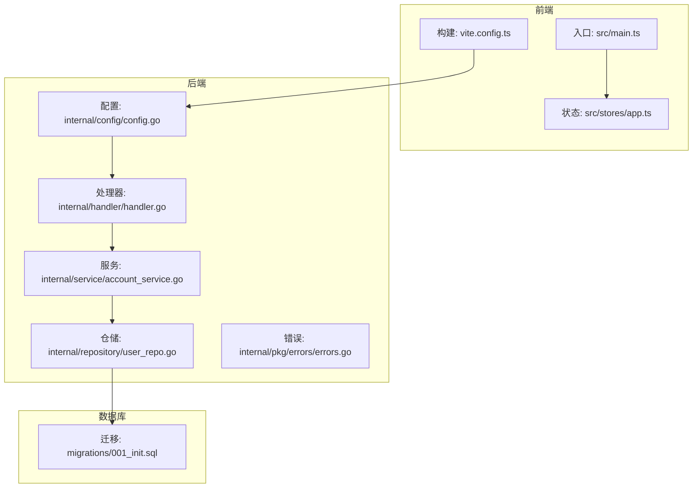
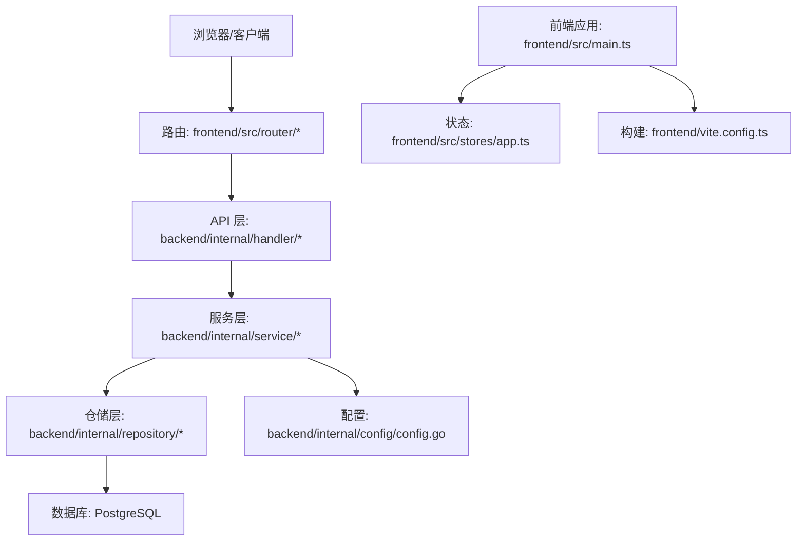
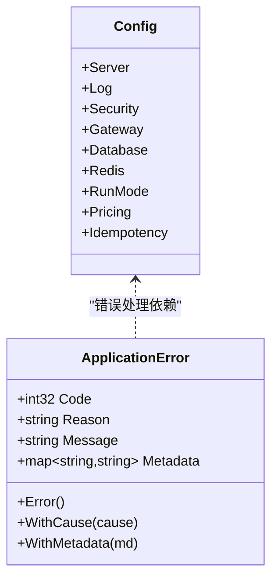
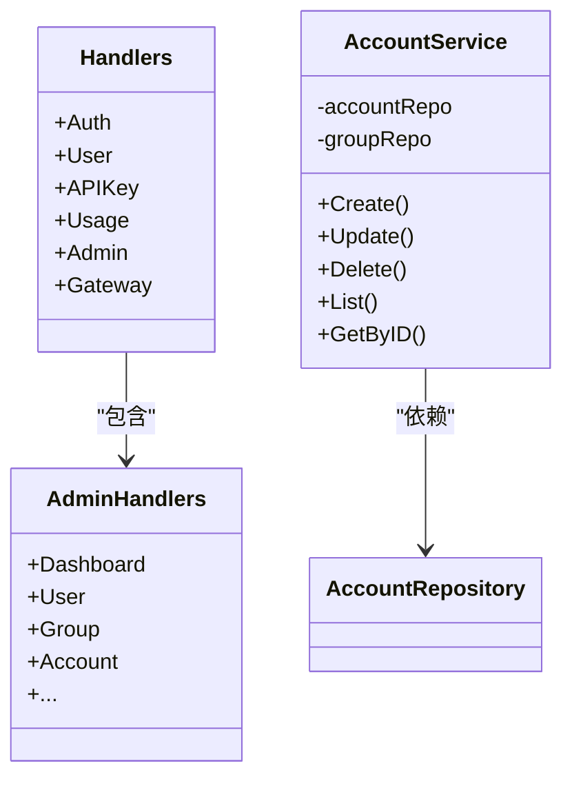
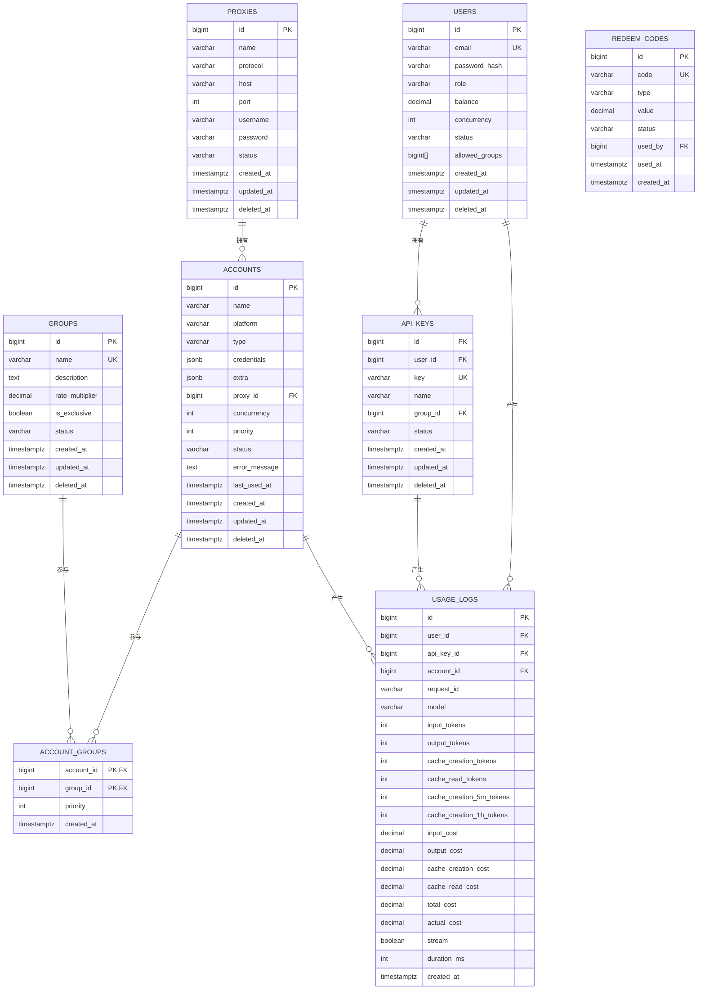
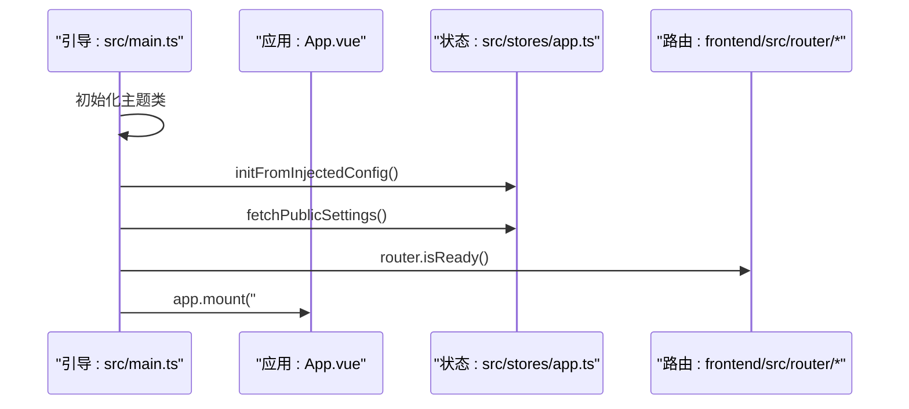
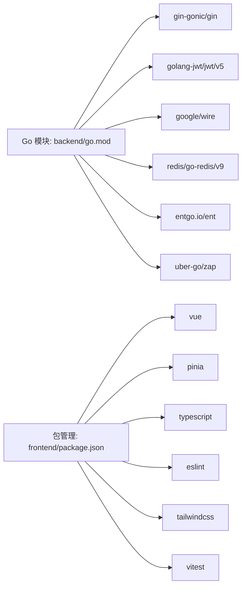

# 代码规范与最佳实践

<cite>
**本文引用的文件**
- [backend/.golangci.yml](file://backend/.golangci.yml)
- [backend/go.mod](file://backend/go.mod)
- [backend/internal/config/config.go](file://backend/internal/config/config.go)
- [backend/internal/handler/handler.go](file://backend/internal/handler/handler.go)
- [backend/internal/service/account_service.go](file://backend/internal/service/account_service.go)
- [backend/internal/pkg/errors/errors.go](file://backend/internal/pkg/errors/errors.go)
- [backend/internal/repository/user_repo.go](file://backend/internal/repository/user_repo.go)
- [backend/migrations/001_init.sql](file://backend/migrations/001_init.sql)
- [frontend/.eslintrc.cjs](file://frontend/.eslintrc.cjs)
- [frontend/tailwind.config.js](file://frontend/tailwind.config.js)
- [frontend/tsconfig.json](file://frontend/tsconfig.json)
- [frontend/package.json](file://frontend/package.json)
- [frontend/vite.config.ts](file://frontend/vite.config.ts)
- [frontend/src/main.ts](file://frontend/src/main.ts)
- [frontend/src/stores/app.ts](file://frontend/src/stores/app.ts)
</cite>

## 目录
1. [简介](#简介)
2. [项目结构](#项目结构)
3. [核心组件](#核心组件)
4. [架构总览](#架构总览)
5. [详细组件分析](#详细组件分析)
6. [依赖分析](#依赖分析)
7. [性能考虑](#性能考虑)
8. [故障排查指南](#故障排查指南)
9. [结论](#结论)
10. [附录](#附录)

## 简介
本文件面向 Sub2API 项目，提供统一的代码规范与最佳实践指南，覆盖后端 Go 语言编码规范、前端 Vue3 开发规范、数据库设计规范、代码审查清单、静态代码分析工具配置以及重构与优化建议。目标是帮助团队建立一致的开发标准，提升代码质量、可维护性与安全性。

## 项目结构
项目采用前后端分离架构：
- 后端：Go 语言，基于 Gin Web 框架、Ent ORM、PostgreSQL 数据库，提供 API 网关与业务服务。
- 前端：Vue3 + TypeScript + Pinia + TailwindCSS，构建管理界面与交互体验。
- 数据库：PostgreSQL，迁移脚本定义核心表结构与索引策略。

图表来源
- [frontend/src/main.ts:1-46](file://frontend/src/main.ts#L1-L46)
- [frontend/src/stores/app.ts:1-464](file://frontend/src/stores/app.ts#L1-L464)
- [frontend/vite.config.ts:1-150](file://frontend/vite.config.ts#L1-L150)
- [backend/internal/config/config.go:1-800](file://backend/internal/config/config.go#L1-L800)
- [backend/internal/handler/handler.go:1-62](file://backend/internal/handler/handler.go#L1-L62)
- [backend/internal/service/account_service.go:1-426](file://backend/internal/service/account_service.go#L1-L426)
- [backend/internal/repository/user_repo.go:1-566](file://backend/internal/repository/user_repo.go#L1-L566)
- [backend/internal/pkg/errors/errors.go:1-159](file://backend/internal/pkg/errors/errors.go#L1-L159)
- [backend/migrations/001_init.sql:1-173](file://backend/migrations/001_init.sql#L1-L173)

章节来源
- [frontend/src/main.ts:1-46](file://frontend/src/main.ts#L1-L46)
- [frontend/vite.config.ts:1-150](file://frontend/vite.config.ts#L1-L150)
- [backend/internal/config/config.go:1-800](file://backend/internal/config/config.go#L1-L800)

## 核心组件
- 后端配置体系：集中式配置结构体与运行模式、安全策略、网关参数、数据库/Redis 连接池等。
- 处理器聚合：统一导出各模块处理器，便于路由注册与依赖注入。
- 服务层契约：定义仓储接口与业务流程，确保领域逻辑清晰、可测试。
- 错误模型：标准化 HTTP 错误响应结构，支持元数据与原因码，便于前端展示与定位。
- 前端状态管理：Pinia Store 封装全局状态、加载指示、通知提示与公共设置缓存。
- 构建与开发：Vite 插件链路、TypeScript 严格模式、ESLint/Tailwind 配置。

章节来源
- [backend/internal/config/config.go:60-91](file://backend/internal/config/config.go#L60-L91)
- [backend/internal/handler/handler.go:37-55](file://backend/internal/handler/handler.go#L37-L55)
- [backend/internal/service/account_service.go:20-77](file://backend/internal/service/account_service.go#L20-L77)
- [backend/internal/pkg/errors/errors.go:15-28](file://backend/internal/pkg/errors/errors.go#L15-L28)
- [frontend/src/stores/app.ts:16-463](file://frontend/src/stores/app.ts#L16-L463)

## 架构总览
后端采用分层架构：配置层 → 处理器层 → 服务层 → 仓储层 → 数据库。前端通过 API 与后端交互，使用 Pinia 管理状态，TailwindCSS 组织样式，Vite 提供开发与构建能力。

图表来源
- [backend/internal/handler/handler.go:1-62](file://backend/internal/handler/handler.go#L1-L62)
- [backend/internal/service/account_service.go:125-141](file://backend/internal/service/account_service.go#L125-L141)
- [backend/internal/repository/user_repo.go:22-33](file://backend/internal/repository/user_repo.go#L22-L33)
- [backend/internal/config/config.go:60-91](file://backend/internal/config/config.go#L60-L91)
- [frontend/src/main.ts:17-46](file://frontend/src/main.ts#L17-L46)
- [frontend/src/stores/app.ts:16-463](file://frontend/src/stores/app.ts#L16-L463)
- [frontend/vite.config.ts:1-150](file://frontend/vite.config.ts#L1-L150)

## 详细组件分析

### 后端：配置与错误模型
- 配置结构：集中定义服务、日志、CORS、安全、网关、数据库、Redis、并发、定价、更新、幂等、OAuth 等配置项，便于统一管理与热更新。
- 错误模型：统一的 Status 结构与 ApplicationError 包装，支持原因码、消息与元数据，便于前端解析与国际化。

图表来源
- [backend/internal/config/config.go:60-91](file://backend/internal/config/config.go#L60-L91)
- [backend/internal/pkg/errors/errors.go:15-28](file://backend/internal/pkg/errors/errors.go#L15-L28)

章节来源
- [backend/internal/config/config.go:60-91](file://backend/internal/config/config.go#L60-L91)
- [backend/internal/pkg/errors/errors.go:15-28](file://backend/internal/pkg/errors/errors.go#L15-L28)

### 后端：处理器与服务层
- 处理器聚合：AdminHandlers 与 Handlers 统一导出，便于路由注册与依赖注入。
- 服务层契约：AccountRepository 接口定义 CRUD 与筛选、分页、状态变更等方法，AccountService 实现业务规则与分组校验。

图表来源
- [backend/internal/handler/handler.go:37-55](file://backend/internal/handler/handler.go#L37-L55)
- [backend/internal/service/account_service.go:125-141](file://backend/internal/service/account_service.go#L125-L141)

章节来源
- [backend/internal/handler/handler.go:37-55](file://backend/internal/handler/handler.go#L37-L55)
- [backend/internal/service/account_service.go:125-141](file://backend/internal/service/account_service.go#L125-L141)

### 后端：仓储层与数据库设计
- 仓储层：userRepository 使用 Ent ORM 与原生 SQL 混合，事务包裹用户与允许分组同步，避免跨层不一致。
- 数据库设计：初始化迁移脚本定义核心表、字段、索引与外键关系，覆盖代理、分组、用户、账号、API 密钥、使用记录等。

图表来源
- [backend/migrations/001_init.sql:4-173](file://backend/migrations/001_init.sql#L4-L173)

章节来源
- [backend/internal/repository/user_repo.go:35-83](file://backend/internal/repository/user_repo.go#L35-L83)
- [backend/migrations/001_init.sql:4-173](file://backend/migrations/001_init.sql#L4-L173)

### 前端：应用引导与状态管理
- 应用引导：在挂载前初始化主题、Pinia、公共设置缓存与国际化，避免页面闪烁。
- 状态管理：App Store 统一管理侧边栏、加载指示、Toast 通知、版本信息与公共设置缓存，并提供 withLoading/withLoadingAndError 等高阶封装。

图表来源
- [frontend/src/main.ts:17-46](file://frontend/src/main.ts#L17-L46)
- [frontend/src/stores/app.ts:397-403](file://frontend/src/stores/app.ts#L397-L403)

章节来源
- [frontend/src/main.ts:17-46](file://frontend/src/main.ts#L17-L46)
- [frontend/src/stores/app.ts:16-463](file://frontend/src/stores/app.ts#L16-L463)

### 前端：构建与开发配置
- Vite 插件：开发模式下启用 TypeScript/Vue 类型检查，生产构建输出至后端静态资源目录，手动分包策略提升缓存命中。
- ESLint/Tailwind/TS：严格类型检查、样式主题与动画变量、字体与暗色模式支持。

章节来源
- [frontend/vite.config.ts:37-149](file://frontend/vite.config.ts#L37-L149)
- [frontend/.eslintrc.cjs:1-37](file://frontend/.eslintrc.cjs#L1-L37)
- [frontend/tailwind.config.js:1-135](file://frontend/tailwind.config.js#L1-L135)
- [frontend/tsconfig.json:1-27](file://frontend/tsconfig.json#L1-L27)

## 依赖分析
- 后端依赖：Go 模块清单定义了 Gin、JWT、Wire、Redis、PostgreSQL、Ent、Zap、Cron、WebSocket、AWS SDK 等关键依赖，版本与间接依赖均明确列出。
- 前端依赖：Vue3、Pinia、Vue Router、Chart.js、Axios、TailwindCSS、TypeScript、ESLint、Vitest 等生态工具链齐全。

图表来源
- [backend/go.mod:1-177](file://backend/go.mod#L1-L177)
- [frontend/package.json:1-67](file://frontend/package.json#L1-L67)

章节来源
- [backend/go.mod:1-177](file://backend/go.mod#L1-L177)
- [frontend/package.json:1-67](file://frontend/package.json#L1-L67)

## 性能考虑
- 后端
  - 连接池与超时：数据库与 Redis 连接池参数可配置，避免资源耗尽与慢查询阻塞。
  - 网关参数：响应头超时、请求体上限、上游连接池隔离策略、并发槽位 TTL、SSE/WS 超时与保活等，平衡吞吐与稳定性。
  - 事务与批量：仓储层使用事务包裹关键写操作，批量创建/去重，降低跨层不一致风险。
- 前端
  - 手动分包：按功能与第三方库拆分 vendor，提升缓存命中与首屏性能。
  - 类型检查：严格 TS 配置减少运行时错误，提高稳定性。

章节来源
- [backend/internal/config/config.go:677-754](file://backend/internal/config/config.go#L677-L754)
- [backend/internal/config/config.go:325-418](file://backend/internal/config/config.go#L325-L418)
- [backend/internal/repository/user_repo.go:42-82](file://backend/internal/repository/user_repo.go#L42-L82)
- [frontend/vite.config.ts:78-127](file://frontend/vite.config.ts#L78-L127)
- [frontend/tsconfig.json:14-22](file://frontend/tsconfig.json#L14-L22)

## 故障排查指南
- 错误模型：统一的 ApplicationError 支持原因码与元数据，便于前端解析与定位问题。
- 日志与采样：日志级别、格式、轮转、采样策略可配置，有助于生产问题追踪。
- 网关超时与回退：上游响应头超时、流式数据间隔超时、会话空闲超时、Failover 策略等，避免长时间阻塞。
- 前端加载与缓存：withLoading/withLoadingAndError 统一封装加载与错误提示；公共设置缓存避免闪烁。

章节来源
- [backend/internal/pkg/errors/errors.go:96-159](file://backend/internal/pkg/errors/errors.go#L96-L159)
- [backend/internal/config/config.go:93-123](file://backend/internal/config/config.go#L93-L123)
- [backend/internal/config/config.go:325-418](file://backend/internal/config/config.go#L325-L418)
- [frontend/src/stores/app.ts:195-225](file://frontend/src/stores/app.ts#L195-L225)

## 结论
本规范文档基于现有代码库提炼出统一的编码与最佳实践，涵盖后端 Go、前端 Vue3、数据库设计、静态分析与审查流程。建议在团队内推广并持续演进，结合实际业务迭代完善。

## 附录

### 后端 Go 编码规范要点
- 命名约定
  - 结构体与常量：采用 PascalCase，如 Config、AccountService。
  - 方法与字段：导出使用 PascalCase，非导出使用 camelCase。
  - 包名：简洁、小写、避免复数，如 errors、repository。
- 函数设计
  - 输入参数与返回值：尽量使用结构体或接口，避免过长参数列表。
  - 错误处理：使用包装错误与错误映射，保持上下文信息。
- 错误处理
  - 使用统一的 ApplicationError，包含 Code、Reason、Message、Metadata。
  - 对外暴露错误时，使用 errors.Is/As 进行匹配。
- 并发编程
  - 使用 context 控制超时与取消。
  - 对共享资源使用互斥锁或并发安全的数据结构。
- 配置管理
  - 所有配置项集中定义，提供默认值与校验。
  - 关键参数（数据库/Redis/网关）可配置化，便于不同环境调整。

章节来源
- [backend/internal/pkg/errors/errors.go:15-28](file://backend/internal/pkg/errors/errors.go#L15-L28)
- [backend/internal/config/config.go:60-91](file://backend/internal/config/config.go#L60-L91)

### 前端 Vue3 开发规范要点
- 组件设计
  - 单文件组件按功能划分目录，遵循语义化命名。
  - 使用 Composition API 与 TypeScript，增强类型安全。
- 状态管理
  - Pinia Store 按模块拆分，Action 封装异步逻辑，提供 withLoading/withLoadingAndError。
  - 公共设置缓存与注入配置，避免页面闪烁。
- TypeScript 使用
  - 严格模式开启，启用 noUnusedLocals/noUnusedParameters/noFallthroughCasesInSwitch。
  - 类型别名与接口清晰表达数据结构。
- 样式组织
  - TailwindCSS 主题变量与暗色模式，统一颜色、阴影、动画与渐变。
- 构建与开发
  - Vite 插件链路：开发模式启用类型检查，生产构建手动分包。
  - ESLint 规则：关闭冗余规则，保留必要的类型检查与格式化。

章节来源
- [frontend/src/stores/app.ts:16-463](file://frontend/src/stores/app.ts#L16-L463)
- [frontend/tailwind.config.js:1-135](file://frontend/tailwind.config.js#L1-L135)
- [frontend/tsconfig.json:14-22](file://frontend/tsconfig.json#L14-L22)
- [frontend/vite.config.ts:37-149](file://frontend/vite.config.ts#L37-L149)
- [frontend/.eslintrc.cjs:21-35](file://frontend/.eslintrc.cjs#L21-L35)

### 数据库设计规范要点
- 表结构设计
  - 主键：统一使用自增序列 bigint。
  - 唯一约束：邮箱、API Key、兑换码等关键字段添加唯一索引。
  - 软删除：deleted_at 字段支持软删除与恢复。
- 字段命名
  - 使用 snake_case，语义清晰，如 created_at、updated_at、input_tokens。
  - JSONB 字段用于灵活扩展，如 credentials、extra。
- 索引策略
  - 常用过滤字段建立索引：status、platform、type、priority、last_used_at 等。
  - 复合索引：usage_logs 基于 user_id+created_at 的复合索引，支持高效分页与统计。
- 数据类型选择
  - 时间戳：TIMESTAMPTZ 统一时区与时区信息。
  - 货币与计费：DECIMAL 保证精度。
  - 数组：allowed_groups 使用数组类型存储关联 ID 列表。
- 外键关系
  - 明确外键约束与 ON DELETE 行为，避免孤儿数据。

章节来源
- [backend/migrations/001_init.sql:4-173](file://backend/migrations/001_init.sql#L4-L173)

### 代码审查检查清单
- 后端
  - 配置项是否合理、是否具备默认值与边界校验。
  - 错误处理是否完整，是否保留上下文信息。
  - 事务使用是否正确，避免跨层不一致。
  - 网关参数是否符合性能与安全要求。
- 前端
  - 组件职责单一，Props/Events 清晰。
  - 状态管理是否按模块拆分，副作用封装良好。
  - 类型定义是否完整，严格模式下无告警。
  - 样式主题是否统一，暗色模式兼容性良好。
- 数据库
  - 索引覆盖常用查询路径，避免全表扫描。
  - 字段类型与约束满足业务需求，历史数据迁移策略明确。
- 通用
  - 单元测试与集成测试覆盖率达标。
  - 文档与注释清晰，变更日志完整。

### 静态代码分析工具配置与使用
- 后端（golangci-lint）
  - 启用 linters：depguard、errcheck、gosec、govet、ineffassign、staticcheck、unused。
  - 配置项：依赖守卫（禁止 service/import repository）、安全规则排除、错误检查忽略模式、静态检查初始词与 HTTP 状态码白名单、未使用字段与参数策略。
  - 格式化：gofmt 与重写规则（any、切片简化）。
- 前端（ESLint/Tailwind/TypeScript）
  - ESLint：继承推荐规则，关闭冗余规则，保留类型检查与变量命名模式。
  - TailwindCSS：主题变量、暗色模式、动画与渐变统一管理。
  - TypeScript：严格模式、未使用变量与参数检查、模块解析策略。

章节来源
- [backend/.golangci.yml:3-140](file://backend/.golangci.yml#L3-L140)
- [frontend/.eslintrc.cjs:16-35](file://frontend/.eslintrc.cjs#L16-L35)
- [frontend/tailwind.config.js:5-135](file://frontend/tailwind.config.js#L5-L135)
- [frontend/tsconfig.json:14-22](file://frontend/tsconfig.json#L14-L22)

### 重构指导与代码优化建议
- 后端
  - 依赖注入：使用 Google Wire 管理依赖图，减少耦合。
  - 仓储抽象：统一接口与错误映射，便于替换实现与测试。
  - 配置中心：将敏感配置放入环境变量或密钥管理，避免硬编码。
- 前端
  - 组件拆分：将复杂页面拆分为可复用子组件，提升可维护性。
  - 状态下沉：将局部状态下沉到子组件，减少全局 Store 的复杂度。
  - 构建优化：持续监控分包体积与缓存命中率，动态调整分包策略。
- 数据库
  - 索引优化：定期分析查询计划，补充缺失索引。
  - 分表分仓：对大表进行分区或分库，降低热点与锁竞争。
  - 迁移脚本：版本化管理，回滚与一致性校验自动化。