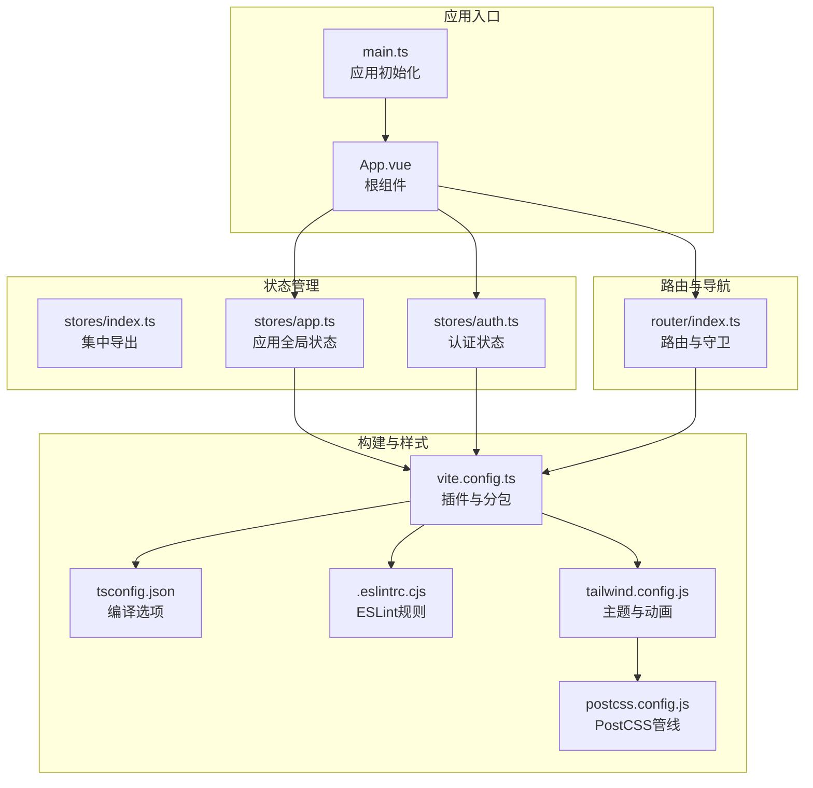
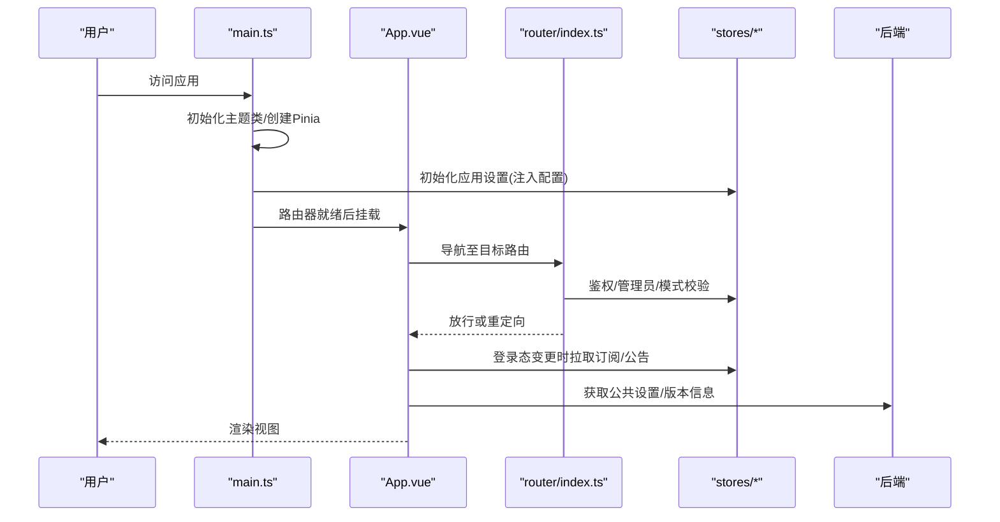
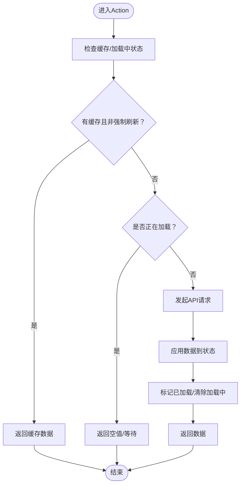
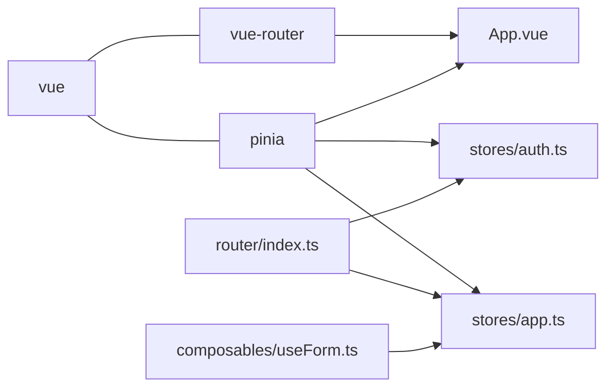

# 前端Vue3开发规范

<cite>
**本文档引用的文件**
- [package.json](file://frontend/package.json)
- [vite.config.ts](file://frontend/vite.config.ts)
- [tsconfig.json](file://frontend/tsconfig.json)
- [.eslintrc.cjs](file://frontend/.eslintrc.cjs)
- [tailwind.config.js](file://frontend/tailwind.config.js)
- [postcss.config.js](file://frontend/postcss.config.js)
- [main.ts](file://frontend/src/main.ts)
- [App.vue](file://frontend/src/App.vue)
- [stores/index.ts](file://frontend/src/stores/index.ts)
- [stores/app.ts](file://frontend/src/stores/app.ts)
- [stores/auth.ts](file://frontend/src/stores/auth.ts)
- [router/index.ts](file://frontend/src/router/index.ts)
- [composables/useForm.ts](file://frontend/src/composables/useForm.ts)
</cite>

## 目录
1. [引言](#引言)
2. [项目结构](#项目结构)
3. [核心组件](#核心组件)
4. [架构总览](#架构总览)
5. [详细组件分析](#详细组件分析)
6. [依赖分析](#依赖分析)
7. [性能考虑](#性能考虑)
8. [故障排查指南](#故障排查指南)
9. [结论](#结论)
10. [附录](#附录)

## 引言
本规范面向Sub2API前端团队，统一Vue3生态下的组件开发、TypeScript使用、状态管理、构建与质量保障、样式组织、测试与性能优化、可访问性等实践。目标是提升代码一致性、可维护性与协作效率。

## 项目结构
前端位于frontend目录，采用Vite+Vue3+TypeScript+Pinia+Vue Router+TailwindCSS技术栈。核心目录与职责如下：
- src/api：后端接口封装
- src/components：可复用UI组件
- src/composables：组合式逻辑（含表单、导航、表格等）
- src/router：路由定义与守卫
- src/stores：Pinia状态管理
- src/views：页面级视图
- src/utils：通用工具
- src/i18n：国际化
- src/styles：全局样式入口
- 构建与质量：vite.config.ts、tsconfig.json、.eslintrc.cjs、tailwind.config.js、postcss.config.js

**图表来源**
- [main.ts:1-46](file://frontend/src/main.ts#L1-L46)
- [App.vue:1-120](file://frontend/src/App.vue#L1-L120)
- [stores/index.ts:1-16](file://frontend/src/stores/index.ts#L1-L16)
- [stores/app.ts:1-464](file://frontend/src/stores/app.ts#L1-L464)
- [stores/auth.ts:1-409](file://frontend/src/stores/auth.ts#L1-L409)
- [router/index.ts:1-746](file://frontend/src/router/index.ts#L1-L746)
- [vite.config.ts:1-150](file://frontend/vite.config.ts#L1-L150)
- [tsconfig.json:1-27](file://frontend/tsconfig.json#L1-L27)
- [.eslintrc.cjs:1-37](file://frontend/.eslintrc.cjs#L1-L37)
- [tailwind.config.js:1-135](file://frontend/tailwind.config.js#L1-L135)
- [postcss.config.js:1-7](file://frontend/postcss.config.js#L1-L7)

**章节来源**
- [main.ts:1-46](file://frontend/src/main.ts#L1-L46)
- [App.vue:1-120](file://frontend/src/App.vue#L1-L120)
- [vite.config.ts:1-150](file://frontend/vite.config.ts#L1-L150)
- [tsconfig.json:1-27](file://frontend/tsconfig.json#L1-L27)
- [.eslintrc.cjs:1-37](file://frontend/.eslintrc.cjs#L1-L37)
- [tailwind.config.js:1-135](file://frontend/tailwind.config.js#L1-L135)
- [postcss.config.js:1-7](file://frontend/postcss.config.js#L1-L7)

## 核心组件
- 应用入口与初始化：在应用启动前完成主题类注入、Pinia安装、从注入配置初始化站点设置、国际化初始化、路由就绪后挂载。
- 根组件：负责动态更新favicon与标题、登录态变更时的订阅与公告数据拉取与轮询、路由变化触发公告刷新、卸载时清理事件监听。
- 路由系统：统一的导航守卫实现鉴权、管理员权限、简易模式限制、后端模式白名单控制、自定义页面标题解析、路由懒加载与错误恢复。
- 状态管理：Pinia Store集中导出；应用全局状态（侧边栏、加载、Toast、公共设置、版本信息）与认证状态（用户、令牌、自动刷新、令牌刷新计划）。
- 组合式逻辑：统一表单提交流程（加载、错误提示、成功提示），减少重复代码。

**章节来源**
- [main.ts:17-46](file://frontend/src/main.ts#L17-L46)
- [App.vue:18-111](file://frontend/src/App.vue#L18-L111)
- [router/index.ts:540-746](file://frontend/src/router/index.ts#L540-L746)
- [stores/index.ts:1-16](file://frontend/src/stores/index.ts#L1-L16)
- [stores/app.ts:16-464](file://frontend/src/stores/app.ts#L16-L464)
- [stores/auth.ts:18-409](file://frontend/src/stores/auth.ts#L18-L409)
- [composables/useForm.ts:15-44](file://frontend/src/composables/useForm.ts#L15-L44)

## 架构总览
前端采用“入口初始化 → 路由守卫 → 视图渲染 → 状态管理”的线性数据流。构建阶段通过Vite插件链路实现类型检查、开发注入、产物分包与代理；样式通过TailwindCSS与PostCSS管线实现主题化与自动化前缀。

**图表来源**
- [main.ts:17-46](file://frontend/src/main.ts#L17-L46)
- [App.vue:45-111](file://frontend/src/App.vue#L45-L111)
- [router/index.ts:570-697](file://frontend/src/router/index.ts#L570-L697)
- [stores/app.ts:320-382](file://frontend/src/stores/app.ts#L320-L382)
- [stores/auth.ts:48-79](file://frontend/src/stores/auth.ts#L48-L79)

## 详细组件分析

### 组件命名约定与Props设计
- 命名
  - 组件文件名使用帕斯卡命名法（如 AccountUsageCell.vue），便于在模板中直接引用且符合IDE识别习惯。
  - 组件内部导出名称与文件名一致，保持直观。
- Props设计
  - 明确必填与可选属性，优先使用只读或受控方式传递数据。
  - 对复杂对象使用类型约束，避免any；对可选字段提供默认值或显式校验。
  - 事件回调以onXxx命名，参数语义清晰，必要时提供简短注释说明用途。
- 事件处理
  - 通过emit声明明确的事件名与负载类型，避免字符串硬编码。
  - 在组合式函数中封装事件处理逻辑，提高复用性与可测性。
- 生命周期管理
  - 在onMounted/onBeforeUnmount中注册/注销副作用（如事件监听、定时器、轮询）。
  - 对于需要在路由切换时清理的资源，确保在beforeUnmount中释放。

**章节来源**
- [App.vue:45-92](file://frontend/src/App.vue#L45-L92)

### TypeScript使用规范
- 编译选项
  - 目标与模块：ES2020 + ESNext模块解析，支持bundler解析与TS扩展名。
  - 严格模式：启用严格检查、未使用局部变量与参数、switch穷举检查。
  - 路径映射：@/*指向src，简化导入路径。
- 类型定义
  - 接口与类型别名：统一在types目录下集中管理，避免重复定义。
  - 泛型使用：对可复用逻辑（如API响应、分页、过滤）使用泛型约束，提升类型安全。
- 模块导入导出
  - 优先使用具名导出，避免默认导出造成Tree-shaking困难。
  - 对第三方库按需引入，减少打包体积。

**章节来源**
- [tsconfig.json:2-26](file://frontend/tsconfig.json#L2-L26)

### 状态管理规范（Pinia）
- Store设计原则
  - 使用defineStore定义，将状态、计算属性与动作集中管理，返回API供组件直接使用。
  - 将副作用（网络请求、本地存储、定时器）收敛到动作内，保持store纯函数特性。
  - 对外暴露只读computed（如isAdmin）与只读ref（runMode），防止外部直接修改。
- 数据流管理
  - 应用全局状态：公共设置缓存、站点信息、加载计数、Toast队列、版本信息。
  - 认证状态：用户信息、访问令牌、刷新令牌、过期时间戳、自动刷新与主动刷新计划。
  - 通过withLoading/withLoadingAndError统一处理异步操作的加载与错误提示。
- 缓存与去重
  - 对重复请求进行loading状态与缓存判断，避免并发重复请求。
  - 注入配置（window.__APP_CONFIG__）在开发阶段消除首屏闪烁，生产环境通过API获取。

**图表来源**
- [stores/app.ts:244-278](file://frontend/src/stores/app.ts#L244-L278)
- [stores/app.ts:320-382](file://frontend/src/stores/app.ts#L320-L382)
- [stores/auth.ts:148-166](file://frontend/src/stores/auth.ts#L148-L166)

**章节来源**
- [stores/index.ts:1-16](file://frontend/src/stores/index.ts#L1-L16)
- [stores/app.ts:16-464](file://frontend/src/stores/app.ts#L16-L464)
- [stores/auth.ts:18-409](file://frontend/src/stores/auth.ts#L18-L409)

### Vite构建配置与ESLint规则
- 构建配置
  - 插件：Vue插件、开发时类型检查、运行时注入公开配置脚本。
  - 别名：@指向src，vue-i18n使用运行时版本以满足CSP。
  - define：开启JIT编译以避免unsafe-eval。
  - 分包策略：手动分包vendor-vue、vendor-ui、vendor-chart、vendor-i18n与其他小库；特定功能模块独立分包。
  - 服务器：代理/api、/v1、/setup到后端地址，支持自定义开发端口与后端目标。
- ESLint规则
  - 解析器：vue-eslint-parser + @typescript-eslint/parser。
  - 规则：推荐规则基础上放宽部分规则（如多词组件名关闭、忽略未使用变量下划线前缀等），保留严格类型检查。
- 类型检查
  - 开发命令集成类型检查，保证构建前无类型错误。

**章节来源**
- [vite.config.ts:10-35](file://frontend/vite.config.ts#L10-L35)
- [vite.config.ts:37-149](file://frontend/vite.config.ts#L37-L149)
- [.eslintrc.cjs:1-37](file://frontend/.eslintrc.cjs#L1-L37)
- [package.json:13-23](file://frontend/package.json#L13-L23)

### 样式组织规范（TailwindCSS）
- 主题与配色
  - 定义primary（青色系）、accent（深蓝灰）、dark（深色模式）三套颜色，支持50-950层级。
- 字体与背景
  - sans与mono字体族，渐变背景与网格背景图谱。
- 动画与阴影
  - 提供淡入、滑入、脉冲、闪光等动画，以及卡片阴影与玻璃拟态阴影。
- 深色模式
  - 通过class模式启用，全局生效。
- PostCSS管线
  - TailwindCSS + Autoprefixer，自动添加厂商前缀。

**章节来源**
- [tailwind.config.js:1-135](file://frontend/tailwind.config.js#L1-L135)
- [postcss.config.js:1-7](file://frontend/postcss.config.js#L1-L7)

### 组件测试规范
- 单元测试
  - 使用Vitest与@vue/test-utils，针对组合式逻辑（如useForm）与纯函数进行测试。
  - 测试用例覆盖正常流程、异常分支与边界条件。
- 集成测试
  - 路由守卫与状态变更场景，模拟鉴权状态、管理员权限、简易模式与后端模式。
- 覆盖率
  - 通过覆盖率配置确保关键逻辑具备测试覆盖。

**章节来源**
- [package.json:20-22](file://frontend/package.json#L20-L22)

### 可访问性要求
- 文档标题与图标
  - 根据站点设置动态更新document.title与favicon，确保屏幕阅读器与收藏夹可用。
- 键盘导航
  - 确保所有交互元素可通过Tab键聚焦，提供可见焦点指示。
- 语义化标签
  - 使用语义化HTML与aria-label补充说明，避免仅靠视觉传达信息。
- 对比度与字体
  - 使用Tailwind提供的对比度与字体族，保证低视力用户的可读性。

**章节来源**
- [App.vue:18-43](file://frontend/src/App.vue#L18-L43)

## 依赖分析
- 外部依赖
  - Vue3、Vue Router、Pinia、VueUse、Chart.js、axios、vue-i18n等。
- 内部耦合
  - 路由依赖认证与应用设置store；根组件依赖多个store与API；组合式逻辑依赖应用store。
- 分包策略
  - 第三方库按功能拆分vendor块，避免循环依赖与重复打包。

**图表来源**
- [router/index.ts:12-18](file://frontend/src/router/index.ts#L12-L18)
- [App.vue:8-16](file://frontend/src/App.vue#L8-L16)
- [stores/auth.ts:6-9](file://frontend/src/stores/auth.ts#L6-L9)
- [stores/app.ts:6-14](file://frontend/src/stores/app.ts#L6-L14)
- [composables/useForm.ts:2](file://frontend/src/composables/useForm.ts#L2)

**章节来源**
- [package.json:24-65](file://frontend/package.json#L24-L65)
- [vite.config.ts:78-126](file://frontend/vite.config.ts#L78-L126)

## 性能考虑
- 代码分割与懒加载
  - 路由级懒加载与手动分包，减少首屏体积。
- 资源预取
  - 空闲时预取后续路由资源，缩短二次跳转延迟。
- 状态缓存与去重
  - Store层缓存与防抖，避免重复请求。
- 构建优化
  - 生产构建开启Tree-shaking与最小化，分包策略降低缓存失效范围。
- 图表与虚拟列表
  - 大列表使用虚拟滚动，图表按需引入，避免全量引入。

**章节来源**
- [router/index.ts:706-712](file://frontend/src/router/index.ts#L706-L712)
- [vite.config.ts:78-126](file://frontend/vite.config.ts#L78-L126)
- [stores/app.ts:244-278](file://frontend/src/stores/app.ts#L244-L278)

## 故障排查指南
- 路由懒加载失败
  - 当出现动态导入失败时，路由守卫会尝试刷新页面以获取最新版本；若持续失败，提示清理浏览器缓存。
- 开发注入配置失败
  - 开发环境下注入失败会回退到API调用；检查后端/settings/public接口可用性与跨域配置。
- 令牌刷新与过期
  - 若刷新失败或401，自动清理认证状态；确认刷新令牌与过期时间戳正确写入localStorage。
- ESLint与类型检查
  - 使用lint与typecheck脚本定位问题；遵循规则集中的宽松项与严格项平衡。

**章节来源**
- [router/index.ts:718-743](file://frontend/src/router/index.ts#L718-L743)
- [vite.config.ts:10-35](file://frontend/vite.config.ts#L10-L35)
- [stores/auth.ts:148-166](file://frontend/src/stores/auth.ts#L148-L166)
- [.eslintrc.cjs:21-35](file://frontend/.eslintrc.cjs#L21-L35)

## 结论
本规范以Pinia为核心，结合Vue3 Composition API与TypeScript，配合Vite与TailwindCSS，形成一套可扩展、可维护、可测试的前端开发体系。建议团队在日常开发中严格遵循命名、Props、事件、生命周期、状态管理、构建与样式等规范，持续优化性能与可访问性，确保高质量交付。

## 附录
- 规范模板与示例
  - 组件模板：文件名采用帕斯卡命名，使用<script setup>与TypeScript，明确props与emits，封装事件与副作用。
  - Store模板：使用defineStore，集中管理状态、计算属性与动作，提供withLoading/withLoadingAndError等高阶能力。
  - 路由模板：统一meta字段（requiresAuth、requiresAdmin、title、titleKey），在beforeEach中实现鉴权与标题解析。
  - 表单模板：使用useForm统一封装提交流程，自动处理加载、错误提示与成功提示。
  - 样式模板：优先使用TailwindCSS原子类，必要时在tailwind.config.js中扩展主题与动画。

**章节来源**
- [App.vue:18-111](file://frontend/src/App.vue#L18-L111)
- [stores/app.ts:16-464](file://frontend/src/stores/app.ts#L16-L464)
- [stores/auth.ts:18-409](file://frontend/src/stores/auth.ts#L18-L409)
- [router/index.ts:570-697](file://frontend/src/router/index.ts#L570-L697)
- [composables/useForm.ts:15-44](file://frontend/src/composables/useForm.ts#L15-L44)
- [tailwind.config.js:1-135](file://frontend/tailwind.config.js#L1-L135)