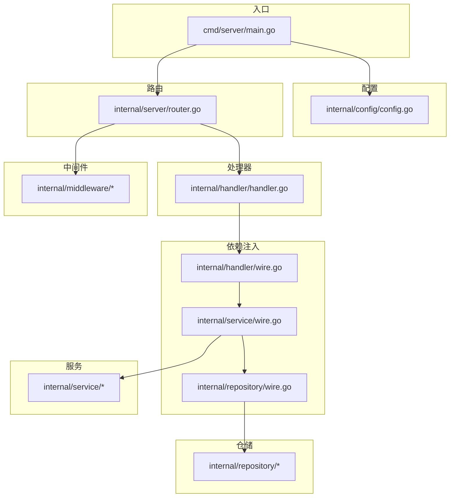
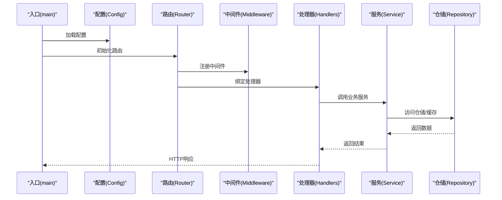
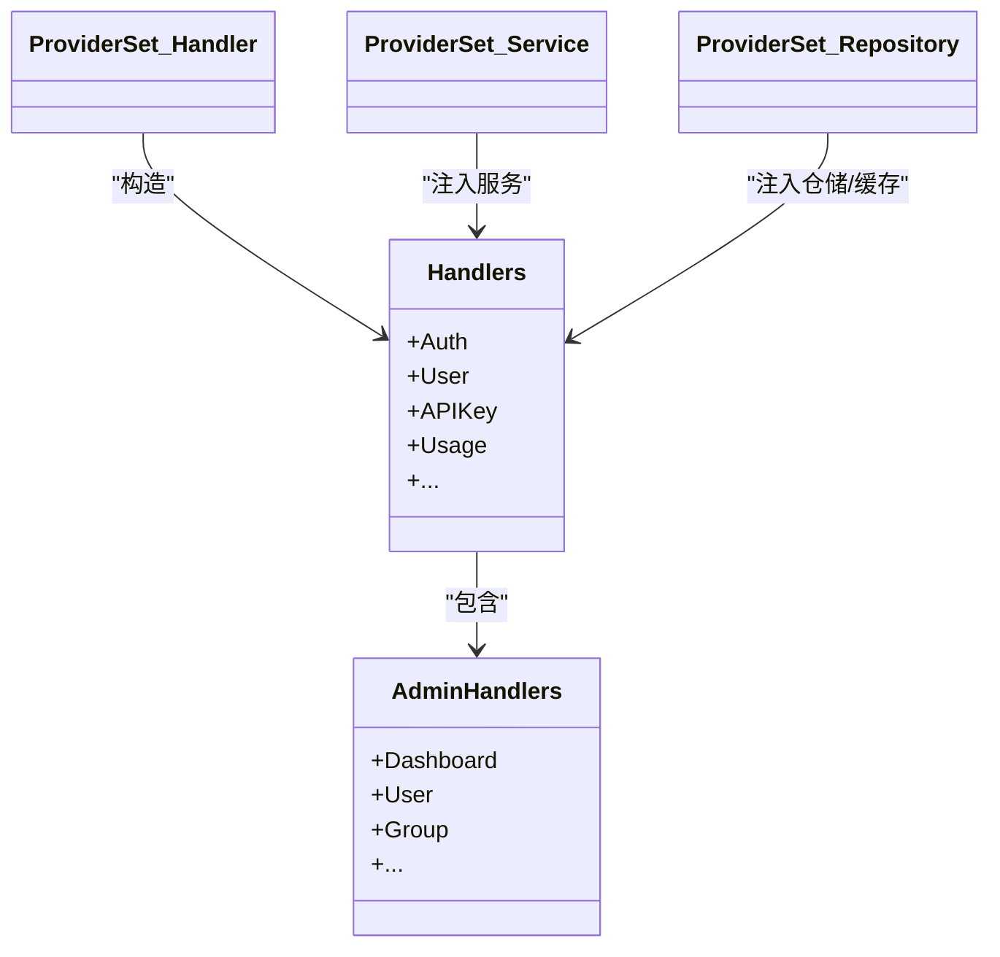
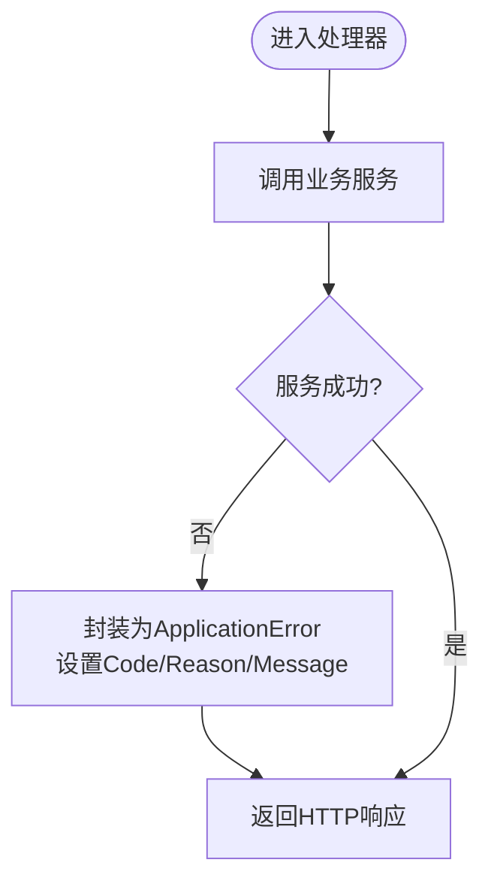
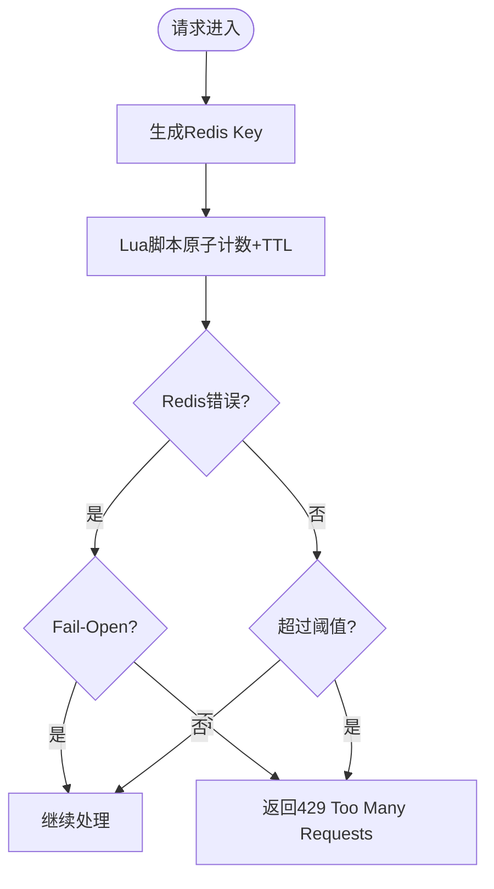
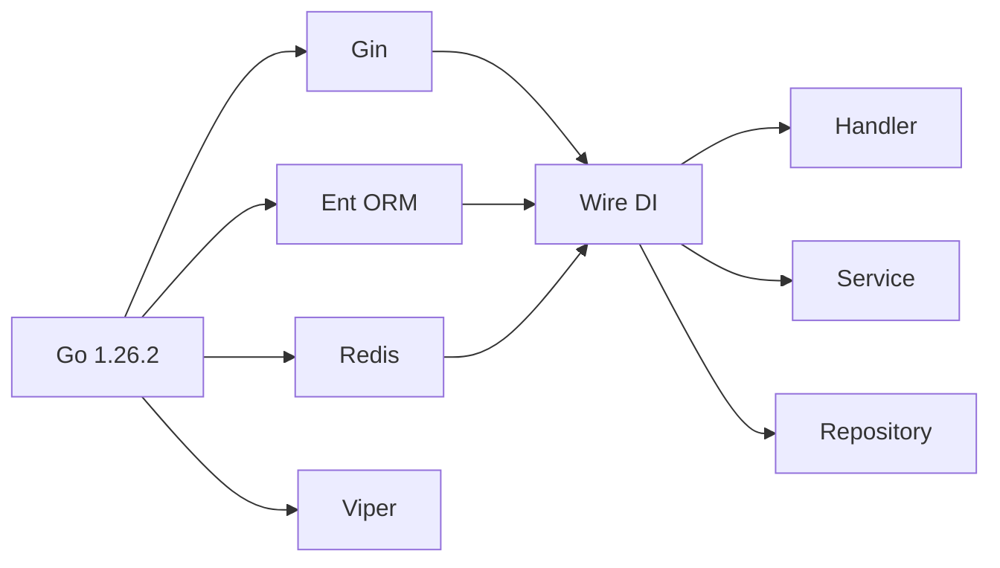

# 后端Go语言规范

<cite>
**本文引用的文件**
- [backend/.golangci.yml](file://backend/.golangci.yml)
- [backend/go.mod](file://backend/go.mod)
- [backend/cmd/server/main.go](file://backend/cmd/server/main.go)
- [backend/internal/config/config.go](file://backend/internal/config/config.go)
- [backend/internal/handler/wire.go](file://backend/internal/handler/wire.go)
- [backend/internal/repository/wire.go](file://backend/internal/repository/wire.go)
- [backend/internal/service/wire.go](file://backend/internal/service/wire.go)
- [backend/internal/handler/handler.go](file://backend/internal/handler/handler.go)
- [backend/internal/pkg/errors/errors.go](file://backend/internal/pkg/errors/errors.go)
- [backend/internal/middleware/rate_limiter.go](file://backend/internal/middleware/rate_limiter.go)
- [backend/internal/server/router.go](file://backend/internal/server/router.go)
</cite>

## 目录
1. [引言](#引言)
2. [项目结构](#项目结构)
3. [核心组件](#核心组件)
4. [架构总览](#架构总览)
5. [详细组件分析](#详细组件分析)
6. [依赖分析](#依赖分析)
7. [性能考虑](#性能考虑)
8. [故障排查指南](#故障排查指南)
9. [结论](#结论)
10. [附录](#附录)

## 引言
本规范面向Sub2API后端Go语言开发，基于仓库现有实现总结形成。内容涵盖包命名约定、文件组织结构、函数设计原则、错误处理模式、并发编程最佳实践、golangci-lint配置与使用、依赖注入模式、接口设计原则、测试编写规范、性能优化与内存管理、并发安全考虑，并提供具体示例与反例路径指引，帮助团队统一风格、提升质量与可维护性。

## 项目结构
后端采用清晰的分层与职责划分：
- cmd：应用入口与构建集成
  - server：主服务入口，负责初始化、配置加载、服务启动与优雅退出
  - jwtgen：工具命令
- internal：内部业务域与基础设施
  - config：配置模型与加载
  - handler：HTTP处理器与Wire注入集合
  - repository：仓储与缓存实现、数据库与Redis客户端提供
  - service：业务服务、定时任务与后台服务
  - middleware：HTTP中间件
  - server：路由注册与中间件装配
  - pkg：通用工具包（errors、logger、httpclient等）
  - integration：端到端测试
  - testutil：测试辅助
  - util：通用工具（当前未发现util.go）
  - web：嵌入前端与静态资源
- ent：ORM与迁移
- migrations：数据库迁移脚本
- resources：模型定价资源
- 根目录：构建与CI配置（go.mod、.golangci.yml、Makefile、Dockerfile等）

**图表来源**
- [backend/cmd/server/main.go:1-182](file://backend/cmd/server/main.go#L1-L182)
- [backend/internal/config/config.go:1-2262](file://backend/internal/config/config.go#L1-L2262)
- [backend/internal/handler/wire.go:1-183](file://backend/internal/handler/wire.go#L1-L183)
- [backend/internal/repository/wire.go:1-181](file://backend/internal/repository/wire.go#L1-L181)
- [backend/internal/service/wire.go:1-500](file://backend/internal/service/wire.go#L1-L500)
- [backend/internal/handler/handler.go:1-62](file://backend/internal/handler/handler.go#L1-L62)
- [backend/internal/server/router.go:1-122](file://backend/internal/server/router.go#L1-L122)

**章节来源**
- [backend/cmd/server/main.go:1-182](file://backend/cmd/server/main.go#L1-L182)
- [backend/internal/server/router.go:1-122](file://backend/internal/server/router.go#L1-L122)

## 核心组件
- 配置体系：集中定义配置结构体与默认值，支持运行模式、CORS、安全策略、网关参数、并发与用量记录等关键配置项。
- 依赖注入：通过Google Wire在handler、service、repository层建立清晰的Provider集，确保依赖关系明确、可替换、可测试。
- 错误模型：统一的ApplicationError结构，便于HTTP响应控制与错误链传递。
- 中间件：CORS、安全头、限流等中间件，支持Redis故障降级策略。
- 路由与处理器：按模块注册路由，分离通用、认证、用户、网关、支付等模块。

**章节来源**
- [backend/internal/config/config.go:1-2262](file://backend/internal/config/config.go#L1-L2262)
- [backend/internal/handler/wire.go:1-183](file://backend/internal/handler/wire.go#L1-L183)
- [backend/internal/repository/wire.go:1-181](file://backend/internal/repository/wire.go#L1-L181)
- [backend/internal/service/wire.go:1-500](file://backend/internal/service/wire.go#L1-L500)
- [backend/internal/pkg/errors/errors.go:1-159](file://backend/internal/pkg/errors/errors.go#L1-L159)
- [backend/internal/middleware/rate_limiter.go:1-162](file://backend/internal/middleware/rate_limiter.go#L1-L162)
- [backend/internal/server/router.go:1-122](file://backend/internal/server/router.go#L1-L122)

## 架构总览
整体采用“入口—配置—注入—处理器—服务—仓储—存储”的分层架构，结合中间件与路由实现请求生命周期管理。

**图表来源**
- [backend/cmd/server/main.go:134-181](file://backend/cmd/server/main.go#L134-L181)
- [backend/internal/server/router.go:22-92](file://backend/internal/server/router.go#L22-L92)
- [backend/internal/handler/handler.go:37-55](file://backend/internal/handler/handler.go#L37-L55)
- [backend/internal/service/wire.go:407-499](file://backend/internal/service/wire.go#L407-L499)
- [backend/internal/repository/wire.go:50-130](file://backend/internal/repository/wire.go#L50-L130)

## 详细组件分析

### 依赖注入与Provider集
- handler层：提供AdminHandlers与Handlers聚合，绑定各子处理器构造器。
- repository层：提供Ent客户端、SQL DB、Redis客户端、各类缓存与外部HTTP客户端。
- service层：提供核心业务服务、定时任务与后台服务，含令牌刷新、仪表盘聚合、用量清理、并发控制、用户消息队列等。

**图表来源**
- [backend/internal/handler/handler.go:37-55](file://backend/internal/handler/handler.go#L37-L55)
- [backend/internal/handler/wire.go:91-130](file://backend/internal/handler/wire.go#L91-L130)
- [backend/internal/service/wire.go:407-499](file://backend/internal/service/wire.go#L407-L499)
- [backend/internal/repository/wire.go:50-130](file://backend/internal/repository/wire.go#L50-L130)

**章节来源**
- [backend/internal/handler/wire.go:1-183](file://backend/internal/handler/wire.go#L1-L183)
- [backend/internal/repository/wire.go:1-181](file://backend/internal/repository/wire.go#L1-L181)
- [backend/internal/service/wire.go:1-500](file://backend/internal/service/wire.go#L1-L500)

### 错误处理模式
- 统一错误类型：ApplicationError，包含HTTP状态码、原因、消息与元数据，支持链式unwrap与Clone。
- 错误转换：FromError支持从任意error转为ApplicationError，未知错误回退为内部错误。
- 使用建议：对外返回时使用Code/Reason/Message提取信息；内部传播使用WithCause附加原因；避免忽略错误。

**图表来源**
- [backend/internal/pkg/errors/errors.go:22-159](file://backend/internal/pkg/errors/errors.go#L22-L159)

**章节来源**
- [backend/internal/pkg/errors/errors.go:1-159](file://backend/internal/pkg/errors/errors.go#L1-L159)

### 并发与限流中间件
- 限流策略：基于Redis的Lua原子计数与TTL修复；支持Fail-Close/Fail-Open两种故障模式。
- 中间件设计：按IP维度生成键，窗口内计数超过阈值即拒绝；Redis异常时按配置决定是否放行。
- 使用建议：对全局或敏感接口启用；结合业务特性调整窗口与配额；关注Redis可用性与网络抖动。

**图表来源**
- [backend/internal/middleware/rate_limiter.go:28-137](file://backend/internal/middleware/rate_limiter.go#L28-L137)

**章节来源**
- [backend/internal/middleware/rate_limiter.go:1-162](file://backend/internal/middleware/rate_limiter.go#L1-L162)

### 路由与中间件装配
- 中间件顺序：日志、CORS、安全头（含动态frame-src）、嵌入前端（可选）。
- 路由分组：/api/v1按模块注册，支持公共路由、认证、用户、管理员、网关、支付等。
- 动态CSP：从设置服务获取frame-src来源，定期刷新缓存，避免频繁读取数据库。

**章节来源**
- [backend/internal/server/router.go:22-122](file://backend/internal/server/router.go#L22-L122)

### 配置模型与加载
- 配置结构：Server、Log、CORS、Security、Billing、Turnstile、Database、Redis、Ops、JWT、Totp、OAuth、Default、RateLimit、Pricing、Gateway、缓存与清理、并发、TokenRefresh、RunMode、Timezone、Gemini、Update、Idempotency等。
- 加载流程：入口加载配置，初始化日志与运行模式提示；网关与并发相关配置影响上游连接池、会话与队列行为。

**章节来源**
- [backend/internal/config/config.go:60-91](file://backend/internal/config/config.go#L60-L91)
- [backend/cmd/server/main.go:134-155](file://backend/cmd/server/main.go#L134-L155)

## 依赖分析
- 语言与框架：Go 1.26.2，Gin Web框架，Ent ORM，Redis，Viper配置。
- 依赖注入：Google Wire，按层提供Provider集，避免循环依赖。
- 静态检查：golangci-lint启用errcheck、govet、ineffassign、staticcheck、unused、gosec、depguard等，强调“service不得导入repository”等约束。

**图表来源**
- [backend/go.mod:1-45](file://backend/go.mod#L1-L45)
- [backend/.golangci.yml:3-13](file://backend/.golangci.yml#L3-L13)

**章节来源**
- [backend/go.mod:1-177](file://backend/go.mod#L1-L177)
- [backend/.golangci.yml:1-140](file://backend/.golangci.yml#L1-L140)

## 性能考虑
- 连接池与超时：数据库与Redis连接池参数可配置，避免资源泄露与慢连接阻塞。
- 网关参数：上游连接池隔离策略、最大并发、空闲超时、每主机连接上限等，影响复用率与资源消耗。
- 并发控制：并发槽位TTL、会话空闲超时、用户消息队列模式（串行/节流）与清理worker。
- 使用量记录：异步队列容量、工作线程数、溢出策略（丢弃/采样/同步回写）、自动扩缩容。
- 限流降级：Redis故障时的Fail-Open/Fail-Close策略，避免雪崩。
- 日志与采样：日志轮转、采样与Caller输出，平衡可观测性与性能。

**章节来源**
- [backend/internal/config/config.go:677-754](file://backend/internal/config/config.go#L677-L754)
- [backend/internal/config/config.go:325-418](file://backend/internal/config/config.go#L325-L418)
- [backend/internal/config/config.go:420-460](file://backend/internal/config/config.go#L420-L460)
- [backend/internal/config/config.go:557-588](file://backend/internal/config/config.go#L557-L588)
- [backend/internal/middleware/rate_limiter.go:15-26](file://backend/internal/middleware/rate_limiter.go#L15-L26)

## 故障排查指南
- 配置问题：确认配置项是否正确加载与默认值是否合理；关注运行模式（standard/simple）差异。
- 依赖注入：检查Provider集是否完整，wire_gen是否生成；避免service直接导入repository。
- Redis限流：若出现大量429或异常，检查Redis可用性与Lua脚本执行；评估Fail-Open/Fail-Close策略。
- 网关超时与连接：根据上游响应头超时、最大请求体、连接池参数调整；关注隔离策略与空闲回收。
- 日志定位：开启必要级别与Caller输出，结合采样配置；注意日志轮转避免磁盘压力。

**章节来源**
- [backend/internal/config/config.go:17-27](file://backend/internal/config/config.go#L17-L27)
- [backend/internal/handler/wire.go:17-31](file://backend/internal/handler/wire.go#L17-L31)
- [backend/internal/middleware/rate_limiter.go:100-108](file://backend/internal/middleware/rate_limiter.go#L100-L108)

## 结论
本规范基于仓库现有实现提炼，强调“配置驱动、依赖注入、统一错误、中间件治理、性能参数化与静态检查”。建议在后续迭代中持续完善测试覆盖率、文档与示例，确保规范落地与演进。

## 附录

### 代码组织结构规范（internal/cmd/pkg等）
- internal：内部实现，禁止被外部包直接导入
  - config：配置模型与默认值
  - handler：HTTP处理器与Wire注入
  - repository：仓储、缓存、外部HTTP客户端提供
  - service：业务服务、定时任务与后台服务
  - middleware：HTTP中间件
  - server：路由注册与中间件装配
  - pkg：通用工具包（errors、logger、httpclient等）
  - integration：端到端测试
  - testutil：测试辅助
  - util：通用工具（当前未发现util.go）
  - web：嵌入前端与静态资源
- cmd：应用入口与工具命令
- ent与migrations：ORM与数据库迁移
- 资源与根目录：构建与CI配置

**章节来源**
- [backend/cmd/server/main.go:1-182](file://backend/cmd/server/main.go#L1-L182)
- [backend/internal/server/router.go:1-122](file://backend/internal/server/router.go#L1-L122)

### 包命名约定与文件组织
- 包名：小写、简洁、语义明确；避免复数与缩写
- 文件：按职责拆分，单文件职责单一；测试文件以*_test.go结尾
- 导出：仅导出必要的类型与方法；避免在internal中导出过多公共符号

### 函数设计原则
- 单一职责：每个函数聚焦一个明确目标
- 输入输出：明确参数与返回值；错误必须被处理或返回
- 可测试：通过依赖注入与接口抽象，便于单元测试
- 文档：导出函数提供注释，说明用途、参数与副作用

### 错误处理最佳实践
- 明确错误类型：使用ApplicationError承载HTTP语义
- 附带上下文：WithCause附加底层原因；WithMetadata携带诊断信息
- 传播与转换：FromError统一转换；避免忽略错误
- 外部错误：对外仅暴露Reason/Message，内部保留细节

**章节来源**
- [backend/internal/pkg/errors/errors.go:22-159](file://backend/internal/pkg/errors/errors.go#L22-L159)

### 并发编程最佳实践
- 原子与互斥：使用原子变量与互斥锁保护共享状态
- 超时与取消：使用context.WithTimeout/Cancel控制生命周期
- 并发安全：避免竞态条件；对共享资源加锁或使用并发安全容器
- 清理与回收：定期清理孤儿锁、过期槽位与空闲连接

**章节来源**
- [backend/internal/middleware/rate_limiter.go:124-130](file://backend/internal/middleware/rate_limiter.go#L124-L130)
- [backend/internal/config/config.go:420-460](file://backend/internal/config/config.go#L420-L460)

### 依赖注入模式与接口设计
- Provider集：按层提供构造器，避免硬编码依赖
- 接口绑定：wire.Bind将具体实现绑定到接口，便于替换与测试
- 依赖方向：handler → service → repository；service不应导入repository

**章节来源**
- [backend/internal/handler/wire.go:132-183](file://backend/internal/handler/wire.go#L132-L183)
- [backend/internal/service/wire.go:407-499](file://backend/internal/service/wire.go#L407-L499)
- [backend/internal/repository/wire.go:50-130](file://backend/internal/repository/wire.go#L50-L130)
- [backend/.golangci.yml:17-31](file://backend/.golangci.yml#L17-L31)

### 测试编写规范
- 单元测试：针对函数与方法，使用Mock与Stub替换外部依赖
- 集成测试：使用Testcontainers或内存数据库/Redis进行端到端验证
- 基准测试：对热点路径进行Benchmark，关注内存分配与CPU占用
- 示例测试：提供最小可运行示例，便于快速验证

（本节为通用指导，不直接分析具体文件）

### golangci-lint配置与使用
- 启用规则：errcheck、govet、ineffassign、staticcheck、unused、gosec、depguard
- depguard约束：service与handler禁止直接导入repository与gorm/redis
- gosec排除：按需排除特定规则，聚焦高风险问题
- staticcheck：白名单与HTTP状态码白名单，避免过度严格
- unused：开启字段写入使用检测与生成代码使用

**章节来源**
- [backend/.golangci.yml:3-140](file://backend/.golangci.yml#L3-L140)

### 性能优化与内存管理
- 连接池参数：根据负载调优MaxOpenConns/MaxIdleConns/ConnMaxLifetime
- Redis：合理TTL与键空间设计；Lua脚本原子化减少往返
- 日志：采样与轮转；避免高频字符串拼接
- GC友好：减少临时对象与逃逸分配；避免大对象频繁分配

（本节为通用指导，不直接分析具体文件）

### 并发安全考虑
- 中间件：限流脚本原子化；Redis键命名唯一化
- 服务层：并发槽位清理worker；用户消息队列清理worker
- 路由层：动态CSP来源缓存，避免并发读写冲突

**章节来源**
- [backend/internal/middleware/rate_limiter.go:28-59](file://backend/internal/middleware/rate_limiter.go#L28-L59)
- [backend/internal/config/config.go:420-460](file://backend/internal/config/config.go#L420-L460)
- [backend/internal/server/router.go:43-53](file://backend/internal/server/router.go#L43-L53)