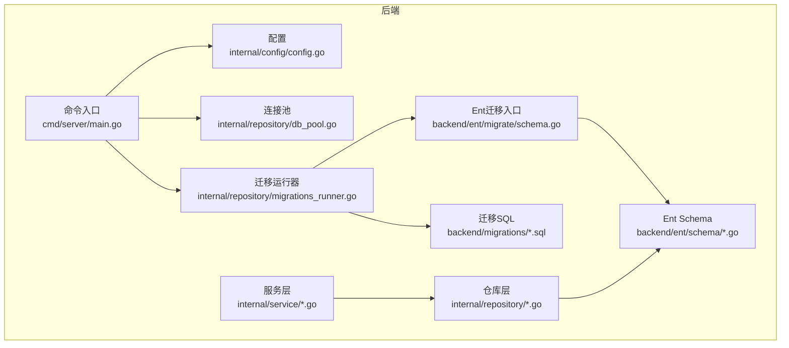
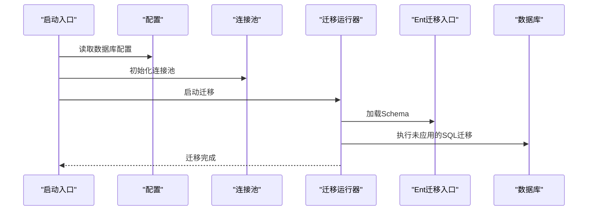
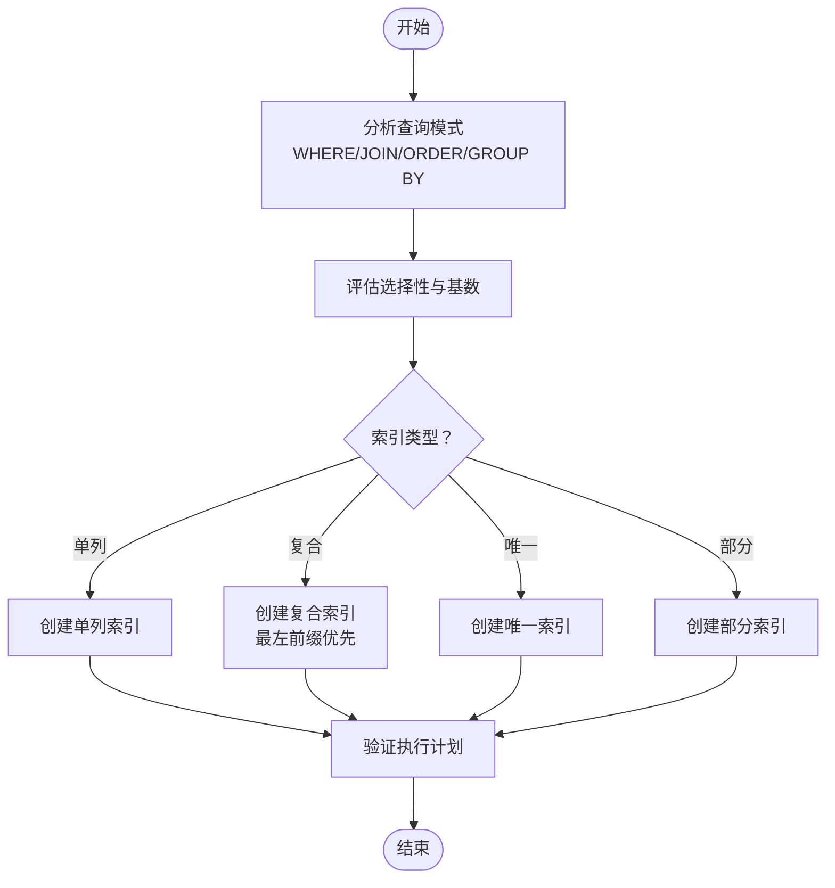
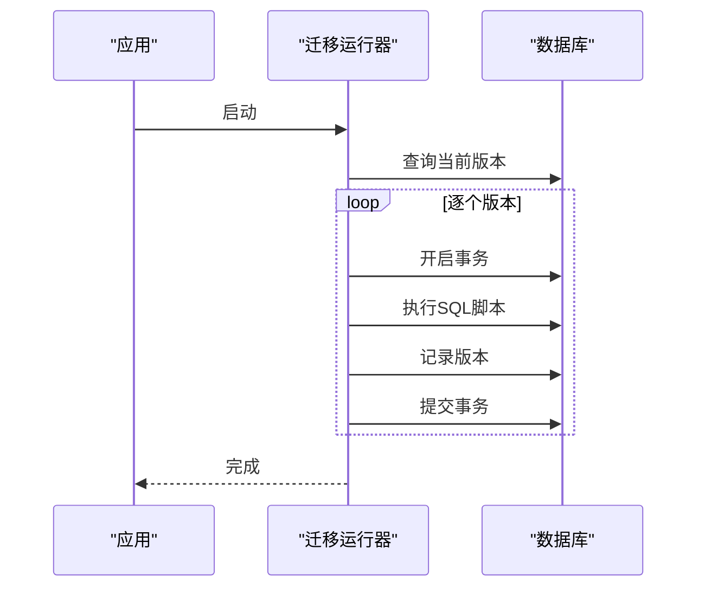
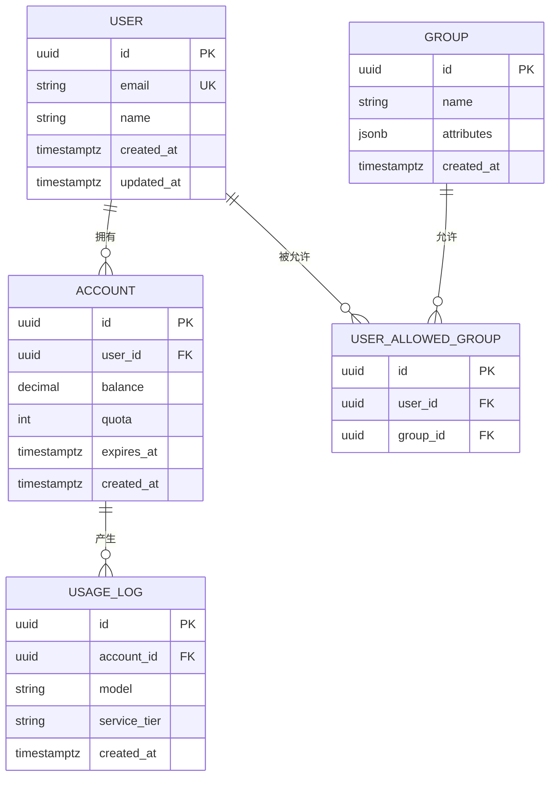
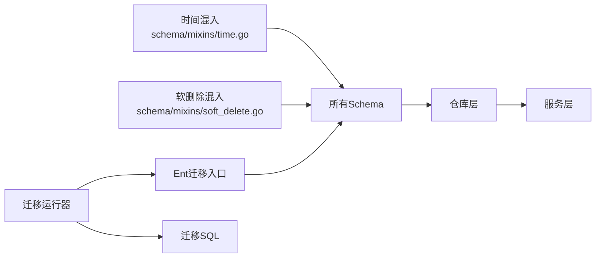

# 数据库设计规范

<cite>
**本文引用的文件**   
- [backend/ent/schema/account.go](file://backend/ent/schema/account.go)
- [backend/ent/schema/user.go](file://backend/ent/schema/user.go)
- [backend/ent/schema/group.go](file://backend/ent/schema/group.go)
- [backend/ent/schema/api_key.go](file://backend/ent/schema/api_key.go)
- [backend/ent/schema/usage_log.go](file://backend/ent/schema/usage_log.go)
- [backend/ent/schema/user_allowed_group.go](file://backend/ent/schema/user_allowed_group.go)
- [backend/ent/schema/user_attribute_definition.go](file://backend/ent/schema/user_attribute_definition.go)
- [backend/ent/schema/user_attribute_value.go](file://backend/ent/schema/user_attribute_value.go)
- [backend/ent/schema/promo_code.go](file://backend/ent/schema/promo_code.go)
- [backend/ent/schema/promo_code_usage.go](file://backend/ent/schema/promo_code_usage.go)
- [backend/ent/schema/redeem_code.go](file://backend/ent/schema/redeem_code.go)
- [backend/ent/schema/announcement.go](file://backend/ent/schema/announcement.go)
- [backend/ent/schema/announcement_read.go](file://backend/ent/schema/announcement_read.go)
- [backend/ent/schema/group_status_config.go](file://backend/ent/schema/group_status_config.go)
- [backend/ent/schema/group_status_event.go](file://backend/ent/schema/group_status_event.go)
- [backend/ent/schema/group_status_record.go](file://backend/ent/schema/group_status_record.go)
- [backend/ent/schema/group_status_state.go](file://backend/ent/schema/group_status_state.go)
- [backend/ent/schema/idempotency_record.go](file://backend/ent/schema/idempotency_record.go)
- [backend/ent/schema/error_passthrough_rule.go](file://backend/ent/schema/error_passthrough_rule.go)
- [backend/ent/schema/security_secret.go](file://backend/ent/schema/security_secret.go)
- [backend/ent/schema/tls_fingerprint_profile.go](file://backend/ent/schema/tls_fingerprint_profile.go)
- [backend/ent/schema/setting.go](file://backend/ent/schema/setting.go)
- [backend/ent/schema/proxy.go](file://backend/ent/schema/proxy.go)
- [backend/ent/schema/user_subscription.go](file://backend/ent/schema/user_subscription.go)
- [backend/ent/schema/user_referral.go](file://backend/ent/schema/user_referral.go)
- [backend/ent/schema/usage_cleanup_task.go](file://backend/ent/schema/usage_cleanup_task.go)
- [backend/ent/schema/mixins/time.go](file://backend/ent/schema/mixins/time.go)
- [backend/ent/schema/mixins/soft_delete.go](file://backend/ent/schema/mixins/soft_delete.go)
- [backend/ent/migrate/schema.go](file://backend/ent/migrate/schema.go)
- [backend/migrations/001_init.sql](file://backend/migrations/001_init.sql)
- [backend/migrations/010_add_usage_logs_aggregated_indexes.sql](file://backend/migrations/010_add_usage_logs_aggregated_indexes.sql)
- [backend/migrations/045_add_accounts_extra_index.sql](file://backend/migrations/045_add_accounts_extra_index.sql)
- [backend/migrations/062_add_scheduler_and_usage_composite_indexes_notx.sql](file://backend/migrations/062_add_scheduler_and_usage_composite_indexes_notx.sql)
- [backend/migrations/065_add_search_trgm_indexes.sql](file://backend/migrations/065_add_search_trgm_indexes.sql)
- [backend/migrations/070_add_usage_log_service_tier.sql](file://backend/migrations/070_add_usage_log_service_tier.sql)
- [backend/migrations/076_add_usage_log_upstream_model_index_notx.sql](file://backend/migrations/076_add_usage_log_upstream_model_index_notx.sql)
- [backend/migrations/078_add_usage_log_requested_model_index_notx.sql](file://backend/migrations/078_add_usage_log_requested_model_index_notx.sql)
- [backend/migrations/081_create_channels.sql](file://backend/migrations/081_create_channels.sql)
- [backend/migrations/091_add_group_status_tables.sql](file://backend/migrations/091_add_group_status_tables.sql)
- [backend/migrations/README.md](file://backend/migrations/README.md)
- [backend/cmd/server/main.go](file://backend/cmd/server/main.go)
- [backend/internal/repository/migrations_runner.go](file://backend/internal/repository/migrations_runner.go)
- [backend/internal/repository/db_pool.go](file://backend/internal/repository/db_pool.go)
- [backend/internal/repository/usage_log_repo.go](file://backend/internal/repository/usage_log_repo.go)
- [backend/internal/repository/user_repo.go](file://backend/internal/repository/user_repo.go)
- [backend/internal/repository/api_key_repo.go](file://backend/internal/repository/api_key_repo.go)
- [backend/internal/repository/account_repo.go](file://backend/internal/repository/account_repo.go)
- [backend/internal/service/account_service.go](file://backend/internal/service/account_service.go)
- [backend/internal/service/user_service.go](file://backend/internal/service/user_service.go)
- [backend/internal/service/usage_service.go](file://backend/internal/service/usage_service.go)
- [backend/internal/pkg/usagestats/usagestats.go](file://backend/internal/pkg/usagestats/usagestats.go)
- [backend/internal/pkg/sysutil/sysutil.go](file://backend/internal/pkg/sysutil/sysutil.go)
- [backend/internal/config/config.go](file://backend/internal/config/config.go)
</cite>

## 目录
1. 引言
2. 项目结构
3. 核心组件
4. 架构总览
5. 详细组件分析
6. 依赖分析
7. 性能考虑
8. 故障排查指南
9. 结论
10. 附录

## 引言
本规范面向Sub2API后端数据库设计与实现，基于Ent ORM与PostgreSQL的实际工程实践，制定统一的表结构设计标准、索引设计原则、迁移管理规范、数据完整性与并发控制策略，并提供查询优化、性能调优与常见问题解决方案。目标是确保数据库层在可扩展性、一致性与可维护性之间取得平衡。

## 项目结构
后端数据库相关代码主要分布在以下位置：
- Ent Schema：定义实体、字段、关系与索引
- Migrations：SQL迁移脚本与迁移运行器
- Repositories/Services：业务层对数据库的封装与调用
- 配置与启动：数据库连接池、迁移执行时机

**图示来源**
- [backend/cmd/server/main.go](file://backend/cmd/server/main.go)
- [backend/internal/config/config.go](file://backend/internal/config/config.go)
- [backend/internal/repository/db_pool.go](file://backend/internal/repository/db_pool.go)
- [backend/internal/repository/migrations_runner.go](file://backend/internal/repository/migrations_runner.go)
- [backend/ent/migrate/schema.go](file://backend/ent/migrate/schema.go)
- [backend/migrations/README.md](file://backend/migrations/README.md)

**章节来源**
- [backend/cmd/server/main.go](file://backend/cmd/server/main.go)
- [backend/internal/config/config.go](file://backend/internal/config/config.go)
- [backend/internal/repository/db_pool.go](file://backend/internal/repository/db_pool.go)
- [backend/internal/repository/migrations_runner.go](file://backend/internal/repository/migrations_runner.go)
- [backend/ent/migrate/schema.go](file://backend/ent/migrate/schema.go)
- [backend/migrations/README.md](file://backend/migrations/README.md)

## 核心组件
- 实体与Schema（Ent ORM）
  - 使用Ent的Schema定义实体、字段、索引与关系
  - 通过Mixins统一时间戳与软删除行为
- 迁移系统
  - SQL迁移脚本按版本号顺序执行
  - 迁移运行器负责执行与校验
- 仓库与服务层
  - 仓库封装数据库访问
  - 服务层编排业务逻辑与事务

**章节来源**
- [backend/ent/schema/mixins/time.go](file://backend/ent/schema/mixins/time.go)
- [backend/ent/schema/mixins/soft_delete.go](file://backend/ent/schema/mixins/soft_delete.go)
- [backend/ent/migrate/schema.go](file://backend/ent/migrate/schema.go)
- [backend/migrations/README.md](file://backend/migrations/README.md)

## 架构总览
数据库层整体流程：应用启动时加载配置，初始化连接池与迁移运行器；迁移运行器根据当前版本执行未应用的SQL脚本；Ent生成的Schema与运行时迁移共同维护数据库结构；业务通过仓库层进行读写操作。

**图示来源**
- [backend/cmd/server/main.go](file://backend/cmd/server/main.go)
- [backend/internal/config/config.go](file://backend/internal/config/config.go)
- [backend/internal/repository/db_pool.go](file://backend/internal/repository/db_pool.go)
- [backend/internal/repository/migrations_runner.go](file://backend/internal/repository/migrations_runner.go)
- [backend/ent/migrate/schema.go](file://backend/ent/migrate/schema.go)

## 详细组件分析

### 实体命名与字段类型规范
- 命名约定
  - 表名与字段名采用小写下划线风格
  - 复数形式用于表名，单数形式用于实体名
  - 关系字段遵循“实体小写 + _id”或“别名 + _id”
- 字段类型选择
  - 主键：整型自增或UUID（优先UUID以避免序列号暴露）
  - 时间：TIMESTAMPTZ（带时区）统一存储
  - 文本：TEXT或VARCHAR(n)，必要时使用全文检索字段
  - 数值：DECIMAL(precision, scale)用于计费与精确计算
  - 布尔：BOOLEAN
  - JSON/JSONB：JSONB用于查询与索引场景
- 约束与默认值
  - 非空字段明确NOT NULL
  - 默认值用于状态、计数器、时间戳等
  - 唯一约束用于邮箱、密钥、唯一标识等

**章节来源**
- [backend/ent/schema/user.go](file://backend/ent/schema/user.go)
- [backend/ent/schema/account.go](file://backend/ent/schema/account.go)
- [backend/ent/schema/api_key.go](file://backend/ent/schema/api_key.go)
- [backend/ent/schema/usage_log.go](file://backend/ent/schema/usage_log.go)

### 主键与外键设计原则
- 主键
  - 优先使用UUID作为主键，避免序列号泄露与跨库合并复杂度
  - 对于高并发写入且需要局部有序的表，可考虑自增ID并配合分片策略
- 外键
  - 明确外键关系，保持参照完整性
  - 对于软删除实体，外键指向软删除视图或在查询时显式过滤
- 聚合与宽表
  - 对高频聚合统计使用独立表或物化视图，避免主表冗余字段

**章节来源**
- [backend/ent/schema/user_allowed_group.go](file://backend/ent/schema/user_allowed_group.go)
- [backend/ent/schema/user_attribute_value.go](file://backend/ent/schema/user_attribute_value.go)
- [backend/ent/schema/promo_code_usage.go](file://backend/ent/schema/promo_code_usage.go)

### Ent ORM使用规范
- Schema定义
  - 使用Field定义字段与类型、默认值、注释
  - 使用Edge定义关系，明确方向、多重性与可选性
  - 使用Index定义单列/复合索引，必要时定义唯一索引
- 关系映射
  - 一对一/一对多/多对多通过Edge声明
  - 使用Reflexive Edge处理自关联（如用户推荐）
- 索引设计
  - 查询热点列建立索引；复合索引遵循最左前缀原则
  - 唯一索引用于业务唯一性约束
- 查询优化
  - 使用Select/Without/Order/Range限制结果集
  - 使用Preload/With*减少N+1查询
  - 对大结果集使用游标或分页

**章节来源**
- [backend/ent/schema/user_referral.go](file://backend/ent/schema/user_referral.go)
- [backend/ent/schema/user_subscription.go](file://backend/ent/schema/user_subscription.go)
- [backend/ent/schema/group_status_event.go](file://backend/ent/schema/group_status_event.go)

### 数据完整性约束
- 检查约束（CHECK）
  - 金额、比例、长度等数值范围校验
- 唯一约束（UNIQUE）
  - 用户邮箱、API密钥、邀请码等唯一标识
- 参照约束（FOREIGN KEY）
  - 严格外键约束，保证级联删除/更新策略合理
- 触发器与规则
  - 通过Ent Hook/Interceptor在写入前进行校验与转换

**章节来源**
- [backend/ent/schema/promo_code.go](file://backend/ent/schema/promo_code.go)
- [backend/ent/schema/redeem_code.go](file://backend/ent/schema/redeem_code.go)
- [backend/ent/schema/setting.go](file://backend/ent/schema/setting.go)

### 事务处理与并发控制
- 事务边界
  - 将跨实体的写操作放入单事务，保证一致性
  - 避免长事务，及时提交或回滚
- 并发控制
  - 使用SELECT FOR UPDATE锁定资源
  - 对高并发写入使用幂等记录避免重复
- 幂等性
  - 使用idempotency_record表记录请求ID，防止重放

**章节来源**
- [backend/ent/schema/idempotency_record.go](file://backend/ent/schema/idempotency_record.go)
- [backend/internal/service/account_service.go](file://backend/internal/service/account_service.go)
- [backend/internal/service/user_service.go](file://backend/internal/service/user_service.go)

### 索引设计原则与示例
- 单列索引
  - WHERE/ORDER/GROUP BY中高频字段
- 复合索引
  - 最左前缀匹配，将选择性高的列放在前面
  - 示例：usage_log上按时间、模型、服务等级组合索引
- 唯一索引
  - 用户邮箱、API密钥、邀请码等唯一性
- 部分索引与条件索引
  - 仅对活跃状态或特定状态建立索引，降低维护成本
- 全文搜索索引
  - 使用PG trigram扩展支持模糊搜索

**图示来源**
- [backend/migrations/010_add_usage_logs_aggregated_indexes.sql](file://backend/migrations/010_add_usage_logs_aggregated_indexes.sql)
- [backend/migrations/045_add_accounts_extra_index.sql](file://backend/migrations/045_add_accounts_extra_index.sql)
- [backend/migrations/062_add_scheduler_and_usage_composite_indexes_notx.sql](file://backend/migrations/062_add_scheduler_and_usage_composite_indexes_notx.sql)
- [backend/migrations/065_add_search_trgm_indexes.sql](file://backend/migrations/065_add_search_trgm_indexes.sql)
- [backend/migrations/076_add_usage_log_upstream_model_index_notx.sql](file://backend/migrations/076_add_usage_log_upstream_model_index_notx.sql)
- [backend/migrations/078_add_usage_log_requested_model_index_notx.sql](file://backend/migrations/078_add_usage_log_requested_model_index_notx.sql)

**章节来源**
- [backend/migrations/010_add_usage_logs_aggregated_indexes.sql](file://backend/migrations/010_add_usage_logs_aggregated_indexes.sql)
- [backend/migrations/045_add_accounts_extra_index.sql](file://backend/migrations/045_add_accounts_extra_index.sql)
- [backend/migrations/062_add_scheduler_and_usage_composite_indexes_notx.sql](file://backend/migrations/062_add_scheduler_and_usage_composite_indexes_notx.sql)
- [backend/migrations/065_add_search_trgm_indexes.sql](file://backend/migrations/065_add_search_trgm_indexes.sql)
- [backend/migrations/070_add_usage_log_service_tier.sql](file://backend/migrations/070_add_usage_log_service_tier.sql)
- [backend/migrations/076_add_usage_log_upstream_model_index_notx.sql](file://backend/migrations/076_add_usage_log_upstream_model_index_notx.sql)
- [backend/migrations/078_add_usage_log_requested_model_index_notx.sql](file://backend/migrations/078_add_usage_log_requested_model_index_notx.sql)

### 数据库迁移管理规范
- 命名规范
  - 版本号递增，三位补齐（如001、002），描述简洁明确
- 版本控制
  - 迁移脚本与运行器版本一致，禁止跳过中间版本
- 回滚策略
  - 尽量提供回滚脚本；对破坏性变更使用备份与灰度
- 一致性保证
  - 使用事务包裹迁移；对大表变更使用在线DDL或分批处理
- 运行时机
  - 应用启动时自动执行，失败则阻断启动

**图示来源**
- [backend/internal/repository/migrations_runner.go](file://backend/internal/repository/migrations_runner.go)
- [backend/ent/migrate/schema.go](file://backend/ent/migrate/schema.go)
- [backend/migrations/README.md](file://backend/migrations/README.md)

**章节来源**
- [backend/migrations/README.md](file://backend/migrations/README.md)
- [backend/internal/repository/migrations_runner.go](file://backend/internal/repository/migrations_runner.go)
- [backend/ent/migrate/schema.go](file://backend/ent/migrate/schema.go)

### 查询分析与性能优化
- EXPLAIN/EXPLAIN ANALYZE
  - 分析慢查询计划，识别全表扫描与缺失索引
- 统计信息
  - 定期更新表统计信息，确保CBO决策准确
- 分页与游标
  - 使用基于游标的分页替代OFFSET，避免深度分页
- 写入优化
  - 批量插入与更新；避免热点主键争用
- 缓存与物化
  - 对稳定报表数据使用物化视图或缓存

**章节来源**
- [backend/internal/repository/usage_log_repo.go](file://backend/internal/repository/usage_log_repo.go)
- [backend/internal/service/usage_service.go](file://backend/internal/service/usage_service.go)
- [backend/internal/pkg/usagestats/usagestats.go](file://backend/internal/pkg/usagestats/usagestats.go)

### 存储过程与触发器规范
- 存储过程
  - 仅在复杂聚合与批量处理时使用；保持逻辑清晰与可测试
- 触发器
  - 通过Ent Hook/Interceptor替代触发器，便于版本管理与调试
- 函数索引
  - 对表达式或函数结果建立索引（如LOWER(email)）

**章节来源**
- [backend/ent/schema/error_passthrough_rule.go](file://backend/ent/schema/error_passthrough_rule.go)
- [backend/ent/schema/security_secret.go](file://backend/ent/schema/security_secret.go)
- [backend/ent/schema/tls_fingerprint_profile.go](file://backend/ent/schema/tls_fingerprint_profile.go)

### 数据设计示例与最佳实践
- 用户与账户
  - 用户表包含基础身份信息与属性定义；账户表承载配额与计费
- 权限与分组
  - 用户允许分组通过中间表关联，支持灵活授权
- 使用日志
  - usage_log按时间分区，建立复合索引提升聚合查询性能
- 促销与兑换
  - 优惠券与使用记录分离，避免重复核销
- 公告与已读
  - 公告与已读标记分离，支持按用户维度统计

**图示来源**
- [backend/ent/schema/user.go](file://backend/ent/schema/user.go)
- [backend/ent/schema/account.go](file://backend/ent/schema/account.go)
- [backend/ent/schema/user_allowed_group.go](file://backend/ent/schema/user_allowed_group.go)
- [backend/ent/schema/group.go](file://backend/ent/schema/group.go)
- [backend/ent/schema/usage_log.go](file://backend/ent/schema/usage_log.go)

**章节来源**
- [backend/ent/schema/user.go](file://backend/ent/schema/user.go)
- [backend/ent/schema/account.go](file://backend/ent/schema/account.go)
- [backend/ent/schema/user_allowed_group.go](file://backend/ent/schema/user_allowed_group.go)
- [backend/ent/schema/group.go](file://backend/ent/schema/group.go)
- [backend/ent/schema/usage_log.go](file://backend/ent/schema/usage_log.go)

## 依赖分析
- Ent Schema依赖
  - Mixins提供通用字段与行为（时间戳、软删除）
  - Schema之间通过Edge建立关系，形成实体网络
- 迁移依赖
  - 迁移脚本按版本顺序执行，依赖前序版本结构
- 仓库与服务依赖
  - 仓库层依赖Ent生成的客户端；服务层依赖仓库层

**图示来源**
- [backend/ent/schema/mixins/time.go](file://backend/ent/schema/mixins/time.go)
- [backend/ent/schema/mixins/soft_delete.go](file://backend/ent/schema/mixins/soft_delete.go)
- [backend/ent/migrate/schema.go](file://backend/ent/migrate/schema.go)
- [backend/internal/repository/migrations_runner.go](file://backend/internal/repository/migrations_runner.go)
- [backend/migrations/README.md](file://backend/migrations/README.md)

**章节来源**
- [backend/ent/schema/mixins/time.go](file://backend/ent/schema/mixins/time.go)
- [backend/ent/schema/mixins/soft_delete.go](file://backend/ent/schema/mixins/soft_delete.go)
- [backend/ent/migrate/schema.go](file://backend/ent/migrate/schema.go)
- [backend/internal/repository/migrations_runner.go](file://backend/internal/repository/migrations_runner.go)
- [backend/migrations/README.md](file://backend/migrations/README.md)

## 性能考虑
- 索引策略
  - 高频查询列建立索引；复合索引遵循最左前缀
  - 对大文本字段谨慎建立索引，优先考虑全文索引
- 分区与归档
  - 按时间分区大表；历史数据归档到冷存储
- 连接池与并发
  - 合理设置最大连接数与空闲连接数
  - 对只读查询使用备用节点
- 监控与告警
  - 慢查询日志、执行计划分析、索引使用率监控

**章节来源**
- [backend/internal/repository/db_pool.go](file://backend/internal/repository/db_pool.go)
- [backend/internal/pkg/sysutil/sysutil.go](file://backend/internal/pkg/sysutil/sysutil.go)

## 故障排查指南
- 迁移失败
  - 检查版本号与脚本是否对应；确认事务是否成功提交
- 查询缓慢
  - 使用EXPLAIN分析执行计划；补充缺失索引或改写SQL
- 并发冲突
  - 检查锁等待与死锁日志；调整事务粒度与加锁策略
- 数据不一致
  - 校验唯一约束与外键约束；检查软删除与历史数据

**章节来源**
- [backend/internal/repository/migrations_runner.go](file://backend/internal/repository/migrations_runner.go)
- [backend/internal/repository/usage_log_repo.go](file://backend/internal/repository/usage_log_repo.go)
- [backend/internal/service/account_service.go](file://backend/internal/service/account_service.go)

## 结论
本规范总结了Sub2API数据库设计与实现的关键实践：以Ent ORM为核心，结合PostgreSQL特性，构建可扩展、可维护、高性能的数据库层。通过统一的命名与类型规范、严谨的索引与约束设计、完善的迁移与并发控制机制，确保系统在高并发与复杂业务场景下的稳定性与可演进性。

## 附录
- 常见问题
  - 如何为新表添加索引：先分析查询模式，再创建单列/复合索引，并通过EXPLAIN验证
  - 如何安全地修改大表结构：使用在线DDL或分批处理，保留回滚脚本
  - 如何避免重复写入：引入幂等记录并在服务层统一处理
- 参考文件
  - 迁移脚本与运行器：参见backend/migrations与internal/repository/migrations_runner.go
  - Ent Schema示例：参见backend/ent/schema下各实体文件
  - 仓库与服务：参见internal/repository与internal/service目录