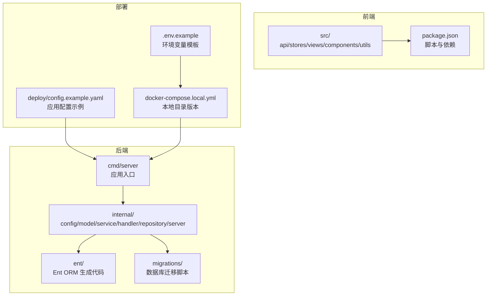
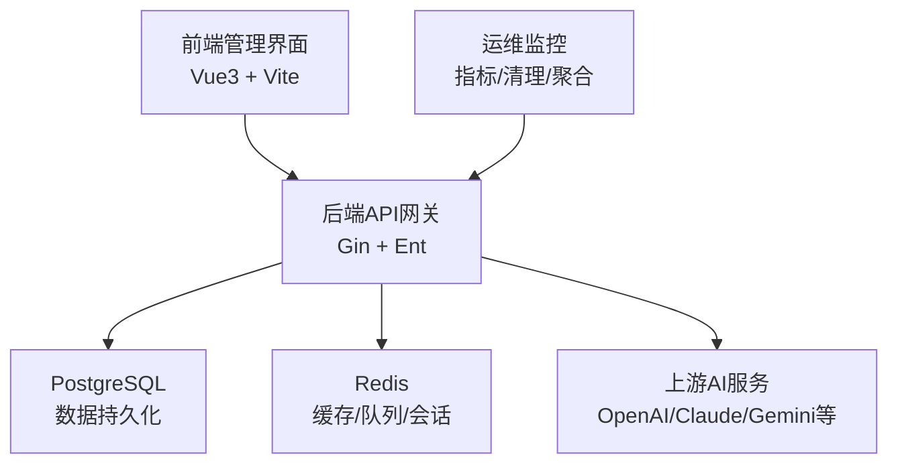

# 开发指南

<cite>
**本文引用的文件**   
- [README.md](file://README.md)
- [DEV_GUIDE.md](file://DEV_GUIDE.md)
- [Makefile](file://Makefile)
- [backend/go.mod](file://backend/go.mod)
- [frontend/package.json](file://frontend/package.json)
- [frontend/.eslintrc.cjs](file://frontend/.eslintrc.cjs)
- [frontend/tsconfig.json](file://frontend/tsconfig.json)
- [backend/.golangci.yml](file://backend/.golangci.yml)
- [deploy/README.md](file://deploy/README.md)
- [deploy/config.example.yaml](file://deploy/config.example.yaml)
</cite>

## 目录
1. [简介](#简介)
2. [项目结构](#项目结构)
3. [核心组件](#核心组件)
4. [架构总览](#架构总览)
5. [详细组件分析](#详细组件分析)
6. [依赖分析](#依赖分析)
7. [性能考虑](#性能考虑)
8. [故障排查指南](#故障排查指南)
9. [结论](#结论)
10. [附录](#附录)

## 简介
本开发指南面向Sub2API项目的开发者，提供从环境搭建、代码规范、测试策略、调试技巧到贡献流程与CI/CD的完整指引。项目采用Go后端（Gin + Ent）、Vue3前端、PostgreSQL与Redis作为核心基础设施，并提供多种部署方式（Docker Compose、二进制安装、源码构建）。

## 项目结构
- 后端（Go）位于 backend/，包含命令入口、配置、领域模型、服务层、处理器、仓储层、服务器路由与中间件等模块。
- 前端（Vue3）位于 frontend/，包含API调用、状态管理、页面组件、通用组件、国际化、工具函数等。
- 部署与安装脚本位于 deploy/，包含Docker Compose配置、一键安装脚本、示例配置等。
- 顶层README与开发指南提供总体说明与常见问题处理。

图表来源
- [README.md: 562-588:562-588](file://README.md#L562-L588)
- [deploy/README.md: 1-120:1-120](file://deploy/README.md#L1-L120)
- [frontend/package.json: 1-67:1-67](file://frontend/package.json#L1-L67)

章节来源
- [README.md: 562-588:562-588](file://README.md#L562-L588)
- [deploy/README.md: 1-120:1-120](file://deploy/README.md#L1-L120)
- [frontend/package.json: 1-67:1-67](file://frontend/package.json#L1-L67)

## 核心组件
- 应用入口与构建
  - 后端二进制构建：支持嵌入前端静态资源的构建标签，便于单体运行。
  - 前端构建：Vite + Vue3 + TypeScript，产物输出至后端嵌入目录。
  - 顶层Makefile提供统一编译与测试入口。
- 配置系统
  - YAML配置文件集中管理服务器、安全、网关、数据库、Redis、JWT、缓存等。
  - Docker Compose与二进制安装均提供配置模板与自动初始化能力。
- 代码质量与规范
  - 后端：golangci-lint启用多项静态检查，约束依赖导入与未使用变量等。
  - 前端：ESLint + TypeScript配置，统一风格与类型检查。

章节来源
- [README.md: 361-518:361-518](file://README.md#L361-L518)
- [deploy/config.example.yaml: 1-800:1-800](file://deploy/config.example.yaml#L1-L800)
- [backend/.golangci.yml: 1-140:1-140](file://backend/.golangci.yml#L1-L140)
- [frontend/.eslintrc.cjs: 1-37:1-37](file://frontend/.eslintrc.cjs#L1-L37)
- [frontend/tsconfig.json: 1-27:1-27](file://frontend/tsconfig.json#L1-L27)
- [Makefile: 1-33:1-33](file://Makefile#L1-L33)

## 架构总览
Sub2API采用“后端API网关 + 前端管理界面”的分层架构。后端负责API路由、鉴权、配额与计费、上游代理、并发与调度、监控与运维等；前端提供用户与管理员操作界面；数据库与缓存支撑持久化与高性能缓存。

图表来源
- [README.md: 103-112:103-112](file://README.md#L103-L112)
- [deploy/config.example.yaml: 700-763:700-763](file://deploy/config.example.yaml#L700-L763)

## 详细组件分析

### 开发环境搭建
- 本地开发环境
  - 后端：Go 1.25.7（或go.mod指定版本），使用go run启动开发服务器。
  - 前端：Node.js 18+，pnpm安装依赖，vite dev启动热更新。
  - 数据库：PostgreSQL 15+，Redis 7+，可通过Docker Compose或系统服务运行。
- Docker Compose（推荐）
  - 一键部署脚本生成.env与compose配置，自动完成数据库迁移与管理员账户初始化。
  - 支持本地目录版本与命名卷版本，便于备份与迁移。
- 二进制安装
  - systemd服务管理，提供一键安装、升级与卸载脚本。
  - 首次运行通过Web Setup Wizard完成配置。

章节来源
- [README.md: 361-518:361-518](file://README.md#L361-L518)
- [deploy/README.md: 30-120:30-120](file://deploy/README.md#L30-L120)
- [DEV_GUIDE.md: 15-43:15-43](file://DEV_GUIDE.md#L15-L43)

### 代码规范与最佳实践

- Go语言编码规范
  - 使用golangci-lint进行静态检查，关注依赖导入限制、错误处理、未使用变量等。
  - 遵循Ent Schema变更后生成代码并提交生成文件的流程。
- Vue前端开发规范
  - ESLint规则与TypeScript配置确保统一风格与类型安全。
  - 前端依赖使用pnpm，锁定文件需随package.json同步提交。
- 数据库设计规范
  - 使用Ent ORM定义Schema，迁移脚本按序号递增，迁移记录在schema_migrations表中。
  - 建议为高频查询字段建立索引，遵循软删除与唯一约束设计。

章节来源
- [backend/.golangci.yml: 1-140:1-140](file://backend/.golangci.yml#L1-L140)
- [frontend/.eslintrc.cjs: 1-37:1-37](file://frontend/.eslintrc.cjs#L1-L37)
- [frontend/tsconfig.json: 1-27:1-27](file://frontend/tsconfig.json#L1-L27)
- [deploy/README.md: 127-150:127-150](file://deploy/README.md#L127-L150)

### 测试策略与实施方法
- 单元测试
  - 后端：go test -tags=unit ./...，建议按模块划分测试范围。
  - 前端：Vitest运行单元测试，支持覆盖率统计。
- 集成测试
  - 后端：go test -tags=integration ./...，使用TestContainers模拟PostgreSQL/Redis。
  - 建议在CI中与单元测试并行执行。
- 性能测试
  - 建议结合并发与负载场景，使用压测工具对网关与上游代理进行评估。
  - 关注连接池、超时与重试策略对吞吐与延迟的影响。

章节来源
- [DEV_GUIDE.md: 59-74:59-74](file://DEV_GUIDE.md#L59-L74)
- [backend/go.mod: 32-33:32-33](file://backend/go.mod#L32-L33)
- [frontend/package.json: 20-23:20-23](file://frontend/package.json#L20-L23)

### 调试技巧与工具使用
- 后端调试
  - 使用golangci-lint定位潜在问题，关注未使用变量与依赖导入违规。
  - 在本地开发模式下，结合日志配置与断点调试。
- 前端调试
  - 使用Vite Dev Server热更新，结合浏览器开发者工具与Vue DevTools。
  - 类型检查与ESLint规则有助于早期发现类型与风格问题。
- 部署与运维
  - Docker Compose日志查看与容器健康检查，二进制安装使用systemd与journalctl。
  - 配置文件与环境变量的正确性是排障重点。

章节来源
- [backend/.golangci.yml: 1-140:1-140](file://backend/.golangci.yml#L1-L140)
- [deploy/README.md: 487-550:487-550](file://deploy/README.md#L487-L550)
- [DEV_GUIDE.md: 295-311:295-311](file://DEV_GUIDE.md#L295-L311)

### 贡献指南
- 提交流程
  - 同步上游分支，基于最新main创建功能分支，提交PR前确保本地测试与lint通过。
  - 提交清单包括：单元/集成测试通过、golangci-lint无新增问题、pnpm-lock.yaml同步、Ent生成代码提交等。
- 代码评审与合并
  - 遵循项目既定的代码风格与测试要求，确保变更可维护与可观察。

章节来源
- [DEV_GUIDE.md: 235-245:235-245](file://DEV_GUIDE.md#L235-L245)

### 持续集成与自动化部署
- CI流水线
  - 后端：单元测试 + 集成测试 + golangci-lint v2.7。
  - 安全扫描：govulncheck + gosec + pnpm audit。
  - 发布：tag触发构建发布。
- 自动化部署
  - Docker Compose一键部署脚本自动注入密钥与生成配置。
  - 二进制安装脚本提供systemd服务与升级/卸载能力。

章节来源
- [DEV_GUIDE.md: 44-58:44-58](file://DEV_GUIDE.md#L44-L58)
- [deploy/README.md: 30-120:30-120](file://deploy/README.md#L30-L120)

### 常见开发问题与最佳实践
- pnpm与npm冲突：清理node_modules后使用pnpm install。
- PowerShell中SQL执行：使用文件注入避免$转义问题。
- PostgreSQL密码重置：修改pg_hba.conf为trust后重启服务，重置密码再改回。
- Ent Schema变更：修改后执行go generate ./ent并提交生成文件。
- 批量修改账号模型映射：避免跨平台覆盖默认映射，必要时手动补回透传映射。

章节来源
- [DEV_GUIDE.md: 75-232:75-232](file://DEV_GUIDE.md#L75-L232)

## 依赖分析
- 后端依赖
  - Web框架：Gin
  - ORM：Ent
  - 缓存：Redis
  - 安全：JWT、TOTP、CSP、URL白名单
  - 监控与日志：Zap、OpenTelemetry
- 前端依赖
  - 框架：Vue3
  - 构建：Vite
  - 类型与校验：TypeScript、ESLint
  - 状态管理：Pinia
  - 路由：Vue Router
  - 图表与工具：Chart.js、VueUse、Axios等

章节来源
- [backend/go.mod: 1-177:1-177](file://backend/go.mod#L1-L177)
- [frontend/package.json: 1-67:1-67](file://frontend/package.json#L1-L67)

## 性能考虑
- 连接池与并发
  - 合理配置数据库与Redis连接池大小，避免过度建连与空闲浪费。
  - 网关层的上游连接池隔离策略与并发槽位管理直接影响稳定性与延迟。
- 缓存策略
  - API Key认证缓存、仪表盘缓存与负缓存策略降低后端压力。
- 超时与重试
  - 明确上游响应头等待、非流式响应读取上限、流式keepalive等超时参数。
  - WS/HTTP回退冷却与重试退避参数平衡可靠性与性能。

章节来源
- [deploy/config.example.yaml: 298-382:298-382](file://deploy/config.example.yaml#L298-L382)
- [deploy/config.example.yaml: 569-588:569-588](file://deploy/config.example.yaml#L569-L588)
- [deploy/config.example.yaml: 593-609:593-609](file://deploy/config.example.yaml#L593-L609)

## 故障排查指南
- Docker部署
  - 检查容器状态、数据库与Redis连通性、日志输出与数据目录权限。
- 二进制安装
  - 使用systemd状态与journalctl查看日志，核对配置文件与环境变量。
- 常见问题
  - 端口占用、数据库/Redis连接失败、权限不足等问题的定位与修复步骤。

章节来源
- [deploy/README.md: 487-550:487-550](file://deploy/README.md#L487-L550)

## 结论
本指南提供了Sub2API从环境搭建到开发、测试、调试与部署的全流程实践建议。建议在本地与CI中严格执行测试与代码质量检查，遵循配置与依赖管理规范，以保障系统的稳定性与可维护性。

## 附录
- 快速命令速查
  - 后端：go run ./cmd/server、go test -tags=unit/integration ./...、golangci-lint run ./...
  - 前端：pnpm dev/build/test、类型检查与ESLint检查
  - 顶层：make build/test、一键编译与测试

章节来源
- [DEV_GUIDE.md: 246-311:246-311](file://DEV_GUIDE.md#L246-L311)
- [Makefile: 1-33:1-33](file://Makefile#L1-L33)