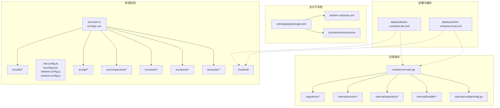
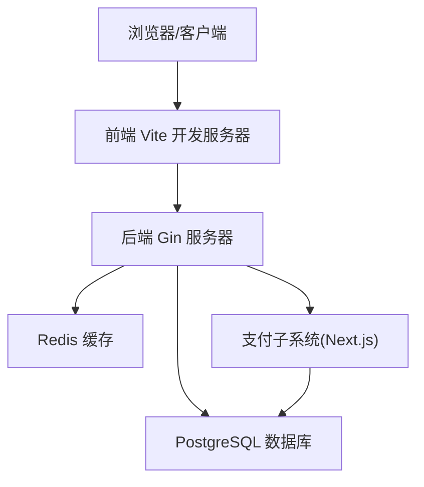
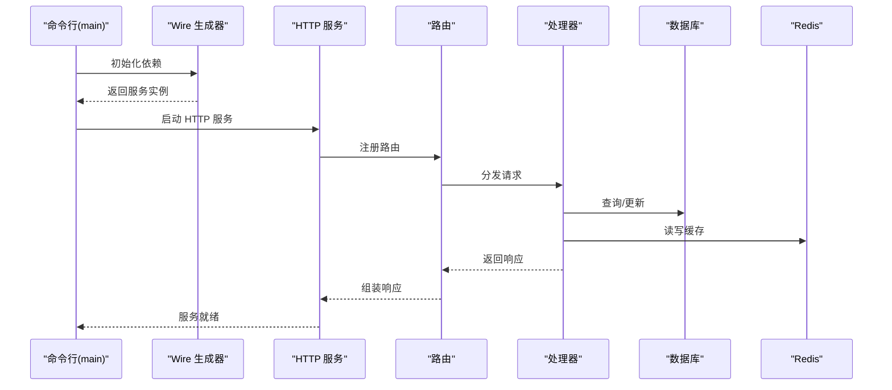
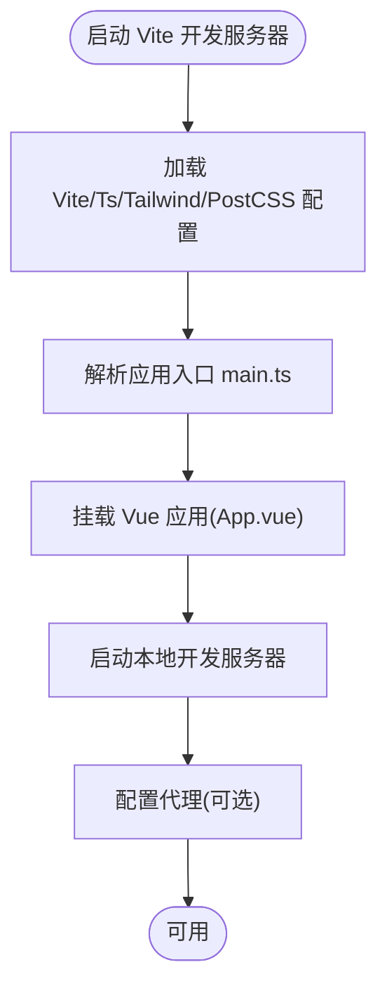
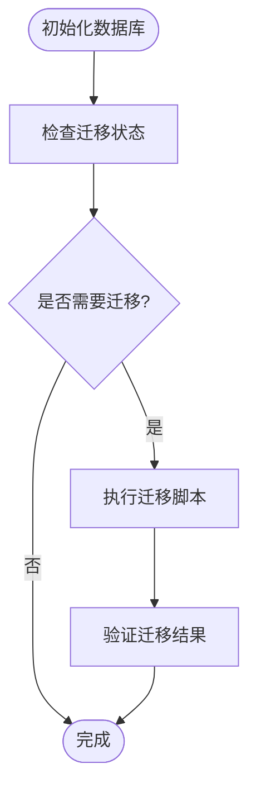
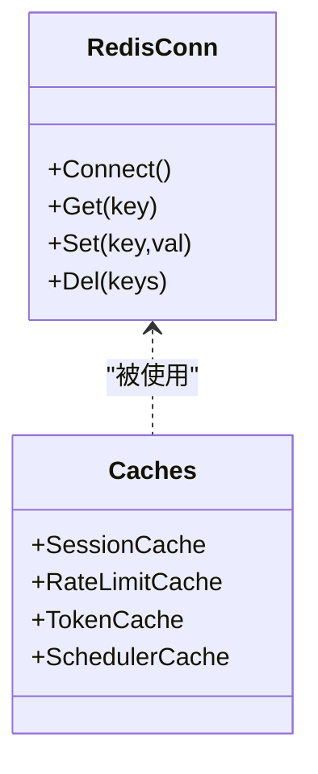
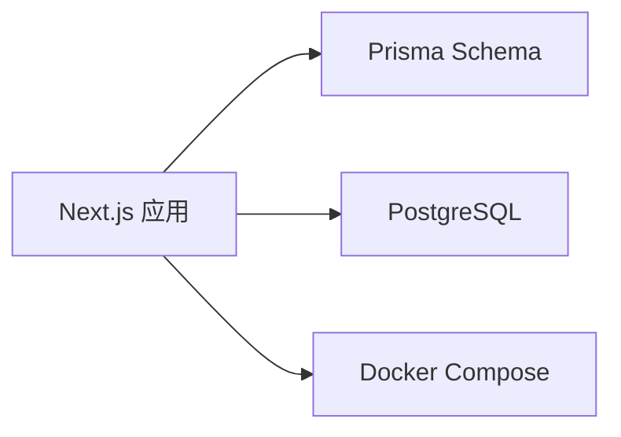
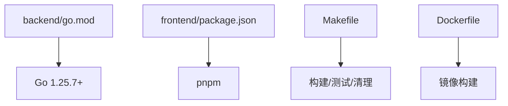

# 开发环境搭建

<cite>
**本文引用的文件**
- [README.md](file://README.md)
- [backend/go.mod](file://backend/go.mod)
- [frontend/package.json](file://frontend/package.json)
- [deploy/docker-compose.dev.yml](file://deploy/docker-compose.dev.yml)
- [deploy/docker-compose.local.yml](file://deploy/docker-compose.local.yml)
- [backend/cmd/server/main.go](file://backend/cmd/server/main.go)
- [backend/internal/config/config.go](file://backend/internal/config/config.go)
- [backend/migrations/README.md](file://backend/migrations/README.md)
- [backend/migrations/001_init.sql](file://backend/migrations/001_init.sql)
- [backend/migrations/002_account_type_migration.sql](file://backend/migrations/002_account_type_migration.sql)
- [backend/migrations/003_subscription.sql](file://backend/migrations/003_subscription.sql)
- [backend/migrations/004_add_redeem_code_notes.sql](file://backend/migrations/004_add_redeem_code_notes.sql)
- [backend/migrations/005_schema_parity.sql](file://backend/migrations/005_schema_parity.sql)
- [backend/migrations/006_add_users_allowed_groups_compat.sql](file://backend/migrations/006_add_users_allowed_groups_compat.sql)
- [backend/migrations/006_fix_invalid_subscription_expires_at.sql](file://backend/migrations/006_fix_invalid_subscription_expires_at.sql)
- [backend/migrations/006b_guard_users_allowed_groups.sql](file://backend/migrations/006b_guard_users_allowed_groups.sql)
- [backend/migrations/007_add_user_allowed_groups.sql](file://backend/migrations/007_add_user_allowed_groups.sql)
- [backend/migrations/008_seed_default_group.sql](file://backend/migrations/008_seed_default_group.sql)
- [backend/migrations/009_fix_usage_logs_cache_columns.sql](file://backend/migrations/009_fix_usage_logs_cache_columns.sql)
- [backend/migrations/010_add_usage_logs_aggregated_indexes.sql](file://backend/migrations/010_add_usage_logs_aggregated_indexes.sql)
- [backend/migrations/011_remove_duplicate_unique_indexes.sql](file://backend/migrations/011_remove_duplicate_unique_indexes.sql)
- [backend/migrations/012_add_user_subscription_soft_delete.sql](file://backend/migrations/012_add_user_subscription_soft_delete.sql)
- [backend/migrations/013_log_orphan_allowed_groups.sql](file://backend/migrations/013_log_orphan_allowed_groups.sql)
- [backend/migrations/014_drop_legacy_allowed_groups.sql](file://backend/migrations/014_drop_legacy_allowed_groups.sql)
- [backend/migrations/015_fix_settings_unique_constraint.sql](file://backend/migrations/015_fix_settings_unique_constraint.sql)
- [backend/migrations/016_soft_delete_partial_unique_indexes.sql](file://backend/migrations/016_soft_delete_partial_unique_indexes.sql)
- [backend/migrations/018_user_attributes.sql](file://backend/migrations/018_user_attributes.sql)
- [backend/migrations/019_migrate_wechat_to_attributes.sql](file://backend/migrations/019_migrate_wechat_to_attributes.sql)
- [backend/migrations/020_add_temp_unschedulable.sql](file://backend/migrations/020_add_temp_unschedulable.sql)
- [backend/migrations/024_add_gemini_tier_id.sql](file://backend/migrations/024_add_gemini_tier_id.sql)
- [backend/migrations/026_ops_metrics_aggregation_tables.sql](file://backend/migrations/026_ops_metrics_aggregation_tables.sql)
- [backend/migrations/027_usage_billing_consistency.sql](file://backend/migrations/027_usage_billing_consistency.sql)
- [backend/migrations/028_add_account_notes.sql](file://backend/migrations/028_add_account_notes.sql)
- [backend/migrations/028_add_usage_logs_user_agent.sql](file://backend/migrations/028_add_usage_logs_user_agent.sql)
- [backend/migrations/028_group_image_pricing.sql](file://backend/migrations/028_group_image_pricing.sql)
- [backend/migrations/029_add_group_claude_code_restriction.sql](file://backend/migrations/029_add_group_claude_code_restriction.sql)
- [backend/migrations/029_usage_log_image_fields.sql](file://backend/migrations/029_usage_log_image_fields.sql)
- [backend/migrations/030_add_account_expires_at.sql](file://backend/migrations/030_add_account_expires_at.sql)
- [backend/migrations/031_add_ip_address.sql](file://backend/migrations/031_add_ip_address.sql)
- [backend/migrations/032_add_api_key_ip_restriction.sql](file://backend/migrations/032_add_api_key_ip_restriction.sql)
- [backend/migrations/033_add_promo_codes.sql](file://backend/migrations/033_add_promo_codes.sql)
- [backend/migrations/033_ops_monitoring_vnext.sql](file://backend/migrations/033_ops_monitoring_vnext.sql)
- [backend/migrations/034_ops_upstream_error_events.sql](file://backend/migrations/034_ops_upstream_error_events.sql)
- [backend/migrations/034_usage_dashboard_aggregation_tables.sql](file://backend/migrations/034_usage_dashboard_aggregation_tables.sql)
- [backend/migrations/035_usage_logs_partitioning.sql](file://backend/migrations/035_usage_logs_partitioning.sql)
- [backend/migrations/036_ops_error_logs_add_is_count_tokens.sql](file://backend/migrations/036_ops_error_logs_add_is_count_tokens.sql)
- [backend/migrations/036_scheduler_outbox.sql](file://backend/migrations/036_scheduler_outbox.sql)
- [backend/migrations/037_add_account_rate_multiplier.sql](file://backend/migrations/037_add_account_rate_multiplier.sql)
- [backend/migrations/037_ops_alert_silences.sql](file://backend/migrations/037_ops_alert_silences.sql)
- [backend/migrations/038_ops_errors_resolution_retry_results_and_standardize_classification.sql](file://backend/migrations/038_ops_errors_resolution_retry_results_and_standardize_classification.sql)
- [backend/migrations/039_ops_job_heartbeats_add_last_result.sql](file://backend/migrations/039_ops_job_heartbeats_add_last_result.sql)
- [backend/migrations/040_add_group_model_routing.sql](file://backend/migrations/040_add_group_model_routing.sql)
- [backend/migrations/041_add_model_routing_enabled.sql](file://backend/migrations/041_add_model_routing_enabled.sql)
- [backend/migrations/042_add_usage_cleanup_tasks.sql](file://backend/migrations/042_add_usage_cleanup_tasks.sql)
- [backend/migrations/042b_add_ops_system_metrics_switch_count.sql](file://backend/migrations/042b_add_ops_system_metrics_switch_count.sql)
- [backend/migrations/043_add_usage_cleanup_cancel_audit.sql](file://backend/migrations/043_add_usage_cleanup_cancel_audit.sql)
- [backend/migrations/043b_add_group_invalid_request_fallback.sql](file://backend/migrations/043b_add_group_invalid_request_fallback.sql)
- [backend/migrations/044_add_user_totp.sql](file://backend/migrations/044_add_user_totp.sql)
- [backend/migrations/044b_add_group_mcp_xml_inject.sql](file://backend/migrations/044b_add_group_mcp_xml_inject.sql)
- [backend/migrations/045_add_accounts_extra_index.sql](file://backend/migrations/045_add_accounts_extra_index.sql)
- [backend/migrations/045_add_announcements.sql](file://backend/migrations/045_add_announcements.sql)
- [backend/migrations/045_add_api_key_quota.sql](file://backend/migrations/045_add_api_key_quota.sql)
- [backend/migrations/046_add_sora_accounts.sql](file://backend/migrations/046_add_sora_accounts.sql)
- [backend/migrations/046_add_usage_log_reasoning_effort.sql](file://backend/migrations/046_add_usage_log_reasoning_effort.sql)
- [backend/migrations/046b_add_group_supported_model_scopes.sql](file://backend/migrations/046b_add_group_supported_model_scopes.sql)
- [backend/migrations/047_add_sora_pricing_and_media_type.sql](file://backend/migrations/047_add_sora_pricing_and_media_type.sql)
- [backend/migrations/047_add_user_group_rate_multipliers.sql](file://backend/migrations/047_add_user_group_rate_multipliers.sql)
- [backend/migrations/048_add_error_passthrough_rules.sql](file://backend/migrations/048_add_error_passthrough_rules.sql)
- [backend/migrations/049_unify_antigravity_model_mapping.sql](file://backend/migrations/049_unify_antigravity_model_mapping.sql)
- [backend/migrations/050_map_opus46_to_opus45.sql](file://backend/migrations/050_map_opus46_to_opus45.sql)
- [backend/migrations/051_migrate_opus45_to_opus46_thinking.sql](file://backend/migrations/051_migrate_opus45_to_opus46_thinking.sql)
- [backend/migrations/052_add_group_sort_order.sql](file://backend/migrations/052_add_group_sort_order.sql)
- [backend/migrations/052_migrate_upstream_to_apikey.sql](file://backend/migrations/052_migrate_upstream_to_apikey.sql)
- [backend/migrations/053_add_referral_system.sql](file://backend/migrations/053_add_referral_system.sql)
- [backend/migrations/053_add_security_secrets.sql](file
- [backend/migrations/053_add_skip_monitoring_to_error_passthrough.sql](file://backend/migrations/053_add_skip_monitoring_to_error_passthrough.sql)
- [backend/migrations/054_drop_legacy_cache_columns.sql](file://backend/migrations/054_drop_legacy_cache_columns.sql)
- [backend/migrations/054_ops_system_logs.sql](file://backend/migrations/054_ops_system_logs.sql)
- [backend/migrations/055_add_cache_ttl_overridden.sql](file://backend/migrations/055_add_cache_ttl_overridden.sql)
- [backend/migrations/056_add_api_key_last_used_at.sql](file://backend/migrations/056_add_api_key_last_used_at.sql)
- [backend/migrations/057_add_idempotency_records.sql](file://backend/migrations/057_add_idempotency_records.sql)
- [backend/migrations/058_add_sonnet46_to_model_mapping.sql](file://backend/migrations/058_add_sonnet46_to_model_mapping.sql)
- [backend/migrations/059_add_gemini31_pro_to_model_mapping.sql](file://backend/migrations/059_add_gemini31_pro_to_model_mapping.sql)
- [backend/migrations/060_add_gemini31_flash_image_to_model_mapping.sql](file://backend/migrations/060_add_gemini31_flash_image_to_model_mapping.sql)
- [backend/migrations/060_add_usage_log_openai_ws_mode.sql](file://backend/migrations/060_add_usage_log_openai_ws_mode.sql)
- [backend/migrations/061_add_usage_log_request_type.sql](file://backend/migrations/061_add_usage_log_request_type.sql)
- [backend/migrations/062_add_usage_cleanup_tasks.sql](file://backend/migrations/062_add_usage_cleanup_tasks.sql)
- [backend/migrations/063_add_sora_client_tables.sql](file://backend/migrations/063_add_sora_client_tables.sql)
- [backend/migrations/064_add_api_key_rate_limits.sql](file://backend/migrations/064_add_api_key_rate_limits.sql)
- [backend/migrations/065_add_search_trgm_indexes.sql](file://backend/migrations/065_add_search_trgm_indexes.sql)
- [backend/migrations/066_add_scheduled_test_tables.sql](file://backend/migrations/066_add_scheduled_test_tables.sql)
- [backend/migrations/067_add_account_load_factor.sql](file://backend/migrations/067_add_account_load_factor.sql)
- [backend/migrations/068_add_announcement_notify_mode.sql](file://backend/migrations/068_add_announcement_notify_mode.sql)
- [backend/migrations/069_add_group_messages_dispatch.sql](file://backend/migrations/069_add_group_messages_dispatch.sql)
- [backend/migrations/070_add_scheduled_test_auto_recover.sql](file://backend/migrations/070_add_scheduled_test_auto_recover.sql)
- [backend/migrations/070_add_usage_log_service_tier.sql](file://backend/migrations/070_add_usage_log_service_tier.sql)
- [backend/migrations/071_add_gemini25_flash_image_to_model_mapping.sql](file://backend/migrations/071_add_gemini25_flash_image_to_model_mapping.sql)
- [backend/migrations/071_add_usage_billing_dedup.sql](file://backend/migrations/071_add_usage_billing_dedup.sql)
- [backend/migrations/072_add_usage_billing_dedup_created_at_brin_notx.sql](file://backend/migrations/072_add_usage_billing_dedup_created_at_brin_notx.sql)
- [backend/migrations/073_add_usage_billing_dedup_archive.sql](file://backend/migrations/073_add_usage_billing_dedup_archive.sql)
- [backend/migrations/074_add_usage_log_endpoints.sql](file://backend/migrations/074_add_usage_log_endpoints.sql)
- [backend/migrations/075_add_usage_log_upstream_model.sql](file://backend/migrations/075_add_usage_log_upstream_model.sql)
- [backend/migrations/075_map_haiku45_to_sonnet46.sql](file://backend/migrations/075_map_haiku45_to_sonnet46.sql)
- [backend/migrations/076_add_usage_log_upstream_model_index_notx.sql](file://backend/migrations/076_add_usage_log_upstream_model_index_notx.sql)
- [backend/migrations/077_add_usage_log_requested_model.sql](file://backend/migrations/077_add_usage_log_requested_model.sql)
- [backend/migrations/078_add_usage_log_requested_model_index_notx.sql](file://backend/migrations/078_add_usage_log_requested_model_index_notx.sql)
- [backend/migrations/079_ops_error_logs_add_endpoint_fields.sql](file://backend/migrations/079_ops_error_logs_add_endpoint_fields.sql)
- [backend/migrations/080_create_tls_fingerprint_profiles.sql](file://backend/migrations/080_create_tls_fingerprint_profiles.sql)
- [backend/migrations/081_add_group_account_filter.sql](file://backend/migrations/081_add_group_account_filter.sql)
- [backend/migrations/081_create_channels.sql](file://backend/migrations/081_create_channels.sql)
- [backend/migrations/082_refactor_channel_pricing.sql](file://backend/migrations/082_refactor_channel_pricing.sql)
- [backend/migrations/083_channel_model_mapping.sql](file://backend/migrations/083_channel_model_mapping.sql)
- [backend/migrations/084_channel_billing_model_source.sql](file://backend/migrations/084_channel_billing_model_source.sql)
- [backend/migrations/085_channel_restrict_and_per_request_price.sql](file://backend/migrations/085_channel_restrict_and_per_request_price.sql)
- [backend/migrations/086_channel_platform_pricing.sql](file://backend/migrations/086_channel_platform_pricing.sql)
- [backend/migrations/087_usage_log_billing_mode.sql](file://backend/migrations/087_usage_log_billing_mode.sql)
- [backend/migrations/088_channel_billing_model_source_channel_mapped.sql](file://backend/migrations/088_channel_billing_model_source_channel_mapped.sql)
- [backend/migrations/089_usage_log_image_output_tokens.sql](file://backend/migrations/089_usage_log_image_output_tokens.sql)
- [backend/migrations/090_drop_sora.sql](file://backend/migrations/090_drop_sora.sql)
- [backend/migrations/091_add_group_status_tables.sql](file://backend/migrations/091_add_group_status_tables.sql)
- [backend/migrations/144_add_opus48_to_model_mapping.sql](file://backend/migrations/144_add_opus48_to_model_mapping.sql)
- [backend/migrations/README.md](file://backend/migrations/README.md)
- [backend/migrations/migrations.go](file://backend/migrations/migrations.go)
- [backend/cmd/jwtgen/main.go](file://backend/cmd/jwtgen/main.go)
- [backend/internal/repository/redis.go](file://backend/internal/repository/redis.go)
- [backend/internal/repository/db_pool.go](file://backend/internal/repository/db_pool.go)
- [backend/internal/server/http.go](file://backend/internal/server/http.go)
- [backend/internal/server/router.go](file://backend/internal/server/router.go)
- [backend/internal/handler/endpoint.go](file://backend/internal/handler/endpoint.go)
- [backend/internal/handler/gateway_handler.go](file://backend/internal/handler/gateway_handler.go)
- [backend/internal/handler/openai_chat_completions.go](file://backend/internal/handler/openai_chat_completions.go)
- [backend/internal/handler/setting_handler.go](file://backend/internal/handler/setting_handler.go)
- [backend/internal/handler/user_handler.go](file://backend/internal/handler/user_handler.go)
- [backend/internal/handler/admin/](file://backend/internal/handler/admin/)
- [backend/internal/service/](file://backend/internal/service/)
- [backend/internal/repository/](file://backend/internal/repository/)
- [backend/internal/pkg/](file://backend/internal/pkg/)
- [frontend/vite.config.ts](file://frontend/vite.config.ts)
- [frontend/tsconfig.json](file://frontend/tsconfig.json)
- [frontend/tailwind.config.js](file://frontend/tailwind.config.js)
- [frontend/postcss.config.js](file://frontend/postcss.config.js)
- [frontend/src/main.ts](file://frontend/src/main.ts)
- [frontend/src/App.vue](file://frontend/src/App.vue)
- [frontend/src/router/](file://frontend/src/router/)
- [frontend/src/stores/](file://frontend/src/stores/)
- [frontend/src/components/](file://frontend/src/components/)
- [frontend/src/composables/](file://frontend/src/composables/)
- [frontend/src/utils/](file://frontend/src/utils/)
- [frontend/src/views/](file://frontend/src/views/)
- [frontend/src/api/](file://frontend/src/api/)
- [frontend/src/types/](file://frontend/src/types/)
- [frontend/src/constants/](file://frontend/src/constants/)
- [frontend/src/i18n/](file://frontend/src/i18n/)
- [frontend/src/styles/](file://frontend/src/styles/)
- [sub2apipay/package.json](file://sub2apipay/package.json)
- [sub2apipay/docker-compose.yml](file://sub2apipay/docker-compose.yml)
- [sub2apipay/Dockerfile](file://sub2apipay/Dockerfile)
- [sub2apipay/prisma/schema.prisma](file://sub2apipay/prisma/schema.prisma)
- [sub2apipay/src/app/](file://sub2apipay/src/app/)
- [sub2apipay/src/lib/](file://sub2apipay/src/lib/)
- [sub2apipay/src/components/](file://sub2apipay/src/components/)
- [tools/check_pnpm_audit_exceptions.py](file://tools/check_pnpm_audit_exceptions.py)
</cite>

## 目录
1. [简介](#简介)
2. [项目结构](#项目结构)
3. [核心组件](#核心组件)
4. [架构总览](#架构总览)
5. [详细组件分析](#详细组件分析)
6. [依赖分析](#依赖分析)
7. [性能考虑](#性能考虑)
8. [故障排除指南](#故障排除指南)
9. [结论](#结论)
10. [附录](#附录)

## 简介
本指南面向希望在本地搭建 Sub2API 开发环境的开发者，覆盖系统要求与前置条件（Go、PostgreSQL、Redis）、数据库初始化、Redis 配置、依赖安装（后端 Go 模块与前端 pnpm）、开发服务器启动（后端 Gin 与前端 Vite）、常见环境问题排查以及开发工具与 IDE 推荐。文档中的所有技术细节均来自仓库内现有文件与配置，确保可操作性与准确性。

## 项目结构
Sub2API 采用多模块结构：后端 Go 服务、前端 Vue/Vite 应用、支付子系统 Next.js 应用、部署编排与迁移脚本等。下图展示与开发环境相关的核心目录与职责：

**图表来源**
- [backend/cmd/server/main.go:1-200](file://backend/cmd/server/main.go#L1-L200)
- [backend/internal/config/config.go:1-200](file://backend/internal/config/config.go#L1-L200)
- [backend/internal/handler/endpoint.go:1-200](file://backend/internal/handler/endpoint.go#L1-L200)
- [backend/internal/repository/redis.go:1-200](file://backend/internal/repository/redis.go#L1-L200)
- [backend/migrations/README.md:1-200](file://backend/migrations/README.md#L1-L200)
- [frontend/vite.config.ts:1-200](file://frontend/vite.config.ts#L1-L200)
- [frontend/src/main.ts:1-200](file://frontend/src/main.ts#L1-L200)
- [frontend/src/App.vue:1-200](file://frontend/src/App.vue#L1-L200)
- [sub2apipay/package.json:1-200](file://sub2apipay/package.json#L1-L200)
- [sub2apipay/docker-compose.yml:1-200](file://sub2apipay/docker-compose.yml#L1-L200)
- [deploy/docker-compose.dev.yml:1-200](file://deploy/docker-compose.dev.yml#L1-L200)
- [deploy/docker-compose.local.yml:1-200](file://deploy/docker-compose.local.yml#L1-L200)

**章节来源**
- [README.md:1-200](file://README.md#L1-L200)
- [backend/go.mod:1-200](file://backend/go.mod#L1-L200)
- [frontend/package.json:1-200](file://frontend/package.json#L1-L200)
- [deploy/docker-compose.dev.yml:1-200](file://deploy/docker-compose.dev.yml#L1-L200)
- [deploy/docker-compose.local.yml:1-200](file://deploy/docker-compose.local.yml#L1-L200)

## 核心组件
- 后端 Gin 服务器：负责 HTTP 路由、中间件、业务处理与数据库/缓存交互。
- 前端 Vite 应用：基于 Vue 的单页应用，提供管理与用户界面。
- 数据库：PostgreSQL，配合 Ent ORM 与迁移脚本进行模式演进。
- 缓存：Redis，用于会话、限流、令牌等缓存场景。
- 支付子系统：独立的 Next.js 应用，使用 Prisma 进行数据建模与迁移。

**章节来源**
- [backend/cmd/server/main.go:1-200](file://backend/cmd/server/main.go#L1-L200)
- [backend/internal/server/http.go:1-200](file://backend/internal/server/http.go#L1-L200)
- [backend/internal/server/router.go:1-200](file://backend/internal/server/router.go#L1-L200)
- [backend/internal/repository/db_pool.go:1-200](file://backend/internal/repository/db_pool.go#L1-L200)
- [backend/internal/repository/redis.go:1-200](file://backend/internal/repository/redis.go#L1-L200)
- [frontend/vite.config.ts:1-200](file://frontend/vite.config.ts#L1-L200)
- [frontend/src/main.ts:1-200](file://frontend/src/main.ts#L1-L200)
- [sub2apipay/prisma/schema.prisma:1-200](file://sub2apipay/prisma/schema.prisma#L1-L200)

## 架构总览
下图展示开发环境下的典型交互：浏览器通过前端 Vite 代理访问后端 Gin 服务；后端服务连接 PostgreSQL 与 Redis；支付子系统独立运行并通过数据库交互。

**图表来源**
- [backend/internal/server/http.go:1-200](file://backend/internal/server/http.go#L1-L200)
- [backend/internal/repository/db_pool.go:1-200](file://backend/internal/repository/db_pool.go#L1-L200)
- [backend/internal/repository/redis.go:1-200](file://backend/internal/repository/redis.go#L1-L200)
- [sub2apipay/docker-compose.yml:1-200](file://sub2apipay/docker-compose.yml#L1-L200)

## 详细组件分析

### 后端 Gin 服务器
- 入口与依赖注入：通过 Wire 生成器完成依赖装配，入口位于命令行程序。
- HTTP 服务与路由：统一在 HTTP 层初始化，注册路由与中间件。
- 处理器与服务：按领域拆分处理器与服务层，便于扩展与测试。
- 配置加载：从配置文件或环境变量加载数据库、缓存、鉴权等参数。

**图表来源**
- [backend/cmd/server/wire.go:1-200](file://backend/cmd/server/wire.go#L1-L200)
- [backend/cmd/server/wire_gen.go:1-200](file://backend/cmd/server/wire_gen.go#L1-L200)
- [backend/internal/server/http.go:1-200](file://backend/internal/server/http.go#L1-L200)
- [backend/internal/server/router.go:1-200](file://backend/internal/server/router.go#L1-L200)
- [backend/internal/handler/endpoint.go:1-200](file://backend/internal/handler/endpoint.go#L1-L200)

**章节来源**
- [backend/cmd/server/main.go:1-200](file://backend/cmd/server/main.go#L1-L200)
- [backend/cmd/server/wire.go:1-200](file://backend/cmd/server/wire.go#L1-L200)
- [backend/internal/server/http.go:1-200](file://backend/internal/server/http.go#L1-L200)
- [backend/internal/server/router.go:1-200](file://backend/internal/server/router.go#L1-L200)

### 前端 Vite 应用
- 开发服务器：通过 Vite 提供热更新与代理能力。
- 构建配置：包含 TypeScript、TailwindCSS、PostCSS 等集成。
- 应用入口：Vue 应用挂载于入口文件，组织路由、状态、视图与组件。

**图表来源**
- [frontend/vite.config.ts:1-200](file://frontend/vite.config.ts#L1-L200)
- [frontend/tsconfig.json:1-200](file://frontend/tsconfig.json#L1-L200)
- [frontend/tailwind.config.js:1-200](file://frontend/tailwind.config.js#L1-L200)
- [frontend/postcss.config.js:1-200](file://frontend/postcss.config.js#L1-L200)
- [frontend/src/main.ts:1-200](file://frontend/src/main.ts#L1-L200)
- [frontend/src/App.vue:1-200](file://frontend/src/App.vue#L1-L200)

**章节来源**
- [frontend/vite.config.ts:1-200](file://frontend/vite.config.ts#L1-L200)
- [frontend/src/main.ts:1-200](file://frontend/src/main.ts#L1-L200)
- [frontend/src/App.vue:1-200](file://frontend/src/App.vue#L1-L200)

### 数据库与迁移
- 迁移策略：通过迁移脚本维护数据库模式演进，涵盖表结构、索引、约束等。
- 初始化流程：首次运行时执行迁移以创建/更新数据库结构。
- 版本管理：迁移文件按序号递增，支持回滚与校验。

**图表来源**
- [backend/migrations/README.md:1-200](file://backend/migrations/README.md#L1-L200)
- [backend/migrations/001_init.sql:1-200](file://backend/migrations/001_init.sql#L1-L200)
- [backend/migrations/migrations.go:1-200](file://backend/migrations/migrations.go#L1-L200)

**章节来源**
- [backend/migrations/README.md:1-200](file://backend/migrations/README.md#L1-L200)
- [backend/migrations/001_init.sql:1-200](file://backend/migrations/001_init.sql#L1-L200)
- [backend/migrations/migrations.go:1-200](file://backend/migrations/migrations.go#L1-L200)

### 缓存与会话
- Redis 连接：通过仓库层封装连接池与键空间管理。
- 使用场景：会话存储、限流计数、令牌缓存、任务调度等。

**图表来源**
- [backend/internal/repository/redis.go:1-200](file://backend/internal/repository/redis.go#L1-L200)

**章节来源**
- [backend/internal/repository/redis.go:1-200](file://backend/internal/repository/redis.go#L1-L200)

### 支付子系统
- 独立应用：Next.js 应用，使用 Prisma 进行数据建模。
- 容器化：提供 Dockerfile 与 docker-compose 配置，便于本地运行。
- 数据模型：Prisma schema 描述实体关系与字段类型。

**图表来源**
- [sub2apipay/package.json:1-200](file://sub2apipay/package.json#L1-L200)
- [sub2apipay/prisma/schema.prisma:1-200](file://sub2apipay/prisma/schema.prisma#L1-L200)
- [sub2apipay/docker-compose.yml:1-200](file://sub2apipay/docker-compose.yml#L1-L200)
- [sub2apipay/Dockerfile:1-200](file://sub2apipay/Dockerfile#L1-L200)

**章节来源**
- [sub2apipay/package.json:1-200](file://sub2apipay/package.json#L1-L200)
- [sub2apipay/prisma/schema.prisma:1-200](file://sub2apipay/prisma/schema.prisma#L1-L200)
- [sub2apipay/docker-compose.yml:1-200](file://sub2apipay/docker-compose.yml#L1-L200)
- [sub2apipay/Dockerfile:1-200](file://sub2apipay/Dockerfile#L1-L200)

## 依赖分析
- 后端 Go 模块：通过 go.mod 管理依赖，建议使用 Go 1.25.7+。
- 前端 pnpm 依赖：通过 package.json 管理，建议使用 pnpm 进行安装与审计。
- 工具链：提供 Makefile 与 Dockerfile，便于一键构建与部署。

**图表来源**
- [backend/go.mod:1-200](file://backend/go.mod#L1-L200)
- [frontend/package.json:1-200](file://frontend/package.json#L1-L200)
- [Makefile:1-200](file://Makefile#L1-L200)
- [Dockerfile:1-200](file://Dockerfile#L1-L200)

**章节来源**
- [backend/go.mod:1-200](file://backend/go.mod#L1-L200)
- [frontend/package.json:1-200](file://frontend/package.json#L1-L200)
- [Makefile:1-200](file://Makefile#L1-L200)
- [Dockerfile:1-200](file://Dockerfile#L1-L200)

## 性能考虑
- 数据库连接池：合理设置最大连接数与空闲连接，避免阻塞。
- Redis 缓存：为热点数据设置 TTL，避免内存膨胀。
- 前端资源：启用压缩与懒加载，减少首屏时间。
- 并发控制：对上游接口进行并发限制与重试策略。

[本节为通用指导，无需特定文件来源]

## 故障排除指南
- 端口冲突
  - 后端 Gin 默认监听端口可能被占用，可在配置中调整端口或释放占用进程。
  - 前端 Vite 默认端口也可能被占用，可通过配置文件修改。
- 权限问题
  - 数据库与缓存需具备相应权限，确保用户拥有创建表、写入缓存的权限。
  - 文件系统权限不足会导致迁移失败或日志写入失败。
- 依赖版本不匹配
  - 后端 Go 版本与模块依赖需保持兼容；前端 pnpm 版本与包管理策略需一致。
- 迁移失败
  - 检查数据库连接字符串与权限；确认迁移脚本无语法错误；必要时回滚到上一版本再重试。
- Redis 连接失败
  - 检查 Redis 地址、端口、认证信息；确认网络连通性与防火墙规则。

**章节来源**
- [backend/internal/config/config.go:1-200](file://backend/internal/config/config.go#L1-L200)
- [backend/internal/repository/db_pool.go:1-200](file://backend/internal/repository/db_pool.go#L1-L200)
- [backend/internal/repository/redis.go:1-200](file://backend/internal/repository/redis.go#L1-L200)
- [frontend/vite.config.ts:1-200](file://frontend/vite.config.ts#L1-L200)

## 结论
通过本指南，您可以在本地成功搭建 Sub2API 的开发环境，完成数据库初始化、Redis 配置、依赖安装，并分别启动后端 Gin 与前端 Vite 服务。遇到问题时，可依据故障排除指南快速定位与解决。建议在开发过程中遵循团队规范，持续完善本地与 CI/CD 流程。

[本节为总结，无需特定文件来源]

## 附录

### 系统要求与前置条件
- Go：1.25.7 或更高版本
- PostgreSQL：16 或更高版本
- Redis：支持的稳定版本
- pnpm：用于前端依赖管理
- Docker（可选）：用于容器化部署与编排

**章节来源**
- [backend/go.mod:1-200](file://backend/go.mod#L1-L200)
- [frontend/package.json:1-200](file://frontend/package.json#L1-L200)
- [deploy/docker-compose.dev.yml:1-200](file://deploy/docker-compose.dev.yml#L1-L200)
- [deploy/docker-compose.local.yml:1-200](file://deploy/docker-compose.local.yml#L1-L200)

### 本地开发环境搭建步骤
- 准备数据库与缓存
  - 安装并启动 PostgreSQL 16 与 Redis。
  - 创建数据库与用户，授予相应权限。
- 初始化数据库
  - 执行迁移脚本以创建/更新数据库结构。
- 配置后端
  - 设置数据库连接字符串与 Redis 地址、端口、认证信息。
  - 如需，生成 JWT 工具用于密钥管理。
- 安装依赖
  - 后端：使用 Go 模块管理工具安装依赖。
  - 前端：使用 pnpm 安装依赖并执行安全审计。
- 启动服务
  - 后端：启动 Gin 服务器。
  - 前端：启动 Vite 开发服务器。
- 可选：使用 Docker Compose
  - 通过提供的 compose 文件一键拉起依赖服务与应用。

**章节来源**
- [backend/migrations/README.md:1-200](file://backend/migrations/README.md#L1-L200)
- [backend/cmd/jwtgen/main.go:1-200](file://backend/cmd/jwtgen/main.go#L1-L200)
- [backend/internal/config/config.go:1-200](file://backend/internal/config/config.go#L1-L200)
- [backend/internal/repository/db_pool.go:1-200](file://backend/internal/repository/db_pool.go#L1-L200)
- [backend/internal/repository/redis.go:1-200](file://backend/internal/repository/redis.go#L1-L200)
- [frontend/package.json:1-200](file://frontend/package.json#L1-L200)
- [deploy/docker-compose.dev.yml:1-200](file://deploy/docker-compose.dev.yml#L1-L200)
- [deploy/docker-compose.local.yml:1-200](file://deploy/docker-compose.local.yml#L1-L200)

### 开发服务器启动方式
- 后端 Gin 服务器
  - 运行后端主程序以启动 HTTP 服务。
- 前端 Vite 开发服务器
  - 启动 Vite 开发服务器，支持热更新与代理。
- 支付子系统（可选）
  - 启动 Next.js 应用或使用 Docker Compose。

**章节来源**
- [backend/cmd/server/main.go:1-200](file://backend/cmd/server/main.go#L1-L200)
- [frontend/vite.config.ts:1-200](file://frontend/vite.config.ts#L1-L200)
- [sub2apipay/docker-compose.yml:1-200](file://sub2apipay/docker-compose.yml#L1-L200)

### 依赖安装说明
- 后端 Go 模块
  - 使用 Go 模块管理工具安装依赖。
- 前端 pnpm 依赖
  - 使用 pnpm 安装依赖并执行安全审计。
  - 工具脚本可用于检查 pnpm 审计异常。

**章节来源**
- [backend/go.mod:1-200](file://backend/go.mod#L1-L200)
- [frontend/package.json:1-200](file://frontend/package.json#L1-L200)
- [tools/check_pnpm_audit_exceptions.py:1-200](file://tools/check_pnpm_audit_exceptions.py#L1-L200)

### 开发工具与 IDE 配置建议
- 后端
  - 使用支持 Go 的 IDE（如 VS Code），启用 LSP、格式化与测试集成。
  - 配置 Wire 生成器与 Ent 工具链。
- 前端
  - 使用支持 Vue 与 TypeScript 的 IDE，启用 ESLint、Prettier 与 TailwindCSS 支持。
  - 配置 Vite 代理与调试断点。
- 数据库与缓存
  - 使用数据库可视化工具与 Redis 客户端辅助调试。
- 容器化
  - 使用 Docker Desktop 或 Podman，结合 compose 文件进行本地编排。

[本节为通用指导，无需特定文件来源]