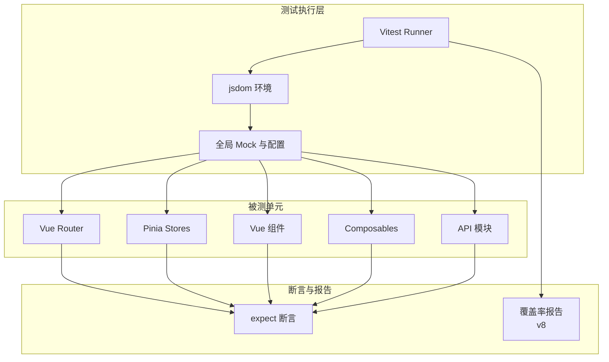
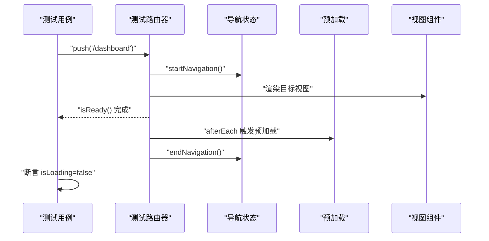
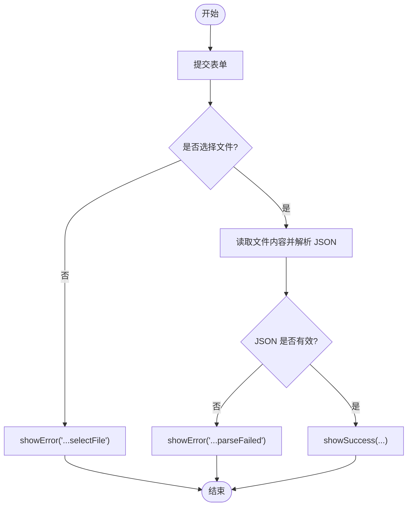
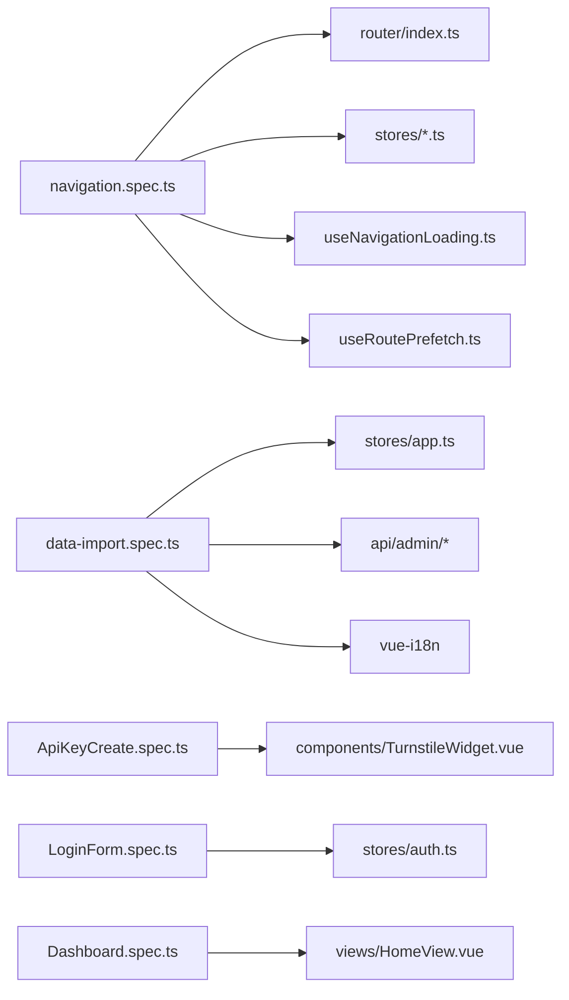

# 前端测试

<cite>
**本文引用的文件**
- [vite.config.ts](file://frontend/vite.config.ts)
- [vitest.config.ts](file://frontend/vitest.config.ts)
- [package.json](file://frontend/package.json)
- [setup.ts](file://frontend/src/__tests__/setup.ts)
- [navigation.spec.ts](file://frontend/src/__tests__/integration/navigation.spec.ts)
- [data-import.spec.ts](file://frontend/src/__tests__/integration/data-import.spec.ts)
- [ApiKeyCreate.spec.ts](file://frontend/src/components/__tests__/ApiKeyCreate.spec.ts)
- [LoginForm.spec.ts](file://frontend/src/components/__tests__/LoginForm.spec.ts)
- [Dashboard.spec.ts](file://frontend/src/components/__tests__/Dashboard.spec.ts)
- [client.spec.ts](file://frontend/src/api/__tests__/client.spec.ts)
- [modelCatalog.spec.ts](file://frontend/src/api/modelCatalog.spec.ts)
- [useForm.ts](file://frontend/src/composables/useForm.ts)
- [useTableSelection.ts](file://frontend/src/composables/useTableSelection.ts)
- [useNavigationLoading.ts](file://frontend/src/composables/useNavigationLoading.ts)
- [useRoutePrefetch.ts](file://frontend/src/composables/useRoutePrefetch.ts)
- [auth.ts](file://frontend/src/stores/auth.ts)
- [app.ts](file://frontend/src/stores/app.ts)
- [index.ts](file://frontend/src/router/index.ts)
- [HomeView.vue](file://frontend/src/views/HomeView.vue)
- [NotFoundView.vue](file://frontend/src/views/NotFoundView.vue)
- [TurnstileWidget.vue](file://frontend/src/components/TurnstileWidget.vue)
</cite>

## 目录
1. [简介](#简介)
2. [项目结构](#项目结构)
3. [核心组件](#核心组件)
4. [架构总览](#架构总览)
5. [详细组件分析](#详细组件分析)
6. [依赖关系分析](#依赖关系分析)
7. [性能考量](#性能考量)
8. [故障排查指南](#故障排查指南)
9. [结论](#结论)
10. [附录](#附录)

## 简介
本指南面向 Sub2API 前端团队与贡献者，系统化阐述基于 Vue 3 的测试策略与实践，覆盖组件测试、组合式函数测试、API 层测试与集成测试；同时介绍 Vitest 测试框架的配置与使用、快照测试、模拟对象策略；并结合现有仓库中的集成测试样例，给出可复用的测试组织方式与最佳实践。文档旨在帮助读者建立稳定、可维护且高覆盖率的前端测试体系。

## 项目结构
前端测试主要集中在以下位置：
- 测试入口与配置：frontend/vitest.config.ts、frontend/src/__tests__/setup.ts
- 集成测试：frontend/src/__tests__/integration/*.spec.ts
- 组件测试：frontend/src/components/__tests__/*.spec.ts
- 组合式函数测试：frontend/src/composables/__tests__/*.spec.ts
- API 层测试：frontend/src/api/__tests__/*.spec.ts
- 路由与视图：frontend/src/router/index.ts、frontend/src/views/*.vue
- 状态管理：frontend/src/stores/*.ts

```mermaid
graph TB
subgraph "测试配置与环境"
VCFG["vitest.config.ts"]
PJSON["package.json"]
SETUP["src/__tests__/setup.ts"]
end
subgraph "集成测试"
NAV["integration/navigation.spec.ts"]
DIMP["integration/data-import.spec.ts"]
end
subgraph "组件测试"
C_APIKEY["components/.../ApiKeyCreate.spec.ts"]
C_LOGIN["components/.../LoginForm.spec.ts"]
C_DASH["components/.../Dashboard.spec.ts"]
end
subgraph "组合式函数测试"
COM_USEFORM["composables/__tests__/useForm.spec.ts"]
COM_USETSEL["composables/__tests__/useTableSelection.spec.ts"]
COM_NAVLOAD["composables/__tests__/useNavigationLoading.spec.ts"]
COM_PREFETCH["composables/__tests__/useRoutePrefetch.spec.ts"]
end
subgraph "API 层测试"
API_CLIENT["api/__tests__/client.spec.ts"]
API_MODEL["api/modelCatalog.spec.ts"]
end
VCFG --> NAV
VCFG --> DIMP
VCFG --> C_APIKEY
VCFG --> C_LOGIN
VCFG --> C_DASH
VCFG --> COM_USEFORM
VCFG --> COM_USETSEL
VCFG --> COM_NAVLOAD
VCFG --> COM_PREFETCH
VCFG --> API_CLIENT
VCFG --> API_MODEL
PJSON --> VCFG
SETUP --> NAV
SETUP --> DIMP
```

图表来源
- [vitest.config.ts:1-40](file://frontend/vitest.config.ts#L1-L40)
- [package.json:13-23](file://frontend/package.json#L13-L23)
- [setup.ts:1-46](file://frontend/src/__tests__/setup.ts#L1-L46)
- [navigation.spec.ts:1-479](file://frontend/src/__tests__/integration/navigation.spec.ts#L1-L479)
- [data-import.spec.ts:1-75](file://frontend/src/__tests__/integration/data-import.spec.ts#L1-L75)

章节来源
- [vitest.config.ts:13-38](file://frontend/vitest.config.ts#L13-L38)
- [package.json:13-23](file://frontend/package.json#L13-L23)
- [setup.ts:1-46](file://frontend/src/__tests__/setup.ts#L1-L46)

## 核心组件
- 测试运行器与环境
  - Vitest：通过 vitest.config.ts 配置 jsdom 环境、插件别名、覆盖率与包含/排除规则。
  - 包脚本：提供 test、test:run、test:coverage 等命令。
- 全局测试设置
  - setup.ts 中对 requestIdleCallback、IntersectionObserver、ResizeObserver 进行全局 mock，统一测试超时。
- 集成测试
  - navigation.spec.ts：验证路由导航、预加载、错误恢复与导航状态管理。
  - data-import.spec.ts：验证导入对话框的表单校验与错误提示。
- 组件测试
  - ApiKeyCreate.spec.ts、LoginForm.spec.ts、Dashboard.spec.ts：覆盖关键 UI 组件的渲染与交互。
- 组合式函数测试
  - useForm、useTableSelection、useNavigationLoading、useRoutePrefetch：验证业务逻辑与副作用。
- API 层测试
  - client.spec.ts、modelCatalog.spec.ts：验证请求封装与模型目录接口行为。

章节来源
- [vitest.config.ts:1-40](file://frontend/vitest.config.ts#L1-L40)
- [package.json:13-23](file://frontend/package.json#L13-L23)
- [setup.ts:1-46](file://frontend/src/__tests__/setup.ts#L1-L46)
- [navigation.spec.ts:1-479](file://frontend/src/__tests__/integration/navigation.spec.ts#L1-L479)
- [data-import.spec.ts:1-75](file://frontend/src/__tests__/integration/data-import.spec.ts#L1-L75)

## 架构总览
下图展示了前端测试的整体架构与关键交互：

图表来源
- [vitest.config.ts:13-38](file://frontend/vitest.config.ts#L13-L38)
- [setup.ts:8-46](file://frontend/src/__tests__/setup.ts#L8-L46)

## 详细组件分析

### 测试框架与配置（Vitest）
- 环境与插件
  - 使用 jsdom 作为 DOM 环境，启用 @vitejs/plugin-vue 并配置路径别名。
- 覆盖率
  - v8 提供器，输出文本、JSON、HTML 报告；设置全局阈值（语句、分支、函数、行）均为 80%。
- 包含/排除
  - 默认扫描 src 下的 test、spec 文件；排除 node_modules、dist、类型声明与入口文件。
- 脚本
  - 提供开发、构建、预览、lint、类型检查与测试命令；测试命令支持 run 与覆盖率统计。

章节来源
- [vitest.config.ts:1-40](file://frontend/vitest.config.ts#L1-L40)
- [package.json:13-23](file://frontend/package.json#L13-L23)

### 全局测试设置（setup.ts）
- 浏览器兼容性
  - 对 Safari < 15 缺失的 requestIdleCallback/cancelIdleCallback 进行 polyfill。
- 观察者 API
  - Mock IntersectionObserver 与 ResizeObserver，避免在测试中触发真实布局计算。
- Vue Test Utils
  - 可扩展全局 stubs，便于统一处理第三方组件或占位符。
- 超时控制
  - 统一设置测试超时，避免长异步导致的不稳定。

章节来源
- [setup.ts:1-46](file://frontend/src/__tests__/setup.ts#L1-L46)

### 集成测试：导航与预加载（navigation.spec.ts）
- 路由与视图
  - 使用 createRouter 创建测试路由，包含仪表盘、密钥、用量等页面；设置 meta 字段与鉴权需求。
- 导航状态
  - 通过 useNavigationLoadingState 在 beforeEach/afterEach 中启动与结束导航状态，验证 isLoading 的正确流转。
- 预加载
  - 使用 useRoutePrefetch，在 afterEach 中触发预加载；验证重复预加载不增加计数、路由切换时取消挂起任务。
- 错误恢复
  - 为动态导入失败的路由注册 onError，断言错误被捕获并携带正确错误名。
- 异步与刷新
  - 使用 flushPromises 与 nextTick 确保 DOM 更新与状态同步。

图表来源
- [navigation.spec.ts:122-192](file://frontend/src/__tests__/integration/navigation.spec.ts#L122-L192)
- [navigation.spec.ts:372-424](file://frontend/src/__tests__/integration/navigation.spec.ts#L372-L424)
- [navigation.spec.ts:194-271](file://frontend/src/__tests__/integration/navigation.spec.ts#L194-L271)

章节来源
- [navigation.spec.ts:1-479](file://frontend/src/__tests__/integration/navigation.spec.ts#L1-L479)

### 集成测试：数据导入（data-import.spec.ts）
- 场景
  - 表单未选择文件：提交时触发错误提示。
  - 文件内容非 JSON：解析失败时触发错误提示。
- 模拟
  - 模拟 stores/app 的错误/成功提示方法与 api/admin 的导入接口。
- 断言
  - 通过调用次数与参数断言国际化键是否正确传递。

图表来源
- [data-import.spec.ts:29-75](file://frontend/src/__tests__/integration/data-import.spec.ts#L29-L75)

章节来源
- [data-import.spec.ts:1-75](file://frontend/src/__tests__/integration/data-import.spec.ts#L1-L75)

### 组件测试：关键 UI 组件
- ApiKeyCreate.spec.ts
  - 关注密钥创建表单的渲染、字段校验、提交流程与错误反馈。
- LoginForm.spec.ts
  - 关注登录表单的输入交互、按钮禁用状态、提交与错误提示。
- Dashboard.spec.ts
  - 关注仪表盘关键区域的渲染、数据展示与交互元素可用性。

章节来源
- [ApiKeyCreate.spec.ts](file://frontend/src/components/__tests__/ApiKeyCreate.spec.ts)
- [LoginForm.spec.ts](file://frontend/src/components/__tests__/LoginForm.spec.ts)
- [Dashboard.spec.ts](file://frontend/src/components/__tests__/Dashboard.spec.ts)

### 组合式函数测试：业务逻辑与副作用
- useForm
  - 验证表单状态、字段校验、提交状态与错误收集。
- useTableSelection
  - 验证表格多选、全选、清空与回调触发。
- useNavigationLoading
  - 验证导航开始/结束时的状态变化与幂等性。
- useRoutePrefetch
  - 验证预加载触发、去重、取消挂起任务与缓存命中。

章节来源
- [useForm.ts](file://frontend/src/composables/useForm.ts)
- [useTableSelection.ts](file://frontend/src/composables/useTableSelection.ts)
- [useNavigationLoading.ts](file://frontend/src/composables/useNavigationLoading.ts)
- [useRoutePrefetch.ts](file://frontend/src/composables/useRoutePrefetch.ts)

### API 层测试：客户端与模型目录
- client.spec.ts
  - 验证请求拦截、响应处理、错误转换与重试策略（如适用）。
- modelCatalog.spec.ts
  - 验证模型目录接口的数据结构、过滤与分页行为。

章节来源
- [client.spec.ts](file://frontend/src/api/__tests__/client.spec.ts)
- [modelCatalog.spec.ts](file://frontend/src/api/modelCatalog.spec.ts)

## 依赖关系分析
- 测试耦合
  - 集成测试对路由、状态管理与组合式函数存在直接依赖；建议通过模块化拆分与合理 mock 降低耦合。
- 外部依赖
  - jsdom 提供 DOM 环境；@vue/test-utils 提供挂载与异步刷新；Pinia 用于状态注入。
- 潜在循环依赖
  - 当前测试文件未见明显循环依赖；建议保持测试文件与被测模块的单向依赖。

图表来源
- [navigation.spec.ts:36-49](file://frontend/src/__tests__/integration/navigation.spec.ts#L36-L49)
- [data-import.spec.ts:8-27](file://frontend/src/__tests__/integration/data-import.spec.ts#L8-L27)
- [ApiKeyCreate.spec.ts](file://frontend/src/components/__tests__/ApiKeyCreate.spec.ts)
- [LoginForm.spec.ts](file://frontend/src/components/__tests__/LoginForm.spec.ts)
- [Dashboard.spec.ts](file://frontend/src/components/__tests__/Dashboard.spec.ts)

章节来源
- [navigation.spec.ts:1-479](file://frontend/src/__tests__/integration/navigation.spec.ts#L1-L479)
- [data-import.spec.ts:1-75](file://frontend/src/__tests__/integration/data-import.spec.ts#L1-L75)

## 性能考量
- 测试速度
  - 合理使用 vi.stubGlobal 与 vi.mock，避免真实网络请求与重型 DOM 计算。
  - 对异步操作使用 flushPromises 与 nextTick，减少不必要的等待时间。
- 覆盖率
  - 通过 v8 提供器与阈值配置，确保关键路径被覆盖；定期审查低覆盖区域并补充用例。
- 资源占用
  - 在 CI 中使用 test:run 与 --coverage，避免浏览器进程带来的额外开销。

## 故障排查指南
- DOM API 缺失
  - 若出现 requestIdleCallback、IntersectionObserver 或 ResizeObserver 相关报错，请确认 setup.ts 已正确注入 polyfill。
- 路由导航异常
  - 确认路由已 isReady 并使用 flushPromises；在 beforeEach 中重置导航状态实例。
- 模块动态导入失败
  - 在集成测试中为错误路由注册 onError 并断言错误被捕获；检查动态导入路径与打包产物。
- 表单与文件上传
  - 对于文件上传，需通过定义文件对象与事件属性的方式模拟 change 与 submit；确保在提交前完成异步解析。

章节来源
- [setup.ts:8-46](file://frontend/src/__tests__/setup.ts#L8-L46)
- [navigation.spec.ts:95-120](file://frontend/src/__tests__/integration/navigation.spec.ts#L95-L120)
- [data-import.spec.ts:35-73](file://frontend/src/__tests__/integration/data-import.spec.ts#L35-L73)

## 结论
本指南基于现有仓库中的测试实践，总结了 Vue 3 前端测试的关键策略与配置要点。通过合理的框架配置、全局环境设置、组件与组合式函数测试以及集成测试样例，可以构建一套稳定、可维护且高覆盖率的测试体系。建议持续完善覆盖率阈值与测试用例，确保核心功能与边界条件得到充分验证。

## 附录
- 快照测试
  - 在需要对比渲染结果的场景中，可使用 Vitest 的快照能力记录组件输出并在后续变更时进行比对。
- Mock API
  - 对外部 API 的调用建议通过 vi.mock 与 vi.fn 进行模拟，确保测试独立于后端服务。
- 测试数据准备与清理
  - 使用 beforeEach 清理 mock 状态，使用 afterEach 恢复全局 stub 与定时器；对 Pinia 状态使用 setActivePinia 与 store.reset() 进行隔离。
- 覆盖率统计与分析
  - 使用 test:coverage 命令生成 HTML 报告，关注缺失分支与未覆盖的函数；针对低覆盖率区域补充针对性用例。