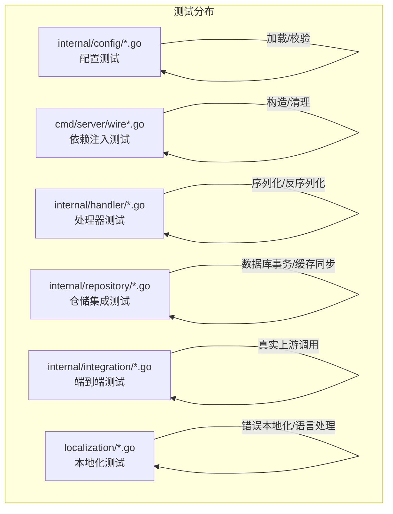
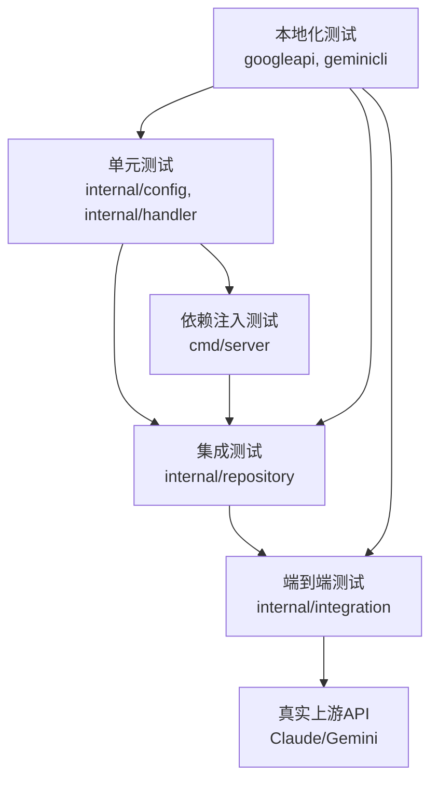
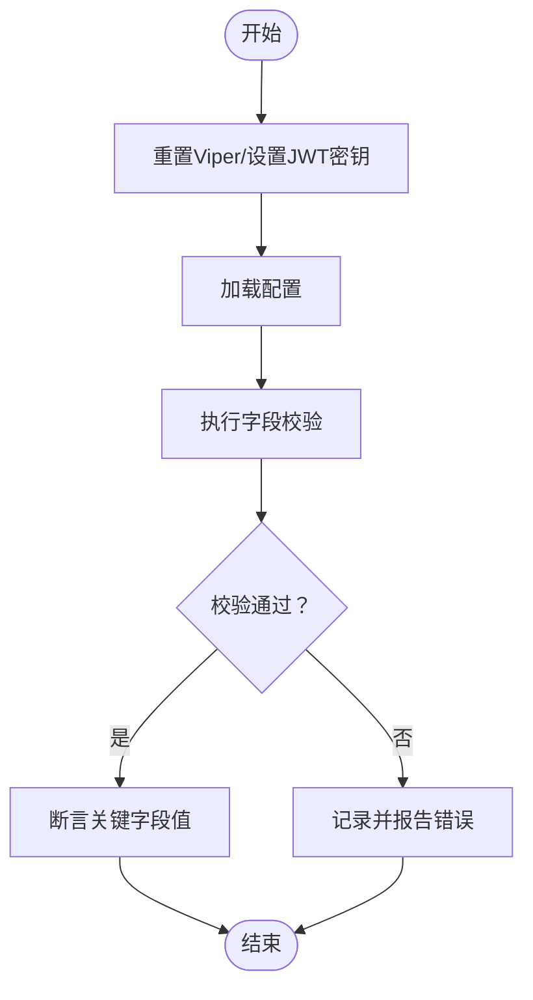
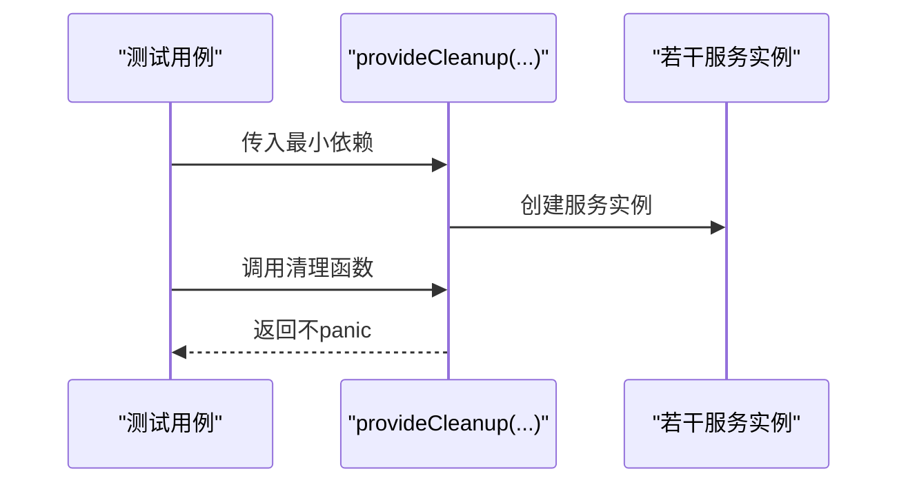
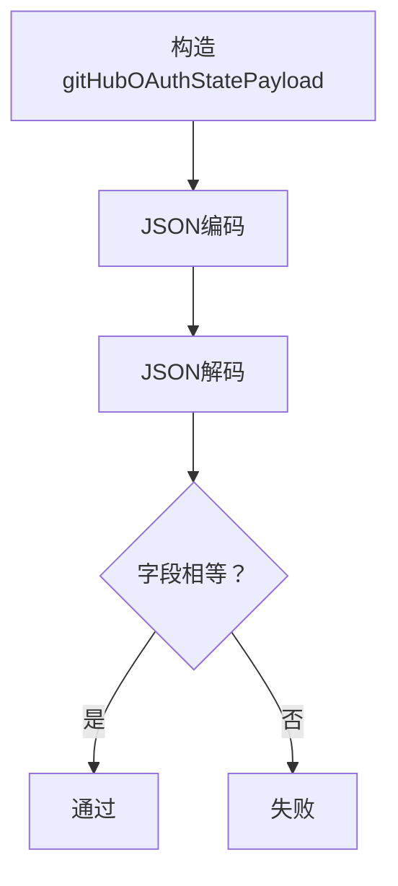
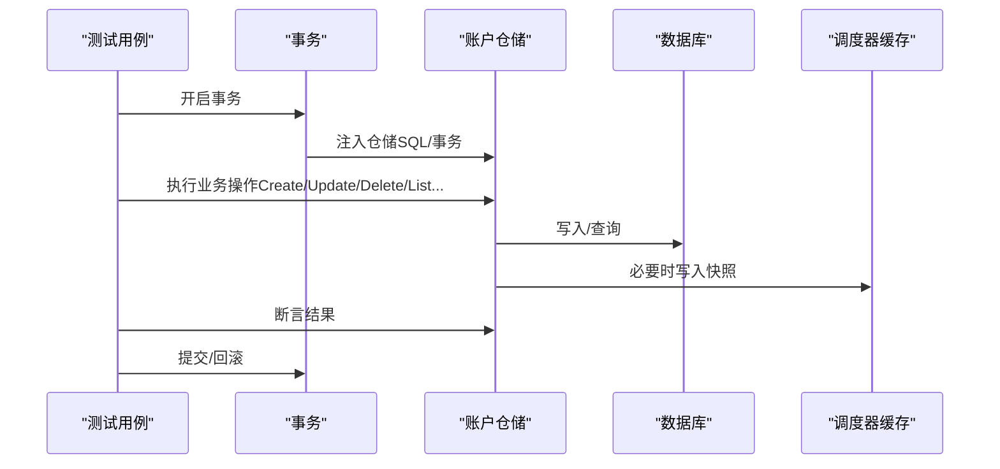
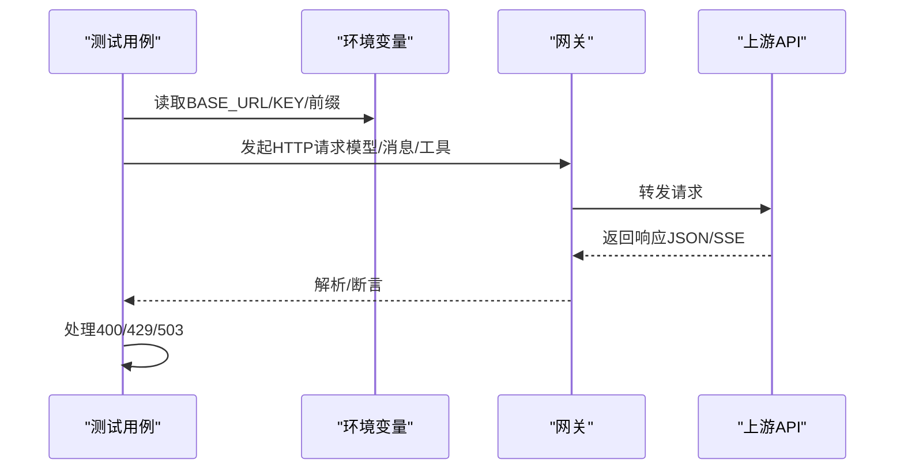
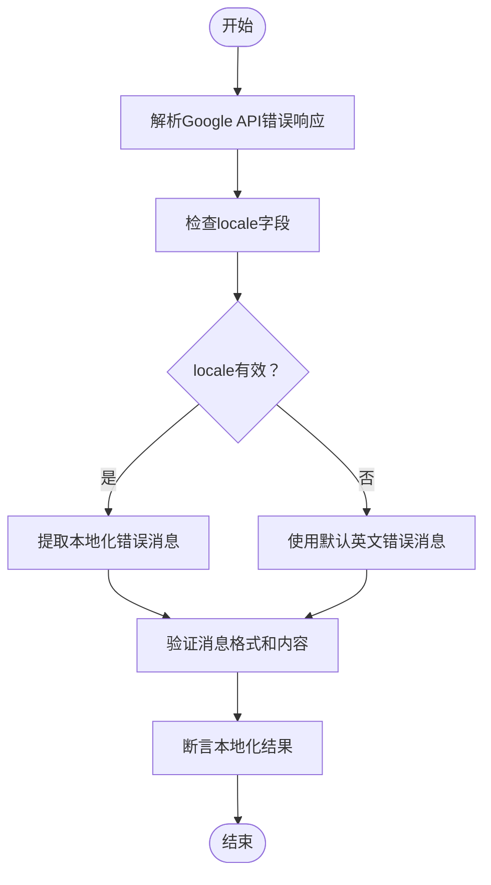
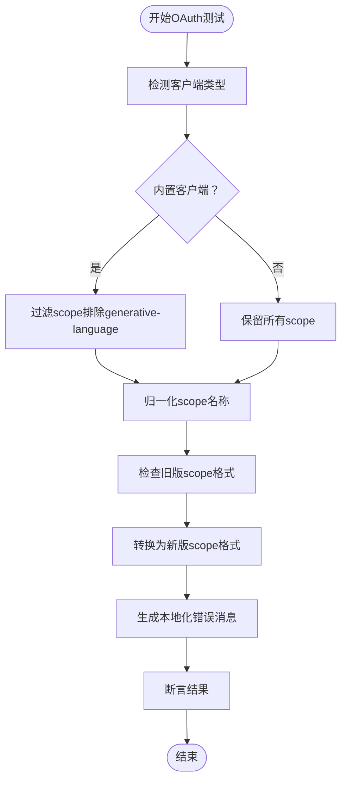
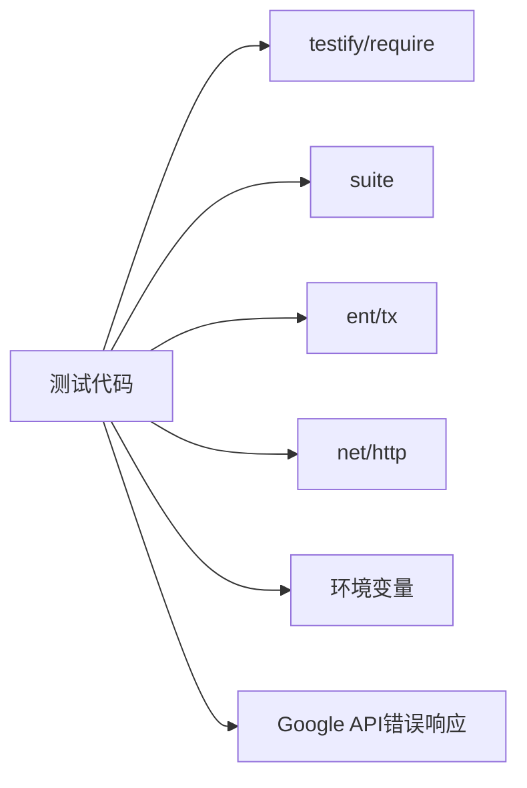

# 后端测试

<cite>
**本文引用的文件**
- [backend/internal/config/config_test.go](file://backend/internal/config/config_test.go)
- [backend/cmd/server/wire_gen_test.go](file://backend/cmd/server/wire_gen_test.go)
- [backend/internal/handler/auth_github_oauth_test.go](file://backend/internal/handler/auth_github_oauth_test.go)
- [backend/internal/repository/account_repo_integration_test.go](file://backend/internal/repository/account_repo_integration_test.go)
- [backend/internal/integration/e2e_gateway_test.go](file://backend/internal/integration/e2e_gateway_test.go)
- [backend/internal/pkg/googleapi/error_test.go](file://backend/internal/pkg/googleapi/error_test.go)
- [backend/internal/pkg/geminicli/oauth_test.go](file://backend/internal/pkg/geminicli/oauth_test.go)
- [backend/go.mod](file://backend/go.mod)
- [backend/go.sum](file://backend/go.sum)
- [backend/Makefile](file://backend/Makefile)
</cite>

## 更新摘要
**所做更改**
- 新增本地化行为测试验证章节，涵盖Google API错误本地化测试
- 更新配置模块测试，增加对本地化相关配置的验证
- 新增Gemini CLI OAuth测试中的本地化行为验证
- 完善测试架构图，体现本地化测试的重要性

## 目录
1. [引言](#引言)
2. [项目结构](#项目结构)
3. [核心组件](#核心组件)
4. [架构总览](#架构总览)
5. [详细组件分析](#详细组件分析)
6. [本地化行为测试验证](#本地化行为测试验证)
7. [依赖分析](#依赖分析)
8. [性能考虑](#性能考虑)
9. [故障排查指南](#故障排查指南)
10. [结论](#结论)
11. [附录](#附录)

## 引言
本指南面向Sub2API后端的测试工作，系统性阐述如何在该代码库中开展Go语言测试，覆盖单元测试、集成测试与端到端测试，并提供性能基准测试、覆盖率统计与测试数据准备的最佳实践。文档以仓库内现有测试文件为依据，结合实际代码结构，给出可操作的流程、图示与建议。

**更新** 本次更新特别关注新增的本地化行为测试验证，确保系统在多语言环境下的正确性和一致性。

## 项目结构
后端测试主要分布在以下模块：
- 配置加载与校验：位于 internal/config，包含大量针对配置加载、校验与环境变量注入的测试。
- 依赖注入与服务提供：位于 cmd/server，包含对wire生成代码的测试，验证服务构建与清理流程。
- 处理器与中间件：位于 internal/handler，包含OAuth状态载荷序列化/反序列化的测试。
- 仓储层与服务层：位于 internal/repository 与 internal/service，包含大量集成测试与基准测试。
- 端到端测试：位于 internal/integration，包含对网关API的真实请求测试。
- 本地化测试：新增对Google API错误本地化和Gemini CLI OAuth本地化行为的验证。

**图表来源**
- [backend/internal/config/config_test.go:1-800](file://backend/internal/config/config_test.go#L1-L800)
- [backend/cmd/server/wire_gen_test.go:1-85](file://backend/cmd/server/wire_gen_test.go#L1-L85)
- [backend/internal/handler/auth_github_oauth_test.go:1-23](file://backend/internal/handler/auth_github_oauth_test.go#L1-L23)
- [backend/internal/repository/account_repo_integration_test.go:1-800](file://backend/internal/repository/account_repo_integration_test.go#L1-L800)
- [backend/internal/integration/e2e_gateway_test.go:1-844](file://backend/internal/integration/e2e_gateway_test.go#L1-L844)
- [backend/internal/pkg/googleapi/error_test.go:1-50](file://backend/internal/pkg/googleapi/error_test.go#L1-L50)
- [backend/internal/pkg/geminicli/oauth_test.go:1-800](file://backend/internal/pkg/geminicli/oauth_test.go#L1-L800)

**章节来源**
- [backend/internal/config/config_test.go:1-800](file://backend/internal/config/config_test.go#L1-L800)
- [backend/cmd/server/wire_gen_test.go:1-85](file://backend/cmd/server/wire_gen_test.go#L1-L85)
- [backend/internal/handler/auth_github_oauth_test.go:1-23](file://backend/internal/handler/auth_github_oauth_test.go#L1-L23)
- [backend/internal/repository/account_repo_integration_test.go:1-800](file://backend/internal/repository/account_repo_integration_test.go#L1-L800)
- [backend/internal/integration/e2e_gateway_test.go:1-844](file://backend/internal/integration/e2e_gateway_test.go#L1-L844)
- [backend/internal/pkg/googleapi/error_test.go:1-50](file://backend/internal/pkg/googleapi/error_test.go#L1-L50)
- [backend/internal/pkg/geminicli/oauth_test.go:1-800](file://backend/internal/pkg/geminicli/oauth_test.go#L1-L800)

## 核心组件
- 配置模块测试：覆盖默认配置、环境变量注入、配置校验（如URL合法性、时间窗口、并发参数等），确保配置加载与校验逻辑稳定可靠。
- 依赖注入测试：验证wire生成的服务构建与清理流程，确保最小依赖下的清理不panic。
- 处理器测试：验证OAuth状态载荷的JSON编解码一致性，保证跨组件的数据交换正确性。
- 仓储集成测试：基于ent事务与数据库进行CRUD、过滤、分页、调度快照同步、速率限制与错误状态管理等测试。
- 端到端测试：通过真实上游API密钥对网关端点进行调用，验证模型列表、消息生成、流式SSE响应与复杂工具schema处理等。
- **本地化测试**：验证Google API错误信息的本地化处理和Gemini CLI OAuth的本地化行为，确保多语言环境下的一致性。

**章节来源**
- [backend/internal/config/config_test.go:1-800](file://backend/internal/config/config_test.go#L1-L800)
- [backend/cmd/server/wire_gen_test.go:1-85](file://backend/cmd/server/wire_gen_test.go#L1-L85)
- [backend/internal/handler/auth_github_oauth_test.go:1-23](file://backend/internal/handler/auth_github_oauth_test.go#L1-L23)
- [backend/internal/repository/account_repo_integration_test.go:1-800](file://backend/internal/repository/account_repo_integration_test.go#L1-L800)
- [backend/internal/integration/e2e_gateway_test.go:1-844](file://backend/internal/integration/e2e_gateway_test.go#L1-L844)
- [backend/internal/pkg/googleapi/error_test.go:1-50](file://backend/internal/pkg/googleapi/error_test.go#L1-L50)
- [backend/internal/pkg/geminicli/oauth_test.go:1-800](file://backend/internal/pkg/geminicli/oauth_test.go#L1-L800)

## 架构总览
测试架构围绕"单元测试（小范围）—集成测试（含数据库/缓存）—端到端测试（真实上游）"三层展开，配合依赖注入与mock对象，确保各层职责清晰、边界明确。新增的本地化测试确保系统在多语言环境下的正确性。

**图表来源**
- [backend/internal/config/config_test.go:1-800](file://backend/internal/config/config_test.go#L1-L800)
- [backend/internal/handler/auth_github_oauth_test.go:1-23](file://backend/internal/handler/auth_github_oauth_test.go#L1-L23)
- [backend/cmd/server/wire_gen_test.go:1-85](file://backend/cmd/server/wire_gen_test.go#L1-L85)
- [backend/internal/repository/account_repo_integration_test.go:1-800](file://backend/internal/repository/account_repo_integration_test.go#L1-L800)
- [backend/internal/integration/e2e_gateway_test.go:1-844](file://backend/internal/integration/e2e_gateway_test.go#L1-L844)
- [backend/internal/pkg/googleapi/error_test.go:1-50](file://backend/internal/pkg/googleapi/error_test.go#L1-L50)
- [backend/internal/pkg/geminicli/oauth_test.go:1-800](file://backend/internal/pkg/geminicli/oauth_test.go#L1-L800)

## 详细组件分析

### 配置模块测试（internal/config）
- 测试目标
  - 默认配置加载与字段校验（如调度、WebSocket、幂等性、安全开关、服务器模式、JWT过期、数据库SSL、仪表盘缓存、聚合、用量清理等）。
  - 环境变量注入与兼容性（如OpenAI WS粘性TTL兼容、URL白名单、前端重定向URL校验、CSP策略等）。
  - 配置有效性校验（负值、区间不一致、路径与查询非法等）。
- 关键测试点
  - 加载默认配置并通过断言验证关键字段。
  - 设置环境变量后加载配置，断言对应字段被覆盖。
  - 对无效输入触发校验错误，确保错误信息包含具体字段。
- 最佳实践
  - 使用临时环境变量与Viper重置，避免跨用例污染。
  - 将"默认值"与"从环境变量覆盖"的测试拆分为独立用例，便于定位问题。

**图表来源**
- [backend/internal/config/config_test.go:11-30](file://backend/internal/config/config_test.go#L11-L30)
- [backend/internal/config/config_test.go:51-77](file://backend/internal/config/config_test.go#L51-L77)

**章节来源**
- [backend/internal/config/config_test.go:11-30](file://backend/internal/config/config_test.go#L11-L30)
- [backend/internal/config/config_test.go:51-77](file://backend/internal/config/config_test.go#L51-L77)
- [backend/internal/config/config_test.go:161-174](file://backend/internal/config/config_test.go#L161-L174)
- [backend/internal/config/config_test.go:176-224](file://backend/internal/config/config_test.go#L176-L224)
- [backend/internal/config/config_test.go:226-289](file://backend/internal/config/config_test.go#L226-L289)
- [backend/internal/config/config_test.go:291-557](file://backend/internal/config/config_test.go#L291-L557)
- [backend/internal/config/config_test.go:559-698](file://backend/internal/config/config_test.go#L559-L698)
- [backend/internal/config/config_test.go:700-795](file://backend/internal/config/config_test.go#L700-L795)

### 依赖注入测试（cmd/server）
- 测试目标
  - 验证服务构建信息传递与清理函数在最小依赖下不会panic。
- 关键测试点
  - 构造多个服务实例（OAuth、Token刷新、定价、邮件队列、账单缓存、幂等清理、调度快照、运维日志、用量清理、订阅到期、账户到期等）。
  - 调用清理函数，断言不panic。
- 最佳实践
  - 在测试中显式传入nil或最小可用依赖，确保清理逻辑健壮。
  - 将清理流程单独抽离为测试，避免与主流程耦合。

**图表来源**
- [backend/cmd/server/wire_gen_test.go:23-84](file://backend/cmd/server/wire_gen_test.go#L23-L84)

**章节来源**
- [backend/cmd/server/wire_gen_test.go:13-21](file://backend/cmd/server/wire_gen_test.go#L13-L21)
- [backend/cmd/server/wire_gen_test.go:23-84](file://backend/cmd/server/wire_gen_test.go#L23-L84)

### 处理器测试（internal/handler）
- 测试目标
  - 验证OAuth状态载荷的JSON编解码往返一致性。
- 关键测试点
  - 结构体编码为JSON，再解码回结构体，断言字段相等。
- 最佳实践
  - 使用标准库encoding/json进行编解码，配合require.NoErrors确保无异常。
  - 对关键字段逐一断言，避免遗漏。

**图表来源**
- [backend/internal/handler/auth_github_oauth_test.go:10-22](file://backend/internal/handler/auth_github_oauth_test.go#L10-L22)

**章节来源**
- [backend/internal/handler/auth_github_oauth_test.go:10-22](file://backend/internal/handler/auth_github_oauth_test.go#L10-L22)

### 仓储集成测试（internal/repository）
- 测试目标
  - 基于ent事务与数据库，覆盖账户的增删改查、分页与过滤、组绑定、调度可选集合、速率限制、错误状态、会话窗口、额外字段合并与调度器快照同步等。
- 关键测试点
  - 使用suite.Suite组织测试，每个用例在独立事务中执行，避免相互影响。
  - 针对不同过滤条件（平台、类型、状态、搜索、分组、隐私模式）进行组合验证。
  - 验证更新后对调度器快照的同步行为（禁用、凭据变更、恢复）。
  - 验证速率限制、错误状态、临时不可调度字段的设置与清除。
- 最佳实践
  - 使用事务隔离每个用例，确保数据干净。
  - 对关键路径（如更新后快照同步）增加断言，确保一致性。
  - 对边界场景（空Extra、空更新、中性字段）进行覆盖。

**图表来源**
- [backend/internal/repository/account_repo_integration_test.go:79-84](file://backend/internal/repository/account_repo_integration_test.go#L79-L84)
- [backend/internal/repository/account_repo_integration_test.go:92-112](file://backend/internal/repository/account_repo_integration_test.go#L92-L112)
- [backend/internal/repository/account_repo_integration_test.go:131-143](file://backend/internal/repository/account_repo_integration_test.go#L131-L143)
- [backend/internal/repository/account_repo_integration_test.go:145-172](file://backend/internal/repository/account_repo_integration_test.go#L145-L172)
- [backend/internal/repository/account_repo_integration_test.go:174-195](file://backend/internal/repository/account_repo_integration_test.go#L174-L195)

**章节来源**
- [backend/internal/repository/account_repo_integration_test.go:79-88](file://backend/internal/repository/account_repo_integration_test.go#L79-L88)
- [backend/internal/repository/account_repo_integration_test.go:92-112](file://backend/internal/repository/account_repo_integration_test.go#L92-L112)
- [backend/internal/repository/account_repo_integration_test.go:119-143](file://backend/internal/repository/account_repo_integration_test.go#L119-L143)
- [backend/internal/repository/account_repo_integration_test.go:145-172](file://backend/internal/repository/account_repo_integration_test.go#L145-L172)
- [backend/internal/repository/account_repo_integration_test.go:174-195](file://backend/internal/repository/account_repo_integration_test.go#L174-L195)
- [backend/internal/repository/account_repo_integration_test.go:199-347](file://backend/internal/repository/account_repo_integration_test.go#L199-L347)
- [backend/internal/repository/account_repo_integration_test.go:351-383](file://backend/internal/repository/account_repo_integration_test.go#L351-L383)
- [backend/internal/repository/account_repo_integration_test.go:387-414](file://backend/internal/repository/account_repo_integration_test.go#L387-L414)
- [backend/internal/repository/account_repo_integration_test.go:418-450](file://backend/internal/repository/account_repo_integration_test.go#L418-L450)
- [backend/internal/repository/account_repo_integration_test.go:454-498](file://backend/internal/repository/account_repo_integration_test.go#L454-L498)
- [backend/internal/repository/account_repo_integration_test.go:500-535](file://backend/internal/repository/account_repo_integration_test.go#L500-L535)
- [backend/internal/repository/account_repo_integration_test.go:537-557](file://backend/internal/repository/account_repo_integration_test.go#L537-L557)
- [backend/internal/repository/account_repo_integration_test.go:561-599](file://backend/internal/repository/account_repo_integration_test.go#L561-L599)
- [backend/internal/repository/account_repo_integration_test.go:601-631](file://backend/internal/repository/account_repo_integration_test.go#L601-L631)
- [backend/internal/repository/account_repo_integration_test.go:635-644](file://backend/internal/repository/account_repo_integration_test.go#L635-L644)
- [backend/internal/repository/account_repo_integration_test.go:648-677](file://backend/internal/repository/account_repo_integration_test.go#L648-L677)
- [backend/internal/repository/account_repo_integration_test.go:681-693](file://backend/internal/repository/account_repo_integration_test.go#L681-L693)
- [backend/internal/repository/account_repo_integration_test.go:697-722](file://backend/internal/repository/account_repo_integration_test.go#L697-L722)
- [backend/internal/repository/account_repo_integration_test.go:724-792](file://backend/internal/repository/account_repo_integration_test.go#L724-L792)
- [backend/internal/repository/account_repo_integration_test.go:794-844](file://backend/internal/repository/account_repo_integration_test.go#L794-L844)

### 端到端测试（internal/integration）
- 测试目标
  - 通过真实上游API密钥调用网关端点，验证模型列表、消息生成、流式SSE响应与复杂工具schema处理。
- 关键测试点
  - 支持混合模式与Antigravity模式（通过环境变量切换端点前缀）。
  - Claude与Gemini模型列表获取、消息生成（非流式/流式）、复杂工具schema清理、thinking模式与签名处理、无签名thinking块处理等。
  - 对400、429、503等状态码进行差异化处理（400视为失败；429/503视作跳过）。
- 最佳实践
  - 使用环境变量注入密钥，避免提交凭证。
  - 对流式响应使用SSE扫描器统计事件数量，确保响应完整性。
  - 对关键场景（复杂schema、签名缺失、模型映射）分别编写用例，覆盖边界。

**图表来源**
- [backend/internal/integration/e2e_gateway_test.go:36-41](file://backend/internal/integration/e2e_gateway_test.go#L36-L41)
- [backend/internal/integration/e2e_gateway_test.go:108-141](file://backend/internal/integration/e2e_gateway_test.go#L108-L141)
- [backend/internal/integration/e2e_gateway_test.go:144-173](file://backend/internal/integration/e2e_gateway_test.go#L144-L173)
- [backend/internal/integration/e2e_gateway_test.go:176-250](file://backend/internal/integration/e2e_gateway_test.go#L176-L250)
- [backend/internal/integration/e2e_gateway_test.go:252-338](file://backend/internal/integration/e2e_gateway_test.go#L252-L338)
- [backend/internal/integration/e2e_gateway_test.go:340-556](file://backend/internal/integration/e2e_gateway_test.go#L340-L556)
- [backend/internal/integration/e2e_gateway_test.go:558-684](file://backend/internal/integration/e2e_gateway_test.go#L558-L684)
- [backend/internal/integration/e2e_gateway_test.go:686-716](file://backend/internal/integration/e2e_gateway_test.go#L686-L716)
- [backend/internal/integration/e2e_gateway_test.go:718-800](file://backend/internal/integration/e2e_gateway_test.go#L718-L800)

**章节来源**
- [backend/internal/integration/e2e_gateway_test.go:70-87](file://backend/internal/integration/e2e_gateway_test.go#L70-L87)
- [backend/internal/integration/e2e_gateway_test.go:89-105](file://backend/internal/integration/e2e_gateway_test.go#L89-L105)
- [backend/internal/integration/e2e_gateway_test.go:108-141](file://backend/internal/integration/e2e_gateway_test.go#L108-L141)
- [backend/internal/integration/e2e_gateway_test.go:144-173](file://backend/internal/integration/e2e_gateway_test.go#L144-L173)
- [backend/internal/integration/e2e_gateway_test.go:176-250](file://backend/internal/integration/e2e_gateway_test.go#L176-L250)
- [backend/internal/integration/e2e_gateway_test.go:252-338](file://backend/internal/integration/e2e_gateway_test.go#L252-L338)
- [backend/internal/integration/e2e_gateway_test.go:340-556](file://backend/internal/integration/e2e_gateway_test.go#L340-L556)
- [backend/internal/integration/e2e_gateway_test.go:558-684](file://backend/internal/integration/e2e_gateway_test.go#L558-L684)
- [backend/internal/integration/e2e_gateway_test.go:686-716](file://backend/internal/integration/e2e_gateway_test.go#L686-L716)
- [backend/internal/integration/e2e_gateway_test.go:718-800](file://backend/internal/integration/e2e_gateway_test.go#L718-L800)

## 本地化行为测试验证

### Google API错误本地化测试（internal/pkg/googleapi）
- 测试目标
  - 验证Google API错误响应中的locale字段处理，确保错误信息能够根据用户语言偏好正确本地化。
- 关键测试点
  - 检查错误响应中locale字段的存在性和正确性。
  - 验证错误消息在不同语言环境下的本地化输出。
  - 确保本地化错误信息的格式和内容符合预期。
- 最佳实践
  - 使用真实的Google API错误响应格式进行测试。
  - 覆盖多种语言环境（zh-CN、en-US等）的错误处理。
  - 验证错误信息的完整性和准确性。

**图表来源**
- [backend/internal/pkg/googleapi/error_test.go:28-28](file://backend/internal/pkg/googleapi/error_test.go#L28-L28)

**章节来源**
- [backend/internal/pkg/googleapi/error_test.go:1-50](file://backend/internal/pkg/googleapi/error_test.go#L1-L50)

### Gemini CLI OAuth本地化行为测试（internal/pkg/geminicli）
- 测试目标
  - 验证Gemini CLI OAuth流程中的本地化行为，包括scope处理、错误消息本地化和客户端类型判断。
- 关键测试点
  - scope归一化处理（如generative-language到generative-language.retriever的转换）。
  - 内置客户端与自定义客户端的scope过滤差异。
  - 本地化错误消息的生成和处理。
- 最佳实践
  - 测试不同客户端类型的scope处理逻辑。
  - 验证scope归一化过程的正确性。
  - 确保本地化错误消息的准确性和完整性。

**图表来源**
- [backend/internal/pkg/geminicli/oauth_test.go:604-623](file://backend/internal/pkg/geminicli/oauth_test.go#L604-L623)
- [backend/internal/pkg/geminicli/oauth_test.go:713-714](file://backend/internal/pkg/geminicli/oauth_test.go#L713-L714)
- [backend/internal/pkg/geminicli/oauth_test.go:753-760](file://backend/internal/pkg/geminicli/oauth_test.go#L753-L760)

**章节来源**
- [backend/internal/pkg/geminicli/oauth_test.go:300-302](file://backend/internal/pkg/geminicli/oauth_test.go#L300-L302)
- [backend/internal/pkg/geminicli/oauth_test.go:468-478](file://backend/internal/pkg/geminicli/oauth_test.go#L468-L478)
- [backend/internal/pkg/geminicli/oauth_test.go:520-530](file://backend/internal/pkg/geminicli/oauth_test.go#L520-L530)
- [backend/internal/pkg/geminicli/oauth_test.go:579-623](file://backend/internal/pkg/geminicli/oauth_test.go#L579-L623)
- [backend/internal/pkg/geminicli/oauth_test.go:708-714](file://backend/internal/pkg/geminicli/oauth_test.go#L708-L714)
- [backend/internal/pkg/geminicli/oauth_test.go:753-760](file://backend/internal/pkg/geminicli/oauth_test.go#L753-L760)

## 依赖分析
- 测试依赖
  - testify/require用于断言，确保测试简洁与可读。
  - suite用于集成测试套件，统一SetupTest/TeardownTest生命周期。
  - ent/tx用于数据库事务隔离，保证测试数据干净。
  - 标准库net/http用于端到端HTTP请求。
- 外部依赖
  - 上游API密钥通过环境变量注入，避免硬编码。
  - **新增** 本地化测试依赖Google API的真实错误响应格式。
- 潜在风险
  - 端到端测试依赖外部网络与密钥，需注意限流与稳定性。
  - 集成测试依赖数据库/缓存，需确保测试环境一致。
  - **新增** 本地化测试依赖上游API的locale字段支持。

**图表来源**
- [backend/internal/config/config_test.go:3-10](file://backend/internal/config/config_test.go#L3-L10)
- [backend/internal/repository/account_repo_integration_test.go:14-14](file://backend/internal/repository/account_repo_integration_test.go#L14-L14)
- [backend/internal/integration/e2e_gateway_test.go:5-16](file://backend/internal/integration/e2e_gateway_test.go#L5-L16)
- [backend/internal/pkg/googleapi/error_test.go:28-28](file://backend/internal/pkg/googleapi/error_test.go#L28-L28)

**章节来源**
- [backend/internal/config/config_test.go:3-10](file://backend/internal/config/config_test.go#L3-L10)
- [backend/internal/repository/account_repo_integration_test.go:14-14](file://backend/internal/repository/account_repo_integration_test.go#L14-L14)
- [backend/internal/integration/e2e_gateway_test.go:5-16](file://backend/internal/integration/e2e_gateway_test.go#L5-L16)
- [backend/internal/pkg/googleapi/error_test.go:28-28](file://backend/internal/pkg/googleapi/error_test.go#L28-L28)

## 性能考虑
- 基准测试（Benchmarks）
  - 仓储层与HTTP上游存在基准测试文件，可用于评估性能瓶颈与回归。
  - 建议在关键路径（如并发缓存、HTTP上游请求）编写Benchmarks，定期运行以监控性能。
- 并发与限流
  - 端到端测试中对请求间隔进行控制，避免上游限流导致误判。
- 资源释放
  - 依赖注入测试验证清理函数不panic，确保长时间运行的稳定性。
- **新增** 本地化测试性能
  - 错误消息本地化处理应保持低开销，避免影响API响应时间。
  - scope归一化和过滤操作应在合理时间内完成。

**章节来源**
- [backend/internal/repository/concurrency_cache_benchmark_test.go](file://backend/internal/repository/concurrency_cache_benchmark_test.go)
- [backend/internal/repository/http_upstream_benchmark_test.go](file://backend/internal/repository/http_upstream_benchmark_test.go)
- [backend/internal/integration/e2e_gateway_test.go:24-24](file://backend/internal/integration/e2e_gateway_test.go#L24-L24)
- [backend/cmd/server/wire_gen_test.go:81-83](file://backend/cmd/server/wire_gen_test.go#L81-L83)

## 故障排查指南
- 配置类问题
  - 若配置校验失败，检查对应字段的默认值与环境变量覆盖是否符合预期。
  - 对URL合法性、时间窗口、并发参数等进行逐项核对。
- 集成测试失败
  - 确认事务隔离是否生效，避免用例间互相污染。
  - 检查调度器快照同步逻辑，确保更新后缓存与数据库一致。
- 端到端测试失败
  - 400错误通常表示上游schema或参数不合法，检查payload构造与映射规则。
  - 429/503视为临时不可用，可跳过或延时重试。
  - 确保环境变量已正确注入密钥，且未提交至仓库。
- **新增** 本地化测试失败
  - 检查Google API错误响应中的locale字段是否存在且格式正确。
  - 验证scope归一化过程是否按预期执行。
  - 确认内置客户端与自定义客户端的scope处理逻辑正确。
  - 验证本地化错误消息的内容和格式符合预期。

**章节来源**
- [backend/internal/config/config_test.go:304-352](file://backend/internal/config/config_test.go#L304-L352)
- [backend/internal/config/config_test.go:399-416](file://backend/internal/config/config_test.go#L399-L416)
- [backend/internal/config/config_test.go:521-557](file://backend/internal/config/config_test.go#L521-L557)
- [backend/internal/integration/e2e_gateway_test.go:526-541](file://backend/internal/integration/e2e_gateway_test.go#L526-L541)
- [backend/internal/integration/e2e_gateway_test.go:790-798](file://backend/internal/integration/e2e_gateway_test.go#L790-L798)
- [backend/internal/pkg/googleapi/error_test.go:1-50](file://backend/internal/pkg/googleapi/error_test.go#L1-L50)
- [backend/internal/pkg/geminicli/oauth_test.go:604-623](file://backend/internal/pkg/geminicli/oauth_test.go#L604-L623)

## 结论
本指南基于仓库现有测试文件，总结了Sub2API后端的测试策略与最佳实践。通过配置测试、依赖注入测试、处理器测试、仓储集成测试、端到端测试与新增的本地化测试的协同，能够有效保障系统的正确性、稳定性与可维护性。新增的本地化测试确保系统在多语言环境下的正确性，特别关注Google API错误本地化和Gemini CLI OAuth的本地化行为。建议持续完善覆盖率、引入更多基准测试，并在CI中自动化执行各类测试。

## 附录
- 测试运行与覆盖率
  - 使用标准测试命令运行单元/集成/E2E测试，并结合覆盖率工具生成报告。
  - Makefile中提供了常用测试命令，可作为CI/本地执行入口。
- 测试数据准备
  - 集成测试使用ent事务隔离，确保每条用例的数据独立。
  - 端到端测试通过环境变量注入密钥，避免硬编码凭证。
  - **新增** 本地化测试使用真实的Google API错误响应格式，确保测试的真实性。

**章节来源**
- [backend/Makefile](file://backend/Makefile)
- [backend/go.mod](file://backend/go.mod)
- [backend/go.sum](file://backend/go.sum)
- [backend/internal/pkg/googleapi/error_test.go:1-50](file://backend/internal/pkg/googleapi/error_test.go#L1-L50)
- [backend/internal/pkg/geminicli/oauth_test.go:1-800](file://backend/internal/pkg/geminicli/oauth_test.go#L1-L800)