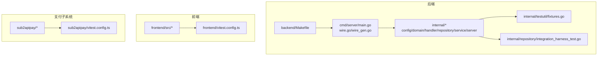
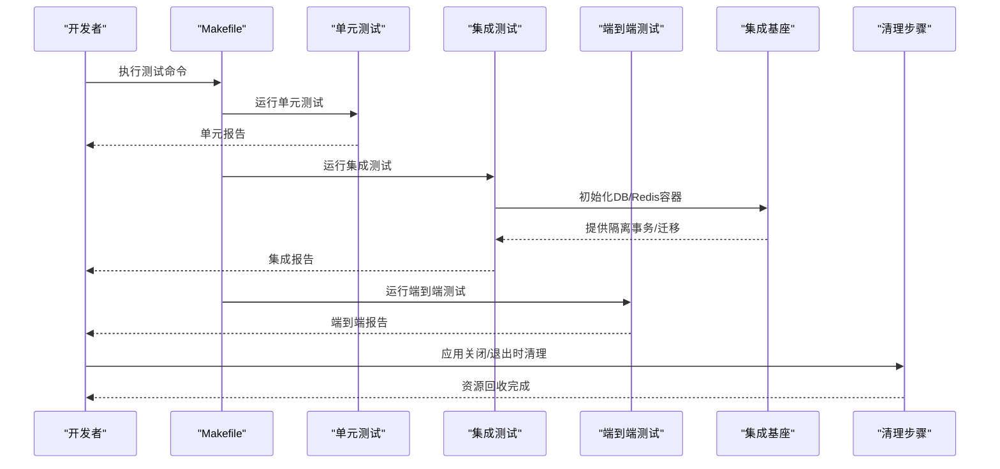
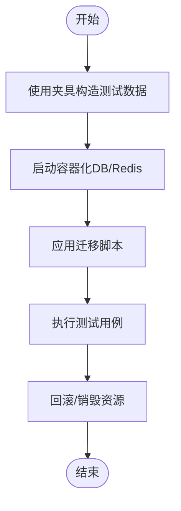
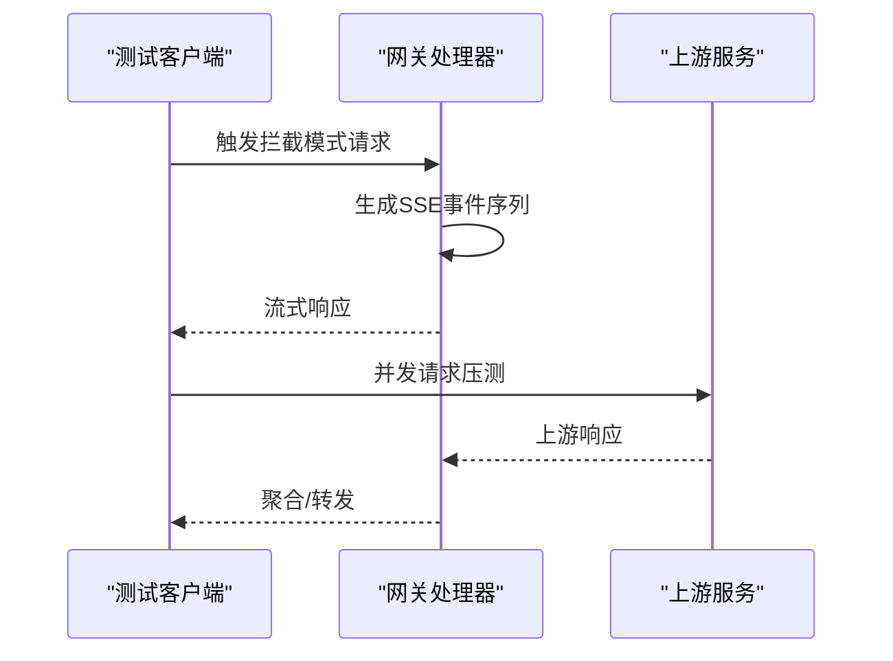
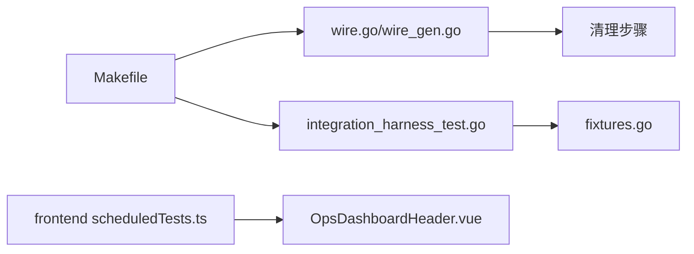

# 测试最佳实践

<cite>
**本文引用的文件**
- [backend/Makefile](file://backend/Makefile)
- [backend/cmd/server/wire.go](file://backend/cmd/server/wire.go)
- [backend/cmd/server/wire_gen.go](file://backend/cmd/server/wire_gen.go)
- [backend/internal/testutil/fixtures.go](file://backend/internal/testutil/fixtures.go)
- [backend/internal/repository/integration_harness_test.go](file://backend/internal/repository/integration_harness_test.go)
- [backend/internal/service/scheduled_test_port.go](file://backend/internal/service/scheduled_test_port.go)
- [backend/internal/service/account_test_service.go](file://backend/internal/service/account_test_service.go)
- [backend/internal/handler/gateway_handler.go](file://backend/internal/handler/gateway_handler.go)
- [frontend/src/api/admin/scheduledTests.ts](file://frontend/src/api/admin/scheduledTests.ts)
- [frontend/src/views/admin/ops/components/OpsDashboardHeader.vue](file://frontend/src/views/admin/ops/components/OpsDashboardHeader.vue)
- [sub2apipay/vitest.config.ts](file://sub2apipay/vitest.config.ts)
</cite>

## 目录
1. [引言](#引言)
2. [项目结构](#项目结构)
3. [核心组件](#核心组件)
4. [架构总览](#架构总览)
5. [详细组件分析](#详细组件分析)
6. [依赖关系分析](#依赖关系分析)
7. [性能考量](#性能考量)
8. [故障排查指南](#故障排查指南)
9. [结论](#结论)
10. [附录](#附录)

## 引言
本指南面向Sub2API团队，系统化总结后端服务、前端应用与支付子系统的测试最佳实践，覆盖测试金字塔、测试隔离、可维护性、测试数据管理、测试编写规范、性能与压力测试、调试技巧、测试文档与团队协作等方面。目标是帮助团队在持续交付中保持高质量与高效率。

## 项目结构
- 后端服务采用模块化分层：cmd、internal（config、domain、handler、repository、service、server、setup、testutil、util、web）、migrations、resources等。
- 前端采用Vite+Vue3+Vitest，测试配置集中在vitest.config.ts。
- 支付子系统sub2apipay同样基于Vitest进行单元测试。
- 测试执行通过Makefile统一入口，支持单元、集成、端到端等标签化运行。

图示来源
- [backend/Makefile:1-27](file://backend/Makefile#L1-L27)
- [backend/cmd/server/wire.go:214-296](file://backend/cmd/server/wire.go#L214-L296)
- [backend/cmd/server/wire_gen.go:427-504](file://backend/cmd/server/wire_gen.go#L427-L504)
- [backend/internal/testutil/fixtures.go:1-78](file://backend/internal/testutil/fixtures.go#L1-L78)
- [backend/internal/repository/integration_harness_test.go:63-408](file://backend/internal/repository/integration_harness_test.go#L63-L408)
- [sub2apipay/vitest.config.ts:1-15](file://sub2apipay/vitest.config.ts#L1-L15)

章节来源
- [backend/Makefile:1-27](file://backend/Makefile#L1-L27)

## 核心组件
- 测试执行与分类
  - Makefile提供统一入口，支持按标签运行单元、集成与端到端测试，便于CI流水线与本地开发。
- 测试数据与夹具
  - testutil/fixtures.go提供常用领域对象的构造器，便于快速构建测试数据。
- 集成测试基座
  - integration_harness_test.go通过Docker容器启动PostgreSQL与Redis，统一迁移与事务隔离，确保测试隔离与一致性。
- 清理与资源回收
  - wire.go/wire_gen.go在服务停止时并行/串行执行清理步骤，避免资源泄露影响后续测试。
- 计划化测试与结果模型
  - scheduled_test_port.go定义计划与结果的数据模型与仓储接口，支撑自动化巡检能力。
- 拦截与Mock响应
  - gateway_handler.go提供拦截模式下的SSE事件模拟，便于端到端与压力测试场景验证。

章节来源
- [backend/Makefile:13-24](file://backend/Makefile#L13-L24)
- [backend/internal/testutil/fixtures.go:11-78](file://backend/internal/testutil/fixtures.go#L11-L78)
- [backend/internal/repository/integration_harness_test.go:63-408](file://backend/internal/repository/integration_harness_test.go#L63-L408)
- [backend/cmd/server/wire.go:214-296](file://backend/cmd/server/wire.go#L214-L296)
- [backend/cmd/server/wire_gen.go:427-504](file://backend/cmd/server/wire_gen.go#L427-L504)
- [backend/internal/service/scheduled_test_port.go:8-52](file://backend/internal/service/scheduled_test_port.go#L8-L52)
- [backend/internal/handler/gateway_handler.go:1584-1650](file://backend/internal/handler/gateway_handler.go#L1584-L1650)

## 架构总览
下图展示测试执行、数据准备与清理的整体流程，体现测试金字塔与隔离策略：

图示来源
- [backend/Makefile:13-24](file://backend/Makefile#L13-L24)
- [backend/internal/repository/integration_harness_test.go:63-408](file://backend/internal/repository/integration_harness_test.go#L63-L408)
- [backend/cmd/server/wire.go:214-296](file://backend/cmd/server/wire.go#L214-L296)
- [backend/cmd/server/wire_gen.go:427-504](file://backend/cmd/server/wire_gen.go#L427-L504)

## 详细组件分析

### 测试金字塔与隔离策略
- 金字塔层次
  - 单元测试：优先、快速、稳定，覆盖核心业务逻辑与边界条件。
  - 集成测试：验证模块间交互、数据库与缓存行为，确保契约正确。
  - 端到端测试：覆盖真实用户路径，验证网关、拦截与响应链路。
- 隔离与一致性
  - 使用独立事务与容器化基础设施，避免跨测试污染。
  - 通过fixtures统一构造测试数据，减少重复与偏差。

章节来源
- [backend/Makefile:17-24](file://backend/Makefile#L17-L24)
- [backend/internal/repository/integration_harness_test.go:63-408](file://backend/internal/repository/integration_harness_test.go#L63-L408)
- [backend/internal/testutil/fixtures.go:11-78](file://backend/internal/testutil/fixtures.go#L11-L78)

### 测试数据管理最佳实践
- 夹具组织
  - 在testutil/fixtures.go集中定义常用构造器，支持可选参数覆盖默认值，提升复用性与可读性。
- 数据生成与清理
  - 集成测试基座在每次测试前初始化数据库与缓存，并在测试结束后回滚或销毁，确保状态干净。
- 环境一致性
  - 通过容器镜像版本固定与迁移脚本，确保不同环境下的Schema与初始数据一致。

图示来源
- [backend/internal/testutil/fixtures.go:11-78](file://backend/internal/testutil/fixtures.go#L11-L78)
- [backend/internal/repository/integration_harness_test.go:63-408](file://backend/internal/repository/integration_harness_test.go#L63-L408)

章节来源
- [backend/internal/testutil/fixtures.go:11-78](file://backend/internal/testutil/fixtures.go#L11-L78)
- [backend/internal/repository/integration_harness_test.go:63-408](file://backend/internal/repository/integration_harness_test.go#L63-L408)

### 测试代码编写规范
- 命名约定
  - 单元测试文件以_test.go结尾；集成测试使用integration前缀或目录区分。
- 断言策略
  - 使用Require/Assert组合，必要时使用自定义辅助方法（如RequireNoError）统一断言风格。
- 错误处理
  - 集成测试中对容器启动、连接与迁移失败进行显式日志记录与退出，避免静默失败。
- 可维护性
  - 将通用断言封装为辅助方法，减少重复代码；对复杂流程拆分为小步验证。

章节来源
- [backend/internal/repository/integration_harness_test.go:368-408](file://backend/internal/repository/integration_harness_test.go#L368-L408)

### 性能测试与压力测试
- 负载与并发
  - 利用拦截与Mock响应生成稳定的SSE事件序列，便于压测上游服务稳定性与下游消费能力。
- 延迟与指标
  - 通过计划化测试记录延迟与错误信息，结合前端仪表盘阈值告警（如内存、TTFT）进行回归监控。
- 内存泄漏检测
  - 结合前端仪表盘的内存使用百分比阈值，配合后端清理步骤，定位异常增长。

图示来源
- [backend/internal/handler/gateway_handler.go:1584-1650](file://backend/internal/handler/gateway_handler.go#L1584-L1650)
- [backend/internal/service/scheduled_test_port.go:24-34](file://backend/internal/service/scheduled_test_port.go#L24-L34)
- [frontend/src/views/admin/ops/components/OpsDashboardHeader.vue:527-553](file://frontend/src/views/admin/ops/components/OpsDashboardHeader.vue#L527-L553)

章节来源
- [backend/internal/handler/gateway_handler.go:1584-1650](file://backend/internal/handler/gateway_handler.go#L1584-L1650)
- [backend/internal/service/scheduled_test_port.go:24-34](file://backend/internal/service/scheduled_test_port.go#L24-L34)
- [frontend/src/views/admin/ops/components/OpsDashboardHeader.vue:527-553](file://frontend/src/views/admin/ops/components/OpsDashboardHeader.vue#L527-L553)

### 测试调试技巧
- 工具与日志
  - 集成测试中对容器启动、连接与迁移失败进行日志输出，便于快速定位问题。
- 问题定位
  - 使用计划化测试结果中的错误信息与延迟指标，结合前端仪表盘阈值告警，快速锁定异常范围。
- 资源回收
  - 关闭服务时并行/串行执行清理步骤，避免残留资源影响后续测试。

章节来源
- [backend/internal/repository/integration_harness_test.go:72-102](file://backend/internal/repository/integration_harness_test.go#L72-L102)
- [backend/cmd/server/wire.go:257-296](file://backend/cmd/server/wire.go#L257-L296)
- [backend/cmd/server/wire_gen.go:466-504](file://backend/cmd/server/wire_gen.go#L466-L504)

### 测试文档与团队协作
- 文档建议
  - 测试策略文档：明确测试金字塔比例、标签化测试策略与覆盖率目标。
  - 测试用例文档：记录关键场景、前置条件、期望结果与失败恢复步骤。
- 团队协作
  - 代码审查关注点：测试覆盖率、断言完整性、隔离性与可维护性；对清理与资源回收进行重点检查。
  - 覆盖率要求：建议在CI中强制覆盖率阈值，结合计划化测试与端到端测试保障关键路径。

## 依赖关系分析
- 组件耦合
  - 测试执行通过Makefile统一入口，降低调用复杂度。
  - wire.go/wire_gen.go集中管理服务生命周期与清理步骤，降低资源泄露风险。
- 外部依赖
  - 集成测试依赖Docker容器与数据库迁移脚本，需确保版本与网络配置一致。

图示来源
- [backend/Makefile:13-24](file://backend/Makefile#L13-L24)
- [backend/cmd/server/wire.go:214-296](file://backend/cmd/server/wire.go#L214-L296)
- [backend/cmd/server/wire_gen.go:427-504](file://backend/cmd/server/wire_gen.go#L427-L504)
- [backend/internal/repository/integration_harness_test.go:63-408](file://backend/internal/repository/integration_harness_test.go#L63-L408)
- [backend/internal/testutil/fixtures.go:11-78](file://backend/internal/testutil/fixtures.go#L11-L78)
- [frontend/src/api/admin/scheduledTests.ts:53-85](file://frontend/src/api/admin/scheduledTests.ts#L53-L85)
- [frontend/src/views/admin/ops/components/OpsDashboardHeader.vue:527-553](file://frontend/src/views/admin/ops/components/OpsDashboardHeader.vue#L527-L553)

章节来源
- [backend/Makefile:13-24](file://backend/Makefile#L13-L24)
- [backend/cmd/server/wire.go:214-296](file://backend/cmd/server/wire.go#L214-L296)
- [backend/cmd/server/wire_gen.go:427-504](file://backend/cmd/server/wire_gen.go#L427-L504)
- [backend/internal/repository/integration_harness_test.go:63-408](file://backend/internal/repository/integration_harness_test.go#L63-L408)
- [backend/internal/testutil/fixtures.go:11-78](file://backend/internal/testutil/fixtures.go#L11-L78)
- [frontend/src/api/admin/scheduledTests.ts:53-85](file://frontend/src/api/admin/scheduledTests.ts#L53-L85)
- [frontend/src/views/admin/ops/components/OpsDashboardHeader.vue:527-553](file://frontend/src/views/admin/ops/components/OpsDashboardHeader.vue#L527-L553)

## 性能考量
- 延迟与吞吐
  - 通过计划化测试记录延迟与错误信息，结合前端仪表盘阈值告警，形成回归监控闭环。
- 资源使用
  - 前端仪表盘对内存使用百分比进行分级告警，有助于发现潜在内存泄漏或资源占用异常。
- 压测建议
  - 利用拦截模式生成稳定SSE事件，结合并发请求评估系统上限与稳定性。

章节来源
- [backend/internal/service/scheduled_test_port.go:24-34](file://backend/internal/service/scheduled_test_port.go#L24-L34)
- [frontend/src/views/admin/ops/components/OpsDashboardHeader.vue:527-553](file://frontend/src/views/admin/ops/components/OpsDashboardHeader.vue#L527-L553)

## 故障排查指南
- 容器与连接
  - 若容器启动失败或连接超时，查看集成基座的日志输出，确认镜像版本与等待策略。
- 迁移与Schema
  - 若迁移失败，检查迁移脚本与数据库权限，确保在测试前完成迁移。
- 清理与资源
  - 若出现资源泄露，检查wire.go/wire_gen.go中的清理步骤是否被调用，确保并行/串行清理逻辑正常。

章节来源
- [backend/internal/repository/integration_harness_test.go:72-102](file://backend/internal/repository/integration_harness_test.go#L72-L102)
- [backend/cmd/server/wire.go:257-296](file://backend/cmd/server/wire.go#L257-L296)
- [backend/cmd/server/wire_gen.go:466-504](file://backend/cmd/server/wire_gen.go#L466-L504)

## 结论
通过测试金字塔、严格的测试隔离与数据管理、规范化的测试编写、完善的性能与压力测试方法、系统化的调试与清理机制，以及文档化与团队协作规范，Sub2API能够在快速迭代的同时保持高质量与高可靠性。建议在CI中强制覆盖率与清理检查，并持续优化拦截与Mock响应以支撑更高效的压测与回归验证。

## 附录
- 前端测试配置参考
  - Vitest全局配置与别名设置，便于在前端项目中统一测试体验。

章节来源
- [sub2apipay/vitest.config.ts:1-15](file://sub2apipay/vitest.config.ts#L1-L15)