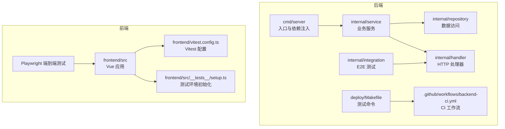
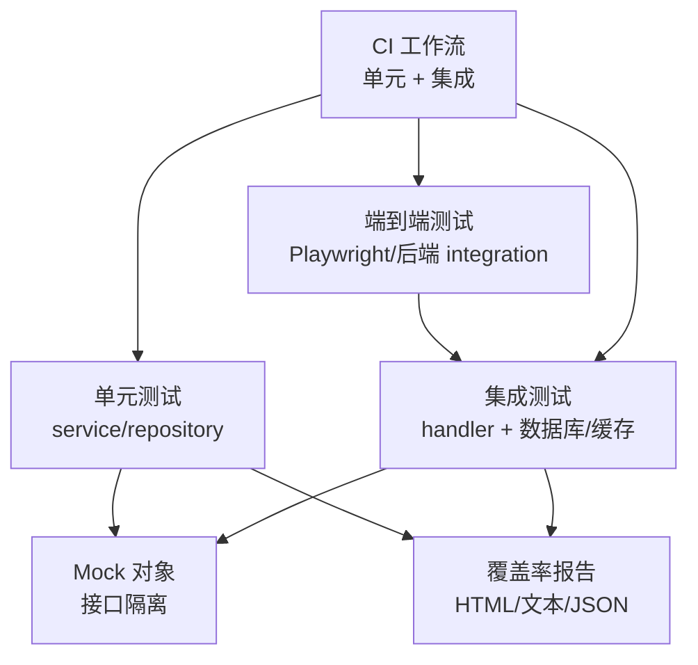
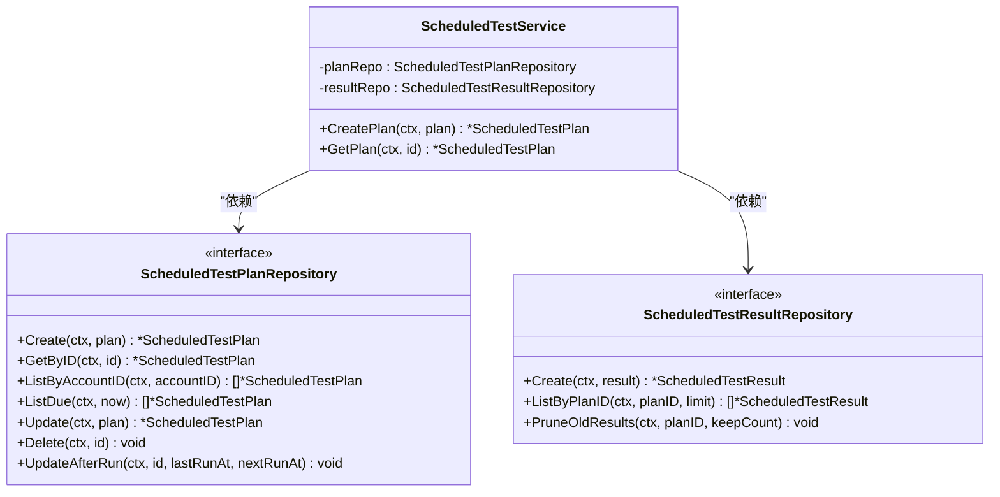
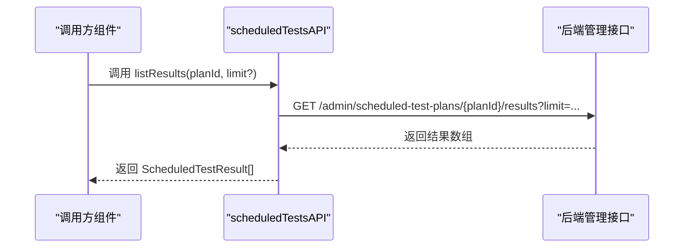
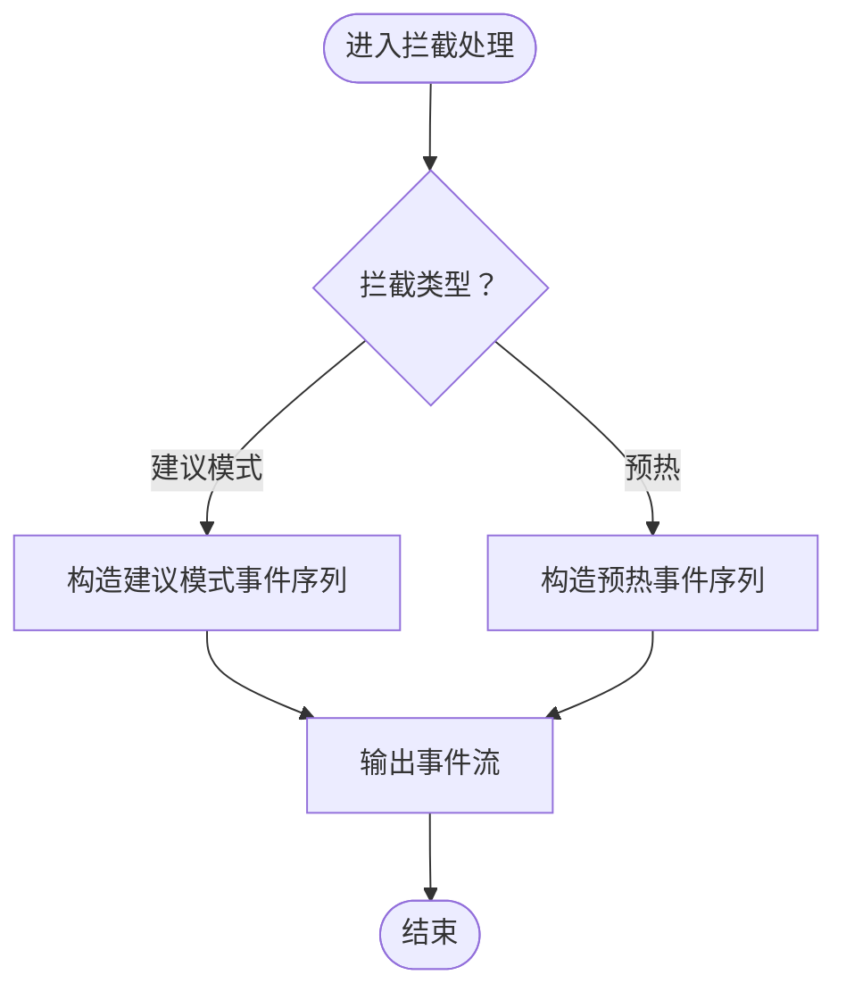
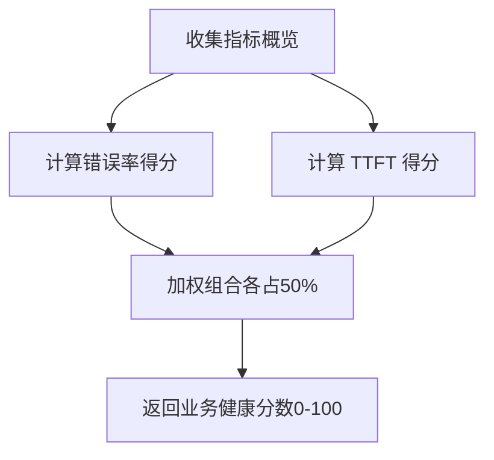
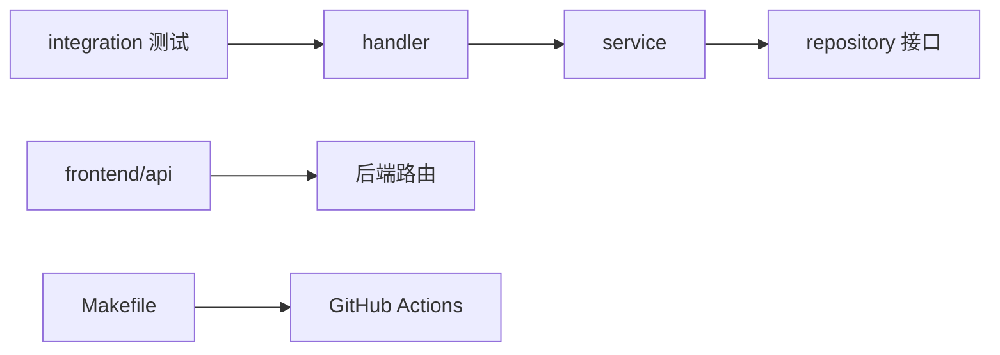

# 测试策略与实施

<cite>
**本文引用的文件**
- [backend 内部服务：计划型测试服务](file://backend/internal/service/scheduled_test_service.go)
- [backend 内部服务：计划型测试端口定义](file://backend/internal/service/scheduled_test_port.go)
- [frontend 计划型测试 API 客户端](file://frontend/src/api/admin/scheduledTests.ts)
- [前端 Vitest 配置](file://frontend/vitest.config.ts)
- [前端测试环境初始化](file://frontend/src/__tests__/setup.ts)
- [后端 Makefile（测试命令）](file://deploy/Makefile)
- [后端 GitHub Actions 工作流](file://.github/workflows/backend-ci.yml)
- [后端网关处理器（拦截逻辑示例）](file://backend/internal/handler/gateway_handler.go)
- [后端账户测试服务（SSE 解析）](file://backend/internal/service/account_test_service.go)
- [后端 ops 健康评分计算](file://backend/internal/service/ops_health_score.go)
- [后端 ops 仪表盘聚合仓库](file://backend/internal/repository/ops_repo_dashboard.go)
- [前端视图：运维仪表盘头部组件](file://frontend/src/views/admin/ops/components/OpsDashboardHeader.vue)
- [sub2apipay 子项目 Vitest 配置](file://sub2apipay/vitest.config.ts)
</cite>

## 目录
1. [引言](#引言)
2. [项目结构](#项目结构)
3. [核心组件](#核心组件)
4. [架构总览](#架构总览)
5. [详细组件分析](#详细组件分析)
6. [依赖关系分析](#依赖关系分析)
7. [性能考量](#性能考量)
8. [故障排查指南](#故障排查指南)
9. [结论](#结论)
10. [附录](#附录)

## 引言
本指南面向 Sub2API 项目的测试策略与实施，系统性阐述测试金字塔（单元测试、集成测试、端到端测试）的分层目标与落地方法，覆盖 Go 后端与 Vue 前端的测试技术栈、Mock 使用、覆盖率要求、性能基准测试、测试数据准备与清理、以及在 GitHub Actions 中的自动化配置与报告生成。同时提供调试技巧与常见问题的解决方案，帮助团队建立稳定高效的测试体系。

## 项目结构
- 后端采用模块化分层：cmd、internal（config、domain、handler、integration、middleware、model、pkg、repository、server、service、web），测试主要集中在 service、repository、handler、integration 层。
- 前端基于 Vite + Vue 3 + Vitest + Playwright，测试配置集中于 vitest.config.ts 与 src/__tests__/setup.ts。
- 持续集成通过 GitHub Actions 在后端执行单元与集成测试，并可扩展端到端测试与覆盖率报告。

**图表来源**
- [后端 Makefile（测试命令）:18-33](file://deploy/Makefile#L18-L33)
- [后端 GitHub Actions 工作流:11-28](file://.github/workflows/backend-ci.yml#L11-L28)
- [前端 Vitest 配置:1-39](file://frontend/vitest.config.ts#L1-L39)
- [前端测试环境初始化:1-45](file://frontend/src/__tests__/setup.ts#L1-L45)

**章节来源**
- [后端 Makefile（测试命令）:1-41](file://deploy/Makefile#L1-L41)
- [后端 GitHub Actions 工作流:1-47](file://.github/workflows/backend-ci.yml#L1-L47)
- [前端 Vitest 配置:1-39](file://frontend/vitest.config.ts#L1-L39)
- [前端测试环境初始化:1-45](file://frontend/src/__tests__/setup.ts#L1-L45)

## 核心组件
- 计划型测试服务：负责计划的创建、校验、调度与结果记录，包含 Cron 表达式解析与下次运行时间计算。
- 计划型测试端口定义：定义领域模型与仓储接口，确保服务层与数据访问层解耦。
- 前端计划型测试 API 客户端：封装对后端管理接口的调用，便于组件测试与端到端测试复用。
- 后端网关处理器：提供拦截模式（建议模式、预热）的模拟响应，用于测试链路与错误回退。
- 运维健康评分与仪表盘聚合：提供关键指标（错误率、TTFT）的计算与展示，支撑测试与监控闭环。

**章节来源**
- [backend 内部服务：计划型测试服务:1-48](file://backend/internal/service/scheduled_test_service.go#L1-L48)
- [backend 内部服务：计划型测试端口定义:1-52](file://backend/internal/service/scheduled_test_port.go#L1-L52)
- [frontend 计划型测试 API 客户端:53-85](file://frontend/src/api/admin/scheduledTests.ts#L53-L85)
- [后端网关处理器（拦截逻辑示例）:1584-1616](file://backend/internal/handler/gateway_handler.go#L1584-L1616)
- [后端 ops 健康评分计算:34-67](file://backend/internal/service/ops_health_score.go#L34-L67)
- [后端 ops 仪表盘聚合仓库:522-568](file://backend/internal/repository/ops_repo_dashboard.go#L522-L568)

## 架构总览
测试金字塔在本项目中的体现：
- 单元测试：针对 service、repository 的纯函数与小对象，使用 Mock 与最小依赖，追求高覆盖率与快速反馈。
- 集成测试：验证 handler 与仓储交互、数据库迁移与缓存一致性，关注真实外部依赖（数据库、Redis、上游服务）。
- 端到端测试：通过 Playwright 或后端 integration 包验证完整用户路径，如网关转发、拦截与错误回退。

**图表来源**
- [后端 Makefile（测试命令）:18-33](file://deploy/Makefile#L18-L33)
- [后端 GitHub Actions 工作流:11-28](file://.github/workflows/backend-ci.yml#L11-L28)
- [前端 Vitest 配置:18-37](file://frontend/vitest.config.ts#L18-L37)

## 详细组件分析

### 计划型测试服务与仓储（后端）
该组件是测试金字塔中“单元测试”的重点对象，职责清晰、边界明确，适合通过接口隔离进行 Mock 并进行参数化测试。

**图表来源**
- [backend 内部服务：计划型测试服务:14-28](file://backend/internal/service/scheduled_test_service.go#L14-L28)
- [backend 内部服务：计划型测试端口定义:36-52](file://backend/internal/service/scheduled_test_port.go#L36-L52)

**章节来源**
- [backend 内部服务：计划型测试服务:1-48](file://backend/internal/service/scheduled_test_service.go#L1-L48)
- [backend 内部服务：计划型测试端口定义:1-52](file://backend/internal/service/scheduled_test_port.go#L1-L52)

### 前端计划型测试 API 客户端
该客户端封装了对后端管理接口的调用，便于在组件测试与端到端测试中统一使用，减少重复代码与依赖外部服务。

**图表来源**
- [frontend 计划型测试 API 客户端:67-75](file://frontend/src/api/admin/scheduledTests.ts#L67-L75)

**章节来源**
- [frontend 计划型测试 API 客户端:53-85](file://frontend/src/api/admin/scheduledTests.ts#L53-L85)

### 后端网关处理器拦截逻辑（用于测试）
网关处理器提供了拦截模式（建议模式、预热）的固定响应结构，便于在单元与集成测试中验证错误回退、流式事件与降级行为。

**图表来源**
- [后端网关处理器（拦截逻辑示例）:1584-1616](file://backend/internal/handler/gateway_handler.go#L1584-L1616)

**章节来源**
- [后端网关处理器（拦截逻辑示例）:1584-1616](file://backend/internal/handler/gateway_handler.go#L1584-L1616)

### 运维健康评分与仪表盘指标（支撑测试与监控）
- 健康评分：结合错误率与 TTFT（P99）进行加权计算，用于评估业务健康度。
- 仪表盘聚合：对时延、TTFT 等指标进行加权汇总，支持 P50/P90/P99/Avg/Max 统计。

**图表来源**
- [后端 ops 健康评分计算:34-67](file://backend/internal/service/ops_health_score.go#L34-L67)
- [后端 ops 仪表盘聚合仓库:522-568](file://backend/internal/repository/ops_repo_dashboard.go#L522-L568)

**章节来源**
- [后端 ops 健康评分计算:34-67](file://backend/internal/service/ops_health_score.go#L34-L67)
- [后端 ops 仪表盘聚合仓库:522-568](file://backend/internal/repository/ops_repo_dashboard.go#L522-L568)

## 依赖关系分析
- 服务层依赖仓储接口，便于在单元测试中注入 Mock 实现。
- Handler 依赖服务层，集成测试中可替换为真实仓储或内存仓储。
- 前端 API 客户端与后端路由解耦，便于组件测试与端到端测试复用。
- CI 工作流通过 Makefile 统一触发测试与覆盖率生成。

**图表来源**
- [后端 Makefile（测试命令）:18-33](file://deploy/Makefile#L18-L33)
- [后端 GitHub Actions 工作流:11-28](file://.github/workflows/backend-ci.yml#L11-L28)

**章节来源**
- [后端 Makefile（测试命令）:1-41](file://deploy/Makefile#L1-L41)
- [后端 GitHub Actions 工作流:1-47](file://.github/workflows/backend-ci.yml#L1-L47)

## 性能考量
- 单元测试：优先使用 Mock 与最小化依赖，避免外部 I/O；对热点函数（如健康评分、SSE 解析）进行参数化测试。
- 集成测试：启用 race 检测与并行度控制，合理拆分测试集，缩短反馈周期。
- 前端测试：Vitest 默认环境为 jsdom，覆盖率阈值建议不低于 80%（语句、分支、函数、行），避免过度 stub 导致覆盖率失真。
- 性能基准：对关键路径（如请求池、缓存命中）进行基准测试，识别回归点。

[本节为通用指导，无需列出具体文件来源]

## 故障排查指南
- 单元测试失败
  - 检查 Mock 注入是否正确，接口契约是否匹配。
  - 确认参数化用例覆盖边界条件（空输入、异常路径）。
- 集成测试失败
  - 关注数据库迁移与索引变更导致的查询差异。
  - 校验 Redis 缓存 TTL 与并发场景下的竞态。
- 端到端测试不稳定
  - 使用稳定的等待策略与重试机制，避免硬编码 sleep。
  - 在 CI 中开启可视化日志与截图/视频录制。
- 前端测试报错
  - 检查 setup.ts 中的 polyfill 与全局 stub 是否影响被测组件。
  - 确认 Vitest 环境与别名配置正确。
- 覆盖率异常
  - 排除 d.ts、测试文件与入口脚本，确保阈值设置合理。
  - 使用 HTML 报告定位未覆盖路径，补充用例。

**章节来源**
- [前端测试环境初始化:1-45](file://frontend/src/__tests__/setup.ts#L1-L45)
- [前端 Vitest 配置:18-37](file://frontend/vitest.config.ts#L18-L37)

## 结论
通过分层测试策略与完善的 CI 自动化，Sub2API 能够在快速迭代的同时保持质量稳定。建议持续优化 Mock 设计、完善参数化用例、加强端到端场景覆盖，并将覆盖率与性能指标纳入质量门禁，形成闭环的质量保障体系。

[本节为总结性内容，无需列出具体文件来源]

## 附录

### 测试金字塔与目标
- 单元测试：快速反馈、高覆盖率、易调试；目标：服务与仓储的核心逻辑。
- 集成测试：验证跨模块协作、外部依赖一致性；目标：Handler + 仓储 + 数据库/缓存。
- 端到端测试：覆盖真实用户路径与复杂场景；目标：网关转发、拦截与错误回退、用户操作流。

[本节为概念性内容，无需列出具体文件来源]

### Go 后端测试方法与最佳实践
- 单元测试
  - 使用接口隔离与 Mock，注入最小依赖。
  - 参数化测试覆盖边界与异常路径。
- 集成测试
  - 使用标签区分单元/集成/E2E，CI 中并行执行。
  - 启用 race 检测与并行度控制。
- 覆盖率
  - 通过 Makefile 生成覆盖率报告，HTML 与文本双格式输出。
- 性能基准
  - 对关键路径进行基准测试，识别回归点。

**章节来源**
- [后端 Makefile（测试命令）:18-33](file://deploy/Makefile#L18-L33)
- [后端 GitHub Actions 工作流:11-28](file://.github/workflows/backend-ci.yml#L11-L28)

### Vue 前端测试策略
- 组件测试
  - 使用 jsdom 环境与 Vitest，全局初始化 polyfill 与 stub。
  - 覆盖率阈值：语句、分支、函数、行均不低于 80%。
- 集成测试
  - 通过 API 客户端与路由集成，验证页面与状态管理联动。
- Playwright 端到端测试
  - 使用真实浏览器环境，覆盖关键用户路径与交互流程。

**章节来源**
- [前端 Vitest 配置:1-39](file://frontend/vitest.config.ts#L1-L39)
- [前端测试环境初始化:1-45](file://frontend/src/__tests__/setup.ts#L1-L45)
- [sub2apipay 子项目 Vitest 配置:1-15](file://sub2apipay/vitest.config.ts#L1-L15)

### 测试数据准备与清理
- 测试数据库
  - 使用独立数据库实例或容器化数据库，保证隔离性。
  - 在测试前导入最小化 fixture，测试后执行清理或回滚事务。
- Fixture 管理
  - 将常用数据封装为工厂函数，支持增量与快照。
- 清理策略
  - 单测：每个用例结束后清理；集成测：事务回滚或删除测试数据。
  - E2E 测试：使用临时命名空间或独立租户，批量清理。

[本节为通用指导，无需列出具体文件来源]

### 持续集成中的测试自动化
- 工作流
  - 后端：执行单元测试与集成测试，必要时生成覆盖率报告。
  - 前端：执行组件测试与端到端测试（可按需启用）。
- 报告
  - 使用 HTML 报告与文本摘要，便于 PR 与工件归档。
- 缓存与并行
  - 合理利用依赖缓存与并行度，缩短流水线时间。

**章节来源**
- [后端 GitHub Actions 工作流:1-47](file://.github/workflows/backend-ci.yml#L1-L47)

### 测试调试技巧
- 后端
  - 使用 -race 与 -count=1 排查竞态与随机失败。
  - 通过日志与断点定位 Handler 与仓储交互问题。
- 前端
  - 在 setup.ts 中添加必要的 polyfill，避免环境差异。
  - 使用 Vitest 的全局配置与别名，确保测试路径一致。
- 网关与拦截
  - 利用拦截逻辑的固定事件结构，快速验证错误回退与流式事件。

**章节来源**
- [后端网关处理器（拦截逻辑示例）:1584-1616](file://backend/internal/handler/gateway_handler.go#L1584-L1616)
- [前端测试环境初始化:1-45](file://frontend/src/__tests__/setup.ts#L1-L45)