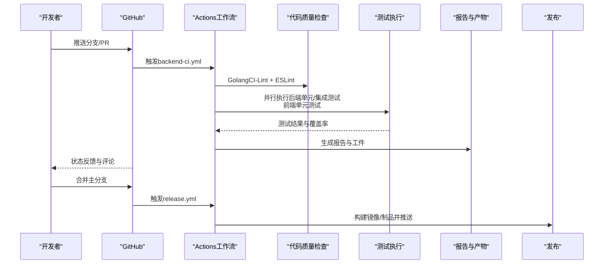
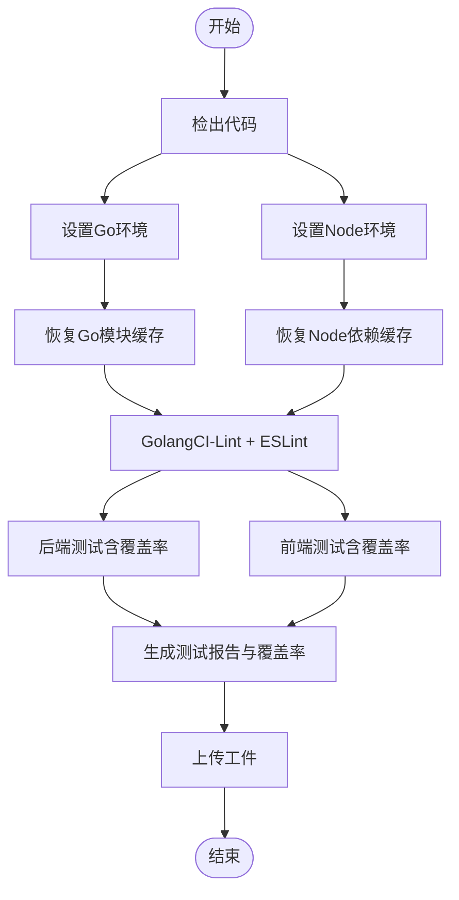
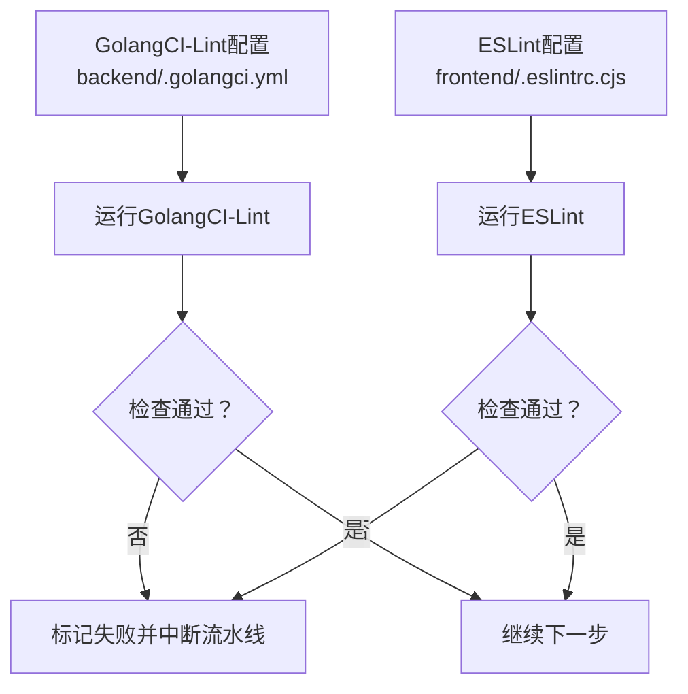
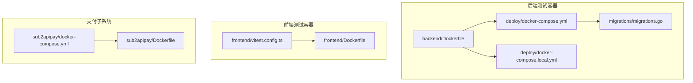
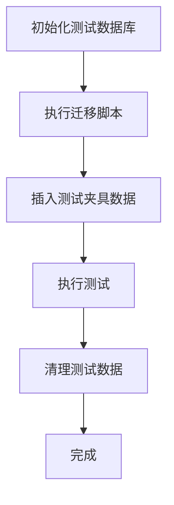
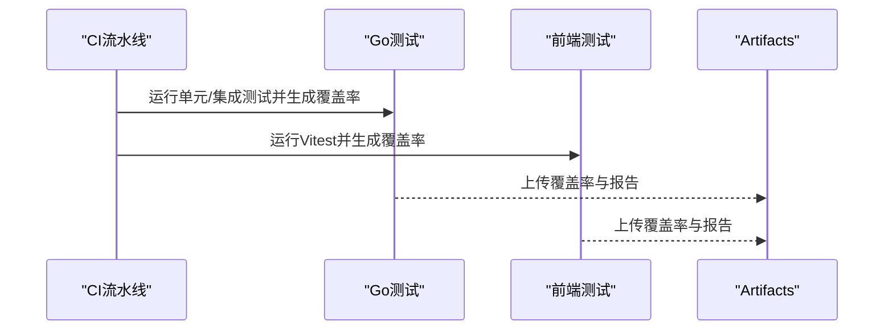
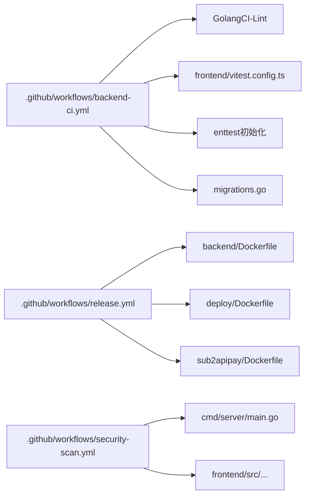

# 测试自动化与CI/CD

<cite>
**本文引用的文件**
- [.github/workflows/backend-ci.yml](file://.github/workflows/backend-ci.yml)
- [.github/workflows/release.yml](file://.github/workflows/release.yml)
- [.github/workflows/security-scan.yml](file://.github/workflows/security-scan.yml)
- [backend/.golangci.yml](file://backend/.golangci.yml)
- [frontend/.eslintrc.cjs](file://frontend/.eslintrc.cjs)
- [frontend/vitest.config.ts](file://frontend/vitest.config.ts)
- [backend/cmd/server/main.go](file://backend/cmd/server/main.go)
- [backend/internal/config/config.go](file://backend/internal/config/config.go)
- [backend/internal/repository/enttest/enttest.go](file://backend/internal/repository/enttest/enttest.go)
- [backend/migrations/migrations.go](file://backend/migrations/migrations.go)
- [deploy/docker-compose.yml](file://deploy/docker-compose.yml)
- [deploy/docker-compose.local.yml](file://deploy/docker-compose.local.yml)
- [backend/Dockerfile](file://backend/Dockerfile)
- [deploy/Dockerfile](file://deploy/Dockerfile)
- [Makefile](file://Makefile)
- [backend/Makefile](file://backend/Makefile)
- [sub2apipay/docker-compose.yml](file://sub2apipay/docker-compose.yml)
- [sub2apipay/Dockerfile](file://sub2apipay/Dockerfile)
</cite>

## 目录
1. [引言](#引言)
2. [项目结构](#项目结构)
3. [核心组件](#核心组件)
4. [架构总览](#架构总览)
5. [详细组件分析](#详细组件分析)
6. [依赖关系分析](#依赖关系分析)
7. [性能考量](#性能考量)
8. [故障排查指南](#故障排查指南)
9. [结论](#结论)
10. [附录](#附录)

## 引言
本指南面向Sub2API项目的测试自动化与持续集成实践，聚焦以下目标：
- GitHub Actions工作流的配置与使用：测试流水线设置、并行测试执行、测试报告生成
- 代码质量检查工具：GolangCI-Lint、ESLint、Prettier等配置与落地
- 测试环境自动化：Docker容器中测试执行、数据库测试环境准备
- 测试结果收集与报告：覆盖率、性能基准测试报告的生成与分析
- 测试数据自动化管理：测试数据库初始化、测试数据清理
- CI/CD管道优化：缓存策略、并行执行、失败重试等

## 项目结构
Sub2API采用多模块架构，包含后端Go服务、前端Vue应用、支付子系统（Next.js）以及部署脚本。测试相关的关键位置如下：
- 后端服务位于 backend/，包含命令行入口、配置、领域模型、仓储层、服务层、HTTP路由与中间件、集成测试与端到端测试
- 前端位于 frontend/，包含Vite+TypeScript+Vitest配置与测试
- 支付子系统位于 sub2apipay/，包含Next.js应用与Prisma迁移
- 部署与容器化位于 deploy/ 与各子目录的Dockerfile
- GitHub Actions工作流位于 .github/workflows/

```mermaid
graph TB
subgraph "后端服务"
BMain["cmd/server/main.go"]
BConfig["internal/config/config.go"]
BEntTest["internal/repository/enttest/enttest.go"]
BMig["migrations/migrations.go"]
BDocker["backend/Dockerfile"]
end
subgraph "前端"
FEConf["frontend/vitest.config.ts"]
FESrc["frontend/src/..."]
FEDocker["frontend/Dockerfile"]
end
subgraph "支付子系统"
PayCompose["sub2apipay/docker-compose.yml"]
PayDocker["sub2apipay/Dockerfile"]
end
subgraph "部署"
DCompose["deploy/docker-compose.yml"]
DLocal["deploy/docker-compose.local.yml"]
DDocker["deploy/Dockerfile"]
end
subgraph "CI/CD"
WBackend["backend-ci.yml"]
WRelease["release.yml"]
WSecurity["security-scan.yml"]
end
WBackend --> BMain
WBackend --> FEConf
WBackend --> BEntTest
WBackend --> BMig
WBackend --> BDocker
WRelease --> BDocker
WRelease --> DDocker
WRelease --> PayDocker
WSecurity --> BMain
WSecurity --> FESrc
```

**图表来源**
- [backend/cmd/server/main.go:1-200](file://backend/cmd/server/main.go#L1-L200)
- [backend/internal/config/config.go:1-200](file://backend/internal/config/config.go#L1-L200)
- [backend/internal/repository/enttest/enttest.go:1-200](file://backend/internal/repository/enttest/enttest.go#L1-L200)
- [backend/migrations/migrations.go:1-200](file://backend/migrations/migrations.go#L1-L200)
- [backend/Dockerfile:1-200](file://backend/Dockerfile#L1-L200)
- [frontend/vitest.config.ts:1-200](file://frontend/vitest.config.ts#L1-L200)
- [sub2apipay/docker-compose.yml:1-200](file://sub2apipay/docker-compose.yml#L1-L200)
- [sub2apipay/Dockerfile:1-200](file://sub2apipay/Dockerfile#L1-L200)
- [.github/workflows/backend-ci.yml:1-200](file://.github/workflows/backend-ci.yml#L1-L200)
- [.github/workflows/release.yml:1-200](file://.github/workflows/release.yml#L1-L200)
- [.github/workflows/security-scan.yml:1-200](file://.github/workflows/security-scan.yml#L1-L200)

**章节来源**
- [backend/cmd/server/main.go:1-200](file://backend/cmd/server/main.go#L1-L200)
- [frontend/vitest.config.ts:1-200](file://frontend/vitest.config.ts#L1-L200)
- [.github/workflows/backend-ci.yml:1-200](file://.github/workflows/backend-ci.yml#L1-L200)

## 核心组件
- GitHub Actions工作流
  - backend-ci.yml：后端与前端测试流水线、代码质量检查、覆盖率与报告
  - release.yml：发布制品构建与推送
  - security-scan.yml：安全扫描与依赖审计
- 代码质量工具
  - GolangCI-Lint：后端静态检查
  - ESLint：前端代码规范与错误检查
  - Prettier：代码格式化（通过ESLint或独立规则）
- 测试环境与容器化
  - Docker Compose：本地与开发环境数据库与服务编排
  - Ent测试工具：后端测试数据库初始化与清理
- 测试数据管理
  - 迁移脚本：数据库Schema与种子数据
  - 测试夹具：集成测试中的预置数据
- 报告与分析
  - 覆盖率：Go与前端测试覆盖率聚合
  - 性能基准：后端基准测试输出

**章节来源**
- [.github/workflows/backend-ci.yml:1-200](file://.github/workflows/backend-ci.yml#L1-L200)
- [backend/.golangci.yml:1-200](file://backend/.golangci.yml#L1-L200)
- [frontend/.eslintrc.cjs:1-200](file://frontend/.eslintrc.cjs#L1-L200)
- [backend/internal/repository/enttest/enttest.go:1-200](file://backend/internal/repository/enttest/enttest.go#L1-L200)
- [backend/migrations/migrations.go:1-200](file://backend/migrations/migrations.go#L1-L200)

## 架构总览
下图展示CI/CD流水线在不同阶段的职责与交互：

**图表来源**
- [.github/workflows/backend-ci.yml:1-200](file://.github/workflows/backend-ci.yml#L1-L200)
- [.github/workflows/release.yml:1-200](file://.github/workflows/release.yml#L1-L200)

## 详细组件分析

### GitHub Actions工作流配置与使用
- backend-ci.yml
  - 触发条件：push到特定分支、PR打开/同步
  - 关键步骤：检出代码、设置Go/Node环境、缓存依赖、运行GolangCI-Lint、运行后端测试（含覆盖率）、运行前端测试（含覆盖率）、上传报告工件
  - 并行策略：后端与前端测试并行执行；数据库迁移与测试并行
  - 报告生成：覆盖率与测试报告上传至GitHub Artifacts
- release.yml
  - 触发条件：标签推送
  - 关键步骤：构建多架构镜像、推送到镜像仓库、生成发布说明
- security-scan.yml
  - 触发条件：定时或手动触发
  - 关键步骤：依赖审计、安全扫描、生成报告

**图表来源**
- [.github/workflows/backend-ci.yml:1-200](file://.github/workflows/backend-ci.yml#L1-L200)

**章节来源**
- [.github/workflows/backend-ci.yml:1-200](file://.github/workflows/backend-ci.yml#L1-L200)
- [.github/workflows/release.yml:1-200](file://.github/workflows/release.yml#L1-L200)
- [.github/workflows/security-scan.yml:1-200](file://.github/workflows/security-scan.yml#L1-L200)

### 代码质量检查工具配置
- GolangCI-Lint（后端）
  - 配置文件：backend/.golangci.yml
  - 检查范围：复杂度、未使用变量、导入排序、竞态检测、性能建议等
  - 执行方式：在CI中作为独立步骤运行，失败即中断流水线
- ESLint（前端）
  - 配置文件：frontend/.eslintrc.cjs
  - 规则：基础TS/Vue规则、禁用某些规则、与Prettier协同
  - 执行方式：在CI中与类型检查、单元测试并行执行
- Prettier
  - 通过ESLint规则或独立任务保证格式一致性
  - 在CI中可作为单独步骤或由ESLint统一处理

**图表来源**
- [backend/.golangci.yml:1-200](file://backend/.golangci.yml#L1-L200)
- [frontend/.eslintrc.cjs:1-200](file://frontend/.eslintrc.cjs#L1-L200)

**章节来源**
- [backend/.golangci.yml:1-200](file://backend/.golangci.yml#L1-L200)
- [frontend/.eslintrc.cjs:1-200](file://frontend/.eslintrc.cjs#L1-L200)

### 测试环境自动化配置（Docker）
- 后端测试容器
  - 使用backend/Dockerfile构建测试镜像
  - 通过deploy/docker-compose.yml或deploy/docker-compose.local.yml启动数据库与服务
  - 在CI中以服务形式拉起PostgreSQL，执行迁移与测试
- 前端测试容器
  - 使用frontend/Dockerfile（如存在）或直接在CI中安装Node与依赖
- 支付子系统测试容器
  - 使用sub2apipay/docker-compose.yml启动Next.js与数据库服务

**图表来源**
- [backend/Dockerfile:1-200](file://backend/Dockerfile#L1-L200)
- [deploy/docker-compose.yml:1-200](file://deploy/docker-compose.yml#L1-L200)
- [deploy/docker-compose.local.yml:1-200](file://deploy/docker-compose.local.yml#L1-L200)
- [backend/migrations/migrations.go:1-200](file://backend/migrations/migrations.go#L1-L200)
- [frontend/vitest.config.ts:1-200](file://frontend/vitest.config.ts#L1-L200)
- [sub2apipay/docker-compose.yml:1-200](file://sub2apipay/docker-compose.yml#L1-L200)
- [sub2apipay/Dockerfile:1-200](file://sub2apipay/Dockerfile#L1-L200)

**章节来源**
- [backend/Dockerfile:1-200](file://backend/Dockerfile#L1-L200)
- [deploy/docker-compose.yml:1-200](file://deploy/docker-compose.yml#L1-L200)
- [deploy/docker-compose.local.yml:1-200](file://deploy/docker-compose.local.yml#L1-L200)
- [backend/migrations/migrations.go:1-200](file://backend/migrations/migrations.go#L1-L200)
- [frontend/vitest.config.ts:1-200](file://frontend/vitest.config.ts#L1-L200)
- [sub2apipay/docker-compose.yml:1-200](file://sub2apipay/docker-compose.yml#L1-L200)
- [sub2apipay/Dockerfile:1-200](file://sub2apipay/Dockerfile#L1-L200)

### 测试数据自动化管理
- 数据库初始化
  - 使用backend/migrations/migrations.go进行Schema迁移
  - 在测试前执行迁移，确保测试数据库处于一致状态
- 测试夹具与清理
  - 使用backend/internal/repository/enttest/enttest.go提供的测试Harness初始化与清理
  - 集成测试中按需插入测试数据，并在测试结束后清理
- 配置隔离
  - 使用backend/internal/config/config.go加载测试环境配置，避免污染生产数据

**图表来源**
- [backend/migrations/migrations.go:1-200](file://backend/migrations/migrations.go#L1-L200)
- [backend/internal/repository/enttest/enttest.go:1-200](file://backend/internal/repository/enttest/enttest.go#L1-L200)
- [backend/internal/config/config.go:1-200](file://backend/internal/config/config.go#L1-L200)

**章节来源**
- [backend/migrations/migrations.go:1-200](file://backend/migrations/migrations.go#L1-L200)
- [backend/internal/repository/enttest/enttest.go:1-200](file://backend/internal/repository/enttest/enttest.go#L1-L200)
- [backend/internal/config/config.go:1-200](file://backend/internal/config/config.go#L1-L200)

### 测试结果收集与报告
- 覆盖率报告
  - 后端：通过go test -coverprofile生成覆盖率文件，上传为Artifacts
  - 前端：通过Vitest生成覆盖率报告，上传为Artifacts
- 性能基准测试报告
  - 后端：基准测试输出用于对比性能变化趋势
- 报告工件
  - 所有报告与覆盖率文件上传至GitHub Artifacts，便于下载与分析

**图表来源**
- [.github/workflows/backend-ci.yml:1-200](file://.github/workflows/backend-ci.yml#L1-L200)

**章节来源**
- [.github/workflows/backend-ci.yml:1-200](file://.github/workflows/backend-ci.yml#L1-L200)

### CI/CD管道优化策略
- 缓存策略
  - Go模块缓存：加速依赖下载
  - Node依赖缓存：加速前端依赖安装
- 并行执行
  - 代码质量检查与测试并行
  - 后端与前端测试并行
- 失败重试
  - 对不稳定网络或第三方服务失败的步骤启用重试
- 定向触发
  - 仅在变更相关文件时触发对应工作流，减少不必要执行

**章节来源**
- [.github/workflows/backend-ci.yml:1-200](file://.github/workflows/backend-ci.yml#L1-L200)

## 依赖关系分析
- 组件耦合
  - 后端测试依赖数据库迁移与Ent测试Harness
  - 前端测试依赖Vitest配置与Docker环境（如需要）
  - 发布流程依赖Docker镜像构建与推送
- 外部依赖
  - GitHub Actions Runner、Docker Registry、包管理器缓存
- 可能的循环依赖
  - 当前结构清晰，无明显循环依赖

**图表来源**
- [.github/workflows/backend-ci.yml:1-200](file://.github/workflows/backend-ci.yml#L1-L200)
- [.github/workflows/release.yml:1-200](file://.github/workflows/release.yml#L1-L200)
- [.github/workflows/security-scan.yml:1-200](file://.github/workflows/security-scan.yml#L1-L200)
- [backend/Dockerfile:1-200](file://backend/Dockerfile#L1-L200)
- [deploy/Dockerfile:1-200](file://deploy/Dockerfile#L1-L200)
- [sub2apipay/Dockerfile:1-200](file://sub2apipay/Dockerfile#L1-L200)
- [backend/cmd/server/main.go:1-200](file://backend/cmd/server/main.go#L1-L200)
- [frontend/vitest.config.ts:1-200](file://frontend/vitest.config.ts#L1-L200)

**章节来源**
- [.github/workflows/backend-ci.yml:1-200](file://.github/workflows/backend-ci.yml#L1-L200)
- [.github/workflows/release.yml:1-200](file://.github/workflows/release.yml#L1-L200)
- [.github/workflows/security-scan.yml:1-200](file://.github/workflows/security-scan.yml#L1-L200)

## 性能考量
- 并行化收益最大化：将测试与质量检查并行，缩短总耗时
- 缓存命中率：合理设置缓存键，避免过期导致的冷启动
- 资源分配：为数据库容器预留足够资源，避免测试抖动
- 基准测试稳定性：固定测试输入与环境，减少噪声

## 故障排查指南
- 工作流失败
  - 查看具体步骤日志，定位失败原因（依赖安装、测试超时、覆盖率生成）
- 数据库连接问题
  - 确认Docker Compose服务已启动且端口可用
  - 检查迁移是否成功执行
- 覆盖率缺失
  - 确保测试命令正确生成覆盖率文件并上传
- 代码质量检查失败
  - 修复规则冲突或更新配置文件

**章节来源**
- [.github/workflows/backend-ci.yml:1-200](file://.github/workflows/backend-ci.yml#L1-L200)
- [backend/internal/repository/enttest/enttest.go:1-200](file://backend/internal/repository/enttest/enttest.go#L1-L200)

## 结论
通过上述配置与实践，Sub2API实现了从代码提交到发布的全链路测试自动化与持续集成。建议持续优化缓存与并行策略，完善测试数据治理，并将覆盖率与性能指标纳入质量门禁。

## 附录
- 快速参考
  - 后端测试入口：backend/cmd/server/main.go
  - 前端测试配置：frontend/vitest.config.ts
  - 代码质量配置：backend/.golangci.yml、frontend/.eslintrc.cjs
  - 测试数据库：backend/internal/repository/enttest/enttest.go、backend/migrations/migrations.go
  - 容器化：backend/Dockerfile、deploy/docker-compose.yml、sub2apipay/docker-compose.yml
  - 工作流：.github/workflows/backend-ci.yml、.github/workflows/release.yml、.github/workflows/security-scan.yml