# 分布式系统调试

<cite>
**本文引用的文件**   
- [backend/internal/server/middleware/client_request_id.go](file://backend/internal/server/middleware/client_request_id.go)
- [backend/internal/handler/admin/ops_handler.go](file://backend/internal/handler/admin/ops_handler.go)
- [backend/internal/service/ops_request_details.go](file://backend/internal/service/ops_request_details.go)
- [backend/internal/handler/ops_error_logger.go](file://backend/internal/handler/ops_error_logger.go)
- [backend/internal/service/ops_system_log_sink.go](file://backend/internal/service/ops_system_log_sink.go)
- [backend/internal/service/ops_retry.go](file://backend/internal/service/ops_retry.go)
- [backend/internal/service/group_status_probe_service.go](file://backend/internal/service/group_status_probe_service.go)
- [backend/internal/repository/group_status_repo.go](file://backend/internal/repository/group_status_repo.go)
- [backend/internal/repository/user_msg_queue_cache.go](file://backend/internal/repository/user_msg_queue_cache.go)
- [backend/internal/service/user_msg_queue_service.go](file://backend/internal/service/user_msg_queue_service.go)
- [backend/internal/service/subscription_maintenance_queue_test.go](file://backend/internal/service/subscription_maintenance_queue_test.go)
- [backend/internal/pkg/logger/logger.go](file://backend/internal/pkg/logger/logger.go)
- [backend/internal/pkg/logger/options.go](file://backend/internal/pkg/logger/options.go)
- [backend/internal/pkg/logger/slog_handler.go](file://backend/internal/pkg/logger/slog_handler.go)
- [backend/internal/pkg/geminicli/drive_client.go](file://backend/internal/pkg/geminicli/drive_client.go)
- [backend/internal/setup/handler.go](file://backend/internal/setup/handler.go)
- [frontend/src/api/setup.ts](file://frontend/src/api/setup.ts)
- [backend/internal/config/wire.go](file://backend/internal/config/wire.go)
- [backend/internal/service/setting_service.go](file://backend/internal/service/setting_service.go)
</cite>

## 目录
1. [引言](#引言)
2. [项目结构](#项目结构)
3. [核心组件](#核心组件)
4. [架构总览](#架构总览)
5. [详细组件分析](#详细组件分析)
6. [依赖分析](#依赖分析)
7. [性能考虑](#性能考虑)
8. [故障排查指南](#故障排查指南)
9. [结论](#结论)
10. [附录](#附录)

## 引言
本指南面向分布式系统工程师与运维人员，围绕链路追踪、负载均衡、缓存、消息队列与异步任务、以及微服务调试流程，结合仓库中的实际实现，给出可操作的调试策略与工具化建议。内容覆盖：
- 分布式ID生成与请求链路关联
- 请求错误与上游错误的关联与回溯
- 服务可用性探测与健康检查
- 缓存命中率与一致性分析
- 消息队列串行化与延迟控制
- 重试机制与死信队列检查
- 运维日志采集与系统级事件索引
- 安装与连接测试（数据库、Redis）

## 项目结构
后端采用多模块分层设计：配置、领域服务、仓储、中间件、处理器、日志与监控等。前端提供安装与连接测试接口，便于快速验证环境。

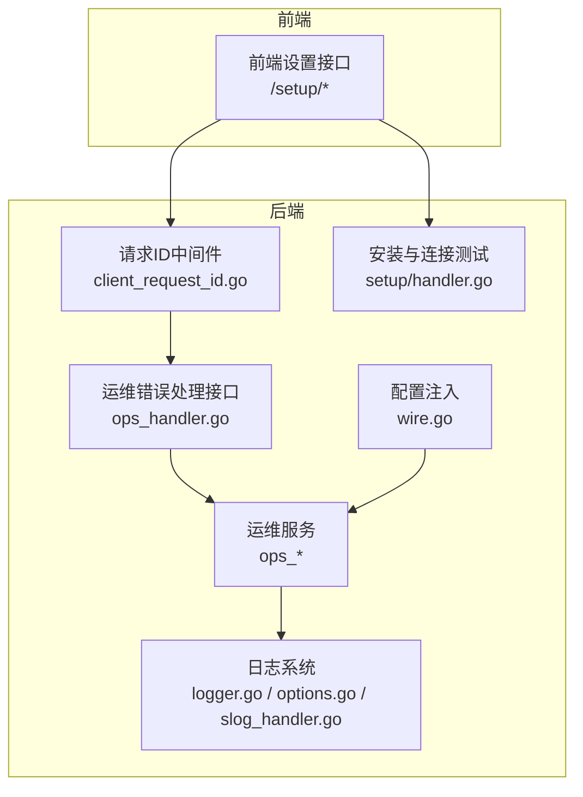

**图示来源**
- [backend/internal/config/wire.go:1-13](file://backend/internal/config/wire.go#L1-L13)
- [backend/internal/server/middleware/client_request_id.go:14-36](file://backend/internal/server/middleware/client_request_id.go#L14-L36)
- [backend/internal/handler/admin/ops_handler.go:289-334](file://backend/internal/handler/admin/ops_handler.go#L289-L334)
- [backend/internal/service/ops_system_log_sink.go:62-124](file://backend/internal/service/ops_system_log_sink.go#L62-L124)
- [backend/internal/pkg/logger/logger.go:303-357](file://backend/internal/pkg/logger/logger.go#L303-L357)
- [backend/internal/setup/handler.go:208-222](file://backend/internal/setup/handler.go#L208-L222)

**章节来源**
- [backend/internal/config/wire.go:1-13](file://backend/internal/config/wire.go#L1-L13)
- [backend/internal/server/middleware/client_request_id.go:14-36](file://backend/internal/server/middleware/client_request_id.go#L14-L36)
- [backend/internal/handler/admin/ops_handler.go:289-334](file://backend/internal/handler/admin/ops_handler.go#L289-L334)
- [backend/internal/service/ops_system_log_sink.go:62-124](file://backend/internal/service/ops_system_log_sink.go#L62-L124)
- [backend/internal/pkg/logger/logger.go:303-357](file://backend/internal/pkg/logger/logger.go#L303-L357)
- [backend/internal/setup/handler.go:208-222](file://backend/internal/setup/handler.go#L208-L222)

## 核心组件
- 分布式请求ID中间件：为每个请求注入唯一ID，贯穿日志与监控，支撑端到端关联。
- 运维错误与请求详情：提供错误列表、按请求ID/客户端ID关联上游错误、支持时间窗口筛选。
- 日志系统：支持结构化日志、采样、轮转、slog桥接，统一输出与归档。
- 服务可用性探测：对上游账户进行探测，提取响应摘要、延迟与状态码，辅助健康检查。
- 用户消息队列：基于Redis的串行化锁、延迟控制与孤儿锁清理，保障并发一致性。
- 重试机制：对错误进行去重、限频、超时控制与结果更新，支持上游重试模式。
- 安装与连接测试：前端通过设置接口测试数据库与Redis连通性，后端提供安装入口。

**章节来源**
- [backend/internal/server/middleware/client_request_id.go:14-36](file://backend/internal/server/middleware/client_request_id.go#L14-L36)
- [backend/internal/handler/admin/ops_handler.go:289-334](file://backend/internal/handler/admin/ops_handler.go#L289-L334)
- [backend/internal/service/ops_request_details.go:114-151](file://backend/internal/service/ops_request_details.go#L114-L151)
- [backend/internal/pkg/logger/logger.go:303-357](file://backend/internal/pkg/logger/logger.go#L303-L357)
- [backend/internal/service/group_status_probe_service.go:783-807](file://backend/internal/service/group_status_probe_service.go#L783-L807)
- [backend/internal/repository/group_status_repo.go:382-440](file://backend/internal/repository/group_status_repo.go#L382-L440)
- [backend/internal/repository/user_msg_queue_cache.go:48-128](file://backend/internal/repository/user_msg_queue_cache.go#L48-L128)
- [backend/internal/service/user_msg_queue_service.go:122-297](file://backend/internal/service/user_msg_queue_service.go#L122-L297)
- [backend/internal/service/ops_retry.go:205-360](file://backend/internal/service/ops_retry.go#L205-L360)
- [backend/internal/setup/handler.go:208-222](file://backend/internal/setup/handler.go#L208-L222)

## 架构总览
下图展示从请求进入、ID注入、错误关联、日志采集到重试执行的关键路径。

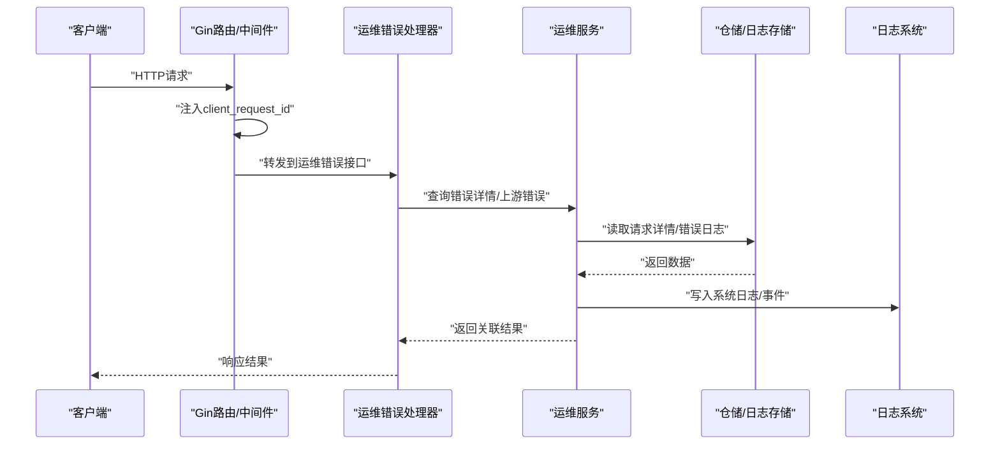

**图示来源**
- [backend/internal/server/middleware/client_request_id.go:14-36](file://backend/internal/server/middleware/client_request_id.go#L14-L36)
- [backend/internal/handler/admin/ops_handler.go:289-334](file://backend/internal/handler/admin/ops_handler.go#L289-L334)
- [backend/internal/service/ops_system_log_sink.go:62-124](file://backend/internal/service/ops_system_log_sink.go#L62-L124)

## 详细组件分析

### 组件A：分布式ID与链路追踪
- 功能要点
  - 在请求上下文中注入唯一ID，便于跨服务、跨模块关联。
  - 日志中携带该ID，形成端到端追踪线索。
- 调试建议
  - 在网关/代理层透传该ID，确保下游服务可复用。
  - 结合运维错误接口，按ID检索同一请求的上下游日志与错误。
- 关键实现位置
  - [client_request_id.go:14-36](file://backend/internal/server/middleware/client_request_id.go#L14-L36)
  - [ops_handler.go:289-334](file://backend/internal/handler/admin/ops_handler.go#L289-L334)

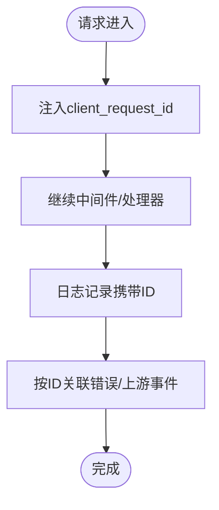

**图示来源**
- [backend/internal/server/middleware/client_request_id.go:14-36](file://backend/internal/server/middleware/client_request_id.go#L14-L36)
- [backend/internal/handler/admin/ops_handler.go:289-334](file://backend/internal/handler/admin/ops_handler.go#L289-L334)

**章节来源**
- [backend/internal/server/middleware/client_request_id.go:14-36](file://backend/internal/server/middleware/client_request_id.go#L14-L36)
- [backend/internal/handler/admin/ops_handler.go:289-334](file://backend/internal/handler/admin/ops_handler.go#L289-L334)

### 组件B：请求详情与上游错误关联
- 功能要点
  - 列表请求详情，支持分页与时间范围。
  - 错误详情按request_id/client_request_id关联上游错误，扩大时间窗以便发现跨服务问题。
- 调试建议
  - 发生错误时优先查看关联的上游错误，定位根因。
  - 使用时间窗参数缩小排查范围，结合ID过滤。
- 关键实现位置
  - [ops_request_details.go:114-151](file://backend/internal/service/ops_request_details.go#L114-L151)
  - [ops_handler.go:289-334](file://backend/internal/handler/admin/ops_handler.go#L289-L334)

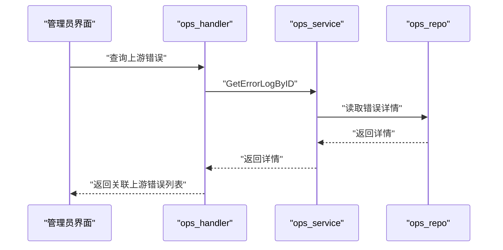

**图示来源**
- [backend/internal/handler/admin/ops_handler.go:289-334](file://backend/internal/handler/admin/ops_handler.go#L289-L334)
- [backend/internal/service/ops_request_details.go:114-151](file://backend/internal/service/ops_request_details.go#L114-L151)

**章节来源**
- [backend/internal/handler/admin/ops_handler.go:289-334](file://backend/internal/handler/admin/ops_handler.go#L289-L334)
- [backend/internal/service/ops_request_details.go:114-151](file://backend/internal/service/ops_request_details.go#L114-L151)

### 组件C：日志系统与系统事件索引
- 功能要点
  - 支持结构化日志、采样、轮转与slog桥接。
  - 系统日志汇聚器仅索引告警级别与特定组件事件，降低噪声。
- 调试建议
  - 将关键路径打点到日志，配合ID进行串联。
  - 对高频事件启用采样，避免日志风暴。
- 关键实现位置
  - [logger.go:303-357](file://backend/internal/pkg/logger/logger.go#L303-L357)
  - [options.go:42-92](file://backend/internal/pkg/logger/options.go#L42-L92)
  - [slog_handler.go:1-62](file://backend/internal/pkg/logger/slog_handler.go#L1-L62)
  - [ops_system_log_sink.go:62-124](file://backend/internal/service/ops_system_log_sink.go#L62-L124)

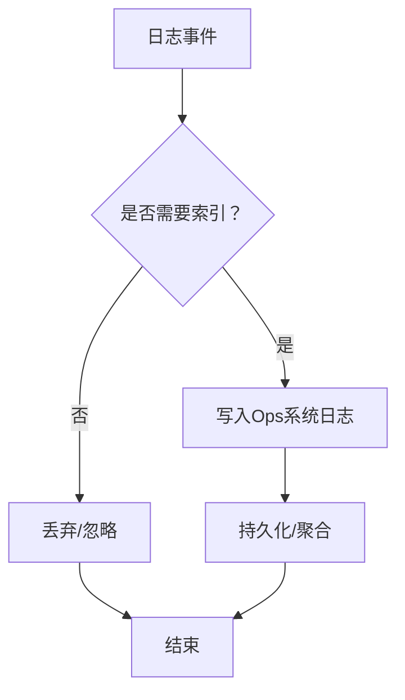

**图示来源**
- [backend/internal/service/ops_system_log_sink.go:62-124](file://backend/internal/service/ops_system_log_sink.go#L62-L124)
- [backend/internal/pkg/logger/logger.go:303-357](file://backend/internal/pkg/logger/logger.go#L303-L357)

**章节来源**
- [backend/internal/pkg/logger/logger.go:303-357](file://backend/internal/pkg/logger/logger.go#L303-L357)
- [backend/internal/pkg/logger/options.go:42-92](file://backend/internal/pkg/logger/options.go#L42-L92)
- [backend/internal/pkg/logger/slog_handler.go:1-62](file://backend/internal/pkg/logger/slog_handler.go#L1-L62)
- [backend/internal/service/ops_system_log_sink.go:62-124](file://backend/internal/service/ops_system_log_sink.go#L62-L124)

### 组件D：服务可用性探测与健康检查
- 功能要点
  - 对账户执行探测，解析响应文本与状态码，记录延迟与摘要。
  - 通过仓储扫描状态与记录，支持稳定状态与连续上下线计数。
- 调试建议
  - 将探测失败与错误详情纳入运维错误日志，便于回溯。
  - 结合上游错误关联，定位跨服务调用异常。
- 关键实现位置
  - [group_status_probe_service.go:783-807](file://backend/internal/service/group_status_probe_service.go#L783-L807)
  - [group_status_repo.go:382-440](file://backend/internal/repository/group_status_repo.go#L382-L440)

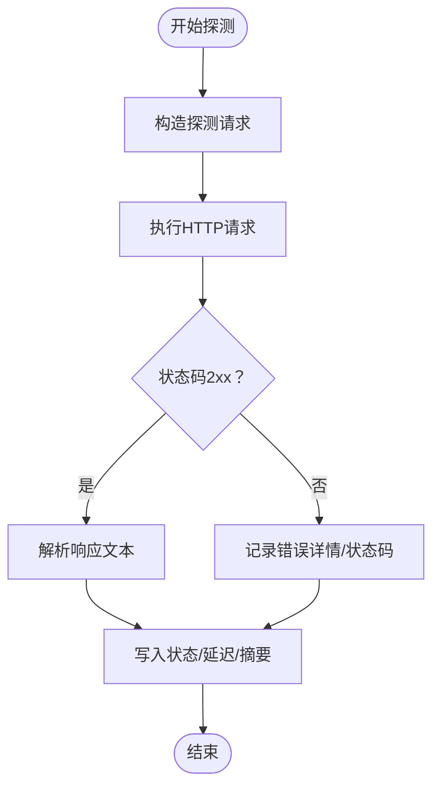

**图示来源**
- [backend/internal/service/group_status_probe_service.go:783-807](file://backend/internal/service/group_status_probe_service.go#L783-L807)
- [backend/internal/repository/group_status_repo.go:382-440](file://backend/internal/repository/group_status_repo.go#L382-L440)

**章节来源**
- [backend/internal/service/group_status_probe_service.go:783-807](file://backend/internal/service/group_status_probe_service.go#L783-L807)
- [backend/internal/repository/group_status_repo.go:382-440](file://backend/internal/repository/group_status_repo.go#L382-L440)

### 组件E：缓存系统调试（命中率、一致性、失效）
- 命中率分析
  - 可通过使用统计字段（如缓存读取令牌、成本等）进行趋势分析与对比。
  - 参考实体谓词中与缓存读取相关的字段定义，用于筛选与聚合。
- 一致性检查
  - 使用缓存读取/创建的对比字段，识别脏读或过期未生效。
- 失效排查
  - 检查缓存TTL与更新策略，关注批量失效与单条失效场景。
- 关键实现位置
  - [backend/ent/usagelog/where.go:1013-1276](file://backend/ent/usagelog/where.go#L1013-L1276)

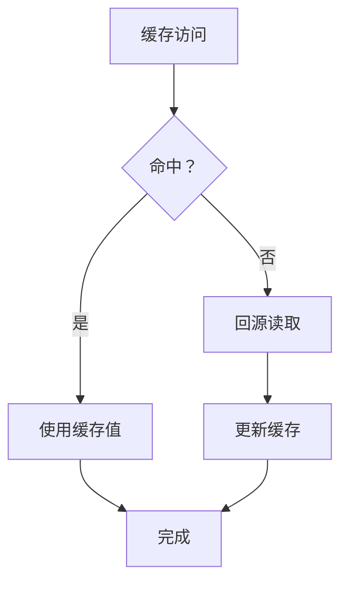

**章节来源**
- [backend/ent/usagelog/where.go:1013-1276](file://backend/ent/usagelog/where.go#L1013-L1276)

### 组件F：消息队列与异步任务调试
- 串行化与锁
  - 基于Redis实现账号级串行锁，避免并发冲突。
  - 提供孤儿锁强制释放脚本，防止死锁。
- 延迟控制
  - 根据RPM负载动态计算延迟，加入抖动避免惊群。
- 清理与可观测
  - 后台worker定期扫描并清理孤儿锁。
- 关键实现位置
  - [user_msg_queue_cache.go:48-128](file://backend/internal/repository/user_msg_queue_cache.go#L48-L128)
  - [user_msg_queue_service.go:122-297](file://backend/internal/service/user_msg_queue_service.go#L122-L297)

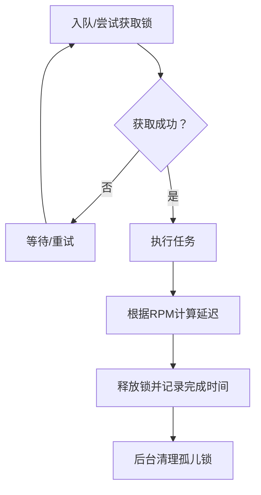

**图示来源**
- [backend/internal/repository/user_msg_queue_cache.go:48-128](file://backend/internal/repository/user_msg_queue_cache.go#L48-L128)
- [backend/internal/service/user_msg_queue_service.go:122-297](file://backend/internal/service/user_msg_queue_service.go#L122-L297)

**章节来源**
- [backend/internal/repository/user_msg_queue_cache.go:48-128](file://backend/internal/repository/user_msg_queue_cache.go#L48-L128)
- [backend/internal/service/user_msg_queue_service.go:122-297](file://backend/internal/service/user_msg_queue_service.go#L122-L297)

### 组件G：重试机制与死信队列检查
- 重试策略
  - 去重与限频：避免重复重试与刷屏。
  - 超时控制与结果更新：记录最终状态与上游请求ID。
- 死信队列
  - 可通过重试结果与错误日志联动，定位无法成功的请求。
- 关键实现位置
  - [ops_retry.go:205-360](file://backend/internal/service/ops_retry.go#L205-L360)

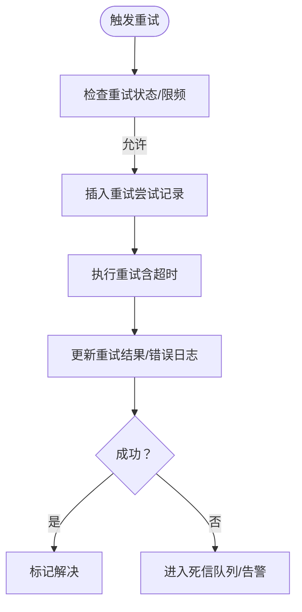

**图示来源**
- [backend/internal/service/ops_retry.go:205-360](file://backend/internal/service/ops_retry.go#L205-L360)

**章节来源**
- [backend/internal/service/ops_retry.go:205-360](file://backend/internal/service/ops_retry.go#L205-L360)

### 组件H：安装与连接测试（数据库/Redis）
- 前端接口
  - 提供设置状态查询、数据库与Redis连接测试、安装入口。
- 后端实现
  - 测试连接成功后返回成功信息，安装过程带互斥保护与二次检查。
- 关键实现位置
  - [frontend/src/api/setup.ts:60-88](file://frontend/src/api/setup.ts#L60-L88)
  - [backend/internal/setup/handler.go:208-222](file://backend/internal/setup/handler.go#L208-L222)

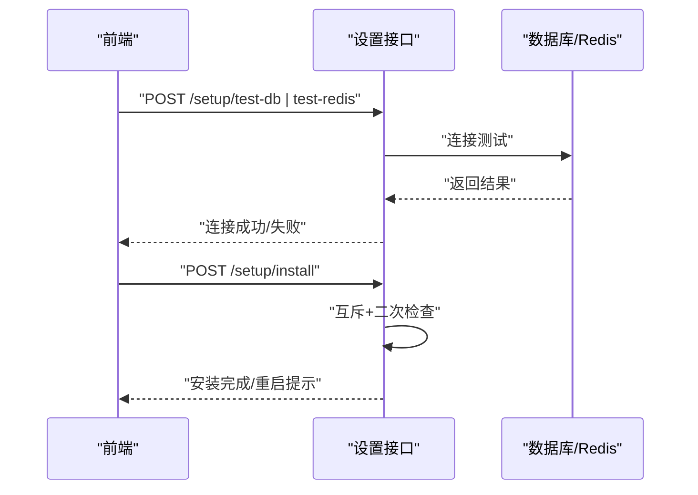

**图示来源**
- [frontend/src/api/setup.ts:60-88](file://frontend/src/api/setup.ts#L60-L88)
- [backend/internal/setup/handler.go:208-222](file://backend/internal/setup/handler.go#L208-L222)

**章节来源**
- [frontend/src/api/setup.ts:60-88](file://frontend/src/api/setup.ts#L60-L88)
- [backend/internal/setup/handler.go:208-222](file://backend/internal/setup/handler.go#L208-L222)

## 依赖分析
- 中间件依赖注入：通过wire提供配置，确保服务启动时具备所需依赖。
- 设置项缓存：后端模式等关键开关采用内存缓存+单飞（singleflight）优化热路径。
- 日志与监控：日志系统作为通用基础设施被各服务复用，运维事件索引器负责筛选与落盘。

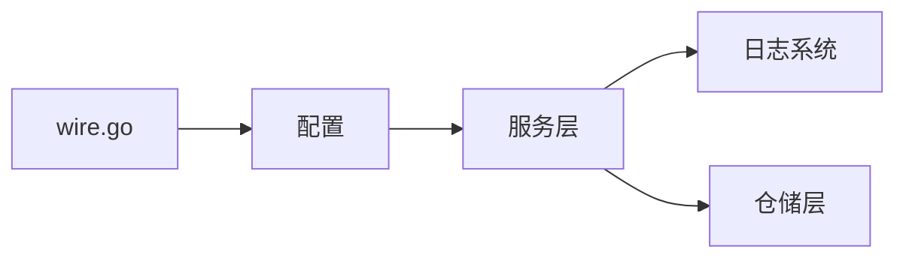

**图示来源**
- [backend/internal/config/wire.go:1-13](file://backend/internal/config/wire.go#L1-L13)
- [backend/internal/service/setting_service.go:809-853](file://backend/internal/service/setting_service.go#L809-L853)

**章节来源**
- [backend/internal/config/wire.go:1-13](file://backend/internal/config/wire.go#L1-L13)
- [backend/internal/service/setting_service.go:809-853](file://backend/internal/service/setting_service.go#L809-L853)

## 性能考虑
- 日志采样与轮转：合理配置采样与轮转参数，避免I/O瓶颈。
- 单飞与缓存：对热点设置项使用单飞与短TTL缓存，减少数据库压力。
- 重试与超时：为上游调用设置合理超时与指数退避，避免雪崩。
- 队列延迟抖动：引入随机抖动，缓解并发峰值与检测机制影响。

## 故障排查指南
- 链路追踪
  - 确认请求已注入client_request_id，使用该ID在运维接口中检索错误与上游事件。
  - 若无ID，检查中间件顺序与上下文传递。
- 负载均衡
  - 使用服务可用性探测结果判断上游账户健康度，结合错误详情定位异常。
  - 检查上游状态记录与连续上下线计数，识别抖动与持续不可用。
- 缓存
  - 通过缓存读取/创建相关字段进行趋势分析，核对TTL与更新逻辑。
  - 关注缓存一致性问题，必要时进行全量校验。
- 消息队列
  - 观察串行锁获取与释放，排查长时间未释放导致的积压。
  - 启动孤儿锁清理worker，定期扫描并释放异常锁。
- 重试与死信
  - 检查重试去重与限频规则，避免重复重试。
  - 对失败重试记录与错误日志进行联动分析，定位死信原因。
- 安装与连接
  - 使用前端设置接口测试数据库与Redis连通性，确认凭据与网络可达。

**章节来源**
- [backend/internal/server/middleware/client_request_id.go:14-36](file://backend/internal/server/middleware/client_request_id.go#L14-L36)
- [backend/internal/handler/admin/ops_handler.go:289-334](file://backend/internal/handler/admin/ops_handler.go#L289-L334)
- [backend/internal/service/group_status_probe_service.go:783-807](file://backend/internal/service/group_status_probe_service.go#L783-L807)
- [backend/internal/repository/group_status_repo.go:382-440](file://backend/internal/repository/group_status_repo.go#L382-L440)
- [backend/internal/repository/user_msg_queue_cache.go:48-128](file://backend/internal/repository/user_msg_queue_cache.go#L48-L128)
- [backend/internal/service/user_msg_queue_service.go:122-297](file://backend/internal/service/user_msg_queue_service.go#L122-L297)
- [backend/internal/service/ops_retry.go:205-360](file://backend/internal/service/ops_retry.go#L205-L360)
- [backend/internal/setup/handler.go:208-222](file://backend/internal/setup/handler.go#L208-L222)

## 结论
本指南基于仓库现有实现，提供了从链路追踪、负载均衡、缓存、消息队列到重试与安装测试的完整调试路径。建议在生产环境中：
- 强制启用client_request_id并贯穿所有服务
- 建立运维错误与上游错误的自动关联机制
- 对高频日志启用采样与轮转
- 对关键设置项使用单飞与短TTL缓存
- 对消息队列与重试实施严格的去重与限频策略
- 使用安装接口进行环境连通性验证

## 附录
- 上游重试与退避参考：[drive_client.go:53-90](file://backend/internal/pkg/geminicli/drive_client.go#L53-L90)
- 并发入队与停止测试：[subscription_maintenance_queue_test.go:107-133](file://backend/internal/service/subscription_maintenance_queue_test.go#L107-L133)