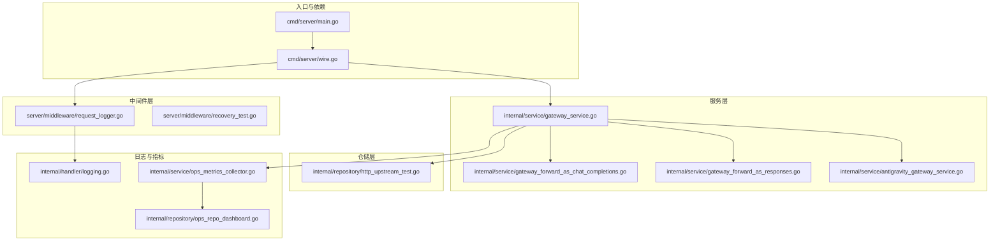
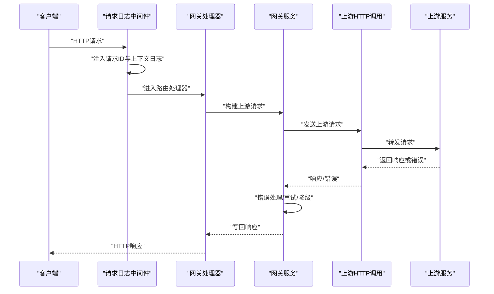
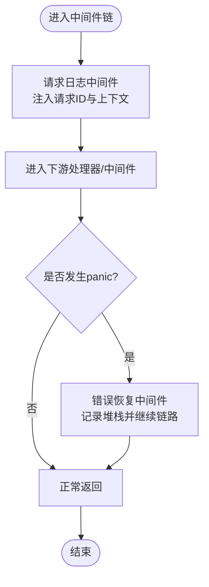
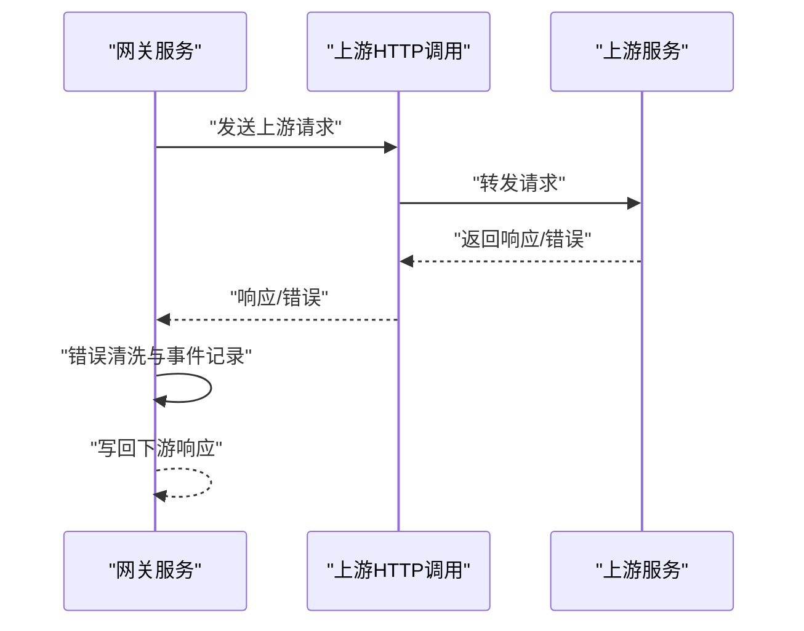
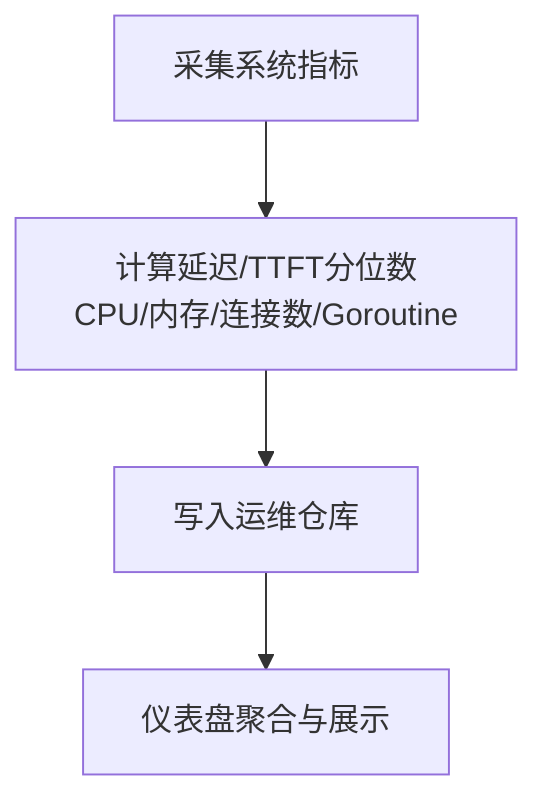
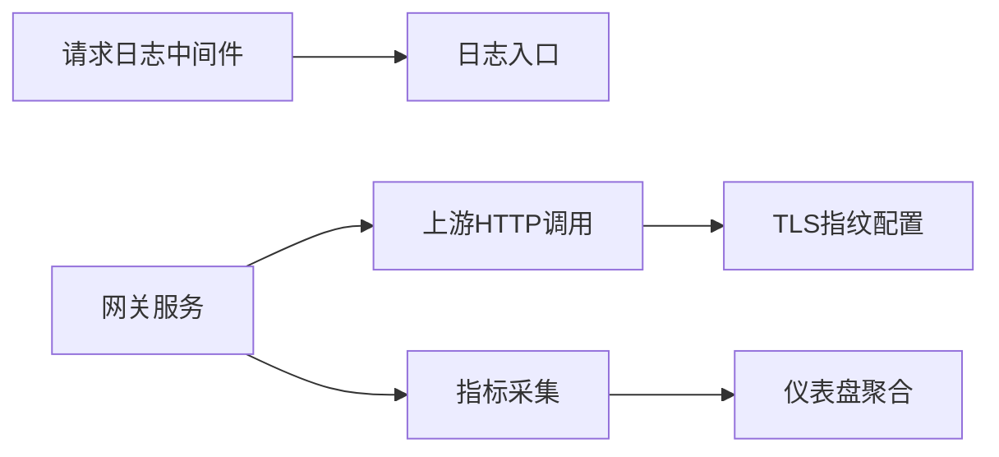

# 后端调试技术

<cite>
**本文引用的文件**
- [backend/cmd/server/main.go](file://backend/cmd/server/main.go)
- [backend/internal/server/middleware/request_logger.go](file://backend/internal/server/middleware/request_logger.go)
- [backend/internal/server/middleware/recovery_test.go](file://backend/internal/server/middleware/recovery_test.go)
- [backend/internal/handler/logging.go](file://backend/internal/handler/logging.go)
- [backend/internal/service/gateway_service.go](file://backend/internal/service/gateway_service.go)
- [backend/internal/service/gateway_forward_as_chat_completions.go](file://backend/internal/service/gateway_forward_as_chat_completions.go)
- [backend/internal/service/gateway_forward_as_responses.go](file://backend/internal/service/gateway_forward_as_responses.go)
- [backend/internal/service/antigravity_gateway_service.go](file://backend/internal/service/antigravity_gateway_service.go)
- [backend/internal/repository/http_upstream_test.go](file://backend/internal/repository/http_upstream_test.go)
- [backend/internal/service/ops_metrics_collector.go](file://backend/internal/service/ops_metrics_collector.go)
- [backend/internal/repository/ops_repo_dashboard.go](file://backend/internal/repository/ops_repo_dashboard.go)
- [backend/internal/pkg/tlsfingerprint/dialer_capture_test.go](file://backend/internal/pkg/tlsfingerprint/dialer_capture_test.go)
</cite>

## 目录
1. [引言](#引言)
2. [项目结构](#项目结构)
3. [核心组件](#核心组件)
4. [架构总览](#架构总览)
5. [详细组件分析](#详细组件分析)
6. [依赖关系分析](#依赖关系分析)
7. [性能考量](#性能考量)
8. [故障排查指南](#故障排查指南)
9. [结论](#结论)
10. [附录](#附录)

## 引言
本指南聚焦于Go后端在真实生产环境中的调试技术与实践，结合仓库中现有的HTTP中间件、网关转发、上游调用、日志与指标采集等模块，系统讲解以下主题：
- Delve调试器的安装与使用：断点设置、变量检查、调用栈分析
- HTTP中间件调试：请求日志、响应拦截、错误恢复
- API网关调试：请求转发链路、上游调用、重试与降级
- 性能分析：pprof内存/CPU、Goroutine阻塞、死锁
- 常见后端问题：500错误定位、超时分析、并发问题排查

本指南以仓库现有实现为依据，提供可操作的调试步骤与可视化图示，帮助开发者快速定位问题。

## 项目结构
后端采用分层架构：命令入口负责启动与依赖注入；服务层封装业务逻辑（含网关转发）；仓储层负责上游HTTP调用与连接池；中间件层提供统一的日志与错误恢复；日志与指标模块贯穿全链路。

图表来源
- [backend/cmd/server/main.go](file://backend/cmd/server/main.go)
- [backend/internal/server/middleware/request_logger.go](file://backend/internal/server/middleware/request_logger.go)
- [backend/internal/service/gateway_service.go](file://backend/internal/service/gateway_service.go)
- [backend/internal/service/gateway_forward_as_chat_completions.go](file://backend/internal/service/gateway_forward_as_chat_completions.go)
- [backend/internal/service/gateway_forward_as_responses.go](file://backend/internal/service/gateway_forward_as_responses.go)
- [backend/internal/service/antigravity_gateway_service.go](file://backend/internal/service/antigravity_gateway_service.go)
- [backend/internal/repository/http_upstream_test.go](file://backend/internal/repository/http_upstream_test.go)
- [backend/internal/handler/logging.go](file://backend/internal/handler/logging.go)
- [backend/internal/service/ops_metrics_collector.go](file://backend/internal/service/ops_metrics_collector.go)
- [backend/internal/repository/ops_repo_dashboard.go](file://backend/internal/repository/ops_repo_dashboard.go)

章节来源
- [backend/cmd/server/main.go](file://backend/cmd/server/main.go)
- [backend/internal/server/middleware/request_logger.go](file://backend/internal/server/middleware/request_logger.go)
- [backend/internal/handler/logging.go](file://backend/internal/handler/logging.go)

## 核心组件
- 请求日志中间件：在请求入口注入request-scoped logger，携带请求ID、路径、方法等上下文字段，便于跨服务串联追踪。
- 错误恢复中间件：捕获panic并记录堆栈信息，避免服务崩溃，同时保证后续中间件链不被破坏。
- 网关服务：负责上游请求转发、错误处理、重试与降级、响应写回与错误码转换。
- 上游HTTP调用：封装Do/DoWithTLS调用，支持TLS指纹配置、连接池隔离与上限保护。
- 日志与指标：统一日志入口，结合系统指标采集，覆盖延迟、TTFT、CPU/内存、并发队列深度等。

章节来源
- [backend/internal/server/middleware/request_logger.go](file://backend/internal/server/middleware/request_logger.go)
- [backend/internal/server/middleware/recovery_test.go](file://backend/internal/server/middleware/recovery_test.go)
- [backend/internal/service/gateway_service.go](file://backend/internal/service/gateway_service.go)
- [backend/internal/service/gateway_forward_as_chat_completions.go](file://backend/internal/service/gateway_forward_as_chat_completions.go)
- [backend/internal/service/gateway_forward_as_responses.go](file://backend/internal/service/gateway_forward_as_responses.go)
- [backend/internal/service/antigravity_gateway_service.go](file://backend/internal/service/antigravity_gateway_service.go)
- [backend/internal/repository/http_upstream_test.go](file://backend/internal/repository/http_upstream_test.go)
- [backend/internal/handler/logging.go](file://backend/internal/handler/logging.go)
- [backend/internal/service/ops_metrics_collector.go](file://backend/internal/service/ops_metrics_collector.go)

## 架构总览
下图展示一次典型请求从进入网关到上游调用的关键节点与数据流。

图表来源
- [backend/internal/server/middleware/request_logger.go](file://backend/internal/server/middleware/request_logger.go)
- [backend/internal/service/gateway_service.go](file://backend/internal/service/gateway_service.go)
- [backend/internal/service/gateway_forward_as_chat_completions.go](file://backend/internal/service/gateway_forward_as_chat_completions.go)
- [backend/internal/service/gateway_forward_as_responses.go](file://backend/internal/service/gateway_forward_as_responses.go)
- [backend/internal/service/antigravity_gateway_service.go](file://backend/internal/service/antigravity_gateway_service.go)
- [backend/internal/repository/http_upstream_test.go](file://backend/internal/repository/http_upstream_test.go)

## 详细组件分析

### 组件A：HTTP中间件调试（请求日志与错误恢复）
- 请求日志中间件职责
  - 注入请求ID，支持客户端透传或自动生成
  - 将请求ID、路径、方法等字段写入zap日志上下文
  - 作为后续所有处理环节的统一日志基座
- 错误恢复中间件职责
  - 捕获panic，记录堆栈与上下文
  - 不中断后续中间件链，确保日志与清理逻辑执行
  - 返回标准错误响应，避免服务崩溃

图表来源
- [backend/internal/server/middleware/request_logger.go](file://backend/internal/server/middleware/request_logger.go)
- [backend/internal/server/middleware/recovery_test.go](file://backend/internal/server/middleware/recovery_test.go)

章节来源
- [backend/internal/server/middleware/request_logger.go](file://backend/internal/server/middleware/request_logger.go)
- [backend/internal/server/middleware/recovery_test.go](file://backend/internal/server/middleware/recovery_test.go)

### 组件B：API网关调试（请求转发与上游调用）
- 关键流程
  - 构建上游请求，选择账号与并发参数
  - 发送请求至上游（支持TLS指纹配置）
  - 处理错误响应：读取响应体、清洗消息、记录运维事件
  - 写回下游响应或错误码
- 调试要点
  - 使用网关调试日志文件记录请求/响应片段，便于复盘
  - 结合上游错误事件与重试/降级策略定位失败根因
  - 对比不同账号/并发配置下的行为差异

图表来源
- [backend/internal/service/gateway_service.go](file://backend/internal/service/gateway_service.go)
- [backend/internal/service/gateway_forward_as_chat_completions.go](file://backend/internal/service/gateway_forward_as_chat_completions.go)
- [backend/internal/service/gateway_forward_as_responses.go](file://backend/internal/service/gateway_forward_as_responses.go)
- [backend/internal/service/antigravity_gateway_service.go](file://backend/internal/service/antigravity_gateway_service.go)
- [backend/internal/repository/http_upstream_test.go](file://backend/internal/repository/http_upstream_test.go)

章节来源
- [backend/internal/service/gateway_service.go](file://backend/internal/service/gateway_service.go)
- [backend/internal/service/gateway_forward_as_chat_completions.go](file://backend/internal/service/gateway_forward_as_chat_completions.go)
- [backend/internal/service/gateway_forward_as_responses.go](file://backend/internal/service/gateway_forward_as_responses.go)
- [backend/internal/service/antigravity_gateway_service.go](file://backend/internal/service/antigravity_gateway_service.go)
- [backend/internal/repository/http_upstream_test.go](file://backend/internal/repository/http_upstream_test.go)

### 组件C：性能分析与系统指标（pprof、Goroutine、指标采集）
- 指标采集范围
  - 延迟分位数（P50/P90/P95/P99）、平均/最大
  - TTFT分位数与平均/最大
  - CPU使用率、内存占用/总量/使用率
  - 数据库/Redis连接状态与总数
  - Goroutine数量、并发队列深度
- 调试建议
  - 使用pprof进行CPU/内存采样，结合火焰图定位热点
  - 通过Goroutine转储发现阻塞点与泄漏迹象
  - 结合系统指标与使用日志，定位异常时段的资源瓶颈

图表来源
- [backend/internal/service/ops_metrics_collector.go](file://backend/internal/service/ops_metrics_collector.go)
- [backend/internal/repository/ops_repo_dashboard.go](file://backend/internal/repository/ops_repo_dashboard.go)

章节来源
- [backend/internal/service/ops_metrics_collector.go](file://backend/internal/service/ops_metrics_collector.go)
- [backend/internal/repository/ops_repo_dashboard.go](file://backend/internal/repository/ops_repo_dashboard.go)

## 依赖关系分析
- 中间件依赖日志模块，形成统一的请求级上下文
- 网关服务依赖上游HTTP调用模块，向上游发送请求并处理错误
- 指标采集模块依赖数据库与Redis，用于存储与聚合系统状态
- TLS指纹模块为上游调用提供可配置的TLS特征，便于绕过特定校验或模拟客户端

图表来源
- [backend/internal/server/middleware/request_logger.go](file://backend/internal/server/middleware/request_logger.go)
- [backend/internal/handler/logging.go](file://backend/internal/handler/logging.go)
- [backend/internal/service/gateway_service.go](file://backend/internal/service/gateway_service.go)
- [backend/internal/repository/http_upstream_test.go](file://backend/internal/repository/http_upstream_test.go)
- [backend/internal/service/ops_metrics_collector.go](file://backend/internal/service/ops_metrics_collector.go)
- [backend/internal/repository/ops_repo_dashboard.go](file://backend/internal/repository/ops_repo_dashboard.go)
- [backend/internal/pkg/tlsfingerprint/dialer_capture_test.go](file://backend/internal/pkg/tlsfingerprint/dialer_capture_test.go)

章节来源
- [backend/internal/server/middleware/request_logger.go](file://backend/internal/server/middleware/request_logger.go)
- [backend/internal/handler/logging.go](file://backend/internal/handler/logging.go)
- [backend/internal/service/gateway_service.go](file://backend/internal/service/gateway_service.go)
- [backend/internal/repository/http_upstream_test.go](file://backend/internal/repository/http_upstream_test.go)
- [backend/internal/service/ops_metrics_collector.go](file://backend/internal/service/ops_metrics_collector.go)
- [backend/internal/repository/ops_repo_dashboard.go](file://backend/internal/repository/ops_repo_dashboard.go)
- [backend/internal/pkg/tlsfingerprint/dialer_capture_test.go](file://backend/internal/pkg/tlsfingerprint/dialer_capture_test.go)

## 性能考量
- CPU/内存分析
  - 使用pprof采集CPU与heap样本，结合火焰图识别热点函数与分配路径
  - 定期对比基准版本，关注新增路径的资源消耗变化
- Goroutine阻塞与泄漏
  - 通过pprof goroutine转储与阻塞分析，定位长时间阻塞的等待点
  - 关注未释放的通道、互斥锁与未关闭的资源句柄
- 死锁分析
  - 使用pprof的死锁检测工具或手动触发阻塞转储，结合调用栈定位锁竞争
- 指标驱动优化
  - 利用系统指标（延迟、TTFT、Goroutine数、并发队列深度）识别异常时段与瓶颈模块
  - 结合数据库/Redis连接统计，评估连接池配置与隔离策略的有效性

## 故障排查指南

### 500错误定位
- 步骤
  - 通过请求日志中间件确认请求ID与上下文字段
  - 检查错误恢复中间件是否捕获panic并记录堆栈
  - 在网关服务中定位上游调用失败与错误清洗逻辑
  - 查看运维错误事件与上游错误消息，确认根因
- 参考实现位置
  - 请求日志中间件：[backend/internal/server/middleware/request_logger.go](file://backend/internal/server/middleware/request_logger.go)
  - 错误恢复中间件测试：[backend/internal/server/middleware/recovery_test.go](file://backend/internal/server/middleware/recovery_test.go)
  - 网关错误处理与写回：[backend/internal/service/gateway_forward_as_chat_completions.go](file://backend/internal/service/gateway_forward_as_chat_completions.go)，[backend/internal/service/gateway_forward_as_responses.go](file://backend/internal/service/gateway_forward_as_responses.go)

章节来源
- [backend/internal/server/middleware/request_logger.go](file://backend/internal/server/middleware/request_logger.go)
- [backend/internal/server/middleware/recovery_test.go](file://backend/internal/server/middleware/recovery_test.go)
- [backend/internal/service/gateway_forward_as_chat_completions.go](file://backend/internal/service/gateway_forward_as_chat_completions.go)
- [backend/internal/service/gateway_forward_as_responses.go](file://backend/internal/service/gateway_forward_as_responses.go)

### 超时问题分析
- 步骤
  - 检查上游HTTP调用的超时配置与连接池上限
  - 对比不同账号/并发配置下的行为差异
  - 结合系统指标观察并发队列深度与Goroutine增长趋势
- 参考实现位置
  - 上游调用与连接池测试：[backend/internal/repository/http_upstream_test.go](file://backend/internal/repository/http_upstream_test.go)
  - 指标采集（并发队列深度）：[backend/internal/service/ops_metrics_collector.go](file://backend/internal/service/ops_metrics_collector.go)

章节来源
- [backend/internal/repository/http_upstream_test.go](file://backend/internal/repository/http_upstream_test.go)
- [backend/internal/service/ops_metrics_collector.go](file://backend/internal/service/ops_metrics_collector.go)

### 并发问题排查
- 步骤
  - 使用pprof goroutine转储与阻塞分析，定位阻塞点
  - 检查共享资源访问路径，确认互斥锁使用正确性
  - 对比不同账号/并发配置下的系统指标，识别异常峰值
- 参考实现位置
  - 指标采集（Goroutine数、并发队列深度）：[backend/internal/service/ops_metrics_collector.go](file://backend/internal/service/ops_metrics_collector.go)
  - 仪表盘聚合（延迟与TTFT分位数）：[backend/internal/repository/ops_repo_dashboard.go](file://backend/internal/repository/ops_repo_dashboard.go)

章节来源
- [backend/internal/service/ops_metrics_collector.go](file://backend/internal/service/ops_metrics_collector.go)
- [backend/internal/repository/ops_repo_dashboard.go](file://backend/internal/repository/ops_repo_dashboard.go)

### Delve调试器使用指南
- 安装与准备
  - 安装Delve：参考官方安装文档
  - 编译带调试信息的二进制：使用构建脚本生成可调试版本
- 断点设置
  - 在中间件入口（请求日志）设置断点，验证请求ID注入与上下文传递
  - 在网关服务的上游调用处设置断点，观察请求构建与错误处理
  - 在错误恢复中间件处设置断点，验证panic捕获与堆栈记录
- 变量检查
  - 检查请求上下文中的请求ID、路径、方法等字段
  - 检查上游请求头、URL与账号并发参数
  - 检查错误事件与清洗后的上游消息
- 调用栈分析
  - 分析从中间件到处理器再到网关服务的调用链
  - 定位panic发生位置与传播路径，确认错误恢复是否生效

### HTTP中间件调试技巧
- 请求日志分析
  - 通过请求日志中间件注入的请求ID串联全链路日志
  - 在处理器中使用统一日志入口记录关键字段与业务状态
- 响应拦截
  - 在错误恢复中间件中捕获panic并记录堆栈，确保不影响后续中间件
  - 使用测试用例验证中间件链不被破坏，响应码与日志输出符合预期
- 错误处理调试
  - 在网关服务中对上游错误进行清洗与事件记录，便于后续排查

章节来源
- [backend/internal/server/middleware/request_logger.go](file://backend/internal/server/middleware/request_logger.go)
- [backend/internal/server/middleware/recovery_test.go](file://backend/internal/server/middleware/recovery_test.go)
- [backend/internal/handler/logging.go](file://backend/internal/handler/logging.go)
- [backend/internal/service/gateway_forward_as_chat_completions.go](file://backend/internal/service/gateway_forward_as_chat_completions.go)
- [backend/internal/service/gateway_forward_as_responses.go](file://backend/internal/service/gateway_forward_as_responses.go)

### API网关调试方法
- 请求转发过程分析
  - 从请求日志中间件开始，确认请求ID与路径
  - 在网关服务中定位上游请求构建与发送
  - 检查错误响应处理与重试/降级逻辑
- 上游服务调用调试
  - 使用TLS指纹配置模拟不同客户端特征
  - 通过连接池上限测试验证资源保护机制
- 负载均衡问题排查
  - 对比不同账号/并发配置下的系统指标
  - 关注延迟与TTFT分位数的变化趋势

章节来源
- [backend/internal/service/gateway_service.go](file://backend/internal/service/gateway_service.go)
- [backend/internal/service/gateway_forward_as_chat_completions.go](file://backend/internal/service/gateway_forward_as_chat_completions.go)
- [backend/internal/service/gateway_forward_as_responses.go](file://backend/internal/service/gateway_forward_as_responses.go)
- [backend/internal/service/antigravity_gateway_service.go](file://backend/internal/service/antigravity_gateway_service.go)
- [backend/internal/repository/http_upstream_test.go](file://backend/internal/repository/http_upstream_test.go)
- [backend/internal/pkg/tlsfingerprint/dialer_capture_test.go](file://backend/internal/pkg/tlsfingerprint/dialer_capture_test.go)

### 性能分析工具使用
- pprof内存与CPU分析
  - 采集CPU与heap样本，结合火焰图定位热点
  - 对比基准版本，关注新增路径的资源消耗
- Goroutine阻塞检测
  - 通过pprof goroutine转储与阻塞分析，定位长时间阻塞点
- 死锁分析
  - 使用pprof死锁检测工具或手动触发阻塞转储，结合调用栈定位锁竞争

章节来源
- [backend/internal/service/ops_metrics_collector.go](file://backend/internal/service/ops_metrics_collector.go)
- [backend/internal/repository/ops_repo_dashboard.go](file://backend/internal/repository/ops_repo_dashboard.go)

## 结论
本指南基于仓库现有实现，提供了从HTTP中间件、网关转发、上游调用到性能分析与常见问题排查的完整调试路径。建议在日常开发中：
- 统一使用请求日志中间件与统一日志入口
- 在关键路径埋设断点与采样点，配合pprof进行性能分析
- 通过指标采集与仪表盘监控，持续观察系统健康状况
- 将错误恢复与运维事件记录纳入标准流程，提升问题定位效率

## 附录
- 常用调试命令与场景
  - Delve：设置断点、检查变量、查看调用栈
  - pprof：CPU/内存采样、火焰图、Goroutine转储、阻塞分析
  - 日志：请求ID串联、错误恢复堆栈、运维事件
- 参考实现位置
  - 请求日志中间件：[backend/internal/server/middleware/request_logger.go](file://backend/internal/server/middleware/request_logger.go)
  - 错误恢复中间件测试：[backend/internal/server/middleware/recovery_test.go](file://backend/internal/server/middleware/recovery_test.go)
  - 网关服务与上游调用：[backend/internal/service/gateway_service.go](file://backend/internal/service/gateway_service.go)，[backend/internal/repository/http_upstream_test.go](file://backend/internal/repository/http_upstream_test.go)
  - 指标采集与仪表盘：[backend/internal/service/ops_metrics_collector.go](file://backend/internal/service/ops_metrics_collector.go)，[backend/internal/repository/ops_repo_dashboard.go](file://backend/internal/repository/ops_repo_dashboard.go)
  - TLS指纹配置：[backend/internal/pkg/tlsfingerprint/dialer_capture_test.go](file://backend/internal/pkg/tlsfingerprint/dialer_capture_test.go)