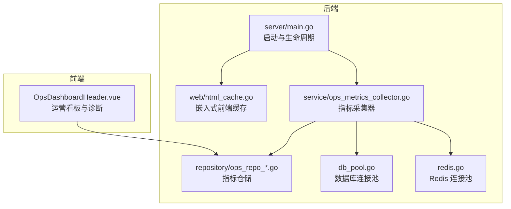
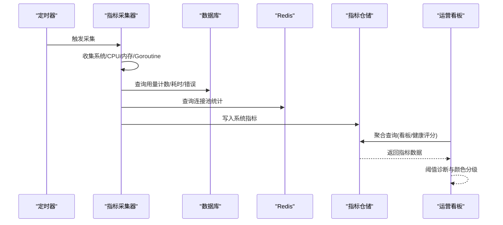
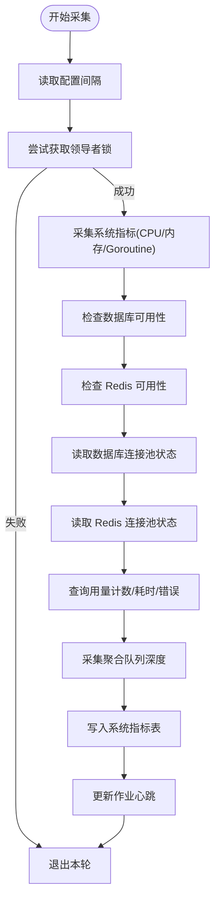
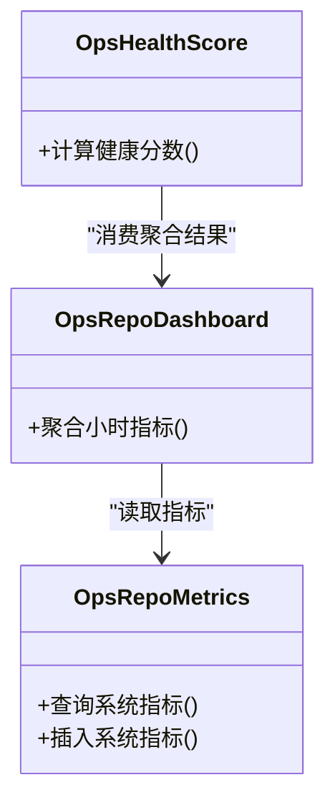
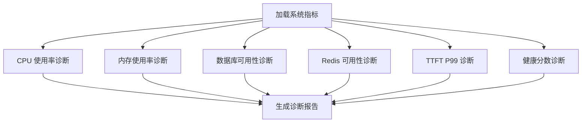
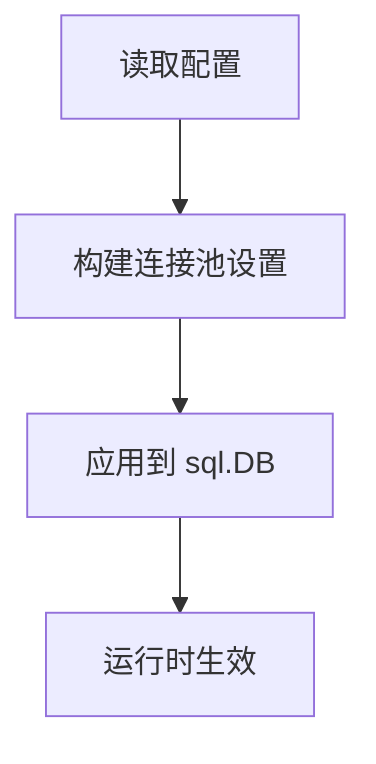
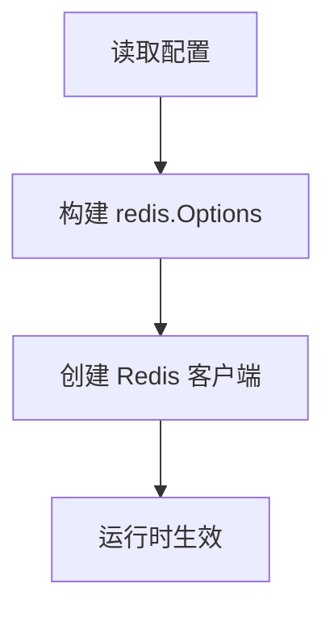
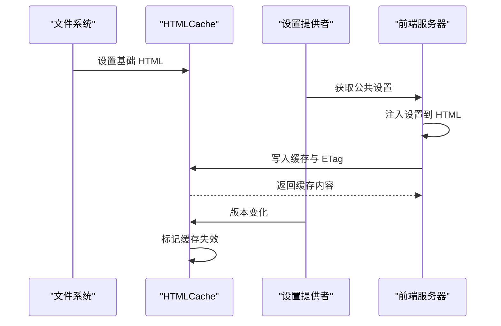
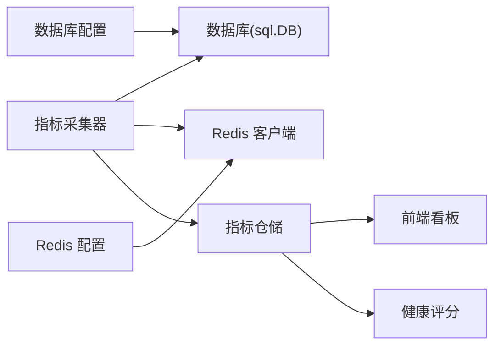

# 性能分析与优化

<cite>
**本文引用的文件**   
- [backend/internal/service/ops_metrics_collector.go](file://backend/internal/service/ops_metrics_collector.go)
- [backend/internal/repository/ops_repo_metrics.go](file://backend/internal/repository/ops_repo_metrics.go)
- [backend/internal/repository/ops_repo_dashboard.go](file://backend/internal/repository/ops_repo_dashboard.go)
- [backend/internal/service/ops_health_score.go](file://backend/internal/service/ops_health_score.go)
- [frontend/src/views/admin/ops/components/OpsDashboardHeader.vue](file://frontend/src/views/admin/ops/components/OpsDashboardHeader.vue)
- [backend/internal/repository/db_pool.go](file://backend/internal/repository/db_pool.go)
- [backend/internal/repository/redis.go](file://backend/internal/repository/redis.go)
- [backend/cmd/server/main.go](file://backend/cmd/server/main.go)
- [backend/internal/web/html_cache.go](file://backend/internal/web/html_cache.go)
- [backend/internal/web/embed_test.go](file://backend/internal/web/embed_test.go)
- [backend/internal/setup/handler.go](file://backend/internal/setup/handler.go)
</cite>

## 目录
1. [简介](#简介)
2. [项目结构](#项目结构)
3. [核心组件](#核心组件)
4. [架构总览](#架构总览)
5. [详细组件分析](#详细组件分析)
6. [依赖分析](#依赖分析)
7. [性能考虑](#性能考虑)
8. [故障排查指南](#故障排查指南)
9. [结论](#结论)
10. [附录](#附录)

## 简介
本指南围绕后端 Go 服务、前端 Web 应用、数据库与缓存系统的性能分析与优化展开，结合仓库中已有的指标采集、可视化与配置能力，提供一套可落地的实战方法论：包括系统资源与运行时指标采集、数据库连接池与查询性能、缓存连接池与命中率、前端页面加载与交互性能、以及端到端的性能优化流程。

## 项目结构
后端采用分层架构：入口与生命周期管理在命令行入口，业务服务层负责指标采集与健康评分，仓储层封装数据库与缓存访问，Web 层负责嵌入式前端与静态资源缓存；前端为独立的 Vue 应用，通过注入配置提升首屏性能。

**图表来源**
- [backend/cmd/server/main.go:134-182](file://backend/cmd/server/main.go#L134-L182)
- [backend/internal/web/html_cache.go:1-67](file://backend/internal/web/html_cache.go#L1-L67)
- [backend/internal/service/ops_metrics_collector.go:86-124](file://backend/internal/service/ops_metrics_collector.go#L86-L124)
- [backend/internal/repository/ops_repo_metrics.go:191-227](file://backend/internal/repository/ops_repo_metrics.go#L191-L227)
- [backend/internal/repository/db_pool.go:26-32](file://backend/internal/repository/db_pool.go#L26-L32)
- [backend/internal/repository/redis.go:23-49](file://backend/internal/repository/redis.go#L23-L49)
- [frontend/src/views/admin/ops/components/OpsDashboardHeader.vue:490-633](file://frontend/src/views/admin/ops/components/OpsDashboardHeader.vue#L490-L633)

**章节来源**
- [backend/cmd/server/main.go:134-182](file://backend/cmd/server/main.go#L134-L182)
- [backend/internal/web/html_cache.go:1-67](file://backend/internal/web/html_cache.go#L1-L67)
- [backend/internal/service/ops_metrics_collector.go:86-124](file://backend/internal/service/ops_metrics_collector.go#L86-L124)

## 核心组件
- 指标采集器：周期性收集系统资源、数据库/Redis 连接池状态、请求量与耗时、并发队列深度等，并写入指标表。
- 指标仓储：提供系统指标的查询与聚合接口，用于看板展示与健康评分。
- 健康评分：基于错误率与 TTFT 的加权计算，输出业务健康分数。
- 运营看板：前端根据系统指标进行阈值诊断与颜色分级，辅助快速定位问题。
- 数据库连接池：通过配置项控制最大连接数、空闲连接、生命周期与空闲时间。
- Redis 连接池：支持可配置的连接池大小、最小空闲连接与各类超时。
- 嵌入式前端缓存：对注入配置后的 index.html 进行缓存与 ETag 标识，降低重复注入成本。

**章节来源**
- [backend/internal/service/ops_metrics_collector.go:252-364](file://backend/internal/service/ops_metrics_collector.go#L252-L364)
- [backend/internal/repository/ops_repo_metrics.go:191-227](file://backend/internal/repository/ops_repo_metrics.go#L191-L227)
- [backend/internal/service/ops_health_score.go:34-67](file://backend/internal/service/ops_health_score.go#L34-L67)
- [frontend/src/views/admin/ops/components/OpsDashboardHeader.vue:490-633](file://frontend/src/views/admin/ops/components/OpsDashboardHeader.vue#L490-L633)
- [backend/internal/repository/db_pool.go:17-32](file://backend/internal/repository/db_pool.go#L17-L32)
- [backend/internal/repository/redis.go:23-49](file://backend/internal/repository/redis.go#L23-L49)
- [backend/internal/web/html_cache.go:11-67](file://backend/internal/web/html_cache.go#L11-L67)

## 架构总览
下图展示了从指标采集到前端可视化的端到端路径，以及数据库与缓存的关键调用点。

**图表来源**
- [backend/internal/service/ops_metrics_collector.go:158-220](file://backend/internal/service/ops_metrics_collector.go#L158-L220)
- [backend/internal/service/ops_metrics_collector.go:252-364](file://backend/internal/service/ops_metrics_collector.go#L252-L364)
- [backend/internal/repository/ops_repo_metrics.go:191-227](file://backend/internal/repository/ops_repo_metrics.go#L191-L227)
- [frontend/src/views/admin/ops/components/OpsDashboardHeader.vue:490-633](file://frontend/src/views/admin/ops/components/OpsDashboardHeader.vue#L490-L633)

## 详细组件分析

### 指标采集器（系统与业务指标）
- 周期性采集：支持从配置读取采集间隔，具备领导者锁避免多实例重复采集。
- 系统指标：优先从 cgroup 读取 CPU 使用率与内存使用，回退到主机级指标；记录 Goroutine 数与并发队列深度。
- 业务指标：统计窗口内成功/失败请求数、Token 消耗、QPS/TPS、时延分位值（P50/P90/P95/P99）、TTFT 分位值、上游错误分布、账户切换次数。
- 存储：将汇总结果写入系统指标表，并更新作业心跳。

**图表来源**
- [backend/internal/service/ops_metrics_collector.go:126-156](file://backend/internal/service/ops_metrics_collector.go#L126-L156)
- [backend/internal/service/ops_metrics_collector.go:179-185](file://backend/internal/service/ops_metrics_collector.go#L179-L185)
- [backend/internal/service/ops_metrics_collector.go:252-364](file://backend/internal/service/ops_metrics_collector.go#L252-L364)

**章节来源**
- [backend/internal/service/ops_metrics_collector.go:86-124](file://backend/internal/service/ops_metrics_collector.go#L86-L124)
- [backend/internal/service/ops_metrics_collector.go:158-220](file://backend/internal/service/ops_metrics_collector.go#L158-L220)
- [backend/internal/service/ops_metrics_collector.go:252-364](file://backend/internal/service/ops_metrics_collector.go#L252-L364)

### 指标仓储与看板聚合
- 指标仓储：提供系统指标的查询与聚合，包含 CPU/内存/连接池/队列深度等字段。
- 看板聚合：按小时/窗口聚合多个指标，计算 P50/P90/P95/P99、平均值与最大值，汇总成功率、错误数、上游错误等。
- 健康评分：以错误率与 TTFT 作为权重，计算业务健康分数，辅助快速判断系统健康度。

**图表来源**
- [backend/internal/repository/ops_repo_metrics.go:191-227](file://backend/internal/repository/ops_repo_metrics.go#L191-L227)
- [backend/internal/repository/ops_repo_dashboard.go:479-522](file://backend/internal/repository/ops_repo_dashboard.go#L479-L522)
- [backend/internal/service/ops_health_score.go:34-67](file://backend/internal/service/ops_health_score.go#L34-L67)

**章节来源**
- [backend/internal/repository/ops_repo_metrics.go:191-227](file://backend/internal/repository/ops_repo_metrics.go#L191-L227)
- [backend/internal/repository/ops_repo_dashboard.go:479-522](file://backend/internal/repository/ops_repo_dashboard.go#L479-L522)
- [backend/internal/service/ops_health_score.go:34-67](file://backend/internal/service/ops_health_score.go#L34-L67)

### 前端运营看板与诊断
- 资源诊断：对 CPU/内存/数据库/Redis 状态进行颜色分级提示，支持阈值告警。
- TTFT 诊断：对 P99 TTFT 进行阈值判断，给出影响与建议。
- 健康评分：综合错误率与 TTFT 计算健康分数，辅助整体评估。
- 交互与导航：前端测试覆盖导航加载状态与组件渲染，有助于定位前端性能问题。

**图表来源**
- [frontend/src/views/admin/ops/components/OpsDashboardHeader.vue:490-633](file://frontend/src/views/admin/ops/components/OpsDashboardHeader.vue#L490-L633)
- [frontend/src/views/admin/ops/components/OpsDashboardHeader.vue:710-1500](file://frontend/src/views/admin/ops/components/OpsDashboardHeader.vue#L710-L1500)
- [frontend/src/views/admin/ops/components/OpsDashboardHeader.vue:527-1354](file://frontend/src/views/admin/ops/components/OpsDashboardHeader.vue#L527-L1354)

**章节来源**
- [frontend/src/views/admin/ops/components/OpsDashboardHeader.vue:490-633](file://frontend/src/views/admin/ops/components/OpsDashboardHeader.vue#L490-L633)
- [frontend/src/views/admin/ops/components/OpsDashboardHeader.vue:710-1500](file://frontend/src/views/admin/ops/components/OpsDashboardHeader.vue#L710-L1500)
- [frontend/src/views/admin/ops/components/OpsDashboardHeader.vue:527-1354](file://frontend/src/views/admin/ops/components/OpsDashboardHeader.vue#L527-L1354)

### 数据库连接池优化
- 配置项：最大打开连接数、最大空闲连接数、连接最大生命周期、连接最大空闲时间。
- 应用：在应用启动时根据配置动态设置连接池参数，确保在高并发场景下稳定与低抖动。

**图表来源**
- [backend/internal/repository/db_pool.go:17-32](file://backend/internal/repository/db_pool.go#L17-L32)

**章节来源**
- [backend/internal/repository/db_pool.go:17-32](file://backend/internal/repository/db_pool.go#L17-L32)

### Redis 连接池优化
- 配置项：连接池大小、最小空闲连接、建连/读/写超时、TLS 开关。
- 应用：通过可配置选项构建 Redis 客户端，支持生产环境精细化调优，避免慢操作阻塞与连接不足。

**图表来源**
- [backend/internal/repository/redis.go:29-49](file://backend/internal/repository/redis.go#L29-L49)

**章节来源**
- [backend/internal/repository/redis.go:23-49](file://backend/internal/repository/redis.go#L23-L49)

### 嵌入式前端缓存与注入
- 缓存机制：对注入配置后的 index.html 进行缓存与 ETag 标识，避免重复注入开销。
- 注入逻辑：在 </head> 前注入脚本，注入公共配置，测试验证注入位置与内容。
- 设置变更：当设置版本变化时，使缓存失效，保证前端配置与后端一致。

**图表来源**
- [backend/internal/web/html_cache.go:11-67](file://backend/internal/web/html_cache.go#L11-L67)
- [backend/internal/web/embed_test.go:162-196](file://backend/internal/web/embed_test.go#L162-L196)

**章节来源**
- [backend/internal/web/html_cache.go:11-67](file://backend/internal/web/html_cache.go#L11-L67)
- [backend/internal/web/embed_test.go:162-196](file://backend/internal/web/embed_test.go#L162-L196)

## 依赖分析
- 指标采集器依赖数据库与 Redis 客户端，同时读取系统信息与并发队列深度，最终写入指标仓储。
- 指标仓储被前端看板与健康评分模块消费，形成闭环。
- 数据库与 Redis 的连接池参数由配置驱动，确保运行时可调优。

**图表来源**
- [backend/internal/service/ops_metrics_collector.go:252-364](file://backend/internal/service/ops_metrics_collector.go#L252-L364)
- [backend/internal/repository/ops_repo_metrics.go:191-227](file://backend/internal/repository/ops_repo_metrics.go#L191-L227)
- [backend/internal/repository/db_pool.go:17-32](file://backend/internal/repository/db_pool.go#L17-L32)
- [backend/internal/repository/redis.go:29-49](file://backend/internal/repository/redis.go#L29-L49)

**章节来源**
- [backend/internal/service/ops_metrics_collector.go:252-364](file://backend/internal/service/ops_metrics_collector.go#L252-L364)
- [backend/internal/repository/ops_repo_metrics.go:191-227](file://backend/internal/repository/ops_repo_metrics.go#L191-L227)
- [backend/internal/repository/db_pool.go:17-32](file://backend/internal/repository/db_pool.go#L17-L32)
- [backend/internal/repository/redis.go:29-49](file://backend/internal/repository/redis.go#L29-L49)

## 性能考虑
- 指标采集频率与领导者锁：通过配置化间隔与领导者锁避免重复采集与资源竞争。
- 系统指标采集：优先 cgroup 指标，回退主机指标，确保容器化环境准确性。
- 并发队列深度：通过并发服务采集聚合等待队列长度，辅助识别上游限流或下游拥塞。
- 数据库与 Redis：通过连接池参数与超时配置，平衡吞吐与延迟，避免连接泄漏与慢查询拖垮整体。
- 前端注入缓存：减少重复注入成本，提升首屏加载稳定性。

[本节为通用指导，不直接分析具体文件]

## 故障排查指南
- 指标缺失或异常：检查采集器是否启用、领导者锁是否获取成功、数据库/Redis 是否可用、采集间隔是否过短导致超时。
- 看板诊断不准确：核对系统指标阈值配置、前端颜色映射与健康评分权重。
- 数据库连接池问题：检查最大连接数、空闲连接、生命周期与空闲时间配置，观察活跃/空闲连接变化。
- Redis 连接池问题：检查连接池大小、最小空闲连接与超时配置，确认 TLS 设置与目标地址可达。
- 嵌入式前端注入异常：确认注入位置在 </head> 前，校验缓存是否失效与 ETag 是否更新。

**章节来源**
- [backend/internal/service/ops_metrics_collector.go:126-156](file://backend/internal/service/ops_metrics_collector.go#L126-L156)
- [backend/internal/service/ops_metrics_collector.go:179-185](file://backend/internal/service/ops_metrics_collector.go#L179-L185)
- [backend/internal/service/ops_metrics_collector.go:252-364](file://backend/internal/service/ops_metrics_collector.go#L252-L364)
- [frontend/src/views/admin/ops/components/OpsDashboardHeader.vue:490-633](file://frontend/src/views/admin/ops/components/OpsDashboardHeader.vue#L490-L633)
- [backend/internal/repository/db_pool.go:17-32](file://backend/internal/repository/db_pool.go#L17-L32)
- [backend/internal/repository/redis.go:29-49](file://backend/internal/repository/redis.go#L29-L49)
- [backend/internal/web/html_cache.go:40-48](file://backend/internal/web/html_cache.go#L40-L48)

## 结论
本项目提供了从系统指标采集、仓储聚合、健康评分到前端可视化的完整链路。结合数据库与 Redis 的连接池配置，可在不同运行环境下实现稳定与高性能。建议在生产中持续关注采集间隔、连接池参数与前端注入缓存策略，并以看板阈值与健康分数为依据，建立系统性的性能优化闭环。

[本节为总结，不直接分析具体文件]

## 附录
- 启动与生命周期：主程序负责日志初始化、配置加载、应用初始化与优雅关闭。
- Redis 连接测试：安装流程中提供 Redis 连通性测试接口，便于部署阶段验证。

**章节来源**
- [backend/cmd/server/main.go:134-182](file://backend/cmd/server/main.go#L134-L182)
- [backend/internal/setup/handler.go:208-222](file://backend/internal/setup/handler.go#L208-L222)