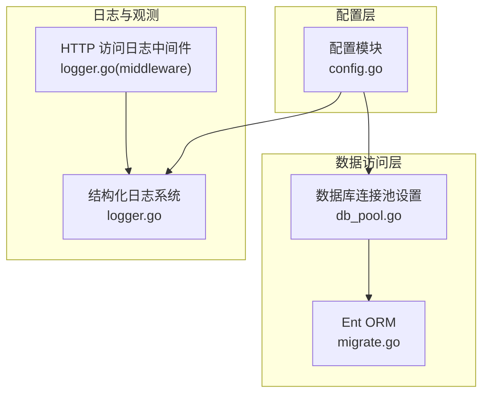
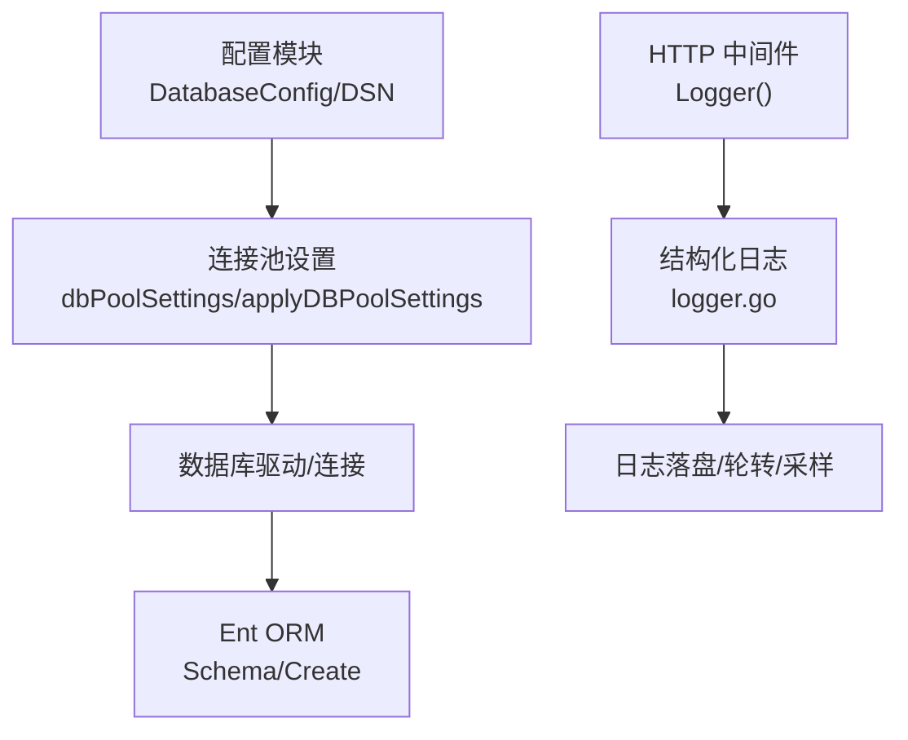
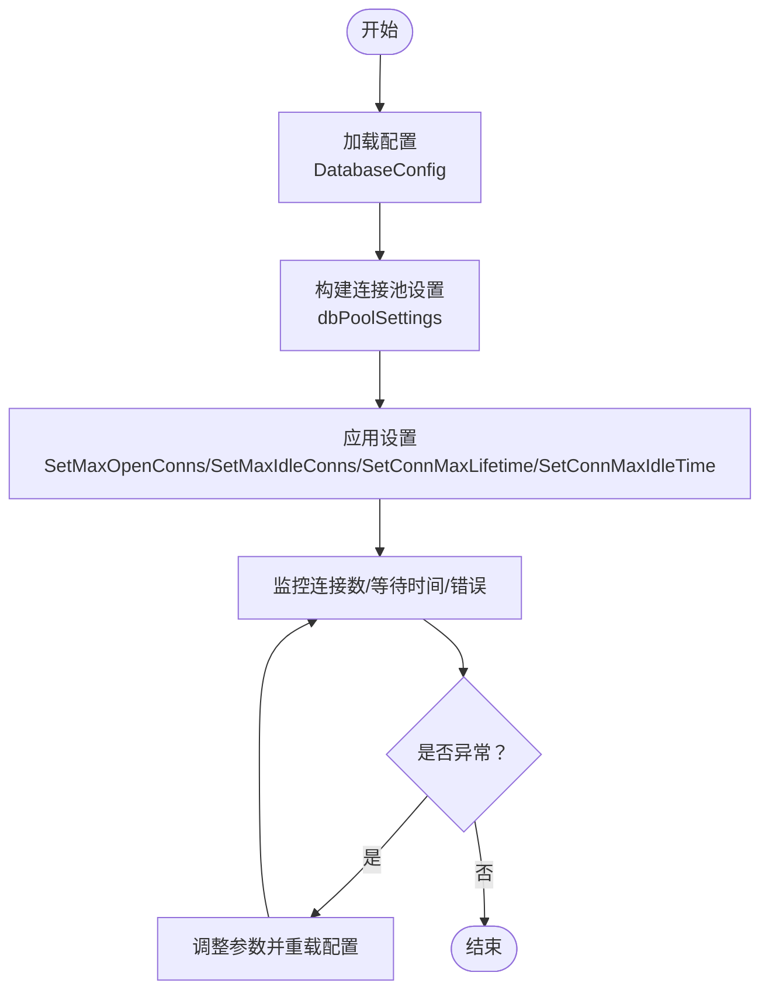
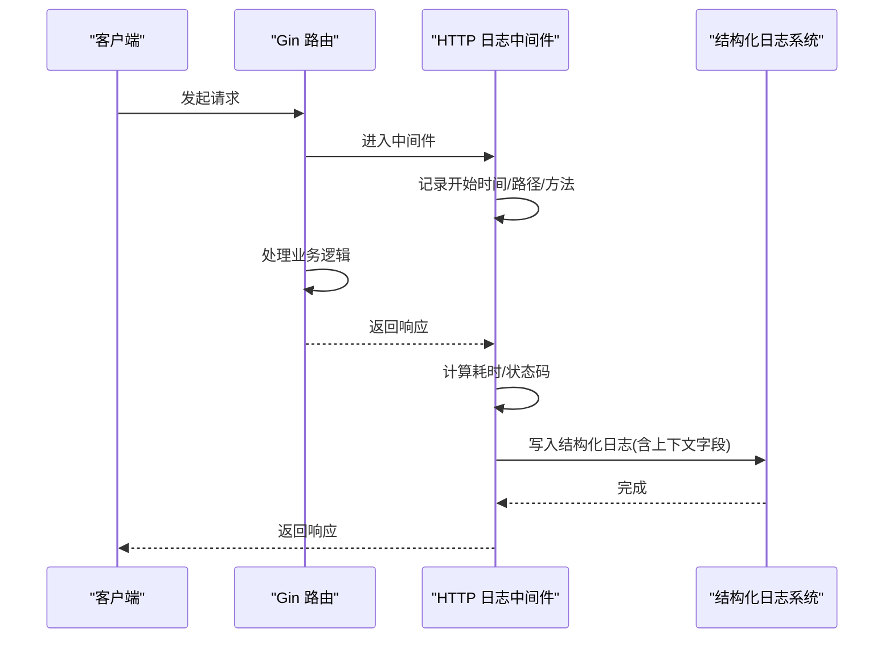
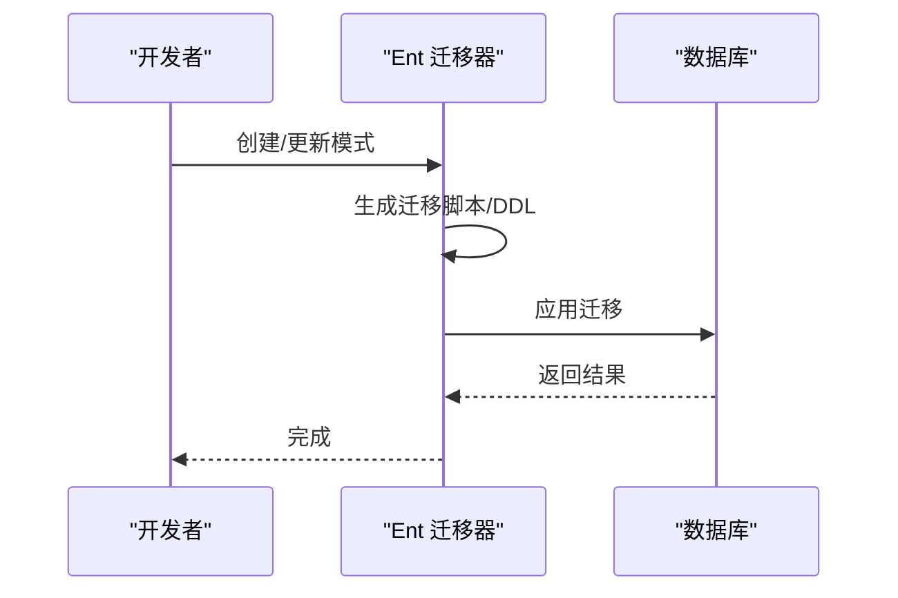
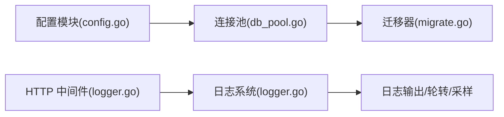

# 数据库调试与分析

<cite>
**本文引用的文件**
- [backend/internal/repository/db_pool.go](file://backend/internal/repository/db_pool.go)
- [backend/internal/config/config.go](file://backend/internal/config/config.go)
- [backend/ent/migrate/migrate.go](file://backend/ent/migrate/migrate.go)
- [backend/internal/pkg/logger/logger.go](file://backend/internal/pkg/logger/logger.go)
- [backend/internal/server/middleware/logger.go](file://backend/internal/server/middleware/logger.go)
</cite>

## 目录
1. [简介](#简介)
2. [项目结构](#项目结构)
3. [核心组件](#核心组件)
4. [架构总览](#架构总览)
5. [详细组件分析](#详细组件分析)
6. [依赖分析](#依赖分析)
7. [性能考虑](#性能考虑)
8. [故障排查指南](#故障排查指南)
9. [结论](#结论)
10. [附录](#附录)

## 简介
本指南面向数据库调试与性能分析，围绕 PostgreSQL 慢查询日志配置与分析、SQL 执行计划解读、Ent ORM 调试、数据库连接池调试以及性能优化流程展开。文档结合仓库中的配置与日志基础设施，给出可落地的实践步骤与可视化图示，帮助快速定位慢查询、识别性能瓶颈，并制定优化方案。

## 项目结构
本项目后端采用 Go + Gin + Ent 架构，数据库连接池参数通过配置模块集中管理，日志系统基于结构化日志库构建，HTTP 层提供统一访问日志中间件。迁移与模式变更通过 Ent 自动生成的迁移器处理。

图表来源
- [backend/internal/config/config.go:677-727](file://backend/internal/config/config.go#L677-L727)
- [backend/internal/repository/db_pool.go:17-32](file://backend/internal/repository/db_pool.go#L17-L32)
- [backend/ent/migrate/migrate.go:36-55](file://backend/ent/migrate/migrate.go#L36-L55)
- [backend/internal/pkg/logger/logger.go:241-317](file://backend/internal/pkg/logger/logger.go#L241-L317)
- [backend/internal/server/middleware/logger.go:12-66](file://backend/internal/server/middleware/logger.go#L12-L66)

章节来源
- [backend/internal/config/config.go:677-727](file://backend/internal/config/config.go#L677-L727)
- [backend/internal/repository/db_pool.go:17-32](file://backend/internal/repository/db_pool.go#L17-L32)
- [backend/ent/migrate/migrate.go:36-55](file://backend/ent/migrate/migrate.go#L36-L55)
- [backend/internal/pkg/logger/logger.go:241-317](file://backend/internal/pkg/logger/logger.go#L241-L317)
- [backend/internal/server/middleware/logger.go:12-66](file://backend/internal/server/middleware/logger.go#L12-L66)

## 核心组件
- 数据库连接池设置：集中管理最大连接数、空闲连接数、连接生命周期等参数，确保资源可控与性能稳定。
- 配置模块：提供数据库 DSN 生成、时区注入、连接池参数化等能力。
- 结构化日志系统：统一日志编码、输出、轮转与采样，支持可观测性下沉。
- HTTP 访问日志中间件：记录请求路径、状态码、耗时、客户端 IP、平台/模型等上下文信息。
- Ent 迁移器：封装表结构创建、迁移选项与写入模式，便于版本化管理。

章节来源
- [backend/internal/repository/db_pool.go:10-32](file://backend/internal/repository/db_pool.go#L10-L32)
- [backend/internal/config/config.go:677-727](file://backend/internal/config/config.go#L677-L727)
- [backend/internal/pkg/logger/logger.go:241-317](file://backend/internal/pkg/logger/logger.go#L241-L317)
- [backend/internal/server/middleware/logger.go:12-66](file://backend/internal/server/middleware/logger.go#L12-L66)
- [backend/ent/migrate/migrate.go:36-55](file://backend/ent/migrate/migrate.go#L36-L55)

## 架构总览
数据库调试与性能分析涉及“配置—连接—日志—ORM—迁移”的全链路协同。配置模块负责连接参数与 DSN；连接池模块应用参数；日志中间件与结构化日志系统提供可观测性；Ent 迁移器保证模式一致性。

图表来源
- [backend/internal/config/config.go:677-727](file://backend/internal/config/config.go#L677-L727)
- [backend/internal/repository/db_pool.go:17-32](file://backend/internal/repository/db_pool.go#L17-L32)
- [backend/ent/migrate/migrate.go:36-55](file://backend/ent/migrate/migrate.go#L36-L55)
- [backend/internal/server/middleware/logger.go:12-66](file://backend/internal/server/middleware/logger.go#L12-L66)
- [backend/internal/pkg/logger/logger.go:241-317](file://backend/internal/pkg/logger/logger.go#L241-L317)

## 详细组件分析

### 组件A：数据库连接池调试
- 目标：通过连接池参数控制并发、空闲与生命周期，避免连接争用与泄漏。
- 关键点：
  - 最大打开连接数：限制数据库连接上限，防止资源耗尽。
  - 最大空闲连接数：保持热连接，降低建连延迟。
  - 连接最大存活时间：定期回收长连接，避免资源泄漏。
  - 空闲连接最大存活时间：及时释放不活跃连接。
- 实践建议：
  - 将连接池参数纳入配置模块，便于环境差异化调优。
  - 结合慢查询与高并发场景，逐步调整参数并观察指标变化。
  - 使用日志中间件记录请求耗时，定位异常慢请求与连接争用。

图表来源
- [backend/internal/config/config.go:677-727](file://backend/internal/config/config.go#L677-L727)
- [backend/internal/repository/db_pool.go:17-32](file://backend/internal/repository/db_pool.go#L17-L32)

章节来源
- [backend/internal/repository/db_pool.go:10-32](file://backend/internal/repository/db_pool.go#L10-L32)
- [backend/internal/config/config.go:677-727](file://backend/internal/config/config.go#L677-L727)

### 组件B：结构化日志与慢查询观测
- 目标：通过统一日志编码与输出，沉淀慢查询与异常请求的可观测性数据。
- 关键点：
  - 编码器：支持 JSON/Console 输出，便于日志系统解析与检索。
  - 输出：同时输出至标准输出与文件，支持轮转与压缩。
  - 采样：对高频日志进行采样，降低观测成本。
  - 中间件：记录 HTTP 请求耗时、状态码、路径、客户端 IP、平台/模型等上下文。
- 实践建议：
  - 在慢查询路径上增加结构化字段（如耗时、SQL 片段、参数摘要），便于检索。
  - 结合日志聚合平台，建立慢查询告警规则（如 P95/P99 耗时阈值）。

图表来源
- [backend/internal/server/middleware/logger.go:12-66](file://backend/internal/server/middleware/logger.go#L12-L66)
- [backend/internal/pkg/logger/logger.go:241-317](file://backend/internal/pkg/logger/logger.go#L241-L317)

章节来源
- [backend/internal/server/middleware/logger.go:12-66](file://backend/internal/server/middleware/logger.go#L12-L66)
- [backend/internal/pkg/logger/logger.go:241-317](file://backend/internal/pkg/logger/logger.go#L241-L317)

### 组件C：Ent ORM 调试与 SQL 生成跟踪
- 目标：通过迁移器与模式管理，确保数据库结构一致；结合日志与中间件，追踪 SQL 生成与执行。
- 关键点：
  - 迁移器封装：提供创建、写入迁移脚本等能力，支持迁移选项。
  - 模式一致性：通过自动生成的迁移器维护表结构，减少手工变更风险。
- 实践建议：
  - 在开发/测试环境开启 SQL 生成跟踪，记录生成的 SQL 与参数。
  - 对热点查询进行 EXPLAIN ANALYZE，结合日志中的耗时字段定位瓶颈。

图表来源
- [backend/ent/migrate/migrate.go:36-55](file://backend/ent/migrate/migrate.go#L36-L55)

章节来源
- [backend/ent/migrate/migrate.go:36-55](file://backend/ent/migrate/migrate.go#L36-L55)

### 组件D：SQL 执行计划分析与索引检查
- 目标：通过 EXPLAIN ANALYZE 与索引检查，识别慢查询与瓶颈。
- 关键点：
  - 执行计划解读：关注扫描方式、过滤条件、连接顺序、排序/临时表等。
  - 索引使用：确认 WHERE、JOIN、ORDER BY、GROUP BY 是否命中索引。
  - 重写建议：合并条件、避免函数作用于列、拆分复杂查询、使用覆盖索引。
- 实践建议：
  - 将慢查询纳入日志，结合执行计划与索引使用情况制定优化方案。
  - 对高频查询建立基准测试，评估优化前后效果。

（本节为通用方法论，不直接分析具体文件，故无章节来源）

## 依赖分析
- 配置模块依赖数据库连接池设置模块，后者将配置转换为运行时参数。
- 日志系统与 HTTP 中间件共同构成可观测性基座，为慢查询与异常定位提供数据支撑。
- Ent 迁移器与数据库驱动协作，确保模式一致性。

图表来源
- [backend/internal/config/config.go:677-727](file://backend/internal/config/config.go#L677-L727)
- [backend/internal/repository/db_pool.go:17-32](file://backend/internal/repository/db_pool.go#L17-L32)
- [backend/ent/migrate/migrate.go:36-55](file://backend/ent/migrate/migrate.go#L36-L55)
- [backend/internal/server/middleware/logger.go:12-66](file://backend/internal/server/middleware/logger.go#L12-L66)
- [backend/internal/pkg/logger/logger.go:241-317](file://backend/internal/pkg/logger/logger.go#L241-L317)

章节来源
- [backend/internal/config/config.go:677-727](file://backend/internal/config/config.go#L677-L727)
- [backend/internal/repository/db_pool.go:17-32](file://backend/internal/repository/db_pool.go#L17-L32)
- [backend/ent/migrate/migrate.go:36-55](file://backend/ent/migrate/migrate.go#L36-L55)
- [backend/internal/server/middleware/logger.go:12-66](file://backend/internal/server/middleware/logger.go#L12-L66)
- [backend/internal/pkg/logger/logger.go:241-317](file://backend/internal/pkg/logger/logger.go#L241-L317)

## 性能考虑
- 连接池参数：根据并发与数据库承载能力动态调整，避免过度连接或连接不足。
- 日志采样：对高频路径启用采样，平衡可观测性与性能。
- 查询优化：优先优化热点路径，配合索引与查询重写，持续回归测试。
- 模式演进：通过迁移器进行结构变更，确保生产环境一致性与可追溯性。

（本节为通用指导，不直接分析具体文件，故无章节来源）

## 故障排查指南
- 慢查询定位
  - 使用日志中间件记录请求耗时与上下文，筛选异常路径。
  - 对疑似慢查询执行 EXPLAIN ANALYZE，检查扫描方式与索引使用。
- 连接池问题
  - 观察连接池指标：打开连接数、空闲连接数、等待时间、超时错误。
  - 调整最大连接数与生命周期参数，避免资源耗尽或泄漏。
- 死锁与阻塞
  - 结合数据库锁等待与事务日志，定位冲突对象与持有者。
  - 优化事务粒度与顺序，减少锁竞争。
- 连接泄漏排查
  - 定期巡检连接池状态，核对连接生命周期与空闲回收策略。
  - 在业务层确保连接正确关闭，避免未释放连接。

章节来源
- [backend/internal/server/middleware/logger.go:12-66](file://backend/internal/server/middleware/logger.go#L12-L66)
- [backend/internal/pkg/logger/logger.go:241-317](file://backend/internal/pkg/logger/logger.go#L241-L317)
- [backend/internal/repository/db_pool.go:17-32](file://backend/internal/repository/db_pool.go#L17-L32)

## 结论
通过配置化连接池参数、结构化日志与 HTTP 中间件、以及 Ent 迁移器的协同，本项目具备完善的数据库调试与性能分析基础。结合 EXPLAIN ANALYZE 与索引检查，可系统性地定位慢查询与瓶颈；配合连接池调优与模式治理，可持续提升系统稳定性与性能。

## 附录
- PostgreSQL 慢查询日志配置要点
  - 设置阈值：将慢查询阈值设为可接受范围，避免日志风暴。
  - 开启统计：启用查询统计与执行计划收集，便于分析。
  - 日志轮转：结合日志系统轮转策略，确保长期留存与检索效率。
- SQL 执行计划解读要点
  - 关注全表扫描与索引扫描的选择，优先使用索引。
  - 检查排序与临时表，必要时添加合适索引或重写查询。
  - 评估连接顺序与连接类型，避免不必要的嵌套循环。
- Ent ORM 调试建议
  - 在开发环境开启 SQL 生成跟踪，记录生成的 SQL 与参数。
  - 对热点实体建立基准测试，评估迁移与查询优化效果。

（本节为通用方法论，不直接分析具体文件，故无章节来源）