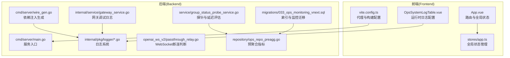
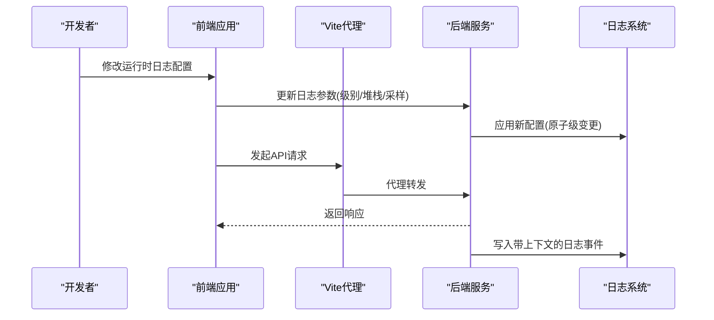
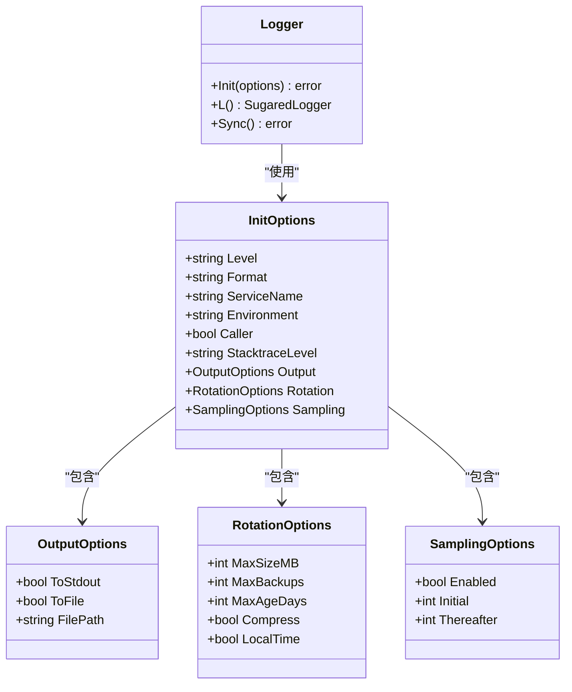
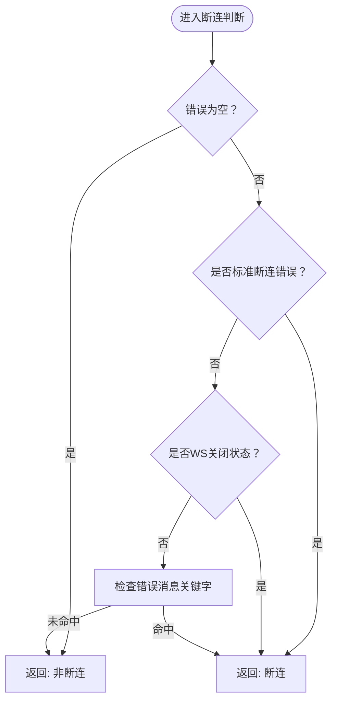
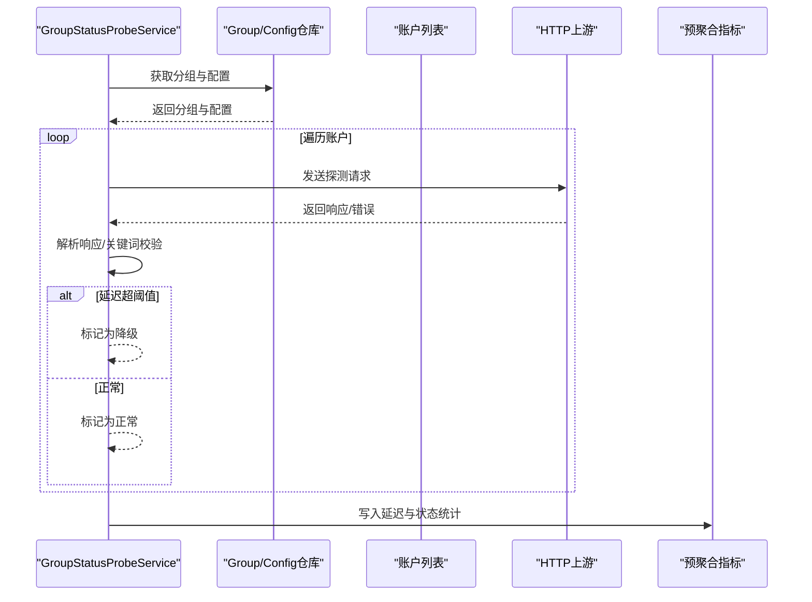
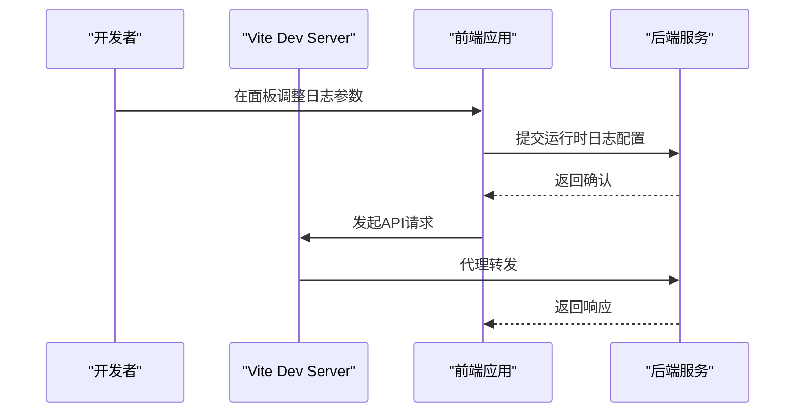
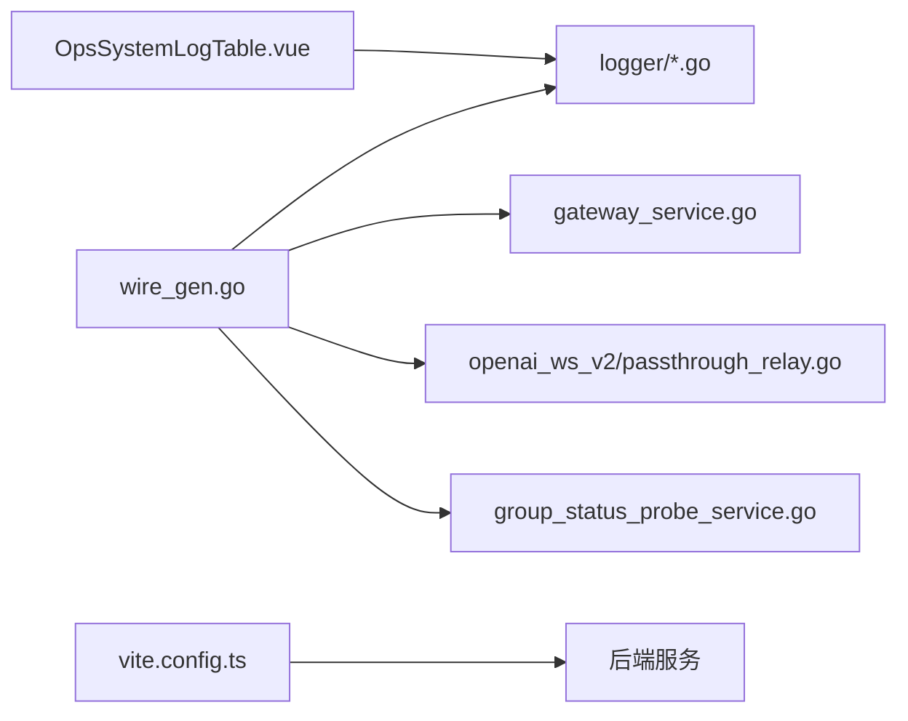

# 调试技巧与工具

<cite>
**本文引用的文件**
- [backend/internal/pkg/logger/logger.go](file://backend/internal/pkg/logger/logger.go)
- [backend/internal/pkg/logger/options.go](file://backend/internal/pkg/logger/options.go)
- [backend/internal/pkg/logger/config_adapter.go](file://backend/internal/pkg/logger/config_adapter.go)
- [backend/internal/pkg/logger/logger_test.go](file://backend/internal/pkg/logger/logger_test.go)
- [backend/internal/service/gateway_service.go](file://backend/internal/service/gateway_service.go)
- [backend/internal/handler/openai_gateway_handler.go](file://backend/internal/handler/openai_gateway_handler.go)
- [backend/internal/service/openai_ws_v2/passthrough_relay.go](file://backend/internal/service/openai_ws_v2/passthrough_relay.go)
- [backend/internal/service/group_status_probe_service.go](file://backend/internal/service/group_status_probe_service.go)
- [backend/internal/repository/ops_repo_preagg.go](file://backend/internal/repository/ops_repo_preagg.go)
- [backend/migrations/033_ops_monitoring_vnext.sql](file://backend/migrations/033_ops_monitoring_vnext.sql)
- [frontend/vite.config.ts](file://frontend/vite.config.ts)
- [frontend/src/views/admin/ops/components/OpsSystemLogTable.vue](file://frontend/src/views/admin/ops/components/OpsSystemLogTable.vue)
- [frontend/src/stores/app.ts](file://frontend/src/stores/app.ts)
- [frontend/src/App.vue](file://frontend/src/App.vue)
- [backend/cmd/server/wire_gen.go](file://backend/cmd/server/wire_gen.go)
</cite>

## 目录
1. [简介](#简介)
2. [项目结构](#项目结构)
3. [核心组件](#核心组件)
4. [架构总览](#架构总览)
5. [详细组件分析](#详细组件分析)
6. [依赖分析](#依赖分析)
7. [性能考虑](#性能考虑)
8. [故障排查指南](#故障排查指南)
9. [结论](#结论)
10. [附录](#附录)

## 简介
本指南面向Sub2API项目的开发与运维人员，系统性介绍后端Go服务、前端Vue应用、数据库与分布式系统的调试方法与工具使用。内容覆盖：
- Go后端：Delve调试器、日志体系、pprof性能分析、内存泄漏检测
- 前端Vue：浏览器开发者工具、Vue DevTools、网络请求与组件状态调试
- 数据库：PostgreSQL慢查询日志、执行计划分析、索引优化
- 分布式系统：链路追踪、服务间调用分析、负载均衡问题排查
- 常见问题：API调用失败、性能瓶颈、内存溢出的定位与解决流程

## 项目结构
Sub2API采用前后端分离架构，后端以Go语言实现，前端基于Vue生态，数据库为PostgreSQL，通过网关与上游模型服务交互，并内置可观测性与日志能力。

图表来源
- [frontend/src/App.vue:1-43](file://frontend/src/App.vue#L1-L43)
- [frontend/src/stores/app.ts:44-463](file://frontend/src/stores/app.ts#L44-L463)
- [frontend/vite.config.ts:130-149](file://frontend/vite.config.ts#L130-L149)
- [frontend/src/views/admin/ops/components/OpsSystemLogTable.vue:374-397](file://frontend/src/views/admin/ops/components/OpsSystemLogTable.vue#L374-L397)
- [backend/cmd/server/wire_gen.go:1-31](file://backend/cmd/server/wire_gen.go#L1-L31)
- [backend/internal/pkg/logger/logger.go:1-357](file://backend/internal/pkg/logger/logger.go#L1-L357)
- [backend/internal/service/gateway_service.go:8731-8763](file://backend/internal/service/gateway_service.go#L8731-L8763)
- [backend/internal/service/openai_ws_v2/passthrough_relay.go:724-762](file://backend/internal/service/openai_ws_v2/passthrough_relay.go#L724-L762)
- [backend/internal/service/group_status_probe_service.go:62-807](file://backend/internal/service/group_status_probe_service.go#L62-L807)
- [backend/internal/repository/ops_repo_preagg.go:51-56](file://backend/internal/repository/ops_repo_preagg.go#L51-L56)
- [backend/migrations/033_ops_monitoring_vnext.sql:541-571](file://backend/migrations/033_ops_monitoring_vnext.sql#L541-L571)

章节来源
- [frontend/vite.config.ts:130-149](file://frontend/vite.config.ts#L130-L149)
- [backend/cmd/server/wire_gen.go:1-31](file://backend/cmd/server/wire_gen.go#L1-L31)

## 核心组件
- 日志系统：统一初始化、格式化、轮转、采样与运行时级别调整，支持控制台与文件双输出。
- 网关调试：可配置的网关请求体调试日志文件，便于定位上游交互异常。
- WebSocket断连判定：对EOF、连接关闭、异常消息进行归类，辅助流式响应问题排查。
- 探针与延迟评估：HTTP探测、关键词校验、慢响应阈值，结合预聚合指标定位性能瓶颈。
- 前端代理与运行时日志：开发环境代理后端API，运行时日志配置面板动态调整日志策略。

章节来源
- [backend/internal/pkg/logger/logger.go:67-317](file://backend/internal/pkg/logger/logger.go#L67-L317)
- [backend/internal/pkg/logger/options.go:16-92](file://backend/internal/pkg/logger/options.go#L16-L92)
- [backend/internal/pkg/logger/config_adapter.go:5-31](file://backend/internal/pkg/logger/config_adapter.go#L5-L31)
- [backend/internal/service/gateway_service.go:8731-8763](file://backend/internal/service/gateway_service.go#L8731-L8763)
- [backend/internal/handler/openai_gateway_handler.go:1630-1648](file://backend/internal/handler/openai_gateway_handler.go#L1630-L1648)
- [backend/internal/service/openai_ws_v2/passthrough_relay.go:724-762](file://backend/internal/service/openai_ws_v2/passthrough_relay.go#L724-L762)
- [backend/internal/service/group_status_probe_service.go:62-807](file://backend/internal/service/group_status_probe_service.go#L62-L807)
- [frontend/vite.config.ts:130-149](file://frontend/vite.config.ts#L130-L149)
- [frontend/src/views/admin/ops/components/OpsSystemLogTable.vue:374-397](file://frontend/src/views/admin/ops/components/OpsSystemLogTable.vue#L374-L397)

## 架构总览
后端服务通过Wire生成依赖注入图，统一接入日志系统；前端在开发模式下通过Vite代理转发到后端；运行时日志配置由前端面板下发，后端动态调整日志级别与堆栈阈值。

图表来源
- [frontend/src/views/admin/ops/components/OpsSystemLogTable.vue:374-397](file://frontend/src/views/admin/ops/components/OpsSystemLogTable.vue#L374-L397)
- [backend/internal/pkg/logger/logger.go:303-317](file://backend/internal/pkg/logger/logger.go#L303-L317)
- [frontend/vite.config.ts:130-149](file://frontend/vite.config.ts#L130-L149)

## 详细组件分析

### 后端日志系统与运行时配置
- 初始化选项：支持级别、格式、服务名、环境、调用者信息、堆栈阈值、输出目标、轮转策略、采样策略等。
- 双输出：同时输出到标准输出与文件，文件采用lumberjack轮转。
- 运行时调整：通过原子级别与字段注入，支持热更新日志策略。
- 配置适配：从配置对象映射到初始化选项，确保一致性。

图表来源
- [backend/internal/pkg/logger/options.go:16-92](file://backend/internal/pkg/logger/options.go#L16-L92)
- [backend/internal/pkg/logger/logger.go:67-317](file://backend/internal/pkg/logger/logger.go#L67-L317)

章节来源
- [backend/internal/pkg/logger/options.go:16-92](file://backend/internal/pkg/logger/options.go#L16-L92)
- [backend/internal/pkg/logger/logger.go:67-317](file://backend/internal/pkg/logger/logger.go#L67-L317)
- [backend/internal/pkg/logger/config_adapter.go:5-31](file://backend/internal/pkg/logger/config_adapter.go#L5-L31)
- [backend/internal/pkg/logger/logger_test.go:12-192](file://backend/internal/pkg/logger/logger_test.go#L12-L192)

### 网关调试日志与断连处理
- 网关调试：支持根据环境变量或路径配置开启调试日志文件，自动创建目录与追加写入。
- WebSocket断连：对EOF、连接关闭、异常消息进行分类，区分正常关闭与异常中断。
- 关闭原因摘要：提取WS关闭码与原因，便于快速定位会话异常。

图表来源
- [backend/internal/service/openai_ws_v2/passthrough_relay.go:724-762](file://backend/internal/service/openai_ws_v2/passthrough_relay.go#L724-L762)

章节来源
- [backend/internal/service/gateway_service.go:8731-8763](file://backend/internal/service/gateway_service.go#L8731-L8763)
- [backend/internal/handler/openai_gateway_handler.go:1630-1648](file://backend/internal/handler/openai_gateway_handler.go#L1630-L1648)
- [backend/internal/service/openai_ws_v2/passthrough_relay.go:724-762](file://backend/internal/service/openai_ws_v2/passthrough_relay.go#L724-L762)

### 探针与延迟评估
- 探针执行：加载分组与配置，尝试默认配置并持久化；逐个账户执行探测，记录首次失败详情与最后失败结果。
- JSON解析与HTTP请求：限制读取大小，非2xx视为错误；解析成功后进行关键词校验。
- 结果收敛：根据延迟阈值与关键词匹配结果，确定最终状态（正常/降级/异常）。

图表来源
- [backend/internal/service/group_status_probe_service.go:62-807](file://backend/internal/service/group_status_probe_service.go#L62-L807)
- [backend/internal/repository/ops_repo_preagg.go:51-56](file://backend/internal/repository/ops_repo_preagg.go#L51-L56)

章节来源
- [backend/internal/service/group_status_probe_service.go:62-807](file://backend/internal/service/group_status_probe_service.go#L62-L807)
- [backend/internal/repository/ops_repo_preagg.go:51-56](file://backend/internal/repository/ops_repo_preagg.go#L51-L56)

### 前端代理与运行时日志配置
- 开发代理：Vite服务器将/api、/v1、/setup转发至后端地址，便于本地联调。
- 运行时日志：前端提供日志级别、堆栈阈值、采样参数与保留天数配置，实时生效。
- 全局状态：应用启动时动态更新favicon与文档标题，提升用户体验。

图表来源
- [frontend/vite.config.ts:130-149](file://frontend/vite.config.ts#L130-L149)
- [frontend/src/views/admin/ops/components/OpsSystemLogTable.vue:374-397](file://frontend/src/views/admin/ops/components/OpsSystemLogTable.vue#L374-L397)
- [frontend/src/App.vue:18-43](file://frontend/src/App.vue#L18-L43)

章节来源
- [frontend/vite.config.ts:130-149](file://frontend/vite.config.ts#L130-L149)
- [frontend/src/views/admin/ops/components/OpsSystemLogTable.vue:374-397](file://frontend/src/views/admin/ops/components/OpsSystemLogTable.vue#L374-L397)
- [frontend/src/App.vue:18-43](file://frontend/src/App.vue#L18-L43)

## 依赖分析
- 组件耦合：日志系统作为基础设施被广泛使用；网关与WebSocket处理模块依赖日志；探针服务依赖仓库与上游HTTP客户端；前端通过Vite代理依赖后端服务。
- 外部依赖：日志使用zap与lumberjack；依赖注入使用Wire；前端使用Vue与Pinia；数据库为PostgreSQL。
- 潜在环路：当前结构以Wire生成的注入图为主，未发现直接循环依赖；日志与服务层解耦良好。

图表来源
- [backend/cmd/server/wire_gen.go:1-31](file://backend/cmd/server/wire_gen.go#L1-L31)
- [backend/internal/pkg/logger/logger.go:1-357](file://backend/internal/pkg/logger/logger.go#L1-L357)
- [backend/internal/service/gateway_service.go:8731-8763](file://backend/internal/service/gateway_service.go#L8731-L8763)
- [backend/internal/service/openai_ws_v2/passthrough_relay.go:724-762](file://backend/internal/service/openai_ws_v2/passthrough_relay.go#L724-L762)
- [backend/internal/service/group_status_probe_service.go:62-807](file://backend/internal/service/group_status_probe_service.go#L62-L807)
- [frontend/vite.config.ts:130-149](file://frontend/vite.config.ts#L130-L149)
- [frontend/src/views/admin/ops/components/OpsSystemLogTable.vue:374-397](file://frontend/src/views/admin/ops/components/OpsSystemLogTable.vue#L374-L397)

章节来源
- [backend/cmd/server/wire_gen.go:1-31](file://backend/cmd/server/wire_gen.go#L1-L31)

## 性能考虑
- 日志采样：通过采样初始/后续参数降低高并发下的日志写入开销。
- 文件轮转：合理设置最大尺寸、备份数与保留天数，避免磁盘压力。
- 预聚合指标：利用p50/p90/p95/p99与avg/max等字段，减少大屏查询时的扫描范围。
- 索引优化：启用pg_trgm扩展，对模糊检索字段建立Gin索引，提升错误日志检索效率。

章节来源
- [backend/internal/pkg/logger/options.go:83-91](file://backend/internal/pkg/logger/options.go#L83-L91)
- [backend/internal/repository/ops_repo_preagg.go:51-56](file://backend/internal/repository/ops_repo_preagg.go#L51-L56)
- [backend/migrations/033_ops_monitoring_vnext.sql:541-571](file://backend/migrations/033_ops_monitoring_vnext.sql#L541-L571)

## 故障排查指南

### API调用失败
- 检查前端代理：确认Vite代理是否正确指向后端地址。
- 查看网关调试日志：确认请求体与响应体是否被正确记录。
- 定位WebSocket断连：根据关闭码与原因，判断是客户端主动关闭还是服务端异常。
- 探针结果：核对账户可用性与延迟阈值，确认是否存在降级或异常状态。

章节来源
- [frontend/vite.config.ts:130-149](file://frontend/vite.config.ts#L130-L149)
- [backend/internal/service/gateway_service.go:8731-8763](file://backend/internal/service/gateway_service.go#L8731-L8763)
- [backend/internal/handler/openai_gateway_handler.go:1630-1648](file://backend/internal/handler/openai_gateway_handler.go#L1630-L1648)
- [backend/internal/service/openai_ws_v2/passthrough_relay.go:724-762](file://backend/internal/service/openai_ws_v2/passthrough_relay.go#L724-L762)
- [backend/internal/service/group_status_probe_service.go:62-807](file://backend/internal/service/group_status_probe_service.go#L62-L807)

### 性能瓶颈
- 启用pprof：在生产环境谨慎开启，采集CPU/内存/阻塞/互斥等样本，结合火焰图定位热点。
- 分析预聚合指标：关注p95/p99与avg/max延迟，识别长尾与突发峰值。
- 索引与查询：对高频过滤字段建立合适索引，避免全表扫描；使用EXPLAIN/EXPLAIN ANALYZE分析执行计划。
- 日志级别与采样：适当提高日志级别与采样率，减少I/O与GC压力。

章节来源
- [backend/internal/repository/ops_repo_preagg.go:51-56](file://backend/internal/repository/ops_repo_preagg.go#L51-L56)
- [backend/migrations/033_ops_monitoring_vnext.sql:541-571](file://backend/migrations/033_ops_monitoring_vnext.sql#L541-L571)

### 内存溢出
- 使用pprof heap分析：对比不同时间点的堆快照，定位增长对象与分配路径。
- 检查日志轮转：确保文件大小与备份数配置合理，避免日志文件过大导致内存占用上升。
- 探针与上游请求：限制读取大小，避免过大的响应体导致内存峰值。

章节来源
- [backend/internal/pkg/logger/options.go:74-82](file://backend/internal/pkg/logger/options.go#L74-L82)
- [backend/internal/service/openai_ws_v2/passthrough_relay.go:783-796](file://backend/internal/service/openai_ws_v2/passthrough_relay.go#L783-L796)

### 分布式系统调试
- 链路追踪：在请求链路上注入trace_id，跨服务传递；结合日志中的trace_id快速回溯。
- 服务间调用：记录上游服务的响应码、耗时与错误信息，定位慢调用与失败节点。
- 负载均衡：检查上游账户池与负载策略，确认是否存在倾斜或单点过载。

章节来源
- [backend/internal/service/group_status_probe_service.go:798-807](file://backend/internal/service/group_status_probe_service.go#L798-L807)

## 结论
通过统一的日志体系、运行时可调的配置、完善的网关调试与WebSocket断连处理、以及基于探针与预聚合指标的性能观测，Sub2API具备了从单机到分布式场景的全链路调试能力。建议在开发与生产环境中分别采用合适的日志策略与监控手段，持续优化查询与索引，保障系统稳定性与可观测性。

## 附录
- Delve调试器：在后端服务启动时附加dlv调试器，设置断点于关键函数（如网关处理、WebSocket断连判断），逐步执行并观察变量变化。
- 浏览器开发者工具：使用Network面板查看请求与响应，Console面板查看错误与警告，Elements面板检查DOM状态，Vue DevTools查看组件树与状态。
- pprof集成：在服务启动参数中启用pprof端口，使用go tool pprof下载样本并生成可视化报告。
- PostgreSQL慢查询：启用pg_stat_statements扩展，结合EXPLAIN/EXPLAIN ANALYZE与索引建议进行优化。