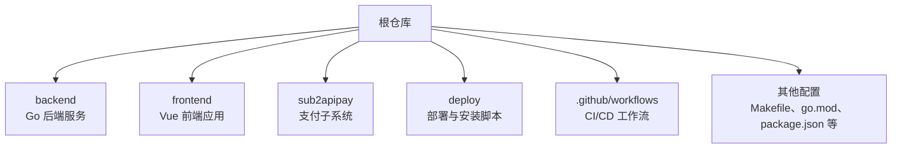
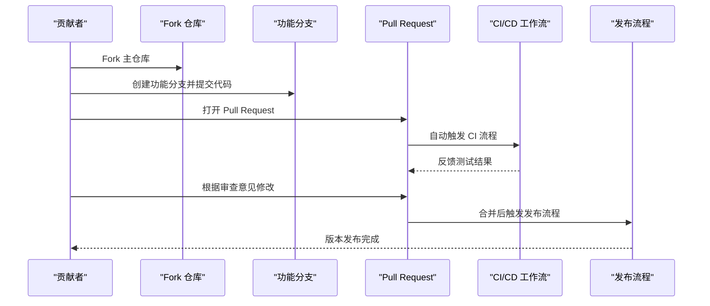
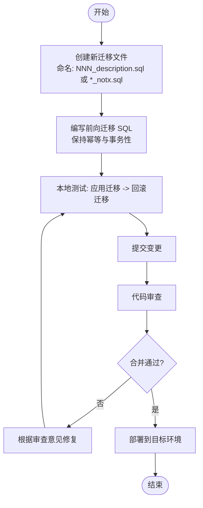
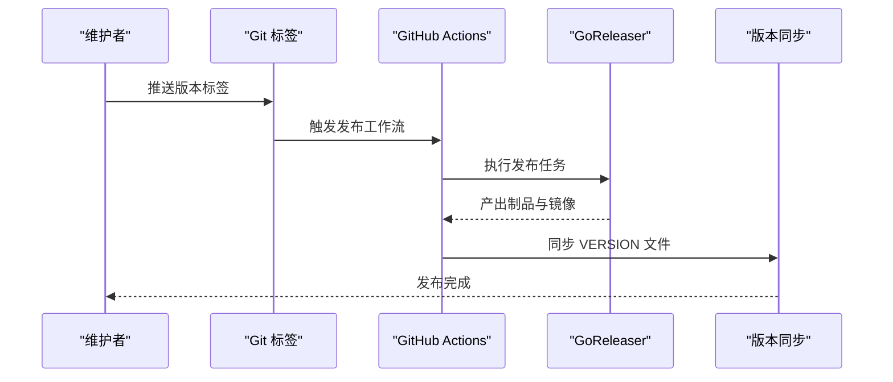
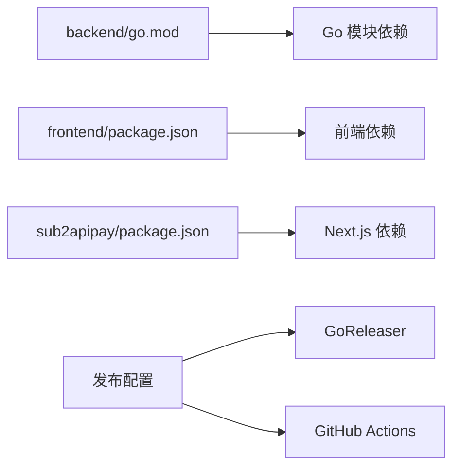

# 贡献指南

<cite>
**本文引用的文件**
- [README.md](file://README.md)
- [DEV_GUIDE.md](file://DEV_GUIDE.md)
- [backend/migrations/README.md](file://backend/migrations/README.md)
- [.github/workflows/release.yml](file://.github/workflows/release.yml)
- [.goreleaser.yaml](file://.goreleaser.yaml)
- [.goreleaser.simple.yaml](file://.goreleaser.simple.yaml)
- [Makefile](file://Makefile)
- [backend/go.mod](file://backend/go.mod)
- [frontend/package.json](file://frontend/package.json)
- [sub2apipay/package.json](file://sub2apipay/package.json)
- [backend/internal/pkg/openai/instructions.txt](file://backend/internal/pkg/openai/instructions.txt)
- [CLAUDE.md](file://CLAUDE.md)
</cite>

## 目录
1. [简介](#简介)
2. [项目结构](#项目结构)
3. [核心组件](#核心组件)
4. [架构总览](#架构总览)
5. [详细组件分析](#详细组件分析)
6. [依赖分析](#依赖分析)
7. [性能考虑](#性能考虑)
8. [故障排查指南](#故障排查指南)
9. [结论](#结论)
10. [附录](#附录)

## 简介
本贡献指南面向希望参与 Sub2API 项目的开发者，提供从 Fork 仓库、创建功能分支、提交代码到 Pull Request 提交与审查的完整流程说明；同时涵盖数据库迁移、发布与版本管理、问题报告与功能请求、社区行为准则与沟通规范，以及新贡献者的入门指导。目标是帮助贡献者快速理解项目结构与开发流程，高效、规范地参与协作。

## 项目结构
Sub2API 是一个多模块项目，包含后端服务、前端界面、支付子系统以及部署与发布相关脚本。主要目录与职责概览如下：
- backend：Go 后端服务，包含命令行入口、领域模型、仓储层、服务层、HTTP 路由与中间件、数据库迁移等。
- frontend：基于 Vue 的前端应用，提供用户交互界面。
- sub2apipay：支付子系统（Next.js 应用），包含支付流程与数据库模式。
- deploy：部署与安装脚本、服务配置示例与 Docker 编排文件。
- .github/workflows：GitHub Actions 工作流，用于 CI/CD 与发布自动化。
- 其他根级配置文件：Makefile、Go 模块清单、前端与支付子系统的包配置、发布配置等。

**章节来源**
- [README.md](file://README.md)
- [DEV_GUIDE.md](file://DEV_GUIDE.md)

## 核心组件
- 后端服务（backend）：提供网关、认证、订阅、用量统计、公告、API 密钥、代理等核心能力，采用分层架构（handler、service、repository、model）。
- 前端（frontend）：用户界面与交互逻辑，通过 API 与后端通信。
- 支付子系统（sub2apipay）：独立的支付流程与数据模型，使用 Prisma 管理数据库。
- 数据库迁移（backend/migrations）：SQL 迁移文件，遵循顺序编号与幂等性原则。
- 发布与版本（.github/workflows/release.yml、.goreleaser.yaml/.simple.yaml）：自动化构建、打包、镜像推送与版本同步。

**章节来源**
- [backend/migrations/README.md](file://backend/migrations/README.md)
- [.github/workflows/release.yml](file://.github/workflows/release.yml)
- [.goreleaser.yaml](file://.goreleaser.yaml)
- [.goreleaser.simple.yaml](file://.goreleaser.simple.yaml)

## 架构总览
下图展示贡献流程的关键节点：从 Fork 到 PR、测试、合并与发布。

**图表来源**
- [.github/workflows/release.yml](file://.github/workflows/release.yml)

## 详细组件分析

### 1. Fork 与本地开发环境准备
- Fork 主仓库至个人账号。
- 克隆仓库并在本地初始化开发环境：
  - 后端：参考根目录与 backend 目录下的构建与运行说明。
  - 前端：参考 frontend 目录下的依赖安装与启动说明。
  - 支付子系统：参考 sub2apipay 目录下的依赖安装与启动说明。
- 使用 Makefile 中提供的常用命令进行编译、测试与运行。

**章节来源**
- [README.md](file://README.md)
- [DEV_GUIDE.md](file://DEV_GUIDE.md)
- [Makefile](file://Makefile)

### 2. 分支命名与变更集组织
- 分支命名建议采用“类型/主题”格式，如 feat/xxx、fix/xxx、docs/xxx、chore/xxx 等，便于识别与检索。
- 变更集应聚焦单一功能或修复，避免在一个提交中引入无关改动；必要时拆分为多个小提交以提升可读性与可回滚性。

[本节为通用最佳实践，无需特定文件引用]

### 3. 提交与提交信息规范
- 提交信息建议采用“类型: 内容”的格式，例如 feat: 添加新功能、fix: 修复缺陷、docs: 更新文档、style: 代码风格调整、refactor: 重构、perf: 性能优化、test: 补充测试、chore: 构建流程或辅助工具的变动。
- 描述应简洁明了，必要时补充动机与影响范围；对破坏性变更需特别标注。

[本节为通用最佳实践，无需特定文件引用]

### 4. Pull Request 提交流程与规范
- PR 标题：清晰表达变更目的，避免模糊表述。
- PR 描述：简述变更内容、动机、影响范围与风险评估；如涉及数据库迁移或重大架构调整，需附上迁移说明或设计文档链接。
- 代码审查：遵循审查清单，关注安全性、性能、可维护性与一致性；审查通过后方可合并。
- 关联 Issue：如修复某个 Issue，请在 PR 描述中使用“Fixes #编号”或“Closes #编号”。

[本节为通用最佳实践，无需特定文件引用]

### 5. 数据库迁移规范
- 文件命名：采用顺序编号加下划线描述的格式，如 001_init.sql；并发索引迁移使用 *_notx.sql 后缀。
- 幂等性：创建/删除索引用 IF NOT EXISTS，确保重复执行不会失败。
- 事务性：常规迁移在事务中执行，*_notx.sql 非事务执行且仅允许并发索引语句。
- 不可变性：已应用于任一环境的迁移不得修改；若需修正，应新增迁移文件回滚或纠正。
- 测试：在本地先执行迁移与回滚，确认无误后再提交。

**图表来源**
- [backend/migrations/README.md](file://backend/migrations/README.md)

**章节来源**
- [backend/migrations/README.md](file://backend/migrations/README.md)

### 6. 发布与版本管理
- 标签与版本：通过 Git 标签标记版本，标签消息可用于发布说明内容。
- 自动化发布：GitHub Actions 工作流负责构建、打包、镜像推送与版本同步；GoReleaser 配置支持标准与简化两种模式。
- 版本同步：发布后自动同步 backend/cmd/server/VERSION 文件，确保版本一致。

**图表来源**
- [.github/workflows/release.yml](file://.github/workflows/release.yml)
- [.goreleaser.yaml](file://.goreleaser.yaml)
- [.goreleaser.simple.yaml](file://.goreleaser.simple.yaml)

**章节来源**
- [.github/workflows/release.yml](file://.github/workflows/release.yml)
- [.goreleaser.yaml](file://.goreleaser.yaml)
- [.goreleaser.simple.yaml](file://.goreleaser.simple.yaml)

### 7. 问题报告与功能请求
- Issue 模板：建议在仓库中提供 Bug 报告与功能请求模板，明确必填字段（如复现步骤、期望/实际行为、环境信息、日志片段等）。
- Bug 报告：提供最小可复现步骤、相关日志与截图、环境信息（操作系统、浏览器、后端版本等）。
- 功能请求：描述背景、目标、可行性分析与可能的影响面。

[本节为通用最佳实践，无需特定文件引用]

### 8. 社区行为准则与沟通规范
- 尊重与包容：保持友善、尊重的沟通氛围，避免人身攻击与歧视性言论。
- 建设性反馈：提出具体、可操作的建议与改进方案，附上上下文与依据。
- 透明与公开：讨论与决策尽量在公开渠道进行，便于社区监督与参与。
- 版本发布周期：遵循项目既定的发布节奏与策略，避免频繁破坏性变更。

[本节为通用最佳实践，无需特定文件引用]

### 9. 新贡献者入门指导
- 快速上手：阅读 README 与 DEV_GUIDE，了解项目目标、技术栈与开发流程。
- 环境搭建：按照各模块的依赖与启动说明完成本地环境准备。
- 从简单任务开始：优先认领 good first issue 或文档类任务，逐步熟悉代码与流程。
- 参与讨论：加入社区沟通渠道，积极提问与分享经验。

**章节来源**
- [README.md](file://README.md)
- [DEV_GUIDE.md](file://DEV_GUIDE.md)

## 依赖分析
- 后端模块依赖：Go 模块清单定义了后端服务的依赖关系，建议使用 go mod tidy 维护依赖一致性。
- 前端与支付子系统：各自拥有独立的包管理配置，注意版本兼容与安全审计。
- 发布工具链：GoReleaser 与 GitHub Actions 工作流共同构成自动化发布链路。

**图表来源**
- [backend/go.mod](file://backend/go.mod)
- [frontend/package.json](file://frontend/package.json)
- [sub2apipay/package.json](file://sub2apipay/package.json)
- [.github/workflows/release.yml](file://.github/workflows/release.yml)
- [.goreleaser.yaml](file://.goreleaser.yaml)

**章节来源**
- [backend/go.mod](file://backend/go.mod)
- [frontend/package.json](file://frontend/package.json)
- [sub2apipay/package.json](file://sub2apipay/package.json)
- [.github/workflows/release.yml](file://.github/workflows/release.yml)
- [.goreleaser.yaml](file://.goreleaser.yaml)

## 性能考虑
- 代码审查：关注潜在的性能瓶颈，如数据库查询、缓存命中率、并发处理与资源释放。
- 测试覆盖：确保关键路径具备单元测试与集成测试，减少回归风险。
- 发布前验证：在预生产环境进行压力与回归测试，确保变更不影响稳定性。

[本节为通用最佳实践，无需特定文件引用]

## 故障排查指南
- 数据库迁移错误：若出现校验和不匹配或对象已存在/不存在导致的错误，遵循迁移文档中的“正确流程”与“解决方案”步骤，新增迁移文件而非修改已应用迁移。
- 发布失败：检查标签消息、工作流权限与发布配置；查看工作流日志定位具体失败点。
- 本地构建问题：使用 Makefile 提供的命令进行清理与重建，确保依赖与环境变量正确。

**章节来源**
- [backend/migrations/README.md](file://backend/migrations/README.md)
- [.github/workflows/release.yml](file://.github/workflows/release.yml)

## 结论
本贡献指南提供了从 Fork 到发布的全流程规范，强调了分支与提交规范、数据库迁移与发布流程、问题报告与沟通准则，并为新贡献者提供了入门路径。请在实践中结合项目实际情况灵活应用，持续改进协作效率与质量。

## 附录
- 开发与构建命令：参考根目录与各模块的 Makefile 与启动说明。
- 代码协作提示：遵循团队既定的编码风格与工具链配置。

**章节来源**
- [Makefile](file://Makefile)
- [backend/internal/pkg/openai/instructions.txt](file://backend/internal/pkg/openai/instructions.txt)
- [CLAUDE.md](file://CLAUDE.md)