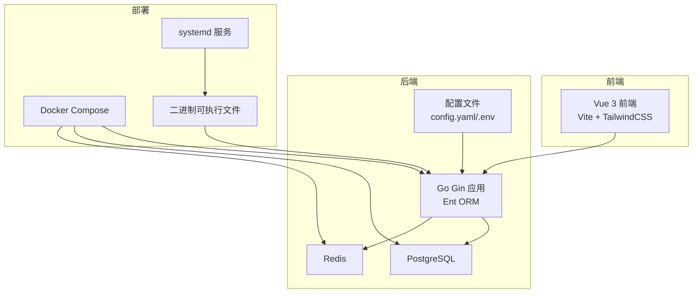
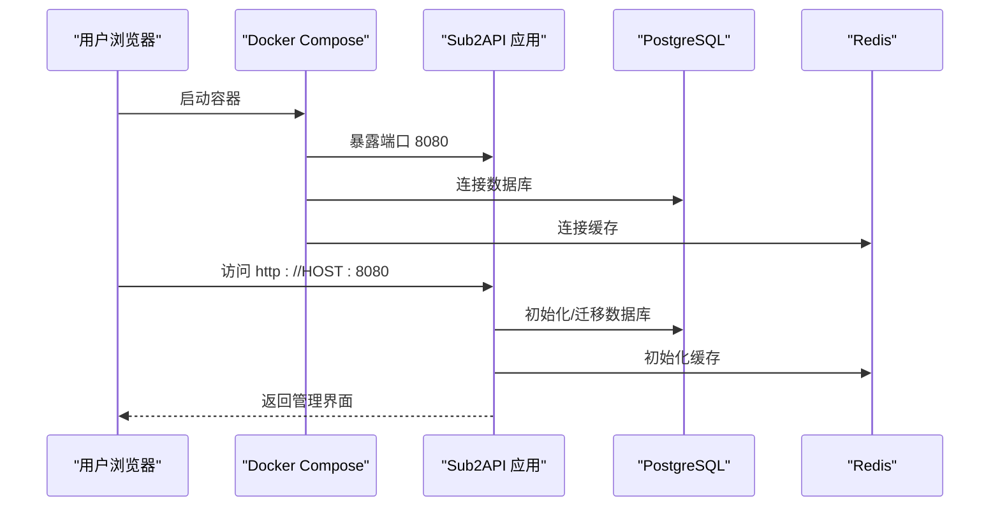
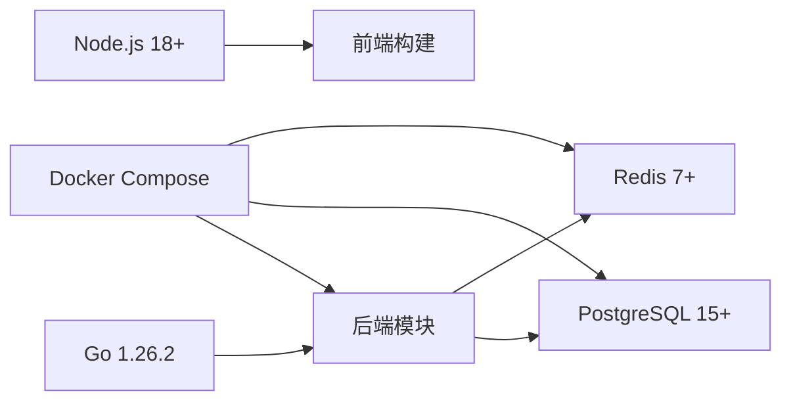

# 快速开始

<cite>
**本文引用的文件**
- [README.md](file://README.md)
- [deploy/README.md](file://deploy/README.md)
- [deploy/install.sh](file://deploy/install.sh)
- [deploy/docker-compose.yml](file://deploy/docker-compose.yml)
- [deploy/docker-compose.local.yml](file://deploy/docker-compose.local.yml)
- [deploy/.env.example](file://deploy/.env.example)
- [deploy/docker-deploy.sh](file://deploy/docker-deploy.sh)
- [deploy/config.example.yaml](file://deploy/config.example.yaml)
- [backend/cmd/server/main.go](file://backend/cmd/server/main.go)
- [Makefile](file://Makefile)
- [backend/go.mod](file://backend/go.mod)
- [frontend/package.json](file://frontend/package.json)
</cite>

## 目录
1. [简介](#简介)
2. [项目结构](#项目结构)
3. [核心组件](#核心组件)
4. [架构总览](#架构总览)
5. [详细组件分析](#详细组件分析)
6. [依赖关系分析](#依赖关系分析)
7. [性能考虑](#性能考虑)
8. [故障排除指南](#故障排除指南)
9. [结论](#结论)
10. [附录](#附录)

## 简介
Sub2API 是一个面向订阅配额分发的 AI API 网关平台，支持多上游账号、API Key 分发、精确计费、智能调度、并发控制与限流，并提供内置支付模块、邀请返利、模型目录与实时运行状态等增强能力。本文面向首次使用者，提供三种部署方式的完整安装与部署指南：一键安装脚本、Docker Compose、源码编译，涵盖环境要求、前置条件、操作步骤、初始配置、服务启动、访问界面、升级与迁移、常见问题排查等内容，帮助你在最短时间内成功运行实例。

## 项目结构
- 后端采用 Go + Gin + Ent 架构，提供 HTTP 接口与网关核心逻辑。
- 前端采用 Vue 3 + Vite + TailwindCSS，构建管理后台与用户界面。
- 部署层提供 Docker Compose 与一键安装脚本，支持自动初始化与可视化设置向导。
- 数据持久化依赖 PostgreSQL + Redis，迁移脚本随版本发布。

图表来源
- [backend/cmd/server/main.go:55-95](file://backend/cmd/server/main.go#L55-L95)
- [deploy/docker-compose.yml:18-153](file://deploy/docker-compose.yml#L18-L153)
- [deploy/docker-compose.local.yml:26-161](file://deploy/docker-compose.local.yml#L26-L161)

章节来源
- [README.md:562-588](file://README.md#L562-L588)

## 核心组件
- 一键安装脚本：自动下载最新发行版、创建系统用户与 systemd 服务、生成安装锁、引导设置向导。
- Docker Compose：一键拉起应用、PostgreSQL、Redis，支持本地目录与命名卷两种数据持久化方式。
- 源码编译：前端构建 + 后端嵌入前端产物 + 二进制打包，支持开发与定制化部署。

章节来源
- [deploy/install.sh:554-606](file://deploy/install.sh#L554-L606)
- [deploy/docker-compose.yml:18-153](file://deploy/docker-compose.yml#L18-L153)
- [Makefile:7-12](file://Makefile#L7-L12)

## 架构总览
Sub2API 的部署形态与数据流如下：

图表来源
- [deploy/docker-compose.yml:18-153](file://deploy/docker-compose.yml#L18-L153)
- [deploy/docker-compose.local.yml:26-161](file://deploy/docker-compose.local.yml#L26-L161)

## 详细组件分析

### 方式一：一键安装脚本（推荐）
适用场景
- 生产服务器（Linux amd64/arm64），已有 PostgreSQL 与 Redis 运行环境。
- 希望通过 systemd 管理服务、自动引导设置向导。

前置条件
- Linux 服务器（amd64 或 arm64），具备 root 权限。
- 已安装并运行 PostgreSQL 15+、Redis 7+。
- 网络可访问 GitHub Releases。

安装步骤
- 执行安装脚本，自动下载最新发行版、创建用户与目录、安装 systemd 服务。
- 启动服务并打开设置向导完成数据库、Redis、管理员账户配置。

升级与卸载
- 支持在线升级与卸载，卸载时可选择是否清理配置目录。

常用命令
- 启动/停止/重启服务、查看状态与日志、启用开机自启。

章节来源
- [README.md:128-194](file://README.md#L128-L194)
- [deploy/install.sh:554-790](file://deploy/install.sh#L554-L790)

### 方式二：Docker Compose（推荐）
适用场景
- 快速部署、一体化运行（应用、PostgreSQL、Redis）。
- 需要本地目录持久化以便迁移。

两种部署方式对比
- docker-compose.yml：使用命名卷，便于快速部署但迁移稍复杂。
- docker-compose.local.yml：使用本地目录映射，便于整体迁移备份。

一键部署脚本
- 自动生成 .env（含 JWT_SECRET、TOTP_ENCRYPTION_KEY、POSTGRES_PASSWORD）、创建 data/postgres_data/redis_data 目录、下载配置文件。
- 启动服务、查看日志、访问 Web UI。

手动部署
- 复制 .env.example 为 .env，生成安全密钥，创建数据目录，选择本地目录版本或命名卷版本启动。

升级与迁移
- 拉取最新镜像并重建容器；本地目录版本可直接打包迁移至新服务器。

章节来源
- [README.md:197-358](file://README.md#L197-L358)
- [deploy/README.md:30-207](file://deploy/README.md#L30-L207)
- [deploy/docker-deploy.sh:54-172](file://deploy/docker-deploy.sh#L54-L172)
- [deploy/docker-compose.yml:18-153](file://deploy/docker-compose.yml#L18-L153)
- [deploy/docker-compose.local.yml:26-161](file://deploy/docker-compose.local.yml#L26-L161)
- [deploy/.env.example:106-227](file://deploy/.env.example#L106-L227)

### 方式三：源码编译
适用场景
- 需要开发调试、二次定制或离线环境。

前置条件
- Go 1.21+、Node.js 18+、PostgreSQL 15+、Redis 7+。

构建步骤
- 构建前端（pnpm install + pnpm run build），输出到后端嵌入目录。
- 构建后端（go build -tags embed），生成可执行文件。
- 准备配置文件 config.yaml，编辑数据库、Redis、JWT 等参数。
- 运行二进制文件启动服务。

开发模式
- 后端热重载（go run ./cmd/server），前端热重载（pnpm run dev）。

章节来源
- [README.md:361-495](file://README.md#L361-L495)
- [Makefile:7-12](file://Makefile#L7-L12)
- [backend/go.mod:3](file://backend/go.mod#L3)
- [frontend/package.json:13-23](file://frontend/package.json#L13-L23)

### 初始配置与服务启动
- Docker：设置 .env 中的数据库密码、JWT_SECRET、TOTP_ENCRYPTION_KEY、管理员邮箱/密码、端口等；启动后自动初始化数据库与管理员账户。
- systemd：安装脚本完成后，通过 systemctl 管理服务；首次启动会弹出设置向导，按提示完成配置。
- 源码编译：准备 config.yaml，启动后同样进入设置向导。

章节来源
- [deploy/.env.example:106-227](file://deploy/.env.example#L106-L227)
- [deploy/config.example.yaml:13-80](file://deploy/config.example.yaml#L13-L80)
- [backend/cmd/server/main.go:77-95](file://backend/cmd/server/main.go#L77-L95)

### 访问界面与演示环境
- 访问地址：http://YOUR_SERVER_IP:8080（默认端口 8080）。
- 演示环境与凭证：提供公开演示站点与共享凭证，便于快速体验。

章节来源
- [README.md:23-32](file://README.md#L23-L32)
- [README.md:306-314](file://README.md#L306-L314)

### 升级与迁移
- Docker：拉取最新镜像并重建容器；本地目录版本可整体打包迁移。
- systemd：通过安装脚本升级或卸载；注意保留配置目录。
- 源码编译：重新构建并替换二进制，必要时迁移数据目录。

章节来源
- [README.md:170-178](file://README.md#L170-L178)
- [README.md:315-322](file://README.md#L315-L322)
- [deploy/README.md:161-183](file://deploy/README.md#L161-L183)

## 依赖关系分析
- 运行时依赖：Go 1.26.2（后端模块定义）、Node 18+（前端构建）、PostgreSQL 15+、Redis 7+。
- 构建依赖：Vite、Vue 3、TailwindCSS（前端），Wire、Gin、Ent（后端）。
- 部署依赖：Docker 20.10+、Docker Compose v2+（Docker 部署）。

图表来源
- [backend/go.mod:3](file://backend/go.mod#L3)
- [frontend/package.json:6](file://frontend/package.json#L6)
- [deploy/docker-compose.yml:18-153](file://deploy/docker-compose.yml#L18-L153)

章节来源
- [backend/go.mod:3](file://backend/go.mod#L3)
- [frontend/package.json:6](file://frontend/package.json#L6)

## 性能考虑
- 连接池与并发：合理设置数据库最大连接数、Redis 连接池大小与空闲连接数，避免连接耗尽与上下文切换过多。
- 超时与重试：根据上游服务特性配置响应头等待、连接超时、重试退避与抖动，平衡吞吐与延迟。
- 日志与采样：生产环境建议开启日志轮转与采样，降低高频重复日志对性能的影响。
- 网关调度：启用调度批量负载计算、并发槽位清理与受控回源，提升稳定性与一致性。

章节来源
- [deploy/.env.example:117-156](file://deploy/.env.example#L117-L156)
- [deploy/.env.example:240-287](file://deploy/.env.example#L240-L287)
- [deploy/config.example.yaml:398-457](file://deploy/config.example.yaml#L398-L457)

## 故障排除指南
常见问题
- 端口占用：修改 SERVER_PORT 或 systemd 环境变量。
- 数据库连接失败：确认 PostgreSQL 正在运行、凭据正确。
- Redis 连接失败：确认 Redis 正在运行、密码正确。
- 权限问题：二进制安装后检查文件所有权与权限。

Docker 排障
- 查看容器状态、日志、数据库/Redis 连接健康检查。
- 本地目录版本检查 data/postgres_data/redis_data 权限与磁盘空间。

systemd 排障
- systemctl status/subset/journalctl 查看服务状态与日志。
- 检查 /etc/sub2api/config.yaml 与 systemd 环境变量。

章节来源
- [deploy/README.md:489-550](file://deploy/README.md#L489-L550)
- [deploy/install.sh:791-800](file://deploy/install.sh#L791-L800)

## 结论
通过本文提供的三种部署方式，你可以快速在不同环境下运行 Sub2API。对于追求稳定与易维护的生产环境，推荐使用 Docker Compose（本地目录版本）；对于需要系统级集成与自动化运维的场景，一键安装脚本配合 systemd 是理想选择；对于开发与定制需求，源码编译提供了最大的灵活性。遇到问题时，可依据“故障排除指南”定位并解决。

## 附录

### 三种部署方式对比与选择建议
- 一键安装脚本：适合生产服务器，系统化管理，首次启动弹出设置向导。
- Docker Compose：适合快速部署与一体化运行，本地目录版本便于迁移。
- 源码编译：适合开发调试与定制化，需准备构建工具链。

章节来源
- [README.md:128-194](file://README.md#L128-L194)
- [README.md:197-358](file://README.md#L197-L358)
- [README.md:361-495](file://README.md#L361-L495)