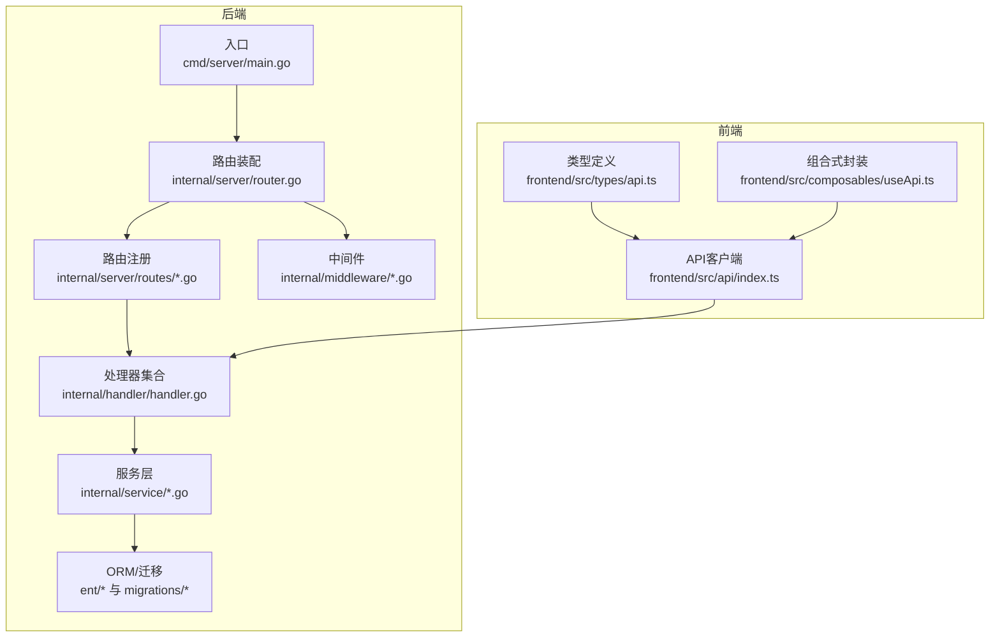
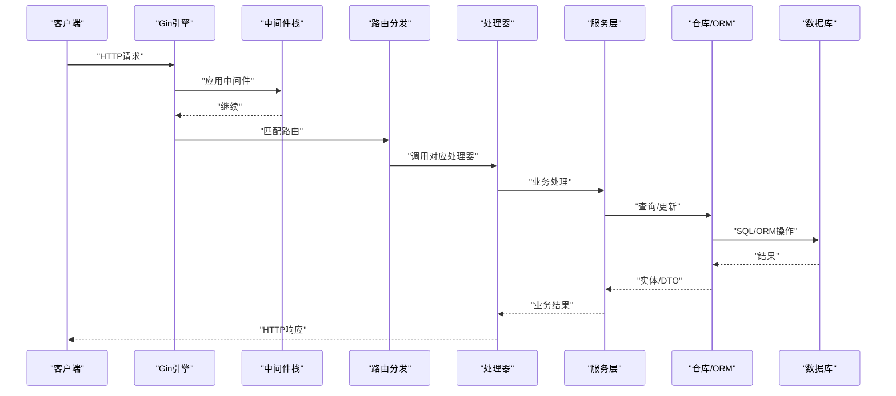
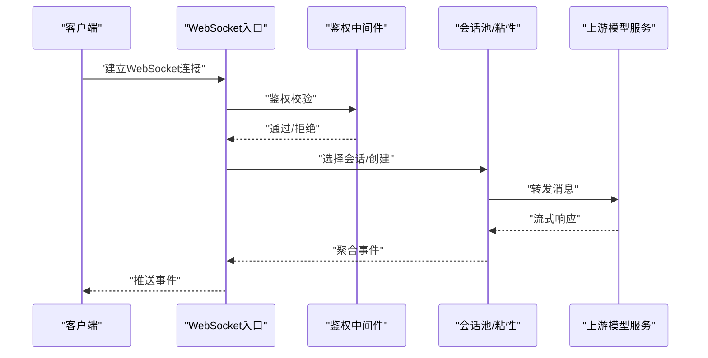
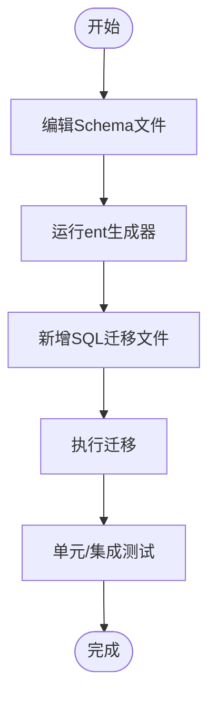
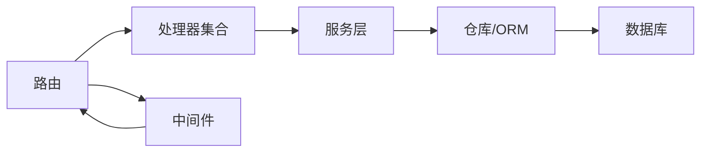

# API扩展

<cite>
**本文引用的文件**
- [backend/cmd/server/main.go](file://backend/cmd/server/main.go)
- [backend/internal/server/router.go](file://backend/internal/server/router.go)
- [backend/internal/handler/handler.go](file://backend/internal/handler/handler.go)
- [backend/internal/middleware/rate_limiter.go](file://backend/internal/middleware/rate_limiter.go)
- [backend/internal/server/routes/admin.go](file://backend/internal/server/routes/admin.go)
- [backend/internal/server/routes/auth.go](file://backend/internal/server/routes/auth.go)
- [backend/internal/server/routes/common.go](file://backend/internal/server/routes/common.go)
- [backend/internal/server/routes/gateway.go](file://backend/internal/server/routes/gateway.go)
- [backend/internal/server/routes/pay_integration.go](file://backend/internal/server/routes/pay_integration.go)
- [backend/internal/server/routes/user.go](file://backend/internal/server/routes/user.go)
- [backend/ent/schema/account.go](file://backend/ent/schema/account.go)
- [backend/ent/schema/user.go](file://backend/ent/schema/user.go)
- [backend/ent/schema/announcement.go](file://backend/ent/schema/announcement.go)
- [backend/ent/schema/api_key.go](file://backend/ent/schema/api_key.go)
- [backend/ent/schema/group.go](file://backend/ent/schema/group.go)
- [backend/ent/schema/promo_code.go](file://backend/ent/schema/promo_code.go)
- [backend/ent/schema/redeem_code.go](file://backend/ent/schema/redeem_code.go)
- [backend/ent/schema/setting.go](file://backend/ent/schema/setting.go)
- [backend/ent/schema/usage_log.go](file://backend/ent/schema/usage_log.go)
- [backend/ent/schema/user_allowed_group.go](file://backend/ent/schema/user_allowed_group.go)
- [backend/ent/schema/user_attribute_definition.go](file://backend/ent/schema/user_attribute_definition.go)
- [backend/ent/schema/user_attribute_value.go](file://backend/ent/schema/user_attribute_value.go)
- [backend/ent/schema/user_referral.go](file://backend/ent/schema/user_referral.go)
- [backend/ent/schema/user_subscription.go](file://backend/ent/schema/user_subscription.go)
- [backend/ent/migrate/schema.go](file://backend/ent/migrate/schema.go)
- [backend/migrations/README.md](file://backend/migrations/README.md)
- [backend/migrations/migrations.go](file://backend/migrations/migrations.go)
- [backend/migrations/001_init.sql](file://backend/migrations/001_init.sql)
- [backend/migrations/018_user_attributes.sql](file://backend/migrations/018_user_attributes.sql)
- [backend/migrations/053_add_security_secrets.sql](file://backend/migrations/053_add_security_secrets.sql)
- [backend/migrations/053_add_skip_monitoring_to_error_passthrough.sql](file://backend/migrations/053_add_skip_monitoring_to_error_passthrough.sql)
- [backend/migrations/080_create_tls_fingerprint_profiles.sql](file://backend/migrations/080_create_tls_fingerprint_profiles.sql)
- [backend/migrations/144_add_opus48_to_model_mapping.sql](file://backend/migrations/144_add_opus48_to_model_mapping.sql)
- [backend/internal/service/account_service.go](file://backend/internal/service/account_service.go)
- [backend/internal/service/subscription_service.go](file://backend/internal/service/subscription_service.go)
- [backend/internal/service/user_service.go](file://backend/internal/service/user_service.go)
- [backend/internal/service/announcement_service.go](file://backend/internal/service/announcement_service.go)
- [backend/internal/service/promo_code_service.go](file://backend/internal/service/promo_code_service.go)
- [backend/internal/service/redeem_code_service.go](file://backend/internal/service/redeem_code_service.go)
- [frontend/src/api/index.ts](file://frontend/src/api/index.ts)
- [frontend/src/types/api.ts](file://frontend/src/types/api.ts)
- [frontend/src/composables/useApi.ts](file://frontend/src/composables/useApi.ts)
</cite>

## 目录
1. [简介](#简介)
2. [项目结构](#项目结构)
3. [核心组件](#核心组件)
4. [架构总览](#架构总览)
5. [详细组件分析](#详细组件分析)
6. [依赖分析](#依赖分析)
7. [性能考虑](#性能考虑)
8. [故障排查指南](#故障排查指南)
9. [结论](#结论)
10. [附录](#附录)

## 简介
本文件面向希望在Sub2API上进行API扩展的开发者，系统化地说明如何新增自定义REST API与WebSocket接口、扩展数据模型（Ent ORM）、编写数据库迁移、实现字段校验、定制业务逻辑（服务层、中间件、路由配置）、以及前端API客户端的扩展与类型安全。文档同时提供从后端服务到前端调用的完整扩展示例流程，并涵盖API版本管理、向后兼容性与性能优化建议。

## 项目结构
后端采用Gin框架作为HTTP入口，通过Wire依赖注入初始化应用；路由按版本分组（如/api/v1），并按功能模块注册子路由；处理器（Handler）负责请求解析与响应封装；服务层（Service）承载业务逻辑；仓库层（Repository）与Ent ORM交互；中间件（Middleware）提供CORS、日志、安全头、限流等功能；前端使用Vue+TypeScript，通过统一API客户端发起请求。

**图表来源**
- [backend/cmd/server/main.go:134-182](file://backend/cmd/server/main.go#L134-L182)
- [backend/internal/server/router.go:22-92](file://backend/internal/server/router.go#L22-L92)
- [backend/internal/server/routes/common.go:9-20](file://backend/internal/server/routes/common.go#L9-L20)
- [backend/internal/handler/handler.go:37-62](file://backend/internal/handler/handler.go#L37-L62)
- [frontend/src/api/index.ts](file://frontend/src/api/index.ts)

**章节来源**
- [backend/cmd/server/main.go:55-95](file://backend/cmd/server/main.go#L55-L95)
- [backend/internal/server/router.go:22-122](file://backend/internal/server/router.go#L22-L122)

## 核心组件
- 应用入口与生命周期：负责加载配置、初始化日志、启动服务、优雅关闭。
- 路由与中间件：统一注册通用路由与版本化模块路由，注入JWT/API Key/管理员鉴权中间件。
- 处理器（Handlers）：集中管理所有HTTP处理器，便于依赖注入与复用。
- 服务层（Service）：封装业务规则、调用仓库与外部网关，提供幂等与事务控制能力。
- 中间件（Middleware）：提供CORS、安全头、请求日志、限流等横切能力。
- ORM与迁移：Ent生成的Schema与migrations目录中的SQL迁移共同维护数据结构演进。

**章节来源**
- [backend/cmd/server/main.go:134-182](file://backend/cmd/server/main.go#L134-L182)
- [backend/internal/server/router.go:22-122](file://backend/internal/server/router.go#L22-L122)
- [backend/internal/handler/handler.go:37-62](file://backend/internal/handler/handler.go#L37-L62)
- [backend/internal/middleware/rate_limiter.go:61-162](file://backend/internal/middleware/rate_limiter.go#L61-L162)

## 架构总览
下图展示了从HTTP请求进入，经由中间件、路由、处理器、服务层，再到数据库或外部上游的典型调用链路。

**图表来源**
- [backend/internal/server/router.go:94-122](file://backend/internal/server/router.go#L94-L122)
- [backend/internal/handler/handler.go:37-62](file://backend/internal/handler/handler.go#L37-L62)

## 详细组件分析

### 新增REST API端点（以用户模块为例）
- 步骤概览
  - 在处理器层新增用户相关处理器（参考现有处理器结构）。
  - 在路由层为新端点注册路径与HTTP方法。
  - 在服务层实现业务逻辑。
  - 如需持久化，扩展Ent Schema并生成代码，编写迁移。
  - 在前端新增API客户端封装与类型定义。

- 实施要点
  - 路由注册：在对应模块路由文件中添加新路径，确保与版本组（如/api/v1）一致。
  - 处理器职责：仅做参数解析、调用服务层、返回标准化响应。
  - 服务层职责：聚合领域逻辑、处理幂等、事务与错误传播。
  - 数据模型：遵循现有命名与权限设计，必要时引入鉴权/授权中间件。

- 示例流程（从后端到前端）
  1) 在路由层注册新端点（参考用户/公告/支付等模块路由注册方式）。
  2) 在处理器层实现请求处理函数。
  3) 在服务层实现业务逻辑。
  4) 若涉及数据变更，扩展Schema并生成代码，编写迁移。
  5) 在前端API客户端中新增调用封装与类型声明，统一错误处理。

**章节来源**
- [backend/internal/server/routes/user.go:11-20](file://backend/internal/server/routes/user.go#L11-L20)
- [backend/internal/server/routes/announcement.go:11-20](file://backend/internal/server/routes/announcement.go#L11-L20)
- [backend/internal/server/routes/pay_integration.go:22-40](file://backend/internal/server/routes/pay_integration.go#L22-L40)

### WebSocket接口扩展（以OpenAI WebSocket为例）
- 参考现有OpenAI WebSocket相关服务与会话管理，抽象出通用协议转发器与会话粘性策略。
- 设计握手与认证流程，确保与现有API Key/JWT鉴权体系一致。
- 实现消息转发、重试、断线恢复与状态存储。
- 提供前端连接封装与事件订阅机制。

**图表来源**
- [backend/internal/service/openai_ws_forwarder.go](file://backend/internal/service/openai_ws_forwarder.go)
- [backend/internal/service/openai_ws_pool.go](file://backend/internal/service/openai_ws_pool.go)
- [backend/internal/service/openai_ws_state_store.go](file://backend/internal/service/openai_ws_state_store.go)

### 数据模型扩展（Ent ORM）
- 扩展Schema
  - 在ent/schema目录新增或修改Schema文件，定义字段、索引、外键与关系。
  - 使用ent/generate生成对应的查询器、创建器、更新器等。
- 迁移编写
  - 在migrations目录新增SQL迁移文件，描述表结构变更。
  - 使用migrations.go与README.md记录迁移顺序与目的。
- 字段验证
  - 在服务层对输入参数进行业务规则校验。
  - 对于数据库约束，通过Ent的where条件与唯一性约束保障一致性。

**图表来源**
- [backend/ent/schema/user.go](file://backend/ent/schema/user.go)
- [backend/ent/schema/user_allowed_group.go](file://backend/ent/schema/user_allowed_group.go)
- [backend/ent/schema/user_attribute_definition.go](file://backend/ent/schema/user_attribute_definition.go)
- [backend/ent/schema/user_attribute_value.go](file://backend/ent/schema/user_attribute_value.go)
- [backend/ent/schema/user_referral.go](file://backend/ent/schema/user_referral.go)
- [backend/ent/schema/user_subscription.go](file://backend/ent/schema/user_subscription.go)
- [backend/ent/migrate/schema.go](file://backend/ent/migrate/schema.go)
- [backend/migrations/README.md](file://backend/migrations/README.md)
- [backend/migrations/migrations.go](file://backend/migrations/migrations.go)

**章节来源**
- [backend/ent/schema/announcement.go](file://backend/ent/schema/announcement.go)
- [backend/ent/schema/api_key.go](file://backend/ent/schema/api_key.go)
- [backend/ent/schema/group.go](file://backend/ent/schema/group.go)
- [backend/ent/schema/promo_code.go](file://backend/ent/schema/promo_code.go)
- [backend/ent/schema/redeem_code.go](file://backend/ent/schema/redeem_code.go)
- [backend/ent/schema/setting.go](file://backend/ent/schema/setting.go)
- [backend/ent/schema/usage_log.go](file://backend/ent/schema/usage_log.go)

### 业务逻辑定制（服务层、中间件、路由）
- 服务层扩展
  - 在service目录新增或修改服务，保持单一职责与清晰的接口契约。
  - 对外暴露幂等、事务与错误码规范，内部通过仓库层访问数据。
- 中间件开发
  - 基于现有中间件模式（如限流、CORS、安全头）扩展新中间件。
  - 注意失败策略（如Redis故障时的fail-open/fail-close）。
- 路由配置
  - 在router.go中注册路由组与具体路径，确保鉴权中间件正确注入。
  - 保持版本化路由（/api/v1），为后续演进预留空间。

**章节来源**
- [backend/internal/middleware/rate_limiter.go:61-162](file://backend/internal/middleware/rate_limiter.go#L61-L162)
- [backend/internal/server/router.go:22-122](file://backend/internal/server/router.go#L22-L122)

### 前端API客户端扩展
- 新增API调用封装
  - 在frontend/src/api目录新增模块，封装请求方法与URL。
  - 统一错误处理与重试策略。
- 类型定义
  - 在frontend/src/types/api.ts中定义请求/响应类型，确保TS严格校验。
- 组合式封装
  - 在frontend/src/composables/useApi.ts中提供可复用的组合式API封装，简化组件使用。

**章节来源**
- [frontend/src/api/index.ts](file://frontend/src/api/index.ts)
- [frontend/src/types/api.ts](file://frontend/src/types/api.ts)
- [frontend/src/composables/useApi.ts](file://frontend/src/composables/useApi.ts)

### 完整扩展示例：新增“用户属性”API
- 后端
  1) 在ent/schema新增UserAttributeDefinition与UserAttributeValue相关Schema，生成代码并编写迁移。
  2) 在service层实现用户属性的增删改查与校验逻辑。
  3) 在handler层新增REST端点，定义请求/响应结构。
  4) 在router.go中注册新路由，注入鉴权中间件。
- 前端
  1) 在frontend/src/api中新增属性API模块。
  2) 在frontend/src/types/api.ts中补充类型定义。
  3) 在frontend/src/composables/useApi.ts中封装调用与状态管理。

**章节来源**
- [backend/ent/schema/user_attribute_definition.go](file://backend/ent/schema/user_attribute_definition.go)
- [backend/ent/schema/user_attribute_value.go](file://backend/ent/schema/user_attribute_value.go)
- [backend/migrations/018_user_attributes.sql](file://backend/migrations/018_user_attributes.sql)

## 依赖分析
- 组件耦合
  - 路由依赖处理器集合；处理器依赖服务层；服务层依赖仓库层与外部服务。
  - 中间件横切于请求链路，对所有路由生效。
- 外部依赖
  - Gin作为HTTP框架；Redis用于限流与缓存；Ent/PostgreSQL用于数据持久化。
- 版本与兼容
  - 路由以/api/v1分组，便于未来新增/api/v2并保持向后兼容。

**图表来源**
- [backend/internal/server/router.go:94-122](file://backend/internal/server/router.go#L94-L122)
- [backend/internal/handler/handler.go:37-62](file://backend/internal/handler/handler.go#L37-L62)

**章节来源**
- [backend/internal/server/router.go:22-122](file://backend/internal/server/router.go#L22-L122)
- [backend/internal/middleware/rate_limiter.go:61-162](file://backend/internal/middleware/rate_limiter.go#L61-L162)

## 性能考虑
- 限流与降级
  - 使用Redis Lua脚本原子计数与TTL修复，支持fail-open/fail-close策略。
  - 对热点接口设置更严格的限流阈值。
- 缓存与预热
  - 利用设置项变更回调刷新CSP frame-src来源列表，减少重复计算。
  - 对静态资源与配置进行缓存，降低数据库压力。
- 数据库优化
  - 为高频查询字段建立索引；拆分大表与分区（如usage_log）。
  - 使用批量写入与事务合并，减少锁竞争。
- 网关与上游
  - 对上游服务进行连接池与超时控制，避免雪崩。
  - 实现快速失败与回退策略，提升整体可用性。

**章节来源**
- [backend/internal/middleware/rate_limiter.go:28-59](file://backend/internal/middleware/rate_limiter.go#L28-L59)
- [backend/internal/server/router.go:43-53](file://backend/internal/server/router.go#L43-L53)
- [backend/migrations/035_usage_logs_partitioning.sql](file://backend/migrations/035_usage_logs_partitioning.sql)

## 故障排查指南
- 限流异常
  - 检查Redis可用性与Lua脚本执行结果；根据失败模式决定是否放行。
- CORS/CSP问题
  - 确认frame-src来源列表是否随设置项更新而刷新。
- 路由未生效
  - 核对路由注册顺序与版本组路径；确认中间件注入位置。
- 数据不一致
  - 检查迁移是否成功执行；核对Ent生成代码与Schema一致性。

**章节来源**
- [backend/internal/middleware/rate_limiter.go:100-109](file://backend/internal/middleware/rate_limiter.go#L100-L109)
- [backend/internal/server/router.go:59-86](file://backend/internal/server/router.go#L59-L86)
- [backend/migrations/README.md](file://backend/migrations/README.md)

## 结论
通过以上架构与实践，可以在Sub2API上高效、安全地扩展REST与WebSocket API。建议始终以版本化路由、严格的类型与校验、完善的中间件与限流策略、以及清晰的服务层划分来保障系统的可维护性与稳定性。同时，前端应配套完善API封装与类型定义，确保端到端的一致性与可测试性。

## 附录
- API版本管理与向后兼容
  - 以/api/v1为稳定版本，新增/api/v2承载破坏性变更；旧版本保留过渡期。
  - 通过Content Negotiation或Accept头选择版本，逐步引导客户端升级。
- 数据模型演进最佳实践
  - 新增非空字段需提供默认值或迁移脚本；删除字段前先软删除并清理引用。
  - 为Schema变更配套迁移文件，确保多环境一致性。
- 性能优化清单
  - 启用必要的索引与分区；使用连接池与超时控制；实施缓存与CDN；监控关键指标并建立告警。