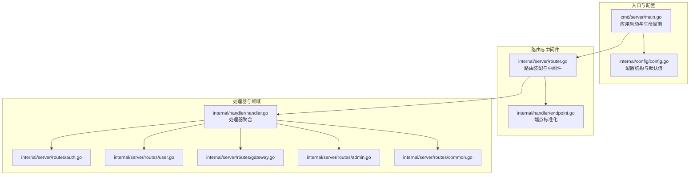
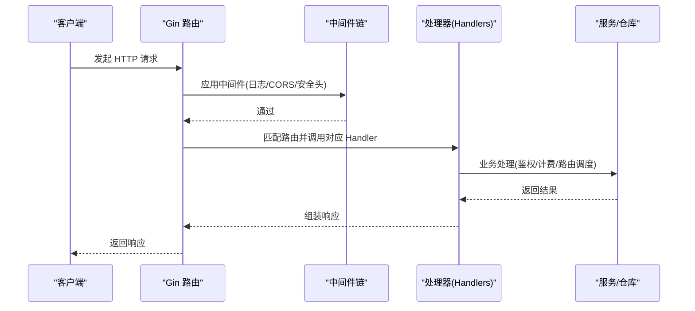
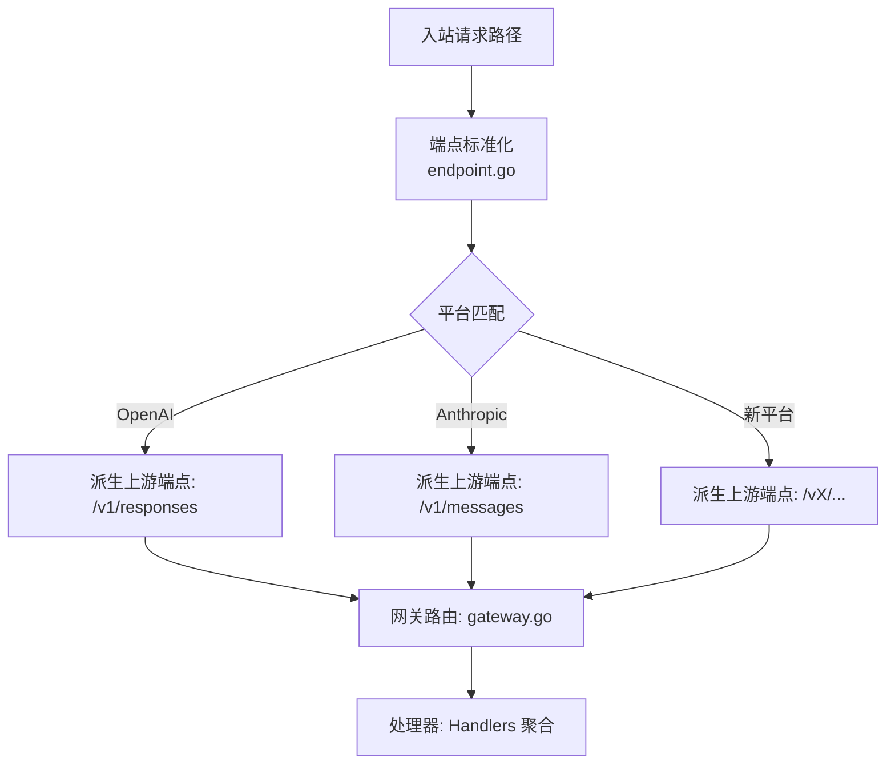
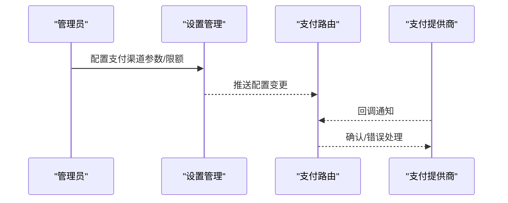
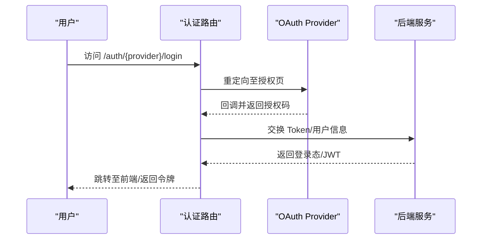
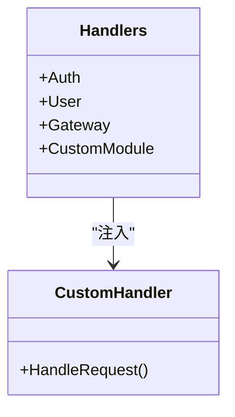
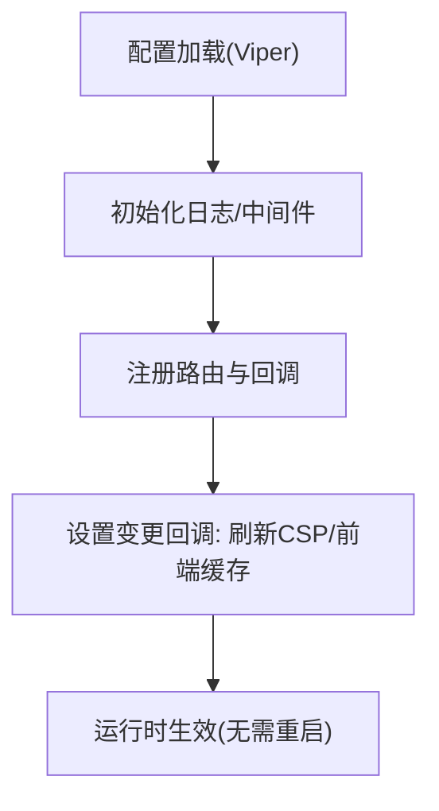
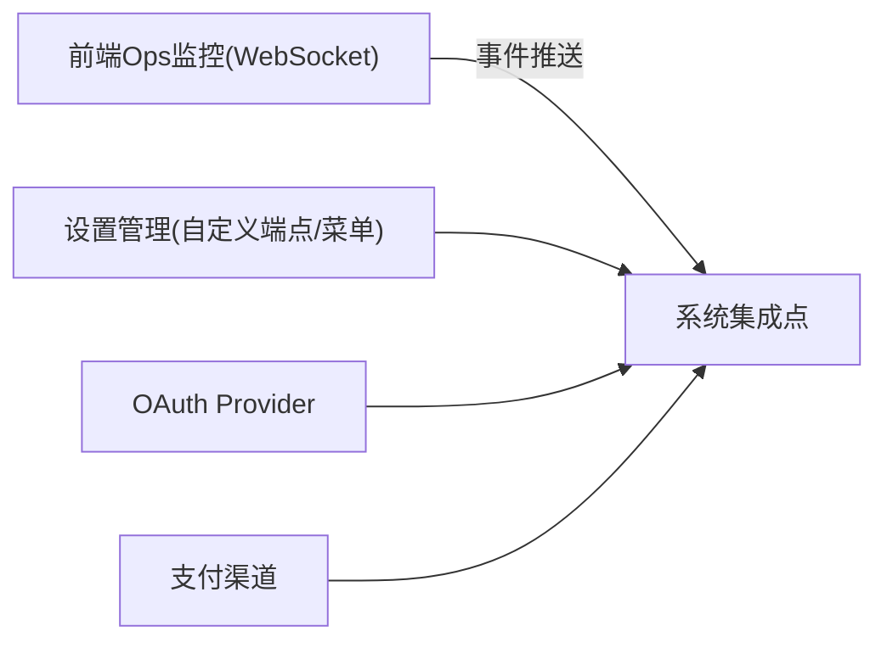
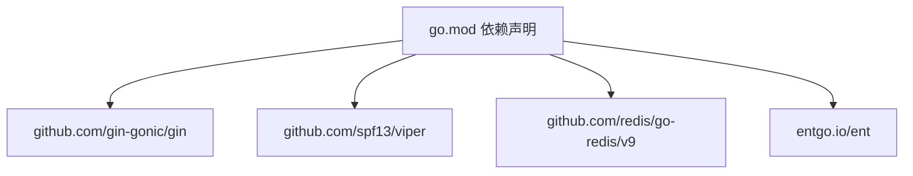

# 扩展定制

<cite>
**本文引用的文件**
- [backend/cmd/server/main.go](file://backend/cmd/server/main.go)
- [backend/internal/config/config.go](file://backend/internal/config/config.go)
- [backend/internal/server/router.go](file://backend/internal/server/router.go)
- [backend/internal/handler/endpoint.go](file://backend/internal/handler/endpoint.go)
- [backend/internal/handler/handler.go](file://backend/internal/handler/handler.go)
- [backend/internal/server/routes/admin.go](file://backend/internal/server/routes/admin.go)
- [backend/internal/server/routes/auth.go](file://backend/internal/server/routes/auth.go)
- [backend/internal/server/routes/common.go](file://backend/internal/server/routes/common.go)
- [backend/internal/server/routes/gateway.go](file://backend/internal/server/routes/gateway.go)
- [backend/internal/server/routes/user.go](file://backend/internal/server/routes/user.go)
- [backend/internal/pkg/apicompat/chatcompletions_to_responses.go](file://backend/internal/pkg/apicompat/chatcompletions_to_responses.go)
- [backend/internal/pkg/apicompat/responses_to_anthropic.go](file://backend/internal/pkg/apicompat/responses_to_anthropic.go)
- [backend/internal/pkg/oauth/oauth.go](file://backend/internal/pkg/oauth/oauth.go)
- [backend/internal/handler/admin/setting_handler.go](file://backend/internal/handler/admin/setting_handler.go)
- [backend/internal/handler/dto/settings.go](file://backend/internal/handler/dto/settings.go)
- [backend/go.mod](file://backend/go.mod)
</cite>

## 目录
1. [简介](#简介)
2. [项目结构](#项目结构)
3. [核心组件](#核心组件)
4. [架构总览](#架构总览)
5. [详细组件分析](#详细组件分析)
6. [依赖分析](#依赖分析)
7. [性能考量](#性能考量)
8. [故障排查指南](#故障排查指南)
9. [结论](#结论)
10. [附录](#附录)

## 简介
本文件面向希望在 Sub2API 上进行扩展定制的开发者，系统性地说明如何：
- 集成新的模型提供商或支付网关
- 开发自定义认证提供程序
- 扩展自定义 API 端点、数据模型与业务逻辑
- 管理配置（含动态配置更新、环境变量、热重载）
- 利用系统集成点（Webhook、事件通知、第三方系统对接）
- 提供安全与性能优化建议，并给出可直接参考的代码模板路径

## 项目结构
后端采用 Go + Gin 架构，核心模块包括：
- 配置层：集中加载与校验配置，支持运行模式、CORS、安全策略、网关参数、缓存与运维等
- 路由层：注册通用路由与各模块路由（认证、用户、网关、支付、管理等）
- 处理器层：封装各领域 Handler，统一对外暴露
- 适配层：API 兼容适配（如 OpenAI Chat Completions ↔ Responses）
- 认证与授权：基于 JWT、API Key、OAuth（GitHub/LinuxDo 等）
- 服务与仓库：业务服务与数据访问抽象
- Web 前端嵌入：可选嵌入前端静态资源，支持设置变更热更新

**图表来源**
- [backend/cmd/server/main.go:134-182](file://backend/cmd/server/main.go#L134-L182)
- [backend/internal/server/router.go:22-92](file://backend/internal/server/router.go#L22-L92)
- [backend/internal/handler/endpoint.go:33-172](file://backend/internal/handler/endpoint.go#L33-L172)
- [backend/internal/config/config.go:60-91](file://backend/internal/config/config.go#L60-L91)

**章节来源**
- [backend/cmd/server/main.go:55-95](file://backend/cmd/server/main.go#L55-L95)
- [backend/internal/server/router.go:22-92](file://backend/internal/server/router.go#L22-L92)
- [backend/internal/config/config.go:60-91](file://backend/internal/config/config.go#L60-L91)

## 核心组件
- 应用入口与生命周期
  - 启动流程：初始化日志、解析命令行参数、首次运行向导、加载配置、初始化应用、启动 HTTP 服务器、监听退出信号
  - 参考路径：[backend/cmd/server/main.go:55-182](file://backend/cmd/server/main.go#L55-L182)
- 配置系统
  - 统一的 Config 结构体，涵盖服务器、日志、CORS、安全、计费、网关、缓存、运维、定价、并发、令牌刷新、IDempotency 等
  - 参考路径：[backend/internal/config/config.go:60-91](file://backend/internal/config/config.go#L60-L91)
- 路由与中间件
  - 路由装配：通用路由、/api/v1 下的模块路由（认证、用户、网关、支付、管理）
  - 中间件：请求日志、CORS、安全头（含 CSP）、前端嵌入与设置热更新回调
  - 参考路径：[backend/internal/server/router.go:22-122](file://backend/internal/server/router.go#L22-L122)
- 端点标准化
  - 将不同前缀的入站路径标准化为规范端点，派生上游端点
  - 参考路径：[backend/internal/handler/endpoint.go:33-172](file://backend/internal/handler/endpoint.go#L33-L172)
- 处理器聚合
  - 统一聚合各领域 Handler，便于路由层注入
  - 参考路径：[backend/internal/handler/handler.go:37-55](file://backend/internal/handler/handler.go#L37-L55)

**章节来源**
- [backend/cmd/server/main.go:55-182](file://backend/cmd/server/main.go#L55-L182)
- [backend/internal/config/config.go:60-91](file://backend/internal/config/config.go#L60-L91)
- [backend/internal/server/router.go:22-122](file://backend/internal/server/router.go#L22-L122)
- [backend/internal/handler/endpoint.go:33-172](file://backend/internal/handler/endpoint.go#L33-L172)
- [backend/internal/handler/handler.go:37-55](file://backend/internal/handler/handler.go#L37-L55)

## 架构总览
Sub2API 的扩展点主要集中在“路由层”和“处理器层”，通过注入新的 Handler 与路由组即可扩展新能力；同时，配置层提供丰富的运行参数，便于在不修改代码的情况下调整行为。

**图表来源**
- [backend/internal/server/router.go:88-122](file://backend/internal/server/router.go#L88-L122)
- [backend/internal/handler/handler.go:37-55](file://backend/internal/handler/handler.go#L37-L55)

## 详细组件分析

### 新模型提供商集成指南
目标：在不改动上游 SDK 的前提下，接入新的模型平台（如某厂商的 OpenAI 兼容 API）。

- 端点标准化与上游派生
  - 在端点标准化函数中增加新平台的映射规则，确保入站路径被正确归一化，并派生到正确的上游端点
  - 参考路径：[backend/internal/handler/endpoint.go:33-172](file://backend/internal/handler/endpoint.go#L33-L172)
- 网关路由与调度
  - 在网关路由注册处添加新平台的路由组，绑定相应 Handler
  - 参考路径：[backend/internal/server/routes/gateway.go](file://backend/internal/server/routes/gateway.go)
- 认证与凭据
  - 若新平台需要 OAuth 或 API Key，可在认证路由中扩展
  - 参考路径：[backend/internal/server/routes/auth.go](file://backend/internal/server/routes/auth.go)
- 配置参数
  - 在配置结构中新增平台相关的参数（如上游地址、超时、连接池等）
  - 参考路径：[backend/internal/config/config.go:325-418](file://backend/internal/config/config.go#L325-L418)

**图表来源**
- [backend/internal/handler/endpoint.go:33-172](file://backend/internal/handler/endpoint.go#L33-L172)
- [backend/internal/server/routes/gateway.go](file://backend/internal/server/routes/gateway.go)
- [backend/internal/handler/handler.go:37-55](file://backend/internal/handler/handler.go#L37-L55)

**章节来源**
- [backend/internal/handler/endpoint.go:33-172](file://backend/internal/handler/endpoint.go#L33-L172)
- [backend/internal/server/routes/gateway.go](file://backend/internal/server/routes/gateway.go)
- [backend/internal/server/routes/auth.go](file://backend/internal/server/routes/auth.go)
- [backend/internal/config/config.go:325-418](file://backend/internal/config/config.go#L325-L418)

### 支付网关扩展指南
目标：在现有支付子系统基础上接入新的支付渠道（如微信支付、支付宝等）。

- 支付路由注册
  - 在支付路由中注册新渠道的端点与回调
  - 参考路径：[backend/internal/server/routes/pay_integration.go](file://backend/internal/server/routes/pay_integration.go)
- 配置与限额
  - 在配置中新增渠道参数与限额字段，便于运行时控制
  - 参考路径：[backend/internal/config/config.go:147-152](file://backend/internal/config/config.go#L147-L152)
- 设置与菜单
  - 通过设置管理界面允许管理员配置自定义菜单项与快捷端点，便于集成支付回调
  - 参考路径：[backend/internal/handler/admin/setting_handler.go:496-578](file://backend/internal/handler/admin/setting_handler.go#L496-L578)

**图表来源**
- [backend/internal/server/routes/pay_integration.go](file://backend/internal/server/routes/pay_integration.go)
- [backend/internal/handler/admin/setting_handler.go:496-578](file://backend/internal/handler/admin/setting_handler.go#L496-L578)

**章节来源**
- [backend/internal/server/routes/pay_integration.go](file://backend/internal/server/routes/pay_integration.go)
- [backend/internal/config/config.go:147-152](file://backend/internal/config/config.go#L147-L152)
- [backend/internal/handler/admin/setting_handler.go:496-578](file://backend/internal/handler/admin/setting_handler.go#L496-L578)

### 自定义认证提供程序开发指南
目标：为新平台（如企业微信、飞书等）提供 OAuth 登录能力。

- OAuth 适配
  - 参考现有 GitHub/LinuxDo OAuth 实现，扩展新的 OAuth Provider
  - 参考路径：[backend/internal/pkg/oauth/oauth.go](file://backend/internal/pkg/oauth/oauth.go)
- 路由与回调
  - 在认证路由中注册新 Provider 的授权与回调端点
  - 参考路径：[backend/internal/server/routes/auth.go](file://backend/internal/server/routes/auth.go)
- 配置与回调地址
  - 在配置中新增 Provider 的 ClientID/Secret、回调地址、作用域等
  - 参考路径：[backend/internal/config/config.go:173-213](file://backend/internal/config/config.go#L173-L213)

**图表来源**
- [backend/internal/server/routes/auth.go](file://backend/internal/server/routes/auth.go)
- [backend/internal/pkg/oauth/oauth.go](file://backend/internal/pkg/oauth/oauth.go)

**章节来源**
- [backend/internal/pkg/oauth/oauth.go](file://backend/internal/pkg/oauth/oauth.go)
- [backend/internal/server/routes/auth.go](file://backend/internal/server/routes/auth.go)
- [backend/internal/config/config.go:173-213](file://backend/internal/config/config.go#L173-L213)

### 自定义 API 端点与业务逻辑扩展
目标：在不破坏现有路由的前提下，新增自定义端点与业务逻辑。

- 新增路由组
  - 在路由装配中新增模块路由组，绑定自定义 Handler
  - 参考路径：[backend/internal/server/router.go:88-122](file://backend/internal/server/router.go#L88-L122)
- 处理器聚合
  - 在 Handlers 聚合中新增自定义 Handler 字段，便于注入
  - 参考路径：[backend/internal/handler/handler.go:37-55](file://backend/internal/handler/handler.go#L37-L55)
- 端点标准化
  - 如需新的入站端点，可在端点标准化中加入映射
  - 参考路径：[backend/internal/handler/endpoint.go:33-172](file://backend/internal/handler/endpoint.go#L33-L172)
- 数据模型扩展
  - 通过 DTO 定义自定义数据结构，如自定义菜单项、快捷端点等
  - 参考路径：[backend/internal/handler/dto/settings.go:10-34](file://backend/internal/handler/dto/settings.go#L10-L34)

**图表来源**
- [backend/internal/handler/handler.go:37-55](file://backend/internal/handler/handler.go#L37-L55)

**章节来源**
- [backend/internal/server/router.go:88-122](file://backend/internal/server/router.go#L88-L122)
- [backend/internal/handler/handler.go:37-55](file://backend/internal/handler/handler.go#L37-L55)
- [backend/internal/handler/endpoint.go:33-172](file://backend/internal/handler/endpoint.go#L33-L172)
- [backend/internal/handler/dto/settings.go:10-34](file://backend/internal/handler/dto/settings.go#L10-L34)

### 配置管理最佳实践
- 动态配置更新
  - 前端嵌入与设置热更新：通过设置服务回调刷新 CSP 的 frame-src 列表与前端缓存
  - 参考路径：[backend/internal/server/router.go:43-86](file://backend/internal/server/router.go#L43-L86)
- 环境变量与配置文件
  - 使用 Viper 加载配置，支持 YAML/环境变量混合
  - 参考路径：[backend/internal/config/config.go:1-16](file://backend/internal/config/config.go#L1-L16)
- 热重载与运行模式
  - 运行模式（standard/simple）影响计费与配额检查；可通过配置切换
  - 参考路径：[backend/internal/config/config.go:17-20](file://backend/internal/config/config.go#L17-L20)
- 网关与并发参数
  - 连接池隔离策略、并发槽位 TTL、流式超时、WebSocket 参数等
  - 参考路径：[backend/internal/config/config.go:325-418](file://backend/internal/config/config.go#L325-L418)

**图表来源**
- [backend/internal/server/router.go:43-86](file://backend/internal/server/router.go#L43-L86)
- [backend/internal/config/config.go:1-16](file://backend/internal/config/config.go#L1-L16)

**章节来源**
- [backend/internal/server/router.go:43-86](file://backend/internal/server/router.go#L43-L86)
- [backend/internal/config/config.go:1-16](file://backend/internal/config/config.go#L1-L16)
- [backend/internal/config/config.go:17-20](file://backend/internal/config/config.go#L17-L20)
- [backend/internal/config/config.go:325-418](file://backend/internal/config/config.go#L325-L418)

### 系统集成点与扩展点
- Webhook 机制
  - 通过设置管理允许管理员配置自定义菜单项与快捷端点，便于对接外部系统
  - 参考路径：[backend/internal/handler/admin/setting_handler.go:496-578](file://backend/internal/handler/admin/setting_handler.go#L496-L578)
- 事件驱动的通知系统
  - 前端侧存在基于 WebSocket 的运维监控连接与重连逻辑，可用于事件推送
  - 参考路径：[frontend/src/api/admin/ops.ts:710-764](file://frontend/src/api/admin/ops.ts#L710-L764)
- 第三方系统集成
  - OAuth Provider 扩展、支付渠道接入、网关上游参数配置
  - 参考路径：[backend/internal/pkg/oauth/oauth.go](file://backend/internal/pkg/oauth/oauth.go)、[backend/internal/server/routes/pay_integration.go](file://backend/internal/server/routes/pay_integration.go)

**图表来源**
- [backend/internal/handler/admin/setting_handler.go:496-578](file://backend/internal/handler/admin/setting_handler.go#L496-L578)
- [backend/internal/pkg/oauth/oauth.go](file://backend/internal/pkg/oauth/oauth.go)
- [frontend/src/api/admin/ops.ts:710-764](file://frontend/src/api/admin/ops.ts#L710-L764)

**章节来源**
- [backend/internal/handler/admin/setting_handler.go:496-578](file://backend/internal/handler/admin/setting_handler.go#L496-L578)
- [backend/internal/pkg/oauth/oauth.go](file://backend/internal/pkg/oauth/oauth.go)
- [frontend/src/api/admin/ops.ts:710-764](file://frontend/src/api/admin/ops.ts#L710-L764)

## 依赖分析
- 核心依赖
  - Gin：HTTP 路由与中间件
  - Viper：配置加载与合并
  - Redis：缓存与会话存储
  - Ent：ORM 与数据模型
  - 参考路径：[backend/go.mod:5-45](file://backend/go.mod#L5-L45)

**图表来源**
- [backend/go.mod:5-45](file://backend/go.mod#L5-L45)

**章节来源**
- [backend/go.mod:5-45](file://backend/go.mod#L5-L45)

## 性能考量
- 网关连接池与并发
  - 通过配置项精细控制 MaxIdleConns、MaxIdleConnsPerHost、MaxConnsPerHost、IdleConnTimeoutSeconds 等
  - 参考路径：[backend/internal/config/config.go:349-374](file://backend/internal/config/config.go#L349-L374)
- 流式传输与超时
  - StreamDataIntervalTimeout、StreamKeepaliveInterval、MaxLineSize 等参数优化流式体验
  - 参考路径：[backend/internal/config/config.go:375-381](file://backend/internal/config/config.go#L375-L381)
- 使用量记录队列
  - WorkerCount、QueueSize、OverflowPolicy、AutoScale 等参数平衡吞吐与稳定性
  - 参考路径：[backend/internal/config/config.go:557-588](file://backend/internal/config/config.go#L557-L588)
- 并发槽位与会话空闲
  - ConcurrencySlotTTLMinutes、SessionIdleTimeoutMinutes 控制资源占用与回收
  - 参考路径：[backend/internal/config/config.go:367-374](file://backend/internal/config/config.go#L367-L374)

**章节来源**
- [backend/internal/config/config.go:349-374](file://backend/internal/config/config.go#L349-L374)
- [backend/internal/config/config.go:375-381](file://backend/internal/config/config.go#L375-L381)
- [backend/internal/config/config.go:557-588](file://backend/internal/config/config.go#L557-L588)
- [backend/internal/config/config.go:367-374](file://backend/internal/config/config.go#L367-L374)

## 故障排查指南
- 启动与配置
  - 启动失败：检查配置加载、日志初始化、运行模式
  - 参考路径：[backend/cmd/server/main.go:134-182](file://backend/cmd/server/main.go#L134-L182)
- 路由与中间件
  - 路由 404/500：确认路由注册顺序与中间件链
  - 参考路径：[backend/internal/server/router.go:88-122](file://backend/internal/server/router.go#L88-L122)
- 端点标准化异常
  - 入站路径未被正确归一化或上游派生错误
  - 参考路径：[backend/internal/handler/endpoint.go:33-172](file://backend/internal/handler/endpoint.go#L33-L172)
- 设置热更新无效
  - 检查设置服务回调是否注册与执行
  - 参考路径：[backend/internal/server/router.go:43-86](file://backend/internal/server/router.go#L43-L86)

**章节来源**
- [backend/cmd/server/main.go:134-182](file://backend/cmd/server/main.go#L134-L182)
- [backend/internal/server/router.go:88-122](file://backend/internal/server/router.go#L88-L122)
- [backend/internal/handler/endpoint.go:33-172](file://backend/internal/handler/endpoint.go#L33-L172)
- [backend/internal/server/router.go:43-86](file://backend/internal/server/router.go#L43-L86)

## 结论
通过以上扩展点与最佳实践，开发者可以在不侵入核心逻辑的前提下，快速集成新的模型提供商、支付网关与认证提供程序，同时利用配置系统实现动态与热重载能力，并借助路由与处理器聚合实现自定义 API 与业务逻辑扩展。配合完善的性能参数与故障排查指引，可确保扩展在生产环境中的稳定性与可维护性。

## 附录
- 代码模板路径（请在对应文件中参考实现思路）
  - 端点标准化与上游派生：[backend/internal/handler/endpoint.go:33-172](file://backend/internal/handler/endpoint.go#L33-L172)
  - 路由装配与中间件：[backend/internal/server/router.go:22-92](file://backend/internal/server/router.go#L22-L92)
  - 处理器聚合：[backend/internal/handler/handler.go:37-55](file://backend/internal/handler/handler.go#L37-L55)
  - OAuth 适配：[backend/internal/pkg/oauth/oauth.go](file://backend/internal/pkg/oauth/oauth.go)
  - 支付路由：[backend/internal/server/routes/pay_integration.go](file://backend/internal/server/routes/pay_integration.go)
  - 设置与自定义端点：[backend/internal/handler/admin/setting_handler.go:496-578](file://backend/internal/handler/admin/setting_handler.go#L496-L578)
  - 配置结构：[backend/internal/config/config.go:60-91](file://backend/internal/config/config.go#L60-L91)