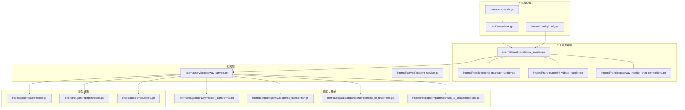
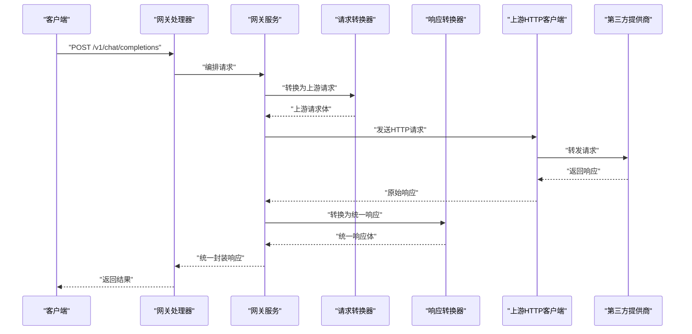
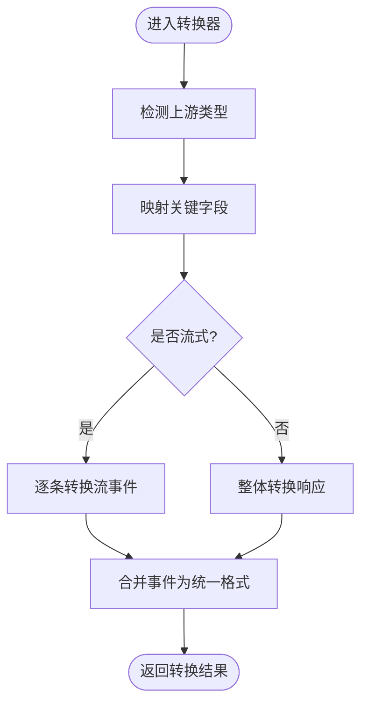
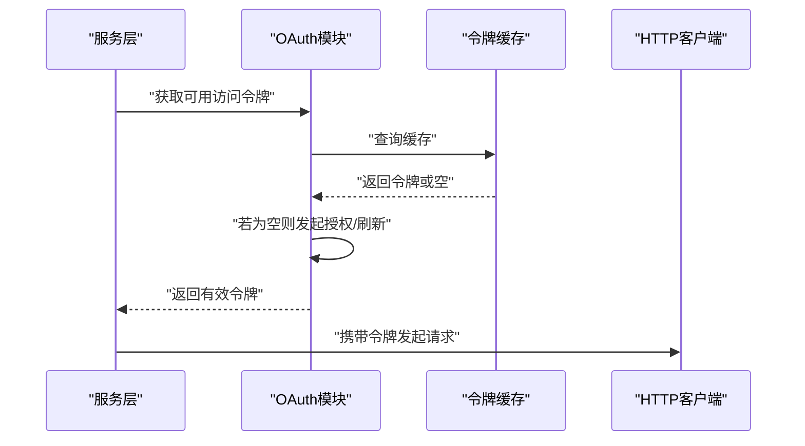
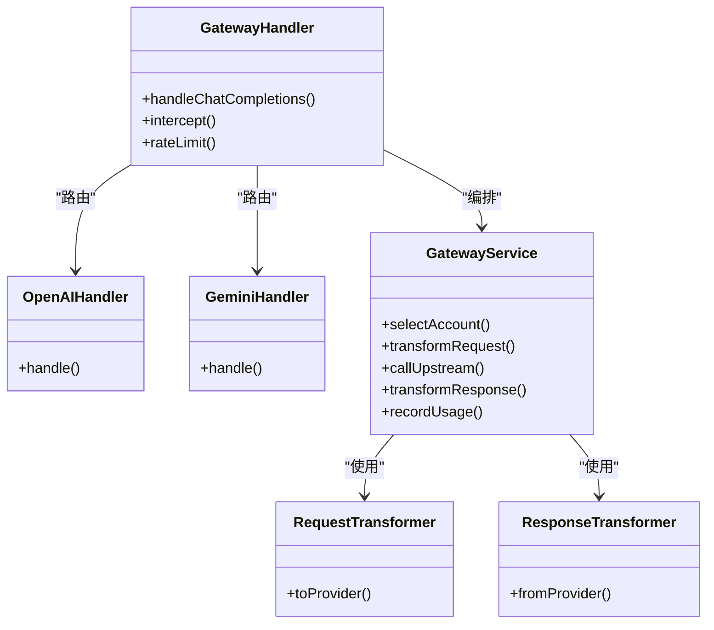
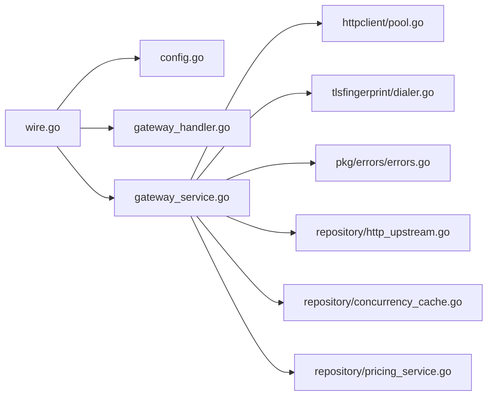

# 插件开发

<cite>
**本文引用的文件**
- [backend/internal/pkg/antigravity/client.go](file://backend/internal/pkg/antigravity/client.go)
- [backend/internal/pkg/antigravity/request_transformer.go](file://backend/internal/pkg/antigravity/request_transformer.go)
- [backend/internal/pkg/antigravity/response_transformer.go](file://backend/internal/pkg/antigravity/response_transformer.go)
- [backend/internal/pkg/apicompat/chatcompletions_to_responses.go](file://backend/internal/pkg/apicompat/chatcompletions_to_responses.go)
- [backend/internal/pkg/apicompat/responses_to_chatcompletions.go](file://backend/internal/pkg/apicompat/responses_to_chatcompletions.go)
- [backend/internal/pkg/openai/oauth.go](file://backend/internal/pkg/openai/oauth.go)
- [backend/internal/pkg/gemini/models.go](file://backend/internal/pkg/gemini/models.go)
- [backend/internal/pkg/geminicli/oauth.go](file://backend/internal/pkg/geminicli/oauth.go)
- [backend/internal/handler/gateway_handler.go](file://backend/internal/handler/gateway_handler.go)
- [backend/internal/handler/gateway_handler_chat_completions.go](file://backend/internal/handler/gateway_handler_chat_completions.go)
- [backend/internal/handler/openai_gateway_handler.go](file://backend/internal/handler/openai_gateway_handler.go)
- [backend/internal/handler/gemini_v1beta_handler.go](file://backend/internal/handler/gemini_v1beta_handler.go)
- [backend/internal/service/gateway_service.go](file://backend/internal/service/gateway_service.go)
- [backend/internal/service/account_service.go](file://backend/internal/service/account_service.go)
- [backend/internal/config/config.go](file://backend/internal/config/config.go)
- [backend/internal/pkg/errors/errors.go](file://backend/internal/pkg/errors/errors.go)
- [backend/internal/pkg/httpclient/pool.go](file://backend/internal/pkg/httpclient/pool.go)
- [backend/internal/pkg/tlsfingerprint/dialer.go](file://backend/internal/pkg/tlsfingerprint/dialer.go)
- [backend/internal/repository/http_upstream.go](file://backend/internal/repository/http_upstream.go)
- [backend/internal/repository/gemini_token_cache.go](file://backend/internal/repository/gemini_token_cache.go)
- [backend/internal/repository/concurrency_cache.go](file://backend/internal/repository/concurrency_cache.go)
- [backend/internal/repository/pricing_service.go](file://backend/internal/repository/pricing_service.go)
- [backend/internal/middleware/rate_limiter.go](file://backend/internal/middleware/rate_limiter.go)
- [backend/cmd/server/main.go](file://backend/cmd/server/main.go)
- [backend/cmd/server/wire.go](file://backend/cmd/server/wire.go)
- [backend/go.mod](file://backend/go.mod)
</cite>

## 目录
1. [简介](#简介)
2. [项目结构](#项目结构)
3. [核心组件](#核心组件)
4. [架构总览](#架构总览)
5. [详细组件分析](#详细组件分析)
6. [依赖关系分析](#依赖关系分析)
7. [性能考量](#性能考量)
8. [故障排查指南](#故障排查指南)
9. [结论](#结论)
10. [附录](#附录)

## 简介
本文件面向希望为Sub2API开发“新模型提供商插件”的工程师，系统性说明如何对接第三方API（如OpenAI、Claude、Gemini等），包括插件接口规范、认证机制、请求/响应转换器、错误处理与性能优化、生命周期与配置加载、热重载机制，以及端到端的开发示例与测试策略。内容基于仓库中的现有实现进行归纳总结，帮助快速上手并保持与现有架构的一致性。

## 项目结构
Sub2API后端采用分层架构：入口命令与依赖注入在cmd/server中，业务网关在internal/handler，核心业务逻辑在internal/service，通用工具与第三方适配在internal/pkg，数据访问在internal/repository，配置在internal/config。插件化能力通过“请求/响应转换器”和“网关服务”实现，可扩展至任意上游服务。

图示来源
- [backend/cmd/server/main.go:1-200](file://backend/cmd/server/main.go#L1-L200)
- [backend/cmd/server/wire.go:1-200](file://backend/cmd/server/wire.go#L1-L200)
- [backend/internal/handler/gateway_handler.go:1-200](file://backend/internal/handler/gateway_handler.go#L1-L200)
- [backend/internal/handler/openai_gateway_handler.go:1-200](file://backend/internal/handler/openai_gateway_handler.go#L1-L200)
- [backend/internal/handler/gemini_v1beta_handler.go:1-200](file://backend/internal/handler/gemini_v1beta_handler.go#L1-L200)
- [backend/internal/handler/gateway_handler_chat_completions.go:1-200](file://backend/internal/handler/gateway_handler_chat_completions.go#L1-L200)
- [backend/internal/service/gateway_service.go:1-200](file://backend/internal/service/gateway_service.go#L1-L200)
- [backend/internal/service/account_service.go:1-200](file://backend/internal/service/account_service.go#L1-L200)
- [backend/internal/pkg/antigravity/request_transformer.go:1-200](file://backend/internal/pkg/antigravity/request_transformer.go#L1-L200)
- [backend/internal/pkg/antigravity/response_transformer.go:1-200](file://backend/internal/pkg/antigravity/response_transformer.go#L1-L200)
- [backend/internal/pkg/apicompat/chatcompletions_to_responses.go:1-200](file://backend/internal/pkg/apicompat/chatcompletions_to_responses.go#L1-L200)
- [backend/internal/pkg/apicompat/responses_to_chatcompletions.go:1-200](file://backend/internal/pkg/apicompat/responses_to_chatcompletions.go#L1-L200)
- [backend/internal/pkg/httpclient/pool.go:1-200](file://backend/internal/pkg/httpclient/pool.go#L1-L200)
- [backend/internal/pkg/tlsfingerprint/dialer.go:1-200](file://backend/internal/pkg/tlsfingerprint/dialer.go#L1-L200)
- [backend/internal/pkg/errors/errors.go:1-200](file://backend/internal/pkg/errors/errors.go#L1-L200)

章节来源
- [backend/cmd/server/main.go:1-200](file://backend/cmd/server/main.go#L1-L200)
- [backend/cmd/server/wire.go:1-200](file://backend/cmd/server/wire.go#L1-L200)
- [backend/internal/config/config.go:1-200](file://backend/internal/config/config.go#L1-L200)

## 核心组件
- 网关处理器：负责路由与转发，支持OpenAI/Gemini等不同上游的聊天补全接口。
- 网关服务：核心编排层，负责选择账户、执行转换器、调用上游HTTP客户端、聚合统计与错误处理。
- 请求/响应转换器：将统一格式与第三方格式互转，保证兼容性。
- 认证与令牌：OpenAI/Gemini等提供方的OAuth与令牌刷新机制。
- 基础设施：HTTP连接池、TLS指纹拨号器、错误封装。
- 配置与依赖注入：通过wire生成依赖图，集中管理组件生命周期。

章节来源
- [backend/internal/handler/gateway_handler.go:1-200](file://backend/internal/handler/gateway_handler.go#L1-L200)
- [backend/internal/service/gateway_service.go:1-200](file://backend/internal/service/gateway_service.go#L1-L200)
- [backend/internal/pkg/antigravity/request_transformer.go:1-200](file://backend/internal/pkg/antigravity/request_transformer.go#L1-L200)
- [backend/internal/pkg/antigravity/response_transformer.go:1-200](file://backend/internal/pkg/antigravity/response_transformer.go#L1-L200)
- [backend/internal/pkg/openai/oauth.go:1-200](file://backend/internal/pkg/openai/oauth.go#L1-L200)
- [backend/internal/pkg/geminicli/oauth.go:1-200](file://backend/internal/pkg/geminicli/oauth.go#L1-L200)
- [backend/internal/pkg/httpclient/pool.go:1-200](file://backend/internal/pkg/httpclient/pool.go#L1-L200)
- [backend/internal/pkg/tlsfingerprint/dialer.go:1-200](file://backend/internal/pkg/tlsfingerprint/dialer.go#L1-L200)
- [backend/internal/pkg/errors/errors.go:1-200](file://backend/internal/pkg/errors/errors.go#L1-L200)

## 架构总览
下图展示了从客户端请求到上游服务返回的完整链路，以及转换器与认证模块的嵌入点。

图示来源
- [backend/internal/handler/gateway_handler_chat_completions.go:1-200](file://backend/internal/handler/gateway_handler_chat_completions.go#L1-L200)
- [backend/internal/service/gateway_service.go:1-200](file://backend/internal/service/gateway_service.go#L1-L200)
- [backend/internal/pkg/antigravity/request_transformer.go:1-200](file://backend/internal/pkg/antigravity/request_transformer.go#L1-L200)
- [backend/internal/pkg/antigravity/response_transformer.go:1-200](file://backend/internal/pkg/antigravity/response_transformer.go#L1-L200)
- [backend/internal/repository/http_upstream.go:1-200](file://backend/internal/repository/http_upstream.go#L1-L200)

## 详细组件分析

### 组件A：请求/响应转换器
- 职责：将统一的请求/响应格式与各上游格式互转；确保字段映射、流式输出与错误码一致。
- 关键实现位置：
  - 请求转换器：[backend/internal/pkg/antigravity/request_transformer.go:1-200](file://backend/internal/pkg/antigravity/request_transformer.go#L1-L200)
  - 响应转换器：[backend/internal/pkg/antigravity/response_transformer.go:1-200](file://backend/internal/pkg/antigravity/response_transformer.go#L1-L200)
  - OpenAI兼容层（双向）：[backend/internal/pkg/apicompat/chatcompletions_to_responses.go:1-200](file://backend/internal/pkg/apicompat/chatcompletions_to_responses.go#L1-L200)、[backend/internal/pkg/apicompat/responses_to_chatcompletions.go:1-200](file://backend/internal/pkg/apicompat/responses_to_chatcompletions.go#L1-L200)
- 设计要点：
  - 字段映射：确保模型名、消息数组、温度、最大长度等关键字段正确映射。
  - 流式输出：对流式事件进行逐条转换，保持事件边界与格式一致性。
  - 错误码映射：将上游错误映射为统一错误码，便于上层处理。

图示来源
- [backend/internal/pkg/antigravity/request_transformer.go:1-200](file://backend/internal/pkg/antigravity/request_transformer.go#L1-L200)
- [backend/internal/pkg/antigravity/response_transformer.go:1-200](file://backend/internal/pkg/antigravity/response_transformer.go#L1-L200)

章节来源
- [backend/internal/pkg/antigravity/request_transformer.go:1-200](file://backend/internal/pkg/antigravity/request_transformer.go#L1-L200)
- [backend/internal/pkg/antigravity/response_transformer.go:1-200](file://backend/internal/pkg/antigravity/response_transformer.go#L1-L200)
- [backend/internal/pkg/apicompat/chatcompletions_to_responses.go:1-200](file://backend/internal/pkg/apicompat/chatcompletions_to_responses.go#L1-L200)
- [backend/internal/pkg/apicompat/responses_to_chatcompletions.go:1-200](file://backend/internal/pkg/apicompat/responses_to_chatcompletions.go#L1-L200)

### 组件B：认证与令牌刷新
- OpenAI OAuth与令牌：[backend/internal/pkg/openai/oauth.go:1-200](file://backend/internal/pkg/openai/oauth.go#L1-L200)
- Gemini CLI OAuth与令牌：[backend/internal/pkg/geminicli/oauth.go:1-200](file://backend/internal/pkg/geminicli/oauth.go#L1-L200)
- 典型流程：
  - 初始化时加载凭据或OAuth授权码。
  - 在请求前检查令牌有效性，必要时触发刷新。
  - 将最终令牌注入到HTTP请求头中。

图示来源
- [backend/internal/pkg/openai/oauth.go:1-200](file://backend/internal/pkg/openai/oauth.go#L1-L200)
- [backend/internal/pkg/geminicli/oauth.go:1-200](file://backend/internal/pkg/geminicli/oauth.go#L1-L200)
- [backend/internal/repository/gemini_token_cache.go:1-200](file://backend/internal/repository/gemini_token_cache.go#L1-L200)

章节来源
- [backend/internal/pkg/openai/oauth.go:1-200](file://backend/internal/pkg/openai/oauth.go#L1-L200)
- [backend/internal/pkg/geminicli/oauth.go:1-200](file://backend/internal/pkg/geminicli/oauth.go#L1-L200)
- [backend/internal/repository/gemini_token_cache.go:1-200](file://backend/internal/repository/gemini_token_cache.go#L1-L200)

### 组件C：网关处理器与服务
- 网关处理器：负责路由到具体提供商处理器（如OpenAI、Gemini），并处理通用逻辑（限流、幂等、拦截等）。参考：
  - [backend/internal/handler/gateway_handler.go:1-200](file://backend/internal/handler/gateway_handler.go#L1-L200)
  - [backend/internal/handler/openai_gateway_handler.go:1-200](file://backend/internal/handler/openai_gateway_handler.go#L1-L200)
  - [backend/internal/handler/gemini_v1beta_handler.go:1-200](file://backend/internal/handler/gemini_v1beta_handler.go#L1-L200)
  - [backend/internal/handler/gateway_handler_chat_completions.go:1-200](file://backend/internal/handler/gateway_handler_chat_completions.go#L1-L200)
- 网关服务：核心编排，选择账户、执行转换器、调用上游、记录用量与错误。参考：
  - [backend/internal/service/gateway_service.go:1-200](file://backend/internal/service/gateway_service.go#L1-L200)
  - [backend/internal/service/account_service.go:1-200](file://backend/internal/service/account_service.go#L1-L200)

图示来源
- [backend/internal/handler/gateway_handler.go:1-200](file://backend/internal/handler/gateway_handler.go#L1-L200)
- [backend/internal/handler/openai_gateway_handler.go:1-200](file://backend/internal/handler/openai_gateway_handler.go#L1-L200)
- [backend/internal/handler/gemini_v1beta_handler.go:1-200](file://backend/internal/handler/gemini_v1beta_handler.go#L1-L200)
- [backend/internal/service/gateway_service.go:1-200](file://backend/internal/service/gateway_service.go#L1-L200)
- [backend/internal/pkg/antigravity/request_transformer.go:1-200](file://backend/internal/pkg/antigravity/request_transformer.go#L1-L200)
- [backend/internal/pkg/antigravity/response_transformer.go:1-200](file://backend/internal/pkg/antigravity/response_transformer.go#L1-L200)

章节来源
- [backend/internal/handler/gateway_handler.go:1-200](file://backend/internal/handler/gateway_handler.go#L1-L200)
- [backend/internal/handler/openai_gateway_handler.go:1-200](file://backend/internal/handler/openai_gateway_handler.go#L1-L200)
- [backend/internal/handler/gemini_v1beta_handler.go:1-200](file://backend/internal/handler/gemini_v1beta_handler.go#L1-L200)
- [backend/internal/handler/gateway_handler_chat_completions.go:1-200](file://backend/internal/handler/gateway_handler_chat_completions.go#L1-L200)
- [backend/internal/service/gateway_service.go:1-200](file://backend/internal/service/gateway_service.go#L1-L200)
- [backend/internal/service/account_service.go:1-200](file://backend/internal/service/account_service.go#L1-L200)

### 组件D：基础设施与错误处理
- HTTP连接池：复用TCP连接，降低握手开销。参考：[backend/internal/pkg/httpclient/pool.go:1-200](file://backend/internal/pkg/httpclient/pool.go#L1-L200)
- TLS指纹拨号器：用于特定TLS指纹场景下的网络拨号。参考：[backend/internal/pkg/tlsfingerprint/dialer.go:1-200](file://backend/internal/pkg/tlsfingerprint/dialer.go#L1-L200)
- 错误封装：统一错误类型与HTTP状态码映射。参考：[backend/internal/pkg/errors/errors.go:1-200](file://backend/internal/pkg/errors/errors.go#L1-L200)

章节来源
- [backend/internal/pkg/httpclient/pool.go:1-200](file://backend/internal/pkg/httpclient/pool.go#L1-L200)
- [backend/internal/pkg/tlsfingerprint/dialer.go:1-200](file://backend/internal/pkg/tlsfingerprint/dialer.go#L1-L200)
- [backend/internal/pkg/errors/errors.go:1-200](file://backend/internal/pkg/errors/errors.go#L1-L200)

## 依赖关系分析
- 依赖注入：通过wire在启动时生成依赖图，集中管理组件生命周期与实例化顺序。参考：[backend/cmd/server/wire.go:1-200](file://backend/cmd/server/wire.go#L1-L200)
- 配置加载：从配置文件读取全局参数，驱动网关行为与上游连接。参考：[backend/internal/config/config.go:1-200](file://backend/internal/config/config.go#L1-L200)
- 数据访问：上游HTTP调用、并发控制、配额与定价等通过repository层抽象。参考：
  - [backend/internal/repository/http_upstream.go:1-200](file://backend/internal/repository/http_upstream.go#L1-L200)
  - [backend/internal/repository/concurrency_cache.go:1-200](file://backend/internal/repository/concurrency_cache.go#L1-L200)
  - [backend/internal/repository/pricing_service.go:1-200](file://backend/internal/repository/pricing_service.go#L1-L200)

图示来源
- [backend/cmd/server/wire.go:1-200](file://backend/cmd/server/wire.go#L1-L200)
- [backend/internal/config/config.go:1-200](file://backend/internal/config/config.go#L1-L200)
- [backend/internal/service/gateway_service.go:1-200](file://backend/internal/service/gateway_service.go#L1-L200)
- [backend/internal/pkg/httpclient/pool.go:1-200](file://backend/internal/pkg/httpclient/pool.go#L1-L200)
- [backend/internal/pkg/tlsfingerprint/dialer.go:1-200](file://backend/internal/pkg/tlsfingerprint/dialer.go#L1-L200)
- [backend/internal/pkg/errors/errors.go:1-200](file://backend/internal/pkg/errors/errors.go#L1-L200)
- [backend/internal/repository/http_upstream.go:1-200](file://backend/internal/repository/http_upstream.go#L1-L200)
- [backend/internal/repository/concurrency_cache.go:1-200](file://backend/internal/repository/concurrency_cache.go#L1-L200)
- [backend/internal/repository/pricing_service.go:1-200](file://backend/internal/repository/pricing_service.go#L1-L200)

章节来源
- [backend/cmd/server/wire.go:1-200](file://backend/cmd/server/wire.go#L1-L200)
- [backend/internal/config/config.go:1-200](file://backend/internal/config/config.go#L1-L200)
- [backend/internal/repository/http_upstream.go:1-200](file://backend/internal/repository/http_upstream.go#L1-L200)
- [backend/internal/repository/concurrency_cache.go:1-200](file://backend/internal/repository/concurrency_cache.go#L1-L200)
- [backend/internal/repository/pricing_service.go:1-200](file://backend/internal/repository/pricing_service.go#L1-L200)

## 性能考量
- 连接复用：使用HTTP连接池减少TCP握手与TLS握手成本。参考：[backend/internal/pkg/httpclient/pool.go:1-200](file://backend/internal/pkg/httpclient/pool.go#L1-L200)
- 并发控制：通过并发缓存限制同时请求数，避免上游限流或过载。参考：[backend/internal/repository/concurrency_cache.go:1-200](file://backend/internal/repository/concurrency_cache.go#L1-L200)
- 限流中间件：在入口处按用户/密钥维度进行速率限制，保护上游与下游稳定性。参考：[backend/internal/middleware/rate_limiter.go:1-200](file://backend/internal/middleware/rate_limiter.go#L1-L200)
- 配额与定价：根据上游模型与计费模式动态计算用量，避免超额使用。参考：[backend/internal/repository/pricing_service.go:1-200](file://backend/internal/repository/pricing_service.go#L1-L200)
- TLS指纹：在需要特定TLS指纹的场景下使用专用拨号器，提升连通性与稳定性。参考：[backend/internal/pkg/tlsfingerprint/dialer.go:1-200](file://backend/internal/pkg/tlsfingerprint/dialer.go#L1-L200)

章节来源
- [backend/internal/pkg/httpclient/pool.go:1-200](file://backend/internal/pkg/httpclient/pool.go#L1-L200)
- [backend/internal/repository/concurrency_cache.go:1-200](file://backend/internal/repository/concurrency_cache.go#L1-L200)
- [backend/internal/middleware/rate_limiter.go:1-200](file://backend/internal/middleware/rate_limiter.go#L1-L200)
- [backend/internal/repository/pricing_service.go:1-200](file://backend/internal/repository/pricing_service.go#L1-L200)
- [backend/internal/pkg/tlsfingerprint/dialer.go:1-200](file://backend/internal/pkg/tlsfingerprint/dialer.go#L1-L200)

## 故障排查指南
- 错误类型与HTTP映射：统一错误封装，便于定位上游异常与内部错误。参考：[backend/internal/pkg/errors/errors.go:1-200](file://backend/internal/pkg/errors/errors.go#L1-L200)
- 上游HTTP调用失败：检查连接池配置、超时设置与TLS拨号器；确认令牌是否有效。参考：
  - [backend/internal/repository/http_upstream.go:1-200](file://backend/internal/repository/http_upstream.go#L1-L200)
  - [backend/internal/pkg/httpclient/pool.go:1-200](file://backend/internal/pkg/httpclient/pool.go#L1-L200)
  - [backend/internal/pkg/tlsfingerprint/dialer.go:1-200](file://backend/internal/pkg/tlsfingerprint/dialer.go#L1-L200)
- 认证失败：核对OAuth授权流程、令牌刷新逻辑与缓存命中情况。参考：
  - [backend/internal/pkg/openai/oauth.go:1-200](file://backend/internal/pkg/openai/oauth.go#L1-L200)
  - [backend/internal/pkg/geminicli/oauth.go:1-200](file://backend/internal/pkg/geminicli/oauth.go#L1-L200)
  - [backend/internal/repository/gemini_token_cache.go:1-200](file://backend/internal/repository/gemini_token_cache.go#L1-L200)
- 转换器异常：检查字段映射与流式事件边界，确保与上游协议一致。参考：
  - [backend/internal/pkg/antigravity/request_transformer.go:1-200](file://backend/internal/pkg/antigravity/request_transformer.go#L1-L200)
  - [backend/internal/pkg/antigravity/response_transformer.go:1-200](file://backend/internal/pkg/antigravity/response_transformer.go#L1-L200)
  - [backend/internal/pkg/apicompat/chatcompletions_to_responses.go:1-200](file://backend/internal/pkg/apicompat/chatcompletions_to_responses.go#L1-L200)
  - [backend/internal/pkg/apicompat/responses_to_chatcompletions.go:1-200](file://backend/internal/pkg/apicompat/responses_to_chatcompletions.go#L1-L200)

章节来源
- [backend/internal/pkg/errors/errors.go:1-200](file://backend/internal/pkg/errors/errors.go#L1-L200)
- [backend/internal/repository/http_upstream.go:1-200](file://backend/internal/repository/http_upstream.go#L1-L200)
- [backend/internal/pkg/httpclient/pool.go:1-200](file://backend/internal/pkg/httpclient/pool.go#L1-L200)
- [backend/internal/pkg/tlsfingerprint/dialer.go:1-200](file://backend/internal/pkg/tlsfingerprint/dialer.go#L1-L200)
- [backend/internal/pkg/openai/oauth.go:1-200](file://backend/internal/pkg/openai/oauth.go#L1-L200)
- [backend/internal/pkg/geminicli/oauth.go:1-200](file://backend/internal/pkg/geminicli/oauth.go#L1-L200)
- [backend/internal/repository/gemini_token_cache.go:1-200](file://backend/internal/repository/gemini_token_cache.go#L1-L200)
- [backend/internal/pkg/antigravity/request_transformer.go:1-200](file://backend/internal/pkg/antigravity/request_transformer.go#L1-L200)
- [backend/internal/pkg/antigravity/response_transformer.go:1-200](file://backend/internal/pkg/antigravity/response_transformer.go#L1-L200)
- [backend/internal/pkg/apicompat/chatcompletions_to_responses.go:1-200](file://backend/internal/pkg/apicompat/chatcompletions_to_responses.go#L1-L200)
- [backend/internal/pkg/apicompat/responses_to_chatcompletions.go:1-200](file://backend/internal/pkg/apicompat/responses_to_chatcompletions.go#L1-L200)

## 结论
通过“请求/响应转换器+网关服务+认证与令牌+基础设施”的组合，Sub2API实现了对多提供商的插件化接入。遵循本文档的接口规范与最佳实践，即可快速完成新上游的适配与集成，并在性能、稳定性与可观测性方面保持一致水准。

## 附录

### 插件开发步骤（新上游适配）
- 步骤1：定义上游常量与模型映射
  - 参考：[backend/internal/pkg/gemini/models.go:1-200](file://backend/internal/pkg/gemini/models.go#L1-L200)
- 步骤2：实现请求转换器
  - 将统一请求映射为上游请求，确保关键字段与流式事件边界正确。参考：[backend/internal/pkg/antigravity/request_transformer.go:1-200](file://backend/internal/pkg/antigravity/request_transformer.go#L1-L200)
- 步骤3：实现响应转换器
  - 将上游响应映射为统一响应，处理流式事件与错误码。参考：[backend/internal/pkg/antigravity/response_transformer.go:1-200](file://backend/internal/pkg/antigravity/response_transformer.go#L1-L200)
- 步骤4：实现认证与令牌刷新
  - 按需实现OAuth与令牌缓存，确保请求头注入。参考：
    - [backend/internal/pkg/openai/oauth.go:1-200](file://backend/internal/pkg/openai/oauth.go#L1-L200)
    - [backend/internal/pkg/geminicli/oauth.go:1-200](file://backend/internal/pkg/geminicli/oauth.go#L1-L200)
- 步骤5：编写网关处理器
  - 将新上游路由到对应处理器，复用通用拦截、限流与幂等逻辑。参考：
    - [backend/internal/handler/gateway_handler.go:1-200](file://backend/internal/handler/gateway_handler.go#L1-L200)
    - [backend/internal/handler/gateway_handler_chat_completions.go:1-200](file://backend/internal/handler/gateway_handler_chat_completions.go#L1-L200)
- 步骤6：接入网关服务
  - 在网关服务中注册转换器与认证模块，确保编排链路完整。参考：[backend/internal/service/gateway_service.go:1-200](file://backend/internal/service/gateway_service.go#L1-L200)
- 步骤7：配置与依赖注入
  - 在配置文件中新增上游参数，在wire中注册组件。参考：
    - [backend/internal/config/config.go:1-200](file://backend/internal/config/config.go#L1-L200)
    - [backend/cmd/server/wire.go:1-200](file://backend/cmd/server/wire.go#L1-L200)
- 步骤8：性能与稳定性加固
  - 启用连接池、并发控制、限流与TLS指纹拨号器。参考：
    - [backend/internal/pkg/httpclient/pool.go:1-200](file://backend/internal/pkg/httpclient/pool.go#L1-L200)
    - [backend/internal/repository/concurrency_cache.go:1-200](file://backend/internal/repository/concurrency_cache.go#L1-L200)
    - [backend/internal/middleware/rate_limiter.go:1-200](file://backend/internal/middleware/rate_limiter.go#L1-L200)
    - [backend/internal/pkg/tlsfingerprint/dialer.go:1-200](file://backend/internal/pkg/tlsfingerprint/dialer.go#L1-L200)
- 步骤9：测试与调试
  - 单元测试覆盖转换器与认证流程；集成测试验证端到端链路；使用日志与错误封装定位问题。参考：
    - [backend/internal/pkg/errors/errors.go:1-200](file://backend/internal/pkg/errors/errors.go#L1-L200)
    - [backend/internal/repository/http_upstream.go:1-200](file://backend/internal/repository/http_upstream.go#L1-L200)

章节来源
- [backend/internal/pkg/gemini/models.go:1-200](file://backend/internal/pkg/gemini/models.go#L1-L200)
- [backend/internal/pkg/antigravity/request_transformer.go:1-200](file://backend/internal/pkg/antigravity/request_transformer.go#L1-L200)
- [backend/internal/pkg/antigravity/response_transformer.go:1-200](file://backend/internal/pkg/antigravity/response_transformer.go#L1-L200)
- [backend/internal/pkg/openai/oauth.go:1-200](file://backend/internal/pkg/openai/oauth.go#L1-L200)
- [backend/internal/pkg/geminicli/oauth.go:1-200](file://backend/internal/pkg/geminicli/oauth.go#L1-L200)
- [backend/internal/handler/gateway_handler.go:1-200](file://backend/internal/handler/gateway_handler.go#L1-L200)
- [backend/internal/handler/gateway_handler_chat_completions.go:1-200](file://backend/internal/handler/gateway_handler_chat_completions.go#L1-L200)
- [backend/internal/service/gateway_service.go:1-200](file://backend/internal/service/gateway_service.go#L1-L200)
- [backend/internal/config/config.go:1-200](file://backend/internal/config/config.go#L1-L200)
- [backend/cmd/server/wire.go:1-200](file://backend/cmd/server/wire.go#L1-L200)
- [backend/internal/pkg/httpclient/pool.go:1-200](file://backend/internal/pkg/httpclient/pool.go#L1-L200)
- [backend/internal/repository/concurrency_cache.go:1-200](file://backend/internal/repository/concurrency_cache.go#L1-L200)
- [backend/internal/middleware/rate_limiter.go:1-200](file://backend/internal/middleware/rate_limiter.go#L1-L200)
- [backend/internal/pkg/tlsfingerprint/dialer.go:1-200](file://backend/internal/pkg/tlsfingerprint/dialer.go#L1-L200)
- [backend/internal/pkg/errors/errors.go:1-200](file://backend/internal/pkg/errors/errors.go#L1-L200)
- [backend/internal/repository/http_upstream.go:1-200](file://backend/internal/repository/http_upstream.go#L1-L200)