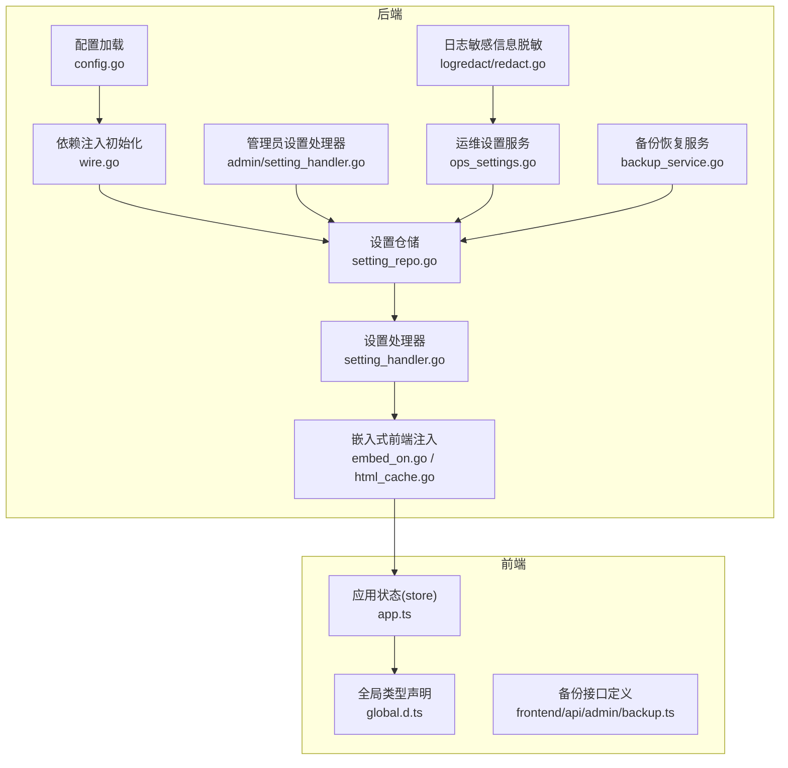
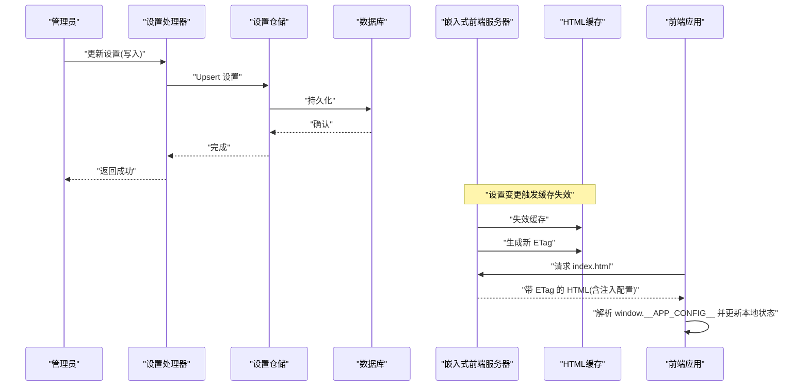
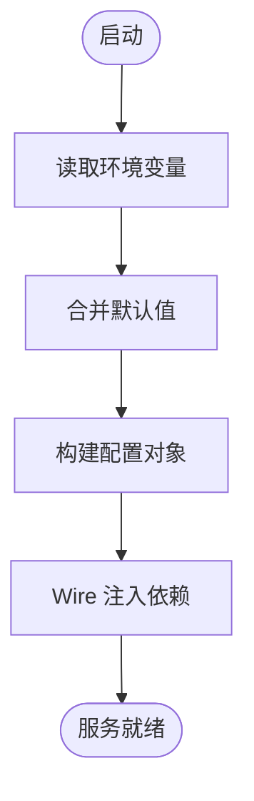
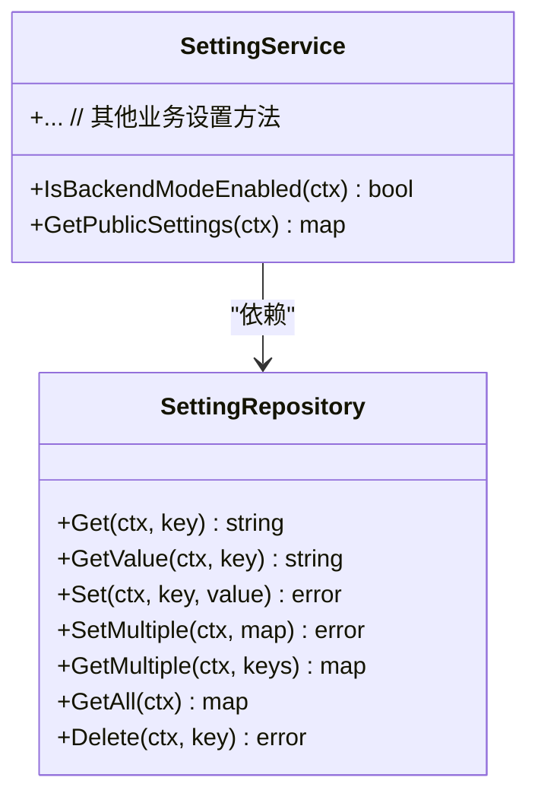
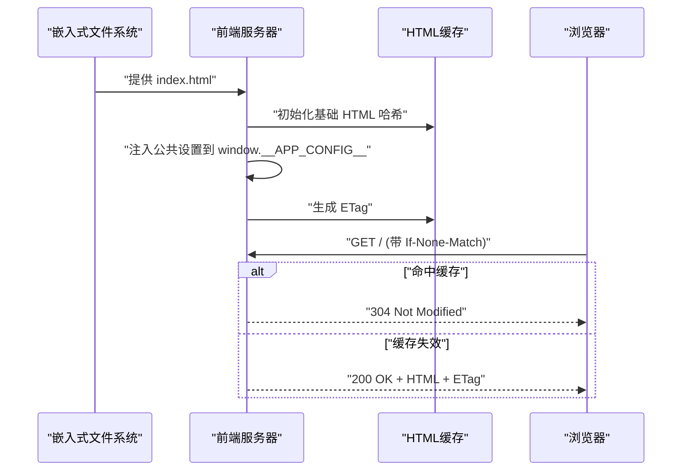
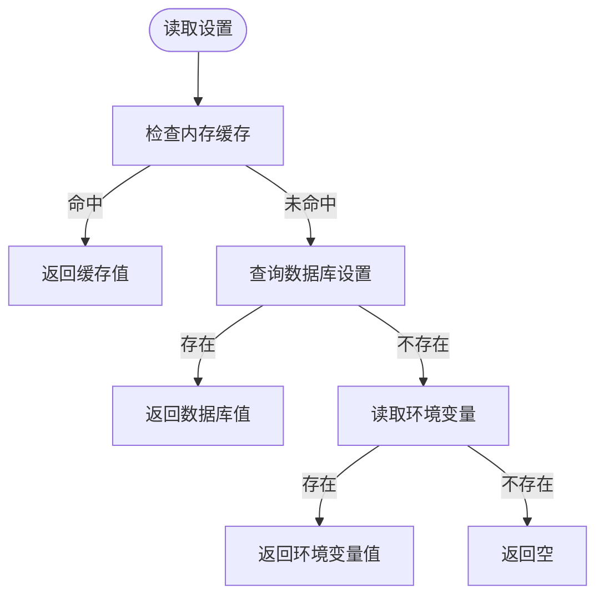
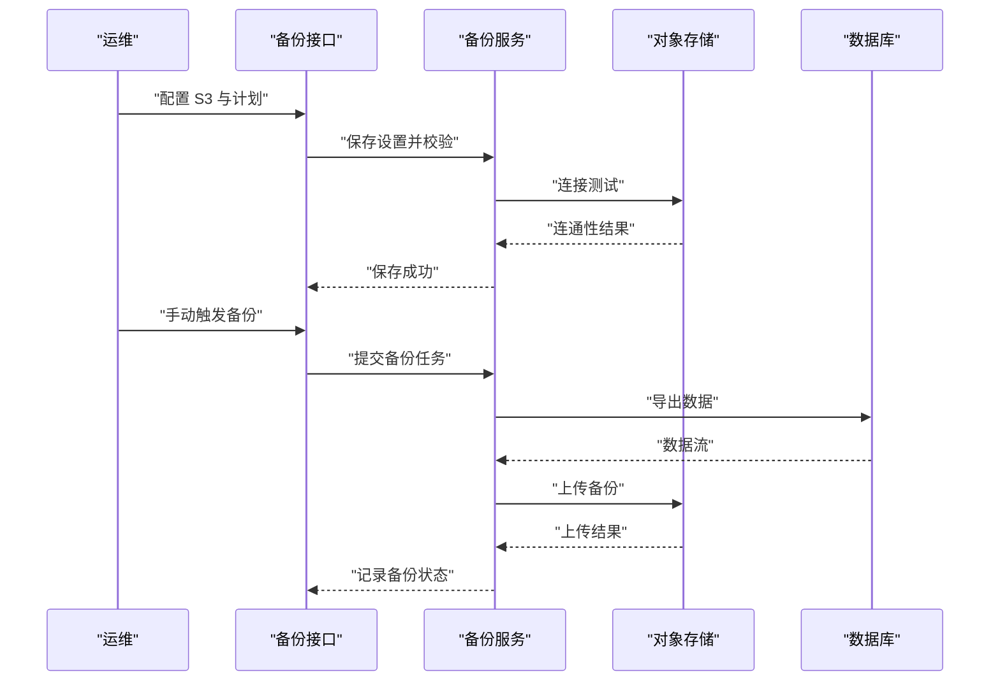
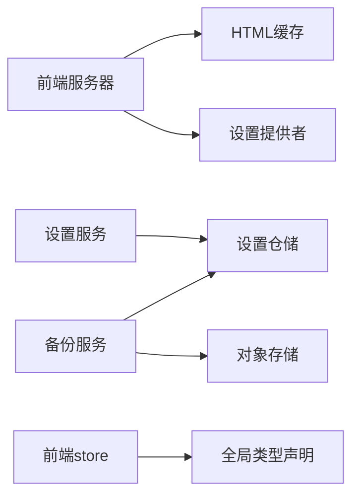

# 配置管理

<cite>
**本文引用的文件**   
- [backend/internal/config/config.go](file://backend/internal/config/config.go)
- [backend/internal/config/config_test.go](file://backend/internal/config/config_test.go)
- [backend/internal/config/wire.go](file://backend/internal/config/wire.go)
- [backend/internal/repository/setting_repo.go](file://backend/internal/repository/setting_repo.go)
- [backend/internal/repository/setting_repo_integration_test.go](file://backend/internal/repository/setting_repo_integration_test.go)
- [backend/internal/handler/setting_handler.go](file://backend/internal/handler/setting_handler.go)
- [backend/internal/handler/admin/setting_handler.go](file://backend/internal/handler/admin/setting_handler.go)
- [backend/internal/handler/dto/settings.go](file://backend/internal/handler/dto/settings.go)
- [backend/internal/service/ops_settings.go](file://backend/internal/service/ops_settings.go)
- [backend/internal/web/embed_on.go](file://backend/internal/web/embed_on.go)
- [backend/internal/web/html_cache.go](file://backend/internal/web/html_cache.go)
- [backend/internal/web/embed_test.go](file://backend/internal/web/embed_test.go)
- [frontend/src/types/global.d.ts](file://frontend/src/types/global.d.ts)
- [frontend/src/stores/app.ts](file://frontend/src/stores/app.ts)
- [sub2apipay/src/lib/system-config.ts](file://sub2apipay/src/lib/system-config.ts)
- [backend/internal/service/backup_service.go](file://backend/internal/service/backup_service.go)
- [frontend/src/api/admin/backup.ts](file://frontend/src/api/admin/backup.ts)
- [backend/internal/util/logredact/redact.go](file://backend/internal/util/logredact/redact.go)
</cite>

## 目录
1. [简介](#简介)
2. [项目结构](#项目结构)
3. [核心组件](#核心组件)
4. [架构总览](#架构总览)
5. [详细组件分析](#详细组件分析)
6. [依赖关系分析](#依赖关系分析)
7. [性能考量](#性能考量)
8. [故障排查指南](#故障排查指南)
9. [结论](#结论)
10. [附录](#附录)

## 简介
本指南围绕 Sub2API 的配置管理体系，系统阐述后端与前端的配置读取、写入、热重载与同步策略，涵盖环境变量优先级、默认值回退、敏感信息保护、配置持久化与备份恢复、版本控制与迁移建议，以及面向用户的偏好设置、主题与国际化配置管理。文档以代码为依据，辅以图示与最佳实践，帮助开发者快速落地灵活可靠的配置管理方案。

## 项目结构
配置管理涉及后端配置加载、数据库设置表、Web 嵌入式前端注入、前端状态与类型声明、以及备份恢复与敏感信息脱敏等模块。下图给出与配置相关的关键文件与交互关系概览。

**图表来源**
- [backend/internal/config/config.go](file://backend/internal/config/config.go)
- [backend/internal/config/wire.go](file://backend/internal/config/wire.go)
- [backend/internal/repository/setting_repo.go](file://backend/internal/repository/setting_repo.go)
- [backend/internal/handler/setting_handler.go](file://backend/internal/handler/setting_handler.go)
- [backend/internal/handler/admin/setting_handler.go](file://backend/internal/handler/admin/setting_handler.go)
- [backend/internal/service/ops_settings.go](file://backend/internal/service/ops_settings.go)
- [backend/internal/web/embed_on.go](file://backend/internal/web/embed_on.go)
- [backend/internal/web/html_cache.go](file://backend/internal/web/html_cache.go)
- [backend/internal/util/logredact/redact.go](file://backend/internal/util/logredact/redact.go)
- [backend/internal/service/backup_service.go](file://backend/internal/service/backup_service.go)
- [frontend/src/types/global.d.ts](file://frontend/src/types/global.d.ts)
- [frontend/src/stores/app.ts](file://frontend/src/stores/app.ts)
- [frontend/src/api/admin/backup.ts](file://frontend/src/api/admin/backup.ts)

**章节来源**
- [backend/internal/config/config.go](file://backend/internal/config/config.go)
- [backend/internal/config/wire.go](file://backend/internal/config/wire.go)
- [backend/internal/repository/setting_repo.go](file://backend/internal/repository/setting_repo.go)
- [backend/internal/handler/setting_handler.go](file://backend/internal/handler/setting_handler.go)
- [backend/internal/handler/admin/setting_handler.go](file://backend/internal/handler/admin/setting_handler.go)
- [backend/internal/service/ops_settings.go](file://backend/internal/service/ops_settings.go)
- [backend/internal/web/embed_on.go](file://backend/internal/web/embed_on.go)
- [backend/internal/web/html_cache.go](file://backend/internal/web/html_cache.go)
- [frontend/src/types/global.d.ts](file://frontend/src/types/global.d.ts)
- [frontend/src/stores/app.ts](file://frontend/src/stores/app.ts)
- [frontend/src/api/admin/backup.ts](file://frontend/src/api/admin/backup.ts)
- [backend/internal/util/logredact/redact.go](file://backend/internal/util/logredact/redact.go)
- [backend/internal/service/backup_service.go](file://backend/internal/service/backup_service.go)

## 核心组件
- 后端配置加载与注入：通过配置模块与 Wire 初始化，统一加载数据库、日志、路由等配置项，供各层使用。
- 设置仓储与服务：提供设置的增删改查、批量操作、分组查询与全量导出，支撑运行时配置修改与热重载。
- Web 嵌入式前端注入：将公共设置注入到前端页面，支持缓存与 ETag 更新，实现前端配置热同步。
- 前端状态与类型：通过全局 window 对象注入配置，前端 store 与类型声明确保类型安全与易用性。
- 敏感信息保护：日志脱敏工具对敏感键进行标准化匹配与替换，避免泄露。
- 备份与恢复：基于设置表持久化 S3 配置与计划任务，提供备份记录管理与恢复流程。

**章节来源**
- [backend/internal/config/config.go](file://backend/internal/config/config.go)
- [backend/internal/config/wire.go](file://backend/internal/config/wire.go)
- [backend/internal/repository/setting_repo.go](file://backend/internal/repository/setting_repo.go)
- [backend/internal/service/ops_settings.go](file://backend/internal/service/ops_settings.go)
- [backend/internal/web/embed_on.go](file://backend/internal/web/embed_on.go)
- [backend/internal/web/html_cache.go](file://backend/internal/web/html_cache.go)
- [frontend/src/types/global.d.ts](file://frontend/src/types/global.d.ts)
- [frontend/src/stores/app.ts](file://frontend/src/stores/app.ts)
- [backend/internal/util/logredact/redact.go](file://backend/internal/util/logredact/redact.go)
- [backend/internal/service/backup_service.go](file://backend/internal/service/backup_service.go)

## 架构总览
下图展示从配置写入到前端生效的完整链路，包括后端设置仓储、Web 注入、前端缓存与 ETag 同步。

**图表来源**
- [backend/internal/handler/admin/setting_handler.go](file://backend/internal/handler/admin/setting_handler.go)
- [backend/internal/repository/setting_repo.go](file://backend/internal/repository/setting_repo.go)
- [backend/internal/web/embed_on.go](file://backend/internal/web/embed_on.go)
- [backend/internal/web/html_cache.go](file://backend/internal/web/html_cache.go)
- [frontend/src/stores/app.ts](file://frontend/src/stores/app.ts)

## 详细组件分析

### 后端配置加载与注入
- 配置加载：集中于配置模块，负责读取环境变量、默认值与外部配置源，形成统一的运行时配置对象。
- 依赖注入：通过 Wire 初始化仓储、服务与处理器，确保配置贯穿整个应用生命周期。
- 配置测试：提供配置单元测试，验证加载顺序与默认值行为。

**图表来源**
- [backend/internal/config/config.go](file://backend/internal/config/config.go)
- [backend/internal/config/config_test.go](file://backend/internal/config/config_test.go)
- [backend/internal/config/wire.go](file://backend/internal/config/wire.go)

**章节来源**
- [backend/internal/config/config.go](file://backend/internal/config/config.go)
- [backend/internal/config/config_test.go](file://backend/internal/config/config_test.go)
- [backend/internal/config/wire.go](file://backend/internal/config/wire.go)

### 设置仓储与服务（运行时配置修改）
- 单键/多键读取：支持从数据库或环境变量回退，保证可用性。
- 写入与更新：提供 upsert 与批量 upsert，支持分组与标签，便于分类管理。
- 查询与导出：按组查询、全量导出，便于运维与审计。
- 测试覆盖：集成测试验证 upsert、缺失键错误、批量读取与全量导出。

**图表来源**
- [backend/internal/repository/setting_repo.go](file://backend/internal/repository/setting_repo.go)
- [backend/internal/service/ops_settings.go](file://backend/internal/service/ops_settings.go)

**章节来源**
- [backend/internal/repository/setting_repo.go](file://backend/internal/repository/setting_repo.go)
- [backend/internal/repository/setting_repo_integration_test.go](file://backend/internal/repository/setting_repo_integration_test.go)
- [backend/internal/service/ops_settings.go](file://backend/internal/service/ops_settings.go)

### Web 嵌入式前端注入与热重载
- 注入机制：在构建产物中嵌入 index.html，运行时将公共设置注入到 window.__APP_CONFIG__，并在 </head> 前插入脚本。
- 缓存与 ETag：维护基础 HTML 的哈希与设置 JSON 的哈希组合生成 ETag；设置变更时递增版本并使缓存失效。
- 前端消费：前端 store 与类型声明确保注入配置可被安全访问与更新。

**图表来源**
- [backend/internal/web/embed_on.go](file://backend/internal/web/embed_on.go)
- [backend/internal/web/html_cache.go](file://backend/internal/web/html_cache.go)
- [frontend/src/types/global.d.ts](file://frontend/src/types/global.d.ts)
- [frontend/src/stores/app.ts](file://frontend/src/stores/app.ts)

**章节来源**
- [backend/internal/web/embed_on.go](file://backend/internal/web/embed_on.go)
- [backend/internal/web/html_cache.go](file://backend/internal/web/html_cache.go)
- [backend/internal/web/embed_test.go](file://backend/internal/web/embed_test.go)
- [frontend/src/types/global.d.ts](file://frontend/src/types/global.d.ts)
- [frontend/src/stores/app.ts](file://frontend/src/stores/app.ts)

### 环境变量管理系统与优先级
- 优先级：内存缓存 → 数据库设置 → 环境变量回退。
- 默认值：未找到时由环境变量提供默认值，确保系统稳定运行。
- 分组与标签：设置项支持分组与标签，便于分类检索与管理。

**图表来源**
- [backend/internal/repository/setting_repo.go](file://backend/internal/repository/setting_repo.go)

**章节来源**
- [backend/internal/repository/setting_repo.go](file://backend/internal/repository/setting_repo.go)

### 前端配置管理（用户偏好、主题、国际化）
- 注入与消费：通过 window.__APP_CONFIG__ 注入公共设置，前端 store 提供初始化与缓存清理能力。
- 类型安全：全局类型声明约束注入对象结构，避免运行时错误。
- 实践建议：将用户偏好与主题配置作为公共设置的一部分，结合后端分组管理，前端按需拉取与更新。

**章节来源**
- [frontend/src/types/global.d.ts](file://frontend/src/types/global.d.ts)
- [frontend/src/stores/app.ts](file://frontend/src/stores/app.ts)

### 敏感信息保护（日志脱敏）
- 键匹配：内置敏感键集合，支持额外键扩展，大小写不敏感，自动去重排序。
- 脱敏策略：对匹配键对应的值替换为占位符，支持嵌套结构与数组深度遍历。
- 使用场景：日志输出前统一脱敏，避免敏感信息泄露。

**章节来源**
- [backend/internal/util/logredact/redact.go](file://backend/internal/util/logredact/redact.go)

### 配置持久化、备份恢复与版本控制
- 持久化：设置项保存在数据库设置表，支持 upsert 与批量操作。
- 备份恢复：通过备份服务管理 S3 配置、计划任务与备份记录，支持定时备份与手动触发恢复。
- 版本控制：设置变更触发前端 HTML 缓存失效与 ETag 更新，实现“配置即版本”的同步效果。

**图表来源**
- [backend/internal/service/backup_service.go](file://backend/internal/service/backup_service.go)
- [frontend/src/api/admin/backup.ts](file://frontend/src/api/admin/backup.ts)

**章节来源**
- [backend/internal/service/backup_service.go](file://backend/internal/service/backup_service.go)
- [frontend/src/api/admin/backup.ts](file://frontend/src/api/admin/backup.ts)

## 依赖关系分析
- 组件耦合：设置服务依赖设置仓储；Web 注入依赖设置提供者；前端依赖全局类型与 store。
- 外部依赖：数据库、对象存储（S3）、嵌入式静态资源。
- 循环依赖：未见直接循环；缓存与注入通过接口解耦。

**图表来源**
- [backend/internal/service/ops_settings.go](file://backend/internal/service/ops_settings.go)
- [backend/internal/repository/setting_repo.go](file://backend/internal/repository/setting_repo.go)
- [backend/internal/web/embed_on.go](file://backend/internal/web/embed_on.go)
- [backend/internal/web/html_cache.go](file://backend/internal/web/html_cache.go)
- [frontend/src/stores/app.ts](file://frontend/src/stores/app.ts)
- [frontend/src/types/global.d.ts](file://frontend/src/types/global.d.ts)
- [backend/internal/service/backup_service.go](file://backend/internal/service/backup_service.go)

**章节来源**
- [backend/internal/service/ops_settings.go](file://backend/internal/service/ops_settings.go)
- [backend/internal/repository/setting_repo.go](file://backend/internal/repository/setting_repo.go)
- [backend/internal/web/embed_on.go](file://backend/internal/web/embed_on.go)
- [backend/internal/web/html_cache.go](file://backend/internal/web/html_cache.go)
- [frontend/src/stores/app.ts](file://frontend/src/stores/app.ts)
- [frontend/src/types/global.d.ts](file://frontend/src/types/global.d.ts)
- [backend/internal/service/backup_service.go](file://backend/internal/service/backup_service.go)

## 性能考量
- 缓存策略：内存缓存与 HTML 缓存双重缓存，降低数据库与文件系统压力。
- 批量操作：批量 upsert 与批量读取减少网络往返与事务开销。
- 并发安全：HTML 缓存采用读写锁，保证并发下的缓存一致性。
- 日志脱敏：在日志输出前统一处理，避免重复扫描与字符串替换。

[本节为通用指导，无需列出具体文件来源]

## 故障排查指南
- 设置未生效
  - 检查是否命中内存缓存或数据库设置；若无则确认环境变量是否正确。
  - 观察前端 ETag 是否更新，确认缓存是否被正确失效。
- 前端无法读取注入配置
  - 确认注入脚本是否在 </head> 前插入，且 window.__APP_CONFIG__ 结构符合预期。
- 备份失败
  - 校验 S3 配置与连通性；查看备份记录状态与错误信息；确认未处于备份/恢复并发状态。
- 日志泄露风险
  - 检查脱敏规则是否覆盖新增敏感键；确保仅对生产环境启用严格脱敏。

**章节来源**
- [backend/internal/web/embed_on.go](file://backend/internal/web/embed_on.go)
- [backend/internal/web/html_cache.go](file://backend/internal/web/html_cache.go)
- [backend/internal/service/backup_service.go](file://backend/internal/service/backup_service.go)
- [backend/internal/util/logredact/redact.go](file://backend/internal/util/logredact/redact.go)

## 结论
本项目通过“内存缓存 + 数据库设置 + 环境变量回退”的三层读取模型，结合 Web 注入与 ETag 热重载，实现了前后端一致的配置同步；通过设置仓储与服务提供运行时修改能力；通过备份服务与 S3 集成保障配置持久化与灾难恢复；通过日志脱敏强化安全。整体方案兼顾灵活性、可观测性与安全性，适合在生产环境中推广使用。

[本节为总结性内容，无需列出具体文件来源]

## 附录

### 最佳实践清单
- 配置模板与验证
  - 使用分组与标签规范设置项；提供最小可用配置模板与字段校验。
  - 在写入前进行格式与范围校验，拒绝非法值。
- 配置迁移
  - 新增键时保留兼容读取路径；旧键废弃时提供迁移脚本与回滚策略。
- 热重载与同步
  - 设置变更后立即失效缓存并更新 ETag；前端监听变化并刷新状态。
- 安全与合规
  - 对敏感键进行脱敏；限制敏感配置的可见范围；审计配置变更。
- 备份与恢复
  - 定期备份设置表与 S3 配置；测试恢复流程；设置过期与保留策略。

[本节为通用指导，无需列出具体文件来源]