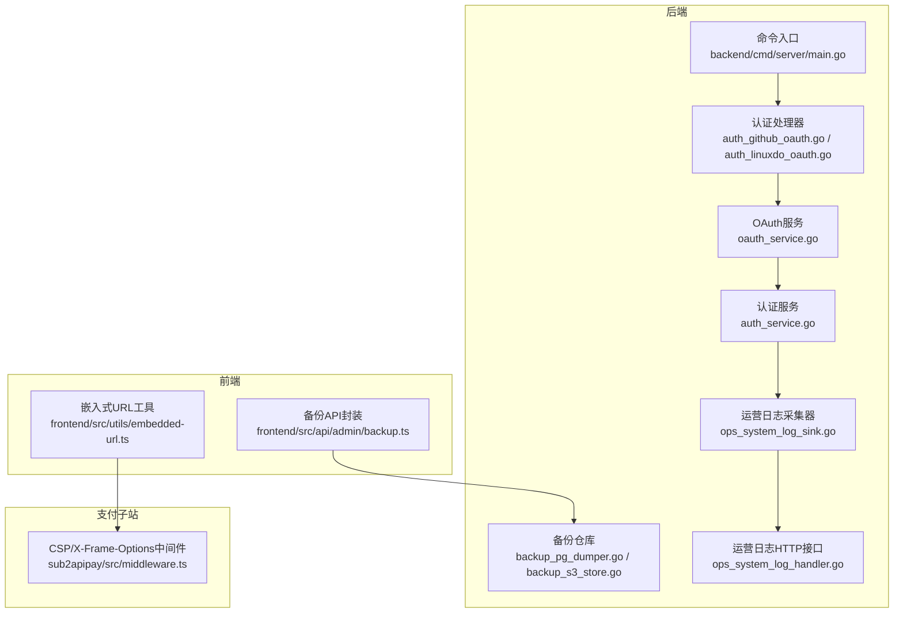
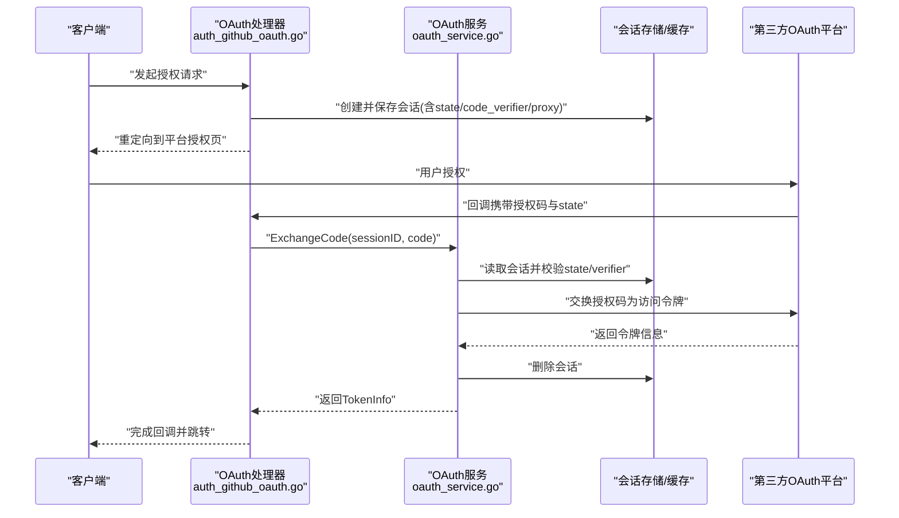
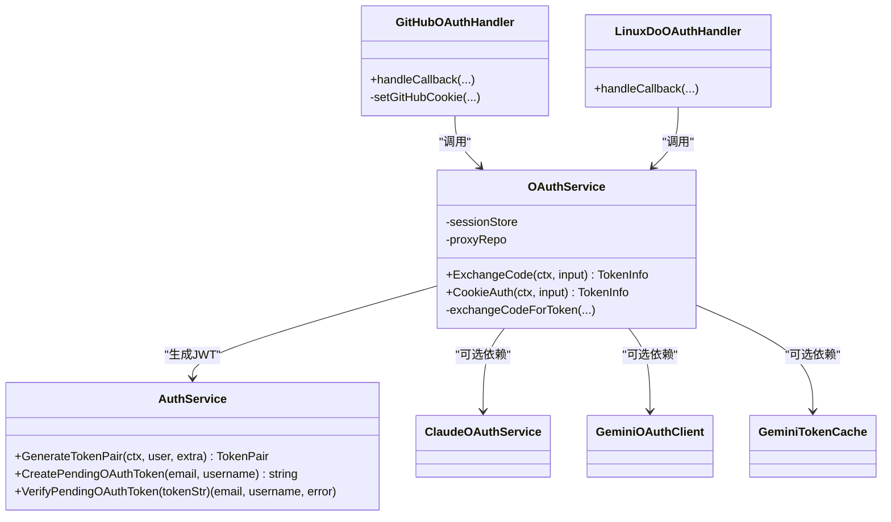
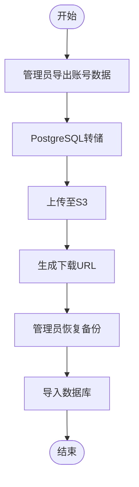
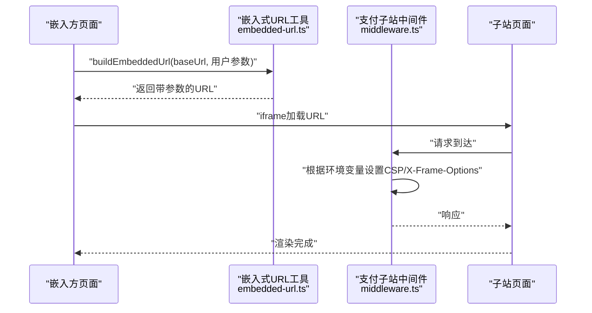
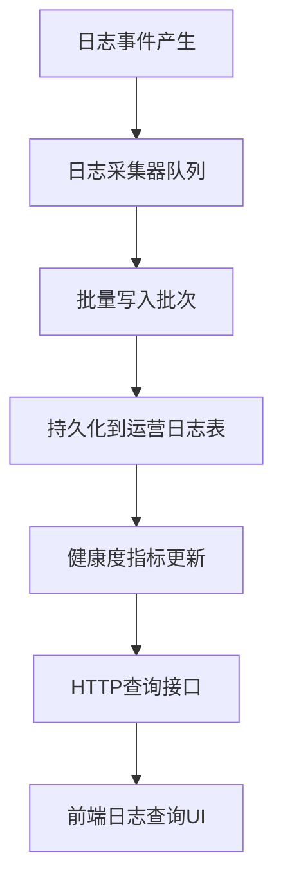
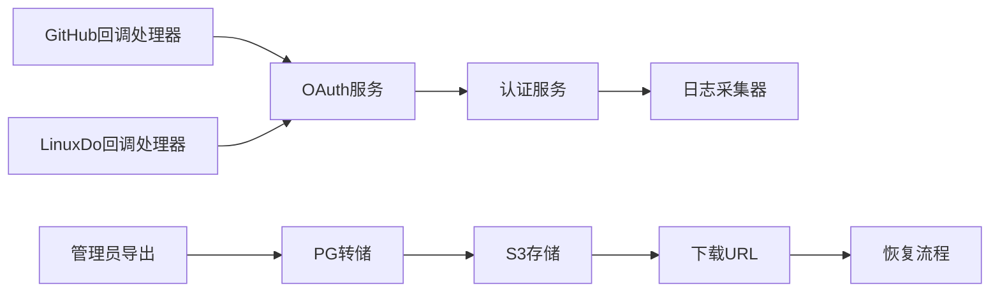

# 集成点

<cite>
**本文引用的文件**
- [backend/cmd/server/main.go](file://backend/cmd/server/main.go)
- [backend/internal/handler/auth_github_oauth.go](file://backend/internal/handler/auth_github_oauth.go)
- [backend/internal/handler/auth_linuxdo_oauth.go](file://backend/internal/handler/auth_linuxdo_oauth.go)
- [backend/internal/service/oauth_service.go](file://backend/internal/service/oauth_service.go)
- [backend/internal/service/auth_service.go](file://backend/internal/service/auth_service.go)
- [backend/internal/repository/claude_oauth_service.go](file://backend/internal/repository/claude_oauth_service.go)
- [backend/internal/repository/gemini_oauth_client.go](file://backend/internal/repository/gemini_oauth_client.go)
- [backend/internal/repository/gemini_token_cache.go](file://backend/internal/repository/gemini_token_cache.go)
- [backend/internal/handler/admin/account_data.go](file://backend/internal/handler/admin/account_data.go)
- [backend/internal/repository/backup_pg_dumper.go](file://backend/internal/repository/backup_pg_dumper.go)
- [backend/internal/repository/backup_s3_store.go](file://backend/internal/repository/backup_s3_store.go)
- [frontend/src/api/admin/backup.ts](file://frontend/src/api/admin/backup.ts)
- [frontend/src/utils/embedded-url.ts](file://frontend/src/utils/embedded-url.ts)
- [sub2apipay/src/middleware.ts](file://sub2apipay/src/middleware.ts)
- [backend/internal/service/ops_system_log_sink.go](file://backend/internal/service/ops_system_log_sink.go)
- [backend/internal/handler/admin/ops_system_log_handler.go](file://backend/internal/handler/admin/ops_system_log_handler.go)
- [frontend/src/api/admin/ops.ts](file://frontend/src/api/admin/ops.ts)
</cite>

## 目录
1. [简介](#简介)
2. [项目结构](#项目结构)
3. [核心组件](#核心组件)
4. [架构总览](#架构总览)
5. [详细组件分析](#详细组件分析)
6. [依赖关系分析](#依赖关系分析)
7. [性能考量](#性能考量)
8. [故障排查指南](#故障排查指南)
9. [结论](#结论)
10. [附录](#附录)

## 简介
本技术文档聚焦Sub2API的“集成点”，系统性梳理以下能力：
- Webhook与事件驱动通知：基于公告系统与错误事件的异步通知机制
- 第三方OAuth认证集成：支持GitHub、LinuxDo、Claude、Gemini等平台的授权接入、回调处理与令牌管理
- 数据导入/导出与备份恢复：管理员级账号数据导出、备份调度、S3存储与恢复流程
- iframe嵌入与跨域安全：嵌入式界面参数化构建、CSP/X-Frame-Options策略与安全策略
- 监控与日志：系统运行日志的采集、索引与清理，健康度指标与查询接口

## 项目结构
后端采用Go语言，前端为Vue+TypeScript，支付子站使用Next.js。核心集成点分布在：
- 后端命令入口与路由注册
- 认证与OAuth服务层
- 备份与数据导入导出仓库层
- 前端API封装与嵌入式URL工具
- 支付子站中间件与CSP策略

**图表来源**
- [backend/cmd/server/main.go](file://backend/cmd/server/main.go)
- [backend/internal/handler/auth_github_oauth.go](file://backend/internal/handler/auth_github_oauth.go)
- [backend/internal/service/oauth_service.go](file://backend/internal/service/oauth_service.go)
- [backend/internal/service/auth_service.go](file://backend/internal/service/auth_service.go)
- [backend/internal/repository/backup_pg_dumper.go](file://backend/internal/repository/backup_pg_dumper.go)
- [backend/internal/repository/backup_s3_store.go](file://backend/internal/repository/backup_s3_store.go)
- [backend/internal/service/ops_system_log_sink.go](file://backend/internal/service/ops_system_log_sink.go)
- [backend/internal/handler/admin/ops_system_log_handler.go](file://backend/internal/handler/admin/ops_system_log_handler.go)
- [frontend/src/api/admin/backup.ts](file://frontend/src/api/admin/backup.ts)
- [frontend/src/utils/embedded-url.ts](file://frontend/src/utils/embedded-url.ts)
- [sub2apipay/src/middleware.ts](file://sub2apipay/src/middleware.ts)

**章节来源**
- [backend/cmd/server/main.go](file://backend/cmd/server/main.go)

## 核心组件
- OAuth认证与令牌管理：统一的OAuthService负责授权码交换、会话存储、代理URL选择与令牌信息返回；支持Cookie自动认证与设置
- 公告与事件通知：公告表含状态、通知模式、目标用户组等字段，结合错误事件与系统日志实现事件驱动通知
- 数据导入/导出与备份：管理员导出账号数据结构体、PostgreSQL转储、S3对象存储与下载URL生成、备份恢复流程
- iframe嵌入与安全：前端嵌入式URL工具构建参数化链接，支付子站中间件根据配置动态设置CSP与X-Frame-Options
- 运营日志采集与查询：系统日志写入队列、批量化持久化、健康度指标与查询接口

**章节来源**
- [backend/internal/service/oauth_service.go](file://backend/internal/service/oauth_service.go)
- [backend/internal/handler/admin/account_data.go](file://backend/internal/handler/admin/account_data.go)
- [backend/internal/repository/backup_pg_dumper.go](file://backend/internal/repository/backup_pg_dumper.go)
- [backend/internal/repository/backup_s3_store.go](file://backend/internal/repository/backup_s3_store.go)
- [frontend/src/utils/embedded-url.ts](file://frontend/src/utils/embedded-url.ts)
- [sub2apipay/src/middleware.ts](file://sub2apipay/src/middleware.ts)
- [backend/internal/service/ops_system_log_sink.go](file://backend/internal/service/ops_system_log_sink.go)
- [backend/internal/handler/admin/ops_system_log_handler.go](file://backend/internal/handler/admin/ops_system_log_handler.go)

## 架构总览
下图展示OAuth认证与令牌管理在系统中的位置与调用链。

**图表来源**
- [backend/internal/handler/auth_github_oauth.go](file://backend/internal/handler/auth_github_oauth.go)
- [backend/internal/service/oauth_service.go](file://backend/internal/service/oauth_service.go)

## 详细组件分析

### OAuth认证集成
- 授权码交换与会话管理
  - 通过会话存储获取并校验state与code_verifier，决定是否为“setup token”场景
  - 可按需覆盖代理URL，支持多上游平台
  - 成功后删除会话，避免重放
- Cookie自动认证
  - 支持基于sessionKey的Cookie认证，可指定scope与代理
- 第三方平台适配
  - GitHub/LinuxDo处理器负责回调参数解析与Cookie设置
  - Claude/Gemini相关仓库提供OAuth客户端与令牌缓存
- 令牌生命周期与安全
  - setup token包含过期时间；普通token不包含
  - pending OAuth注册使用短期JWT承载身份信息，等待邀请码绑定

**图表来源**
- [backend/internal/service/oauth_service.go](file://backend/internal/service/oauth_service.go)
- [backend/internal/service/auth_service.go](file://backend/internal/service/auth_service.go)
- [backend/internal/handler/auth_github_oauth.go](file://backend/internal/handler/auth_github_oauth.go)
- [backend/internal/handler/auth_linuxdo_oauth.go](file://backend/internal/handler/auth_linuxdo_oauth.go)
- [backend/internal/repository/claude_oauth_service.go](file://backend/internal/repository/claude_oauth_service.go)
- [backend/internal/repository/gemini_oauth_client.go](file://backend/internal/repository/gemini_oauth_client.go)
- [backend/internal/repository/gemini_token_cache.go](file://backend/internal/repository/gemini_token_cache.go)

**章节来源**
- [backend/internal/service/oauth_service.go](file://backend/internal/service/oauth_service.go)
- [backend/internal/service/auth_service.go](file://backend/internal/service/auth_service.go)
- [backend/internal/handler/auth_github_oauth.go](file://backend/internal/handler/auth_github_oauth.go)
- [backend/internal/handler/auth_linuxdo_oauth.go](file://backend/internal/handler/auth_linuxdo_oauth.go)
- [backend/internal/repository/claude_oauth_service.go](file://backend/internal/repository/claude_oauth_service.go)
- [backend/internal/repository/gemini_oauth_client.go](file://backend/internal/repository/gemini_oauth_client.go)
- [backend/internal/repository/gemini_token_cache.go](file://backend/internal/repository/gemini_token_cache.go)

### 数据导入/导出与备份恢复
- 导出结构
  - 管理员导出账号数据包含名称、平台、类型、凭据、并发、优先级、过期时间等字段
  - 凭据以原始明文返回，便于管理员备份
- 备份流程
  - PostgreSQL数据库转储、上传至S3、生成下载URL
  - 支持定时调度、手动触发、列表查询、删除与恢复
- 前端API
  - 封装备份计划、创建、列表、详情、删除、下载URL、恢复等接口

**图表来源**
- [backend/internal/handler/admin/account_data.go](file://backend/internal/handler/admin/account_data.go)
- [backend/internal/repository/backup_pg_dumper.go](file://backend/internal/repository/backup_pg_dumper.go)
- [backend/internal/repository/backup_s3_store.go](file://backend/internal/repository/backup_s3_store.go)
- [frontend/src/api/admin/backup.ts](file://frontend/src/api/admin/backup.ts)

**章节来源**
- [backend/internal/handler/admin/account_data.go](file://backend/internal/handler/admin/account_data.go)
- [backend/internal/repository/backup_pg_dumper.go](file://backend/internal/repository/backup_pg_dumper.go)
- [backend/internal/repository/backup_s3_store.go](file://backend/internal/repository/backup_s3_store.go)
- [frontend/src/api/admin/backup.ts](file://frontend/src/api/admin/backup.ts)

### iframe嵌入与跨域安全
- 嵌入式URL构建
  - 前端工具支持注入user_id、token、主题、语言、源站信息等参数
  - 自动检测深色/浅色主题
- 支付子站安全策略
  - 中间件根据SUB2API_BASE_URL与IFRAME_ALLOW_ORIGINS环境变量动态设置CSP
  - 支持通配符*或白名单域名；与X-Frame-Options共存时优先CSP
  - 设置X-Content-Type-Options与Referrer-Policy增强安全

**图表来源**
- [frontend/src/utils/embedded-url.ts](file://frontend/src/utils/embedded-url.ts)
- [sub2apipay/src/middleware.ts](file://sub2apipay/src/middleware.ts)

**章节来源**
- [frontend/src/utils/embedded-url.ts](file://frontend/src/utils/embedded-url.ts)
- [sub2apipay/src/middleware.ts](file://sub2apipay/src/middleware.ts)

### 监控与日志系统集成
- 日志采集器
  - 异步队列批量写入运营日志，支持健康度指标（队列深度、丢弃数、写入失败数、平均写入延迟、最后错误）
  - 仅对特定级别与组件进行索引（如warn/error、http.access、audit.*）
- HTTP接口
  - 提供系统日志清理接口与健康度查询接口
- 前端查询
  - 提供系统日志查询、过滤、采样与保留策略配置

**图表来源**
- [backend/internal/service/ops_system_log_sink.go](file://backend/internal/service/ops_system_log_sink.go)
- [backend/internal/handler/admin/ops_system_log_handler.go](file://backend/internal/handler/admin/ops_system_log_handler.go)
- [frontend/src/api/admin/ops.ts](file://frontend/src/api/admin/ops.ts)

**章节来源**
- [backend/internal/service/ops_system_log_sink.go](file://backend/internal/service/ops_system_log_sink.go)
- [backend/internal/handler/admin/ops_system_log_handler.go](file://backend/internal/handler/admin/ops_system_log_handler.go)
- [frontend/src/api/admin/ops.ts](file://frontend/src/api/admin/ops.ts)

## 依赖关系分析
- 认证链路：处理器 -> OAuth服务 -> 平台；可选依赖Claude/Gemini客户端与令牌缓存
- 备份链路：管理员操作 -> 导出结构体 -> 转储 -> S3存储 -> 下载URL -> 恢复
- 日志链路：日志事件 -> 采集器队列 -> 批量写入 -> 运营日志表 -> 查询接口

**图表来源**
- [backend/internal/handler/auth_github_oauth.go](file://backend/internal/handler/auth_github_oauth.go)
- [backend/internal/handler/auth_linuxdo_oauth.go](file://backend/internal/handler/auth_linuxdo_oauth.go)
- [backend/internal/service/oauth_service.go](file://backend/internal/service/oauth_service.go)
- [backend/internal/service/auth_service.go](file://backend/internal/service/auth_service.go)
- [backend/internal/handler/admin/account_data.go](file://backend/internal/handler/admin/account_data.go)
- [backend/internal/repository/backup_pg_dumper.go](file://backend/internal/repository/backup_pg_dumper.go)
- [backend/internal/repository/backup_s3_store.go](file://backend/internal/repository/backup_s3_store.go)

**章节来源**
- [backend/internal/service/oauth_service.go](file://backend/internal/service/oauth_service.go)
- [backend/internal/handler/admin/account_data.go](file://backend/internal/handler/admin/account_data.go)
- [backend/internal/repository/backup_pg_dumper.go](file://backend/internal/repository/backup_pg_dumper.go)
- [backend/internal/repository/backup_s3_store.go](file://backend/internal/repository/backup_s3_store.go)

## 性能考量
- OAuth令牌交换
  - 使用会话存储与一次性code_verifier，降低重放风险；建议合理设置会话过期时间
  - setup token包含过期时间，减少长期有效令牌的暴露面
- 备份与导入
  - 转储与上传采用流式处理，建议分块大小与并发可控；S3上传启用断点续传
  - 导入前建议先验证备份完整性与兼容性
- 日志系统
  - 批量写入与队列容量需平衡吞吐与内存占用；健康度指标用于容量规划
  - 仅对必要日志建立索引，避免全量扫描

## 故障排查指南
- OAuth回调失败
  - 检查state与code_verifier匹配、会话是否存在且未过期
  - 核对平台回调地址与应用配置一致
- 令牌异常
  - 确认是否为setup token场景；检查平台返回的expires_in字段
  - 验证JWT签名密钥与过期时间
- 备份/恢复问题
  - 确认S3连接配置与权限；检查转储文件完整性
  - 恢复前确认数据库版本兼容性
- iframe嵌入被阻止
  - 检查CSP与X-Frame-Options设置；确保IFRAME_ALLOW_ORIGINS包含嵌入方域名
- 日志查询无结果
  - 确认日志级别与组件是否满足索引条件；检查查询时间范围与过滤条件

**章节来源**
- [backend/internal/service/oauth_service.go](file://backend/internal/service/oauth_service.go)
- [backend/internal/service/auth_service.go](file://backend/internal/service/auth_service.go)
- [backend/internal/repository/backup_s3_store.go](file://backend/internal/repository/backup_s3_store.go)
- [sub2apipay/src/middleware.ts](file://sub2apipay/src/middleware.ts)
- [backend/internal/service/ops_system_log_sink.go](file://backend/internal/service/ops_system_log_sink.go)

## 结论
本技术文档系统性梳理了Sub2API在OAuth认证、数据导入导出、iframe嵌入与监控日志方面的集成点。通过统一的OAuth服务、严格的令牌管理、完善的备份与恢复流程以及安全的嵌入策略，开发者可以快速对接第三方系统并实现稳定可靠的集成方案。

## 附录
- 最佳实践
  - OAuth：严格校验state与code_verifier；区分setup token与普通token；最小权限scope
  - 备份：定期测试恢复流程；对敏感凭据进行脱敏处理（管理员导出除外）；监控S3可用性
  - iframe：明确白名单域名；优先使用CSP替代X-Frame-Options；限制iframe来源
  - 日志：按需索引；控制采样率与保留周期；定期清理过期日志