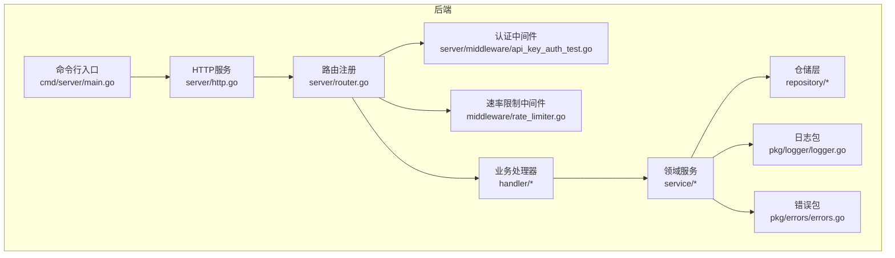
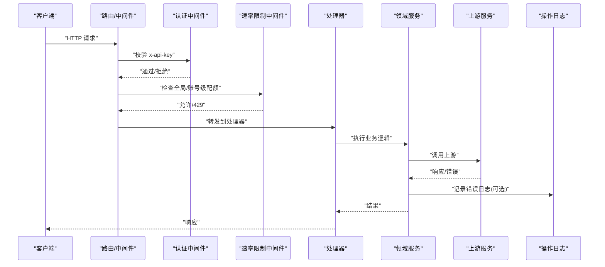
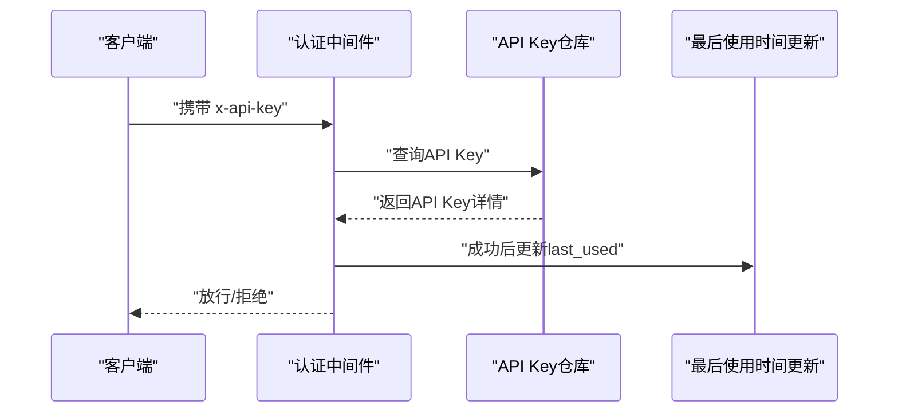
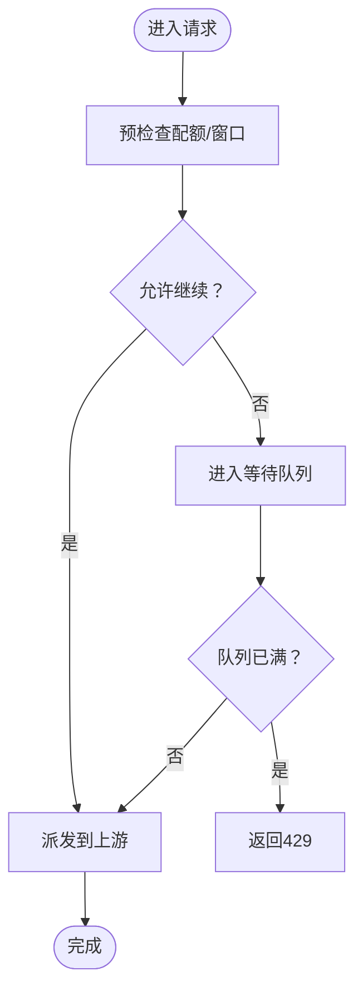
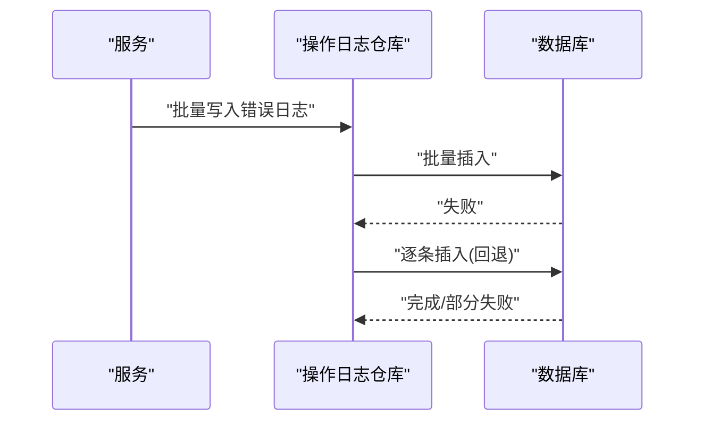
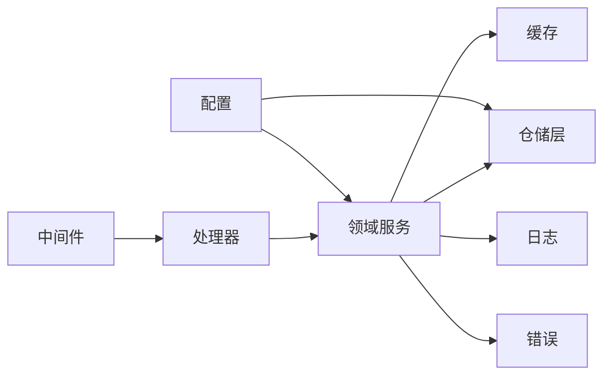

# 故障排除FAQ

<cite>
**本文引用的文件**
- [backend/internal/service/ops_service.go](file://backend/internal/service/ops_service.go)
- [backend/internal/server/middleware/api_key_auth_test.go](file://backend/internal/server/middleware/api_key_auth_test.go)
- [backend/internal/handler/api_key_handler.go](file://backend/internal/handler/api_key_handler.go)
- [backend/internal/config/config.go](file://backend/internal/config/config.go)
- [backend/internal/service/ratelimit_service.go](file://backend/internal/service/ratelimit_service.go)
- [backend/internal/service/gateway_waiting_queue_test.go](file://backend/internal/service/gateway_waiting_queue_test.go)
- [backend/internal/service/account.go](file://backend/internal/service/account.go)
- [backend/internal/pkg/logger/logger.go](file://backend/internal/pkg/logger/logger.go)
- [backend/internal/server/middleware/logger.go](file://backend/internal/server/middleware/logger.go)
- [backend/internal/pkg/errors/errors.go](file://backend/internal/pkg/errors/errors.go)
- [backend/internal/repository/ops_repo.go](file://backend/internal/repository/ops_repo.go)
- [backend/internal/handler/logging.go](file://backend/internal/handler/logging.go)
- [deploy/docker-compose.yml](file://deploy/docker-compose.yml)
- [deploy/install.sh](file://deploy/install.sh)
- [backend/cmd/server/main.go](file://backend/cmd/server/main.go)
- [backend/internal/server/http.go](file://backend/internal/server/http.go)
- [backend/internal/server/router.go](file://backend/internal/server/router.go)
- [backend/internal/middleware/rate_limiter.go](file://backend/internal/middleware/rate_limiter.go)
- [backend/internal/repository/db_pool.go](file://backend/internal/repository/db_pool.go)
- [backend/internal/repository/redis.go](file://backend/internal/repository/redis.go)
- [backend/internal/service/pricing_service.go](file://backend/internal/service/pricing_service.go)
- [backend/internal/service/usage_stats_service.go](file://backend/internal/service/usage_stats_service.go)
- [backend/internal/service/subscription_service.go](file://backend/internal/service/subscription_service.go)
- [backend/internal/service/user_service.go](file://backend/internal/service/user_service.go)
- [backend/internal/service/admin_service.go](file://backend/internal/service/admin_service.go)
- [backend/internal/service/proxy_service.go](file://backend/internal/service/proxy_service.go)
- [backend/internal/service/channel_service.go](file://backend/internal/service/channel_service.go)
- [backend/internal/service/announcement_service.go](file://backend/internal/service/announcement_service.go)
- [backend/internal/service/referral_service.go](file://backend/internal/service/referral_service.go)
- [backend/internal/service/redeem_service.go](file://backend/internal/service/redeem_service.go)
- [backend/internal/service/oauth_service.go](file://backend/internal/service/oauth_service.go)
- [backend/internal/service/totp_service.go](file://backend/internal/service/totp_service.go)
- [backend/internal/service/security_secret_service.go](file://backend/internal/service/security_secret_service.go)
- [backend/internal/service/error_passthrough_rule_service.go](file://backend/internal/service/error_passthrough_rule_service.go)
- [backend/internal/service/group_status_service.go](file://backend/internal/service/group_status_service.go)
- [backend/internal/service/idempotency_service.go](file://backend/internal/service/idempotency_service.go)
- [backend/internal/service/usage_cleanup_service.go](file://backend/internal/service/usage_cleanup_service.go)
- [backend/internal/service/promo_code_service.go](file://backend/internal/service/promo_code_service.go)
- [backend/internal/service/gateway_cache.go](file://backend/internal/service/gateway_cache.go)
- [backend/internal/service/concurrency_cache.go](file://backend/internal/service/concurrency_cache.go)
- [backend/internal/service/email_cache.go](file://backend/internal/service/email_cache.go)
- [backend/internal/service/identity_cache.go](file://backend/internal/service/identity_cache.go)
- [backend/internal/service/billing_cache.go](file://backend/internal/service/billing_cache.go)
- [backend/internal/service/scheduler_cache.go](file://backend/internal/service/scheduler_cache.go)
- [backend/internal/service/update_cache.go](file://backend/internal/service/update_cache.go)
- [backend/internal/service/referral_cache.go](file://backend/internal/service/referral_cache.go)
- [backend/internal/service/redeem_cache.go](file://backend/internal/service/redeem_cache.go)
- [backend/internal/service/gemini_token_cache.go](file://backend/internal/service/gemini_token_cache.go)
- [backend/internal/service/dashboard_cache.go](file://backend/internal/service/dashboard_cache.go)
- [backend/internal/service/turnstile_service.go](file://backend/internal/service/turnstile_service.go)
- [backend/internal/service/turnstile_service_test.go](file://backend/internal/service/turnstile_service_test.go)
- [backend/internal/service/openai_oauth_service.go](file://backend/internal/service/openai_oauth_service.go)
- [backend/internal/service/openai_oauth_service_test.go](file://backend/internal/service/openai_oauth_service_test.go)
- [backend/internal/service/claude_oauth_service.go](file://backend/internal/service/claude_oauth_service.go)
- [backend/internal/service/claude_oauth_service_test.go](file://backend/internal/service/claude_oauth_service_test.go)
- [backend/internal/service/gemini_oauth_client.go](file://backend/internal/service/gemini_oauth_client.go)
- [backend/internal/service/gemini_oauth_client_test.go](file://backend/internal/service/gemini_oauth_client_test.go)
- [backend/internal/service/gemini_drive_client.go](file://backend/internal/service/gemini_drive_client.go)
- [backend/internal/service/gemini_drive_client_test.go](file://backend/internal/service/gemini_drive_client_test.go)
- [backend/internal/service/geminicli_codeassist_client.go](file://backend/internal/service/geminicli_codeassist_client.go)
- [backend/internal/service/geminicli_codeassist_client_test.go](file://backend/internal/service/geminicli_codeassist_client_test.go)
- [backend/internal/service/claude_session.go](file://backend/internal/service/claude_session.go)
- [backend/internal/service/claude_session_test.go](file://backend/internal/service/claude_session_test.go)
- [backend/internal/service/openai_ws_v2/session.go](file://backend/internal/service/openai_ws_v2/session.go)
- [backend/internal/service/openai_ws_v2/session_test.go](file://backend/internal/service/openai_ws_v2/session_test.go)
- [backend/internal/service/openai_ws_v2/message.go](file://backend/internal/service/openai_ws_v2/message.go)
- [backend/internal/service/openai_ws_v2/message_test.go](file://backend/internal/service/openai_ws_v2/message_test.go)
- [backend/internal/service/openai_ws_v2/manager.go](file://backend/internal/service/openai_ws_v2/manager.go)
- [backend/internal/service/openai_ws_v2/manager_test.go](file://backend/internal/service/openai_ws_v2/manager_test.go)
- [backend/internal/service/openai_ws_v2/manager.go](file://backend/internal/service/openai_ws_v2/manager.go)
- [backend/internal/service/openai_ws_v2/manager_test.go](file://backend/internal/service/openai_ws_v2/manager_test.go)
- [backend/internal/service/openai_ws_v2/manager.go](file://backend/internal/service/openai_ws_v2/manager.go)
- [backend/internal/service/openai_ws_v2/manager_test.go](file://backend/internal/service/openai_ws_v2/manager_test.go)
- [backend/internal/service/openai_ws_v2/manager.go](file://backend/internal/service/openai_ws_v2/manager.go)
- [backend/internal/service/openai_ws_v2/manager_test.go](file://backend/internal/service/openai_ws_v2/manager_test.go)
- [backend/internal/service/openai_ws_v2/manager.go](file://backend/internal/service/openai_ws_v2/manager.go)
- [backend/internal/service/openai_ws_v2/manager_test.go](file://backend/internal/service/openai_ws_v2/manager_test.go)
- [backend/internal/service/openai_ws_v2/manager.go](file://backend/internal/service/openai_ws_v2/manager.go)
- [backend/internal/service/openai_ws_v2/manager_test.go](file://backend/internal/service/openai_ws_v2/manager_test.go)
- [backend/internal/service/openai_ws_v2/manager.go](file://backend/internal/service/openai_ws_v2/manager.go)
- [backend/internal/service/openai_ws_v2/manager_test.go](file://backend/internal/service/openai_ws_v2/manager_test.go)
- [backend/internal/service/openai_ws_v2/manager.go](file://backend/internal/service/openai_ws_v2/manager.go)
- [backend/internal/service/openai_ws_v2/manager_test.go](file://backend/internal/service/openai_ws_v2/manager_test.go)
- [backend/internal/service/openai_ws_v2/manager.go](file://backend/internal/service/openai_ws_v2/manager.go)
- [backend/internal/service/openai_ws_v2/manager_test.go](file://backend/internal/service/openai_ws_v2/manager_test.go)
- [backend/internal/service/openai_ws_v2/manager.go](file://backend/internal/service/openai_ws_v2/manager.go)
- [backend/internal/service/openai_ws_v2/manager_test.go](file://backend/internal/service/open......)
</cite>

## 目录
1. [简介](#简介)
2. [项目结构](#项目结构)
3. [核心组件](#核心组件)
4. [架构总览](#架构总览)
5. [详细组件分析](#详细组件分析)
6. [依赖关系分析](#依赖关系分析)
7. [性能考虑](#性能考虑)
8. [故障排除指南](#故障排除指南)
9. [结论](#结论)
10. [附录](#附录)

## 简介
本FAQ面向Sub2API的运维与开发人员，聚焦于安装部署、功能使用、性能诊断、错误排查与恢复流程。内容覆盖API调用失败、认证问题、计费异常、响应缓慢、内存泄漏、数据库连接问题等常见场景，并提供错误代码对照、日志分析与调试技巧、监控与告警最佳实践以及紧急恢复流程。

## 项目结构
后端采用Go语言实现，主要模块包括：
- 配置与启动：命令行入口、Wire依赖注入、HTTP服务与路由
- 领域服务：账户、订阅、用量统计、定价、代理、渠道、公告、推荐、兑换、TOTP、安全密钥、错误透传规则、分组状态、幂等性、清理任务、优惠券等
- 仓储层：数据库连接池、Redis缓存、操作日志仓库
- 中间件：速率限制、API Key认证、日志
- 错误与日志：统一错误封装、操作日志记录与查询
- 部署：Docker Compose与安装脚本

**图表来源**
- [backend/cmd/server/main.go:1-200](file://backend/cmd/server/main.go#L1-L200)
- [backend/internal/server/http.go:1-200](file://backend/internal/server/http.go#L1-L200)
- [backend/internal/server/router.go:1-200](file://backend/internal/server/router.go#L1-L200)
- [backend/internal/server/middleware/api_key_auth_test.go:332-511](file://backend/internal/server/middleware/api_key_auth_test.go#L332-L511)
- [backend/internal/middleware/rate_limiter.go:1-200](file://backend/internal/middleware/rate_limiter.go#L1-L200)
- [backend/internal/handler/api_key_handler.go:74-200](file://backend/internal/handler/api_key_handler.go#L74-L200)
- [backend/internal/service/ops_service.go:167-384](file://backend/internal/service/ops_service.go#L167-L384)
- [backend/internal/pkg/logger/logger.go:1-200](file://backend/internal/pkg/logger/logger.go#L1-L200)
- [backend/internal/pkg/errors/errors.go:1-200](file://backend/internal/pkg/errors/errors.go#L1-L200)

**章节来源**
- [backend/cmd/server/main.go:1-200](file://backend/cmd/server/main.go#L1-L200)
- [backend/internal/server/http.go:1-200](file://backend/internal/server/http.go#L1-L200)
- [backend/internal/server/router.go:1-200](file://backend/internal/server/router.go#L1-L200)

## 核心组件
- 认证与授权：基于API Key的认证中间件，支持IP白名单、最后使用时间更新、简单/标准模式差异
- 速率限制与并发控制：全局与账号级等待队列、预检查配额、RPM/TPM/窗口成本调度
- 计费与用量：按模型/通道/上游计费，用量日志聚合与清理
- 监控与错误日志：批量写入操作日志，支持过滤查询、重试尝试列表
- 配置与连接池：数据库连接池参数可配置，避免频繁创建/销毁连接
- 缓存与仓库：Redis、并发缓存、用量缓存、仪表盘缓存等

**章节来源**
- [backend/internal/server/middleware/api_key_auth_test.go:332-511](file://backend/internal/server/middleware/api_key_auth_test.go#L332-L511)
- [backend/internal/service/ratelimit_service.go:290-335](file://backend/internal/service/ratelimit_service.go#L290-L335)
- [backend/internal/service/gateway_waiting_queue_test.go:46-84](file://backend/internal/service/gateway_waiting_queue_test.go#L46-L84)
- [backend/internal/service/account.go:1666-1891](file://backend/internal/service/account.go#L1666-L1891)
- [backend/internal/service/ops_service.go:167-384](file://backend/internal/service/ops_service.go#L167-L384)
- [backend/internal/config/config.go:673-695](file://backend/internal/config/config.go#L673-L695)

## 架构总览
下图展示请求从客户端到上游服务的关键路径与关键决策点（认证、速率限制、并发等待、计费与用量、错误日志）。

**图表来源**
- [backend/internal/server/middleware/api_key_auth_test.go:332-511](file://backend/internal/server/middleware/api_key_auth_test.go#L332-L511)
- [backend/internal/middleware/rate_limiter.go:1-200](file://backend/internal/middleware/rate_limiter.go#L1-L200)
- [backend/internal/handler/api_key_handler.go:74-200](file://backend/internal/handler/api_key_handler.go#L74-L200)
- [backend/internal/service/ops_service.go:167-384](file://backend/internal/service/ops_service.go#L167-L384)

## 详细组件分析

### 认证与API Key管理
- 关键点
  - 支持多可信代理头（X-Forwarded-For、X-Real-IP、CF-Connecting-IP）解析真实客户端IP
  - 成功访问会触达API Key最后使用时间更新
  - 简单模式与标准模式对认证行为有差异
- 常见问题
  - 403 ACCESS_DENIED：IP不在白名单或API Key无效
  - 401 未认证：缺少或错误的x-api-key
  - API Key被禁用/过期：检查状态与有效期
- 排查步骤
  - 确认请求头中包含正确的x-api-key
  - 检查IP白名单与代理头是否正确传递
  - 查看API Key状态与最后使用时间

**图表来源**
- [backend/internal/server/middleware/api_key_auth_test.go:332-511](file://backend/internal/server/middleware/api_key_auth_test.go#L332-L511)

**章节来源**
- [backend/internal/server/middleware/api_key_auth_test.go:332-511](file://backend/internal/server/middleware/api_key_auth_test.go#L332-L511)
- [backend/internal/handler/api_key_handler.go:74-200](file://backend/internal/handler/api_key_handler.go#L74-L200)

### 速率限制与并发等待
- 关键点
  - 全局与账号级等待队列，满载时返回false（调用方可据此返回429）
  - 预检查配额（如Gemini每日配额）决定是否跳过账号
  - 窗口成本调度：sticky reserve用于“仅粘性可用”
- 常见问题
  - 429 Too Many Requests：等待队列满或配额不足
  - 响应缓慢：上游不稳定或排队时间长
- 排查步骤
  - 检查全局/账号级并发阈值与等待队列容量
  - 观察窗口成本与sticky reserve配置
  - 结合上游错误事件与重试尝试列表定位瓶颈

**图表来源**
- [backend/internal/service/gateway_waiting_queue_test.go:46-84](file://backend/internal/service/gateway_waiting_queue_test.go#L46-L84)
- [backend/internal/service/ratelimit_service.go:290-335](file://backend/internal/service/ratelimit_service.go#L290-L335)
- [backend/internal/service/account.go:1666-1891](file://backend/internal/service/account.go#L1666-L1891)

**章节来源**
- [backend/internal/service/gateway_waiting_queue_test.go:46-84](file://backend/internal/service/gateway_waiting_queue_test.go#L46-L84)
- [backend/internal/service/ratelimit_service.go:290-335](file://backend/internal/service/ratelimit_service.go#L290-L335)
- [backend/internal/service/account.go:1666-1891](file://backend/internal/service/account.go#L1666-L1891)

### 计费与用量统计
- 关键点
  - 按模型/通道/上游计费，支持固定/窗口成本调度
  - 用量日志聚合与清理任务定期执行
- 常见问题
  - 计费异常：模型映射、通道定价、上游模型字段不匹配
  - 用量不更新：清理任务未运行或索引缺失
- 排查步骤
  - 对照模型映射与通道定价表
  - 检查用量日志聚合索引与分区
  - 审核清理任务状态与窗口成本阈值

**章节来源**
- [backend/internal/service/account.go:1666-1891](file://backend/internal/service/account.go#L1666-L1891)
- [backend/internal/service/pricing_service.go:1-200](file://backend/internal/service/pricing_service.go#L1-L200)
- [backend/internal/service/usage_stats_service.go:1-200](file://backend/internal/service/usage_stats_service.go#L1-L200)
- [backend/internal/service/usage_cleanup_service.go:1-200](file://backend/internal/service/usage_cleanup_service.go#L1-L200)

### 监控与错误日志
- 关键点
  - 批量写入操作日志，失败时回退为逐条插入
  - 支持过滤查询、按ID详情、重试尝试列表
  - 上游错误序列化与截断标记
- 常见问题
  - 错误日志缺失：监控开关关闭或仓库不可用
  - 查询慢：缺少必要索引或过滤条件不当
- 排查步骤
  - 确认监控开关开启
  - 使用过滤器缩小范围（时间、类型、阶段）
  - 查看重试尝试列表定位失败根因

**图表来源**
- [backend/internal/service/ops_service.go:167-384](file://backend/internal/service/ops_service.go#L167-L384)
- [backend/internal/repository/ops_repo.go:1-200](file://backend/internal/repository/ops_repo.go#L1-L200)

**章节来源**
- [backend/internal/service/ops_service.go:167-384](file://backend/internal/service/ops_service.go#L167-L384)
- [backend/internal/repository/ops_repo.go:1-200](file://backend/internal/repository/ops_repo.go#L1-L200)

### 配置与连接池
- 关键点
  - 数据库连接池参数可配置：最大打开连接数、最大空闲连接数、连接最大存活时间、空闲连接最大存活时间
- 常见问题
  - 连接池耗尽：MaxOpenConns过小
  - 连接泄漏：ConnMaxLifetime/ConnMaxIdleTime未设置或过长
- 排查步骤
  - 检查连接池参数与实际连接数
  - 监控连接建立/销毁频率
  - 调整生命周期参数以平衡延迟与资源

**章节来源**
- [backend/internal/config/config.go:673-695](file://backend/internal/config/config.go#L673-L695)
- [backend/internal/repository/db_pool.go:1-200](file://backend/internal/repository/db_pool.go#L1-L200)

## 依赖关系分析
- 组件耦合
  - 处理器依赖领域服务；领域服务依赖仓储层与缓存
  - 中间件横切关注点（认证、速率限制、日志）
  - 错误与日志作为通用基础设施被广泛使用
- 外部依赖
  - 数据库（PostgreSQL）、Redis、上游AI服务
- 潜在风险
  - 仓库不可用导致监控与错误日志写入失败
  - 缓存失效或过期导致重复计算与抖动

**图表来源**
- [backend/internal/handler/api_key_handler.go:74-200](file://backend/internal/handler/api_key_handler.go#L74-L200)
- [backend/internal/service/ops_service.go:167-384](file://backend/internal/service/ops_service.go#L167-L384)
- [backend/internal/config/config.go:673-695](file://backend/internal/config/config.go#L673-L695)

**章节来源**
- [backend/internal/handler/api_key_handler.go:74-200](file://backend/internal/handler/api_key_handler.go#L74-L200)
- [backend/internal/service/ops_service.go:167-384](file://backend/internal/service/ops_service.go#L167-L384)
- [backend/internal/config/config.go:673-695](file://backend/internal/config/config.go#L673-L695)

## 性能考虑
- 响应缓慢
  - 检查上游服务延迟与错误率
  - 评估等待队列长度与并发阈值
  - 分析数据库慢查询与索引缺失
- 内存泄漏
  - 监控GC指标与堆内存曲线
  - 定位未释放的连接、缓存键与大对象
- 数据库连接问题
  - 调整MaxOpenConns与ConnMaxLifetime
  - 使用连接池健康检查与重连策略
- 缓存命中率
  - 提升热点数据缓存命中，降低数据库压力
  - 合理设置TTL与失效策略

[本节为通用指导，无需特定文件来源]

## 故障排除指南

### 安装与部署
- 常见问题
  - 容器无法启动：环境变量未配置、端口冲突、卷挂载权限
  - 服务不可达：防火墙、反向代理未转发、证书问题
  - 初始化失败：数据库迁移未执行、Redis不可用
- 解决方案
  - 使用提供的Docker Compose与安装脚本，确保所有依赖服务正常
  - 检查端口占用与网络连通性
  - 执行数据库迁移脚本，确认迁移状态
- 预防措施
  - 在生产环境使用独立的数据库与Redis实例
  - 配置健康检查与自动重启策略

**章节来源**
- [deploy/docker-compose.yml:1-200](file://deploy/docker-compose.yml#L1-L200)
- [deploy/install.sh:1-200](file://deploy/install.sh#L1-L200)

### API调用失败
- 现象
  - 401 未认证：缺少x-api-key或签名错误
  - 403 ACCESS_DENIED：IP不在白名单或API Key被拒绝
  - 429 Too Many Requests：等待队列满或配额不足
  - 5xx 服务器错误：上游服务异常或内部错误
- 排查步骤
  - 确认请求头包含正确的x-api-key
  - 检查IP白名单与代理头
  - 查看速率限制与等待队列状态
  - 审核上游错误事件与重试尝试

**章节来源**
- [backend/internal/server/middleware/api_key_auth_test.go:332-511](file://backend/internal/server/middleware/api_key_auth_test.go#L332-L511)
- [backend/internal/middleware/rate_limiter.go:1-200](file://backend/internal/middleware/rate_limiter.go#L1-L200)
- [backend/internal/service/ops_service.go:167-384](file://backend/internal/service/ops_service.go#L167-L384)

### 认证问题
- 现象
  - 401：未提供或无效的API Key
  - 403：IP不在白名单或被拒绝
  - 成功后未更新最后使用时间
- 排查步骤
  - 核对API Key状态与有效期
  - 检查代理头与可信代理配置
  - 确认成功访问路径已触达最后使用时间更新

**章节来源**
- [backend/internal/server/middleware/api_key_auth_test.go:332-511](file://backend/internal/server/middleware/api_key_auth_test.go#L332-L511)

### 计费异常
- 现象
  - 用量不更新、计费金额不符
  - 窗口成本调度导致请求被推迟
- 排查步骤
  - 对照模型映射与通道定价
  - 检查用量日志聚合索引与分区
  - 审核窗口成本阈值与sticky reserve

**章节来源**
- [backend/internal/service/account.go:1666-1891](file://backend/internal/service/account.go#L1666-L1891)
- [backend/internal/service/pricing_service.go:1-200](file://backend/internal/service/pricing_service.go#L1-L200)
- [backend/internal/service/usage_stats_service.go:1-200](file://backend/internal/service/usage_stats_service.go#L1-L200)

### 响应缓慢
- 现象
  - 端到端延迟高
  - 等待队列积压
- 排查步骤
  - 分析上游服务延迟与错误率
  - 评估全局/账号级并发阈值
  - 检查数据库慢查询与索引

**章节来源**
- [backend/internal/service/ratelimit_service.go:290-335](file://backend/internal/service/ratelimit_service.go#L290-L335)
- [backend/internal/service/gateway_waiting_queue_test.go:46-84](file://backend/internal/service/gateway_waiting_queue_test.go#L46-L84)

### 内存泄漏
- 现象
  - 堆内存持续增长
  - GC频率异常
- 排查步骤
  - 使用pprof采集堆与CPU分析
  - 检查未释放的连接、缓存键与大对象
  - 优化对象复用与及时释放

[本节为通用指导，无需特定文件来源]

### 数据库连接问题
- 现象
  - 连接池耗尽、连接超时
  - 连接泄漏导致资源枯竭
- 排查步骤
  - 检查MaxOpenConns、ConnMaxLifetime、ConnMaxIdleTime
  - 监控连接建立/销毁频率
  - 优化事务与查询，减少长连接占用

**章节来源**
- [backend/internal/config/config.go:673-695](file://backend/internal/config/config.go#L673-L695)
- [backend/internal/repository/db_pool.go:1-200](file://backend/internal/repository/db_pool.go#L1-L200)

### Redis与缓存问题
- 现象
  - 缓存击穿/穿透/雪崩
  - 缓存延迟高或不可用
- 排查步骤
  - 检查Redis连接与健康状态
  - 评估TTL与失效策略
  - 引入互斥锁与预热机制

**章节来源**
- [backend/internal/repository/redis.go:1-200](file://backend/internal/repository/redis.go#L1-L200)
- [backend/internal/service/concurrency_cache.go:1-200](file://backend/internal/service/concurrency_cache.go#L1-L200)
- [backend/internal/service/dashboard_cache.go:1-200](file://backend/internal/service/dashboard_cache.go#L1-L200)

### 错误代码对照与解释
- 常见错误码
  - OPS_ERROR_NOT_FOUND：操作日志不存在
  - OPS_ERROR_LOAD_FAILED：加载操作日志失败
  - OPS_RETRY_LIST_FAILED：列出重试尝试失败
  - OPS_REPO_UNAVAILABLE：操作仓库不可用
  - OPS_ERROR_INVALID_ID：错误ID无效
- 说明
  - 以上错误码来自操作日志服务的错误封装，用于快速定位监控与日志相关问题

**章节来源**
- [backend/internal/service/ops_service.go:333-384](file://backend/internal/service/ops_service.go#L333-L384)
- [backend/internal/pkg/errors/errors.go:1-200](file://backend/internal/pkg/errors/errors.go#L1-L200)

### 日志分析与调试技巧
- 日志位置
  - 服务端日志：统一输出与结构化日志
  - 操作日志：错误日志、上游错误、重试尝试
- 调试要点
  - 使用过滤器按时间、类型、阶段筛选
  - 结合重试尝试列表定位失败根因
  - 审核请求体与上游请求体的截断标记

**章节来源**
- [backend/internal/pkg/logger/logger.go:1-200](file://backend/internal/pkg/logger/logger.go#L1-L200)
- [backend/internal/server/middleware/logger.go:1-200](file://backend/internal/server/middleware/logger.go#L1-L200)
- [backend/internal/handler/logging.go:1-200](file://backend/internal/handler/logging.go#L1-L200)
- [backend/internal/service/ops_service.go:167-384](file://backend/internal/service/ops_service.go#L167-L384)

### 监控与告警最佳实践
- 指标建议
  - QPS、P95/P99延迟、错误率、上游错误事件、重试次数
  - 等待队列长度、并发阈值、窗口成本
  - 数据库连接数、慢查询、缓存命中率
- 告警策略
  - 延迟突增、错误率上升、等待队列饱和、连接池耗尽
- 工具建议
  - Prometheus/Grafana、APM工具、日志聚合平台

[本节为通用指导，无需特定文件来源]

### 紧急恢复流程
- 步骤
  - 快速隔离：降级非关键功能、临时放宽限流
  - 修复：定位根因（上游、数据库、缓存、配置）
  - 验证：灰度验证、监控回归
  - 回滚：必要时回滚到稳定版本
- 文档化
  - 记录事件、根因、处置与改进措施

[本节为通用指导，无需特定文件来源]

## 结论
通过本FAQ，您可以在安装部署、认证与API调用、计费与用量、性能与资源、监控与日志等方面快速定位与解决问题。建议结合监控与日志体系，建立完善的告警与恢复流程，确保系统稳定运行。

## 附录
- 参考文件清单
  - 认证与API Key：[backend/internal/server/middleware/api_key_auth_test.go:332-511](file://backend/internal/server/middleware/api_key_auth_test.go#L332-L511)
  - 速率限制与并发：[backend/internal/service/ratelimit_service.go:290-335](file://backend/internal/service/ratelimit_service.go#L290-L335)、[backend/internal/service/gateway_waiting_queue_test.go:46-84](file://backend/internal/service/gateway_waiting_queue_test.go#L46-L84)
  - 计费与用量：[backend/internal/service/account.go:1666-1891](file://backend/internal/service/account.go#L1666-L1891)
  - 监控与错误日志：[backend/internal/service/ops_service.go:167-384](file://backend/internal/service/ops_service.go#L167-L384)
  - 配置与连接池：[backend/internal/config/config.go:673-695](file://backend/internal/config/config.go#L673-L695)
  - 日志与错误封装：[backend/internal/pkg/logger/logger.go:1-200](file://backend/internal/pkg/logger/logger.go#L1-L200)、[backend/internal/pkg/errors/errors.go:1-200](file://backend/internal/pkg/errors/errors.go#L1-L200)