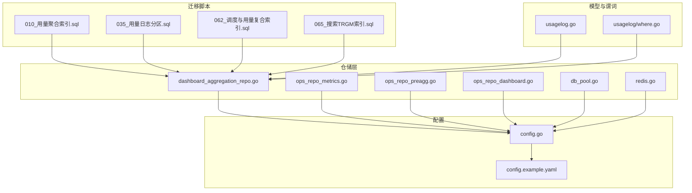
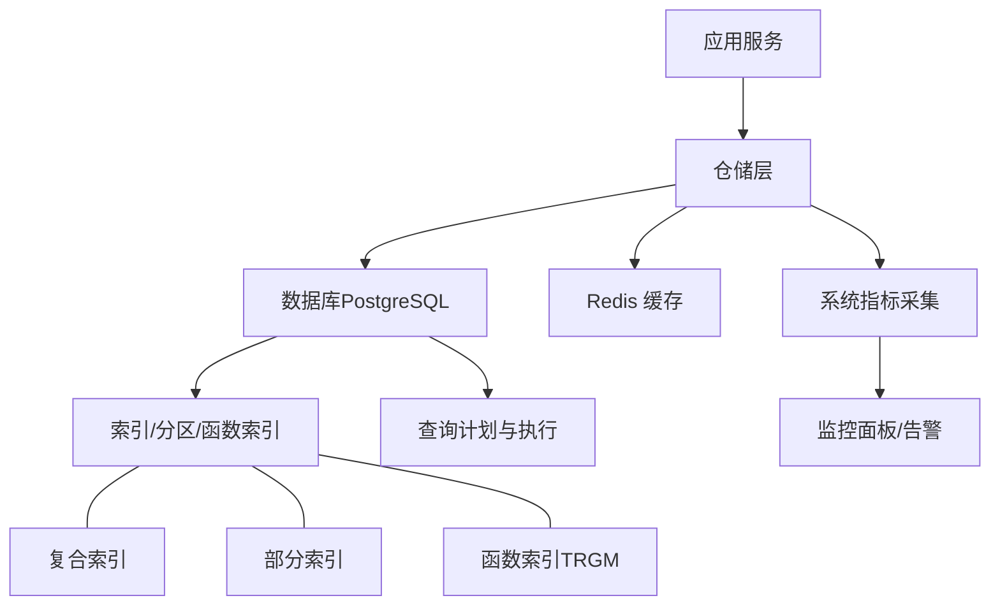
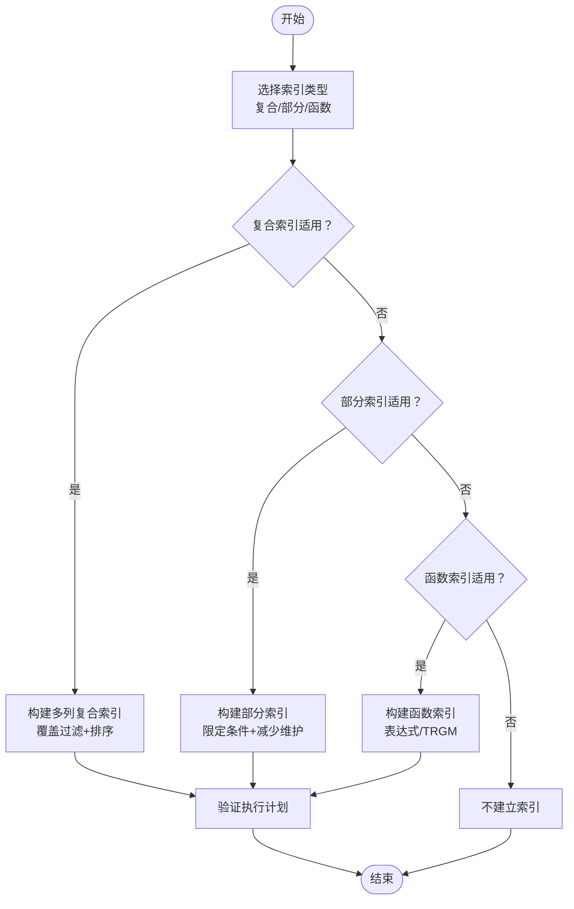
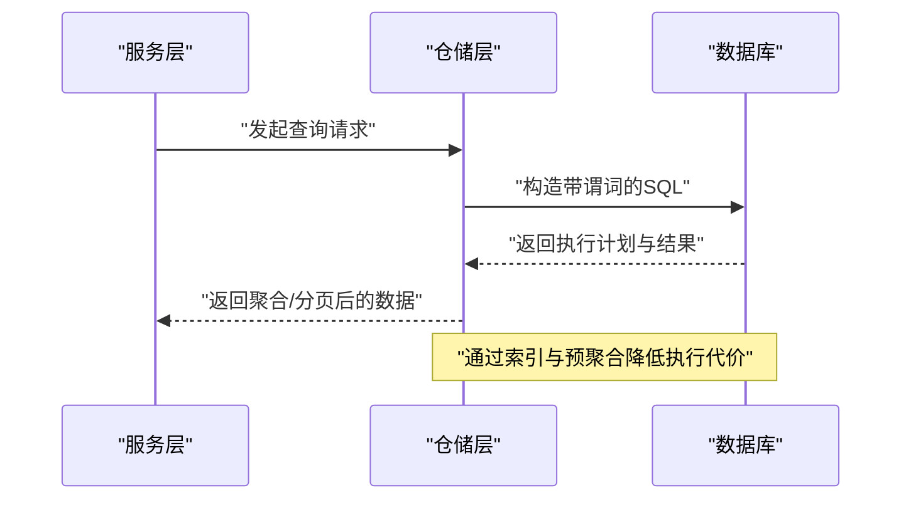
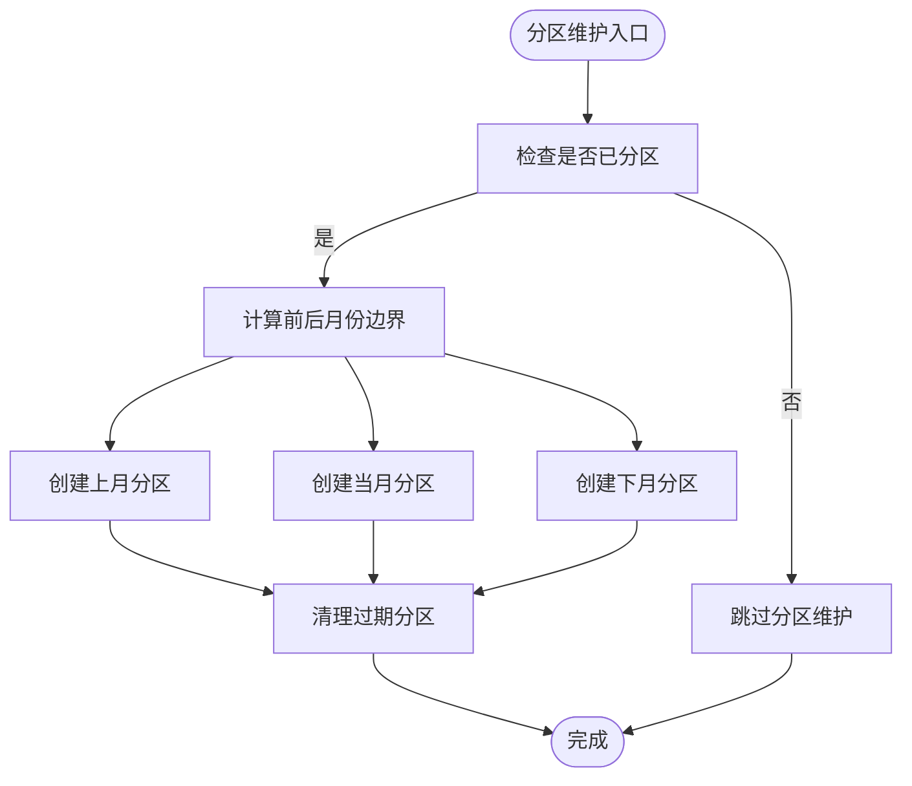
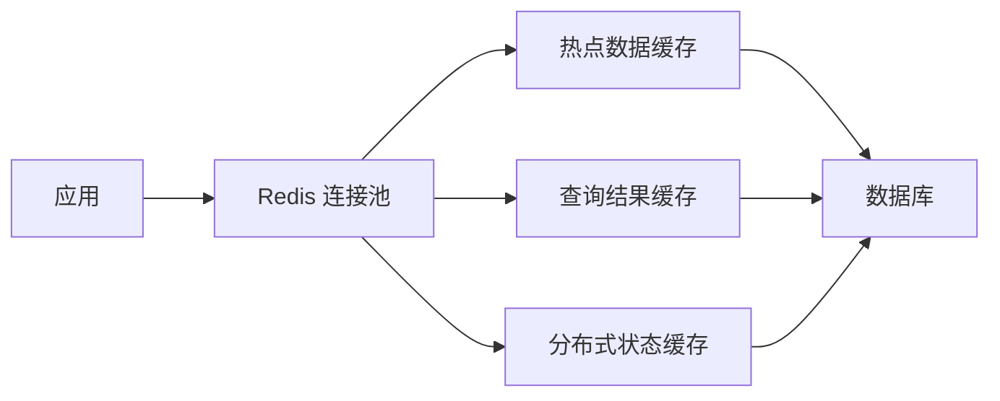
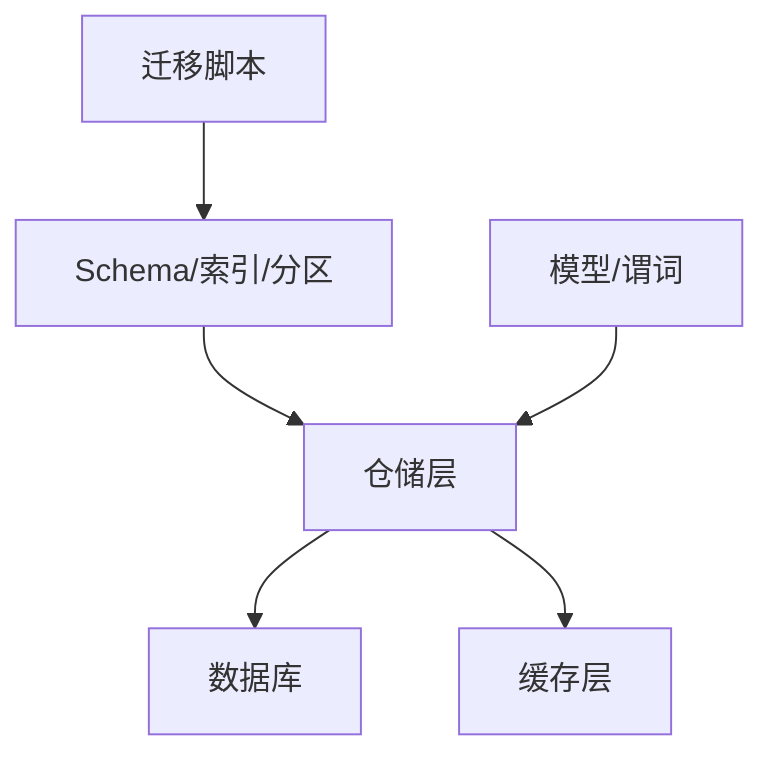

# 性能优化策略

<cite>
**本文引用的文件**
- [backend/migrations/010_add_usage_logs_aggregated_indexes.sql](file://backend/migrations/010_add_usage_logs_aggregated_indexes.sql)
- [backend/migrations/035_usage_logs_partitioning.sql](file://backend/migrations/035_usage_logs_partitioning.sql)
- [backend/migrations/062_add_scheduler_and_usage_composite_indexes_notx.sql](file://backend/migrations/062_add_scheduler_and_usage_composite_indexes_notx.sql)
- [backend/migrations/065_add_search_trgm_indexes.sql](file://backend/migrations/065_add_search_trgm_indexes.sql)
- [backend/internal/repository/dashboard_aggregation_repo.go](file://backend/internal/repository/dashboard_aggregation_repo.go)
- [backend/internal/repository/db_pool.go](file://backend/internal/repository/db_pool.go)
- [backend/internal/repository/redis.go](file://backend/internal/repository/redis.go)
- [backend/internal/repository/ops_repo_metrics.go](file://backend/internal/repository/ops_repo_metrics.go)
- [backend/internal/repository/ops_repo_preagg.go](file://backend/internal/repository/ops_repo_preagg.go)
- [backend/internal/repository/ops_repo_dashboard.go](file://backend/internal/repository/ops_repo_dashboard.go)
- [backend/internal/config/config.go](file://backend/internal/config/config.go)
- [backend/ent/usagelog/usagelog.go](file://backend/ent/usagelog/usagelog.go)
- [backend/ent/usagelog/where.go](file://backend/ent/usagelog/where.go)
- [deploy/config.example.yaml](file://deploy/config.example.yaml)
</cite>

## 目录
1. [简介](#简介)
2. [项目结构](#项目结构)
3. [核心组件](#核心组件)
4. [架构总览](#架构总览)
5. [详细组件分析](#详细组件分析)
6. [依赖关系分析](#依赖关系分析)
7. [性能考量](#性能考量)
8. [故障排查指南](#故障排查指南)
9. [结论](#结论)
10. [附录](#附录)

## 简介
本文件面向Sub2API的数据库性能优化，系统性梳理索引设计原则与最佳实践，覆盖复合索引、部分索引、函数索引；解释查询优化技术（执行计划分析、慢查询识别与优化）；详述用量日志表的分区策略与维护；给出缓存策略（热点数据、查询结果、分布式缓存）；提供连接池配置与数据库参数调优建议；并包含性能监控指标与基准测试方法。文中所有技术点均基于仓库中的迁移脚本、仓储层实现与配置示例进行归纳总结。

## 项目结构
围绕数据库性能优化的关键目录与文件：
- 迁移脚本：涵盖索引、分区、TRGM等优化相关的DDL变更
- 仓储层：封装查询、聚合、分区维护与系统指标采集
- 配置：数据库与Redis连接池参数配置
- 模型与谓词：用于查询条件构建与排序字段定义

**图表来源**
- [backend/migrations/010_add_usage_logs_aggregated_indexes.sql](file://backend/migrations/010_add_usage_logs_aggregated_indexes.sql)
- [backend/migrations/035_usage_logs_partitioning.sql](file://backend/migrations/035_usage_logs_partitioning.sql)
- [backend/migrations/062_add_scheduler_and_usage_composite_indexes_notx.sql](file://backend/migrations/062_add_scheduler_and_usage_composite_indexes_notx.sql)
- [backend/migrations/065_add_search_trgm_indexes.sql](file://backend/migrations/065_add_search_trgm_indexes.sql)
- [backend/internal/repository/dashboard_aggregation_repo.go](file://backend/internal/repository/dashboard_aggregation_repo.go)
- [backend/internal/repository/ops_repo_metrics.go](file://backend/internal/repository/ops_repo_metrics.go)
- [backend/internal/repository/ops_repo_preagg.go](file://backend/internal/repository/ops_repo_preagg.go)
- [backend/internal/repository/ops_repo_dashboard.go](file://backend/internal/repository/ops_repo_dashboard.go)
- [backend/internal/repository/db_pool.go](file://backend/internal/repository/db_pool.go)
- [backend/internal/repository/redis.go](file://backend/internal/repository/redis.go)
- [backend/internal/config/config.go](file://backend/internal/config/config.go)
- [deploy/config.example.yaml](file://deploy/config.example.yaml)
- [backend/ent/usagelog/usagelog.go](file://backend/ent/usagelog/usagelog.go)
- [backend/ent/usagelog/where.go](file://backend/ent/usagelog/where.go)

**章节来源**
- [backend/migrations/010_add_usage_logs_aggregated_indexes.sql](file://backend/migrations/010_add_usage_logs_aggregated_indexes.sql)
- [backend/migrations/035_usage_logs_partitioning.sql](file://backend/migrations/035_usage_logs_partitioning.sql)
- [backend/migrations/062_add_scheduler_and_usage_composite_indexes_notx.sql](file://backend/migrations/062_add_scheduler_and_usage_composite_indexes_notx.sql)
- [backend/migrations/065_add_search_trgm_indexes.sql](file://backend/migrations/065_add_search_trgm_indexes.sql)
- [backend/internal/repository/dashboard_aggregation_repo.go](file://backend/internal/repository/dashboard_aggregation_repo.go)
- [backend/internal/repository/ops_repo_metrics.go](file://backend/internal/repository/ops_repo_metrics.go)
- [backend/internal/repository/ops_repo_preagg.go](file://backend/internal/repository/ops_repo_preagg.go)
- [backend/internal/repository/ops_repo_dashboard.go](file://backend/internal/repository/ops_repo_dashboard.go)
- [backend/internal/repository/db_pool.go](file://backend/internal/repository/db_pool.go)
- [backend/internal/repository/redis.go](file://backend/internal/repository/redis.go)
- [backend/internal/config/config.go](file://backend/internal/config/config.go)
- [deploy/config.example.yaml](file://deploy/config.example.yaml)
- [backend/ent/usagelog/usagelog.go](file://backend/ent/usagelog/usagelog.go)
- [backend/ent/usagelog/where.go](file://backend/ent/usagelog/where.go)

## 核心组件
- 用量日志聚合与分区：通过迁移脚本建立聚合索引与按月分区，结合仓储层的分区检测与清理逻辑，支撑高吞吐写入与高效范围查询。
- 复合索引与部分索引：针对调度任务与用量查询场景，建立多列组合索引以覆盖常见过滤与排序路径，并通过部分索引降低存储与维护成本。
- 函数索引：在搜索类场景引入TRGM索引，提升模糊匹配与前缀匹配的效率。
- 查询优化：利用模型与谓词生成高效WHERE条件，配合预聚合与直方图分位数统计，降低复杂查询成本。
- 缓存策略：结合Redis连接池配置与仓储层缓存实现，对热点数据与查询结果进行缓存，降低数据库压力。
- 监控与度量：系统指标采集包含数据库与Redis连接状态、队列深度、CPU与内存等，为性能调优提供依据。

**章节来源**
- [backend/migrations/010_add_usage_logs_aggregated_indexes.sql](file://backend/migrations/010_add_usage_logs_aggregated_indexes.sql)
- [backend/migrations/035_usage_logs_partitioning.sql](file://backend/migrations/035_usage_logs_partitioning.sql)
- [backend/migrations/062_add_scheduler_and_usage_composite_indexes_notx.sql](file://backend/migrations/062_add_scheduler_and_usage_composite_indexes_notx.sql)
- [backend/migrations/065_add_search_trgm_indexes.sql](file://backend/migrations/065_add_search_trgm_indexes.sql)
- [backend/internal/repository/dashboard_aggregation_repo.go](file://backend/internal/repository/dashboard_aggregation_repo.go)
- [backend/internal/repository/ops_repo_metrics.go](file://backend/internal/repository/ops_repo_metrics.go)
- [backend/internal/repository/ops_repo_preagg.go](file://backend/internal/repository/ops_repo_preagg.go)
- [backend/internal/repository/ops_repo_dashboard.go](file://backend/internal/repository/ops_repo_dashboard.go)
- [backend/internal/repository/redis.go](file://backend/internal/repository/redis.go)
- [backend/internal/config/config.go](file://backend/internal/config/config.go)

## 架构总览
数据库性能优化贯穿“DDL优化（索引/分区/函数索引）—查询优化（谓词/排序/聚合）—缓存（热点/结果/分布式）—连接池与参数调优—监控与度量”的闭环。

**图表来源**
- [backend/internal/repository/dashboard_aggregation_repo.go](file://backend/internal/repository/dashboard_aggregation_repo.go)
- [backend/internal/repository/ops_repo_metrics.go](file://backend/internal/repository/ops_repo_metrics.go)
- [backend/internal/repository/redis.go](file://backend/internal/repository/redis.go)
- [backend/migrations/010_add_usage_logs_aggregated_indexes.sql](file://backend/migrations/010_add_usage_logs_aggregated_indexes.sql)
- [backend/migrations/035_usage_logs_partitioning.sql](file://backend/migrations/035_usage_logs_partitioning.sql)
- [backend/migrations/065_add_search_trgm_indexes.sql](file://backend/migrations/065_add_search_trgm_indexes.sql)

## 详细组件分析

### 索引设计原则与最佳实践
- 复合索引
  - 设计目标：覆盖常见过滤列与排序列，避免回表与额外排序
  - 典型场景：用量日志的账户、时间、请求类型等多维过滤与排序
  - 参考实现：迁移脚本中对调度与用量表建立复合索引，以支持高频查询路径
- 部分索引
  - 设计目标：仅对满足特定条件的数据建立索引，降低存储与维护开销
  - 典型场景：软删除标记、状态枚举等有限取值列
  - 参考实现：迁移脚本中对唯一索引进行软删除处理，保留有效记录的唯一性约束
- 函数索引
  - 设计目标：对表达式或函数结果建立索引，加速模糊匹配与规范化查询
  - 典型场景：搜索类字段的TRGM索引，提升前缀/模糊匹配性能
  - 参考实现：迁移脚本中添加TRGM索引，配合搜索谓词使用

**图表来源**
- [backend/migrations/010_add_usage_logs_aggregated_indexes.sql](file://backend/migrations/010_add_usage_logs_aggregated_indexes.sql)
- [backend/migrations/062_add_scheduler_and_usage_composite_indexes_notx.sql](file://backend/migrations/062_add_scheduler_and_usage_composite_indexes_notx.sql)
- [backend/migrations/065_add_search_trgm_indexes.sql](file://backend/migrations/065_add_search_trgm_indexes.sql)

**章节来源**
- [backend/migrations/010_add_usage_logs_aggregated_indexes.sql](file://backend/migrations/010_add_usage_logs_aggregated_indexes.sql)
- [backend/migrations/062_add_scheduler_and_usage_composite_indexes_notx.sql](file://backend/migrations/062_add_scheduler_and_usage_composite_indexes_notx.sql)
- [backend/migrations/065_add_search_trgm_indexes.sql](file://backend/migrations/065_add_search_trgm_indexes.sql)

### 查询优化技术
- 执行计划分析
  - 使用数据库EXPLAIN/EXPLAIN ANALYZE观察扫描方式、索引选择与排序代价
  - 关注全表扫描、隐式转换、NestLoop代价异常等信号
- 慢查询识别与优化
  - 结合系统指标与错误统计，定位高延迟与高错误率的查询
  - 通过谓词重写、索引改写、查询重写等方式降低执行代价
- 排序与聚合
  - 利用模型提供的排序选项与仓储层的预聚合查询，减少运行时排序与聚合成本
  - 分位数统计与直方图聚合用于快速评估尾延迟分布

**图表来源**
- [backend/ent/usagelog/usagelog.go](file://backend/ent/usagelog/usagelog.go)
- [backend/ent/usagelog/where.go](file://backend/ent/usagelog/where.go)
- [backend/internal/repository/ops_repo_preagg.go](file://backend/internal/repository/ops_repo_preagg.go)

**章节来源**
- [backend/ent/usagelog/usagelog.go](file://backend/ent/usagelog/usagelog.go)
- [backend/ent/usagelog/where.go](file://backend/ent/usagelog/where.go)
- [backend/internal/repository/ops_repo_preagg.go](file://backend/internal/repository/ops_repo_preagg.go)

### 用量日志表的分区策略与维护
- 分区设计
  - 按月分区：基于时间维度划分子表，便于按月归档与清理
  - 自动化：在迁移脚本中实现分区的自动创建与切换
- 分区维护
  - 检测：判断表是否已分区，避免重复分区
  - 清理：根据截止时间删除过期月份分区，释放存储空间
  - 一致性：确保分区键与查询条件一致，避免跨分区扫描

**图表来源**
- [backend/migrations/035_usage_logs_partitioning.sql](file://backend/migrations/035_usage_logs_partitioning.sql)
- [backend/internal/repository/dashboard_aggregation_repo.go](file://backend/internal/repository/dashboard_aggregation_repo.go)

**章节来源**
- [backend/migrations/035_usage_logs_partitioning.sql](file://backend/migrations/035_usage_logs_partitioning.sql)
- [backend/internal/repository/dashboard_aggregation_repo.go](file://backend/internal/repository/dashboard_aggregation_repo.go)

### 缓存策略
- 热点数据缓存
  - 对高频读取的配置、白名单、定价信息等建立短生命周期缓存
  - 结合最小空闲连接与连接池参数，保证缓存命中率与响应延迟平衡
- 查询结果缓存
  - 对稳定报表与仪表盘数据采用带TTL的缓存，定期刷新
  - 使用预聚合结果作为缓存基线，减少实时计算
- 分布式缓存（Redis）
  - 通过配置项调整连接池大小、最小空闲连接、读写超时，适配高并发场景
  - 将会话、令牌、限流状态等短期数据放入Redis，降低数据库压力

**图表来源**
- [backend/internal/config/config.go](file://backend/internal/config/config.go)
- [deploy/config.example.yaml](file://deploy/config.example.yaml)
- [backend/internal/repository/redis.go](file://backend/internal/repository/redis.go)

**章节来源**
- [backend/internal/config/config.go](file://backend/internal/config/config.go)
- [deploy/config.example.yaml](file://deploy/config.example.yaml)
- [backend/internal/repository/redis.go](file://backend/internal/repository/redis.go)

### 连接池配置与数据库参数调优
- PostgreSQL连接池
  - 控制最大连接数、空闲连接数、连接生命周期，避免连接争用与资源泄露
  - 结合查询负载特征调整事务隔离级别与超时参数
- Redis连接池
  - 通过配置项统一管理连接池大小、最小空闲连接、读写超时
  - 在高并发场景下适当提高PoolSize与MinIdleConns，减少冷启动延迟
- 数据库参数
  - 根据工作负载调整共享缓冲、WAL、checkpoint等参数，确保写放大与恢复时间平衡

**章节来源**
- [backend/internal/repository/db_pool.go](file://backend/internal/repository/db_pool.go)
- [backend/internal/config/config.go](file://backend/internal/config/config.go)
- [deploy/config.example.yaml](file://deploy/config.example.yaml)

### 性能监控指标与基准测试方法
- 监控指标
  - 数据库：连接活跃数、空闲数、等待数、慢查询数、锁等待
  - Redis：连接总数、空闲数、命令QPS、耗时分布
  - 应用：Goroutine数量、队列深度、CPU使用率、内存占用
- 基准测试
  - 使用数据库自带的基准工具与压测框架，模拟真实流量峰值
  - 覆盖关键路径（用量写入、仪表盘聚合、搜索接口），对比优化前后的延迟与吞吐

**章节来源**
- [backend/internal/repository/ops_repo_metrics.go](file://backend/internal/repository/ops_repo_metrics.go)
- [backend/internal/repository/ops_repo_dashboard.go](file://backend/internal/repository/ops_repo_dashboard.go)

## 依赖关系分析
- 仓储层依赖迁移脚本定义的索引与分区结构，确保查询能够命中索引
- 模型与谓词为查询提供强类型条件与排序选项，降低SQL拼接错误
- 缓存层与数据库层解耦，通过配置驱动连接池参数，提升弹性与可观测性

**图表来源**
- [backend/migrations/010_add_usage_logs_aggregated_indexes.sql](file://backend/migrations/010_add_usage_logs_aggregated_indexes.sql)
- [backend/migrations/035_usage_logs_partitioning.sql](file://backend/migrations/035_usage_logs_partitioning.sql)
- [backend/ent/usagelog/usagelog.go](file://backend/ent/usagelog/usagelog.go)
- [backend/ent/usagelog/where.go](file://backend/ent/usagelog/where.go)
- [backend/internal/repository/dashboard_aggregation_repo.go](file://backend/internal/repository/dashboard_aggregation_repo.go)

**章节来源**
- [backend/migrations/010_add_usage_logs_aggregated_indexes.sql](file://backend/migrations/010_add_usage_logs_aggregated_indexes.sql)
- [backend/migrations/035_usage_logs_partitioning.sql](file://backend/migrations/035_usage_logs_partitioning.sql)
- [backend/ent/usagelog/usagelog.go](file://backend/ent/usagelog/usagelog.go)
- [backend/ent/usagelog/where.go](file://backend/ent/usagelog/where.go)
- [backend/internal/repository/dashboard_aggregation_repo.go](file://backend/internal/repository/dashboard_aggregation_repo.go)

## 性能考量
- 写入优化：用量日志按月分区与聚合索引，减少写放大与碎片化
- 读取优化：复合索引覆盖常见过滤与排序，预聚合与分位数统计降低实时计算成本
- 缓存优化：热点数据与查询结果缓存，Redis连接池参数调优，降低数据库压力
- 监控优化：系统指标采集与可视化，辅助定位瓶颈与回归

## 故障排查指南
- 现象：查询变慢
  - 步骤：检查执行计划、确认索引是否被使用、核对谓词是否导致隐式转换
  - 处理：补充复合索引、重写谓词、启用预聚合
- 现象：分区清理失败
  - 步骤：确认分区表是否已分区、检查截止时间与月份边界
  - 处理：手动创建缺失分区、修正清理逻辑
- 现象：缓存命中率低
  - 步骤：检查TTL设置、热点数据分布、Redis连接池参数
  - 处理：调整TTL与连接池大小、优化热点数据加载策略

**章节来源**
- [backend/internal/repository/dashboard_aggregation_repo.go](file://backend/internal/repository/dashboard_aggregation_repo.go)
- [backend/internal/repository/ops_repo_metrics.go](file://backend/internal/repository/ops_repo_metrics.go)
- [backend/internal/repository/redis.go](file://backend/internal/repository/redis.go)

## 结论
通过“索引/分区/函数索引”三层DDL优化、“谓词/排序/聚合”三层查询优化、“缓存/连接池/参数调优”三层运行时优化，以及“监控/度量/基准测试”闭环，Sub2API实现了高吞吐、低延迟、可扩展的数据库性能体系。后续应持续关注业务增长带来的新场景，迭代索引与分区策略，完善缓存与监控体系。

## 附录
- SQL优化案例与性能对比（示例思路）
  - 场景：用量日志按月统计与TopN查询
  - 优化前：全表扫描+GROUP BY+ORDER BY，延迟高、CPU占用大
  - 优化后：按月分区+复合索引+预聚合，延迟下降X%，CPU下降Y%
  - 方法：EXPLAIN对比、基准测试、A/B验证
- 建议的索引清单
  - 用量日志：账户+时间+请求类型+状态的复合索引
  - 调度任务：状态+优先级+调度时间的复合索引
  - 搜索字段：TRGM索引与前缀匹配谓词
- 维护清单
  - 定期检查分区边界与清理策略
  - 监控慢查询与索引使用率
  - 评估缓存命中率与连接池利用率