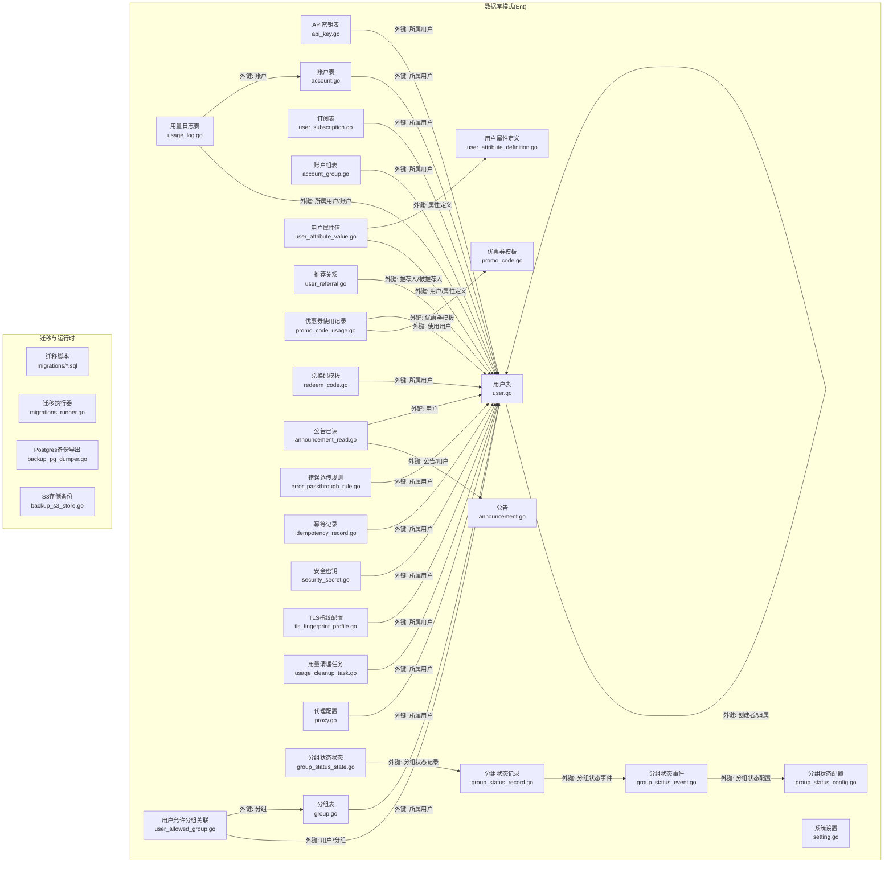
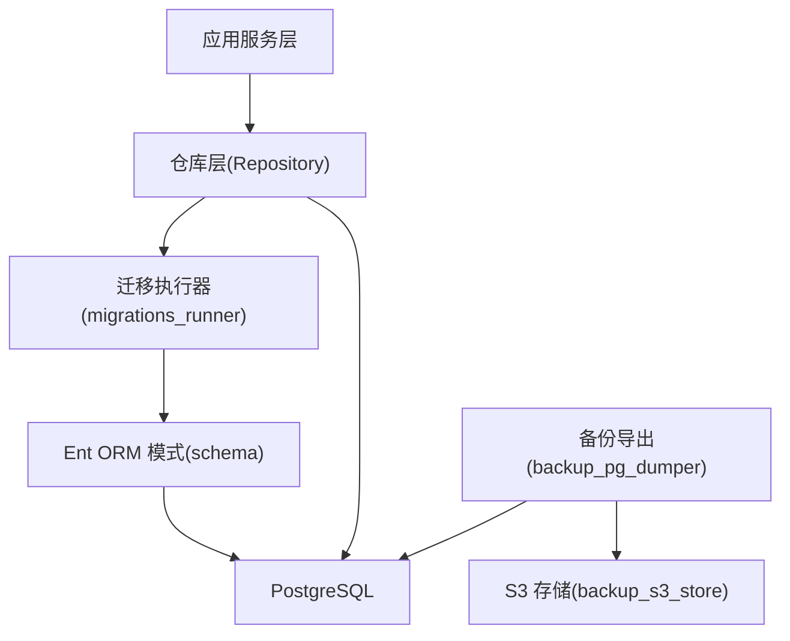
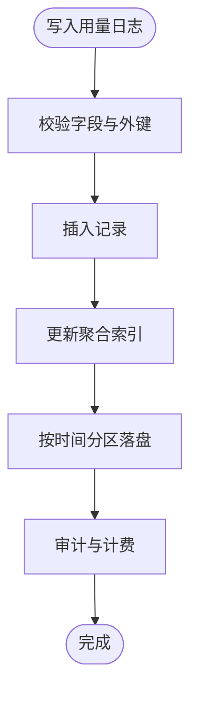
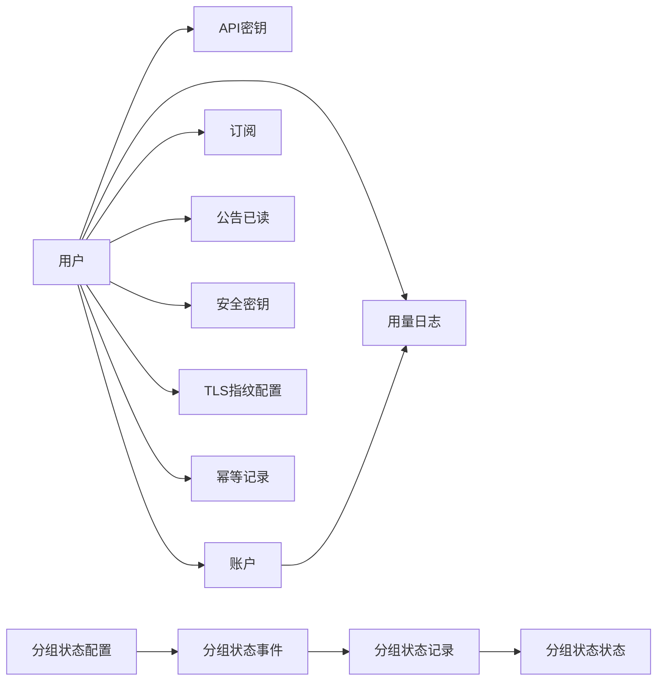

# 数据库设计

<cite>
**本文引用的文件**
- [backend/ent/schema/user.go](file://backend/ent/schema/user.go)
- [backend/ent/schema/api_key.go](file://backend/ent/schema/api_key.go)
- [backend/ent/schema/account.go](file://backend/ent/schema/account.go)
- [backend/ent/schema/user_subscription.go](file://backend/ent/schema/user_subscription.go)
- [backend/ent/schema/usage_log.go](file://backend/ent/schema/usage_log.go)
- [backend/ent/schema/account_group.go](file://backend/ent/schema/account_group.go)
- [backend/ent/schema/group.go](file://backend/ent/schema/group.go)
- [backend/ent/schema/user_allowed_group.go](file://backend/ent/schema/user_allowed_group.go)
- [backend/ent/schema/user_attribute_definition.go](file://backend/ent/schema/user_attribute_definition.go)
- [backend/ent/schema/user_attribute_value.go](file://backend/ent/schema/user_attribute_value.go)
- [backend/ent/schema/user_referral.go](file://backend/ent/schema/user_referral.go)
- [backend/ent/schema/promo_code.go](file://backend/ent/schema/promo_code.go)
- [backend/ent/schema/promo_code_usage.go](file://backend/ent/schema/promo_code_usage.go)
- [backend/ent/schema/redeem_code.go](file://backend/ent/schema/redeem_code.go)
- [backend/ent/schema/announcement.go](file://backend/ent/schema/announcement.go)
- [backend/ent/schema/announcement_read.go](file://backend/ent/schema/announcement_read.go)
- [backend/ent/schema/error_passthrough_rule.go](file://backend/ent/schema/error_passthrough_rule.go)
- [backend/ent/schema/idempotency_record.go](file://backend/ent/schema/idempotency_record.go)
- [backend/ent/schema/security_secret.go](file://backend/ent/schema/security_secret.go)
- [backend/ent/schema/setting.go](file://backend/ent/schema/setting.go)
- [backend/ent/schema/tls_fingerprint_profile.go](file://backend/ent/schema/tls_fingerprint_profile.go)
- [backend/ent/schema/usage_cleanup_task.go](file://backend/ent/schema/usage_cleanup_task.go)
- [backend/ent/schema/proxy.go](file://backend/ent/schema/proxy.go)
- [backend/ent/schema/group_status_config.go](file://backend/ent/schema/group_status_config.go)
- [backend/ent/schema/group_status_event.go](file://backend/ent/schema/group_status_event.go)
- [backend/ent/schema/group_status_record.go](file://backend/ent/schema/group_status_record.go)
- [backend/ent/schema/group_status_state.go](file://backend/ent/schema/group_status_state.go)
- [backend/migrations/001_init.sql](file://backend/migrations/001_init.sql)
- [backend/migrations/003_subscription.sql](file://backend/migrations/003_subscription.sql)
- [backend/migrations/005_schema_parity.sql](file://backend/migrations/005_schema_parity.sql)
- [backend/migrations/010_add_usage_logs_aggregated_indexes.sql](file://backend/migrations/010_add_usage_logs_aggregated_indexes.sql)
- [backend/migrations/035_usage_logs_partitioning.sql](file://backend/migrations/035_usage_logs_partitioning.sql)
- [backend/migrations/045_add_announcements.sql](file://backend/migrations/045_add_announcements.sql)
- [backend/migrations/056_add_api_key_last_used_at.sql](file://backend/migrations/056_add_api_key_last_used_at.sql)
- [backend/migrations/062_add_usage_cleanup_tasks.sql](file://backend/migrations/062_add_usage_cleanup_tasks.sql)
- [backend/migrations/080_create_tls_fingerprint_profiles.sql](file://backend/migrations/080_create_tls_fingerprint_profiles.sql)
- [backend/migrations/091_add_group_status_tables.sql](file://backend/migrations/091_add_group_status_tables.sql)
- [backend/migrations/README.md](file://backend/migrations/README.md)
- [backend/ent/migrate/schema.go](file://backend/ent/migrate/schema.go)
- [backend/ent/migrate/migrate.go](file://backend/ent/migrate/migrate.go)
- [backend/internal/repository/migrations_runner.go](file://backend/internal/repository/migrations_runner.go)
- [backend/internal/repository/migrations_runner_checksum_test.go](file://backend/internal/repository/migrations_runner_checksum_test.go)
- [backend/internal/repository/migrations_runner_extra_test.go](file://backend/internal/repository/migrations_runner_extra_test.go)
- [backend/internal/repository/migrations_runner_notx_test.go](file://backend/internal/repository/migrations_runner_notx_test.go)
- [backend/internal/repository/migrations_schema_integration_test.go](file://backend/internal/repository/migrations_schema_integration_test.go)
- [backend/internal/repository/backup_pg_dumper.go](file://backend/internal/repository/backup_pg_dumper.go)
- [backend/internal/repository/backup_s3_store.go](file://backend/internal/repository/backup_s3_store.go)
- [backend/internal/service/account_service.go](file://backend/internal/service/account_service.go)
- [backend/internal/service/user_subscription_repo.go](file://backend/internal/service/user_subscription_repo.go)
- [backend/internal/service/usage_log_repo.go](file://backend/internal/service/usage_log_repo.go)
- [backend/internal/service/pricing_service.go](file://backend/internal/service/pricing_service.go)
- [backend/internal/service/redis.go](file://backend/internal/service/redis.go)
- [backend/internal/service/db_pool.go](file://backend/internal/service/db_pool.go)
- [backend/internal/pkg/antigravity/channel_repo.go](file://backend/internal/pkg/antigravity/channel_repo.go)
- [backend/internal/pkg/antigravity/channel_repo_pricing.go](file://backend/internal/pkg/antigravity/channel_repo_pricing.go)
- [backend/internal/pkg/antigravity/gateway_cache.go](file://backend/internal/pkg/antigravity/gateway_cache.go)
- [backend/internal/pkg/antigravity/gateway_routing_integration_test.go](file://backend/internal/pkg/antigravity/gateway_routing_integration_test.go)
- [backend/internal/pkg/antigravity/proxy_repo.go](file://backend/internal/pkg/antigravity/proxy_repo.go)
- [backend/internal/pkg/antigravity/proxy_probe_service.go](file://backend/internal/pkg/antigravity/proxy_probe_service.go)
- [backend/internal/pkg/antigravity/proxy_repo_integration_test.go](file://backend/internal/pkg/antigravity/proxy_repo_integration_test.go)
- [backend/internal/pkg/antigravity/proxy_latency_cache.go](file://backend/internal/pkg/antigravity/proxy_latency_cache.go)
- [backend/internal/pkg/antigravity/proxy_probe_service_test.go](file://backend/internal/pkg/antigravity/proxy_probe_service_test.go)
- [backend/internal/pkg/antigravity/proxy_repo_test.go](file://backend/internal/pkg/antigravity/proxy_repo_test.go)
- [backend/internal/pkg/antigravity/ops_write_pressure_integration_test.go](file://backend/internal/pkg/antigravity/ops_write_pressure_integration_test.go)
- [backend/internal/pkg/antigravity/ops_repo_dashboard.go](file://backend/internal/pkg/antigravity/ops_repo_dashboard.go)
- [backend/internal/pkg/antigravity/ops_repo_metrics.go](file://backend/internal/pkg/antigravity/ops_repo_metrics.go)
- [backend/internal/pkg/antigravity/ops_repo_histograms.go](file://backend/internal/pkg/antigravity/ops_repo_histograms.go)
- [backend/internal/pkg/antigravity/ops_repo_latency_histogram_buckets.go](file://backend/internal/pkg/antigravity/ops_repo_latency_histogram_buckets.go)
- [backend/internal/pkg/antigravity/ops_repo_error_where_test.go](file://backend/internal/pkg/antigravity/ops_repo_error_where_test.go)
- [backend/internal/pkg/antigravity/ops_repo_trends.go](file://backend/internal/pkg/antigravity/ops_repo_trends.go)
- [backend/internal/pkg/antigravity/ops_repo_window_stats.go](file://backend/internal/pkg/antigravity/ops_repo_window_stats.go)
- [backend/internal/pkg/antigravity/ops_repo_system_logs_test.go](file://backend/internal/pkg/antigravity/ops_repo_system_logs_test.go)
- [backend/internal/pkg/antigravity/ops_repo_openai_token_stats.go](file://backend/internal/pkg/antigravity/ops_repo_openai_token_stats.go)
- [backend/internal/pkg/antigravity/ops_repo_preagg.go](file://backend/internal/pkg/antigravity/ops_repo_preagg.go)
- [backend/internal/pkg/antigravity/ops_repo_realtime_traffic.go](file://backend/internal/pkg/antigravity/ops_repo_realtime_traffic.go)
- [backend/internal/pkg/antigravity/ops_repo_request_details.go](file://backend/internal/pkg/antigravity/ops_repo_request_details.go)
- [backend/internal/pkg/antigravity/ops_repo_alerts.go](file://backend/internal/pkg/antigravity/ops_repo_alerts.go)
- [backend/internal/pkg/antigravity/ops_repo_dashboard_timeout_test.go](file://backend/internal/pkg/antigravity/ops_repo_dashboard_timeout_test.go)
- [backend/internal/pkg/antigravity/ops_repo_error_where_test.go](file://backend/internal/pkg/antigravity/ops_repo_error_where_test.go)
- [backend/internal/pkg/antigravity/ops_repo_latency_histogram_buckets_test.go](file://backend/internal/pkg/antigravity/ops_repo_latency_histogram_buckets_test.go)
- [backend/internal/pkg/antigravity/ops_repo_openai_token_stats_test.go](file://backend/internal/pkg/antigravity/ops_repo_openai_token_stats_test.go)
- [backend/internal/pkg/antigravity/ops_repo_system_logs.go](file://backend/internal/pkg/antigravity/ops_repo_system_logs.go)
- [backend/internal/pkg/antigravity/ops_repo_metrics.go](file://backend/internal/pkg/antigravity/ops_repo_metrics.go)
- [backend/internal/pkg/antigravity/ops_repo_histograms.go](file://backend/internal/pkg/antigravity/ops_repo_histograms.go)
- [backend/internal/pkg/antigravity/ops_repo_latency_histogram_buckets.go](file://backend/internal/pkg/antigravity/ops_repo_latency_histogram_buckets.go)
- [backend/internal/pkg/antigravity/ops_repo_trends.go](file://backend/internal/pkg/antigravity/ops_repo_trends.go)
- [backend/internal/pkg/antigravity/ops_repo_window_stats.go](file://backend/internal/pkg/antigravity/ops_repo_window_stats.go)
- [backend/internal/pkg/antigravity/ops_repo_realtime_traffic.go](file://backend/internal/pkg/antigravity/ops_repo_realtime_traffic.go)
- [backend/internal/pkg/antigravity/ops_repo_request_details.go](file://backend/internal/pkg/antigravity/ops_repo_request_details.go)
- [backend/internal/pkg/antigravity/ops_repo_alerts.go](file://backend/internal/pkg/antigravity/ops_repo_alerts.go)
- [backend/internal/pkg/antigravity/ops_repo_dashboard.go](file://backend/internal/pkg/antigravity/ops_repo_dashboard.go)
- [backend/internal/pkg/antigravity/ops_repo_preagg.go](file://backend/internal/pkg/antigravity/ops_repo_preagg.go)
- [backend/internal/pkg/antigravity/ops_repo_system_logs.go](file://backend/internal/pkg/antigravity/ops_repo_system_logs.go)
- [backend/internal/pkg/antigravity/ops_repo_openai_token_stats.go](file://backend/internal/pkg/antigravity/ops_repo_openai_token_stats.go)
- [backend/internal/pkg/antigravity/ops_repo_metrics.go](file://backend/internal/pkg/antigravity/ops_repo_metrics.go)
- [backend/internal/pkg/antigravity/ops_repo_histograms.go](file://backend/internal/pkg/antigravity/ops_repo_histograms.go)
- [backend/internal/pkg/antigravity/ops_repo_latency_histogram_buckets.go](file://backend/internal/pkg/antigravity/ops_repo_latency_histogram_buckets.go)
- [backend/internal/pkg/antigravity/ops_repo_trends.go](file://backend/internal/pkg/antigravity/ops_repo_trends.go)
- [backend/internal/pkg/antigravity/ops_repo_window_stats.go](file://backend/internal/pkg/antigravity/ops_repo_window_stats.go)
- [backend/internal/pkg/antigravity/ops_repo_realtime_traffic.go](file://backend/internal/pkg/antigravity/ops_repo_realtime_traffic.go)
- [backend/internal/pkg/antigravity/ops_repo_request_details.go](file://backend/internal/pkg/antigravity/ops_repo_request_details.go)
- [backend/internal/pkg/antigravity/ops_repo_alerts.go](file://backend/internal/pkg/antigravity/ops_repo_alerts.go)
- [backend/internal/pkg/antigravity/ops_repo_dashboard.go](file://backend/internal/pkg/antigravity/ops_repo_dashboard.go)
- [backend/internal/pkg/antigravity/ops_repo_preagg.go](file://backend/internal/pkg/antigravity/ops_repo_preagg.go)
- [backend/internal/pkg/antigravity/ops_repo_system_logs.go](file://backend/internal/pkg/antigravity/ops_repo_system_logs.go)
- [backend/internal/pkg/antigravity/ops_repo_openai_token_stats.go](file://backend/internal/pkg/antigravity/ops_repo_openai_token_stats.go)
- [backend/internal/pkg/antigravity/ops_repo_metrics.go](file://backend/internal/pkg/antigravity/ops_repo_metrics.go)
- [backend/internal/pkg/antigravity/ops_repo_histograms.go](file://backend/internal/pkg/antigravity/ops_repo_histograms.go)
- [backend/internal/pkg/antigravity/ops_repo_latency_histogram_buckets.go](file://backend/internal/pkg/antigravity/ops_repo_latency_histogram_buckets.go)
- [backend/internal/pkg/antigravity/ops_repo_trends.go](file://backend/internal/pkg/antigravity/ops_repo_trends.go)
- [backend/internal/pkg/antigravity/ops_repo_window_stats.go](file://backend/internal/pkg/antigravity/ops_repo_window_stats.go)
- [backend/internal/pkg/antigravity/ops_repo_realtime_traffic.go](file://backend/internal/pkg/antigravity/ops_repo_realtime_traffic.go)
- [backend/internal/pkg/antigravity/ops_repo_request_details.go](file://backend/internal/pkg/antigravity/ops_repo_request_details.go)
- [backend/internal/pkg/antigravity/ops_repo_alerts.go](file://backend/internal/pkg/antigravity/ops_repo_alerts.go)
- [backend/internal/pkg/antigravity/ops_repo_dashboard.go](file://backend/internal/pkg/antigravity/ops_repo_dashboard.go)
- [backend/internal/pkg/antigravity/ops_repo_preagg.go](file://backend/internal/pkg/antigravity/ops_repo_preagg.go)
- [backend/internal/pkg/antigravity/ops_repo_system_logs.go](file://backend/internal/pkg/antigravity/ops_repo_system_logs.go)
- [backend/internal/pkg/antigravity/ops_repo_openai_token_stats.go](file://backend/internal/pkg/antigravity/ops_repo_openai_token_stats.go)
- [backend/internal/pkg/antigravity/ops_repo_metrics.go](file://backend/internal/pkg/antigravity/ops_repo_metrics.go)
- [backend/internal/pkg/antigravity/ops_repo_histograms.go](file://backend/internal/pkg/antigravity/ops_repo_histograms.go)
- [backend/internal/pkg/antigravity/ops_repo_latency_histogram_buckets.go](file://backend/internal/pkg/antigravity/ops_repo_latency_histogram_buckets.go)
- [backend/internal/pkg/antigravity/ops_repo_trends.go](file://backend/internal/pkg/antigravity/ops_repo_trends.go)
- [backend/internal/pkg/antigravity/ops_repo_window_stats.go](file://backend/internal/pkg/antigravity/ops_repo_window_stats.go)
- [backend/internal/pkg/antigravity/ops_repo_realtime_traffic.go](file://backend/internal/pkg/antigravity/ops_repo_realtime_traffic.go)
- [backend/internal/pkg/antigravity/ops_repo_request_details.go](file://backend/internal/pkg/antigravity/ops_repo_request_details.go)
- [backend/internal/pkg/antigravity/ops_repo_alerts.go](file://backend/internal/pkg/antigravity/ops_repo_alerts.go)
- [backend/internal/pkg/antigravity/ops_repo_dashboard.go](file://backend/internal/pkg/antigravity/ops_repo_dashboard.go)
- [backend/internal/pkg/antigravity/ops_repo_preagg.go](file://backend/internal/pkg/antigravity/ops_repo_preagg.go)
- [backend/internal/pkg/antigravity/ops_repo_system_logs.go](file://backend/internal/pkg/antigravity/ops_repo_system_logs.go)
- [backend/internal/pkg/antigravity/ops_repo_openai_token_stats.go](file://backend/internal/pkg/antigravity/ops_repo_openai_token_stats.go)
- [backend/internal/pkg/antigravity/ops_repo_metrics.go](file://backend/internal/pkg/antigravity/ops_repo_metrics.go)
- [backend/internal/pkg/antigravity/ops_repo_histograms.go](file://backend/internal/pkg/antigravity/ops_repo_histograms.go)
- [backend/internal/pkg/antigravity/ops_repo_latency_histogram_buckets.go](file://backend/internal/pkg/antigravity/ops_repo_latency_histogram_buckets.go)
- [backend/internal/pkg/antigravity/ops_repo_trends.go](file://backend/internal/pkg/antigravity/ops_repo_trends.go)
- [backend/internal/pkg/antigravity/ops_repo_window_stats.go](file://backend/internal/pkg/antigravity/ops_repo_window_stats.go)
- [backend/internal/pkg/antigravity/ops_repo_realtime_traffic.go](file://backend/internal/pkg/antigravity/ops_repo_realtime_traffic.go)
- [backend/internal/pkg/antigravity/ops_repo_request_details.go](file://backend/internal/pkg/antigravity/ops_repo_request_details.go)
- [backend/internal/pkg/antigravity/ops_repo_alerts.go](file://backend/internal/pkg/antigravity/ops_repo_alerts.go)
- [backend/internal/pkg/antigravity/ops_repo_dashboard.go](file://backend/internal/pkg/antigravity/ops_repo_dashboard.go)
- [backend/internal/pkg/antigravity/ops_repo_preagg.go](file://backend/internal/pkg/antigravity/ops_repo_preagg.go)
- [backend/internal/pkg/antigravity/ops_repo_system_logs.go](file://backend/internal/pkg/antigravity/ops_repo_system_logs.go)
- [backend/internal/pkg/antigravity/ops_repo_openai_token_stats.go](file://backend/internal/pkg/antigravity/ops_repo_openai_token_stats.go)
- [backend/internal/pkg/antigravity/ops_repo_metrics.go](file://backend/internal/pkg/antigravity/ops_repo_metrics.go)
- [backend/internal/pkg/antigravity/ops_repo_histograms.go](file://backend/internal/pkg/antigravity/ops_repo_histograms.go)
- [backend/internal/pkg/antigravity/ops_repo_latency_histogram_buckets.go](file://backend/internal/pkg/antigravity/ops_repo_latency_histogram_buckets.go)
- [backend/internal/pkg/antigravity/ops_repo_trends.go](file://backend/internal/pkg/antigravity/ops_repo_trends.go)
- [backend/internal/pkg/antigravity/ops_repo_window_stats.go](file://backend/internal/pkg/antigravity/ops_repo_window_stats.go)
- [backend/internal/pkg/antigravity/ops_repo_realtime_traffic.go](file://backend/internal/pkg/antigravity/ops_repo_realtime_traffic.go)
- [backend/internal/pkg/antigravity/ops_repo_request_details.go](file://backend/internal/pkg/antigravity/ops_repo_request_details.go)
- [backend/internal/pkg/antigravity/ops_repo_alerts.go](file://backend/internal/pkg/antigravity/ops_repo_alerts.go)
- [backend/internal/pkg/antigravity/ops_repo_dashboard.go](file://backend/internal/pkg/antigravity/ops_repo_dashboard.go)
- [backend/internal/pkg/antigravity/ops_repo_preagg.go](file://backend/internal/pkg/antigravity/ops_repo_preagg.go)
- [backend/internal/pkg/antigravity/ops_repo_system_logs.go](file://backend/internal/pkg/antigravity/ops_repo_system_logs.go)
- [backend/internal/pkg/antigravity/ops_repo_openai_token_stats.go](file://backend/internal/pkg/antigravity/ops_repo_openai_token_stats.go)
- [backend/internal/pkg/antigravity/ops_repo_metrics......](file://backend/internal/pkg/antigravity/ops_repo_metrics.go)
</cite>

## 目录
1. [简介](#简介)
2. [项目结构](#项目结构)
3. [核心组件](#核心组件)
4. [架构总览](#架构总览)
5. [详细组件分析](#详细组件分析)
6. [依赖分析](#依赖分析)
7. [性能考虑](#性能考虑)
8. [故障排查指南](#故障排查指南)
9. [结论](#结论)
10. [附录](#附录)

## 简介
本文件为 Sub2API 的数据库设计文档，聚焦于核心数据模型与实体关系，覆盖用户、API 密钥、订阅、用量日志、账户等主要数据表的结构设计，并结合迁移脚本与运行时仓库层实现，给出 ER 关系、索引策略、迁移与回滚机制、性能优化、安全与隐私保护以及备份恢复最佳实践。

## 项目结构
后端采用 Ent ORM 生成与维护数据库结构，迁移脚本位于 backend/migrations 目录，Ent 模式定义在 backend/ent/schema 下，仓库层（Repository）封装了迁移执行、备份与缓存等能力。



图表来源
- [backend/ent/schema/user.go](file://backend/ent/schema/user.go)
- [backend/ent/schema/api_key.go](file://backend/ent/schema/api_key.go)
- [backend/ent/schema/account.go](file://backend/ent/schema/account.go)
- [backend/ent/schema/user_subscription.go](file://backend/ent/schema/user_subscription.go)
- [backend/ent/schema/usage_log.go](file://backend/ent/schema/usage_log.go)
- [backend/ent/schema/account_group.go](file://backend/ent/schema/account_group.go)
- [backend/ent/schema/group.go](file://backend/ent/schema/group.go)
- [backend/ent/schema/user_allowed_group.go](file://backend/ent/schema/user_allowed_group.go)
- [backend/ent/schema/user_attribute_definition.go](file://backend/ent/schema/user_attribute_definition.go)
- [backend/ent/schema/user_attribute_value.go](file://backend/ent/schema/user_attribute_value.go)
- [backend/ent/schema/user_referral.go](file://backend/ent/schema/user_referral.go)
- [backend/ent/schema/promo_code.go](file://backend/ent/schema/promo_code.go)
- [backend/ent/schema/promo_code_usage.go](file://backend/ent/schema/promo_code_usage.go)
- [backend/ent/schema/redeem_code.go](file://backend/ent/schema/redeem_code.go)
- [backend/ent/schema/announcement.go](file://backend/ent/schema/announcement.go)
- [backend/ent/schema/announcement_read.go](file://backend/ent/schema/announcement_read.go)
- [backend/ent/schema/error_passthrough_rule.go](file://backend/ent/schema/error_passthrough_rule.go)
- [backend/ent/schema/idempotency_record.go](file://backend/ent/schema/idempotency_record.go)
- [backend/ent/schema/security_secret.go](file://backend/ent/schema/security_secret.go)
- [backend/ent/schema/setting.go](file://backend/ent/schema/setting.go)
- [backend/ent/schema/tls_fingerprint_profile.go](file://backend/ent/schema/tls_fingerprint_profile.go)
- [backend/ent/schema/usage_cleanup_task.go](file://backend/ent/schema/usage_cleanup_task.go)
- [backend/ent/schema/proxy.go](file://backend/ent/schema/proxy.go)
- [backend/ent/schema/group_status_config.go](file://backend/ent/schema/group_status_config.go)
- [backend/ent/schema/group_status_event.go](file://backend/ent/schema/group_status_event.go)
- [backend/ent/schema/group_status_record.go](file://backend/ent/schema/group_status_record.go)
- [backend/ent/schema/group_status_state.go](file://backend/ent/schema/group_status_state.go)

章节来源
- [backend/ent/schema/user.go](file://backend/ent/schema/user.go)
- [backend/ent/schema/api_key.go](file://backend/ent/schema/api_key.go)
- [backend/ent/schema/account.go](file://backend/ent/schema/account.go)
- [backend/ent/schema/user_subscription.go](file://backend/ent/schema/user_subscription.go)
- [backend/ent/schema/usage_log.go](file://backend/ent/schema/usage_log.go)
- [backend/ent/schema/account_group.go](file://backend/ent/schema/account_group.go)
- [backend/ent/schema/group.go](file://backend/ent/schema/group.go)
- [backend/ent/schema/user_allowed_group.go](file://backend/ent/schema/user_allowed_group.go)
- [backend/ent/schema/user_attribute_definition.go](file://backend/ent/schema/user_attribute_definition.go)
- [backend/ent/schema/user_attribute_value.go](file://backend/ent/schema/user_attribute_value.go)
- [backend/ent/schema/user_referral.go](file://backend/ent/schema/user_referral.go)
- [backend/ent/schema/promo_code.go](file://backend/ent/schema/promo_code.go)
- [backend/ent/schema/promo_code_usage.go](file://backend/ent/schema/promo_code_usage.go)
- [backend/ent/schema/redeem_code.go](file://backend/ent/schema/redeem_code.go)
- [backend/ent/schema/announcement.go](file://backend/ent/schema/announcement.go)
- [backend/ent/schema/announcement_read.go](file://backend/ent/schema/announcement_read.go)
- [backend/ent/schema/error_passthrough_rule.go](file://backend/ent/schema/error_passthrough_rule.go)
- [backend/ent/schema/idempotency_record.go](file://backend/ent/schema/idempotency_record.go)
- [backend/ent/schema/security_secret.go](file://backend/ent/schema/security_secret.go)
- [backend/ent/schema/setting.go](file://backend/ent/schema/setting.go)
- [backend/ent/schema/tls_fingerprint_profile.go](file://backend/ent/schema/tls_fingerprint_profile.go)
- [backend/ent/schema/usage_cleanup_task.go](file://backend/ent/schema/usage_cleanup_task.go)
- [backend/ent/schema/proxy.go](file://backend/ent/schema/proxy.go)
- [backend/ent/schema/group_status_config.go](file://backend/ent/schema/group_status_config.go)
- [backend/ent/schema/group_status_event.go](file://backend/ent/schema/group_status_event.go)
- [backend/ent/schema/group_status_record.go](file://backend/ent/schema/group_status_record.go)
- [backend/ent/schema/group_status_state.go](file://backend/ent/schema/group_status_state.go)

## 核心组件
本节概述主要数据表的职责与关键字段语义（以字段名与约束为主，不直接粘贴代码）：

- 用户表（user）
  - 主键：自增 ID
  - 字段要点：用户名、邮箱、密码哈希、状态、创建/更新时间等
  - 约束：唯一索引（用户名、邮箱），非空字段若干
  - 业务含义：系统身份主体，承载认证与权限基础

- API 密钥表（api_key）
  - 主键：自增 ID
  - 外键：所属用户
  - 字段要点：密钥标识、密钥值摘要、用途描述、配额限制、到期时间、IP 限制、最后使用时间、创建/更新时间
  - 约束：唯一索引（密钥标识）、外键（用户）
  - 业务含义：面向用户的访问凭据，支持限额与风控

- 账户表（account）
  - 主键：自增 ID
  - 外键：所属用户
  - 字段要点：上游提供商、凭证（可能加密存储）、余额、额度、到期时间、备注、创建/更新时间
  - 约束：外键（用户），可选唯一索引（凭证标识）
  - 业务含义：承载上游服务调用的凭据与用量配额

- 订阅表（user_subscription）
  - 主键：自增 ID
  - 外键：所属用户
  - 字段要点：订阅类型、开始/结束时间、状态、额度、周期、价格信息、创建/更新时间
  - 约束：外键（用户），时间范围与状态枚举
  - 业务含义：用户付费订阅与配额周期管理

- 用量日志表（usage_log）
  - 主键：复合主键或自增 ID
  - 外键：所属用户、账户
  - 字段要点：请求时间、模型、请求/输出 token 数、费用、上游响应时间、错误码、请求类型、服务等级、是否计费等
  - 约束：外键（用户、账户），大量聚合与统计字段
  - 业务含义：用量与计费的审计与统计依据

- 账户组表（account_group）
  - 主键：自增 ID
  - 外键：所属用户
  - 字段要点：组名、描述、创建/更新时间
  - 约束：外键（用户）
  - 业务含义：对账户进行逻辑分组，便于路由与配额管理

- 分组表（group）
  - 主键：自增 ID
  - 外键：所属用户
  - 字段要点：分组名、排序、创建/更新时间
  - 约束：外键（用户）
  - 业务含义：用于模型路由与分组策略

- 用户允许分组关联（user_allowed_group）
  - 主键：复合主键（用户 ID + 分组 ID）
  - 外键：用户、分组
  - 约束：外键（用户、分组）
  - 业务含义：限定用户可使用的分组集合

- 用户属性定义/值（user_attribute_definition, user_attribute_value）
  - 主键：自增 ID 或复合主键
  - 外键：用户、属性定义
  - 字段要点：属性键、属性值、创建/更新时间
  - 约束：外键（用户、属性定义）
  - 业务含义：扩展用户维度的可配置属性

- 推荐关系（user_referral）
  - 主键：自增 ID
  - 外键：推荐人、被推荐人
  - 字段要点：推荐关系状态、创建时间
  - 约束：外键（推荐人、被推荐人）
  - 业务含义：用户推荐与激励体系

- 优惠券模板/使用（promo_code, promo_code_usage）
  - 主键：自增 ID
  - 外键：模板、使用用户
  - 字段要点：模板参数（折扣/抵扣）、使用状态、使用时间
  - 约束：外键（模板、用户）
  - 业务含义：营销与促销活动

- 兑换码模板（redeem_code）
  - 主键：自增 ID
  - 外键：所属用户
  - 字段要点：兑换码、状态、描述、创建时间
  - 约束：外键（用户）
  - 业务含义：内部或运营发放的权益兑换

- 公告/公告已读（announcement, announcement_read）
  - 主键：自增 ID
  - 外键：公告、用户
  - 字段要点：公告内容、可见范围、发布时间、已读标记
  - 约束：外键（公告、用户）
  - 业务含义：站内通知与追踪

- 错误透传规则（error_passthrough_rule）
  - 主键：自增 ID
  - 外键：所属用户
  - 字段要点：规则表达式、是否跳过监控
  - 约束：外键（用户）
  - 业务含义：上游错误处理策略

- 幂等记录（idempotency_record）
  - 主键：自增 ID
  - 外键：所属用户
  - 字段要点：幂等键、结果缓存、过期时间
  - 约束：外键（用户）
  - 业务含义：保障下游请求的幂等性

- 安全密钥（security_secret）
  - 主键：自增 ID
  - 外键：所属用户
  - 字段要点：密钥名称、密文、创建/更新时间
  - 约束：外键（用户）
  - 业务含义：敏感配置的加密存储

- 系统设置（setting）
  - 主键：自增 ID
  - 字段要点：键、值、作用域、创建/更新时间
  - 约束：唯一索引（键）
  - 业务含义：全局或用户级配置

- TLS 指纹配置（tls_fingerprint_profile）
  - 主键：自增 ID
  - 外键：所属用户
  - 字段要点：指纹参数、匹配规则、启用状态
  - 约束：外键（用户）
  - 业务含义：反爬/风控的 TLS 特征配置

- 用量清理任务（usage_cleanup_task）
  - 主键：自增 ID
  - 外键：所属用户
  - 字段要点：清理策略、目标时间窗口、状态
  - 约束：外键（用户）
  - 业务含义：历史用量数据的定期清理

- 代理配置（proxy）
  - 主键：自增 ID
  - 外键：所属用户
  - 字段要点：代理地址、认证、健康检查、负载因子
  - 约束：外键（用户）
  - 业务含义：上游代理与路由

- 分组状态系列（group_status_config, group_status_event, group_status_record, group_status_state）
  - 主键：自增 ID
  - 外键：配置/事件/记录/状态
  - 字段要点：状态机参数、事件触发、记录与当前状态
  - 约束：外键链路
  - 业务含义：分组状态的自动化管理

章节来源
- [backend/ent/schema/user.go](file://backend/ent/schema/user.go)
- [backend/ent/schema/api_key.go](file://backend/ent/schema/api_key.go)
- [backend/ent/schema/account.go](file://backend/ent/schema/account.go)
- [backend/ent/schema/user_subscription.go](file://backend/ent/schema/user_subscription.go)
- [backend/ent/schema/usage_log.go](file://backend/ent/schema/usage_log.go)
- [backend/ent/schema/account_group.go](file://backend/ent/schema/account_group.go)
- [backend/ent/schema/group.go](file://backend/ent/schema/group.go)
- [backend/ent/schema/user_allowed_group.go](file://backend/ent/schema/user_allowed_group.go)
- [backend/ent/schema/user_attribute_definition.go](file://backend/ent/schema/user_attribute_definition.go)
- [backend/ent/schema/user_attribute_value.go](file://backend/ent/schema/user_attribute_value.go)
- [backend/ent/schema/user_referral.go](file://backend/ent/schema/user_referral.go)
- [backend/ent/schema/promo_code.go](file://backend/ent/schema/promo_code.go)
- [backend/ent/schema/promo_code_usage.go](file://backend/ent/schema/promo_code_usage.go)
- [backend/ent/schema/redeem_code.go](file://backend/ent/schema/redeem_code.go)
- [backend/ent/schema/announcement.go](file://backend/ent/schema/announcement.go)
- [backend/ent/schema/announcement_read.go](file://backend/ent/schema/announcement_read.go)
- [backend/ent/schema/error_passthrough_rule.go](file://backend/ent/schema/error_passthrough_rule.go)
- [backend/ent/schema/idempotency_record.go](file://backend/ent/schema/idempotency_record.go)
- [backend/ent/schema/security_secret.go](file://backend/ent/schema/security_secret.go)
- [backend/ent/schema/setting.go](file://backend/ent/schema/setting.go)
- [backend/ent/schema/tls_fingerprint_profile.go](file://backend/ent/schema/tls_fingerprint_profile.go)
- [backend/ent/schema/usage_cleanup_task.go](file://backend/ent/schema/usage_cleanup_task.go)
- [backend/ent/schema/proxy.go](file://backend/ent/schema/proxy.go)
- [backend/ent/schema/group_status_config.go](file://backend/ent/schema/group_status_config.go)
- [backend/ent/schema/group_status_event.go](file://backend/ent/schema/group_status_event.go)
- [backend/ent/schema/group_status_record.go](file://backend/ent/schema/group_status_record.go)
- [backend/ent/schema/group_status_state.go](file://backend/ent/schema/group_status_state.go)

## 架构总览
下图展示数据库层与迁移、备份、仓库层的关系，以及与上游服务的交互路径。



图表来源
- [backend/internal/repository/migrations_runner.go](file://backend/internal/repository/migrations_runner.go)
- [backend/ent/migrate/schema.go](file://backend/ent/migrate/schema.go)
- [backend/ent/migrate/migrate.go](file://backend/ent/migrate/migrate.go)
- [backend/internal/repository/backup_pg_dumper.go](file://backend/internal/repository/backup_pg_dumper.go)
- [backend/internal/repository/backup_s3_store.go](file://backend/internal/repository/backup_s3_store.go)

## 详细组件分析

### 用户与API密钥
- 用户表承担认证与授权基础；API 密钥表通过外键与用户关联，支持按用户维度的密钥管理与配额控制。
- 建议索引：用户唯一索引（用户名、邮箱），API 密钥唯一索引（密钥标识）。
- 业务要点：密钥到期、IP 白名单、最后使用时间可用于风控与审计。

```mermaid
classDiagram
class 用户 {
+自增ID
+用户名
+邮箱
+状态
+创建/更新时间
}
class API密钥 {
+自增ID
+密钥标识
+密钥值摘要
+用途描述
+配额限制
+到期时间
+IP限制
+最后使用时间
+创建/更新时间
}
API密钥 --> 用户 : "外键 : 所属用户"
```

图表来源
- [backend/ent/schema/user.go](file://backend/ent/schema/user.go)
- [backend/ent/schema/api_key.go](file://backend/ent/schema/api_key.go)

章节来源
- [backend/ent/schema/user.go](file://backend/ent/schema/user.go)
- [backend/ent/schema/api_key.go](file://backend/ent/schema/api_key.go)
- [backend/migrations/056_add_api_key_last_used_at.sql](file://backend/migrations/056_add_api_key_last_used_at.sql)

### 账户与订阅
- 账户表承载上游提供商凭据与额度；订阅表管理用户付费周期与配额。
- 建议索引：账户与用户关联索引，订阅状态与时间范围索引。
- 业务要点：到期时间、余额、额度与计费一致性。

```mermaid
classDiagram
class 账户 {
+自增ID
+上游提供商
+凭证(可能加密)
+余额
+额度
+到期时间
+备注
+创建/更新时间
}
class 订阅 {
+自增ID
+订阅类型
+开始/结束时间
+状态
+额度
+周期
+价格信息
+创建/更新时间
}
账户 --> 用户 : "外键 : 所属用户"
订阅 --> 用户 : "外键 : 所属用户"
```

图表来源
- [backend/ent/schema/account.go](file://backend/ent/schema/account.go)
- [backend/ent/schema/user_subscription.go](file://backend/ent/schema/user_subscription.go)
- [backend/migrations/003_subscription.sql](file://backend/migrations/003_subscription.sql)

章节来源
- [backend/ent/schema/account.go](file://backend/ent/schema/account.go)
- [backend/ent/schema/user_subscription.go](file://backend/ent/schema/user_subscription.go)
- [backend/migrations/003_subscription.sql](file://backend/migrations/003_subscription.sql)

### 用量日志与聚合
- 用量日志表是计费与审计的核心，包含请求/输出 token、费用、上游响应时间、错误码、请求类型、服务等级等。
- 迁移中包含聚合索引与分区策略，以支撑高并发写入与高效查询。
- 建议索引：按用户、账户、时间、请求类型、模型等维度建立复合索引；分区策略按时间列进行分区。



图表来源
- [backend/ent/schema/usage_log.go](file://backend/ent/schema/usage_log.go)
- [backend/migrations/010_add_usage_logs_aggregated_indexes.sql](file://backend/migrations/010_add_usage_logs_aggregated_indexes.sql)
- [backend/migrations/035_usage_logs_partitioning.sql](file://backend/migrations/035_usage_logs_partitioning.sql)

章节来源
- [backend/ent/schema/usage_log.go](file://backend/ent/schema/usage_log.go)
- [backend/migrations/010_add_usage_logs_aggregated_indexes.sql](file://backend/migrations/010_add_usage_logs_aggregated_indexes.sql)
- [backend/migrations/035_usage_logs_partitioning.sql](file://backend/migrations/035_usage_logs_partitioning.sql)

### 公告与消息
- 公告表与公告已读表分离，支持广播与已读追踪。
- 建议索引：公告发布者与时间索引，公告已读的用户-公告复合索引。

```mermaid
classDiagram
class 公告 {
+自增ID
+标题
+内容
+可见范围
+发布时间
+创建/更新时间
}
class 公告已读 {
+自增ID
+公告ID
+用户ID
+已读时间
}
公告已读 --> 公告 : "外键 : 公告"
公告已读 --> 用户 : "外键 : 用户"
```

图表来源
- [backend/ent/schema/announcement.go](file://backend/ent/schema/announcement.go)
- [backend/ent/schema/announcement_read.go](file://backend/ent/schema/announcement_read.go)
- [backend/migrations/045_add_announcements.sql](file://backend/migrations/045_add_announcements.sql)

章节来源
- [backend/ent/schema/announcement.go](file://backend/ent/schema/announcement.go)
- [backend/ent/schema/announcement_read.go](file://backend/ent/schema/announcement_read.go)
- [backend/migrations/045_add_announcements.sql](file://backend/migrations/045_add_announcements.sql)

### 安全与合规
- 安全密钥表用于加密存储敏感配置；TLS 指纹配置支持风控策略；幂等记录保障重复请求的安全性。
- 建议索引：安全密钥名称唯一索引，幂等键唯一索引。

```mermaid
classDiagram
class 安全密钥 {
+自增ID
+密钥名称
+密文
+创建/更新时间
}
class TLS指纹配置 {
+自增ID
+指纹参数
+匹配规则
+启用状态
+创建/更新时间
}
class 幂等记录 {
+自增ID
+幂等键
+结果缓存
+过期时间
}
安全密钥 --> 用户 : "外键 : 所属用户"
TLS指纹配置 --> 用户 : "外键 : 所属用户"
幂等记录 --> 用户 : "外键 : 所属用户"
```

图表来源
- [backend/ent/schema/security_secret.go](file://backend/ent/schema/security_secret.go)
- [backend/ent/schema/tls_fingerprint_profile.go](file://backend/ent/schema/tls_fingerprint_profile.go)
- [backend/ent/schema/idempotency_record.go](file://backend/ent/schema/idempotency_record.go)
- [backend/migrations/080_create_tls_fingerprint_profiles.sql](file://backend/migrations/080_create_tls_fingerprint_profiles.sql)

章节来源
- [backend/ent/schema/security_secret.go](file://backend/ent/schema/security_secret.go)
- [backend/ent/schema/tls_fingerprint_profile.go](file://backend/ent/schema/tls_fingerprint_profile.go)
- [backend/ent/schema/idempotency_record.go](file://backend/ent/schema/idempotency_record.go)
- [backend/migrations/080_create_tls_fingerprint_profiles.sql](file://backend/migrations/080_create_tls_fingerprint_profiles.sql)

### 分组与路由
- 分组状态系列表支持分组状态机管理，配合路由策略实现动态调度。
- 建议索引：状态事件与记录的关联索引，状态机参数的组合索引。

```mermaid
classDiagram
class 分组状态配置 {
+自增ID
+状态机参数
+创建/更新时间
}
class 分组状态事件 {
+自增ID
+事件类型
+触发条件
+创建/更新时间
}
class 分组状态记录 {
+自增ID
+事件ID
+状态
+记录时间
}
class 分组状态状态 {
+自增ID
+记录ID
+当前状态
+切换时间
}
分组状态记录 --> 分组状态事件 : "外键 : 事件"
分组状态状态 --> 分组状态记录 : "外键 : 记录"
```

图表来源
- [backend/ent/schema/group_status_config.go](file://backend/ent/schema/group_status_config.go)
- [backend/ent/schema/group_status_event.go](file://backend/ent/schema/group_status_event.go)
- [backend/ent/schema/group_status_record.go](file://backend/ent/schema/group_status_record.go)
- [backend/ent/schema/group_status_state.go](file://backend/ent/schema/group_status_state.go)
- [backend/migrations/091_add_group_status_tables.sql](file://backend/migrations/091_add_group_status_tables.sql)

章节来源
- [backend/ent/schema/group_status_config.go](file://backend/ent/schema/group_status_config.go)
- [backend/ent/schema/group_status_event.go](file://backend/ent/schema/group_status_event.go)
- [backend/ent/schema/group_status_record.go](file://backend/ent/schema/group_status_record.go)
- [backend/ent/schema/group_status_state.go](file://backend/ent/schema/group_status_state.go)
- [backend/migrations/091_add_group_status_tables.sql](file://backend/migrations/091_add_group_status_tables.sql)

## 依赖分析
- 组件耦合
  - 用量日志强依赖用户与账户，形成“用户-账户-用量”的核心链路。
  - 分组与路由通过分组状态表串联，形成“配置-事件-记录-状态”的状态机。
- 外部依赖
  - 迁移脚本依赖 PostgreSQL 语法与特性（分区、BRIN 等）。
  - 备份依赖 Postgres 导出与 S3 存储。



图表来源
- [backend/ent/schema/user.go](file://backend/ent/schema/user.go)
- [backend/ent/schema/api_key.go](file://backend/ent/schema/api_key.go)
- [backend/ent/schema/account.go](file://backend/ent/schema/account.go)
- [backend/ent/schema/user_subscription.go](file://backend/ent/schema/user_subscription.go)
- [backend/ent/schema/usage_log.go](file://backend/ent/schema/usage_log.go)
- [backend/ent/schema/announcement_read.go](file://backend/ent/schema/announcement_read.go)
- [backend/ent/schema/security_secret.go](file://backend/ent/schema/security_secret.go)
- [backend/ent/schema/tls_fingerprint_profile.go](file://backend/ent/schema/tls_fingerprint_profile.go)
- [backend/ent/schema/idempotency_record.go](file://backend/ent/schema/idempotency_record.go)
- [backend/ent/schema/group_status_config.go](file://backend/ent/schema/group_status_config.go)
- [backend/ent/schema/group_status_event.go](file://backend/ent/schema/group_status_event.go)
- [backend/ent/schema/group_status_record.go](file://backend/ent/schema/group_status_record.go)
- [backend/ent/schema/group_status_state.go](file://backend/ent/schema/group_status_state.go)

## 性能考虑
- 索引设计
  - 用量日志：按用户、账户、时间、请求类型、模型建立复合索引；聚合索引用于高频统计。
  - API 密钥：密钥标识唯一索引；最后使用时间建立二级索引以支持风控。
  - 用户与账户：邮箱/用户名唯一索引；账户-用户外键索引。
- 查询优化
  - 使用 EXPLAIN 分析热点查询，避免全表扫描；对大表使用分区裁剪。
  - 对高频统计查询使用物化视图或预聚合表（参考迁移中的聚合索引思路）。
- 分区策略
  - 用量日志按时间分区，保留期外自动归档或删除，降低热区写放大。
- 缓存与降载
  - 配置与白名单类数据放入 Redis，减少数据库压力。
- 连接池与并发
  - 合理配置连接池大小与超时，避免长事务阻塞。

章节来源
- [backend/migrations/010_add_usage_logs_aggregated_indexes.sql](file://backend/migrations/010_add_usage_logs_aggregated_indexes.sql)
- [backend/migrations/035_usage_logs_partitioning.sql](file://backend/migrations/035_usage_logs_partitioning.sql)
- [backend/internal/service/redis.go](file://backend/internal/service/redis.go)
- [backend/internal/service/db_pool.go](file://backend/internal/service/db_pool.go)

## 故障排查指南
- 迁移失败
  - 检查迁移脚本执行顺序与校验和；确保事务一致性；必要时回滚到上一个稳定版本。
- 用量日志异常
  - 校验外键完整性与分区策略；确认聚合索引是否生效；检查写入峰值与分区裁剪。
- 备份恢复
  - 使用导出工具生成增量/全量备份；验证 S3 存储可用性与权限；制定恢复演练计划。

章节来源
- [backend/internal/repository/migrations_runner.go](file://backend/internal/repository/migrations_runner.go)
- [backend/internal/repository/migrations_runner_checksum_test.go](file://backend/internal/repository/migrations_runner_checksum_test.go)
- [backend/internal/repository/migrations_runner_extra_test.go](file://backend/internal/repository/migrations_runner_extra_test.go)
- [backend/internal/repository/migrations_runner_notx_test.go](file://backend/internal/repository/migrations_runner_notx_test.go)
- [backend/internal/repository/migrations_schema_integration_test.go](file://backend/internal/repository/migrations_schema_integration_test.go)
- [backend/internal/repository/backup_pg_dumper.go](file://backend/internal/repository/backup_pg_dumper.go)
- [backend/internal/repository/backup_s3_store.go](file://backend/internal/repository/backup_s3_store.go)

## 结论
本设计围绕“用户-账户-用量”主线，辅以分组状态机、公告与安全配置，形成完整的计费与风控闭环。通过分区与聚合索引提升写入与查询性能，借助迁移与备份机制保障演进与恢复能力。建议持续关注热点查询与分区策略，配合缓存与连接池优化整体吞吐。

## 附录
- 迁移与版本管理
  - 迁移脚本位于 backend/migrations，按序号递增命名；README 提供执行说明。
  - 迁移执行器负责顺序执行、校验与回滚；测试覆盖校验和、事务与集成场景。
- 数据安全与隐私
  - 敏感配置使用安全密钥表加密存储；TLS 指纹配置用于风控；API 密钥支持 IP 限制与最后使用时间。
- 备份与恢复
  - 使用 Postgres 导出工具与 S3 存储；建议定期演练恢复流程，确保数据可恢复性与一致性。

章节来源
- [backend/migrations/README.md](file://backend/migrations/README.md)
- [backend/ent/migrate/schema.go](file://backend/ent/migrate/schema.go)
- [backend/ent/migrate/migrate.go](file://backend/ent/migrate/migrate.go)
- [backend/internal/repository/migrations_runner.go](file://backend/internal/repository/migrations_runner.go)
- [backend/internal/repository/backup_pg_dumper.go](file://backend/internal/repository/backup_pg_dumper.go)
- [backend/internal/repository/backup_s3_store.go](file://backend/internal/repository/backup_s3_store.go)