# 数据模型概览

<cite>
**本文引用的文件**
- [backend/ent/schema/mixins/soft_delete.go](file://backend/ent/schema/mixins/soft_delete.go)
- [backend/ent/schema/mixins/time.go](file://backend/ent/schema/mixins/time.go)
- [backend/ent/schema/user.go](file://backend/ent/schema/user.go)
- [backend/ent/schema/api_key.go](file://backend/ent/schema/api_key.go)
- [backend/ent/schema/user_subscription.go](file://backend/ent/schema/user_subscription.go)
- [backend/ent/schema/usage_log.go](file://backend/ent/schema/usage_log.go)
- [backend/ent/schema/account.go](file://backend/ent/schema/account.go)
- [backend/ent/schema/user_referral.go](file://backend/ent/schema/user_referral.go)
- [backend/ent/schema/user_allowed_group.go](file://backend/ent/schema/user_allowed_group.go)
- [backend/ent/schema/group.go](file://backend/ent/schema/group.go)
- [backend/ent/schema/announcement.go](file://backend/ent/schema/announcement.go)
- [backend/ent/schema/promo_code.go](file://backend/ent/schema/promo_code.go)
- [backend/ent/schema/redeem_code.go](file://backend/ent/schema/redeem_code.go)
- [backend/ent/schema/proxy.go](file://backend/ent/schema/proxy.go)
- [backend/ent/schema/setting.go](file://backend/ent/schema/setting.go)
- [backend/ent/schema/security_secret.go](file://backend/ent/schema/security_secret.go)
- [backend/ent/schema/tls_fingerprint_profile.go](file://backend/ent/schema/tls_fingerprint_profile.go)
- [backend/ent/schema/error_passthrough_rule.go](file://backend/ent/schema/error_passthrough_rule.go)
- [backend/ent/schema/idempotency_record.go](file://backend/ent/schema/idempotency_record.go)
- [backend/ent/schema/usage_cleanup_task.go](file://backend/ent/schema/usage_cleanup_task.go)
- [backend/ent/schema/announcement_read.go](file://backend/ent/schema/announcement_read.go)
- [backend/ent/schema/user_attribute_definition.go](file://backend/ent/schema/user_attribute_definition.go)
- [backend/ent/schema/user_attribute_value.go](file://backend/ent/schema/user_attribute_value.go)
- [backend/ent/schema/group_status_config.go](file://backend/ent/schema/group_status_config.go)
- [backend/ent/schema/group_status_event.go](file://backend/ent/schema/group_status_event.go)
- [backend/ent/schema/group_status_record.go](file://backend/ent/schema/group_status_record.go)
- [backend/ent/schema/group_status_state.go](file://backend/ent/schema/group_status_state.go)
- [backend/ent/schema/account_group.go](file://backend/ent/schema/account_group.go)
- [backend/ent/schema/user.go](file://backend/ent/schema/user.go)
- [backend/ent/schema/api_key.go](file://backend/ent/schema/api_key.go)
- [backend/ent/schema/user_subscription.go](file://backend/ent/schema/user_subscription.go)
- [backend/ent/schema/usage_log.go](file://backend/ent/schema/usage_log.go)
- [backend/ent/schema/account.go](file://backend/ent/schema/account.go)
- [backend/ent/schema/user_referral.go](file://backend/ent/schema/user_referral.go)
- [backend/ent/schema/user_allowed_group.go](file://backend/ent/schema/user_allowed_group.go)
- [backend/ent/schema/group.go](file://backend/ent/schema/group.go)
- [backend/ent/schema/announcement.go](file://backend/ent/schema/announcement.go)
- [backend/ent/schema/promo_code.go](file://backend/ent/schema/promo_code.go)
- [backend/ent/schema/redeem_code.go](file://backend/ent/schema/redeem_code.go)
- [backend/ent/schema/proxy.go](file://backend/ent/schema/proxy.go)
- [backend/ent/schema/setting.go](file://backend/ent/schema/setting.go)
- [backend/ent/schema/security_secret.go](file://backend/ent/schema/security_secret.go)
- [backend/ent/schema/tls_fingerprint_profile.go](file://backend/ent/schema/tls_fingerprint_profile.go)
- [backend/ent/schema/error_passthrough_rule.go](file://backend/ent/schema/error_passthrough_rule.go)
- [backend/ent/schema/idempotency_record.go](file://backend/ent/schema/idempotency_record.go)
- [backend/ent/schema/usage_cleanup_task.go](file://backend/ent/schema/usage_cleanup_task.go)
- [backend/ent/schema/announcement_read.go](file://backend/ent/schema/announcement_read.go)
- [backend/ent/schema/user_attribute_definition.go](file://backend/ent/schema/user_attribute_definition.go)
- [backend/ent/schema/user_attribute_value.go](file://backend/ent/schema/user_attribute_value.go)
- [backend/ent/schema/group_status_config.go](file://backend/ent/schema/group_status_config.go)
- [backend/ent/schema/group_status_event.go](file://backend/ent/schema/group_status_event.go)
- [backend/ent/schema/group_status_record.go](file://backend/ent/schema/group_status_record.go)
- [backend/ent/schema/group_status_state.go](file://backend/ent/schema/group_status_state.go)
- [backend/ent/schema/account_group.go](file://backend/ent/schema/account_group.go)
</cite>

## 目录
1. [简介](#简介)
2. [项目结构](#项目结构)
3. [核心组件](#核心组件)
4. [架构总览](#架构总览)
5. [详细组件分析](#详细组件分析)
6. [依赖分析](#依赖分析)
7. [性能考虑](#性能考虑)
8. [故障排查指南](#故障排查指南)
9. [结论](#结论)
10. [附录](#附录)

## 简介
本文件面向Sub2API后端数据模型，系统性梳理Ent ORM的模型设计与架构模式，重点阐述混合模型（mixins）在软删除与时间戳方面的复用策略；并以用户(User)、API密钥(APIKey)、订阅(UserSubscription)、用量日志(UsageLog)、账户(Account)等核心实体为主线，构建实体关系图(ERD)，明确主键、外键与关联关系。同时总结命名约定与设计规范，帮助开发者快速理解与扩展数据层。

## 项目结构
后端数据模型位于backend/ent/schema目录，采用“按实体分层”的组织方式：每个实体对应一个.go文件，统一由ent生成器驱动，配合schema/mixins目录下的通用行为模块（如软删除、时间戳）进行代码复用。核心实体围绕用户、账户、API密钥、订阅、用量日志展开，并辅以公告、促销、兑换码、代理、设置、安全密钥、TLS指纹、错误透传规则、幂等记录、用量清理任务、用户属性与分组状态等支撑实体。

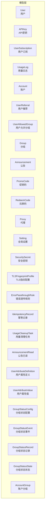

**图表来源**
- [backend/ent/schema/user.go](file://backend/ent/schema/user.go)
- [backend/ent/schema/api_key.go](file://backend/ent/schema/api_key.go)
- [backend/ent/schema/user_subscription.go](file://backend/ent/schema/user_subscription.go)
- [backend/ent/schema/usage_log.go](file://backend/ent/schema/usage_log.go)
- [backend/ent/schema/account.go](file://backend/ent/schema/account.go)
- [backend/ent/schema/user_referral.go](file://backend/ent/schema/user_referral.go)
- [backend/ent/schema/user_allowed_group.go](file://backend/ent/schema/user_allowed_group.go)
- [backend/ent/schema/group.go](file://backend/ent/schema/group.go)
- [backend/ent/schema/announcement.go](file://backend/ent/schema/announcement.go)
- [backend/ent/schema/promo_code.go](file://backend/ent/schema/promo_code.go)
- [backend/ent/schema/redeem_code.go](file://backend/ent/schema/redeem_code.go)
- [backend/ent/schema/proxy.go](file://backend/ent/schema/proxy.go)
- [backend/ent/schema/setting.go](file://backend/ent/schema/setting.go)
- [backend/ent/schema/security_secret.go](file://backend/ent/schema/security_secret.go)
- [backend/ent/schema/tls_fingerprint_profile.go](file://backend/ent/schema/tls_fingerprint_profile.go)
- [backend/ent/schema/error_passthrough_rule.go](file://backend/ent/schema/error_passthrough_rule.go)
- [backend/ent/schema/idempotency_record.go](file://backend/ent/schema/idempotency_record.go)
- [backend/ent/schema/usage_cleanup_task.go](file://backend/ent/schema/usage_cleanup_task.go)
- [backend/ent/schema/announcement_read.go](file://backend/ent/schema/announcement_read.go)
- [backend/ent/schema/user_attribute_definition.go](file://backend/ent/schema/user_attribute_definition.go)
- [backend/ent/schema/user_attribute_value.go](file://backend/ent/schema/user_attribute_value.go)
- [backend/ent/schema/group_status_config.go](file://backend/ent/schema/group_status_config.go)
- [backend/ent/schema/group_status_event.go](file://backend/ent/schema/group_status_event.go)
- [backend/ent/schema/group_status_record.go](file://backend/ent/schema/group_status_record.go)
- [backend/ent/schema/group_status_state.go](file://backend/ent/schema/group_status_state.go)
- [backend/ent/schema/account_group.go](file://backend/ent/schema/account_group.go)

**章节来源**
- [backend/ent/schema/user.go](file://backend/ent/schema/user.go)
- [backend/ent/schema/api_key.go](file://backend/ent/schema/api_key.go)
- [backend/ent/schema/user_subscription.go](file://backend/ent/schema/user_subscription.go)
- [backend/ent/schema/usage_log.go](file://backend/ent/schema/usage_log.go)
- [backend/ent/schema/account.go](file://backend/ent/schema/account.go)

## 核心组件
- 混合模型（Mixins）
  - 软删除混合模型：为实体提供逻辑删除能力，避免物理删除带来的数据不可恢复风险，常用于用户、API密钥、订阅、用量日志等需要审计或可恢复的实体。
  - 时间戳混合模型：统一注入创建与更新时间字段，确保所有实体具备一致的时间追踪能力。
- 实体关系
  - 用户(User)与账户(Account)：一对多或多对一映射，体现单个账户下可有多个用户或单用户归属单一账户的关系形态。
  - 用户(User)与API密钥(APIKey)：一对多，一个用户可拥有多个API密钥，便于权限隔离与资源管理。
  - 用户(User)与订阅(UserSubscription)：一对多，用户可拥有多个订阅周期或版本。
  - 用量日志(UsageLog)：记录用户请求上游服务产生的用量明细，通常与用户、API密钥、账户建立关联。
  - 公告(Announcement)与公告已读(AnnouncementRead)：一对多，记录用户对公告的阅读状态。
  - 分组(Group)与用户允许分组(UserAllowedGroup)：多对多，通过中间表控制用户访问分组的权限。
  - 推荐(UserReferral)：记录用户的邀请与被邀请关系。
  - 促销码(PromoCode)与兑换码(RedeemCode)：促销与兑换的闭环，支持营销活动与优惠发放。
  - 安全密钥(SecuritySecret)、TLS指纹(TLSFingerprintProfile)、错误透传规则(ErrorPassthroughRule)、幂等记录(IdempotencyRecord)、用量清理任务(UsageCleanupTask)等：作为支撑实体，保障安全、合规与运维能力。

**章节来源**
- [backend/ent/schema/mixins/soft_delete.go](file://backend/ent/schema/mixins/soft_delete.go)
- [backend/ent/schema/mixins/time.go](file://backend/ent/schema/mixins/time.go)
- [backend/ent/schema/user.go](file://backend/ent/schema/user.go)
- [backend/ent/schema/api_key.go](file://backend/ent/schema/api_key.go)
- [backend/ent/schema/user_subscription.go](file://backend/ent/schema/user_subscription.go)
- [backend/ent/schema/usage_log.go](file://backend/ent/schema/usage_log.go)
- [backend/ent/schema/account.go](file://backend/ent/schema/account.go)
- [backend/ent/schema/user_referral.go](file://backend/ent/schema/user_referral.go)
- [backend/ent/schema/user_allowed_group.go](file://backend/ent/schema/user_allowed_group.go)
- [backend/ent/schema/group.go](file://backend/ent/schema/group.go)
- [backend/ent/schema/announcement.go](file://backend/ent/schema/announcement.go)
- [backend/ent/schema/announcement_read.go](file://backend/ent/schema/announcement_read.go)
- [backend/ent/schema/promo_code.go](file://backend/ent/schema/promo_code.go)
- [backend/ent/schema/redeem_code.go](file://backend/ent/schema/redeem_code.go)
- [backend/ent/schema/proxy.go](file://backend/ent/schema/proxy.go)
- [backend/ent/schema/setting.go](file://backend/ent/schema/setting.go)
- [backend/ent/schema/security_secret.go](file://backend/ent/schema/security_secret.go)
- [backend/ent/schema/tls_fingerprint_profile.go](file://backend/ent/schema/tls_fingerprint_profile.go)
- [backend/ent/schema/error_passthrough_rule.go](file://backend/ent/schema/error_passthrough_rule.go)
- [backend/ent/schema/idempotency_record.go](file://backend/ent/schema/idempotency_record.go)
- [backend/ent/schema/usage_cleanup_task.go](file://backend/ent/schema/usage_cleanup_task.go)

## 架构总览
Ent ORM通过schema定义实体与关系，再由ent生成器输出强类型的客户端与查询器。混合模型（mixins）在schema中以组合方式引入通用行为，实现跨实体的代码复用与一致性。下图展示了核心实体与混合模型的交互关系：

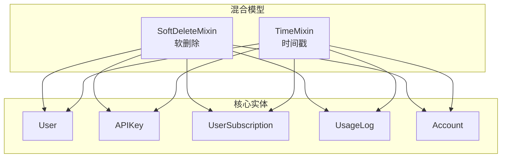

**图表来源**
- [backend/ent/schema/mixins/soft_delete.go](file://backend/ent/schema/mixins/soft_delete.go)
- [backend/ent/schema/mixins/time.go](file://backend/ent/schema/mixins/time.go)
- [backend/ent/schema/user.go](file://backend/ent/schema/user.go)
- [backend/ent/schema/api_key.go](file://backend/ent/schema/api_key.go)
- [backend/ent/schema/user_subscription.go](file://backend/ent/schema/user_subscription.go)
- [backend/ent/schema/usage_log.go](file://backend/ent/schema/usage_log.go)
- [backend/ent/schema/account.go](file://backend/ent/schema/account.go)

## 详细组件分析

### 混合模型：软删除与时间戳
- 设计理念
  - 软删除：通过布尔字段或专用列标记逻辑删除，保留历史数据以便审计与恢复；查询默认过滤未删除记录，必要时可通过显式条件查询回收站数据。
  - 时间戳：统一注入创建与更新时间，便于排序、统计与合规追踪。
- 使用方式
  - 在实体schema中嵌入混合模型，即可自动获得软删除与时间戳字段及默认查询行为。
- 适用范围
  - 用户、API密钥、订阅、用量日志等需要保留审计痕迹的实体优先启用软删除；所有实体均可启用时间戳以保证一致性。

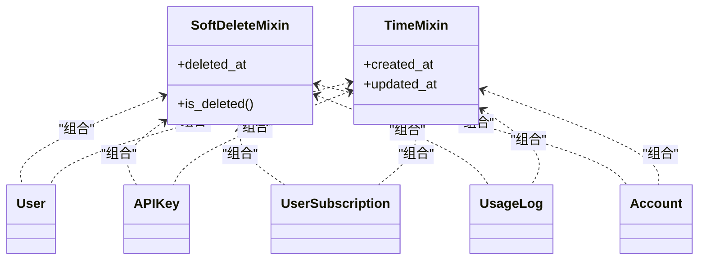

**图表来源**
- [backend/ent/schema/mixins/soft_delete.go](file://backend/ent/schema/mixins/soft_delete.go)
- [backend/ent/schema/mixins/time.go](file://backend/ent/schema/mixins/time.go)
- [backend/ent/schema/user.go](file://backend/ent/schema/user.go)
- [backend/ent/schema/api_key.go](file://backend/ent/schema/api_key.go)
- [backend/ent/schema/user_subscription.go](file://backend/ent/schema/user_subscription.go)
- [backend/ent/schema/usage_log.go](file://backend/ent/schema/usage_log.go)
- [backend/ent/schema/account.go](file://backend/ent/schema/account.go)

**章节来源**
- [backend/ent/schema/mixins/soft_delete.go](file://backend/ent/schema/mixins/soft_delete.go)
- [backend/ent/schema/mixins/time.go](file://backend/ent/schema/mixins/time.go)

### 用户(User)与API密钥(APIKey)
- 关系
  - 用户与API密钥为一对多，一个用户可拥有多个密钥，便于按用户维度进行配额与用量统计。
- 查询要点
  - 常见操作包括按用户查询其密钥列表、按密钥反查所属用户、以及基于密钥的鉴权与限流。
- 审计与安全
  - 结合软删除与时间戳，确保密钥生命周期可追溯；结合安全密钥与TLS指纹配置，提升通信安全性。

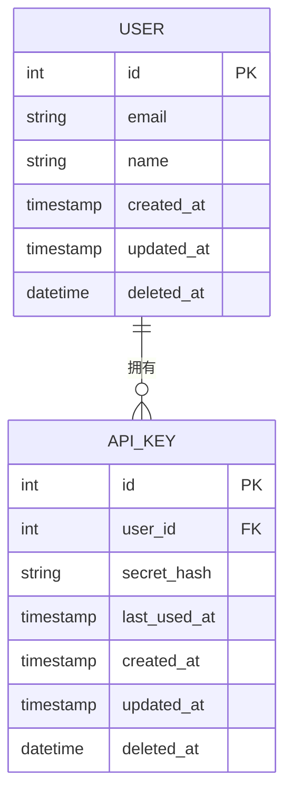

**图表来源**
- [backend/ent/schema/user.go](file://backend/ent/schema/user.go)
- [backend/ent/schema/api_key.go](file://backend/ent/schema/api_key.go)

**章节来源**
- [backend/ent/schema/user.go](file://backend/ent/schema/user.go)
- [backend/ent/schema/api_key.go](file://backend/ent/schema/api_key.go)

### 订阅(UserSubscription)与用量日志(UsageLog)
- 关系
  - 用户订阅与用量日志为一对多，订阅期内的每次请求都会产生一条用量记录，便于计费与配额统计。
- 字段与索引
  - 用量日志通常包含请求类型、模型名称、输入/输出token数、费用、上游响应时间等字段；为提高查询效率，建议在用户、API密钥、时间区间、请求类型等维度建立复合索引。
- 清理策略
  - 可通过用量清理任务定期归档或删除过期用量记录，降低存储压力。

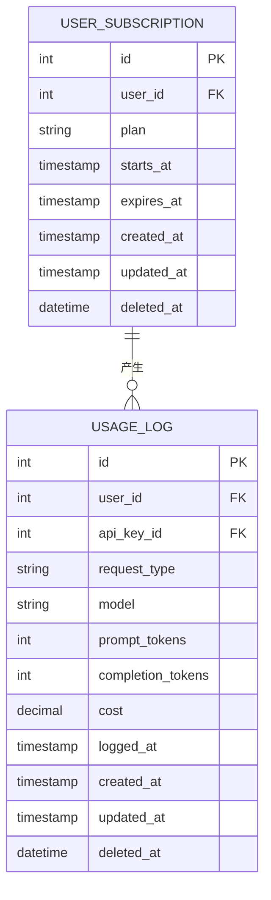

**图表来源**
- [backend/ent/schema/user_subscription.go](file://backend/ent/schema/user_subscription.go)
- [backend/ent/schema/usage_log.go](file://backend/ent/schema/usage_log.go)

**章节来源**
- [backend/ent/schema/user_subscription.go](file://backend/ent/schema/user_subscription.go)
- [backend/ent/schema/usage_log.go](file://backend/ent/schema/usage_log.go)

### 账户(Account)与用户(User)
- 关系
  - 账户与用户存在多种映射关系：一对一、一对多或多对一，具体取决于业务模型（例如单租户账户下多用户，或独立账户与单用户）。
- 权限与配额
  - 账户层面可设置全局配额、费率倍数、过期时间等，影响绑定用户与API密钥的可用性。
- 审计与合规
  - 结合软删除与时间戳，确保账户变更与用量可审计。

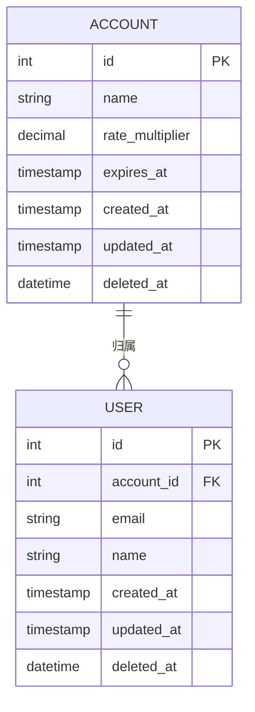

**图表来源**
- [backend/ent/schema/account.go](file://backend/ent/schema/account.go)
- [backend/ent/schema/user.go](file://backend/ent/schema/user.go)

**章节来源**
- [backend/ent/schema/account.go](file://backend/ent/schema/account.go)
- [backend/ent/schema/user.go](file://backend/ent/schema/user.go)

### 公告(Announcement)与公告已读(AnnouncementRead)
- 关系
  - 公告与公告已读为一对多，记录用户对公告的阅读状态，支持按用户聚合未读数量。
- 通知策略
  - 可结合公告类型与用户分组，实现定向推送与已读回执。

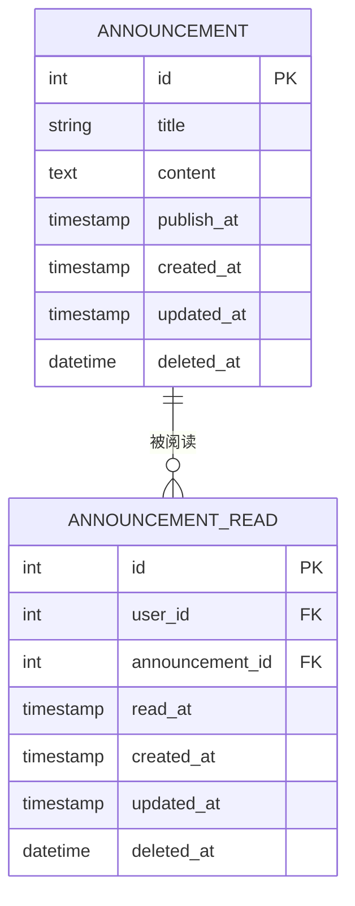

**图表来源**
- [backend/ent/schema/announcement.go](file://backend/ent/schema/announcement.go)
- [backend/ent/schema/announcement_read.go](file://backend/ent/schema/announcement_read.go)

**章节来源**
- [backend/ent/schema/announcement.go](file://backend/ent/schema/announcement.go)
- [backend/ent/schema/announcement_read.go](file://backend/ent/schema/announcement_read.go)

### 分组与用户允许分组(UserAllowedGroup)
- 关系
  - 分组与用户允许分组为多对多，通过中间表控制用户访问特定分组的权限。
- 应用场景
  - 将不同模型、渠道或定价策略封装在分组内，结合用户允许分组实现灵活的路由与计费策略。

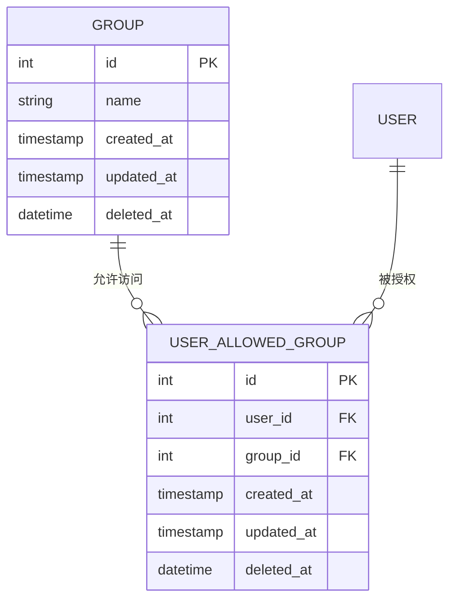

**图表来源**
- [backend/ent/schema/group.go](file://backend/ent/schema/group.go)
- [backend/ent/schema/user_allowed_group.go](file://backend/ent/schema/user_allowed_group.go)

**章节来源**
- [backend/ent/schema/group.go](file://backend/ent/schema/group.go)
- [backend/ent/schema/user_allowed_group.go](file://backend/ent/schema/user_allowed_group.go)

### 推荐(UserReferral)、促销码(PromoCode)与兑换码(RedeemCode)
- 关系
  - 推荐关系记录邀请者与被邀请者；促销码与兑换码形成优惠闭环，支持按用户维度发放与核销。
- 追踪与审计
  - 建议为相关实体启用软删除与时间戳，确保营销活动的可审计性。

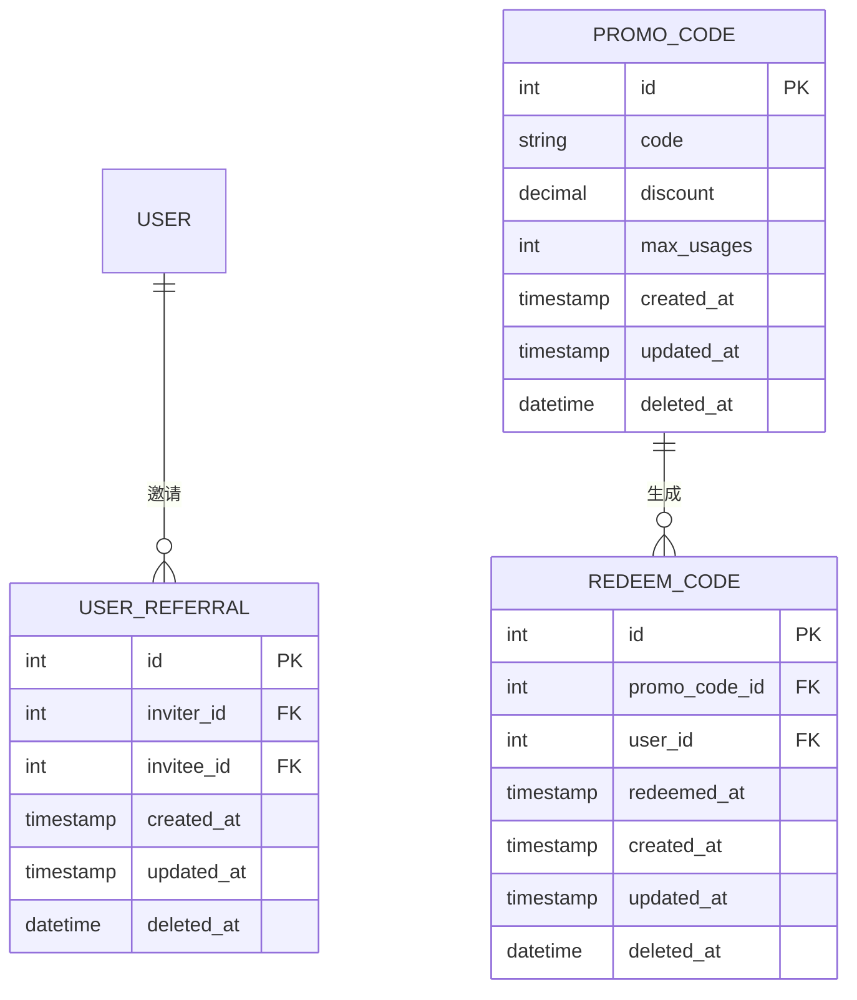

**图表来源**
- [backend/ent/schema/user_referral.go](file://backend/ent/schema/user_referral.go)
- [backend/ent/schema/promo_code.go](file://backend/ent/schema/promo_code.go)
- [backend/ent/schema/redeem_code.go](file://backend/ent/schema/redeem_code.go)

**章节来源**
- [backend/ent/schema/user_referral.go](file://backend/ent/schema/user_referral.go)
- [backend/ent/schema/promo_code.go](file://backend/ent/schema/promo_code.go)
- [backend/ent/schema/redeem_code.go](file://backend/ent/schema/redeem_code.go)

### 安全与合规支撑实体
- 安全密钥(SecuritySecret)、TLS指纹配置(TLSFingerprintProfile)、错误透传规则(ErrorPassthroughRule)、幂等记录(IdempotencyRecord)、用量清理任务(UsageCleanupTask)等实体，共同构成系统的安全与运维底座，确保通信安全、请求幂等与数据清理自动化。

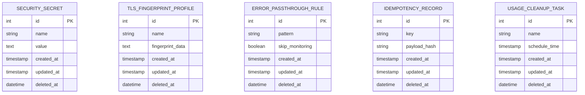

**图表来源**
- [backend/ent/schema/security_secret.go](file://backend/ent/schema/security_secret.go)
- [backend/ent/schema/tls_fingerprint_profile.go](file://backend/ent/schema/tls_fingerprint_profile.go)
- [backend/ent/schema/error_passthrough_rule.go](file://backend/ent/schema/error_passthrough_rule.go)
- [backend/ent/schema/idempotency_record.go](file://backend/ent/schema/idempotency_record.go)
- [backend/ent/schema/usage_cleanup_task.go](file://backend/ent/schema/usage_cleanup_task.go)

**章节来源**
- [backend/ent/schema/security_secret.go](file://backend/ent/schema/security_secret.go)
- [backend/ent/schema/tls_fingerprint_profile.go](file://backend/ent/schema/tls_fingerprint_profile.go)
- [backend/ent/schema/error_passthrough_rule.go](file://backend/ent/schema/error_passthrough_rule.go)
- [backend/ent/schema/idempotency_record.go](file://backend/ent/schema/idempotency_record.go)
- [backend/ent/schema/usage_cleanup_task.go](file://backend/ent/schema/usage_cleanup_task.go)

## 依赖分析
- 组件耦合
  - 混合模型与实体之间为组合关系，低耦合高内聚；实体间通过外键建立弱耦合关联，便于演进与替换。
- 外部依赖
  - Ent ORM生成器负责从schema到客户端的代码生成；数据库迁移脚本与Ent schema保持同步，确保结构一致性。
- 循环依赖
  - 通过中间表（如用户允许分组）与清晰的外键约束，避免直接循环引用。

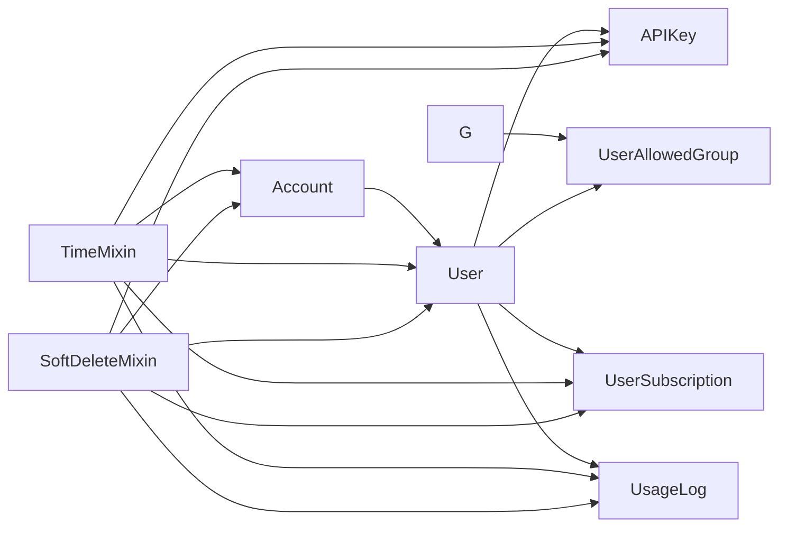

**图表来源**
- [backend/ent/schema/mixins/soft_delete.go](file://backend/ent/schema/mixins/soft_delete.go)
- [backend/ent/schema/mixins/time.go](file://backend/ent/schema/mixins/time.go)
- [backend/ent/schema/user.go](file://backend/ent/schema/user.go)
- [backend/ent/schema/api_key.go](file://backend/ent/schema/api_key.go)
- [backend/ent/schema/user_subscription.go](file://backend/ent/schema/user_subscription.go)
- [backend/ent/schema/usage_log.go](file://backend/ent/schema/usage_log.go)
- [backend/ent/schema/account.go](file://backend/ent/schema/account.go)
- [backend/ent/schema/user_allowed_group.go](file://backend/ent/schema/user_allowed_group.go)
- [backend/ent/schema/group.go](file://backend/ent/schema/group.go)

**章节来源**
- [backend/ent/schema/mixins/soft_delete.go](file://backend/ent/schema/mixins/soft_delete.go)
- [backend/ent/schema/mixins/time.go](file://backend/ent/schema/mixins/time.go)
- [backend/ent/schema/user.go](file://backend/ent/schema/user.go)
- [backend/ent/schema/api_key.go](file://backend/ent/schema/api_key.go)
- [backend/ent/schema/user_subscription.go](file://backend/ent/schema/user_subscription.go)
- [backend/ent/schema/usage_log.go](file://backend/ent/schema/usage_log.go)
- [backend/ent/schema/account.go](file://backend/ent/schema/account.go)
- [backend/ent/schema/user_allowed_group.go](file://backend/ent/schema/user_allowed_group.go)
- [backend/ent/schema/group.go](file://backend/ent/schema/group.go)

## 性能考虑
- 索引策略
  - 在高频查询字段（如用户ID、API密钥ID、时间区间、请求类型）上建立复合索引，减少扫描成本。
- 分区与归档
  - 用量日志可按时间分区，旧数据归档至冷存储，降低在线表规模。
- 批处理与清理
  - 用量清理任务定期执行，避免历史数据无限增长。
- 缓存与去重
  - 对热点查询结果进行缓存，结合幂等记录避免重复计算与写入。

## 故障排查指南
- 软删除导致的查询异常
  - 默认查询会过滤已删除记录，若出现“找不到记录”现象，请检查是否启用了软删除；必要时使用显式条件查询回收站数据。
- 外键约束冲突
  - 删除父实体前需清理子实体或启用级联删除/置空策略，避免违反外键约束。
- 时间戳不一致
  - 确认数据库时区与应用时区一致，避免创建/更新时间偏差。
- 密钥与配额问题
  - 检查API密钥状态、账户配额与订阅有效期，确保用量统计与计费准确。

## 结论
本数据模型以Ent ORM为核心，通过混合模型实现软删除与时间戳的跨实体复用，围绕用户、账户、API密钥、订阅与用量日志构建了清晰的核心关系，并辅以公告、促销、兑换、代理、安全与合规支撑实体，形成完整的企业级数据层。遵循统一的命名约定与设计规范，有助于提升可维护性与扩展性。

## 附录
- 命名约定与设计规范
  - 表名：采用复数形式，如users、api_keys、usage_logs，保持与实体集合语义一致。
  - 字段名：采用小写下划线命名，如created_at、updated_at、last_used_at，确保跨语言与工具链兼容。
  - 主键：统一使用自增整型id作为主键，便于序列化与索引优化。
  - 外键：采用实体名加_id的命名模式，如user_id、account_id，增强可读性。
  - 软删除：统一使用deleted_at字段，查询时默认过滤未删除记录。
  - 时间戳：统一使用created_at与updated_at，精确到秒或更高精度视数据库而定。
  - 索引：在高频过滤与排序字段上建立索引，必要时使用复合索引与部分索引。