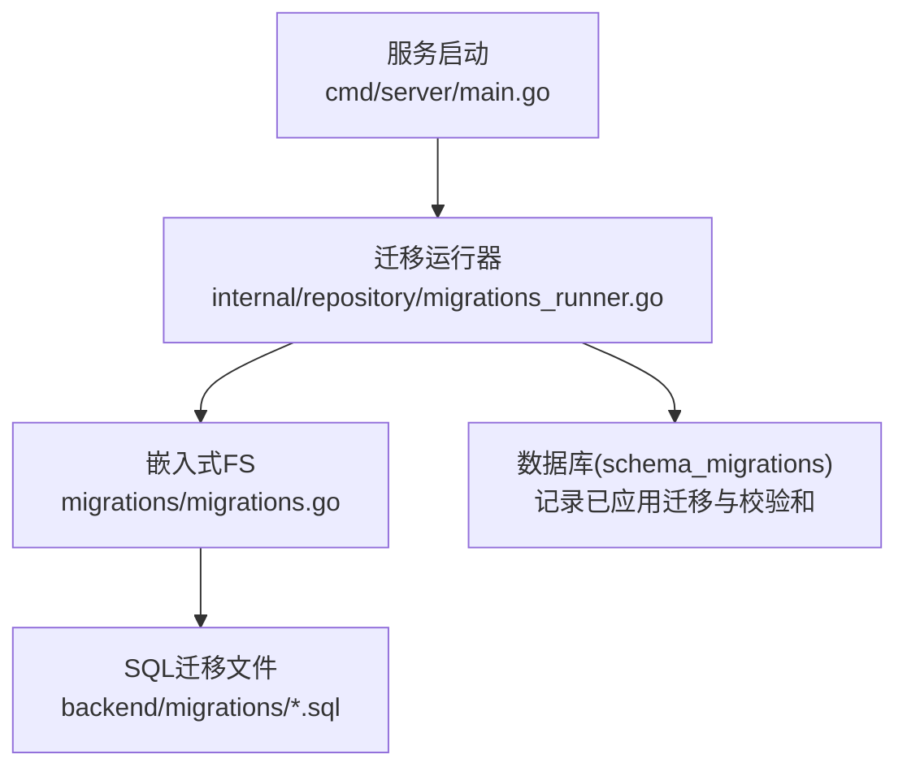
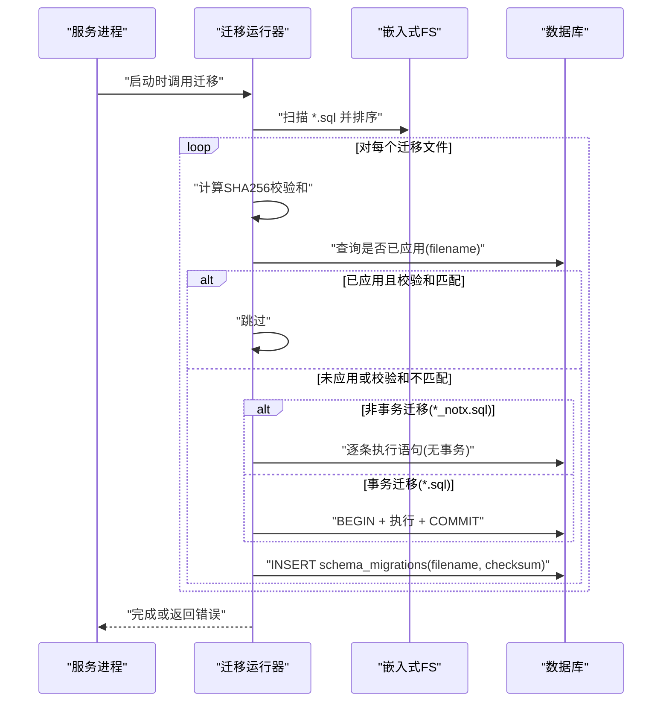
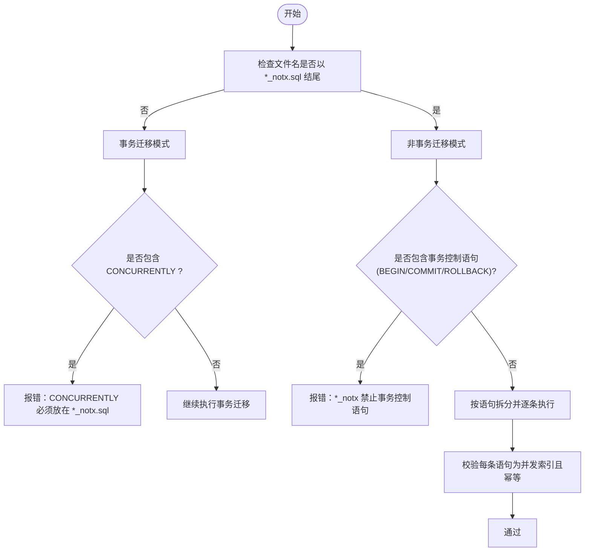
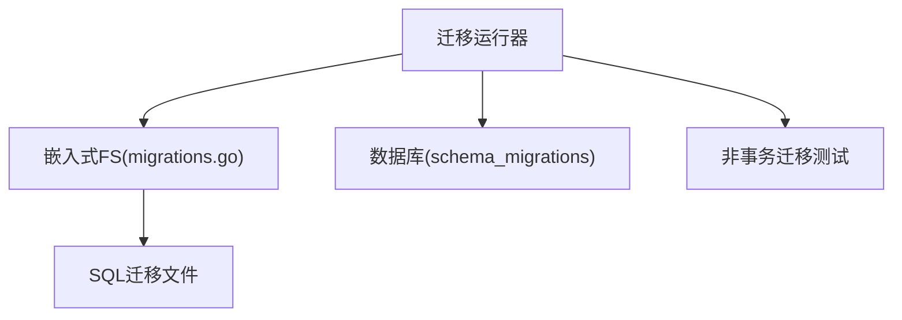

# 数据迁移管理

<cite>
**本文引用的文件**
- [backend/migrations/README.md](file://backend/migrations/README.md)
- [backend/migrations/migrations.go](file://backend/migrations/migrations.go)
- [backend/internal/repository/migrations_runner.go](file://backend/internal/repository/migrations_runner.go)
- [backend/internal/repository/migrations_runner_notx_test.go](file://backend/internal/repository/migrations_runner_notx_test.go)
- [backend/cmd/server/main.go](file://backend/cmd/server/main.go)
- [backend/go.mod](file://backend/go.mod)
- [Makefile](file://Makefile)
- [backend/migrations/001_init.sql](file://backend/migrations/001_init.sql)
- [backend/migrations/002_account_type_migration.sql](file://backend/migrations/002_account_type_migration.sql)
- [backend/migrations/003_subscription.sql](file://backend/migrations/003_subscription.sql)
- [backend/migrations/004_add_redeem_code_notes.sql](file://backend/migrations/004_add_redeem_code_notes.sql)
- [backend/migrations/005_schema_parity.sql](file://backend/migrations/005_schema_parity.sql)
- [backend/migrations/006_add_users_allowed_groups_compat.sql](file://backend/migrations/006_add_users_allowed_groups_compat.sql)
- [backend/migrations/006_fix_invalid_subscription_expires_at.sql](file://backend/migrations/006_fix_invalid_subscription_expires_at.sql)
- [backend/migrations/006b_guard_users_allowed_groups.sql](file://backend/migrations/006b_guard_users_allowed_groups.sql)
- [backend/migrations/007_add_user_allowed_groups.sql](file://backend/migrations/007_add_user_allowed_groups.sql)
- [backend/migrations/008_seed_default_group.sql](file://backend/migrations/008_seed_default_group.sql)
- [backend/migrations/009_fix_usage_logs_cache_columns.sql](file://backend/migrations/009_fix_usage_logs_cache_columns.sql)
- [backend/migrations/010_add_usage_logs_aggregated_indexes.sql](file://backend/migrations/010_add_usage_logs_aggregated_indexes.sql)
- [backend/migrations/011_remove_duplicate_unique_indexes.sql](file://backend/migrations/011_remove_duplicate_unique_indexes.sql)
- [backend/migrations/012_add_user_subscription_soft_delete.sql](file://backend/migrations/012_add_user_subscription_soft_delete.sql)
- [backend/migrations/013_log_orphan_allowed_groups.sql](file://backend/migrations/013_log_orphan_allowed_groups.sql)
- [backend/migrations/014_drop_legacy_allowed_groups.sql](file://backend/migrations/014_drop_legacy_allowed_groups.sql)
- [backend/migrations/015_fix_settings_unique_constraint.sql](file://backend/migrations/015_fix_settings_unique_constraint.sql)
- [backend/migrations/016_soft_delete_partial_unique_indexes.sql](file://backend/migrations/016_soft_delete_partial_unique_indexes.sql)
- [backend/migrations/018_user_attributes.sql](file://backend/migrations/018_user_attributes.sql)
- [backend/migrations/019_migrate_wechat_to_attributes.sql](file://backend/migrations/019_migrate_wechat_to_attributes.sql)
- [backend/migrations/020_add_temp_unschedulable.sql](file://backend/migrations/020_add_temp_unschedulable.sql)
- [backend/migrations/024_add_gemini_tier_id.sql](file://backend/migrations/024_add_gemini_tier_id.sql)
- [backend/migrations/026_ops_metrics_aggregation_tables.sql](file://backend/migrations/026_ops_metrics_aggregation_tables.sql)
- [backend/migrations/027_usage_billing_consistency.sql](file://backend/migrations/027_usage_billing_consistency.sql)
- [backend/migrations/028_add_account_notes.sql](file://backend/migrations/028_add_account_notes.sql)
- [backend/migrations/028_add_usage_logs_user_agent.sql](file://backend/migrations/028_add_usage_logs_user_agent.sql)
- [backend/migrations/028_group_image_pricing.sql](file://backend/migrations/028_group_image_pricing.sql)
- [backend/migrations/029_add_group_claude_code_restriction.sql](file://backend/migrations/029_add_group_claude_code_restriction.sql)
- [backend/migrations/029_usage_log_image_fields.sql](file://backend/migrations/029_usage_log_image_fields.sql)
- [backend/migrations/030_add_account_expires_at.sql](file://backend/migrations/030_add_account_expires_at.sql)
- [backend/migrations/031_add_ip_address.sql](file://backend/migrations/031_add_ip_address.sql)
- [backend/migrations/032_add_api_key_ip_restriction.sql](file://backend/migrations/032_add_api_key_ip_restriction.sql)
- [backend/migrations/033_add_promo_codes.sql](file://backend/migrations/033_add_promo_codes.sql)
- [backend/migrations/033_ops_monitoring_vnext.sql](file://backend/migrations/033_ops_monitoring_vnext.sql)
- [backend/migrations/034_ops_upstream_error_events.sql](file://backend/migrations/034_ops_upstream_error_events.sql)
- [backend/migrations/034_usage_dashboard_aggregation_tables.sql](file://backend/migrations/034_usage_dashboard_aggregation_tables.sql)
- [backend/migrations/035_usage_logs_partitioning.sql](file://backend/migrations/035_usage_logs_partitioning.sql)
- [backend/migrations/036_ops_error_logs_add_is_count_tokens.sql](file://backend/migrations/036_ops_error_logs_add_is_count_tokens.sql)
- [backend/migrations/036_scheduler_outbox.sql](file://backend/migrations/036_scheduler_outbox.sql)
- [backend/migrations/037_add_account_rate_multiplier.sql](file://backend/migrations/037_add_account_rate_multiplier.sql)
- [backend/migrations/037_ops_alert_silences.sql](file://backend/migrations/037_ops_alert_silences.sql)
- [backend/migrations/038_ops_errors_resolution_retry_results_and_standardize_classification.sql](file://backend/migrations/038_ops_errors_resolution_retry_results_and_standardize_classification.sql)
- [backend/migrations/039_ops_job_heartbeats_add_last_result.sql](file://backend/migrations/039_ops_job_heartbeats_add_last_result.sql)
- [backend/migrations/040_add_group_model_routing.sql](file://backend/migrations/040_add_group_model_routing.sql)
- [backend/migrations/041_add_model_routing_enabled.sql](file://backend/migrations/041_add_model_routing_enabled.sql)
- [backend/migrations/042_add_usage_cleanup_tasks.sql](file://backend/migrations/042_add_usage_cleanup_tasks.sql)
- [backend/migrations/042b_add_ops_system_metrics_switch_count.sql](file://backend/migrations/042b_add_ops_system_metrics_switch_count.sql)
- [backend/migrations/043_add_usage_cleanup_cancel_audit.sql](file://backend/migrations/043_add_usage_cleanup_cancel_audit.sql)
- [backend/migrations/043b_add_group_invalid_request_fallback.sql](file://backend/migrations/043b_add_group_invalid_request_fallback.sql)
- [backend/migrations/044_add_user_totp.sql](file://backend/migrations/044_add_user_totp.sql)
- [backend/migrations/044b_add_group_mcp_xml_inject.sql](file://backend/migrations/044b_add_group_mcp_xml_inject.sql)
- [backend/migrations/045_add_accounts_extra_index.sql](file://backend/migrations/045_add_accounts_extra_index.sql)
- [backend/migrations/045_add_announcements.sql](file://backend/migrations/045_add_announcements.sql)
- [backend/migrations/045_add_api_key_quota.sql](file://backend/migrations/045_add_api_key_quota.sql)
- [backend/migrations/046_add_sora_accounts.sql](file://backend/migrations/046_add_sora_accounts.sql)
- [backend/migrations/046_add_usage_log_reasoning_effort.sql](file://backend/migrations/046_add_usage_log_reasoning_effort.sql)
- [backend/migrations/046b_add_group_supported_model_scopes.sql](file://backend/migrations/046b_add_group_supported_model_scopes.sql)
- [backend/migrations/047_add_sora_pricing_and_media_type.sql](file://backend/migrations/047_add_sora_pricing_and_media_type.sql)
- [backend/migrations/047_add_user_group_rate_multipliers.sql](file://backend/migrations/047_add_user_group_rate_multipliers.sql)
- [backend/migrations/048_add_error_passthrough_rules.sql](file://backend/migrations/048_add_error_passthrough_rules.sql)
- [backend/migrations/049_unify_antigravity_model_mapping.sql](file://backend/migrations/049_unify_antigravity_model_mapping.sql)
- [backend/migrations/050_map_opus46_to_opus45.sql](file://backend/migrations/050_map_opus46_to_opus45.sql)
- [backend/migrations/051_migrate_opus45_to_opus46_thinking.sql](file://backend/migrations/051_migrate_opus45_to_opus46_thinking.sql)
- [backend/migrations/052_add_group_sort_order.sql](file://backend/migrations/052_add_group_sort_order.sql)
- [backend/migrations/052_migrate_upstream_to_apikey.sql](file://backend/migrations/052_migrate_upstream_to_apikey.sql)
- [backend/migrations/053_add_referral_system.sql](file://backend/migrations/053_add_referral_system.sql)
- [backend/migrations/053_add_security_secrets.sql](file://backend/migrations/053_add_security_secrets.sql)
- [backend/migrations/053_add_skip_monitoring_to_error_passthrough.sql](file://backend/migrations/053_add_skip_monitoring_to_error_passthrough.sql)
- [backend/migrations/054_drop_legacy_cache_columns.sql](file://backend/migrations/054_drop_legacy_cache_columns.sql)
- [backend/migrations/054_ops_system_logs.sql](file://backend/migrations/054_ops_system_logs.sql)
- [backend/migrations/055_add_cache_ttl_overridden.sql](file://backend/migrations/055_add_cache_ttl_overridden.sql)
- [backend/migrations/056_add_api_key_last_used_at.sql](file://backend/migrations/056_add_api_key_last_used_at.sql)
- [backend/migrations/057_add_idempotency_records.sql](file://backend/migrations/057_add_idempotency_records.sql)
- [backend/migrations/058_add_sonnet46_to_model_mapping.sql](file://backend/migrations/058_add_sonnet46_to_model_mapping.sql)
- [backend/migrations/059_add_gemini31_pro_to_model_mapping.sql](file://backend/migrations/059_add_gemini31_pro_to_model_mapping.sql)
- [backend/migrations/060_add_gemini31_flash_image_to_model_mapping.sql](file://backend/migrations/060_add_gemini31_flash_image_to_model_mapping.sql)
- [backend/migrations/060_add_usage_log_openai_ws_mode.sql](file://backend/migrations/060_add_usage_log_openai_ws_mode.sql)
- [backend/migrations/061_add_usage_log_request_type.sql](file://backend/migrations/061_add_usage_log_request_type.sql)
- [backend/migrations/062_add_usage_cleanup_composite_indexes_notx.sql](file://backend/migrations/062_add_usage_cleanup_composite_indexes_notx.sql)
- [backend/migrations/063_add_sora_client_tables.sql](file://backend/migrations/063_add_sora_client_tables.sql)
- [backend/migrations/064_add_api_key_rate_limits.sql](file://backend/migrations/064_add_api_key_rate_limits.sql)
- [backend/migrations/065_add_search_trgm_indexes.sql](file://backend/migrations/065_add_search_trgm_indexes.sql)
- [backend/migrations/066_add_scheduled_test_tables.sql](file://backend/migrations/066_add_scheduled_test_tables.sql)
- [backend/migrations/067_add_account_load_factor.sql](file://backend/migrations/067_add_account_load_factor.sql)
- [backend/migrations/068_add_announcement_notify_mode.sql](file://backend/migrations/068_add_announcement_notify_mode.sql)
- [backend/migrations/069_add_group_messages_dispatch.sql](file://backend/migrations/069_add_group_messages_dispatch.sql)
- [backend/migrations/070_add_scheduled_test_auto_recover.sql](file://backend/migrations/070_add_scheduled_test_auto_recover.sql)
- [backend/migrations/070_add_usage_log_service_tier.sql](file://backend/migrations/070_add_usage_log_service_tier.sql)
- [backend/migrations/071_add_gemini25_flash_image_to_model_mapping.sql](file://backend/migrations/071_add_gemini25_flash_image_to_model_mapping.sql)
- [backend/migrations/071_add_usage_billing_dedup.sql](file://backend/migrations/071_add_usage_billing_dedup.sql)
- [backend/migrations/072_add_usage_billing_dedup_created_at_brin_notx.sql](file://backend/migrations/072_add_usage_billing_dedup_created_at_brin_notx.sql)
- [backend/migrations/073_add_usage_billing_dedup_archive.sql](file://backend/migrations/073_add_usage_billing_dedup_archive.sql)
- [backend/migrations/074_add_usage_log_endpoints.sql](file://backend/migrations/074_add_usage_log_endpoints.sql)
- [backend/migrations/075_add_usage_log_upstream_model.sql](file://backend/migrations/075_add_usage_log_upstream_model.sql)
- [backend/migrations/075_map_haiku45_to_sonnet46.sql](file://backend/migrations/075_map_haiku45_to_sonnet46.sql)
- [backend/migrations/076_add_usage_log_upstream_model_index_notx.sql](file://backend/migrations/076_add_usage_log_upstream_model_index_notx.sql)
- [backend/migrations/077_add_usage_log_requested_model.sql](file://backend/migrations/077_add_usage_log_requested_model.sql)
- [backend/migrations/078_add_usage_log_requested_model_index_notx.sql](file://backend/migrations/078_add_usage_log_requested_model_index_notx.sql)
- [backend/migrations/079_ops_error_logs_add_endpoint_fields.sql](file://backend/migrations/079_ops_error_logs_add_endpoint_fields.sql)
- [backend/migrations/080_create_tls_fingerprint_profiles.sql](file://backend/migrations/080_create_tls_fingerprint_profiles.sql)
- [backend/migrations/081_add_group_account_filter.sql](file://backend/migrations/081_add_group_account_filter.sql)
- [backend/migrations/081_create_channels.sql](file://backend/migrations/081_create_channels.sql)
- [backend/migrations/082_refactor_channel_pricing.sql](file://backend/migrations/082_refactor_channel_pricing.sql)
- [backend/migrations/083_channel_model_mapping.sql](file://backend/migrations/083_channel_model_mapping.sql)
- [backend/migrations/084_channel_billing_model_source.sql](file://backend/migrations/084_channel_billing_model_source.sql)
- [backend/migrations/085_channel_restrict_and_per_request_price.sql](file://backend/migrations/085_channel_restrict_and_per_request_price.sql)
- [backend/migrations/086_channel_platform_pricing.sql](file://backend/migrations/086_channel_platform_pricing.sql)
- [backend/migrations/087_usage_log_billing_mode.sql](file://backend/migrations/087_usage_log_billing_mode.sql)
- [backend/migrations/088_channel_billing_model_source_channel_mapped.sql](file://backend/migrations/088_channel_billing_model_source_channel_mapped.sql)
- [backend/migrations/089_usage_log_image_output_tokens.sql](file://backend/migrations/089_usage_log_image_output_tokens.sql)
- [backend/migrations/090_drop_sora.sql](file://backend/migrations/090_drop_sora.sql)
- [backend/migrations/091_add_group_status_tables.sql](file://backend/migrations/091_add_group_status_tables.sql)
- [backend/migrations/144_add_opus48_to_model_mapping.sql](file://backend/migrations/144_add_opus48_to_model_mapping.sql)
</cite>

## 目录
1. [简介](#简介)
2. [项目结构](#项目结构)
3. [核心组件](#核心组件)
4. [架构总览](#架构总览)
5. [详细组件分析](#详细组件分析)
6. [依赖关系分析](#依赖关系分析)
7. [性能考量](#性能考量)
8. [故障排查指南](#故障排查指南)
9. [结论](#结论)
10. [附录](#附录)

## 简介
本文件系统化阐述 Sub2API 的数据库迁移策略与版本控制实践，明确迁移脚本的命名规范、版本号管理、创建与执行流程、回滚策略、历史演进、最佳实践与故障处理方案。项目采用自研 SQL 迁移运行器与嵌入式迁移文件，结合 SHA256 校验与幂等约束，确保跨环境一致性与可审计性。

## 项目结构
- 迁移脚本位于 backend/migrations 目录，采用“零填充编号 + 下划线描述”的命名方式，按顺序执行。
- 迁移运行器位于 backend/internal/repository/migrations_runner.go，负责扫描、校验、执行与记录迁移。
- 迁移文件通过 backend/migrations/migrations.go 嵌入至二进制，实现部署即可用。
- Makefile 提供迁移命令入口；服务启动时自动执行迁移。

图表来源
- [backend/cmd/server/main.go](file://backend/cmd/server/main.go)
- [backend/internal/repository/migrations_runner.go](file://backend/internal/repository/migrations_runner.go)
- [backend/migrations/migrations.go](file://backend/migrations/migrations.go)

章节来源
- [backend/migrations/README.md](file://backend/migrations/README.md)
- [backend/migrations/migrations.go](file://backend/migrations/migrations.go)
- [backend/internal/repository/migrations_runner.go](file://backend/internal/repository/migrations_runner.go)
- [Makefile](file://Makefile)

## 核心组件
- 嵌入式迁移文件系统：通过 go:embed 将 migrations/*.sql 嵌入，确保部署一致性与可追溯性。
- 迁移运行器：扫描迁移文件、计算 SHA256 校验和、按文件名排序执行、记录执行结果。
- 迁移记录表 schema_migrations：持久化 filename 与 checksum，保障不可变性与一致性。
- 并发索引迁移支持：以 *_notx.sql 命名，拆分语句非事务执行，强制幂等语法。

章节来源
- [backend/migrations/migrations.go](file://backend/migrations/migrations.go)
- [backend/internal/repository/migrations_runner.go](file://backend/internal/repository/migrations_runner.go)
- [backend/migrations/README.md](file://backend/migrations/README.md)

## 架构总览
迁移生命周期从服务启动触发，运行器加载嵌入式迁移文件，校验并执行，最终记录到 schema_migrations 表。对于并发索引场景，采用非事务模式执行，确保安全与幂等。

图表来源
- [backend/internal/repository/migrations_runner.go](file://backend/internal/repository/migrations_runner.go)
- [backend/migrations/migrations.go](file://backend/migrations/migrations.go)

## 详细组件分析

### 命名规范与版本号管理
- 命名格式：NNN_description.sql，其中 NNN 为零填充序号，描述使用 snake_case。
- 版本号管理：严格递增，不得回退、重排或删除；新增迁移必须使用下一个序号。
- 并发索引迁移：使用 *_notx.sql 后缀，仅允许并发索引语句，且必须幂等。

章节来源
- [backend/migrations/README.md](file://backend/migrations/README.md)

### 迁移脚本结构与执行模型
- 事务迁移（*.sql）：整文件在单个事务中执行，保证原子性。
- 非事务迁移（*_notx.sql）：按语句拆分执行，禁止事务控制语句，仅限并发索引。
- 幂等性：推荐使用 IF NOT EXISTS / IF EXISTS，确保重复执行安全。

章节来源
- [backend/migrations/README.md](file://backend/migrations/README.md)
- [backend/internal/repository/migrations_runner.go](file://backend/internal/repository/migrations_runner.go)

### 校验与不可变性
- 每次启动检查 schema_migrations 是否已记录 filename 与 checksum。
- 若迁移已应用但文件内容变化，将触发校验和不匹配错误，防止破坏一致性。
- 存在兼容规则以处理历史误改场景，其余情况需新建迁移而非修改既有文件。

章节来源
- [backend/internal/repository/migrations_runner.go](file://backend/internal/repository/migrations_runner.go)

### 并发索引迁移的验证逻辑
- 校验 *_notx.sql 是否包含 BEGIN/COMMIT/ROLLBACK 等事务控制语句。
- 校验是否仅包含并发索引语句，且使用幂等语法。
- 不允许在 *_notx.sql 中混入非并发语句。

图表来源
- [backend/internal/repository/migrations_runner.go](file://backend/internal/repository/migrations_runner.go)
- [backend/internal/repository/migrations_runner_notx_test.go](file://backend/internal/repository/migrations_runner_notx_test.go)

章节来源
- [backend/internal/repository/migrations_runner.go](file://backend/internal/repository/migrations_runner.go)
- [backend/internal/repository/migrations_runner_notx_test.go](file://backend/internal/repository/migrations_runner_notx_test.go)

### 创建、执行与回滚流程
- 创建新迁移：使用下一个序号生成 NNN_description.sql，编写前向迁移 SQL。
- 执行迁移：通过 Makefile 提供的命令应用；运行器按序执行并记录。
- 回滚策略：运行器不解析 Down 脚本，不提供自动回滚。若需回滚，应新增反向迁移文件进行修正。

章节来源
- [backend/migrations/README.md](file://backend/migrations/README.md)
- [Makefile](file://Makefile)

### 迁移历史演进（示例）
以下为从初始版本到较新版本的部分迁移列表，展示演进路径与功能扩展：

- 初始版本与基础表
  - 001_init.sql：初始化核心表结构
  - 002_account_type_migration.sql：账户类型迁移
  - 003_subscription.sql：订阅相关迁移
  - 004_add_redeem_code_notes.sql：兑换码备注字段
  - 005_schema_parity.sql：模式一致性调整
  - 006_* 系列：用户允许组兼容与修复
  - 007_add_user_allowed_groups.sql：新增用户允许组
  - 008_seed_default_group.sql：默认组种子数据
  - 009~011：使用日志缓存列修复与重复唯一索引清理
  - 012~016：软删除与部分唯一索引优化
  - 018~020：用户属性与临时调度相关迁移
  - 024~033：Gemini 等模型映射与运营监控
  - 034~045：仪表板聚合、分区、配额与公告
  - 046~057：Sora 账户、错误透传规则、幂等记录
  - 058~071：模型映射、使用计费去重与索引优化
  - 072~091：归档、TLS 指纹、通道与群组状态
  - 090~144：后续持续扩展与映射完善

章节来源
- [backend/migrations/001_init.sql](file://backend/migrations/001_init.sql)
- [backend/migrations/002_account_type_migration.sql](file://backend/migrations/002_account_type_migration.sql)
- [backend/migrations/003_subscription.sql](file://backend/migrations/003_subscription.sql)
- [backend/migrations/004_add_redeem_code_notes.sql](file://backend/migrations/004_add_redeem_code_notes.sql)
- [backend/migrations/005_schema_parity.sql](file://backend/migrations/005_schema_parity.sql)
- [backend/migrations/006_add_users_allowed_groups_compat.sql](file://backend/migrations/006_add_users_allowed_groups_compat.sql)
- [backend/migrations/006_fix_invalid_subscription_expires_at.sql](file://backend/migrations/006_fix_invalid_subscription_expires_at.sql)
- [backend/migrations/006b_guard_users_allowed_groups.sql](file://backend/migrations/006b_guard_users_allowed_groups.sql)
- [backend/migrations/007_add_user_allowed_groups.sql](file://backend/migrations/007_add_user_allowed_groups.sql)
- [backend/migrations/008_seed_default_group.sql](file://backend/migrations/008_seed_default_group.sql)
- [backend/migrations/009_fix_usage_logs_cache_columns.sql](file://backend/migrations/009_fix_usage_logs_cache_columns.sql)
- [backend/migrations/010_add_usage_logs_aggregated_indexes.sql](file://backend/migrations/010_add_usage_logs_aggregated_indexes.sql)
- [backend/migrations/011_remove_duplicate_unique_indexes.sql](file://backend/migrations/011_remove_duplicate_unique_indexes.sql)
- [backend/migrations/012_add_user_subscription_soft_delete.sql](file://backend/migrations/012_add_user_subscription_soft_delete.sql)
- [backend/migrations/013_log_orphan_allowed_groups.sql](file://backend/migrations/013_log_orphan_allowed_groups.sql)
- [backend/migrations/014_drop_legacy_allowed_groups.sql](file://backend/migrations/014_drop_legacy_allowed_groups.sql)
- [backend/migrations/015_fix_settings_unique_constraint.sql](file://backend/migrations/015_fix_settings_unique_constraint.sql)
- [backend/migrations/016_soft_delete_partial_unique_indexes.sql](file://backend/migrations/016_soft_delete_partial_unique_indexes.sql)
- [backend/migrations/018_user_attributes.sql](file://backend/migrations/018_user_attributes.sql)
- [backend/migrations/019_migrate_wechat_to_attributes.sql](file://backend/migrations/019_migrate_wechat_to_attributes.sql)
- [backend/migrations/020_add_temp_unschedulable.sql](file://backend/migrations/020_add_temp_unschedulable.sql)
- [backend/migrations/024_add_gemini_tier_id.sql](file://backend/migrations/024_add_gemini_tier_id.sql)
- [backend/migrations/026_ops_metrics_aggregation_tables.sql](file://backend/migrations/026_ops_metrics_aggregation_tables.sql)
- [backend/migrations/027_usage_billing_consistency.sql](file://backend/migrations/027_usage_billing_consistency.sql)
- [backend/migrations/028_add_account_notes.sql](file://backend/migrations/028_add_account_notes.sql)
- [backend/migrations/028_add_usage_logs_user_agent.sql](file://backend/migrations/028_add_usage_logs_user_agent.sql)
- [backend/migrations/028_group_image_pricing.sql](file://backend/migrations/028_group_image_pricing.sql)
- [backend/migrations/029_add_group_claude_code_restriction.sql](file://backend/migrations/029_add_group_claude_code_restriction.sql)
- [backend/migrations/029_usage_log_image_fields.sql](file://backend/migrations/029_usage_log_image_fields.sql)
- [backend/migrations/030_add_account_expires_at.sql](file://backend/migrations/030_add_account_expires_at.sql)
- [backend/migrations/031_add_ip_address.sql](file://backend/migrations/031_add_ip_address.sql)
- [backend/migrations/032_add_api_key_ip_restriction.sql](file://backend/migrations/032_add_api_key_ip_restriction.sql)
- [backend/migrations/033_add_promo_codes.sql](file://backend/migrations/033_add_promo_codes.sql)
- [backend/migrations/033_ops_monitoring_vnext.sql](file://backend/migrations/033_ops_monitoring_vnext.sql)
- [backend/migrations/034_ops_upstream_error_events.sql](file://backend/migrations/034_ops_upstream_error_events.sql)
- [backend/migrations/034_usage_dashboard_aggregation_tables.sql](file://backend/migrations/034_usage_dashboard_aggregation_tables.sql)
- [backend/migrations/035_usage_logs_partitioning.sql](file://backend/migrations/035_usage_logs_partitioning.sql)
- [backend/migrations/036_ops_error_logs_add_is_count_tokens.sql](file://backend/migrations/036_ops_error_logs_add_is_count_tokens.sql)
- [backend/migrations/036_scheduler_outbox.sql](file://backend/migrations/036_scheduler_outbox.sql)
- [backend/migrations/037_add_account_rate_multiplier.sql](file://backend/migrations/037_add_account_rate_multiplier.sql)
- [backend/migrations/037_ops_alert_silences.sql](file://backend/migrations/037_ops_alert_silences.sql)
- [backend/migrations/038_ops_errors_resolution_retry_results_and_standardize_classification.sql](file://backend/migrations/038_ops_errors_resolution_retry_results_and_standardize_classification.sql)
- [backend/migrations/039_ops_job_heartbeats_add_last_result.sql](file://backend/migrations/039_ops_job_heartbeats_add_last_result.sql)
- [backend/migrations/040_add_group_model_routing.sql](file://backend/migrations/040_add_group_model_routing.sql)
- [backend/migrations/041_add_model_routing_enabled.sql](file://backend/migrations/041_add_model_routing_enabled.sql)
- [backend/migrations/042_add_usage_cleanup_tasks.sql](file://backend/migrations/042_add_usage_cleanup_tasks.sql)
- [backend/migrations/042b_add_ops_system_metrics_switch_count.sql](file://backend/migrations/042b_add_ops_system_metrics_switch_count.sql)
- [backend/migrations/043_add_usage_cleanup_cancel_audit.sql](file://backend/migrations/043_add_usage_cleanup_cancel_audit.sql)
- [backend/migrations/043b_add_group_invalid_request_fallback.sql](file://backend/migrations/043b_add_group_invalid_request_fallback.sql)
- [backend/migrations/044_add_user_totp.sql](file://backend/migrations/044_add_user_totp.sql)
- [backend/migrations/044b_add_group_mcp_xml_inject.sql](file://backend/migrations/044b_add_group_mcp_xml_inject.sql)
- [backend/migrations/045_add_accounts_extra_index.sql](file://backend/migrations/045_add_accounts_extra_index.sql)
- [backend/migrations/045_add_announcements.sql](file://backend/migrations/045_add_announcements.sql)
- [backend/migrations/045_add_api_key_quota.sql](file://backend/migrations/045_add_api_key_quota.sql)
- [backend/migrations/046_add_sora_accounts.sql](file://backend/migrations/046_add_sora_accounts.sql)
- [backend/migrations/046_add_usage_log_reasoning_effort.sql](file://backend/migrations/046_add_usage_log_reasoning_effort.sql)
- [backend/migrations/046b_add_group_supported_model_scopes.sql](file://backend/migrations/046b_add_group_supported_model_scopes.sql)
- [backend/migrations/047_add_sora_pricing_and_media_type.sql](file://backend/migrations/047_add_sora_pricing_and_media_type.sql)
- [backend/migrations/047_add_user_group_rate_multipliers.sql](file://backend/migrations/047_add_user_group_rate_multipliers.sql)
- [backend/migrations/048_add_error_passthrough_rules.sql](file://backend/migrations/048_add_error_passthrough_rules.sql)
- [backend/migrations/049_unify_antigravity_model_mapping.sql](file://backend/migrations/049_unify_antigravity_model_mapping.sql)
- [backend/migrations/050_map_opus46_to_opus45.sql](file://backend/migrations/050_map_opus46_to_opus45.sql)
- [backend/migrations/051_migrate_opus45_to_opus46_thinking.sql](file://backend/migrations/051_migrate_opus45_to_opus46_thinking.sql)
- [backend/migrations/052_add_group_sort_order.sql](file://backend/migrations/052_add_group_sort_order.sql)
- [backend/migrations/052_migrate_upstream_to_apikey.sql](file://backend/migrations/052_migrate_upstream_to_apikey.sql)
- [backend/migrations/053_add_referral_system.sql](file://backend/migrations/053_add_referral_system.sql)
- [backend/migrations/053_add_security_secrets.sql](file://backend/migrations/053_add_security_secrets.sql)
- [backend/migrations/053_add_skip_monitoring_to_error_passthrough.sql](file://backend/migrations/053_add_skip_monitoring_to_error_passthrough.sql)
- [backend/migrations/054_drop_legacy_cache_columns.sql](file://backend/migrations/054_drop_legacy_cache_columns.sql)
- [backend/migrations/054_ops_system_logs.sql](file://backend/migrations/054_ops_system_logs.sql)
- [backend/migrations/055_add_cache_ttl_overridden.sql](file://backend/migrations/055_add_cache_ttl_overridden.sql)
- [backend/migrations/056_add_api_key_last_used_at.sql](file://backend/migrations/056_add_api_key_last_used_at.sql)
- [backend/migrations/057_add_idempotency_records.sql](file://backend/migrations/057_add_idempotency_records.sql)
- [backend/migrations/058_add_sonnet46_to_model_mapping.sql](file://backend/migrations/058_add_sonnet46_to_model_mapping.sql)
- [backend/migrations/059_add_gemini31_pro_to_model_mapping.sql](file://backend/migrations/059_add_gemini31_pro_to_model_mapping.sql)
- [backend/migrations/060_add_gemini31_flash_image_to_model_mapping.sql](file://backend/migrations/060_add_gemini31_flash_image_to_model_mapping.sql)
- [backend/migrations/060_add_usage_log_openai_ws_mode.sql](file://backend/migrations/060_add_usage_log_openai_ws_mode.sql)
- [backend/migrations/061_add_usage_log_request_type.sql](file://backend/migrations/061_add_usage_log_request_type.sql)
- [backend/migrations/062_add_usage_cleanup_composite_indexes_notx.sql](file://backend/migrations/062_add_usage_cleanup_composite_indexes_notx.sql)
- [backend/migrations/063_add_sora_client_tables.sql](file://backend/migrations/063_add_sora_client_tables.sql)
- [backend/migrations/064_add_api_key_rate_limits.sql](file://backend/migrations/064_add_api_key_rate_limits.sql)
- [backend/migrations/065_add_search_trgm_indexes.sql](file://backend/migrations/065_add_search_trgm_indexes.sql)
- [backend/migrations/066_add_scheduled_test_tables.sql](file://backend/migrations/066_add_scheduled_test_tables.sql)
- [backend/migrations/067_add_account_load_factor.sql](file://backend/migrations/067_add_account_load_factor.sql)
- [backend/migrations/068_add_announcement_notify_mode.sql](file://backend/migrations/068_add_announcement_notify_mode.sql)
- [backend/migrations/069_add_group_messages_dispatch.sql](file://backend/migrations/069_add_group_messages_dispatch.sql)
- [backend/migrations/070_add_scheduled_test_auto_recover.sql](file://backend/migrations/070_add_scheduled_test_auto_recover.sql)
- [backend/migrations/070_add_usage_log_service_tier.sql](file://backend/migrations/070_add_usage_log_service_tier.sql)
- [backend/migrations/071_add_gemini25_flash_image_to_model_mapping.sql](file://backend/migrations/071_add_gemini25_flash_image_to_model_mapping.sql)
- [backend/migrations/071_add_usage_billing_dedup.sql](file://backend/migrations/071_add_usage_billing_dedup.sql)
- [backend/migrations/072_add_usage_billing_dedup_created_at_brin_notx.sql](file://backend/migrations/072_add_usage_billing_dedup_created_at_brin_notx.sql)
- [backend/migrations/073_add_usage_billing_dedup_archive.sql](file://backend/migrations/073_add_usage_billing_dedup_archive.sql)
- [backend/migrations/074_add_usage_log_endpoints.sql](file://backend/migrations/074_add_usage_log_endpoints.sql)
- [backend/migrations/075_add_usage_log_upstream_model.sql](file://backend/migrations/075_add_usage_log_upstream_model.sql)
- [backend/migrations/075_map_haiku45_to_sonnet46.sql](file://backend/migrations/075_map_haiku45_to_sonnet46.sql)
- [backend/migrations/076_add_usage_log_upstream_model_index_notx.sql](file://backend/migrations/076_add_usage_log_upstream_model_index_notx.sql)
- [backend/migrations/077_add_usage_log_requested_model.sql](file://backend/migrations/077_add_usage_log_requested_model.sql)
- [backend/migrations/078_add_usage_log_requested_model_index_notx.sql](file://backend/migrations/078_add_usage_log_requested_model_index_notx.sql)
- [backend/migrations/079_ops_error_logs_add_endpoint_fields.sql](file://backend/migrations/079_ops_error_logs_add_endpoint_fields.sql)
- [backend/migrations/080_create_tls_fingerprint_profiles.sql](file://backend/migrations/080_create_tls_fingerprint_profiles.sql)
- [backend/migrations/081_add_group_account_filter.sql](file://backend/migrations/081_add_group_account_filter.sql)
- [backend/migrations/081_create_channels.sql](file://backend/migrations/081_create_channels.sql)
- [backend/migrations/082_refactor_channel_pricing.sql](file://backend/migrations/082_refactor_channel_pricing.sql)
- [backend/migrations/083_channel_model_mapping.sql](file://backend/migrations/083_channel_model_mapping.sql)
- [backend/migrations/084_channel_billing_model_source.sql](file://backend/migrations/084_channel_billing_model_source.sql)
- [backend/migrations/085_channel_restrict_and_per_request_price.sql](file://backend/migrations/085_channel_restrict_and_per_request_price.sql)
- [backend/migrations/086_channel_platform_pricing.sql](file://backend/migrations/086_channel_platform_pricing.sql)
- [backend/migrations/087_usage_log_billing_mode.sql](file://backend/migrations/087_usage_log_billing_mode.sql)
- [backend/migrations/088_channel_billing_model_source_channel_mapped.sql](file://backend/migrations/088_channel_billing_model_source_channel_mapped.sql)
- [backend/migrations/089_usage_log_image_output_tokens.sql](file://backend/migrations/089_usage_log_image_output_tokens.sql)
- [backend/migrations/090_drop_sora.sql](file://backend/migrations/090_drop_sora.sql)
- [backend/migrations/091_add_group_status_tables.sql](file://backend/migrations/091_add_group_status_tables.sql)
- [backend/migrations/144_add_opus48_to_model_mapping.sql](file://backend/migrations/144_add_opus48_to_model_mapping.sql)

### 增量迁移与全量迁移
- 增量迁移：每次只增加一个或少量迁移文件，逐步演进，便于追踪与回滚。
- 全量迁移：通常指一次性导入或重建结构，Sub2API 采用增量方式，不提供内置全量迁移工具。
- 选择建议：生产环境优先使用增量迁移；仅在全新环境或极端场景考虑全量迁移，并配套严格的备份与验证。

章节来源
- [backend/migrations/README.md](file://backend/migrations/README.md)

### 最佳实践
- 向后兼容：始终编写前向迁移，避免破坏现有数据结构。
- 幂等性：使用 IF NOT EXISTS / IF EXISTS，确保重复执行安全。
- 不可变性：已应用迁移严禁修改；如需变更，创建新迁移。
- 备份策略：迁移前进行数据库备份；生产迁移窗口内安排维护。
- 验证步骤：迁移前后对比 schema_migrations 记录与目标结构；执行关键业务查询验证数据完整性。
- 测试策略：本地模拟迁移执行与回滚；针对 *_notx.sql 编写单元测试覆盖并发索引场景。

章节来源
- [backend/migrations/README.md](file://backend/migrations/README.md)
- [backend/internal/repository/migrations_runner_notx_test.go](file://backend/internal/repository/migrations_runner_notx_test.go)

### 迁移失败处理与回滚机制
- 运行器不提供自动回滚：遇到错误会终止并返回错误信息，需人工介入。
- 失败处理：
  - 事务迁移：自动回滚，定位具体语句后修复。
  - 非事务迁移：已执行的语句无法自动撤销，需编写反向迁移修复。
- 回滚机制：通过新增迁移文件进行逆向修正，不直接修改已应用迁移。

章节来源
- [backend/internal/repository/migrations_runner.go](file://backend/internal/repository/migrations_runner.go)
- [backend/migrations/README.md](file://backend/migrations/README.md)

## 依赖关系分析
- 运行器依赖嵌入式迁移文件系统，按文件名排序执行。
- schema_migrations 作为审计与一致性依据，记录 filename 与 checksum。
- *_notx.sql 与并发索引测试共同保障非事务迁移的安全性。

图表来源
- [backend/internal/repository/migrations_runner.go](file://backend/internal/repository/migrations_runner.go)
- [backend/migrations/migrations.go](file://backend/migrations/migrations.go)
- [backend/internal/repository/migrations_runner_notx_test.go](file://backend/internal/repository/migrations_runner_notx_test.go)

章节来源
- [backend/internal/repository/migrations_runner.go](file://backend/internal/repository/migrations_runner.go)
- [backend/migrations/migrations.go](file://backend/migrations/migrations.go)
- [backend/internal/repository/migrations_runner_notx_test.go](file://backend/internal/repository/migrations_runner_notx_test.go)

## 性能考量
- 并发索引迁移使用 *_notx.sql，避免阻塞写入，提升大表索引构建效率。
- 事务迁移保证原子性，适合小规模、强一致性的变更。
- 建议在低峰期执行大规模索引或分区迁移，减少对在线业务的影响。

章节来源
- [backend/migrations/README.md](file://backend/migrations/README.md)

## 故障排查指南
- 校验和不匹配：检查是否修改了已应用迁移文件；按提示使用 git 恢复原版并创建新迁移。
- *_notx.sql 校验失败：确认仅包含并发索引语句且使用幂等语法；移除事务控制语句。
- 事务迁移失败：查看具体报错语句，修复后重新执行；必要时回滚并重试。
- 非事务迁移导致的对象状态异常：编写反向迁移修复；确保幂等性。

章节来源
- [backend/internal/repository/migrations_runner.go](file://backend/internal/repository/migrations_runner.go)
- [backend/migrations/README.md](file://backend/migrations/README.md)

## 结论
Sub2API 的迁移体系以“不可变、幂等、有序”为核心原则，通过嵌入式迁移文件、SHA256 校验与严格的执行规则，确保跨环境一致性与可审计性。遵循命名规范与最佳实践，配合完善的测试与回滚策略，可在生产环境中安全、可控地推进数据库演进。

## 附录
- 命令入口：通过 Makefile 提供迁移相关命令；服务启动时自动执行迁移。
- 启动集成：服务入口在启动阶段调用迁移运行器，确保数据库处于预期版本。

章节来源
- [Makefile](file://Makefile)
- [backend/cmd/server/main.go](file://backend/cmd/server/main.go)