# API密钥表设计

<cite>
**本文档引用的文件**
- [api_key.go](file://backend/ent/schema/api_key.go)
- [apikey.go](file://backend/ent/apikey.go)
- [apikey_create.go](file://backend/ent/apikey_create.go)
- [apikey_update.go](file://backend/ent/apikey_update.go)
- [apikey_delete.go](file://backend/ent/apikey_delete.go)
- [api_key_handler.go](file://backend/internal/handler/api_key_handler.go)
- [api_key_service.go](file://backend/internal/service/api_key_service.go)
- [api_key_auth.go](file://backend/internal/server/middleware/api_key_auth.go)
- [api_key_repo.go](file://backend/internal/repository/api_key_repo.go)
</cite>

## 目录
1. [项目概述](#项目概述)
2. [表结构设计](#表结构设计)
3. [安全设计](#安全设计)
4. [生命周期管理](#生命周期管理)
5. [权限体系](#权限体系)
6. [密钥生成算法](#密钥生成算法)
7. [存储与加密](#存储与加密)
8. [访问控制机制](#访问控制机制)
9. [密钥轮换](#密钥轮换)
10. [审计日志](#审计日志)
11. [密钥分发与使用统计](#密钥分发与使用统计)
12. [配额控制](#配额控制)
13. [与用户表的关系](#与用户表的关系)
14. [与用量日志表的关系](#与用量日志表的关系)
15. [架构图](#架构图)
16. [总结](#总结)

## 项目概述

API密钥表设计是sub2api系统中的核心组件之一，负责管理用户API密钥的完整生命周期。该设计实现了企业级的安全密钥管理功能，包括密钥生成、存储、访问控制、配额管理和审计跟踪等关键特性。

## 表结构设计

### 核心字段定义

基于Ent框架的schema定义，API密钥表包含以下核心字段：

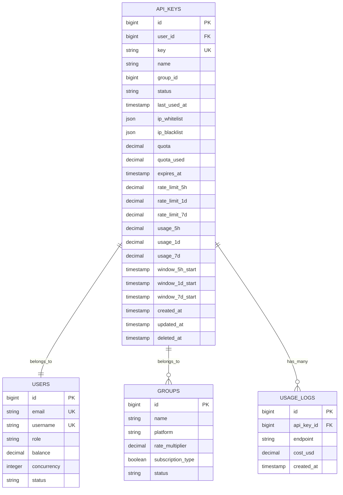

**图表来源**
- [api_key.go:34-119](file://backend/ent/schema/api_key.go#L34-L119)
- [apikey.go:18-73](file://backend/ent/apikey.go#L18-L73)

### 字段详细说明

| 字段名 | 类型 | 约束 | 描述 |
|--------|------|------|------|
| id | bigint | 主键 | 自增ID |
| user_id | bigint | 外键 | 关联用户表 |
| key | string | 唯一键 | API密钥值，最大128字符 |
| name | string | 必填 | 密钥名称，最大100字符 |
| group_id | bigint | 可空 | 所属分组ID |
| status | string | 默认"active" | 密钥状态 |
| last_used_at | timestamp | 可空 | 最后使用时间 |
| ip_whitelist | json | 默认[] | IP白名单数组 |
| ip_blacklist | json | 默认[] | IP黑名单数组 |
| quota | decimal | 默认0 | 配额上限(美元) |
| quota_used | decimal | 默认0 | 已用配额(美元) |
| expires_at | timestamp | 可空 | 过期时间 |
| rate_limit_5h | decimal | 默认0 | 5小时限流(美元) |
| rate_limit_1d | decimal | 默认0 | 日限流(美元) |
| rate_limit_7d | decimal | 默认0 | 7天限流(美元) |
| usage_5h | decimal | 默认0 | 当前5小时用量 |
| usage_1d | decimal | 默认0 | 当前日用量 |
| usage_7d | decimal | 默认0 | 当前7天用量 |
| window_5h_start | timestamp | 可空 | 5小时窗口开始时间 |
| window_1d_start | timestamp | 可空 | 日窗口开始时间 |
| window_7d_start | timestamp | 可空 | 7天窗口开始时间 |

**章节来源**
- [api_key.go:34-119](file://backend/ent/schema/api_key.go#L34-L119)
- [apikey.go:18-73](file://backend/ent/apikey.go#L18-L73)

## 安全设计

### 数据完整性约束

系统采用软删除机制，通过deleted_at字段实现数据恢复能力：

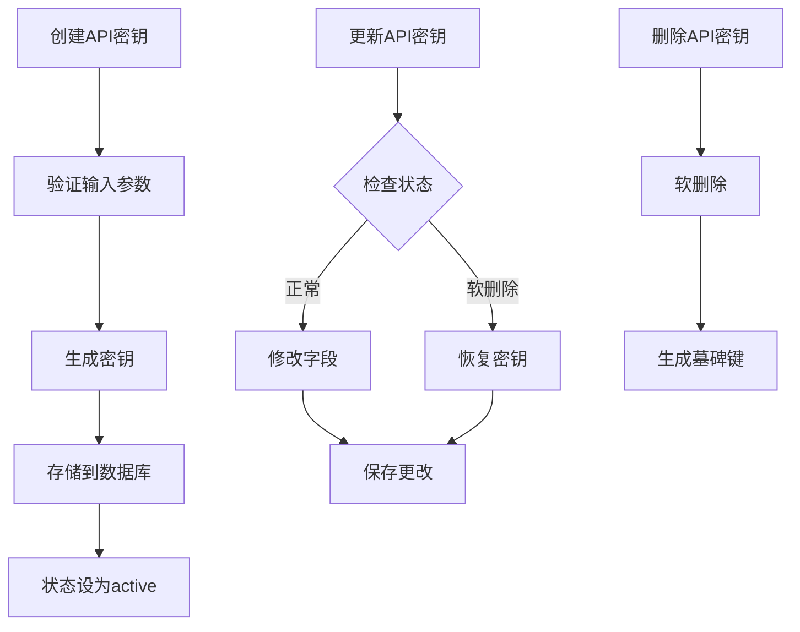

**图表来源**
- [api_key.go:27-32](file://backend/ent/schema/api_key.go#L27-L32)
- [api_key_repo.go:256-284](file://backend/internal/repository/api_key_repo.go#L256-L284)

### 错误处理机制

系统定义了完整的错误处理策略：

- **密钥不存在**: `ErrAPIKeyNotFound` - API密钥不存在
- **权限不足**: `ErrInsufficientPerms` - 用户无权操作该密钥
- **密钥冲突**: `ErrAPIKeyExists` - 密钥已存在
- **格式错误**: `ErrAPIKeyInvalidChars` - 密钥格式无效
- **配额超限**: `ErrAPIKeyQuotaExhausted` - 配额已用完
- **过期**: `ErrAPIKeyExpired` - 密钥已过期

**章节来源**
- [api_key_service.go:22-39](file://backend/internal/service/api_key_service.go#L22-L39)

## 生命周期管理

### 密钥状态流转

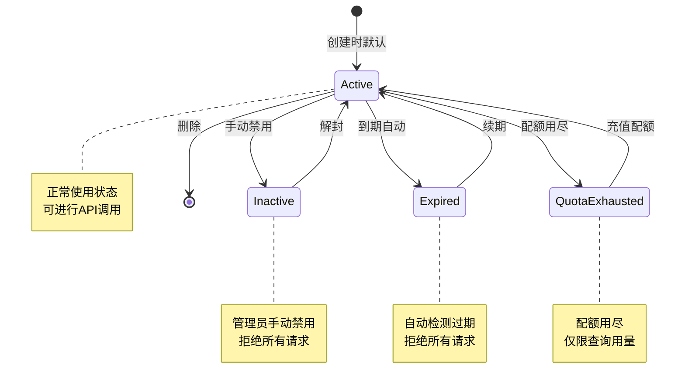

**图表来源**
- [api_key_service.go:666-690](file://backend/internal/service/api_key_service.go#L666-L690)
- [api_key_auth.go:154-173](file://backend/internal/server/middleware/api_key_auth.go#L154-L173)

### 状态检查流程

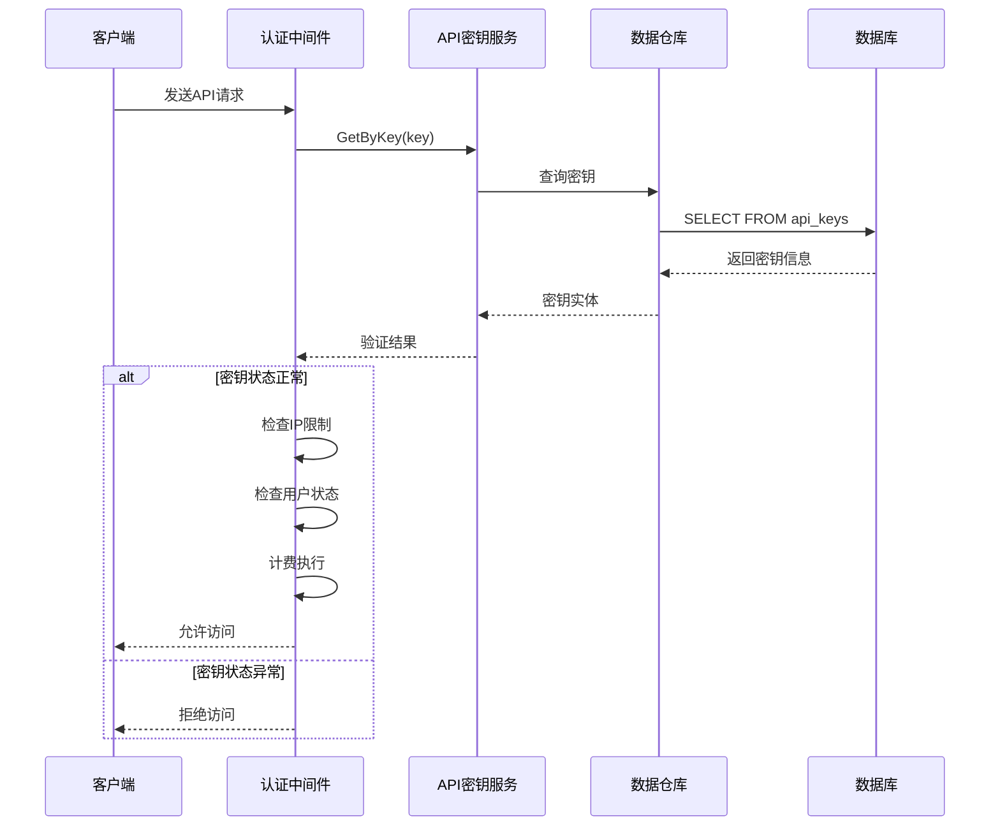

**图表来源**
- [api_key_auth.go:69-110](file://backend/internal/server/middleware/api_key_auth.go#L69-L110)
- [api_key_service.go:666-690](file://backend/internal/service/api_key_service.go#L666-L690)

**章节来源**
- [api_key_auth.go:21-221](file://backend/internal/server/middleware/api_key_auth.go#L21-L221)
- [api_key_service.go:328-428](file://backend/internal/service/api_key_service.go#L328-L428)

## 权限体系

### IP地址白名单/黑名单

系统支持灵活的IP访问控制：

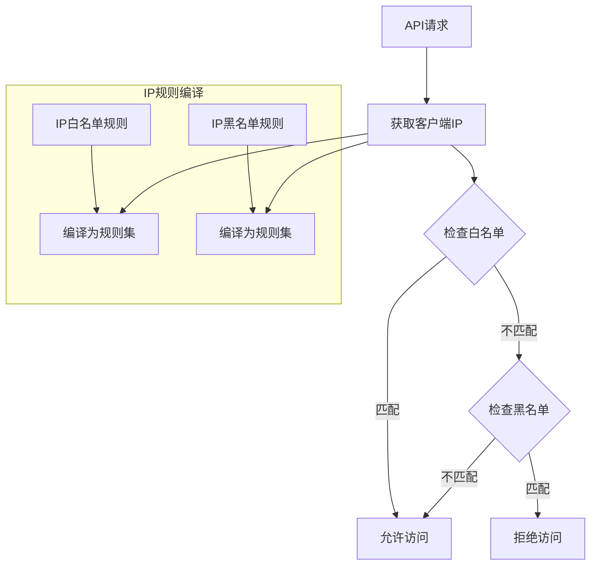

**图表来源**
- [api_key_service.go:240-246](file://backend/internal/service/api_key_service.go#L240-L246)
- [api_key_auth.go:89-98](file://backend/internal/server/middleware/api_key_auth.go#L89-L98)

### 分组权限控制

系统支持基于分组的权限管理：

| 分组类型 | 权限规则 | 订阅要求 |
|----------|----------|----------|
| 标准分组 | 用户可绑定的公开分组 | 无 |
| 订阅分组 | 需要有效订阅才能绑定 | 需要有效订阅 |

**章节来源**
- [api_key_service.go:318-326](file://backend/internal/service/api_key_service.go#L318-L326)
- [api_key_handler.go:328-326](file://backend/internal/handler/api_key_handler.go#L328-L326)

## 密钥生成算法

### 随机密钥生成

系统采用安全的随机密钥生成机制：

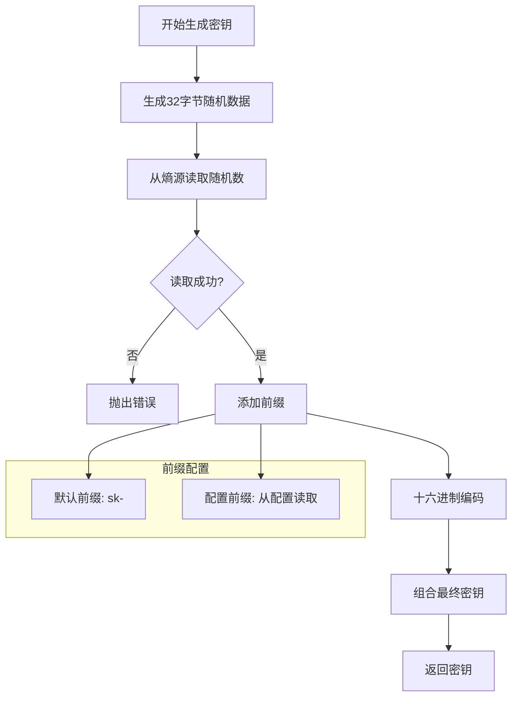

**图表来源**
- [api_key_service.go:248-264](file://backend/internal/service/api_key_service.go#L248-L264)

### 自定义密钥验证

对于用户提供的自定义密钥，系统执行严格验证：

- **长度检查**: 至少16个字符
- **字符验证**: 仅允许字母、数字、下划线、连字符
- **冲突检测**: 检查数据库中是否存在重复密钥
- **速率限制**: 防止恶意尝试生成重复密钥

**章节来源**
- [api_key_service.go:267-285](file://backend/internal/service/api_key_service.go#L267-L285)
- [api_key_service.go:366-396](file://backend/internal/service/api_key_service.go#L366-L396)

## 存储与加密

### 数据库存储

API密钥以明文形式存储在数据库中，但通过以下机制保证安全性：

1. **唯一性约束**: key字段具有唯一索引
2. **软删除**: 使用deleted_at字段实现可恢复删除
3. **索引优化**: 为常用查询字段建立索引

### 缓存策略

系统采用多层缓存机制：

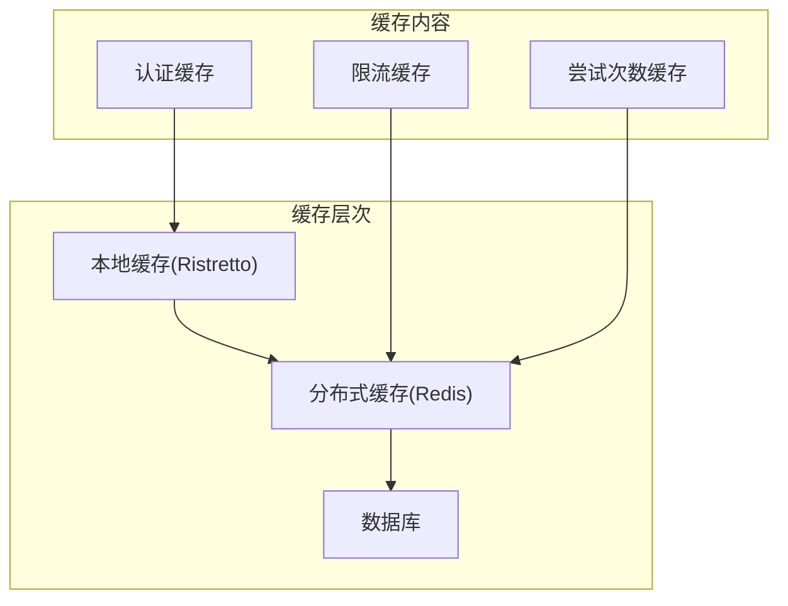

**图表来源**
- [api_key_service.go:125-148](file://backend/internal/service/api_key_service.go#L125-L148)

**章节来源**
- [api_key_repo.go:450-489](file://backend/internal/repository/api_key_repo.go#L450-L489)

## 访问控制机制

### 认证中间件

API密钥认证中间件执行以下检查：

1. **密钥提取**: 支持多种头部格式
2. **基础验证**: 检查密钥存在性和用户状态
3. **IP限制**: 应用白名单/黑名单规则
4. **订阅验证**: 对订阅类型分组执行额外检查

### 多头部支持

系统支持三种密钥传递方式：

| 头部名称 | 格式 | 用途 |
|----------|------|------|
| Authorization | Bearer {key} | 标准OAuth2方式 |
| x-api-key | {key} | 简单API密钥方式 |
| x-goog-api-key | {key} | Gemini CLI兼容方式 |

**章节来源**
- [api_key_auth.go:28-66](file://backend/internal/server/middleware/api_key_auth.go#L28-L66)
- [api_key_auth.go:89-110](file://backend/internal/server/middleware/api_key_auth.go#L89-L110)

## 密钥轮换

### 自动轮换机制

系统支持密钥的自动轮换和管理：

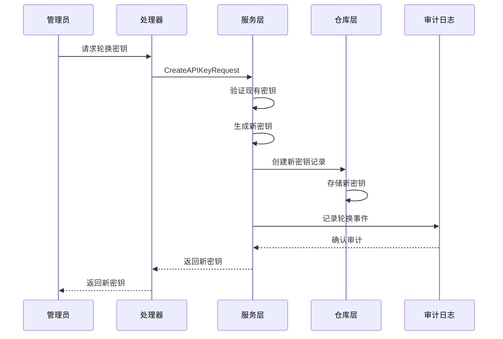

**图表来源**
- [api_key_handler.go:136-179](file://backend/internal/handler/api_key_handler.go#L136-L179)
- [api_key_service.go:328-428](file://backend/internal/service/api_key_service.go#L328-L428)

### 轮换最佳实践

- **渐进式切换**: 建议先创建新密钥，再切换使用
- **监控使用**: 跟踪旧密钥的使用情况
- **及时清理**: 删除不再使用的旧密钥
- **通知用户**: 重要变更时通知相关用户

## 审计日志

### 审计事件类型

系统记录以下关键审计事件：

| 事件类型 | 触发条件 | 记录内容 |
|----------|----------|----------|
| 密钥创建 | 新密钥生成 | 创建者、创建时间、密钥标识 |
| 密钥更新 | 属性变更 | 修改者、修改时间、变更详情 |
| 密钥删除 | 密钥销毁 | 删除者、删除时间、密钥标识 |
| 访问尝试 | API请求 | 客户端IP、时间戳、结果 |
| 配额变更 | 用量更新 | 用量、时间、成本 |

### 审计数据存储

审计信息存储在独立的日志表中，支持：

- **实时查询**: 快速检索最近的审计事件
- **历史归档**: 长期保存审计记录
- **合规要求**: 满足监管审计需求

**章节来源**
- [api_key_service.go:692-722](file://backend/internal/service/api_key_service.go#L692-L722)

## 密钥分发与使用统计

### 分发机制

系统提供多种密钥分发方式：

1. **在线创建**: 通过Web界面即时生成
2. **批量导入**: 支持批量创建多个密钥
3. **API分发**: 通过REST API程序化创建
4. **导出功能**: 支持安全导出密钥列表

### 使用统计

系统提供全面的使用统计功能：

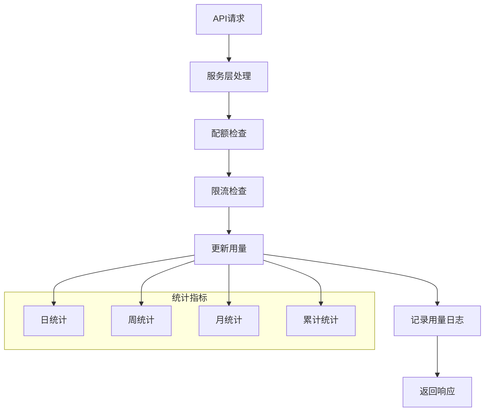

**图表来源**
- [api_key_service.go:724-736](file://backend/internal/service/api_key_service.go#L724-L736)

**章节来源**
- [api_key_handler.go:65-104](file://backend/internal/handler/api_key_handler.go#L65-L104)

## 配额控制

### 多维度配额管理

系统实现三层配额控制：

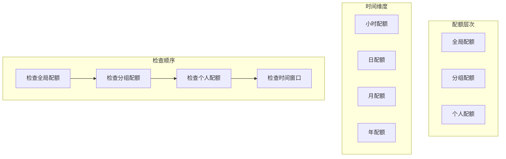

**图表来源**
- [api_key_service.go:82-114](file://backend/internal/service/api_key_service.go#L82-L114)

### 限流算法

系统采用滑动窗口限流算法：

| 时间窗口 | 限额类型 | 重置机制 |
|----------|----------|----------|
| 5小时 | 流量配额 | 窗口到期自动重置 |
| 1天 | 流量配额 | 每日重置 |
| 7天 | 流量配额 | 每周重置 |

**章节来源**
- [api_key_repo.go:508-537](file://backend/internal/repository/api_key_repo.go#L508-L537)

## 与用户表的关系

### 关联关系设计

API密钥与用户表建立了一对多的关系：

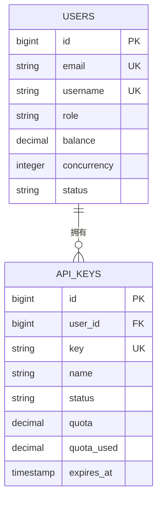

**图表来源**
- [api_key.go:121-133](file://backend/ent/schema/api_key.go#L121-L133)

### 用户状态影响

用户状态直接影响API密钥的有效性：

- **激活用户**: 可正常使用所有API密钥
- **停用用户**: 所有API密钥立即失效
- **冻结账户**: 禁止所有API访问

**章节来源**
- [api_key_auth.go:100-110](file://backend/internal/server/middleware/api_key_auth.go#L100-L110)

## 与用量日志表的关系

### 用量追踪机制

系统通过用量日志表追踪每个API密钥的使用情况：

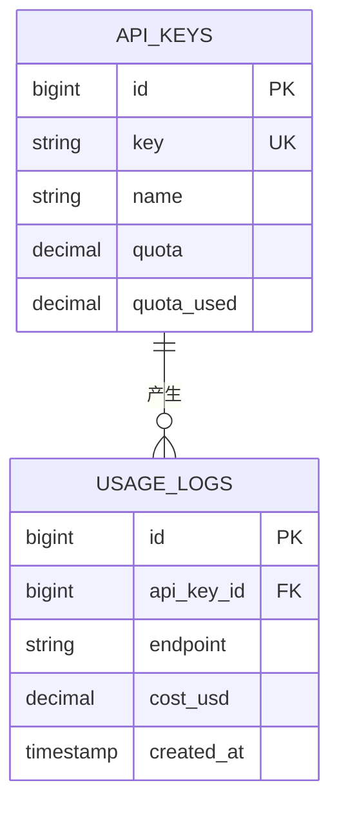

**图表来源**
- [api_key.go:132-133](file://backend/ent/schema/api_key.go#L132-L133)

### 日志记录策略

系统记录详细的用量信息：

| 日志字段 | 描述 | 用途 |
|----------|------|------|
| endpoint | API端点 | 分析使用模式 |
| cost_usd | 成本(美元) | 计费和统计 |
| created_at | 时间戳 | 时间序列分析 |
| api_key_id | 密钥标识 | 关联查询 |

**章节来源**
- [api_key_repo.go:132-177](file://backend/internal/repository/api_key_repo.go#L132-L177)

## 架构图

### 整体架构设计

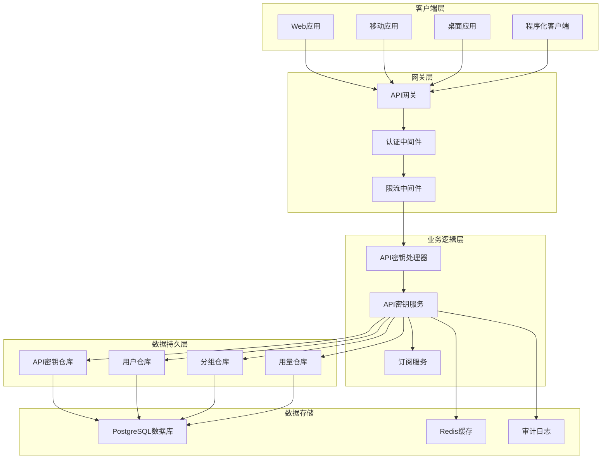

**图表来源**
- [api_key_handler.go:19-29](file://backend/internal/handler/api_key_handler.go#L19-L29)
- [api_key_service.go:195-229](file://backend/internal/service/api_key_service.go#L195-L229)

## 总结

API密钥表设计实现了企业级的安全密钥管理功能，具有以下特点：

### 核心优势

1. **安全性**: 多层防护机制，包括IP限制、配额控制、审计日志
2. **灵活性**: 支持多种密钥生成方式和分组权限模型
3. **可扩展性**: 模块化设计，易于扩展新功能
4. **可观测性**: 完善的统计和审计功能
5. **可靠性**: 软删除机制和错误处理策略

### 技术特色

- **Ent框架集成**: 强类型的ORM设计
- **多层缓存**: L1/L2缓存策略提升性能
- **滑动窗口限流**: 精确的流量控制
- **订阅集成**: 与订阅系统的深度整合
- **审计完备**: 全面的使用追踪和合规支持

该设计为企业提供了安全、可靠、易用的API密钥管理解决方案，能够满足各种规模企业的API治理需求。