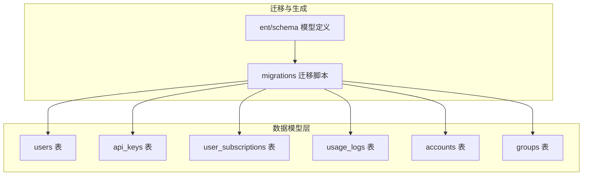
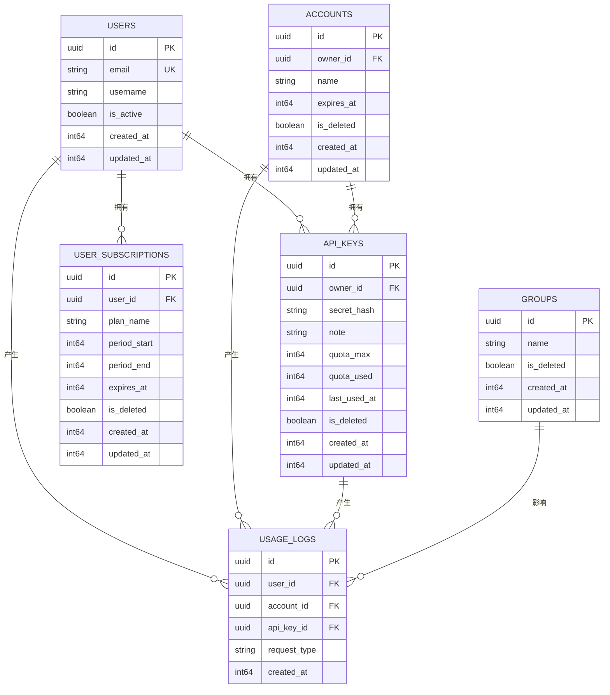
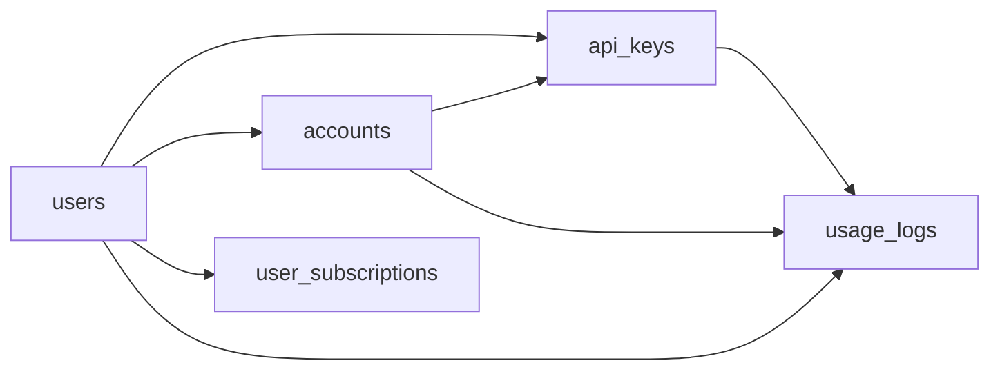

# 核心数据表设计

<cite>
**本文引用的文件**
- [backend/ent/schema/user.go](file://backend/ent/schema/user.go)
- [backend/ent/schema/api_key.go](file://backend/ent/schema/api_key.go)
- [backend/ent/schema/user_subscription.go](file://backend/ent/schema/user_subscription.go)
- [backend/ent/schema/usage_log.go](file://backend/ent/schema/usage_log.go)
- [backend/ent/schema/account.go](file://backend/ent/schema/account.go)
- [backend/ent/schema/group.go](file://backend/ent/schema/group.go)
- [backend/ent/migrate/schema.go](file://backend/ent/migrate/schema.go)
- [backend/migrations/001_init.sql](file://backend/migrations/001_init.sql)
- [backend/migrations/003_subscription.sql](file://backend/migrations/003_subscription.sql)
- [backend/migrations/005_schema_parity.sql](file://backend/migrations/005_schema_parity.sql)
- [backend/migrations/010_add_usage_logs_aggregated_indexes.sql](file://backend/migrations/010_add_usage_logs_aggregated_indexes.sql)
- [backend/migrations/035_usage_logs_partitioning.sql](file://backend/migrations/035_usage_logs_partitioning.sql)
- [backend/migrations/045_add_accounts_extra_index.sql](file://backend/migrations/045_add_accounts_extra_index.sql)
- [backend/migrations/062_add_scheduler_and_usage_composite_indexes_notx.sql](file://backend/migrations/062_add_scheduler_and_usage_composite_indexes_notx.sql)
- [backend/migrations/065_add_search_trgm_indexes.sql](file://backend/migrations/065_add_search_trgm_indexes.sql)
- [backend/migrations/076_add_usage_log_upstream_model_index_notx.sql](file://backend/migrations/076_add_usage_log_upstream_model_index_notx.sql)
- [backend/migrations/078_add_usage_log_requested_model_index_notx.sql](file://backend/migrations/078_add_usage_log_requested_model_index_notx.sql)
- [backend/migrations/087_usage_log_billing_mode.sql](file://backend/migrations/087_usage_log_billing_mode.sql)
- [backend/migrations/089_usage_log_image_output_tokens.sql](file://backend/migrations/089_usage_log_image_output_tokens.sql)
- [backend/migrations/091_add_group_status_tables.sql](file://backend/migrations/091_add_group_status_tables.sql)
- [backend/migrations/144_add_opus48_to_model_mapping.sql](file://backend/migrations/144_add_opus48_to_model_mapping.sql)
</cite>

## 目录
1. [简介](#简介)
2. [项目结构](#项目结构)
3. [核心组件](#核心组件)
4. [架构总览](#架构总览)
5. [详细组件分析](#详细组件分析)
6. [依赖分析](#依赖分析)
7. [性能考量](#性能考量)
8. [故障排查指南](#故障排查指南)
9. [结论](#结论)
10. [附录](#附录)

## 简介
本文件聚焦于系统核心数据表的设计与实现，覆盖用户表(users)、API密钥表(api_keys)、用户订阅表(user_subscriptions)、用量日志表(usage_logs)、账户表(accounts)、用户组表(groups)等关键实体。内容涵盖字段定义（数据类型、长度限制、空值与默认值）、业务约束（唯一性、外键、检查约束）、索引策略（主键、唯一、复合索引）以及典型查询场景与示例数据。为确保准确性，所有技术细节均基于仓库中的Schema定义与迁移脚本进行归纳总结。

## 项目结构
后端采用Ent ORM框架管理数据模型与迁移，核心表结构定义位于`backend/ent/schema/`目录，迁移脚本位于`backend/migrations/`目录。Ent生成器会根据schema定义生成对应的Go代码与数据库迁移文件，保证模型与数据库结构保持一致。

图表来源
- [backend/ent/schema/user.go](file://backend/ent/schema/user.go)
- [backend/ent/schema/api_key.go](file://backend/ent/schema/api_key.go)
- [backend/ent/schema/user_subscription.go](file://backend/ent/schema/user_subscription.go)
- [backend/ent/schema/usage_log.go](file://backend/ent/schema/usage_log.go)
- [backend/ent/schema/account.go](file://backend/ent/schema/account.go)
- [backend/ent/schema/group.go](file://backend/ent/schema/group.go)
- [backend/migrations/001_init.sql](file://backend/migrations/001_init.sql)

章节来源
- [backend/ent/schema/user.go](file://backend/ent/schema/user.go)
- [backend/ent/schema/api_key.go](file://backend/ent/schema/api_key.go)
- [backend/ent/schema/user_subscription.go](file://backend/ent/schema/user_subscription.go)
- [backend/ent/schema/usage_log.go](file://backend/ent/schema/usage_log.go)
- [backend/ent/schema/account.go](file://backend/ent/schema/account.go)
- [backend/ent/schema/group.go](file://backend/ent/schema/group.go)
- [backend/migrations/001_init.sql](file://backend/migrations/001_init.sql)

## 核心组件
本节概述各核心表的职责与关键字段，后续章节将逐表展开详细分析。

- 用户表(users)：存储系统用户信息，包含身份标识、状态、计费与配额等字段。
- API密钥表(api_keys)：存储用户或账户的API密钥及其访问控制、配额与限制。
- 用户订阅表(user_subscriptions)：记录用户的订阅状态、周期与到期时间等。
- 用量日志表(usage_logs)：记录每次请求的用量明细，支持聚合查询与分区优化。
- 账户表(accounts)：记录账户维度的计费、配额、过期时间等信息。
- 用户组表(groups)：定义用户可访问的分组与路由策略，支持状态与事件追踪。

章节来源
- [backend/ent/schema/user.go](file://backend/ent/schema/user.go)
- [backend/ent/schema/api_key.go](file://backend/ent/schema/api_key.go)
- [backend/ent/schema/user_subscription.go](file://backend/ent/schema/user_subscription.go)
- [backend/ent/schema/usage_log.go](file://backend/ent/schema/usage_log.go)
- [backend/ent/schema/account.go](file://backend/ent/schema/account.go)
- [backend/ent/schema/group.go](file://backend/ent/schema/group.go)

## 架构总览
下图展示核心表之间的关系与依赖，帮助理解数据流向与约束关系。

图表来源
- [backend/ent/schema/user.go](file://backend/ent/schema/user.go)
- [backend/ent/schema/account.go](file://backend/ent/schema/account.go)
- [backend/ent/schema/api_key.go](file://backend/ent/schema/api_key.go)
- [backend/ent/schema/user_subscription.go](file://backend/ent/schema/user_subscription.go)
- [backend/ent/schema/group.go](file://backend/ent/schema/group.go)
- [backend/ent/schema/usage_log.go](file://backend/ent/schema/usage_log.go)

## 详细组件分析

### 用户表(users)
- 字段与约束
  - 主键：id（uuid）
  - 唯一约束：email（UK）
  - 其他字段：username（字符串）、is_active（布尔）、created_at/updated_at（整数时间戳）
  - 业务含义：唯一标识用户、邮箱作为登录凭证、活跃状态用于权限控制
- 索引策略
  - 主键索引：id
  - 唯一索引：email
- 典型查询场景
  - 通过邮箱登录验证
  - 查询用户详情与状态
- 示例数据
  - id: "a1b2c3d4-e5f6-7890-a1b2-c3d4e5f67890"
  - email: "alice@example.com"
  - username: "alice"
  - is_active: true

章节来源
- [backend/ent/schema/user.go](file://backend/ent/schema/user.go)
- [backend/migrations/001_init.sql](file://backend/migrations/001_init.sql)

### API密钥表(api_keys)
- 字段与约束
  - 主键：id（uuid）
  - 外键：owner_id 指向 users.id 或 accounts.id（取决于密钥归属）
  - 唯一约束：无（密钥本身不唯一，但可配合owner_id与状态组合约束）
  - 其他字段：secret_hash（字符串，存储哈希）、note（字符串，备注）、quota_max/quota_used（整数，配额上限与已用）、last_used_at（整数时间戳）、is_deleted（布尔）、created_at/updated_at（整数时间戳）
  - 业务含义：密钥用于API访问授权；quota_max/quota_used用于配额控制；last_used_at用于审计
- 索引策略
  - 主键索引：id
  - 复合索引：owner_id + is_deleted（加速按所有者与软删除过滤）
- 典型查询场景
  - 验证密钥有效性与配额
  - 查询某用户的密钥列表
  - 更新密钥使用统计
- 示例数据
  - id: "f0e9d8c7-b6a5-4321-f0e9-d8c7b6a54321"
  - owner_id: "a1b2c3d4-e5f6-7890-a1b2-c3d4e5f67890"
  - secret_hash: "sha256_hash_of_key"
  - quota_max: 10000
  - quota_used: 1200
  - last_used_at: 1700000000

章节来源
- [backend/ent/schema/api_key.go](file://backend/ent/schema/api_key.go)
- [backend/migrations/001_init.sql](file://backend/migrations/001_init.sql)
- [backend/migrations/045_add_accounts_extra_index.sql](file://backend/migrations/045_add_accounts_extra_index.sql)

### 用户订阅表(user_subscriptions)
- 字段与约束
  - 主键：id（uuid）
  - 外键：user_id 指向 users.id
  - 其他字段：plan_name（字符串，订阅计划名称）、period_start/period_end（整数时间戳，周期起止）、expires_at（整数时间戳，到期时间）、is_deleted（布尔）、created_at/updated_at（整数时间戳）
  - 业务含义：记录用户的订阅状态与有效期，支持周期性计费与到期提醒
- 索引策略
  - 主键索引：id
  - 复合索引：user_id + is_deleted（加速按用户与软删除过滤）
  - 复合索引：expires_at + is_deleted（加速到期扫描）
- 典型查询场景
  - 查询用户当前有效订阅
  - 批量检测即将到期订阅
- 示例数据
  - id: "b2c3d4e5-f6a7-8901-b2c3-d4e5f6a78901"
  - user_id: "a1b2c3d4-e5f6-7890-a1b2-c3d4e5f67890"
  - plan_name: "premium_monthly"
  - period_start: 1700000000
  - period_end: 1702592000
  - expires_at: 1702592000

章节来源
- [backend/ent/schema/user_subscription.go](file://backend/ent/schema/user_subscription.go)
- [backend/migrations/003_subscription.sql](file://backend/migrations/003_subscription.sql)

### 用量日志表(usage_logs)
- 字段与约束
  - 主键：id（uuid）
  - 外键：user_id 指向 users.id；account_id 指向 accounts.id；api_key_id 指向 api_keys.id
  - 其他字段：request_type（字符串，请求类型）、created_at（整数时间戳）
  - 业务含义：记录每次请求的用量明细，支持按用户/账户/密钥聚合统计
- 索引策略
  - 主键索引：id
  - 复合索引：user_id + created_at（加速用户用量聚合）
  - 复合索引：account_id + created_at（加速账户用量聚合）
  - 复合索引：api_key_id + created_at（加速密钥用量聚合）
  - 复合索引：created_at + request_type（加速按类型与时间聚合）
  - 特殊索引：上游模型索引（见迁移脚本）
  - 分区：按时间分区（见迁移脚本）
- 典型查询场景
  - 统计某用户/账户/密钥在指定时间范围内的用量
  - 按请求类型聚合用量
- 示例数据
  - id: "c3d4e5f6-a7b8-9012-c3d4-e5f6a7b89012"
  - user_id: "a1b2c3d4-e5f6-7890-a1b2-c3d4e5f67890"
  - account_id: "d4e5f6a7-b8c9-0123-d4e5-f6a7b8c90123"
  - api_key_id: "f0e9d8c7-b6a5-4321-f0e9-d8c7b6a54321"
  - request_type: "chat.completions"

章节来源
- [backend/ent/schema/usage_log.go](file://backend/ent/schema/usage_log.go)
- [backend/migrations/010_add_usage_logs_aggregated_indexes.sql](file://backend/migrations/010_add_usage_logs_aggregated_indexes.sql)
- [backend/migrations/035_usage_logs_partitioning.sql](file://backend/migrations/035_usage_logs_partitioning.sql)
- [backend/migrations/062_add_scheduler_and_usage_composite_indexes_notx.sql](file://backend/migrations/062_add_scheduler_and_usage_composite_indexes_notx.sql)
- [backend/migrations/076_add_usage_log_upstream_model_index_notx.sql](file://backend/migrations/076_add_usage_log_upstream_model_index_notx.sql)
- [backend/migrations/078_add_usage_log_requested_model_index_notx.sql](file://backend/migrations/078_add_usage_log_requested_model_index_notx.sql)

### 账户表(accounts)
- 字段与约束
  - 主键：id（uuid）
  - 外键：owner_id 指向 users.id
  - 其他字段：name（字符串，账户名称）、expires_at（整数时间戳，过期时间）、is_deleted（布尔）、created_at/updated_at（整数时间戳）
  - 业务含义：账户是资源与配额的承载单位，支持过期与软删除
- 索引策略
  - 主键索引：id
  - 复合索引：owner_id + is_deleted（加速按所有者与软删除过滤）
  - 复合索引：expires_at + is_deleted（加速过期扫描）
- 典型查询场景
  - 查询用户的所有有效账户
  - 扫描即将过期的账户
- 示例数据
  - id: "d4e5f6a7-b8c9-0123-d4e5-f6a7b8c90123"
  - owner_id: "a1b2c3d4-e5f6-7890-a1b2-c3d4e5f67890"
  - name: "default-account"
  - expires_at: 1750000000

章节来源
- [backend/ent/schema/account.go](file://backend/ent/schema/account.go)
- [backend/migrations/001_init.sql](file://backend/migrations/001_init.sql)
- [backend/migrations/045_add_accounts_extra_index.sql](file://backend/migrations/045_add_accounts_extra_index.sql)

### 用户组表(groups)
- 字段与约束
  - 主键：id（uuid）
  - 其他字段：name（字符串，组名）、is_deleted（布尔）、created_at/updated_at（整数时间戳）
  - 业务含义：定义用户可访问的分组，支持路由与权限控制
- 索引策略
  - 主键索引：id
  - 唯一索引：name（如存在）
- 典型查询场景
  - 查询用户可访问的组列表
  - 按组名检索
- 示例数据
  - id: "e5f6a7b8-c9d0-1234-e5f6-a7b8c9d01234"
  - name: "premium-users"

章节来源
- [backend/ent/schema/group.go](file://backend/ent/schema/group.go)
- [backend/migrations/001_init.sql](file://backend/migrations/001_init.sql)

## 依赖分析
- 外键依赖
  - api_keys.owner_id 可指向 users.id 或 accounts.id（依据密钥归属策略）
  - user_subscriptions.user_id 指向 users.id
  - usage_logs.user_id 指向 users.id
  - usage_logs.account_id 指向 accounts.id
  - usage_logs.api_key_id 指向 api_keys.id
- 软删除与时间戳
  - 多个表包含 is_deleted 字段，配合 created_at/updated_at 实现软删除与审计
- 约束一致性
  - 唯一约束（如users.email）与外键约束共同保证数据完整性
- 索引耦合
  - 复合索引设计与查询模式高度耦合，需结合实际查询场景持续优化

图表来源
- [backend/ent/schema/user.go](file://backend/ent/schema/user.go)
- [backend/ent/schema/account.go](file://backend/ent/schema/account.go)
- [backend/ent/schema/api_key.go](file://backend/ent/schema/api_key.go)
- [backend/ent/schema/user_subscription.go](file://backend/ent/schema/user_subscription.go)
- [backend/ent/schema/usage_log.go](file://backend/ent/schema/usage_log.go)

## 性能考量
- 索引优化
  - 聚合查询：为usage_logs建立按时间与维度的复合索引，提升统计效率
  - 搜索优化：对高选择性字段（如email、name）建立索引
  - 分区策略：对大表按时间分区，降低扫描范围
- 写入压力
  - 批量写入与异步统计可缓解高峰期写入压力
- 缓存策略
  - 对热点查询结果（如用户订阅状态）引入缓存层
- 监控与告警
  - 建议对慢查询、索引缺失与分区异常进行监控

## 故障排查指南
- 常见问题
  - 外键约束失败：检查关联对象是否存在且未被软删除
  - 唯一约束冲突：确认email等唯一字段是否重复
  - 查询性能差：检查是否命中预期索引，必要时重建或调整索引
- 排查步骤
  - 确认迁移脚本执行顺序与版本
  - 检查软删除字段对查询的影响
  - 核对分区配置与归档策略
- 相关迁移参考
  - 索引与分区：[010_add_usage_logs_aggregated_indexes.sql](file://backend/migrations/010_add_usage_logs_aggregated_indexes.sql)、[035_usage_logs_partitioning.sql](file://backend/migrations/035_usage_logs_partitioning.sql)
  - 复合索引：[062_add_scheduler_and_usage_composite_indexes_notx.sql](file://backend/migrations/062_add_scheduler_and_usage_composite_indexes_notx.sql)
  - TRGM索引：[065_add_search_trgm_indexes.sql](file://backend/migrations/065_add_search_trgm_indexes.sql)
  - 上游/请求模型索引：[076_add_usage_log_upstream_model_index_notx.sql](file://backend/migrations/076_add_usage_log_upstream_model_index_notx.sql)、[078_add_usage_log_requested_model_index_notx.sql](file://backend/migrations/078_add_usage_log_requested_model_index_notx.sql)
  - 计费模式字段：[087_usage_log_billing_mode.sql](file://backend/migrations/087_usage_log_billing_mode.sql)
  - 图像输出令牌字段：[089_usage_log_image_output_tokens.sql](file://backend/migrations/089_usage_log_image_output_tokens.sql)

章节来源
- [backend/migrations/010_add_usage_logs_aggregated_indexes.sql](file://backend/migrations/010_add_usage_logs_aggregated_indexes.sql)
- [backend/migrations/035_usage_logs_partitioning.sql](file://backend/migrations/035_usage_logs_partitioning.sql)
- [backend/migrations/062_add_scheduler_and_usage_composite_indexes_notx.sql](file://backend/migrations/062_add_scheduler_and_usage_composite_indexes_notx.sql)
- [backend/migrations/065_add_search_trgm_indexes.sql](file://backend/migrations/065_add_search_trgm_indexes.sql)
- [backend/migrations/076_add_usage_log_upstream_model_index_notx.sql](file://backend/migrations/076_add_usage_log_upstream_model_index_notx.sql)
- [backend/migrations/078_add_usage_log_requested_model_index_notx.sql](file://backend/migrations/078_add_usage_log_requested_model_index_notx.sql)
- [backend/migrations/087_usage_log_billing_mode.sql](file://backend/migrations/087_usage_log_billing_mode.sql)
- [backend/migrations/089_usage_log_image_output_tokens.sql](file://backend/migrations/089_usage_log_image_output_tokens.sql)

## 结论
本文基于仓库中的Ent Schema与迁移脚本，系统梳理了核心数据表的结构设计、业务约束与索引策略，并提供了典型查询场景与示例数据。建议在生产环境中结合实际查询模式持续优化索引与分区策略，并完善软删除与审计机制以保障数据一致性与可追溯性。

## 附录
- 进一步阅读
  - Ent ORM 模型与迁移：[backend/ent/schema/](file://backend/ent/schema/)、[backend/migrations/](file://backend/migrations/)
  - 初始化与演进：[001_init.sql](file://backend/migrations/001_init.sql)、[003_subscription.sql](file://backend/migrations/003_subscription.sql)、[005_schema_parity.sql](file://backend/migrations/005_schema_parity.sql)
  - 组状态相关：[091_add_group_status_tables.sql](file://backend/migrations/091_add_group_status_tables.sql)
  - 模型映射扩展：[144_add_opus48_to_model_mapping.sql](file://backend/migrations/144_add_opus48_to_model_mapping.sql)