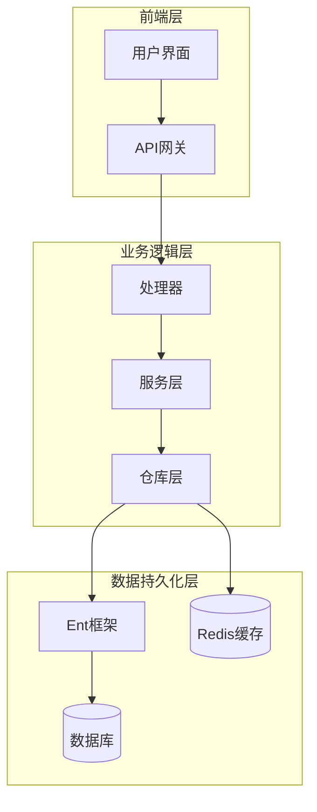
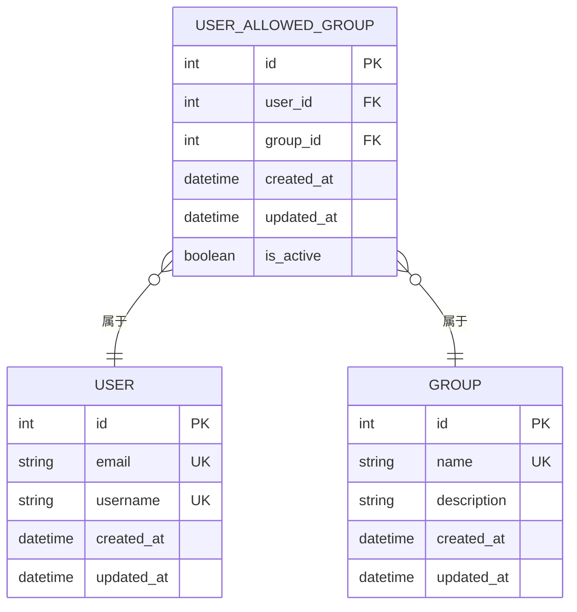
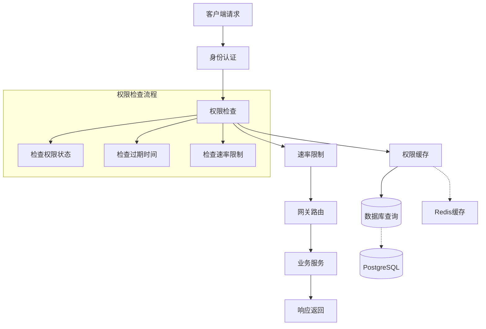
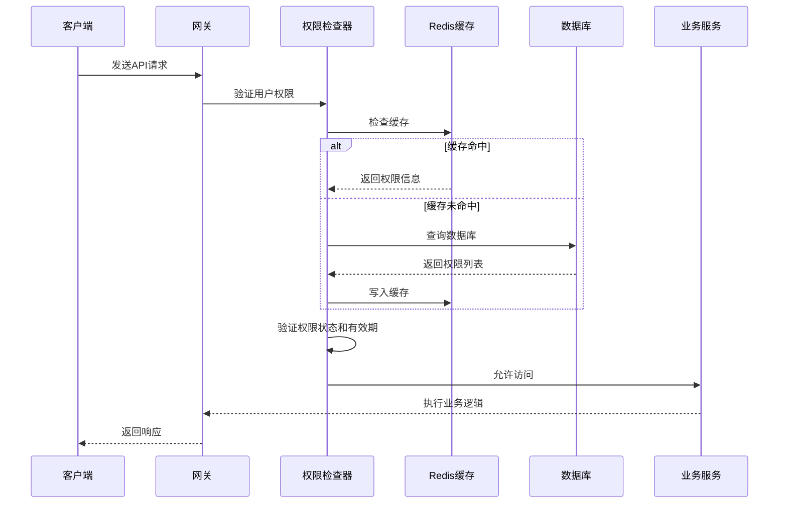
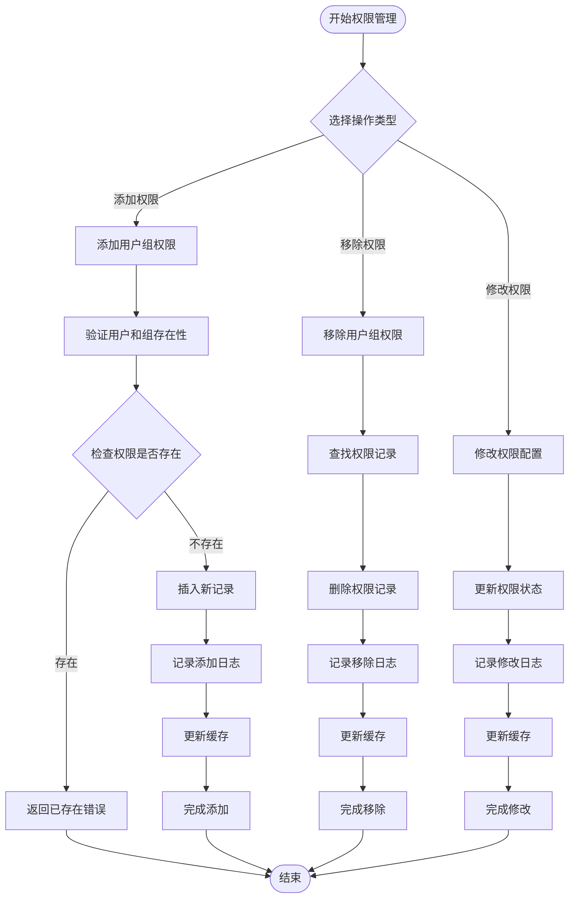
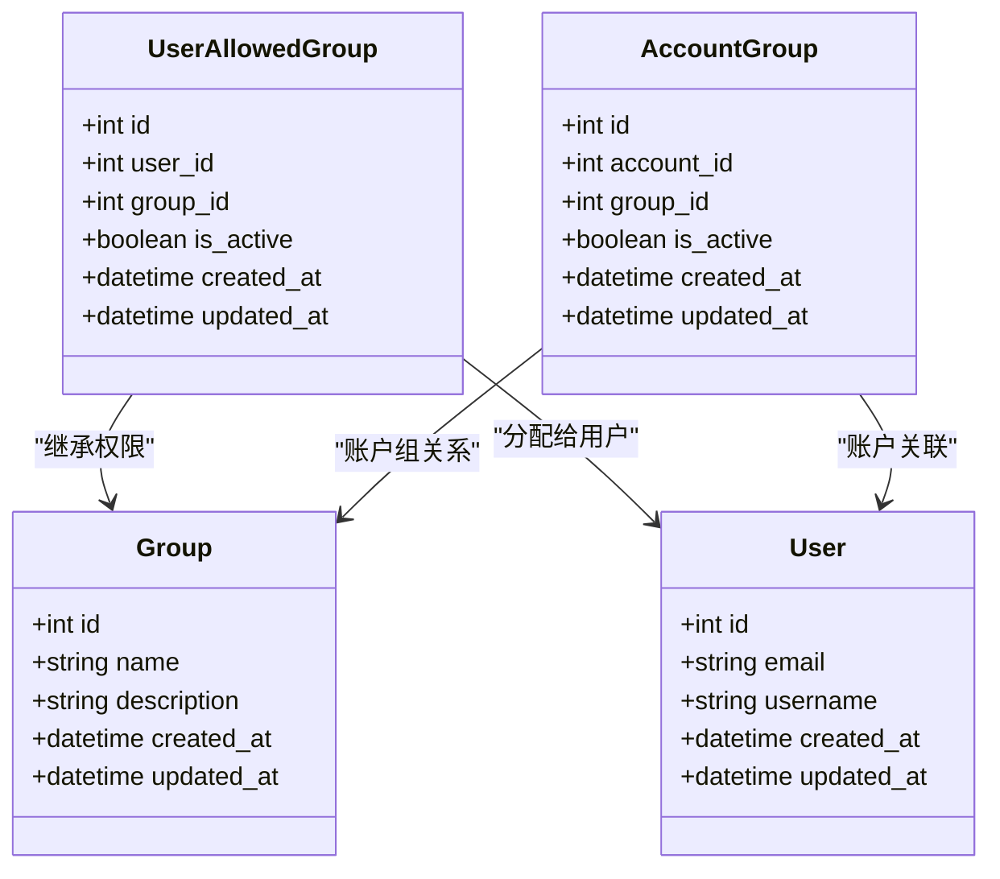
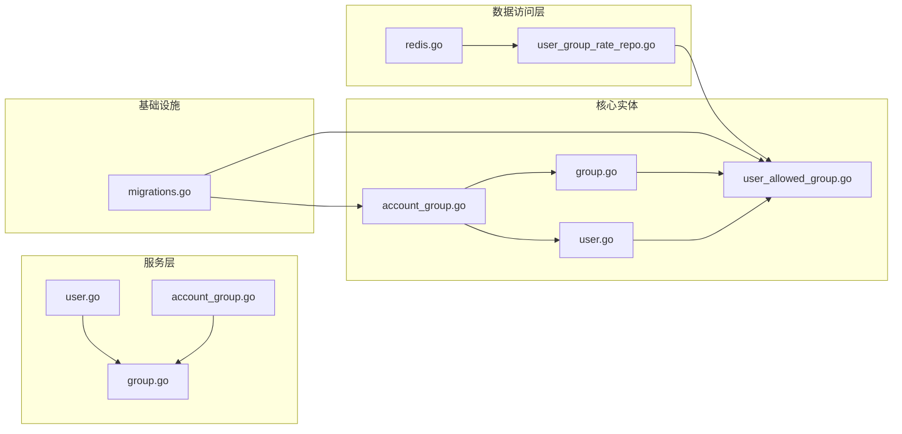
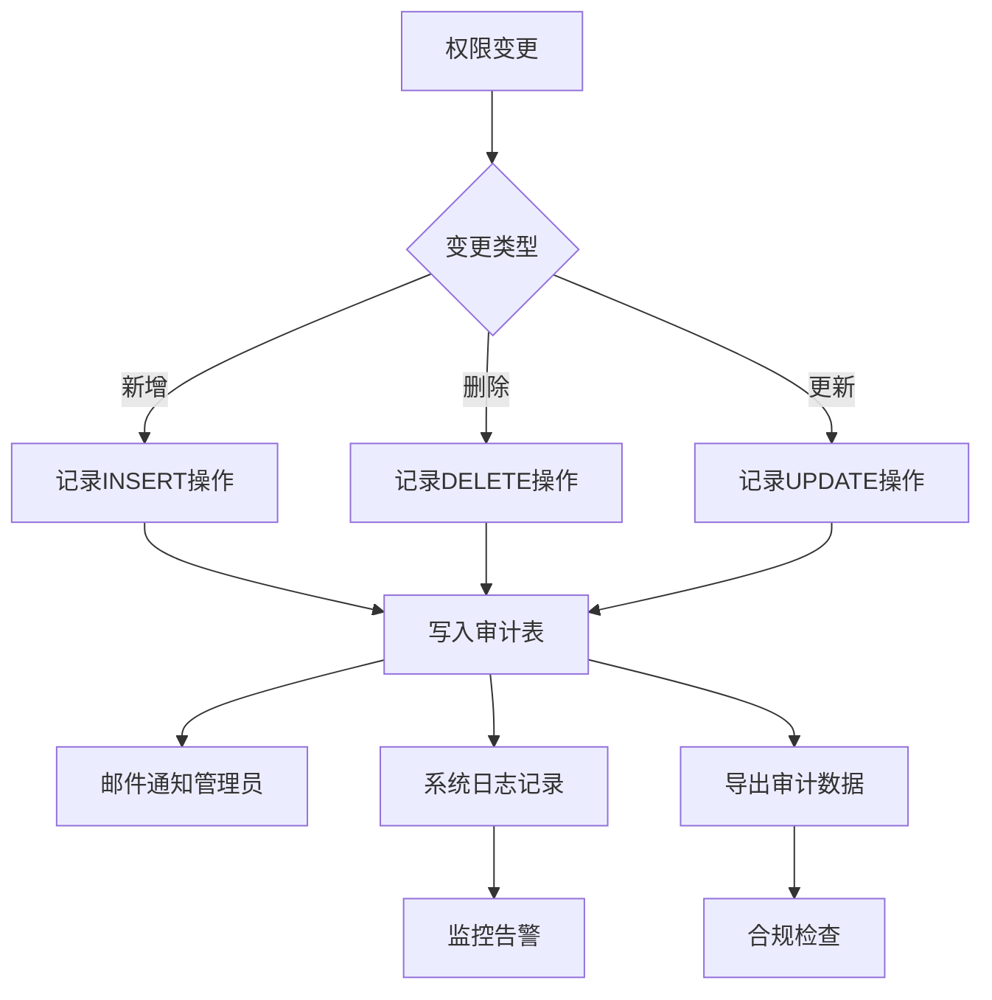

# 用户允许组表设计

## 目录
1. [简介](#简介)
2. [项目结构](#项目结构)
3. [核心组件](#核心组件)
4. [架构概览](#架构概览)
5. [详细组件分析](#详细组件分析)
6. [依赖关系分析](#依赖关系分析)
7. [性能考虑](#性能考虑)
8. [故障排除指南](#故障排除指南)
9. [结论](#结论)

## 简介

本文档详细分析了用户允许组表（user_allowed_groups）的设计与实现，这是一个关键的权限控制系统，用于管理用户对不同组（Group）的访问权限。该系统通过建立用户与组之间的多对多关系，实现了灵活的权限控制机制，支持用户可以访问的组集合管理和权限继承关系。

## 项目结构

系统采用分层架构设计，主要包含以下层次：

**图表来源**
- [user_allowed_group.go:1-200](file://backend/ent/schema/user_allowed_group.go#L1-L200)
- [userallowedgroup.go:1-150](file://backend/ent/userallowedgroup/userallowedgroup.go#L1-L150)

**章节来源**
- [user_allowed_group.go:1-200](file://backend/ent/schema/user_allowed_group.go#L1-L200)
- [userallowedgroup.go:1-150](file://backend/ent/userallowedgroup/userallowedgroup.go#L1-L150)

## 核心组件

### 用户允许组表结构

用户允许组表是权限控制系统的核心数据结构，采用多对多关系设计：

**图表来源**
- [user_allowed_group.go:1-200](file://backend/ent/schema/user_allowed_group.go#L1-L200)
- [user.go:1-150](file://backend/ent/schema/user.go#L1-L150)
- [group.go:1-150](file://backend/ent/schema/group.go#L1-L150)

### 核心字段设计

| 字段名 | 类型 | 约束 | 描述 | 索引 |
|--------|------|------|------|------|
| id | bigint | 主键自增 | 记录唯一标识符 | PRIMARY KEY |
| user_id | bigint | 外键约束 | 关联用户表 | FK_USER_ALLOWED_GROUP_USER_ID |
| group_id | bigint | 外键约束 | 关联组表 | FK_USER_ALLOWED_GROUP_GROUP_ID |
| created_at | timestamp | 非空默认值 | 记录创建时间 | DEFAULT CURRENT_TIMESTAMP |
| updated_at | timestamp | 非空默认值 | 记录更新时间 | DEFAULT CURRENT_TIMESTAMP ON UPDATE CURRENT_TIMESTAMP |
| is_active | boolean | 非空默认值 | 权限状态开关 | DEFAULT TRUE |

**章节来源**
- [user_allowed_group.go:1-200](file://backend/ent/schema/user_allowed_group.go#L1-L200)

## 架构概览

系统采用微服务架构，权限控制贯穿整个应用栈：

**图表来源**
- [gateway_handler.go:1-300](file://backend/internal/handler/gateway_handler.go#L1-L300)
- [redis.go:1-200](file://backend/internal/repository/redis.go#L1-L200)

## 详细组件分析

### 权限验证机制

系统实现了多层次的权限验证机制：

**图表来源**
- [gateway_handler.go:1-300](file://backend/internal/handler/gateway_handler.go#L1-L300)
- [redis.go:1-200](file://backend/internal/repository/redis.go#L1-L200)

### 动态权限管理流程

系统支持用户组权限的实时管理：

**图表来源**
- [user_group_rate_repo.go:1-300](file://backend/internal/repository/user_group_rate_repo.go#L1-L300)
- [logging.go:1-200](file://backend/internal/middleware/logging.go#L1-L200)

**章节来源**
- [user_group_rate_repo.go:1-300](file://backend/internal/repository/user_group_rate_repo.go#L1-L300)
- [logging.go:1-200](file://backend/internal/middleware/logging.go#L1-L200)

### 组权限继承关系

系统支持复杂的权限继承机制：

**图表来源**
- [user_allowed_group.go:1-200](file://backend/ent/schema/user_allowed_group.go#L1-L200)
- [account_group.go:1-200](file://backend/ent/schema/account_group.go#L1-L200)
- [group.go:1-200](file://backend/ent/group/group.go#L1-L200)

**章节来源**
- [account_group.go:1-200](file://backend/ent/schema/account_group.go#L1-L200)
- [group.go:1-200](file://backend/ent/group/group.go#L1-L200)

## 依赖关系分析

系统各组件间的依赖关系如下：

**图表来源**
- [user_allowed_group.go:1-200](file://backend/ent/schema/user_allowed_group.go#L1-L200)
- [user.go:1-200](file://backend/ent/user/user.go#L1-L200)
- [group.go:1-200](file://backend/ent/group/group.go#L1-L200)
- [account_group.go:1-200](file://backend/ent/accountgroup/account_group.go#L1-L200)

**章节来源**
- [user_allowed_group.go:1-200](file://backend/ent/schema/user_allowed_group.go#L1-L200)
- [migrations.go:1-200](file://backend/migrations/007_add_user_allowed_groups.sql#L1-L200)

## 性能考虑

### 缓存策略

系统采用多级缓存策略优化权限检查性能：

| 缓存层级 | 缓存类型 | 过期时间 | 使用场景 |
|----------|----------|----------|----------|
| 应用层缓存 | LRU缓存 | 5分钟 | 高频权限查询 |
| 分布式缓存 | Redis | 10分钟 | 跨节点权限共享 |
| 数据库索引 | 复合索引 | 持久化 | 慢查询优化 |
| 本地缓存 | 进程内缓存 | 1分钟 | 本地快速访问 |

### 性能优化措施

1. **批量查询优化**：支持批量权限检查，减少数据库往返次数
2. **智能缓存失效**：基于事件驱动的缓存更新机制
3. **连接池管理**：优化数据库连接复用
4. **异步更新**：权限变更采用异步方式更新缓存

**章节来源**
- [redis.go:1-200](file://backend/internal/repository/redis.go#L1-L200)
- [api_key_cache.go:1-200](file://backend/internal/repository/api_key_cache.go#L1-L200)
- [identity_cache.go:1-200](file://backend/internal/repository/identity_cache.go#L1-L200)

## 故障排除指南

### 常见问题及解决方案

| 问题类型 | 症状描述 | 可能原因 | 解决方案 |
|----------|----------|----------|----------|
| 权限拒绝 | 用户无法访问指定组 | 权限记录缺失或禁用 | 检查user_allowed_groups表状态 |
| 缓存不一致 | 新增权限后立即失效 | 缓存未及时更新 | 清理相关缓存键 |
| 性能下降 | 权限检查响应缓慢 | 缺少必要索引 | 添加复合索引优化查询 |
| 数据不一致 | 用户权限状态异常 | 事务处理失败 | 检查数据库事务完整性 |

### 审计日志记录

系统提供完整的权限变更审计功能：

**图表来源**
- [logging.go:1-200](file://backend/internal/middleware/logging.go#L1-L200)

**章节来源**
- [logging.go:1-200](file://backend/internal/middleware/logging.go#L1-L200)

## 结论

用户允许组表设计通过以下关键特性实现了高效的权限控制：

1. **灵活的多对多关系**：支持用户与组之间的一对多映射
2. **动态权限管理**：支持实时添加、移除和修改权限
3. **高性能缓存策略**：多级缓存确保权限检查的低延迟
4. **完整的审计机制**：记录所有权限变更历史
5. **数据一致性保证**：通过外键约束和事务管理确保数据完整性

该设计为系统的安全性和可扩展性提供了坚实的基础，能够满足复杂的企业级权限管理需求。