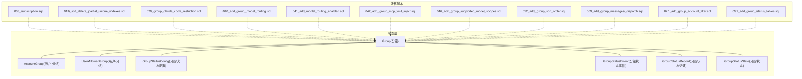
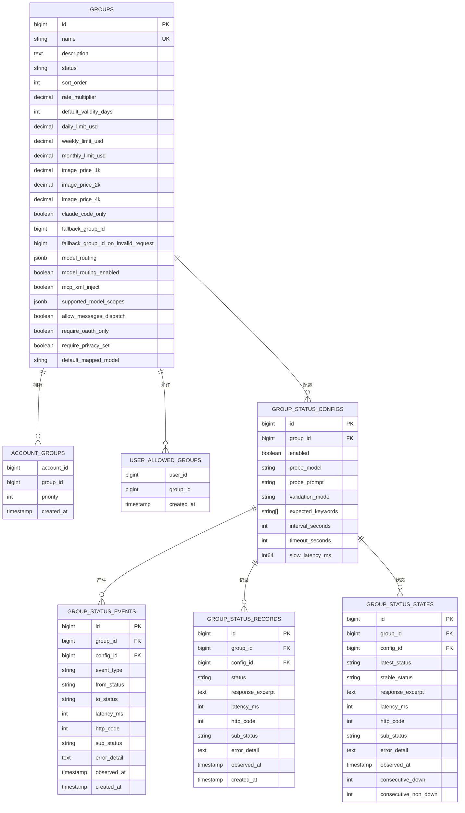
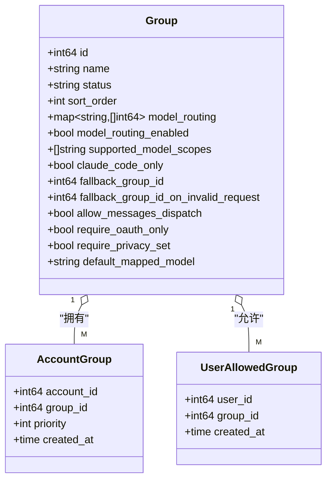
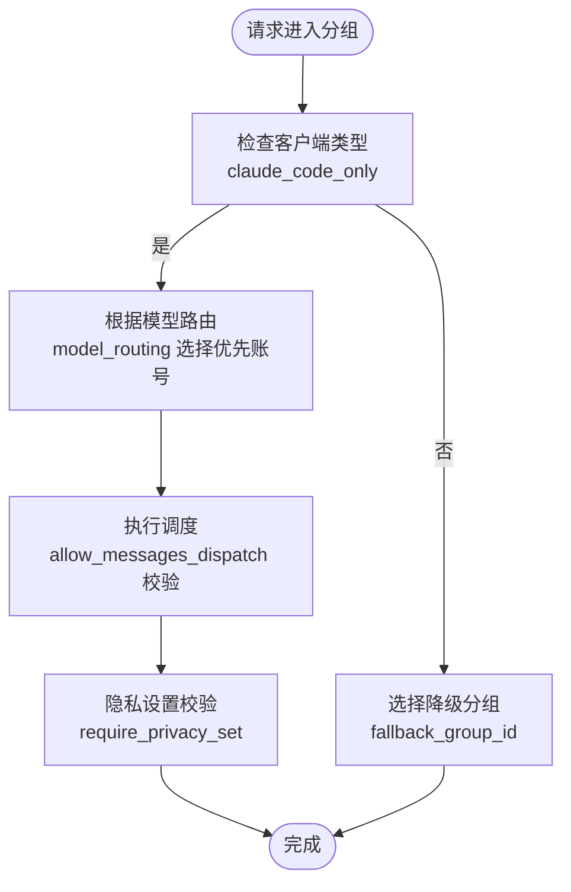
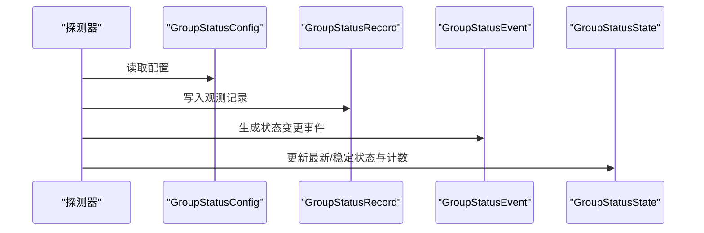
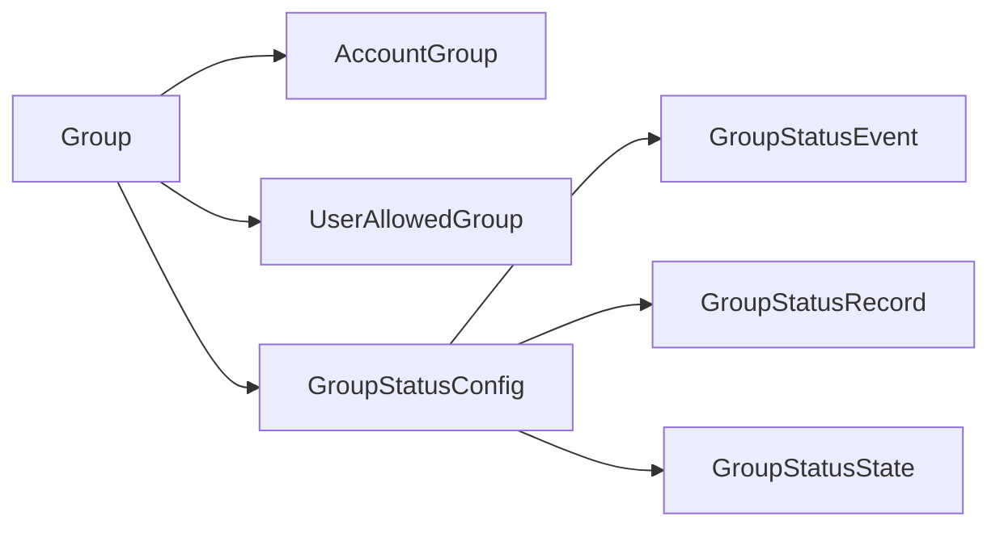

# 用户组表设计

<cite>
**本文档引用的文件**
- [backend/ent/schema/group.go](file://backend/ent/schema/group.go)
- [backend/ent/group/group.go](file://backend/ent/group/group.go)
- [backend/ent/group.go](file://backend/ent/group.go)
- [backend/ent/accountgroup/accountgroup.go](file://backend/ent/accountgroup/accountgroup.go)
- [backend/ent/userallowedgroup/userallowedgroup.go](file://backend/ent/userallowedgroup/userallowedgroup.go)
- [backend/ent/groupstatusconfig/groupstatusconfig.go](file://backend/ent/groupstatusconfig/groupstatusconfig.go)
- [backend/ent/groupstatusevent/groupstatusevent.go](file://backend/ent/groupstatusevent/groupstatusevent.go)
- [backend/ent/groupstatusrecord/groupstatusrecord.go](file://backend/ent/groupstatusrecord/groupstatusrecord.go)
- [backend/ent/groupstatusstate/groupstatusstate.go](file://backend/ent/groupstatusstate/groupstatusstate.go)
- [backend/migrations/003_subscription.sql](file://backend/migrations/003_subscription.sql)
- [backend/migrations/016_soft_delete_partial_unique_indexes.sql](file://backend/migrations/016_soft_delete_partial_unique_indexes.sql)
- [backend/migrations/029_group_claude_code_restriction.sql](file://backend/migrations/029_group_claude_code_restriction.sql)
- [backend/migrations/040_add_group_model_routing.sql](file://backend/migrations/040_add_group_model_routing.sql)
- [backend/migrations/041_add_model_routing_enabled.sql](file://backend/migrations/041_add_model_routing_enabled.sql)
- [backend/migrations/042_add_group_mcp_xml_inject.sql](file://backend/migrations/042_add_group_mcp_xml_inject.sql)
- [backend/migrations/046_add_group_supported_model_scopes.sql](file://backend/migrations/046_add_group_supported_model_scopes.sql)
- [backend/migrations/052_add_group_sort_order.sql](file://backend/migrations/052_add_group_sort_order.sql)
- [backend/migrations/069_add_group_messages_dispatch.sql](file://backend/migrations/069_add_group_messages_dispatch.sql)
- [backend/migrations/071_add_group_account_filter.sql](file://backend/migrations/071_add_group_account_filter.sql)
- [backend/migrations/091_add_group_status_tables.sql](file://backend/migrations/091_add_group_status_tables.sql)
</cite>

## 目录
1. [简介](#简介)
2. [项目结构](#项目结构)
3. [核心组件](#核心组件)
4. [架构概览](#架构概览)
5. [详细组件分析](#详细组件分析)
6. [依赖关系分析](#依赖关系分析)
7. [性能考虑](#性能考虑)
8. [故障排查指南](#故障排查指南)
9. [结论](#结论)

## 简介
本文件系统性梳理用户组表设计，围绕 groups 表的完整结构展开，包括组标识、名称、描述、状态、排序等核心字段；阐述用户组的层级化组织关系；解释组权限体系（访问控制、资源分配、策略继承）；分析组容量管理（用户数量上限、资源使用配额）；提供组路由配置（模型映射、负载均衡、故障转移策略）；说明组状态监控（健康状况与性能指标追踪）；并阐明与用户表、账户表的关联关系及权限继承与覆盖机制。

## 项目结构
用户组相关的核心文件分布于 ent 模型层与迁移脚本中，形成“模型定义 + 数据演进”的双轨设计：
- 模型定义：在 schema 层定义 groups 表结构与索引、边关系；在 ent 生成层提供查询、更新、排序等能力
- 迁移脚本：按版本演进添加订阅、路由、状态监控等特性字段与索引
- 关联实体：账户-分组多对多、用户-分组多对多、分组状态配置/事件/记录/状态表

**图表来源**
- [backend/ent/schema/group.go:17-175](file://backend/ent/schema/group.go#L17-L175)
- [backend/ent/groupstatusconfig/groupstatusconfig.go:11-40](file://backend/ent/groupstatusconfig/groupstatusconfig.go#L11-L40)
- [backend/ent/groupstatusevent/groupstatusevent.go:11-40](file://backend/ent/groupstatusevent/groupstatusevent.go#L11-L40)
- [backend/ent/groupstatusrecord/groupstatusrecord.go:11-40](file://backend/ent/groupstatusrecord/groupstatusrecord.go#L11-L40)
- [backend/ent/groupstatusstate/groupstatusstate.go:11-46](file://backend/ent/groupstatusstate/groupstatusstate.go#L11-L46)

**章节来源**
- [backend/ent/schema/group.go:17-175](file://backend/ent/schema/group.go#L17-L175)
- [backend/ent/group/group.go:13-189](file://backend/ent/group/group.go#L13-L189)
- [backend/ent/group.go:16-83](file://backend/ent/group.go#L16-L83)

## 核心组件
本节聚焦 groups 表的核心字段与语义，涵盖标识、元信息、订阅与配额、图片计费、客户端限制、模型路由、排序、OpenAI 调度配置等。

- 标识与时间戳
  - id：自增主键
  - created_at、updated_at、deleted_at：软删除支持的时间戳
- 元信息
  - name：唯一约束（结合软删除索引），最大长度限制
  - description：文本描述
  - status：状态，默认激活
  - sort_order：排序字段，数值越小越靠前
- 计费与配额
  - rate_multiplier：费率倍数
  - daily_limit_usd、weekly_limit_usd、monthly_limit_usd：日/周/月限额（decimal）
  - default_validity_days：默认有效期天数
- 图片计费（antigravity/gemini 平台）
  - image_price_1k、image_price_2k、image_price_4k：每千张图片价格
- 客户端限制（Claude Code）
  - claude_code_only：仅允许 Claude Code 客户端
  - fallback_group_id：非 Claude Code 请求降级使用的分组 ID
  - fallback_group_id_on_invalid_request：无效请求兜底使用的分组 ID
- 模型路由
  - model_routing：JSONB，模型模式 → 优先账号ID列表
  - model_routing_enabled：是否启用模型路由
- MCP 注入
  - mcp_xml_inject：是否注入 MCP XML 提示词（antigravity 平台）
- 支持的模型系列
  - supported_model_scopes：JSONB，如 ["claude","gemini_text","gemini_image"]
- OpenAI 调度配置
  - allow_messages_dispatch：是否允许 /v1/messages 调度到此分组
  - require_oauth_only：仅允许非 apikey 类型账号关联
  - require_privacy_set：调度时仅允许 privacy 成功设置的账号
  - default_mapped_model：默认映射模型 ID（账号级映射缺失时使用）

上述字段均在 schema 层定义，并通过迁移脚本逐步演进，确保兼容性与扩展性。

**章节来源**
- [backend/ent/schema/group.go:34-144](file://backend/ent/schema/group.go#L34-L144)
- [backend/migrations/003_subscription.sql](file://backend/migrations/003_subscription.sql)
- [backend/migrations/016_soft_delete_partial_unique_indexes.sql](file://backend/migrations/016_soft_delete_partial_unique_indexes.sql)
- [backend/migrations/029_group_claude_code_restriction.sql](file://backend/migrations/029_group_claude_code_restriction.sql)
- [backend/migrations/040_add_group_model_routing.sql](file://backend/migrations/040_add_group_model_routing.sql)
- [backend/migrations/041_add_model_routing_enabled.sql](file://backend/migrations/041_add_model_routing_enabled.sql)
- [backend/migrations/042_add_group_mcp_xml_inject.sql](file://backend/migrations/042_add_group_mcp_xml_inject.sql)
- [backend/migrations/046_add_group_supported_model_scopes.sql](file://backend/migrations/046_add_group_supported_model_scopes.sql)
- [backend/migrations/052_add_group_sort_order.sql](file://backend/migrations/052_add_group_sort_order.sql)
- [backend/migrations/069_add_group_messages_dispatch.sql](file://backend/migrations/069_add_group_messages_dispatch.sql)

## 架构概览
用户组在数据模型层面体现为“中心节点”，通过多对多关系连接账户与用户，并通过状态表支撑健康监控与告警。下图展示核心实体与关系：

**图表来源**
- [backend/ent/schema/group.go:17-175](file://backend/ent/schema/group.go#L17-L175)
- [backend/ent/groupstatusconfig/groupstatusconfig.go:11-40](file://backend/ent/groupstatusconfig/groupstatusconfig.go#L11-L40)
- [backend/ent/groupstatusevent/groupstatusevent.go:11-40](file://backend/ent/groupstatusevent/groupstatusevent.go#L11-L40)
- [backend/ent/groupstatusrecord/groupstatusrecord.go:11-40](file://backend/ent/groupstatusrecord/groupstatusrecord.go#L11-L40)
- [backend/ent/groupstatusstate/groupstatusstate.go:11-46](file://backend/ent/groupstatusstate/groupstatusstate.go#L11-L46)

## 详细组件分析

### 组字段与索引设计
- 唯一性与软删除
  - name 字段通过部分索引（WHERE deleted_at IS NULL）实现唯一性，支持软删除后的名称重用
- 常用过滤索引
  - status、platform、subscription_type、is_exclusive、deleted_at、sort_order
- 字段类型与精度
  - 金额类字段采用 decimal 以避免浮点误差
  - JSONB 存储模型路由与支持的模型系列，便于灵活扩展
- 排序与显示
  - sort_order 数值越小越靠前，用于界面展示顺序控制

**章节来源**
- [backend/ent/schema/group.go:34-174](file://backend/ent/schema/group.go#L34-L174)
- [backend/migrations/016_soft_delete_partial_unique_indexes.sql](file://backend/migrations/016_soft_delete_partial_unique_indexes.sql)

### 组与账户/用户的关联关系
- 账户-分组（AccountGroup）
  - 多对多关系，通过中间表维护账户与分组的绑定，支持优先级字段
  - 查询时可按优先级排序，实现“优先账号”路由策略
- 用户-分组（UserAllowedGroup）
  - 多对多关系，用于限制特定用户可访问的分组集合
- 边关系定义
  - Group 与 Account 通过 AccountGroup 中间表建立 M2M 关系
  - Group 与 User 通过 UserAllowedGroup 中间表建立 M2M 关系

**图表来源**
- [backend/ent/schema/group.go:147-162](file://backend/ent/schema/group.go#L147-L162)
- [backend/ent/accountgroup/accountgroup.go:12-47](file://backend/ent/accountgroup/accountgroup.go#L12-L47)
- [backend/ent/userallowedgroup/userallowedgroup.go:12-45](file://backend/ent/userallowedgroup/userallowedgroup.go#L12-L45)

**章节来源**
- [backend/ent/schema/group.go:147-162](file://backend/ent/schema/group.go#L147-L162)
- [backend/ent/accountgroup/accountgroup.go:12-47](file://backend/ent/accountgroup/accountgroup.go#L12-L47)
- [backend/ent/userallowedgroup/userallowedgroup.go:12-45](file://backend/ent/userallowedgroup/userallowedgroup.go#L12-L45)

### 组权限体系与继承覆盖
- 访问控制
  - UserAllowedGroup 限定用户可访问的分组集合，实现“白名单式”访问控制
- 资源分配
  - 通过 rate_multiplier、限额字段（daily/weekly/monthly）、图片计费字段进行资源定价与用量控制
- 策略继承
  - 模型路由（model_routing）与支持的模型系列（supported_model_scopes）在分组层面统一配置，账号级可覆盖
  - OpenAI 调度策略（allow_messages_dispatch、require_oauth_only、require_privacy_set、default_mapped_model）在分组层面统一约束，账号级可覆盖
- 客户端限制
  - claude_code_only 与 fallback_group_id/fallback_group_id_on_invalid_request 提供客户端能力与兜底策略

**章节来源**
- [backend/ent/schema/group.go:45-144](file://backend/ent/schema/group.go#L45-L144)
- [backend/migrations/029_group_claude_code_restriction.sql](file://backend/migrations/029_group_claude_code_restriction.sql)
- [backend/migrations/040_add_group_model_routing.sql](file://backend/migrations/040_add_group_model_routing.sql)
- [backend/migrations/041_add_model_routing_enabled.sql](file://backend/migrations/041_add_model_routing_enabled.sql)
- [backend/migrations/042_add_group_mcp_xml_inject.sql](file://backend/migrations/042_add_group_mcp_xml_inject.sql)
- [backend/migrations/046_add_group_supported_model_scopes.sql](file://backend/migrations/046_add_group_supported_model_scopes.sql)
- [backend/migrations/069_add_group_messages_dispatch.sql](file://backend/migrations/069_add_group_messages_dispatch.sql)

### 组容量管理
- 用户数量上限
  - 通过 UserAllowedGroup 的“白名单”机制间接控制用户访问范围，但未直接在分组表上设置用户数量上限字段
- 资源使用配额
  - 日/周/月限额（daily_limit_usd、weekly_limit_usd、monthly_limit_usd）与图片计费（image_price_1k/2k/4k）构成配额与计费体系
  - default_validity_days 控制默认有效期，配合限额实现周期性配额重置

**章节来源**
- [backend/ent/schema/group.go:61-74](file://backend/ent/schema/group.go#L61-L74)
- [backend/migrations/003_subscription.sql](file://backend/migrations/003_subscription.sql)

### 组路由配置
- 模型映射
  - model_routing：模型模式 → 优先账号ID列表，支持账号级覆盖
  - supported_model_scopes：分组支持的模型系列，账号级可进一步筛选
- 负载均衡与故障转移
  - 通过优先账号列表实现“优先账号”负载均衡
  - fallback_group_id 与 fallback_group_id_on_invalid_request 提供非 Claude Code 与无效请求的兜底策略
- OpenAI 调度
  - allow_messages_dispatch 控制是否允许 /v1/messages 调度
  - require_oauth_only 与 require_privacy_set 在调度阶段进行前置校验
  - default_mapped_model 作为账号级映射缺失时的默认回退

**图表来源**
- [backend/ent/schema/group.go:94-144](file://backend/ent/schema/group.go#L94-L144)
- [backend/migrations/029_group_claude_code_restriction.sql](file://backend/migrations/029_group_claude_code_restriction.sql)
- [backend/migrations/040_add_group_model_routing.sql](file://backend/migrations/040_add_group_model_routing.sql)
- [backend/migrations/069_add_group_messages_dispatch.sql](file://backend/migrations/069_add_group_messages_dispatch.sql)

**章节来源**
- [backend/ent/schema/group.go:103-144](file://backend/ent/schema/group.go#L103-L144)

### 组状态监控
- 配置（GroupStatusConfig）
  - 启用开关、探针模型、探针提示、验证模式、关键词、轮询间隔、超时、慢延迟阈值
- 事件（GroupStatusEvent）
  - 记录状态变更事件，包含事件类型、起止状态、延迟、HTTP 码、子状态、错误详情
- 记录（GroupStatusRecord）
  - 周期性记录观测结果，包含状态、响应摘要、延迟、HTTP 码、子状态、错误详情
- 状态（GroupStatusState）
  - 维护最新状态、稳定状态、连续上下线计数等聚合信息

**图表来源**
- [backend/ent/groupstatusconfig/groupstatusconfig.go:11-40](file://backend/ent/groupstatusconfig/groupstatusconfig.go#L11-L40)
- [backend/ent/groupstatusevent/groupstatusevent.go:11-40](file://backend/ent/groupstatusevent/groupstatusevent.go#L11-L40)
- [backend/ent/groupstatusrecord/groupstatusrecord.go:11-40](file://backend/ent/groupstatusrecord/groupstatusrecord.go#L11-L40)
- [backend/ent/groupstatusstate/groupstatusstate.go:11-46](file://backend/ent/groupstatusstate/groupstatusstate.go#L11-L46)

**章节来源**
- [backend/ent/groupstatusconfig/groupstatusconfig.go:11-91](file://backend/ent/groupstatusconfig/groupstatusconfig.go#L11-L91)
- [backend/ent/groupstatusevent/groupstatusevent.go:11-141](file://backend/ent/groupstatusevent/groupstatusevent.go#L11-L141)
- [backend/ent/groupstatusrecord/groupstatusrecord.go:11-129](file://backend/ent/groupstatusrecord/groupstatusrecord.go#L11-L129)
- [backend/ent/groupstatusstate/groupstatusstate.go:11-173](file://backend/ent/groupstatusstate/groupstatusstate.go#L11-L173)
- [backend/migrations/091_add_group_status_tables.sql](file://backend/migrations/091_add_group_status_tables.sql)

## 依赖关系分析
- 组件耦合
  - Group 与 AccountGroup、UserAllowedGroup 通过中间表解耦，降低直接外键复杂度
  - 分组状态监控表独立于主表，通过 group_id/config_id 引用，避免状态逻辑侵入业务表
- 外部依赖
  - JSONB 字段依赖数据库 JSONB 类型（PostgreSQL）
  - decimal 字段依赖数据库 decimal 精度类型
- 索引与查询
  - 多字段组合索引服务于高频过滤场景（status、platform、subscription_type、is_exclusive、sort_order）
  - 通过 OrderOption 提供排序便捷入口

**图表来源**
- [backend/ent/schema/group.go:147-162](file://backend/ent/schema/group.go#L147-L162)
- [backend/ent/groupstatusconfig/groupstatusconfig.go:11-40](file://backend/ent/groupstatusconfig/groupstatusconfig.go#L11-L40)
- [backend/ent/groupstatusevent/groupstatusevent.go:11-40](file://backend/ent/groupstatusevent/groupstatusevent.go#L11-L40)
- [backend/ent/groupstatusrecord/groupstatusrecord.go:11-40](file://backend/ent/groupstatusrecord/groupstatusrecord.go#L11-L40)
- [backend/ent/groupstatusstate/groupstatusstate.go:11-46](file://backend/ent/groupstatusstate/groupstatusstate.go#L11-L46)

**章节来源**
- [backend/ent/group/group.go:257-398](file://backend/ent/group/group.go#L257-L398)

## 性能考虑
- 索引优化
  - 为高频过滤字段建立复合索引，减少全表扫描
  - sort_order 索引支持前端排序展示的高效查询
- JSONB 查询
  - model_routing 与 supported_model_scopes 使用 JSONB，建议在应用层进行结构化处理，避免复杂条件导致的索引失效
- 软删除与唯一性
  - 通过部分索引实现软删除后的唯一性，避免重建索引带来的性能损耗
- 状态监控
  - 采用周期性记录与事件分离，降低实时写入压力

## 故障排查指南
- 常见问题定位
  - 客户端无法访问：检查 UserAllowedGroup 白名单与 claude_code_only 配置
  - 路由异常：核对 model_routing 与 model_routing_enabled，确认优先账号是否存在
  - OpenAI 调度失败：检查 allow_messages_dispatch、require_oauth_only、require_privacy_set
  - 状态异常：查看 GroupStatusEvent/Record/State 中的错误详情与子状态
- 排查步骤
  1) 确认分组状态与配置（GroupStatusConfig）
  2) 查看最近记录与事件（GroupStatusRecord/Event）
  3) 核对状态聚合（GroupStatusState）中的连续上下线计数
  4) 检查路由与权限配置（model_routing、UserAllowedGroup、AccountGroup）

**章节来源**
- [backend/ent/groupstatusevent/groupstatusevent.go:68-77](file://backend/ent/groupstatusevent/groupstatusevent.go#L68-L77)
- [backend/ent/groupstatusrecord/groupstatusrecord.go:65-70](file://backend/ent/groupstatusrecord/groupstatusrecord.go#L65-L70)
- [backend/ent/groupstatusstate/groupstatusstate.go:77-94](file://backend/ent/groupstatusstate/groupstatusstate.go#L77-L94)

## 结论
用户组表设计以“中心分组 + 中间表关联 + 状态监控”为核心，既满足了多维度权限控制与资源配额管理，又提供了灵活的路由与调度能力。通过迁移脚本的持续演进，逐步完善了订阅、路由、客户端限制、模型映射与状态监控等关键能力。建议在实际部署中：
- 明确分组边界与权限白名单，避免过度授权
- 合理设置限额与有效期，结合图片计费策略控制成本
- 利用模型路由与优先账号实现负载均衡与故障转移
- 建立完善的监控告警机制，及时发现并处置异常