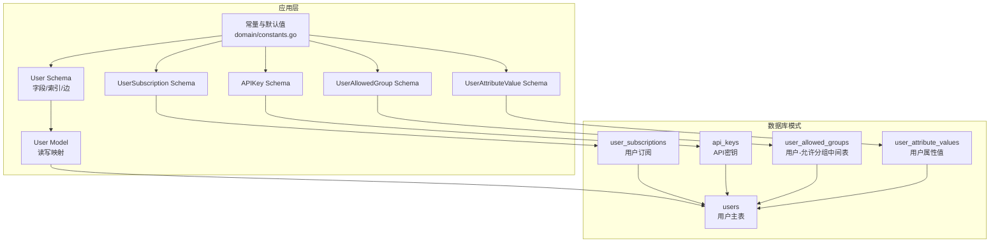
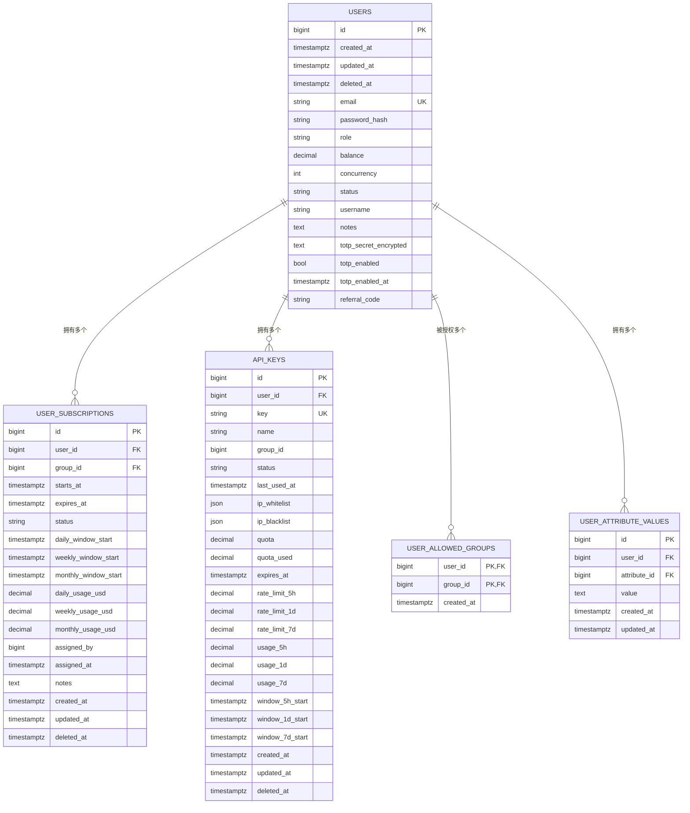
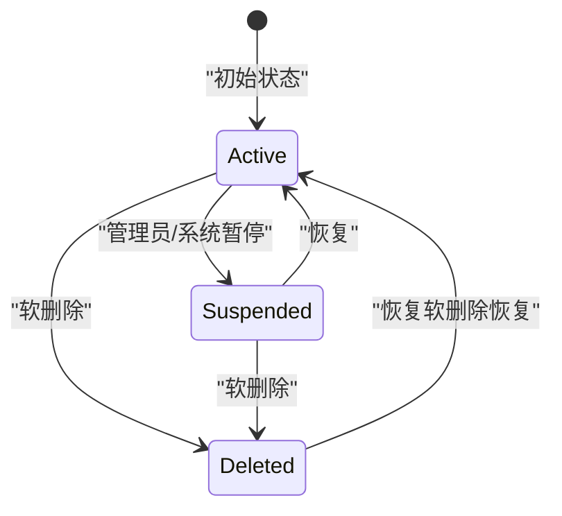
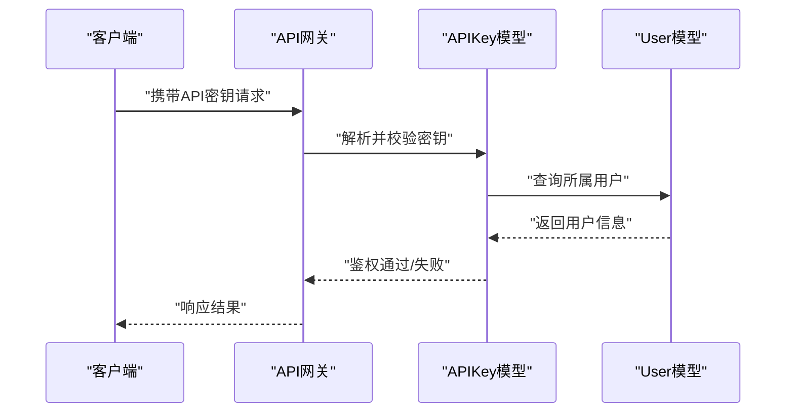
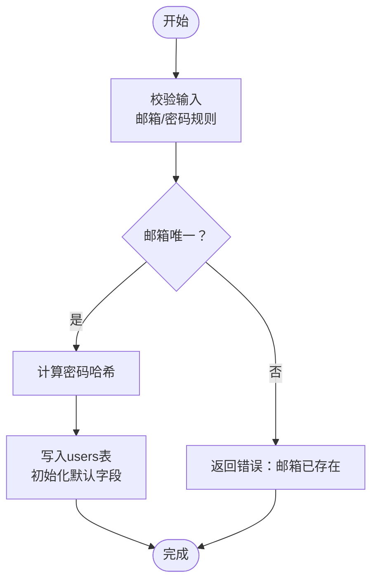
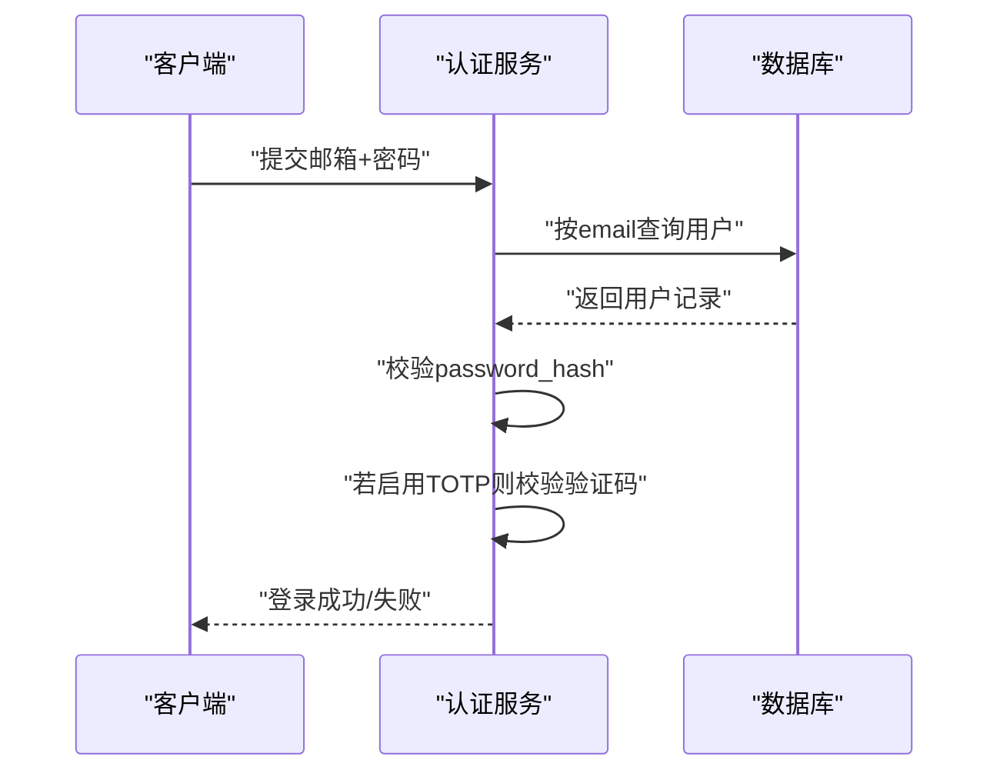
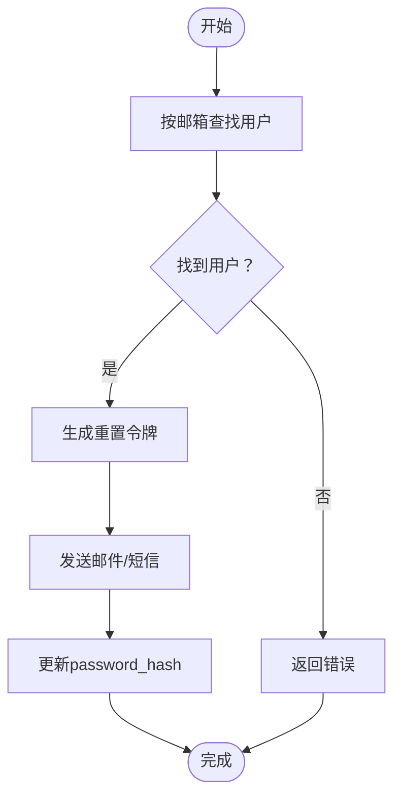
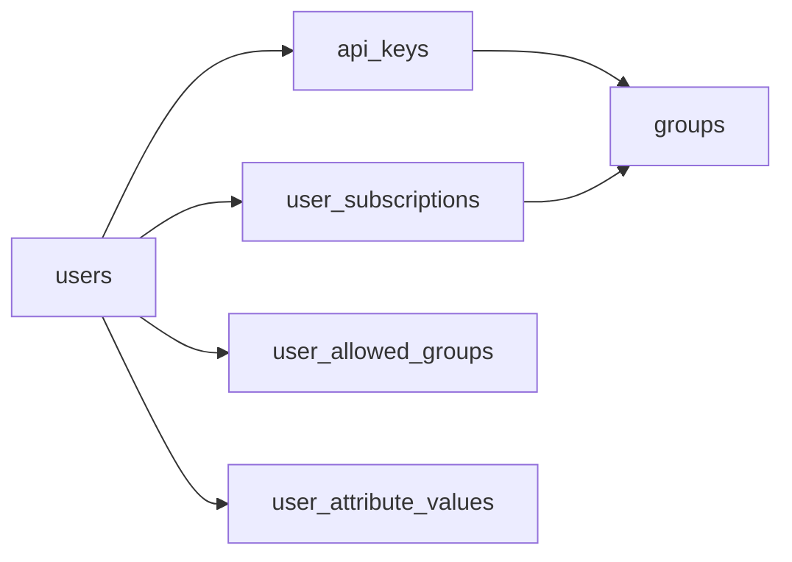

# 用户表设计

<cite>
**本文引用的文件**
- [backend/ent/schema/user.go](file://backend/ent/schema/user.go)
- [backend/ent/user.go](file://backend/ent/user.go)
- [backend/ent/schema/user_subscription.go](file://backend/ent/schema/user_subscription.go)
- [backend/ent/apikey.go](file://backend/ent/apikey.go)
- [backend/ent/schema/user_allowed_group.go](file://backend/ent/schema/user_allowed_group.go)
- [backend/ent/schema/user_attribute_value.go](file://backend/ent/schema/user_attribute_value.go)
- [backend/internal/domain/constants.go](file://backend/internal/domain/constants.go)
- [backend/migrations/016_soft_delete_partial_unique_indexes.sql](file://backend/migrations/016_soft_delete_partial_unique_indexes.sql)
- [backend/migrations/044_add_user_totp.sql](file://backend/migrations/044_add_user_totp.sql)
- [backend/migrations/019_migrate_wechat_to_attributes.sql](file://backend/migrations/019_migrate_wechat_to_attributes.sql)
- [backend/migrations/018_user_attributes.sql](file://backend/migrations/018_user_attributes.sql)
- [backend/migrations/001_init.sql](file://backend/migrations/001_init.sql)
</cite>

## 目录
1. [简介](#简介)
2. [项目结构](#项目结构)
3. [核心组件](#核心组件)
4. [架构总览](#架构总览)
5. [详细组件分析](#详细组件分析)
6. [依赖分析](#依赖分析)
7. [性能考虑](#性能考虑)
8. [故障排查指南](#故障排查指南)
9. [结论](#结论)
10. [附录](#附录)

## 简介
本文件系统化梳理用户表（users）的设计与实现，覆盖字段定义、数据类型与约束、生命周期管理（激活/禁用/软删除）、认证相关字段（密码哈希、TOTP）、权限与分组关联、以及与API密钥表（api_keys）和订阅表（user_subscriptions）的外键关系。同时给出典型业务流程（注册、登录、密码重置）的数据流转示意，并提供性能优化建议与常见问题排查要点。

## 项目结构
用户表结构由 Ent Schema 定义并通过迁移脚本落地到数据库。关键文件如下：
- 用户实体定义：backend/ent/schema/user.go
- 用户模型生成：backend/ent/user.go
- 订阅实体定义：backend/ent/schema/user_subscription.go
- API密钥实体定义：backend/ent/apikey.go
- 用户允许分组中间表：backend/ent/schema/user_allowed_group.go
- 用户属性值实体：backend/ent/schema/user_attribute_value.go
- 默认常量与枚举：backend/internal/domain/constants.go
- 关键迁移脚本：001_init.sql、016_soft_delete_partial_unique_indexes.sql、044_add_user_totp.sql、019_migrate_wechat_to_attributes.sql、018_user_attributes.sql

**图表来源**
- [backend/ent/schema/user.go:16-107](file://backend/ent/schema/user.go#L16-L107)
- [backend/ent/user.go:15-54](file://backend/ent/user.go#L15-L54)
- [backend/ent/schema/user_subscription.go:18-120](file://backend/ent/schema/user_subscription.go#L18-L120)
- [backend/ent/apikey.go:18-73](file://backend/ent/apikey.go#L18-L73)
- [backend/ent/schema/user_allowed_group.go:15-58](file://backend/ent/schema/user_allowed_group.go#L15-L58)
- [backend/ent/schema/user_attribute_value.go:14-75](file://backend/ent/schema/user_attribute_value.go#L14-L75)
- [backend/internal/domain/constants.go:4-66](file://backend/internal/domain/constants.go#L4-L66)

**章节来源**
- [backend/ent/schema/user.go:16-107](file://backend/ent/schema/user.go#L16-L107)
- [backend/ent/user.go:15-54](file://backend/ent/user.go#L15-L54)
- [backend/ent/schema/user_subscription.go:18-120](file://backend/ent/schema/user_subscription.go#L18-L120)
- [backend/ent/apikey.go:18-73](file://backend/ent/apikey.go#L18-L73)
- [backend/ent/schema/user_allowed_group.go:15-58](file://backend/ent/schema/user_allowed_group.go#L15-L58)
- [backend/ent/schema/user_attribute_value.go:14-75](file://backend/ent/schema/user_attribute_value.go#L14-L75)
- [backend/internal/domain/constants.go:4-66](file://backend/internal/domain/constants.go#L4-L66)

## 核心组件
- 用户主表 users：承载用户身份、认证、计费、安全与基础资料。
- 订阅表 user_subscriptions：记录用户对分组的订阅关系及配额使用。
- API密钥表 api_keys：为用户颁发密钥并进行用量与限流控制。
- 用户允许分组中间表 user_allowed_groups：多对多授权关系替代数组列。
- 用户属性值表 user_attribute_values：扩展用户资料（如微信等历史字段迁移）。

**章节来源**
- [backend/ent/schema/user.go:16-107](file://backend/ent/schema/user.go#L16-L107)
- [backend/ent/schema/user_subscription.go:18-120](file://backend/ent/schema/user_subscription.go#L18-L120)
- [backend/ent/apikey.go:18-73](file://backend/ent/apikey.go#L18-L73)
- [backend/ent/schema/user_allowed_group.go:15-58](file://backend/ent/schema/user_allowed_group.go#L15-L58)
- [backend/ent/schema/user_attribute_value.go:14-75](file://backend/ent/schema/user_attribute_value.go#L14-L75)

## 架构总览
用户表在应用层通过 Ent Schema 描述，在数据库层通过迁移脚本创建；通过外键与中间表建立与订阅、API密钥、分组、属性值的关联。

**图表来源**
- [backend/ent/schema/user.go:34-81](file://backend/ent/schema/user.go#L34-L81)
- [backend/ent/schema/user_subscription.go:36-83](file://backend/ent/schema/user_subscription.go#L36-L83)
- [backend/ent/apikey.go:18-73](file://backend/ent/apikey.go#L18-L73)
- [backend/ent/schema/user_allowed_group.go:29-38](file://backend/ent/schema/user_allowed_group.go#L29-L38)
- [backend/ent/schema/user_attribute_value.go:35-48](file://backend/ent/schema/user_attribute_value.go#L35-L48)

## 详细组件分析

### 用户表 users 字段设计与约束
- 主键与时间戳
  - id：自增主键（bigint）
  - created_at/updated_at/deleted_at：时间戳（含软删除）
- 身份与认证
  - email：字符串，最大长度 255，非空，唯一（配合部分索引实现软删除后的重用）
  - password_hash：字符串，最大长度 255，非空
- 角色与状态
  - role：字符串，最大长度 20，默认值“user”
  - status：字符串，最大长度 20，默认值“active”
- 计费与并发
  - balance：数值类型（Postgres decimal(20,8)，默认 0）
  - concurrency：整数，默认 5
- 资料与备注
  - username：字符串，最大长度 100，默认空串
  - notes：文本，默认空串
- 安全与认证增强
  - totp_secret_encrypted：文本，可空，用于TOTP密钥加密存储
  - totp_enabled：布尔，默认 false
  - totp_enabled_at：时间戳，可空
- 推荐码
  - referral_code：字符串，最大长度 32，默认空串
- 边与索引
  - 边：api_keys、redeem_codes、subscriptions、assigned_subscriptions、announcement_reads、allowed_groups、usage_logs、attribute_values、promo_code_usages、referrals_made、referral_received
  - 索引：status、deleted_at；email 在迁移中通过部分唯一索引保证唯一性

字段约束与默认值来源：
- 默认值与类型定义见用户 Schema 的 Fields 部分
- 部分唯一索引（软删除后重用 email）见迁移 016
- TOTP 字段见迁移 044
- 历史微信字段迁移至属性值见迁移 019 与 018

**章节来源**
- [backend/ent/schema/user.go:34-81](file://backend/ent/schema/user.go#L34-L81)
- [backend/ent/schema/user.go:83-107](file://backend/ent/schema/user.go#L83-L107)
- [backend/ent/user.go:15-54](file://backend/ent/user.go#L15-L54)
- [backend/internal/domain/constants.go:4-66](file://backend/internal/domain/constants.go#L4-L66)
- [backend/migrations/016_soft_delete_partial_unique_indexes.sql](file://backend/migrations/016_soft_delete_partial_unique_indexes.sql)
- [backend/migrations/044_add_user_totp.sql](file://backend/migrations/044_add_user_totp.sql)
- [backend/migrations/019_migrate_wechat_to_attributes.sql](file://backend/migrations/019_migrate_wechat_to_attributes.sql)
- [backend/migrations/018_user_attributes.sql](file://backend/migrations/018_user_attributes.sql)

### 用户生命周期管理
- 激活/禁用/删除
  - 激活/禁用：通过 status 字段切换（默认 active）
  - 删除：采用软删除（deleted_at），结合部分唯一索引实现 email 在软删除后可重用
- 订阅与用量
  - 通过 user_subscriptions 记录有效期、窗口起始时间与已用额度
- 并发与配额
  - concurrency 控制并发会话数
  - API 密钥支持按 5 小时/日/周窗口计量与配额

**图表来源**
- [backend/ent/schema/user.go:52-54](file://backend/ent/schema/user.go#L52-L54)
- [backend/ent/schema/user_subscription.go:45-47](file://backend/ent/schema/user_subscription.go#L45-L47)
- [backend/migrations/016_soft_delete_partial_unique_indexes.sql](file://backend/migrations/016_soft_delete_partial_unique_indexes.sql)

**章节来源**
- [backend/ent/schema/user.go:52-54](file://backend/ent/schema/user.go#L52-L54)
- [backend/ent/schema/user_subscription.go:45-47](file://backend/ent/schema/user_subscription.go#L45-L47)
- [backend/migrations/016_soft_delete_partial_unique_indexes.sql](file://backend/migrations/016_soft_delete_partial_unique_indexes.sql)

### 认证与安全字段
- 密码哈希存储
  - password_hash 字段存储经安全算法处理的哈希值，长度限制 255，非空
- 邮箱验证状态
  - 当前 Schema 未显式声明邮箱验证字段；若需邮箱验证，可在迁移中新增相应字段
- 两步验证（TOTP）
  - totp_secret_encrypted：存储加密后的 TOTP 秘钥
  - totp_enabled：是否启用
  - totp_enabled_at：启用时间
- 推荐码
  - referral_code：用于推荐关系追踪

**章节来源**
- [backend/ent/schema/user.go:41-43](file://backend/ent/schema/user.go#L41-L43)
- [backend/ent/schema/user.go:65-74](file://backend/ent/schema/user.go#L65-L74)
- [backend/migrations/044_add_user_totp.sql](file://backend/migrations/044_add_user_totp.sql)

### 权限体系与角色
- 角色字段 role
  - 类型：字符串，最大长度 20
  - 默认值：domain.RoleUser（“user”）
- 分组授权
  - 通过 user_allowed_groups 中间表授予用户对特定分组的访问权限
  - 该表以 (user_id, group_id) 作为联合主键，确保唯一性
- 属性扩展
  - user_attribute_values 支持动态扩展用户属性（如历史微信字段迁移）

**章节来源**
- [backend/ent/schema/user.go:44-46](file://backend/ent/schema/user.go#L44-L46)
- [backend/internal/domain/constants.go](file://backend/internal/domain/constants.go#L15)
- [backend/ent/schema/user_allowed_group.go:21-26](file://backend/ent/schema/user_allowed_group.go#L21-L26)
- [backend/ent/schema/user_attribute_value.go:35-48](file://backend/ent/schema/user_attribute_value.go#L35-L48)
- [backend/migrations/019_migrate_wechat_to_attributes.sql](file://backend/migrations/019_migrate_wechat_to_attributes.sql)
- [backend/migrations/018_user_attributes.sql](file://backend/migrations/018_user_attributes.sql)

### 与 API 密钥表的关系
- 外键关系
  - api_keys.user_id → users.id（一对一/多对多）
  - api_keys.group_id → groups.id（可空，表示全局或分组级）
- 用量与限流
  - 支持按 5 小时/日/周窗口计量与配额控制
  - 支持 IP 白名单/黑名单
- 边加载
  - 用户模型提供 QueryAPIKeys 边查询方法

**图表来源**
- [backend/ent/apikey.go:18-73](file://backend/ent/apikey.go#L18-L73)
- [backend/ent/user.go:337-340](file://backend/ent/user.go#L337-L340)

**章节来源**
- [backend/ent/apikey.go:18-73](file://backend/ent/apikey.go#L18-L73)
- [backend/ent/user.go:337-340](file://backend/ent/user.go#L337-L340)

### 与订阅表的关系
- 外键关系
  - user_subscriptions.user_id → users.id（一对一/多对多）
  - user_subscriptions.group_id → groups.id（一对一/多对多）
  - assigned_by → users.id（可空，记录分配者）
- 状态与有效期
  - status：默认 active，支持 expired/suspended
  - starts_at/expires_at：订阅生效与到期时间
- 使用窗口
  - daily/weekly/monthly_window_start：各周期窗口起始时间
  - 对应 usage_usd 统计

**章节来源**
- [backend/ent/schema/user_subscription.go:36-83](file://backend/ent/schema/user_subscription.go#L36-L83)
- [backend/internal/domain/constants.go:64-66](file://backend/internal/domain/constants.go#L64-L66)

### 典型业务场景数据流

#### 注册（Registration）
- 输入：邮箱、密码明文
- 处理：
  - 校验邮箱唯一性（软删除后可重用，依赖部分唯一索引）
  - 生成 password_hash 存入 users.password_hash
  - 初始化 role=“user”，status=“active”，balance=0，concurrency=5
  - 可选：生成 referral_code
- 输出：创建成功，返回用户标识

**图表来源**
- [backend/ent/schema/user.go:38-43](file://backend/ent/schema/user.go#L38-L43)
- [backend/migrations/016_soft_delete_partial_unique_indexes.sql](file://backend/migrations/016_soft_delete_partial_unique_indexes.sql)
- [backend/internal/domain/constants.go:4-15](file://backend/internal/domain/constants.go#L4-L15)

#### 登录（Login）
- 输入：邮箱、密码
- 处理：
  - 查询 users.email 获取用户
  - 校验 password_hash
  - 若启用 TOTP，进一步校验验证码
- 输出：登录成功返回令牌或会话

**图表来源**
- [backend/ent/schema/user.go:38-43](file://backend/ent/schema/user.go#L38-L43)
- [backend/ent/schema/user.go:65-74](file://backend/ent/schema/user.go#L65-L74)

#### 密码重置（Password Reset）
- 输入：邮箱
- 处理：
  - 校验邮箱是否存在（软删除后可重用）
  - 生成重置令牌并发送
  - 更新 users.password_hash（新密码哈希）
- 输出：重置完成

**图表来源**
- [backend/ent/schema/user.go:38-43](file://backend/ent/schema/user.go#L38-L43)
- [backend/migrations/016_soft_delete_partial_unique_indexes.sql](file://backend/migrations/016_soft_delete_partial_unique_indexes.sql)

## 依赖分析
- 内聚与耦合
  - users 表与 api_keys、user_subscriptions、user_allowed_groups、user_attribute_values 通过外键/中间表形成清晰的低耦合关系
- 外部依赖
  - Postgres 数据类型映射：decimal(20,8)/timestamptz
  - Ent 模型生成器：自动维护扫描/赋值逻辑与边查询
- 循环依赖
  - 无直接循环依赖；通过中间表与边查询避免环状引用

**图表来源**
- [backend/ent/schema/user.go:83-98](file://backend/ent/schema/user.go#L83-L98)
- [backend/ent/schema/user_subscription.go:85-103](file://backend/ent/schema/user_subscription.go#L85-L103)
- [backend/ent/apikey.go:31-36](file://backend/ent/apikey.go#L31-L36)
- [backend/ent/schema/user_allowed_group.go:40-50](file://backend/ent/schema/user_allowed_group.go#L40-L50)
- [backend/ent/schema/user_attribute_value.go:50-65](file://backend/ent/schema/user_attribute_value.go#L50-L65)

**章节来源**
- [backend/ent/schema/user.go:83-98](file://backend/ent/schema/user.go#L83-L98)
- [backend/ent/schema/user_subscription.go:85-103](file://backend/ent/schema/user_subscription.go#L85-L103)
- [backend/ent/apikey.go:31-36](file://backend/ent/apikey.go#L31-L36)
- [backend/ent/schema/user_allowed_group.go:40-50](file://backend/ent/schema/user_allowed_group.go#L40-L50)
- [backend/ent/schema/user_attribute_value.go:50-65](file://backend/ent/schema/user_attribute_value.go#L50-L65)

## 性能考虑
- 索引策略
  - email 使用部分唯一索引（deleted_at IS NULL），支持软删除后重用
  - status、deleted_at 常用于筛选活跃用户与回收站查询
- 数值精度
  - balance 与订阅用量使用 decimal(20,8/10) 保证高精度计费
- 扫描与序列化
  - Ent 模型对 Null 类型字段进行专门扫描/赋值，减少空值处理开销
- 缓存与限流
  - API 密钥支持窗口化用量统计与限流，建议结合缓存降低数据库压力

[本节为通用指导，不直接分析具体文件]

## 故障排查指南
- 邮箱唯一性异常
  - 症状：注册时报邮箱重复
  - 排查：确认是否为软删除用户；检查部分唯一索引是否生效
  - 参考：迁移 016
- 密码校验失败
  - 症状：登录时报错
  - 排查：确认 password_hash 是否正确生成与存储；核对哈希算法一致性
  - 参考：用户 Schema 字段定义
- TOTP 启用异常
  - 症状：启用后仍提示需要验证码
  - 排查：检查 totp_enabled 与 totp_enabled_at 是否正确更新
  - 参考：迁移 044
- API 密钥用量统计异常
  - 症状：用量/配额显示不一致
  - 排查：核对窗口起始时间与当前时间；检查 JSON 序列化/反序列化
  - 参考：APIKey 模型扫描/赋值逻辑

**章节来源**
- [backend/migrations/016_soft_delete_partial_unique_indexes.sql](file://backend/migrations/016_soft_delete_partial_unique_indexes.sql)
- [backend/ent/schema/user.go:38-43](file://backend/ent/schema/user.go#L38-L43)
- [backend/migrations/044_add_user_totp.sql](file://backend/migrations/044_add_user_totp.sql)
- [backend/ent/apikey.go:119-139](file://backend/ent/apikey.go#L119-L139)

## 结论
用户表设计遵循最小必要原则：以 email/password_hash 为核心身份凭证，辅以 role/status 实现基础权限与生命周期管理；通过软删除与部分唯一索引保障数据一致性；借助 API 密钥与订阅表实现精细化用量与配额控制；TOTP 提升账户安全。整体结构清晰、扩展性强，满足从注册到登录再到计费与安全的全链路需求。

[本节为总结性内容，不直接分析具体文件]

## 附录

### 字段清单与约束摘要
- users 表核心字段
  - email：字符串，最大 255，非空，唯一（软删除后可重用）
  - password_hash：字符串，最大 255，非空
  - role：字符串，最大 20，默认“user”
  - status：字符串，最大 20，默认“active”
  - balance：数值，Postgres decimal(20,8)，默认 0
  - concurrency：整数，默认 5
  - username/notes：字符串/文本，默认空串
  - totp_*：TOTP 加密密钥、开关与启用时间
  - referral_code：字符串，最大 32，默认空串
- 外键与索引
  - users.id 主键
  - email 部分唯一索引（deleted_at IS NULL）
  - status、deleted_at 普通索引

**章节来源**
- [backend/ent/schema/user.go:34-81](file://backend/ent/schema/user.go#L34-L81)
- [backend/ent/schema/user.go:100-107](file://backend/ent/schema/user.go#L100-L107)
- [backend/migrations/016_soft_delete_partial_unique_indexes.sql](file://backend/migrations/016_soft_delete_partial_unique_indexes.sql)