# 用户订阅表设计

<cite>
**本文档引用的文件**
- [backend/ent/schema/user_subscription.go](file://backend/ent/schema/user_subscription.go)
- [backend/ent/usersubscription.go](file://backend/ent/usersubscription.go)
- [backend/internal/service/user_subscription.go](file://backend/internal/service/user_subscription.go)
- [backend/internal/repository/user_subscription_repo.go](file://backend/internal/repository/user_subscription_repo.go)
- [backend/internal/handler/subscription_handler.go](file://backend/internal/handler/subscription_handler.go)
- [backend/ent/schema/group.go](file://backend/ent/schema/group.go)
- [backend/internal/domain/constants.go](file://backend/internal/domain/constants.go)
- [backend/internal/service/pricing_service.go](file://backend/internal/service/pricing_service.go)
</cite>

## 目录
1. [简介](#简介)
2. [项目结构](#项目结构)
3. [核心组件](#核心组件)
4. [架构概览](#架构概览)
5. [详细组件分析](#详细组件分析)
6. [依赖关系分析](#依赖关系分析)
7. [性能考虑](#性能考虑)
8. [故障排除指南](#故障排除指南)
9. [结论](#结论)

## 简介

本文档详细分析了用户订阅表设计，深入探讨了user_subscriptions表的完整结构，包括订阅ID、用户ID、订阅计划、状态、开始时间、结束时间、自动续费等核心字段。文档还解释了订阅计划的层级结构，订阅状态管理，计费周期和价格计算机制，以及配额管理设计。

## 项目结构

订阅系统采用分层架构设计，主要包含以下层次：

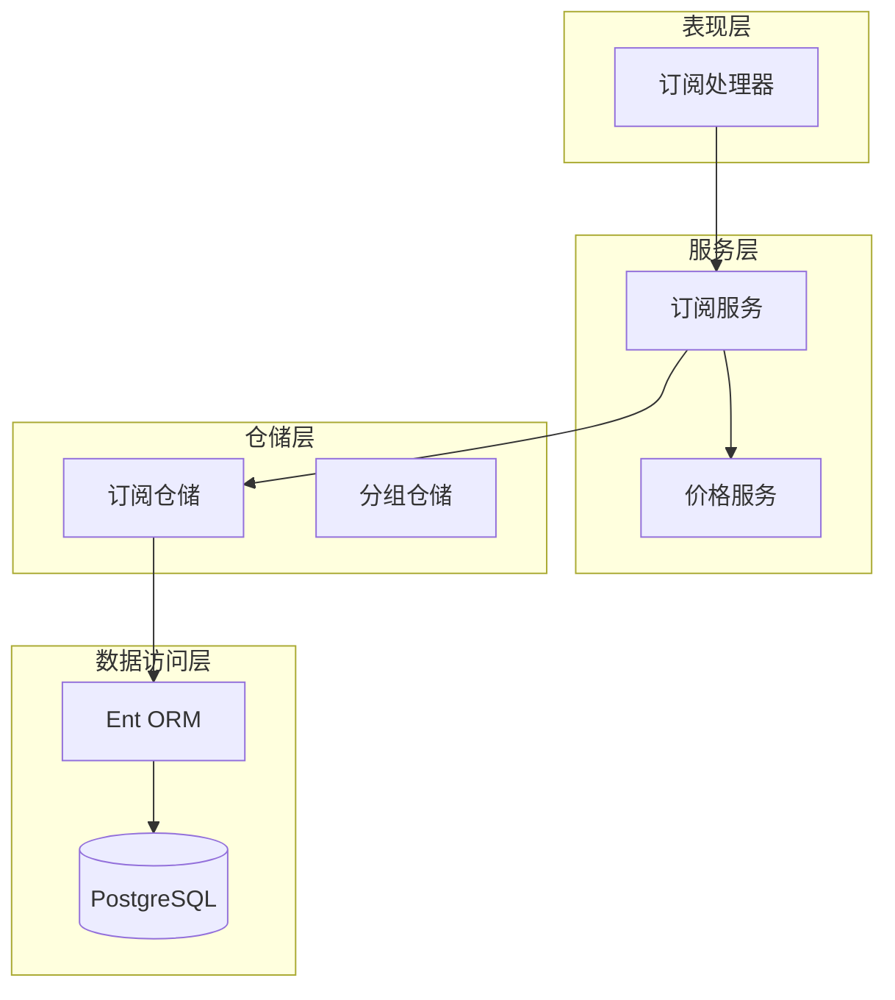

**图表来源**
- [backend/internal/handler/subscription_handler.go:1-189](file://backend/internal/handler/subscription_handler.go#L1-L189)
- [backend/internal/service/user_subscription.go:1-125](file://backend/internal/service/user_subscription.go#L1-L125)
- [backend/internal/repository/user_subscription_repo.go:1-481](file://backend/internal/repository/user_subscription_repo.go#L1-L481)

**章节来源**
- [backend/internal/handler/subscription_handler.go:1-189](file://backend/internal/handler/subscription_handler.go#L1-L189)
- [backend/internal/service/user_subscription.go:1-125](file://backend/internal/service/user_subscription.go#L1-L125)
- [backend/internal/repository/user_subscription_repo.go:1-481](file://backend/internal/repository/user_subscription_repo.go#L1-L481)

## 核心组件

### 数据模型结构

用户订阅表采用Ent ORM框架定义，包含以下核心字段：

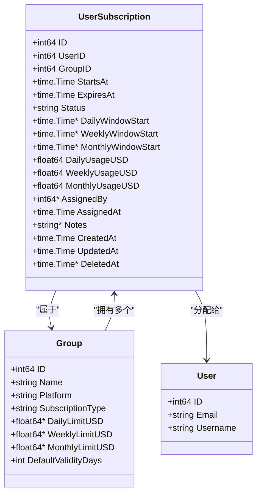

**图表来源**
- [backend/ent/schema/user_subscription.go:36-120](file://backend/ent/schema/user_subscription.go#L36-L120)
- [backend/ent/schema/group.go:34-145](file://backend/ent/schema/group.go#L34-L145)
- [backend/ent/usersubscription.go:17-75](file://backend/ent/usersubscription.go#L17-L75)

### 订阅状态管理

系统支持三种核心订阅状态：

| 状态 | 描述 | 条件 |
|------|------|------|
| active | 正常激活 | Status = 'active' 且 ExpiresAt > 当前时间 |
| expired | 已过期 | ExpiresAt ≤ 当前时间 |
| suspended | 已暂停 | 手动暂停状态 |

**章节来源**
- [backend/ent/schema/user_subscription.go:45-47](file://backend/ent/schema/user_subscription.go#L45-L47)
- [backend/internal/domain/constants.go:64-68](file://backend/internal/domain/constants.go#L64-L68)
- [backend/internal/service/user_subscription.go:34-40](file://backend/internal/service/user_subscription.go#L34-L40)

## 架构概览

订阅系统采用经典的三层架构，实现了清晰的关注点分离：

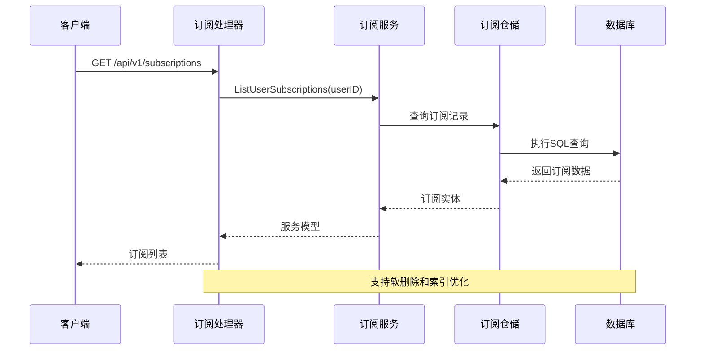

**图表来源**
- [backend/internal/handler/subscription_handler.go:45-65](file://backend/internal/handler/subscription_handler.go#L45-L65)
- [backend/internal/repository/user_subscription_repo.go:141-152](file://backend/internal/repository/user_subscription_repo.go#L141-L152)

## 详细组件分析

### 订阅表设计详解

#### 核心字段分析

| 字段名 | 类型 | 约束 | 描述 |
|--------|------|------|------|
| id | int64 | 主键 | 订阅记录唯一标识符 |
| user_id | int64 | 外键 | 关联用户表 |
| group_id | int64 | 外键 | 关联分组表 |
| starts_at | timestamp | 必填 | 订阅开始时间 |
| expires_at | timestamp | 必填 | 订阅结束时间 |
| status | string | 默认'active' | 订阅状态 |
| daily_window_start | timestamp | 可空 | 日限额窗口起始时间 |
| weekly_window_start | timestamp | 可空 | 周限额窗口起始时间 |
| monthly_window_start | timestamp | 可空 | 月限额窗口起始时间 |
| daily_usage_usd | decimal | 默认0 | 日累计消费金额 |
| weekly_usage_usd | decimal | 默认0 | 周累计消费金额 |
| monthly_usage_usd | decimal | 默认0 | 月累计消费金额 |
| assigned_by | int64 | 可空 | 分配人ID |
| assigned_at | timestamp | 默认当前时间 | 分配时间 |
| notes | text | 可空 | 备注信息 |

#### 索引设计

系统采用多层索引策略以优化查询性能：

```mermaid
graph LR
subgraph "单字段索引"
A[user_id]
B[group_id]
C[status]
D[expires_at]
E[assigned_by]
F[deleted_at]
end
subgraph "复合索引"
G[user_id, status, expires_at]
H[user_id, group_id]
end
subgraph "特殊索引"
I[部分索引: (user_id, group_id) WHERE deleted_at IS NULL]
end
```

**图表来源**
- [backend/ent/schema/user_subscription.go:105-119](file://backend/ent/schema/user_subscription.go#L105-L119)

**章节来源**
- [backend/ent/schema/user_subscription.go:36-120](file://backend/ent/schema/user_subscription.go#L36-L120)
- [backend/ent/usersubscription.go:17-75](file://backend/ent/usersubscription.go#L17-L75)

### 订阅计划层级结构

#### 分组配置

分组表定义了订阅计划的层级结构：

| 字段名 | 类型 | 描述 |
|--------|------|------|
| name | string | 分组名称 |
| platform | string | 平台类型（anthropic/openai/gemini） |
| subscription_type | string | 订阅类型（standard/subscription） |
| daily_limit_usd | decimal | 日限额 |
| weekly_limit_usd | decimal | 周限额 |
| monthly_limit_usd | decimal | 月限额 |
| default_validity_days | int | 默认有效期（天） |

#### 订阅类型对比

| 特性 | Standard模式 | Subscription模式 |
|------|-------------|------------------|
| 计费方式 | 按余额扣费 | 按限额控制 |
| 限额管理 | 系统自动管理 | 用户手动设置 |
| 超支处理 | 余额不足时拒绝 | 限额超支时拒绝 |
| 报表统计 | 实际消费记录 | 限额使用情况 |

**章节来源**
- [backend/ent/schema/group.go:54-75](file://backend/ent/schema/group.go#L54-L75)
- [backend/internal/domain/constants.go:57-61](file://backend/internal/domain/constants.go#L57-L61)

### 订阅状态管理流程

#### 状态转换图

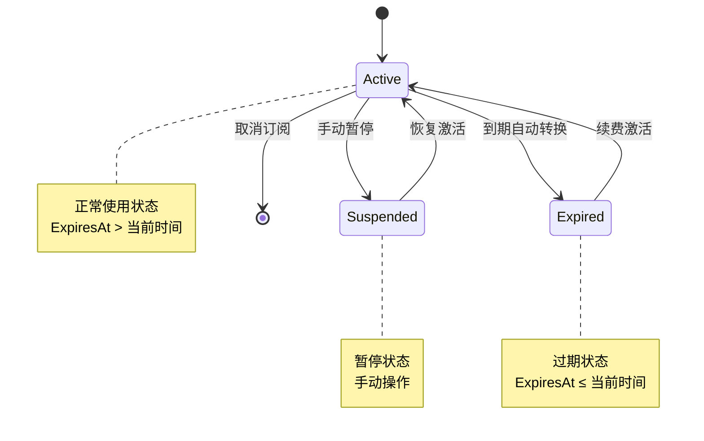

#### 状态检查逻辑

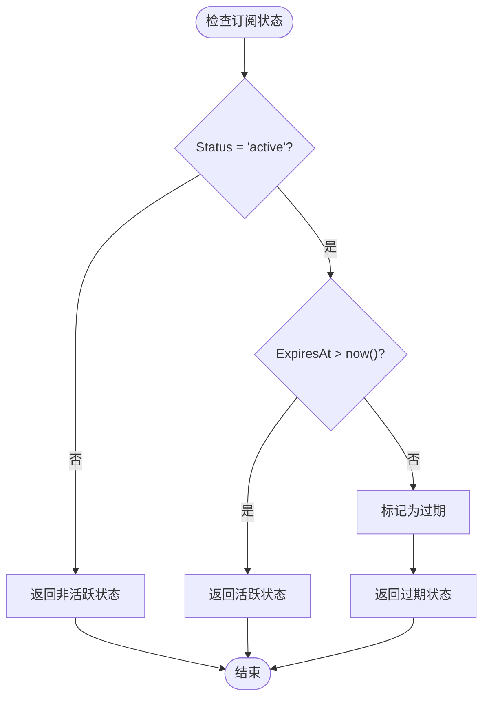

**图表来源**
- [backend/internal/service/user_subscription.go:34-40](file://backend/internal/service/user_subscription.go#L34-L40)
- [backend/internal/repository/user_subscription_repo.go:207-232](file://backend/internal/repository/user_subscription_repo.go#L207-L232)

**章节来源**
- [backend/internal/service/user_subscription.go:34-40](file://backend/internal/service/user_subscription.go#L34-L40)
- [backend/internal/repository/user_subscription_repo.go:207-232](file://backend/internal/repository/user_subscription_repo.go#L207-L232)

### 计费周期和价格计算机制

#### 限额检查流程

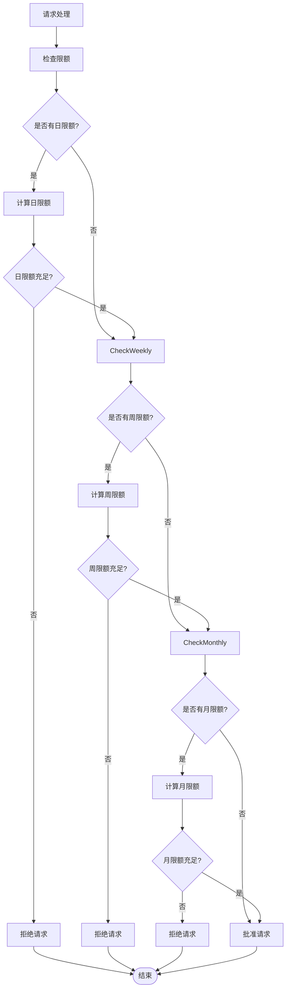

#### 价格服务集成

价格服务提供了动态价格获取能力：

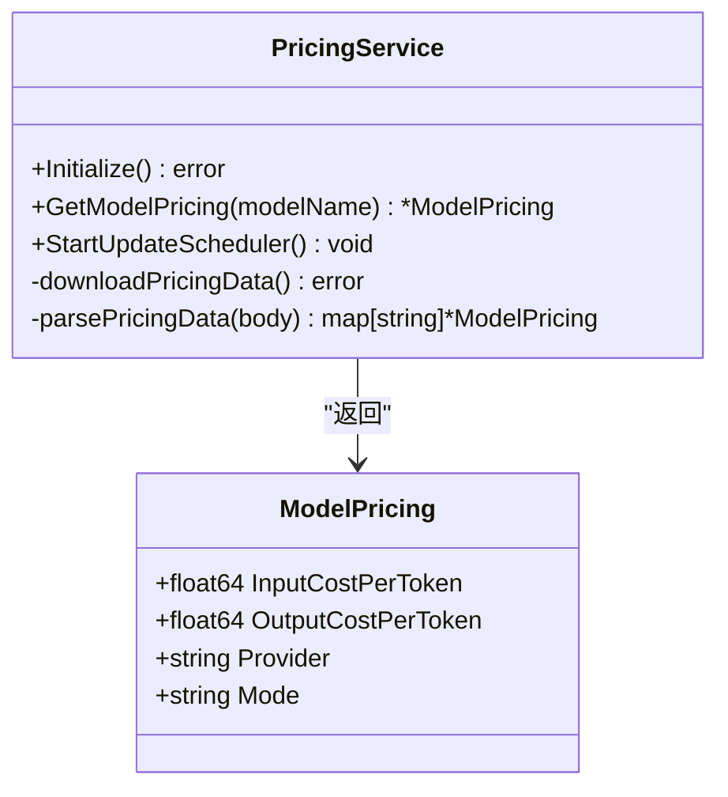

**图表来源**
- [backend/internal/service/pricing_service.go:102-125](file://backend/internal/service/pricing_service.go#L102-L125)
- [backend/internal/service/pricing_service.go:55-75](file://backend/internal/service/pricing_service.go#L55-L75)

**章节来源**
- [backend/internal/service/user_subscription.go:98-125](file://backend/internal/service/user_subscription.go#L98-L125)
- [backend/internal/service/pricing_service.go:102-125](file://backend/internal/service/pricing_service.go#L102-L125)

### 配额管理设计

#### 时间窗口管理

系统支持三种时间维度的限额管理：

| 时间维度 | 窗口起始字段 | 重置逻辑 | 用途 |
|----------|-------------|----------|------|
| 日限额 | daily_window_start | 24小时后重置 | 日消费控制 |
| 周限额 | weekly_window_start | 7天后重置 | 周消费控制 |
| 月限额 | monthly_window_start | 30天后重置 | 月消费控制 |

#### 限额检查算法

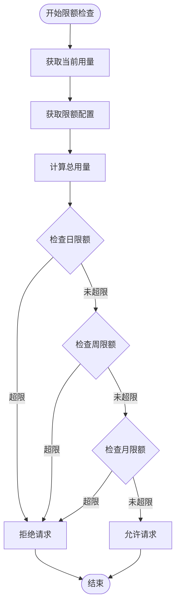

**图表来源**
- [backend/internal/service/user_subscription.go:98-125](file://backend/internal/service/user_subscription.go#L98-L125)

**章节来源**
- [backend/internal/service/user_subscription.go:98-125](file://backend/internal/service/user_subscription.go#L98-L125)

### 业务场景实现

#### 订阅变更流程

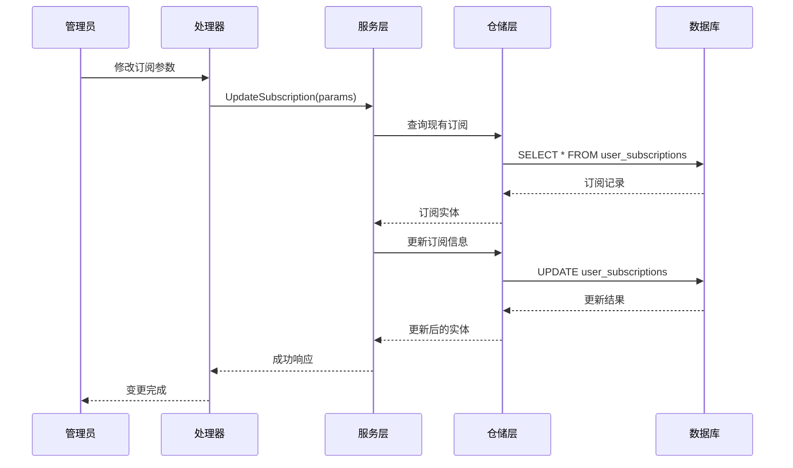

#### 升级降级流程

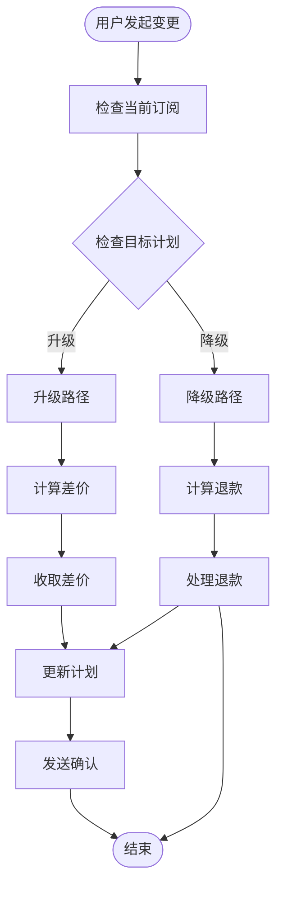

**图表来源**
- [backend/internal/handler/subscription_handler.go:45-87](file://backend/internal/handler/subscription_handler.go#L45-L87)

**章节来源**
- [backend/internal/handler/subscription_handler.go:45-87](file://backend/internal/handler/subscription_handler.go#L45-L87)

## 依赖关系分析

### 组件耦合度分析

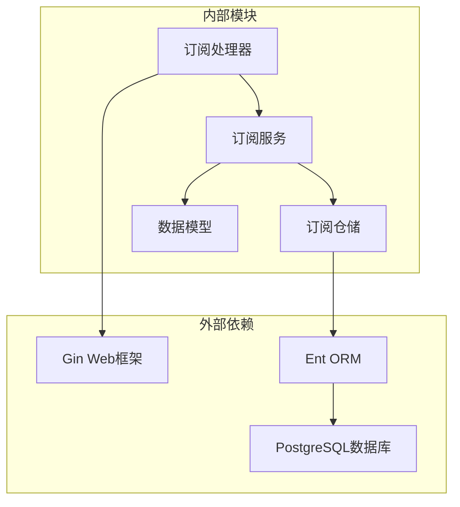

### 错误处理机制

系统采用统一的错误处理策略：

| 错误类型 | 处理方式 | 影响范围 |
|----------|----------|----------|
| 订阅不存在 | 返回404错误 | 单个请求 |
| 数据库连接失败 | 重试机制 | 所有请求 |
| 限额超支 | 拒绝请求 | 当前请求 |
| 状态冲突 | 事务回滚 | 当前事务 |

**章节来源**
- [backend/internal/repository/user_subscription_repo.go:54-58](file://backend/internal/repository/user_subscription_repo.go#L54-L58)
- [backend/internal/repository/user_subscription_repo.go:126-131](file://backend/internal/repository/user_subscription_repo.go#L126-L131)

## 性能考虑

### 查询优化策略

1. **索引优化**
   - 复合索引 `(user_id, status, expires_at)` 优化活跃订阅查询
   - 部分索引支持软删除后的重新订阅

2. **缓存策略**
   - 分组信息缓存减少数据库查询
   - 价格数据缓存提升计费效率

3. **批量操作**
   - 批量更新过期状态减少数据库往返
   - 原子性用量更新避免竞态条件

### 内存使用优化

- 使用 `sql.Null*` 类型处理可空字段
- 懒加载关联数据避免不必要的查询
- 适当的分页处理大数据集

## 故障排除指南

### 常见问题诊断

| 问题现象 | 可能原因 | 解决方案 |
|----------|----------|----------|
| 订阅无法激活 | 余额不足或限额超支 | 检查分组限额配置 |
| 状态异常 | 数据库状态不同步 | 执行状态同步任务 |
| 查询缓慢 | 缺少必要索引 | 添加复合索引 |
| 用量不准确 | 并发更新竞争 | 使用原子性更新 |

### 调试工具

1. **日志监控**
   - 订阅状态变更日志
   - 限额检查失败日志
   - 数据库查询性能日志

2. **指标监控**
   - 订阅活跃度指标
   - 限额使用率指标
   - 系统响应时间指标

**章节来源**
- [backend/internal/repository/user_subscription_repo.go:376-386](file://backend/internal/repository/user_subscription_repo.go#L376-L386)

## 结论

用户订阅表设计采用了现代化的分层架构，通过Ent ORM框架实现了强类型的数据访问层。系统支持灵活的订阅状态管理、多维度的限额控制和动态的价格计算。通过合理的索引设计和缓存策略，系统能够在高并发场景下保持良好的性能表现。

设计的关键优势包括：
- 清晰的职责分离和模块化设计
- 灵活的状态管理和限额控制
- 高效的查询优化和缓存策略
- 完善的错误处理和监控机制

未来可以考虑的改进方向：
- 增加更多的订阅类型支持
- 优化大规模数据的查询性能
- 增强实时限额监控功能
- 扩展多平台计费支持