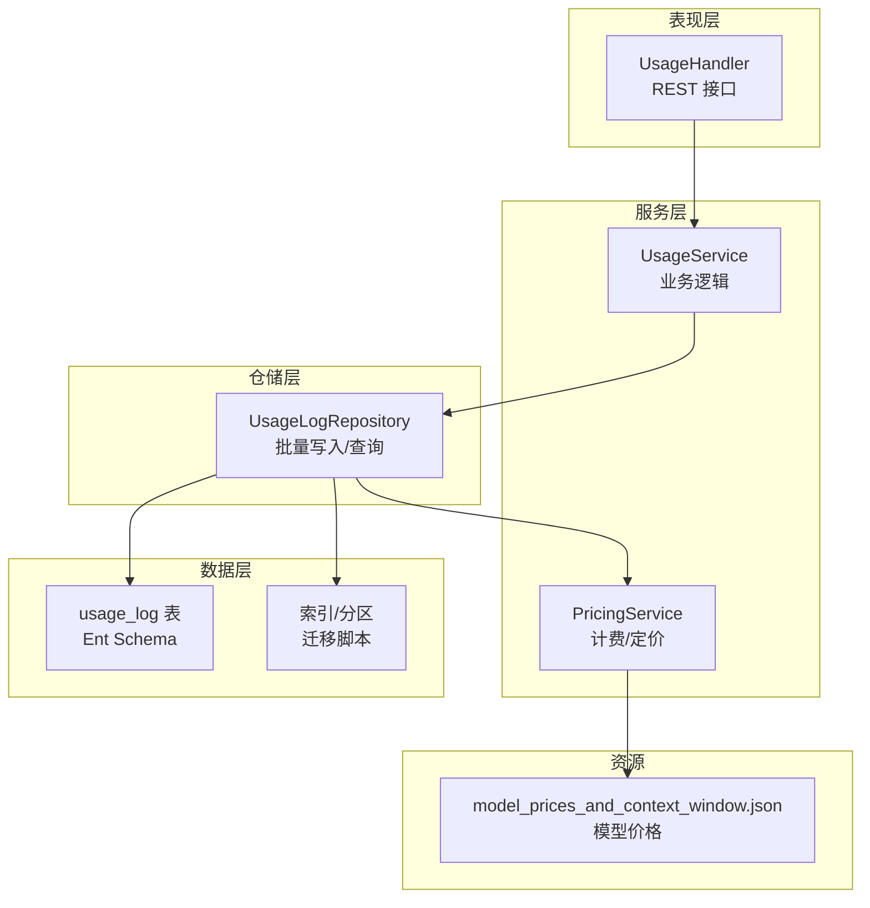
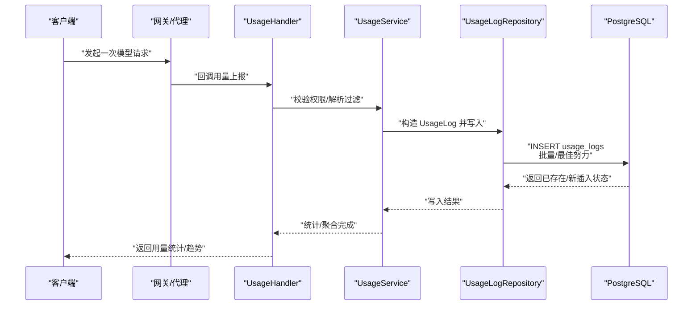
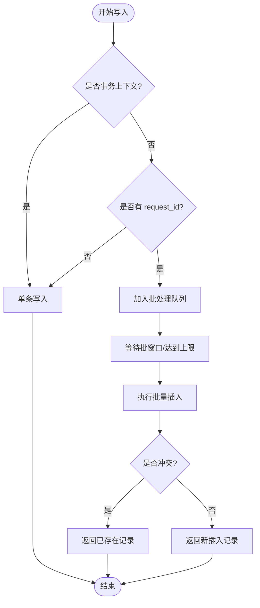
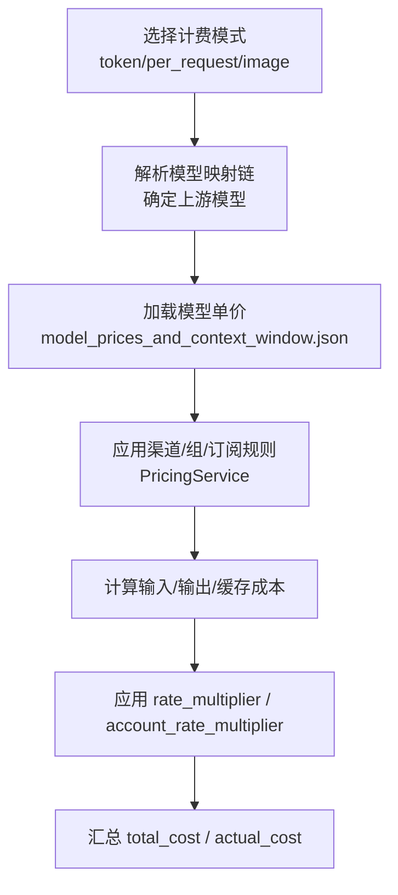
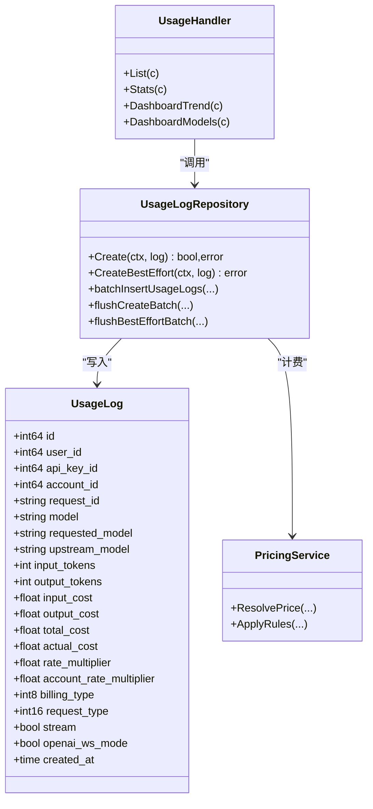

# 用量日志表设计

<cite>
**本文引用的文件**
- [backend/ent/schema/usage_log.go](file://backend/ent/schema/usage_log.go)
- [backend/ent/usagelog/usagelog.go](file://backend/ent/usagelog/usagelog.go)
- [backend/internal/handler/usage_handler.go](file://backend/internal/handler/usage_handler.go)
- [backend/internal/repository/usage_log_repo.go](file://backend/internal/repository/usage_log_repo.go)
- [backend/internal/service/usage_log.go](file://backend/internal/service/usage_log.go)
- [backend/internal/repository/pricing_service.go](file://backend/internal/repository/pricing_service.go)
- [backend/internal/service/pricing_service.go](file://backend/internal/service/pricing_service.go)
- [backend/resources/model-pricing/model_prices_and_context_window.json](file://backend/resources/model-pricing/model_prices_and_context_window.json)
- [backend/migrations/009_log_orphan_allowed_groups.sql](file://backend/migrations/009_log_orphan_allowed_groups.sql)
- [backend/migrations/010_add_usage_logs_aggregated_indexes.sql](file://backend/migrations/010_add_usage_logs_aggregated_indexes.sql)
- [backend/migrations/028_add_usage_logs_user_agent.sql](file://backend/migrations/028_add_usage_logs_user_agent.sql)
- [backend/migrations/029_group_image_pricing.sql](file://backend/migrations/029_group_image_pricing.sql)
- [backend/migrations/045_add_announcements.sql](file://backend/migrations/045_add_announcements.sql)
- [backend/migrations/057_add_idempotency_records.sql](file://backend/migrations/057_add_idempotency_records.sql)
- [backend/migrations/060_add_usage_log_openai_ws_mode.sql](file://backend/migrations/060_add_usage_log_openai_ws_mode.sql)
- [backend/migrations/061_add_usage_log_request_type.sql](file://backend/migrations/061_add_usage_log_request_type.sql)
- [backend/migrations/070_add_usage_log_service_tier.sql](file://backend/migrations/070_add_usage_log_service_tier.sql)
- [backend/migrations/074_add_usage_log_endpoints.sql](file://backend/migrations/074_add_usage_log_endpoints.sql)
- [backend/migrations/075_add_usage_log_upstream_model.sql](file://backend/migrations/075_add_usage_log_upstream_model.sql)
- [backend/migrations/077_add_usage_log_requested_model.sql](file://backend/migrations/077_add_usage_log_requested_model.sql)
- [backend/migrations/087_add_usage_log_billing_mode.sql](file://backend/migrations/087_add_usage_log_billing_mode.sql)
- [backend/migrations/089_add_usage_log_image_output_tokens.sql](file://backend/migrations/089_add_usage_log_image_output_tokens.sql)
- [backend/migrations/090_drop_sora.sql](file://backend/migrations/090_drop_sora.sql)
- [backend/migrations/144_add_opus48_to_model_mapping.sql](file://backend/migrations/144_add_opus48_to_model_mapping.sql)
</cite>

## 目录
1. [简介](#简介)
2. [项目结构](#项目结构)
3. [核心组件](#核心组件)
4. [架构总览](#架构总览)
5. [详细组件分析](#详细组件分析)
6. [依赖关系分析](#依赖关系分析)
7. [性能考量](#性能考量)
8. [故障排查指南](#故障排查指南)
9. [结论](#结论)
10. [附录](#附录)

## 简介
本文件系统化阐述“用量日志表”的设计与实现，覆盖字段结构、统计精度、计费计算、时间维度聚合、预警机制、报表与导出、以及与用户、API密钥、账户等实体的关联与一致性保障。目标是帮助开发者与运维人员快速理解并正确使用用量日志能力。

## 项目结构
用量日志相关代码主要分布在以下层次：
- 数据层（Ent ORM）：定义表结构、索引与关系
- 仓储层（Repository）：批量写入、查询与统计聚合
- 服务层（Service）：计费类型、请求类型、用量对象模型
- 处理器层（Handler）：对外接口、分页与过滤
- 资源与迁移：模型定价资源、历史字段演进与索引优化

图表来源
- [backend/internal/handler/usage_handler.go:1-414](file://backend/internal/handler/usage_handler.go#L1-L414)
- [backend/internal/service/usage_log.go:1-198](file://backend/internal/service/usage_log.go#L1-L198)
- [backend/internal/repository/usage_log_repo.go:1-800](file://backend/internal/repository/usage_log_repo.go#L1-L800)
- [backend/ent/schema/usage_log.go:1-197](file://backend/ent/schema/usage_log.go#L1-L197)
- [backend/resources/model-pricing/model_prices_and_context_window.json](file://backend/resources/model-pricing/model_prices_and_context_window.json)

章节来源
- [backend/internal/handler/usage_handler.go:1-414](file://backend/internal/handler/usage_handler.go#L1-L414)
- [backend/internal/service/usage_log.go:1-198](file://backend/internal/service/usage_log.go#L1-L198)
- [backend/internal/repository/usage_log_repo.go:1-800](file://backend/internal/repository/usage_log_repo.go#L1-L800)
- [backend/ent/schema/usage_log.go:1-197](file://backend/ent/schema/usage_log.go#L1-L197)

## 核心组件
- usage_logs 表：记录每次调用的完整用量与计费信息，采用只追加设计，不支持更新/删除
- UsageLog 实体：承载单条用量记录的结构化对象
- UsageLogRepository：负责批量写入、冲突去重、最佳努力插入、统计聚合
- UsageHandler：对外提供列表、详情、统计、趋势、模型分布等接口
- PricingService：结合模型定价与渠道规则进行计费计算
- 迁移脚本：持续演进字段、索引与分区，支撑高并发与多维统计

章节来源
- [backend/ent/schema/usage_log.go:16-197](file://backend/ent/schema/usage_log.go#L16-L197)
- [backend/ent/usagelog/usagelog.go:12-513](file://backend/ent/usagelog/usagelog.go#L12-L513)
- [backend/internal/service/usage_log.go:94-198](file://backend/internal/service/usage_log.go#L94-L198)
- [backend/internal/repository/usage_log_repo.go:245-432](file://backend/internal/repository/usage_log_repo.go#L245-L432)
- [backend/internal/handler/usage_handler.go:33-145](file://backend/internal/handler/usage_handler.go#L33-L145)

## 架构总览
用量日志从上游请求到持久化的整体流程如下：

图表来源
- [backend/internal/handler/usage_handler.go:33-145](file://backend/internal/handler/usage_handler.go#L33-L145)
- [backend/internal/repository/usage_log_repo.go:308-390](file://backend/internal/repository/usage_log_repo.go#L308-L390)
- [backend/internal/repository/usage_log_repo.go:392-432](file://backend/internal/repository/usage_log_repo.go#L392-L432)

## 详细组件分析

### 表结构与字段设计
- 基础标识与时间
  - 日志ID：自增主键
  - 创建时间：带时区，默认当前时间，不可变
- 关联字段
  - 用户ID、API密钥ID、账户ID、群组ID、订阅ID
  - 请求ID：唯一键组合（请求ID+API密钥ID），用于幂等去重
  - 模型维度：model（历史）、requested_model（请求侧）、upstream_model（上游侧）、model_mapping_chain（映射链）
  - 计费维度：billing_tier（层级）、billing_mode（计费模式：token/per_request/image）、service_tier（服务等级）
  - 网络与终端：user_agent、ip_address、openai_ws_mode、inbound_endpoint、upstream_endpoint
- Token 统计
  - 输入/输出/缓存创建/缓存读取（含5分钟/1小时窗口）
  - 图像输出专用：image_output_tokens、image_output_cost
- 成本与倍率
  - 输入/输出/缓存创建/缓存读取成本、总成本、实际成本
  - rate_multiplier（请求级倍率）、account_rate_multiplier（账号倍率快照）
- 其他
  - billing_type（钱包/订阅）、stream（流式）、request_type（同步/流式/WebSocket v2）、duration_ms、first_token_ms、image_count、image_size、reasoning_effort、channel_id、cache_ttl_overridden

章节来源
- [backend/ent/schema/usage_log.go:31-146](file://backend/ent/schema/usage_log.go#L31-L146)
- [backend/ent/usagelog/usagelog.go:12-180](file://backend/ent/usagelog/usagelog.go#L12-L180)

### 关系与索引
- 关系
  - 多对一：user、api_key、account、group、subscription
- 索引
  - 单列：user_id、api_key_id、account_id、group_id、subscription_id、created_at、model、requested_model、request_id
  - 复合：user_id+created_at、api_key_id+created_at、group_id+created_at（部分索引）

章节来源
- [backend/ent/schema/usage_log.go:149-196](file://backend/ent/schema/usage_log.go#L149-L196)

### 写入与幂等
- 冲突键：(request_id, api_key_id)，重复请求直接返回已存在记录
- 批量写入：窗口化批处理，最大队列容量与窗口大小控制吞吐与延迟
- 最佳努力写入：在可用数据库连接下批量插入，失败回退单条；对近期重复请求做短期去重缓存

图表来源
- [backend/internal/repository/usage_log_repo.go:245-390](file://backend/internal/repository/usage_log_repo.go#L245-L390)
- [backend/internal/repository/usage_log_repo.go:392-432](file://backend/internal/repository/usage_log_repo.go#L392-L432)
- [backend/internal/repository/usage_log_repo.go:454-520](file://backend/internal/repository/usage_log_repo.go#L454-L520)
- [backend/internal/repository/usage_log_repo.go:630-700](file://backend/internal/repository/usage_log_repo.go#L630-L700)

章节来源
- [backend/internal/repository/usage_log_repo.go:245-432](file://backend/internal/repository/usage_log_repo.go#L245-L432)
- [backend/internal/repository/usage_log_repo.go:454-520](file://backend/internal/repository/usage_log_repo.go#L454-L520)
- [backend/internal/repository/usage_log_repo.go:630-700](file://backend/internal/repository/usage_log_repo.go#L630-L700)

### 统计精度与分类
- Token 分类
  - 输入token：input_tokens
  - 输出token：output_tokens
  - 缓存创建/读取：cache_creation_tokens、cache_read_tokens
  - 图像输出：image_output_tokens（新增字段）
- 成本分类
  - 输入/输出/缓存创建/缓存读取成本分别记录
  - 总成本与实际成本，支持 rate_multiplier 与 account_rate_multiplier
- 请求类型
  - request_type：sync/stream/ws_v2
  - legacy 字段：stream、openai_ws_mode

章节来源
- [backend/internal/service/usage_log.go:94-198](file://backend/internal/service/usage_log.go#L94-L198)
- [backend/ent/schema/usage_log.go:67-108](file://backend/ent/schema/usage_log.go#L67-L108)

### 计费计算逻辑
- 计费模式
  - token 模式：按 input_tokens、output_tokens 乘以单价
  - per_request/image 模式：按请求/图像计费，tier 与 mode 决定单价
- 单价来源
  - 模型定价资源：model_prices_and_context_window.json
  - 渠道与映射：渠道仓库与定价服务根据上游模型映射链确定最终计费模型
- 倍率
  - rate_multiplier：请求级倍率
  - account_rate_multiplier：账号倍率快照（历史为空按 1.0 处理）
- 成本字段
  - input_cost、output_cost、cache_creation_cost、cache_read_cost、total_cost、actual_cost

图表来源
- [backend/internal/repository/pricing_service.go](file://backend/internal/repository/pricing_service.go)
- [backend/internal/service/pricing_service.go](file://backend/internal/service/pricing_service.go)
- [backend/resources/model-pricing/model_prices_and_context_window.json](file://backend/resources/model-pricing/model_prices_and_context_window.json)

章节来源
- [backend/internal/repository/pricing_service.go](file://backend/internal/repository/pricing_service.go)
- [backend/internal/service/pricing_service.go](file://backend/internal/service/pricing_service.go)
- [backend/resources/model-pricing/model_prices_and_context_window.json](file://backend/resources/model-pricing/model_prices_and_context_window.json)

### 时间维度与聚合
- 时间粒度白名单：hour、day、week、month
- 聚合查询
  - 按小时/天/周/月对 token 与成本进行分组统计
  - 支持按用户、API密钥、模型、请求类型等维度切片
- 查询参数
  - start_date、end_date、timezone、period（today/week/month）、granularity（day/week/month）

章节来源
- [backend/internal/repository/usage_log_repo.go:94-108](file://backend/internal/repository/usage_log_repo.go#L94-L108)
- [backend/internal/handler/usage_handler.go:177-338](file://backend/internal/handler/usage_handler.go#L177-L338)

### 报表生成与导出
- 列表接口：支持分页、过滤（api_key_id、model、request_type/stream、billing_type、时间范围）
- 统计接口：按用户或API密钥统计总量、成本、token
- 趋势与模型分布：按粒度聚合展示
- 导出建议
  - 在后端实现 CSV/Excel 导出：基于列表接口的过滤条件与分页游标
  - 前端触发导出任务，后端异步生成并提供下载链接
  - 注意：导出应限制数据量与并发，避免阻塞

章节来源
- [backend/internal/handler/usage_handler.go:33-145](file://backend/internal/handler/usage_handler.go#L33-L145)
- [backend/internal/handler/usage_handler.go:177-338](file://backend/internal/handler/usage_handler.go#L177-L338)

### 用量预警机制
- 阈值设定
  - 用户/API密钥/订阅额度阈值（例如：90%/100%）
  - 成本阈值与请求次数阈值
- 触发策略
  - 实时监控：基于最近 N 分钟的 RPM/TPM 与成本增量
  - 定时任务：每日/每周汇总对比阈值
- 通知方式
  - 站内消息、邮件、Webhook
- 与现有字段的结合
  - 使用 created_at、total_cost、actual_cost、request_type、billing_type 等字段进行阈值判断

章节来源
- [backend/internal/repository/usage_log_repo.go:222-243](file://backend/internal/repository/usage_log_repo.go#L222-L243)
- [backend/internal/service/usage_log.go:9-12](file://backend/internal/service/usage_log.go#L9-L12)

### 与用户、API密钥、账户的关联与一致性
- 关联关系
  - user_id → users
  - api_key_id → api_keys
  - account_id → accounts
  - group_id → groups
  - subscription_id → user_subscriptions
- 一致性保障
  - 写入前校验 APIKey 所属用户，防止横向越权
  - 写入时通过 request_id+api_key_id 去重，避免重复计费
  - 读取时按当前用户上下文过滤，确保数据隔离

章节来源
- [backend/ent/schema/usage_log.go:149-175](file://backend/ent/schema/usage_log.go#L149-L175)
- [backend/internal/handler/usage_handler.go:52-64](file://backend/internal/handler/usage_handler.go#L52-L64)
- [backend/internal/handler/usage_handler.go:168-172](file://backend/internal/handler/usage_handler.go#L168-L172)

## 依赖关系分析

图表来源
- [backend/internal/service/usage_log.go:94-198](file://backend/internal/service/usage_log.go#L94-L198)
- [backend/internal/repository/usage_log_repo.go:245-700](file://backend/internal/repository/usage_log_repo.go#L245-L700)
- [backend/internal/handler/usage_handler.go:33-338](file://backend/internal/handler/usage_handler.go#L33-L338)
- [backend/internal/repository/pricing_service.go](file://backend/internal/repository/pricing_service.go)
- [backend/internal/service/pricing_service.go](file://backend/internal/service/pricing_service.go)

章节来源
- [backend/internal/service/usage_log.go:94-198](file://backend/internal/service/usage_log.go#L94-L198)
- [backend/internal/repository/usage_log_repo.go:245-700](file://backend/internal/repository/usage_log_repo.go#L245-L700)
- [backend/internal/handler/usage_handler.go:33-338](file://backend/internal/handler/usage_handler.go#L33-L338)

## 性能考量
- 批量写入
  - 批大小与窗口：平衡延迟与吞吐
  - 队列容量：防止内存暴涨
- 冲突去重
  - 唯一键：request_id+api_key_id
  - 最佳努力：在失败时回退单条写入
- 索引与分区
  - 已有单列与复合索引，支持高频过滤
  - 建议按时间分区（迁移脚本中已有分区相关变更）
- 统计查询
  - 使用 TO_CHAR 按粒度聚合，避免复杂窗口函数
  - 控制时间范围与维度，避免全表扫描

章节来源
- [backend/internal/repository/usage_log_repo.go:146-156](file://backend/internal/repository/usage_log_repo.go#L146-L156)
- [backend/internal/repository/usage_log_repo.go:372-373](file://backend/internal/repository/usage_log_repo.go#L372-L373)
- [backend/migrations/035_usage_logs_partitioning.sql](file://backend/migrations/035_usage_logs_partitioning.sql)
- [backend/migrations/010_add_usage_logs_aggregated_indexes.sql](file://backend/migrations/010_add_usage_logs_aggregated_indexes.sql)

## 故障排查指南
- 写入失败
  - 检查 request_id 是否为空或重复
  - 查看批处理队列是否满载
  - 关注最佳努力插入失败日志
- 统计异常
  - 确认时间范围与粒度参数
  - 核对模型维度字段（requested_model/upstream_model）解析
- 权限问题
  - 确保 APIKey 属于当前用户
  - 查询时自动附加用户过滤

章节来源
- [backend/internal/repository/usage_log_repo.go:261-306](file://backend/internal/repository/usage_log_repo.go#L261-L306)
- [backend/internal/handler/usage_handler.go:52-64](file://backend/internal/handler/usage_handler.go#L52-L64)
- [backend/internal/handler/usage_handler.go:168-172](file://backend/internal/handler/usage_handler.go#L168-L172)

## 结论
usage_logs 表通过清晰的字段划分、完善的索引与批处理机制，实现了高并发下的稳定用量记录与高效统计。配合模型定价与渠道规则，能够准确计算成本并支持多维聚合与趋势分析。建议在生产环境中结合阈值与告警策略，完善用量预警与报表导出能力，确保可观测性与合规性。

## 附录

### 字段对照与演进
- 新增字段与迁移
  - 029：group_image_pricing（图像计费）
  - 060：openai_ws_mode
  - 061：request_type
  - 070：service_tier
  - 074：inbound_endpoint、upstream_endpoint
  - 075：requested_model、upstream_model
  - 087：billing_mode
  - 089：image_output_tokens、image_output_cost
  - 090：drop_sora
  - 144：opus48 映射
- 历史字段
  - 009：清理孤儿 allowed_groups（间接影响统计）
  - 045：announcements（不影响用量）
  - 057：idempotency_records（与幂等相关）

章节来源
- [backend/migrations/029_group_image_pricing.sql](file://backend/migrations/029_group_image_pricing.sql)
- [backend/migrations/060_add_usage_log_openai_ws_mode.sql](file://backend/migrations/060_add_usage_log_openai_ws_mode.sql)
- [backend/migrations/061_add_usage_log_request_type.sql](file://backend/migrations/061_add_usage_log_request_type.sql)
- [backend/migrations/070_add_usage_log_service_tier.sql](file://backend/migrations/070_add_usage_log_service_tier.sql)
- [backend/migrations/074_add_usage_log_endpoints.sql](file://backend/migrations/074_add_usage_log_endpoints.sql)
- [backend/migrations/075_add_usage_log_upstream_model.sql](file://backend/migrations/075_add_usage_log_upstream_model.sql)
- [backend/migrations/077_add_usage_log_requested_model.sql](file://backend/migrations/077_add_usage_log_requested_model.sql)
- [backend/migrations/087_add_usage_log_billing_mode.sql](file://backend/migrations/087_add_usage_log_billing_mode.sql)
- [backend/migrations/089_add_usage_log_image_output_tokens.sql](file://backend/migrations/089_add_usage_log_image_output_tokens.sql)
- [backend/migrations/090_drop_sora.sql](file://backend/migrations/090_drop_sora.sql)
- [backend/migrations/144_add_opus48_to_model_mapping.sql](file://backend/migrations/144_add_opus48_to_model_mapping.sql)
- [backend/migrations/009_log_orphan_allowed_groups.sql](file://backend/migrations/009_log_orphan_allowed_groups.sql)
- [backend/migrations/045_add_announcements.sql](file://backend/migrations/045_add_announcements.sql)
- [backend/migrations/057_add_idempotency_records.sql](file://backend/migrations/057_add_idempotency_records.sql)