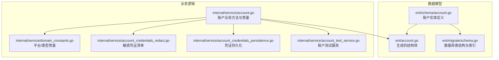
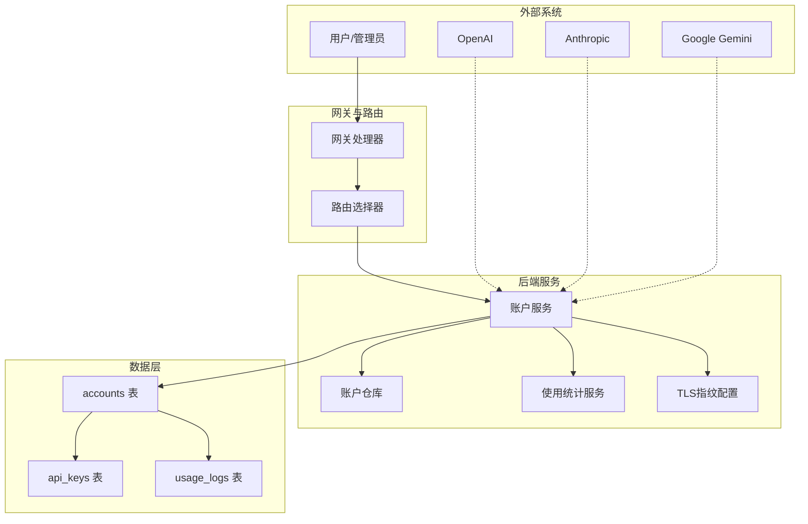
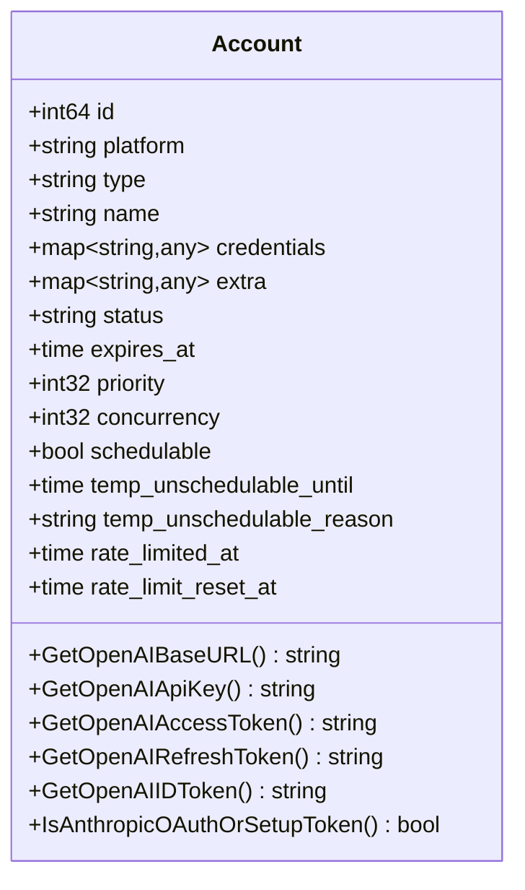
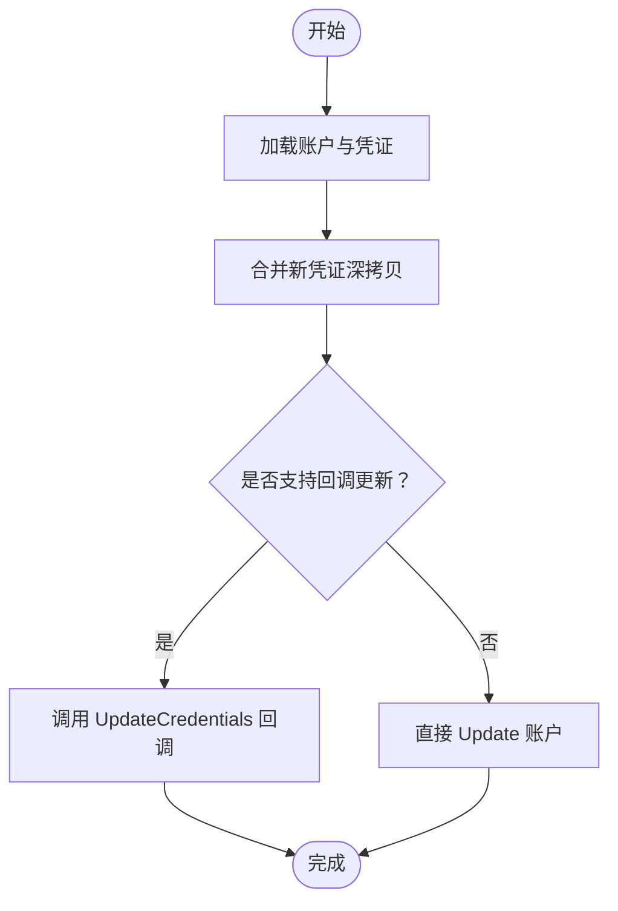
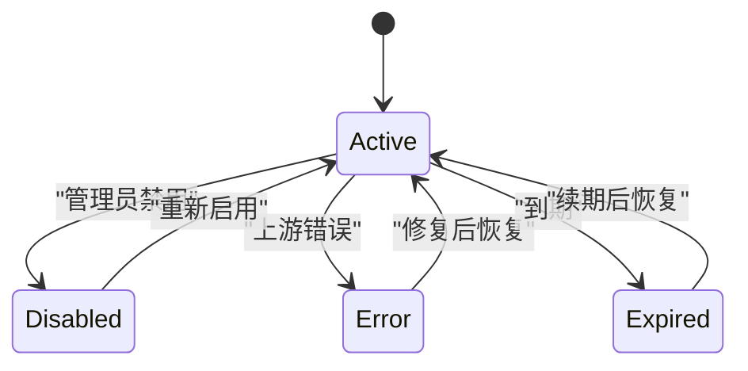
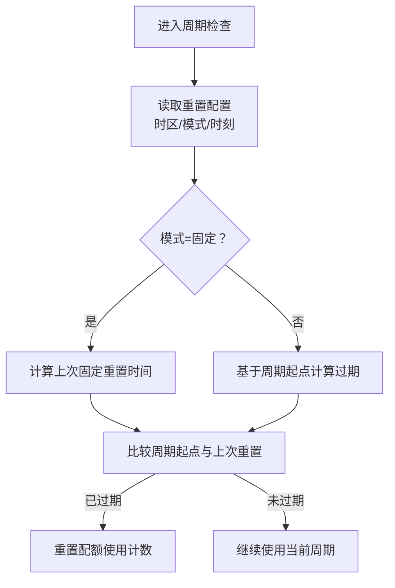
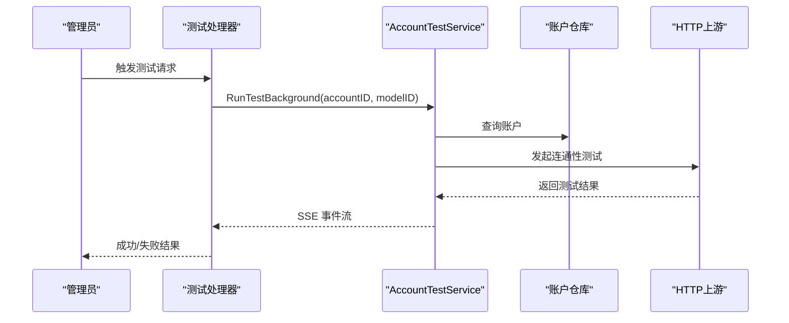
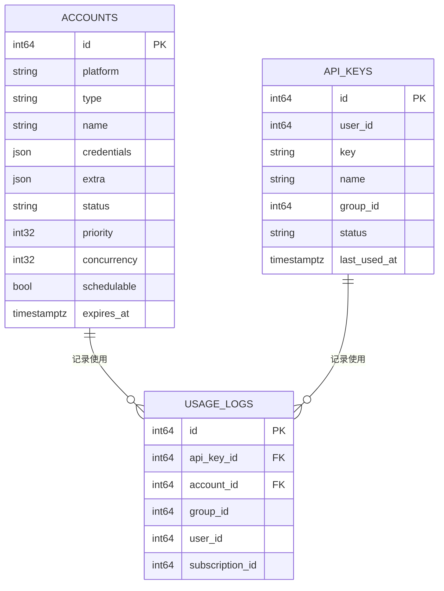
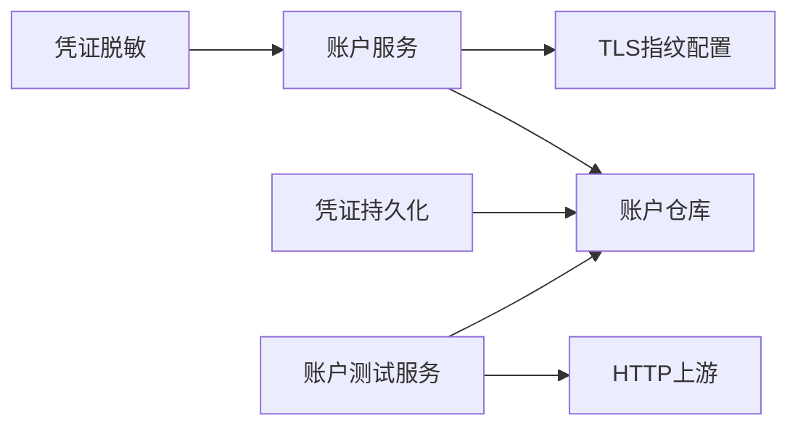

# 账户表设计

<cite>
**本文档引用的文件**
- [backend/ent/schema/account.go](file://backend/ent/schema/account.go)
- [backend/ent/account.go](file://backend/ent/account.go)
- [backend/ent/migrate/schema.go](file://backend/ent/migrate/schema.go)
- [backend/internal/service/account.go](file://backend/internal/service/account.go)
- [backend/internal/service/domain_constants.go](file://backend/internal/service/domain_constants.go)
- [backend/internal/service/account_credentials_redact.go](file://backend/internal/service/account_credentials_redact.go)
- [backend/internal/service/account_credentials_persistence.go](file://backend/internal/service/account_credentials_persistence.go)
- [backend/internal/service/account.go](file://backend/internal/service/account.go)
- [backend/internal/service/account_test_service.go](file://backend/internal/service/account_test_service.go)
- [backend/internal/service/account.go](file://backend/internal/service/account.go)
- [backend/internal/service/account.go](file://backend/internal/service/account.go)
- [backend/internal/service/account.go](file://backend/internal/service/account.go)
- [backend/internal/service/account.go](file://backend/internal/service/account.go)
- [backend/internal/service/account.go](file://backend/internal/service/account.go)
- [backend/internal/service/account.go](file://backend/internal/service/account.go)
- [backend/internal/service/account.go](file://backend/internal/service/account.go)
- [backend/internal/service/account.go](file://backend/internal/service/account.go)
- [backend/internal/service/account.go](file://backend/internal/service/account.go)
- [backend/internal/service/account.go](file://backend/internal/service/account.go)
- [backend/internal/service/account.go](file://backend/internal/service/account.go)
- [backend/internal/service/account.go](file://backend/internal/service/account.go)
- [backend/internal/service/account.go](file://backend/internal/service/account.go)
- [backend/internal/service/account.go](file://backend/internal/service/account.go)
- [backend/internal/service/account.go](file://backend/internal/service/account.go)
- [backend/internal/service/account.go](file://backend/internal/service/account.go)
- [backend/internal/service/account.go](file://backend/internal/service/account.go)
- [backend/internal/service/account.go](file://backend/internal/service/account.go)
- [backend/internal/service/account.go](file://backend/internal/service/account.go)
- [backend/internal/service/account.go](file://backend/internal/service/account.go)
- [backend/internal/service/account.go](file://backend/internal/service/account.go)
- [backend/internal/service/account.go](file://backend/internal/service/account.go)
- [backend/internal/service/account.go](file://backend/internal/service/account.go)
- [backend/internal/service/account.go](file://backend/internal/service/account.go)
- [backend/internal/service/account.go](file://backend/internal/service/account.go)
- [backend/internal/service/account.go](file://backend/internal/service/account.go)
- [backend/internal/service/account.go](file://backend/internal/service/account.go)
- [backend/internal/service/account.go](file://backend/internal/service/account.go)
- [backend/internal/service/account.go](file://backend/internal/service/account.go)
- [backend/internal/service/account.go](file://backend/internal/service/account.go)
- [backend/internal/service/account.go](file://backend/internal/service/account.go)
- [backend/internal/service/account.go](file://backend/internal/service/account.go......)
</cite>

## 目录
1. [引言](#引言)
2. [项目结构](#项目结构)
3. [核心组件](#核心组件)
4. [架构总览](#架构总览)
5. [详细组件分析](#详细组件分析)
6. [依赖分析](#依赖分析)
7. [性能考虑](#性能考虑)
8. [故障排查指南](#故障排查指南)
9. [结论](#结论)
10. [附录](#附录)

## 引言
本文件面向后端工程师与运维人员，系统化梳理账户表（accounts）的设计与实现，覆盖以下主题：
- 账户表结构与字段语义（账户ID、提供商类型、账户名称、API密钥、基础URL、状态等）
- 多提供商适配（OpenAI、Anthropic、Google Gemini 等）
- 凭证安全存储与访问控制（敏感信息脱敏、持久化策略）
- 账户状态管理（有效、无效、维护中等）
- 配额与限额配置（每日/每周限额、重置策略、并发限制）
- 账户连通性测试（SSE 流式输出）
- 与API密钥表、用户订阅表的关联关系与路由选择逻辑

## 项目结构
账户相关的核心代码分布在以下位置：
- 数据模型定义：ent/schema/account.go、ent/account.go
- 数据库迁移与索引：ent/migrate/schema.go
- 业务逻辑与常量：internal/service/account.go、internal/service/domain_constants.go
- 凭证安全与持久化：internal/service/account_credentials_redact.go、internal/service/account_credentials_persistence.go
- 账户测试服务：internal/service/account_test_service.go

**图表来源**
- [backend/ent/schema/account.go:1-200](file://backend/ent/schema/account.go#L1-L200)
- [backend/ent/account.go:1-200](file://backend/ent/account.go#L1-L200)
- [backend/ent/migrate/schema.go:90-120](file://backend/ent/migrate/schema.go#L90-L120)
- [backend/internal/service/account.go:1-200](file://backend/internal/service/account.go#L1-L200)
- [backend/internal/service/domain_constants.go:1-40](file://backend/internal/service/domain_constants.go#L1-L40)
- [backend/internal/service/account_credentials_redact.go:1-30](file://backend/internal/service/account_credentials_redact.go#L1-L30)
- [backend/internal/service/account_credentials_persistence.go:1-40](file://backend/internal/service/account_credentials_persistence.go#L1-L40)
- [backend/internal/service/account_test_service.go:1-120](file://backend/internal/service/account_test_service.go#L1-L120)

**章节来源**
- [backend/ent/schema/account.go:1-200](file://backend/ent/schema/account.go#L1-L200)
- [backend/ent/account.go:1-200](file://backend/ent/account.go#L1-L200)
- [backend/ent/migrate/schema.go:90-120](file://backend/ent/migrate/schema.go#L90-L120)
- [backend/internal/service/account.go:1-200](file://backend/internal/service/account.go#L1-L200)
- [backend/internal/service/domain_constants.go:1-40](file://backend/internal/service/domain_constants.go#L1-L40)
- [backend/internal/service/account_credentials_redact.go:1-30](file://backend/internal/service/account_credentials_redact.go#L1-L30)
- [backend/internal/service/account_credentials_persistence.go:1-40](file://backend/internal/service/account_credentials_persistence.go#L1-L40)
- [backend/internal/service/account_test_service.go:1-120](file://backend/internal/service/account_test_service.go#L1-L120)

## 核心组件
- 账户实体与字段
  - 账户ID：自增主键
  - 平台（Platform）：OpenAI、Anthropic、Google Gemini、Antigravity 等
  - 类型（Type）：OAuth、SetupToken、API Key、Upstream、Bedrock 等
  - 名称（Name）：账户展示名
  - 凭证（Credentials）：JSON 结构，存放敏感信息（如 access_token、refresh_token、api_key 等），需严格脱敏
  - 额外配置（Extra）：包含配额重置时区、每日/每周限额、重置模式等
  - 状态（Status）：active/disabled/error/unused/used/expired 等
  - 其他：到期时间、代理ID、优先级、并发度、临时不可调度标记等

- 多提供商适配
  - OpenAI：支持 OAuth 与 API Key；可自定义 base_url；支持 refresh_token/id_token/access_token
  - Anthropic：支持 OAuth 与 SetupToken；支持 5 小时窗口额度与会话数控制
  - Google Gemini：支持 OAuth 与 API Key；支持令牌获取与缓存
  - Antigravity：平台常量存在，具体适配以实际实现为准

- 凭证安全与持久化
  - 敏感凭证清单：禁止返回前端的子键集合
  - 凭证更新：通过仓库接口或直接更新，持久化到数据库
  - 脱敏策略：DTO 层与服务层均应用敏感键过滤

- 账户状态管理
  - 状态枚举：active/disabled/error/unused/used/expired
  - 临时不可调度：overload_until、temp_unschedulable_until、temp_unschedulable_reason
  - 速率限制：rate_limited_at、rate_limit_reset_at

- 配额与限额
  - 配额维度：总量、每日、每周
  - 重置模式：固定时间（daily/weekly）与滑动周期（24h/7d）
  - 时间配置：quota_reset_timezone、quota_daily_reset_hour、quota_weekly_reset_day/hour
  - 计算与过期判定：根据配置计算下次重置时间并判断周期是否过期

- 账户测试连接
  - SSE 流式输出：启动测试任务，捕获事件流，解析成功/失败
  - 支持平台：OpenAI、Anthropic、Gemini 等（依据具体实现）

**章节来源**
- [backend/ent/schema/account.go:1-200](file://backend/ent/schema/account.go#L1-L200)
- [backend/ent/account.go:1-200](file://backend/ent/account.go#L1-L200)
- [backend/internal/service/account.go:1-200](file://backend/internal/service/account.go#L1-L200)
- [backend/internal/service/domain_constants.go:1-40](file://backend/internal/service/domain_constants.go#L1-L40)
- [backend/internal/service/account_credentials_redact.go:1-30](file://backend/internal/service/account_credentials_redact.go#L1-L30)
- [backend/internal/service/account_credentials_persistence.go:1-40](file://backend/internal/service/account_credentials_persistence.go#L1-L40)
- [backend/internal/service/account_test_service.go:1-120](file://backend/internal/service/account_test_service.go#L1-L120)

## 架构总览
账户表在系统中的角色与交互如下：

**图表来源**
- [backend/internal/service/account.go:1-200](file://backend/internal/service/account.go#L1-L200)
- [backend/ent/migrate/schema.go:90-120](file://backend/ent/migrate/schema.go#L90-L120)

**章节来源**
- [backend/internal/service/account.go:1-200](file://backend/internal/service/account.go#L1-L200)
- [backend/ent/migrate/schema.go:90-120](file://backend/ent/migrate/schema.go#L90-L120)

## 详细组件分析

### 账户实体与字段
- 关键字段
  - id：自增主键
  - platform：提供商标识（OpenAI/Anthropic/Gemini/Antigravity）
  - type：账户类型（OAuth/API Key/Upstream/Bedrock/SetupToken）
  - name：账户名称
  - credentials：JSON，存放敏感凭证
  - extra：JSON，存放配额与时区等配置
  - status：账户状态
  - expires_at：到期时间
  - proxy_id/priority/concurrency/schedulable：路由与并发相关
  - temp_unschedulable_*：临时不可调度标记
  - rate_limited_at/rate_limit_reset_at：速率限制状态

- 字段约束与索引
  - accounts 表包含多个索引，便于查询与统计
  - 与 api_keys、usage_logs 的外键关系明确

**章节来源**
- [backend/ent/schema/account.go:1-200](file://backend/ent/schema/account.go#L1-L200)
- [backend/ent/account.go:1-200](file://backend/ent/account.go#L1-L200)
- [backend/ent/migrate/schema.go:90-120](file://backend/ent/migrate/schema.go#L90-L120)

### 多提供商支持设计
- OpenAI
  - OAuth：支持 access_token/refresh_token/id_token
  - API Key：支持自定义 base_url，默认 https://api.openai.com
  - 额外能力：Codex CLI 限制开关、会话窗口调度

- Anthropic
  - OAuth/SetupToken：支持 5 小时窗口额度与会话数控制
  - 仅这两类账号启用窗口费用调度

- Google Gemini
  - OAuth/API Key：支持令牌获取与缓存
  - 与账户测试服务集成

- Antigravity
  - 平台常量存在，具体适配以实现为准

**图表来源**
- [backend/internal/service/account.go:840-900](file://backend/internal/service/account.go#L840-L900)
- [backend/internal/service/account.go:1198-1202](file://backend/internal/service/account.go#L1198-L1202)

**章节来源**
- [backend/internal/service/account.go:840-900](file://backend/internal/service/account.go#L840-L900)
- [backend/internal/service/account.go:1198-1202](file://backend/internal/service/account.go#L1198-L1202)

### 凭证安全存储与访问控制
- 敏感凭证清单
  - OAuth：access_token、refresh_token、id_token
  - API Key 类：api_key、session_key、cookie
  - 云服务凭据：aws_secret_access_key、aws_session_token、service_account_json、private_key 等

- 脱敏策略
  - DTO 层与服务层均对敏感键进行过滤，避免泄露
  - 更新合并时也遵循相同规则

- 持久化流程
  - 通过仓库接口或直接更新，将凭证克隆后写入数据库
  - 支持按需触发凭证更新回调

**图表来源**
- [backend/internal/service/account_credentials_persistence.go:1-40](file://backend/internal/service/account_credentials_persistence.go#L1-L40)
- [backend/internal/service/account_credentials_redact.go:1-30](file://backend/internal/service/account_credentials_redact.go#L1-L30)

**章节来源**
- [backend/internal/service/account_credentials_redact.go:1-30](file://backend/internal/service/account_credentials_redact.go#L1-L30)
- [backend/internal/service/account_credentials_persistence.go:1-40](file://backend/internal/service/account_credentials_persistence.go#L1-L40)

### 账户状态管理
- 状态枚举
  - active/disabled/error/unused/used/expired
- 临时不可调度
  - overload_until：过载截止时间
  - temp_unschedulable_until/temp_unschedulable_reason：临时不可调度标记与原因
- 速率限制
  - rate_limited_at/rate_limit_reset_at：限流发生时间与重置时间

**图表来源**
- [backend/internal/service/domain_constants.go:5-13](file://backend/internal/service/domain_constants.go#L5-L13)

**章节来源**
- [backend/internal/service/domain_constants.go:5-13](file://backend/internal/service/domain_constants.go#L5-L13)

### 配额与限额配置机制
- 配额维度
  - 总量、每日、每周限额
- 重置模式
  - 固定时间：按日/周固定时刻重置
  - 滑动周期：24 小时/7 天周期重置
- 时间配置
  - quota_reset_timezone：重置时区
  - quota_daily_reset_hour：每日重置小时
  - quota_weekly_reset_day/hour：每周重置星期与小时
- 过期判定
  - 根据配置计算上次重置时间，判断周期是否过期

**图表来源**
- [backend/internal/service/account.go:1517-1541](file://backend/internal/service/account.go#L1517-L1541)
- [backend/internal/service/account.go:1543-1564](file://backend/internal/service/account.go#L1543-L1564)
- [backend/internal/service/account.go:1640-1664](file://backend/internal/service/account.go#L1640-L1664)

**章节来源**
- [backend/internal/service/account.go:1517-1541](file://backend/internal/service/account.go#L1517-L1541)
- [backend/internal/service/account.go:1543-1564](file://backend/internal/service/account.go#L1543-L1564)
- [backend/internal/service/account.go:1640-1664](file://backend/internal/service/account.go#L1640-L1664)

### 账户测试连接功能
- 功能概述
  - 通过 SSE 流式输出测试过程事件（开始、进度、成功、失败）
  - 支持后台运行（无真实 HTTP 客户端），捕获事件流并解析结果
- 实现要点
  - 使用 httptest.NewRecorder 捕获响应
  - 解析 SSE 输出，提取最终状态与错误信息
  - 错误事件发送后结束流

**图表来源**
- [backend/internal/service/account_test_service.go:1045-1066](file://backend/internal/service/account_test_service.go#L1045-L1066)

**章节来源**
- [backend/internal/service/account_test_service.go:1045-1066](file://backend/internal/service/account_test_service.go#L1045-L1066)

### 与API密钥表、用户订阅表的关联关系与路由选择
- 关联关系
  - accounts 表与 api_keys 表、usage_logs 表存在外键关系
  - usage_logs 记录包含 account_id、api_key_id、group_id、user_id、subscription_id 等
- 路由选择逻辑
  - 基于账户平台与类型选择对应上游
  - 支持组内优先级、并发度、临时不可调度等策略
  - 与 TLS 指纹配置结合，提升上游连通性与稳定性

**图表来源**
- [backend/ent/migrate/schema.go:90-120](file://backend/ent/migrate/schema.go#L90-L120)
- [backend/ent/migrate/schema.go:915-940](file://backend/ent/migrate/schema.go#L915-L940)

**章节来源**
- [backend/ent/migrate/schema.go:90-120](file://backend/ent/migrate/schema.go#L90-L120)
- [backend/ent/migrate/schema.go:915-940](file://backend/ent/migrate/schema.go#L915-L940)

## 依赖分析
- 组件耦合
  - 账户服务依赖仓库接口与 TLS 指纹配置
  - 凭证模块独立于业务逻辑，通过接口注入
  - 测试服务依赖仓库、令牌提供者与 HTTP 上游
- 外部依赖
  - OpenAI、Anthropic、Google Gemini 上游 API
  - PostgreSQL（accounts、api_keys、usage_logs）

**图表来源**
- [backend/internal/service/account.go:1-200](file://backend/internal/service/account.go#L1-L200)
- [backend/internal/service/account_credentials_redact.go:1-30](file://backend/internal/service/account_credentials_redact.go#L1-L30)
- [backend/internal/service/account_credentials_persistence.go:1-40](file://backend/internal/service/account_credentials_persistence.go#L1-L40)
- [backend/internal/service/account_test_service.go:1-120](file://backend/internal/service/account_test_service.go#L1-L120)

**章节来源**
- [backend/internal/service/account.go:1-200](file://backend/internal/service/account.go#L1-L200)
- [backend/internal/service/account_credentials_redact.go:1-30](file://backend/internal/service/account_credentials_redact.go#L1-L30)
- [backend/internal/service/account_credentials_persistence.go:1-40](file://backend/internal/service/account_credentials_persistence.go#L1-L40)
- [backend/internal/service/account_test_service.go:1-120](file://backend/internal/service/account_test_service.go#L1-L120)

## 性能考虑
- 索引优化
  - accounts 表具备多列索引，有利于查询与统计
- 并发与负载
  - 基于账户并发度与组内优先级进行路由，避免热点集中
- 配额与重置
  - 固定时间重置减少周期性峰值波动
- 缓存与令牌
  - Gemini 等平台支持令牌缓存，降低上游调用频率

## 故障排查指南
- 常见问题
  - 凭证泄露风险：确认 DTO 层与服务层均应用敏感键过滤
  - 速率限制：检查 rate_limited_at 与 rate_limit_reset_at 是否异常
  - 临时不可调度：查看 temp_unschedulable_until/reason
  - 配额未重置：核对 quota_reset_timezone、quota_daily_reset_hour、quota_weekly_reset_day/hour
- 排查步骤
  - 使用账户测试服务发起连通性测试，观察 SSE 输出
  - 核对上游平台返回状态与错误码
  - 检查 TLS 指纹配置与网络连通性

**章节来源**
- [backend/internal/service/account_test_service.go:1045-1066](file://backend/internal/service/account_test_service.go#L1045-L1066)
- [backend/internal/service/account.go:1517-1541](file://backend/internal/service/account.go#L1517-L1541)
- [backend/internal/service/account.go:1543-1564](file://backend/internal/service/account.go#L1543-L1564)

## 结论
账户表设计围绕“多提供商适配、凭证安全、状态治理、配额与限额、连通性测试”五大维度展开。通过严格的凭证脱敏与持久化策略、灵活的配额重置机制以及完善的测试与监控，系统能够在保证安全性的同时，提供高可用与可扩展的账户管理能力。

## 附录
- 平台与类型常量参考
  - 平台：OpenAI、Anthropic、Google Gemini、Antigravity
  - 类型：OAuth、SetupToken、API Key、Upstream、Bedrock
- 相关实现文件路径
  - [backend/ent/schema/account.go:1-200](file://backend/ent/schema/account.go#L1-L200)
  - [backend/ent/account.go:1-200](file://backend/ent/account.go#L1-L200)
  - [backend/ent/migrate/schema.go:90-120](file://backend/ent/migrate/schema.go#L90-L120)
  - [backend/internal/service/account.go:1-200](file://backend/internal/service/account.go#L1-L200)
  - [backend/internal/service/domain_constants.go:1-40](file://backend/internal/service/domain_constants.go#L1-L40)
  - [backend/internal/service/account_credentials_redact.go:1-30](file://backend/internal/service/account_credentials_redact.go#L1-L30)
  - [backend/internal/service/account_credentials_persistence.go:1-40](file://backend/internal/service/account_credentials_persistence.go#L1-L40)
  - [backend/internal/service/account_test_service.go:1-120](file://backend/internal/service/account_test_service.go#L1-L120)