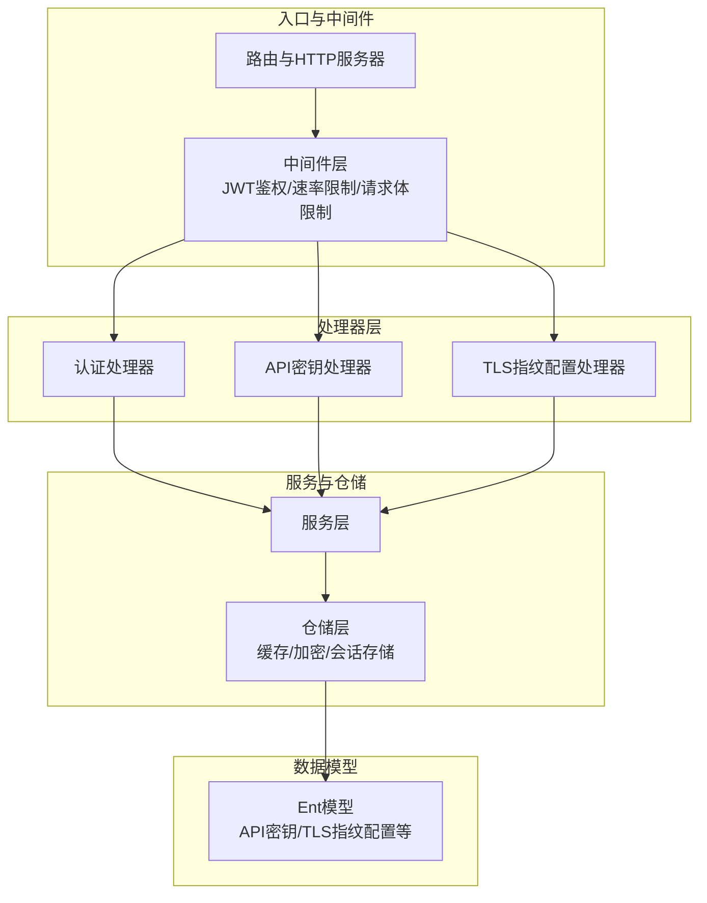
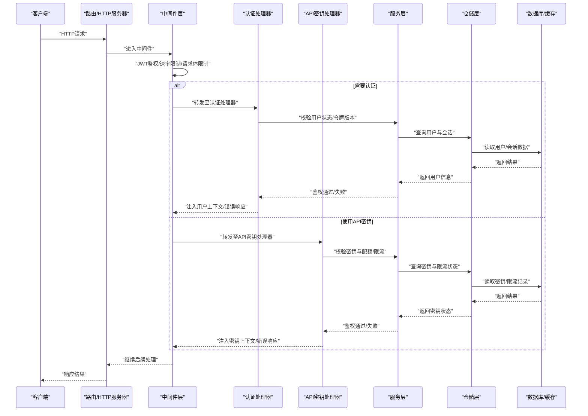
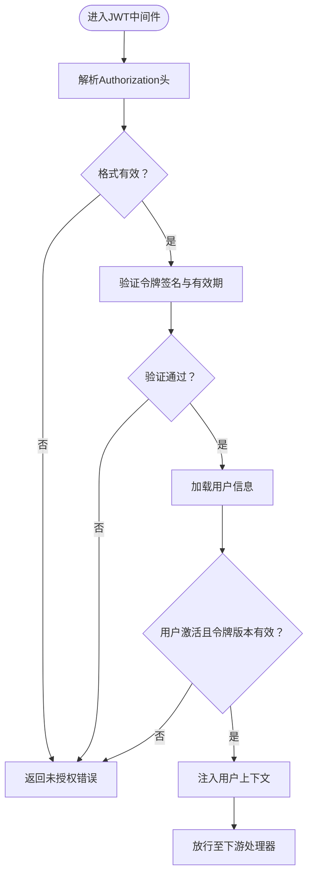
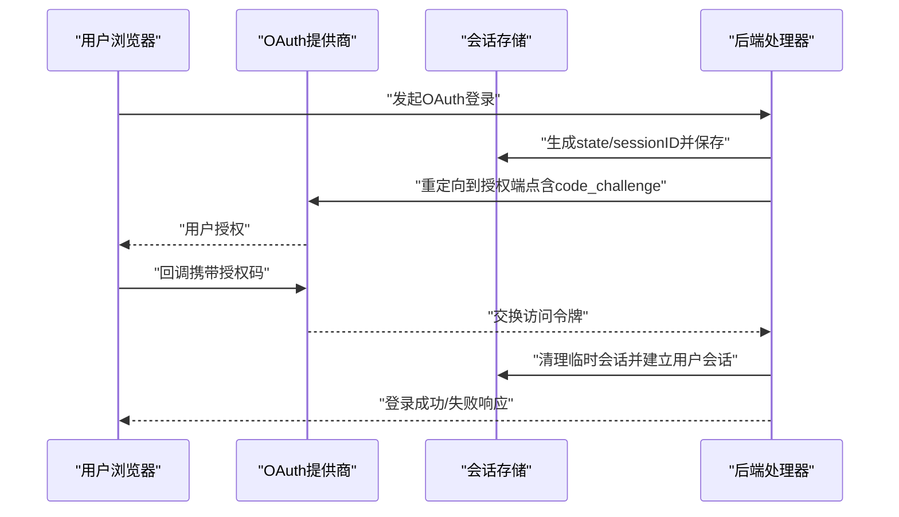
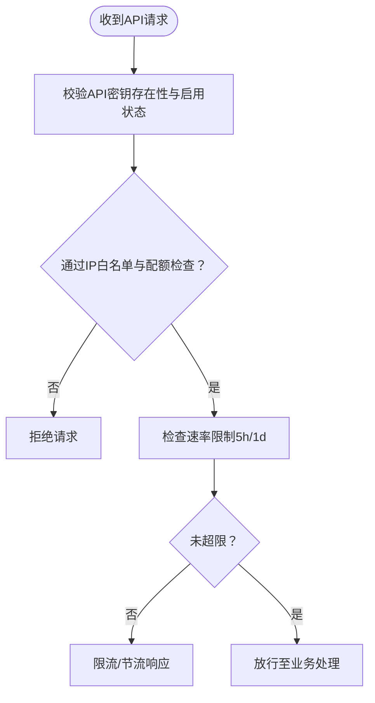
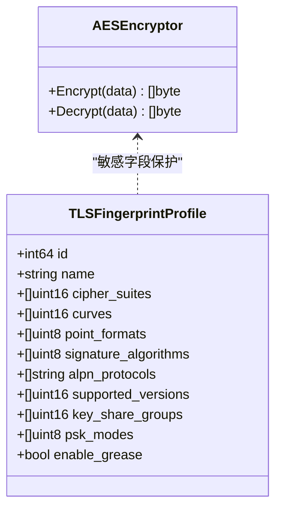
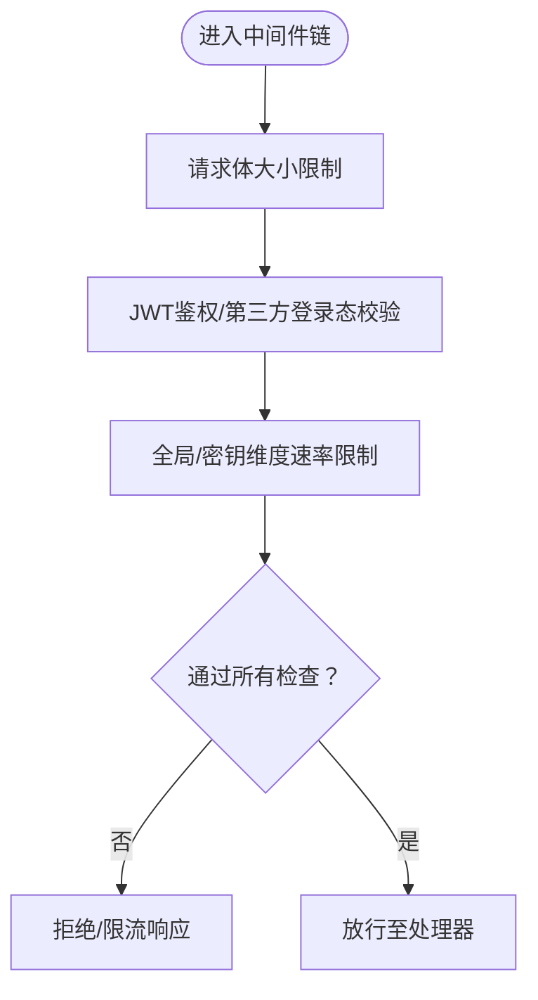
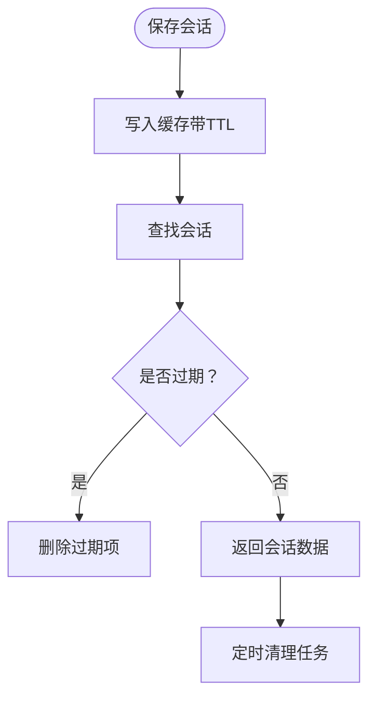
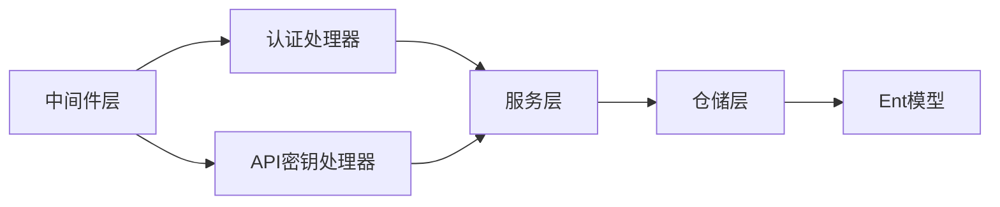

# 安全架构设计

<cite>
**本文引用的文件**
- [backend/internal/server/middleware/jwt_auth_test.go](file://backend/internal/server/middleware/jwt_auth_test.go)
- [backend/internal/middleware/rate_limiter.go](file://backend/internal/middleware/rate_limiter.go)
- [backend/internal/handler/auth_handler.go](file://backend/internal/handler/auth_handler.go)
- [backend/internal/handler/api_key_handler.go](file://backend/internal/handler/api_key_handler.go)
- [backend/internal/repository/aes_encryptor.go](file://backend/internal/repository/aes_encryptor.go)
- [backend/internal/pkg/antigravity/oauth.go](file://backend/internal/pkg/antigravity/oauth.go)
- [backend/internal/handler/admin/tls_fingerprint_profile_handler.go](file://backend/internal/handler/admin/tls_fingerprint_profile_handler.go)
- [backend/ent/tlsfingerprintprofile.go](file://backend/ent/tlsfingerprintprofile.go)
- [backend/ent/tlsfingerprintprofile_create.go](file://backend/ent/tlsfingerprintprofile_create.go)
- [backend/ent/tlsfingerprintprofile_update.go](file://backend/ent/tlsfingerprintprofile_update.go)
- [backend/ent/apikey/where.go](file://backend/ent/apikey/where.go)
- [backend/internal/service/digest_session_store_test.go](file://backend/internal/service/digest_session_store_test.go)
</cite>

## 目录
1. [引言](#引言)
2. [项目结构](#项目结构)
3. [核心组件](#核心组件)
4. [架构总览](#架构总览)
5. [详细组件分析](#详细组件分析)
6. [依赖关系分析](#依赖关系分析)
7. [性能考虑](#性能考虑)
8. [故障排查指南](#故障排查指南)
9. [结论](#结论)
10. [附录](#附录)

## 引言
本文件面向Sub2API系统的安全架构设计，聚焦于认证与授权、数据加密与传输、访问控制策略、中间件安全处理（请求验证、参数过滤、速率限制）、数据安全保护（敏感信息加密、日志脱敏、会话管理）、安全审计与应急响应，以及安全配置最佳实践与常见威胁防护方案。文档以代码为依据，结合可落地的流程图与类图，帮助技术与非技术读者理解系统在安全方面的设计与实现。

## 项目结构
后端采用分层架构：入口路由与中间件层负责统一安全处理；处理器层承接业务接口；服务层封装领域逻辑；仓储层负责数据持久化与缓存；模型层定义数据库实体与字段约束。安全相关能力主要分布在中间件、认证处理器、API密钥处理器、会话与加密工具、TLS指纹配置等模块中。

图表来源
- [backend/internal/server/middleware/jwt_auth_test.go:47-224](file://backend/internal/server/middleware/jwt_auth_test.go#L47-L224)
- [backend/internal/middleware/rate_limiter.go](file://backend/internal/middleware/rate_limiter.go)
- [backend/internal/handler/auth_handler.go](file://backend/internal/handler/auth_handler.go)
- [backend/internal/handler/api_key_handler.go](file://backend/internal/handler/api_key_handler.go)
- [backend/internal/handler/admin/tls_fingerprint_profile_handler.go:74-125](file://backend/internal/handler/admin/tls_fingerprint_profile_handler.go#L74-L125)

章节来源
- [backend/internal/server/middleware/jwt_auth_test.go:47-224](file://backend/internal/server/middleware/jwt_auth_test.go#L47-L224)
- [backend/internal/middleware/rate_limiter.go](file://backend/internal/middleware/rate_limiter.go)
- [backend/internal/handler/auth_handler.go](file://backend/internal/handler/auth_handler.go)
- [backend/internal/handler/api_key_handler.go](file://backend/internal/handler/api_key_handler.go)
- [backend/internal/handler/admin/tls_fingerprint_profile_handler.go:74-125](file://backend/internal/handler/admin/tls_fingerprint_profile_handler.go#L74-L125)

## 核心组件
- 认证与授权
  - JWT鉴权中间件：统一校验Authorization头格式与令牌有效性，并从上下文提取用户身份与角色。
  - OAuth第三方登录：生成state与code_verifier，完成PKCE流程，维护会话存储与清理。
- 数据加密与传输
  - 敏感字段加密：仓储层提供AES对称加密器，用于凭证与密钥的持久化保护。
  - TLS指纹配置：支持配置TLS客户端指纹参数集，增强上游连接一致性与安全性。
- 访问控制与速率限制
  - API密钥维度的速率限制：通过Ent查询谓词对不同粒度（如5小时/1天）进行限制。
  - 中间件级速率限制：全局请求频率控制，防止滥用与DoS。
- 会话与日志
  - 摘要会话存储：基于内存缓存的会话键值存储，带TTL与并发安全。
  - 日志脱敏：建议在日志输出时对敏感字段进行脱敏处理（策略性建议）。

章节来源
- [backend/internal/server/middleware/jwt_auth_test.go:47-224](file://backend/internal/server/middleware/jwt_auth_test.go#L47-L224)
- [backend/internal/pkg/antigravity/oauth.go:252-326](file://backend/internal/pkg/antigravity/oauth.go#L252-L326)
- [backend/internal/repository/aes_encryptor.go](file://backend/internal/repository/aes_encryptor.go)
- [backend/ent/apikey/where.go:748-816](file://backend/ent/apikey/where.go#L748-L816)
- [backend/internal/middleware/rate_limiter.go](file://backend/internal/middleware/rate_limiter.go)
- [backend/internal/service/digest_session_store_test.go:132-181](file://backend/internal/service/digest_session_store_test.go#L132-L181)

## 架构总览
下图展示从客户端到后端服务的整体安全交互路径：请求经由路由进入中间件层，执行鉴权与限流；随后进入处理器层，根据业务类型调用相应服务；服务层通过仓储层访问数据库或缓存；敏感数据通过加密器进行保护；TLS指纹配置用于上游连接的一致性与安全加固。

图表来源
- [backend/internal/server/middleware/jwt_auth_test.go:47-224](file://backend/internal/server/middleware/jwt_auth_test.go#L47-L224)
- [backend/internal/middleware/rate_limiter.go](file://backend/internal/middleware/rate_limiter.go)
- [backend/internal/handler/auth_handler.go](file://backend/internal/handler/auth_handler.go)
- [backend/internal/handler/api_key_handler.go](file://backend/internal/handler/api_key_handler.go)

## 详细组件分析

### JWT令牌管理与中间件鉴权
- 请求头格式校验：支持大小写不敏感的Bearer前缀，拒绝无前缀、格式错误或空令牌。
- 用户状态与令牌版本：从令牌解析出用户标识与角色，检查用户是否激活及令牌版本是否有效。
- 上下文注入：成功鉴权后将用户ID、角色等信息注入请求上下文，供后续处理器使用。
- 测试覆盖：包含多种边界场景，如缺失头、格式错误、空令牌、用户不存在、用户禁用等。

图表来源
- [backend/internal/server/middleware/jwt_auth_test.go:47-224](file://backend/internal/server/middleware/jwt_auth_test.go#L47-L224)

章节来源
- [backend/internal/server/middleware/jwt_auth_test.go:47-224](file://backend/internal/server/middleware/jwt_auth_test.go#L47-L224)

### OAuth第三方登录与会话管理
- PKCE流程：生成state与code_verifier，计算code_challenge，确保授权码的安全性。
- 会话存储：基于内存缓存的会话存储，支持并发安全与TTL清理。
- 会话清理：定期扫描并删除过期会话，避免资源泄露。
- 并发测试：通过大量并发操作验证会话存储的正确性与稳定性。

图表来源
- [backend/internal/pkg/antigravity/oauth.go:252-326](file://backend/internal/pkg/antigravity/oauth.go#L252-L326)

章节来源
- [backend/internal/pkg/antigravity/oauth.go:252-326](file://backend/internal/pkg/antigravity/oauth.go#L252-L326)
- [backend/internal/service/digest_session_store_test.go:132-181](file://backend/internal/service/digest_session_store_test.go#L132-L181)

### API密钥安全策略与速率限制
- 密钥维度限流：通过Ent查询谓词对不同时间窗口（如5小时/1天）设置与查询速率限制。
- 处理器职责：在处理器层校验密钥有效性、启用状态、IP白名单、额度与配额等。
- 缓存与数据库协同：利用缓存快速判断配额与限流状态，降低数据库压力。

图表来源
- [backend/ent/apikey/where.go:748-816](file://backend/ent/apikey/where.go#L748-L816)
- [backend/internal/handler/api_key_handler.go](file://backend/internal/handler/api_key_handler.go)

章节来源
- [backend/ent/apikey/where.go:748-816](file://backend/ent/apikey/where.go#L748-L816)
- [backend/internal/handler/api_key_handler.go](file://backend/internal/handler/api_key_handler.go)

### 数据加密与传输安全
- 对称加密：仓储层提供AES加密器，用于敏感字段（如凭证、密钥）的持久化保护。
- TLS指纹配置：支持配置TLS客户端指纹参数（密码套件、曲线、ALPN等），提升上游连接一致性与抗探测能力。
- 数据模型：Ent模型定义了TLS指纹配置的字段与序列化方式，便于在数据库中存储与检索。

图表来源
- [backend/internal/repository/aes_encryptor.go](file://backend/internal/repository/aes_encryptor.go)
- [backend/ent/tlsfingerprintprofile.go:222-257](file://backend/ent/tlsfingerprintprofile.go#L222-L257)
- [backend/ent/tlsfingerprintprofile_create.go:53-522](file://backend/ent/tlsfingerprintprofile_create.go#L53-L522)
- [backend/ent/tlsfingerprintprofile_update.go:819-854](file://backend/ent/tlsfingerprintprofile_update.go#L819-L854)

章节来源
- [backend/internal/repository/aes_encryptor.go](file://backend/internal/repository/aes_encryptor.go)
- [backend/ent/tlsfingerprintprofile.go:222-257](file://backend/ent/tlsfingerprintprofile.go#L222-L257)
- [backend/ent/tlsfingerprintprofile_create.go:53-522](file://backend/ent/tlsfingerprintprofile_create.go#L53-L522)
- [backend/ent/tlsfingerprintprofile_update.go:819-854](file://backend/ent/tlsfingerprintprofile_update.go#L819-L854)

### 中间件层安全处理逻辑
- 请求验证：统一拦截Authorization头，校验格式与令牌有效性。
- 参数过滤：结合请求体大小限制中间件，防止过大载荷导致资源耗尽。
- 速率限制：全局与按密钥维度的限流策略，配合缓存与数据库实现高效控制。

图表来源
- [backend/internal/middleware/rate_limiter.go](file://backend/internal/middleware/rate_limiter.go)
- [backend/internal/server/middleware/jwt_auth_test.go:47-224](file://backend/internal/server/middleware/jwt_auth_test.go#L47-L224)

章节来源
- [backend/internal/middleware/rate_limiter.go](file://backend/internal/middleware/rate_limiter.go)
- [backend/internal/server/middleware/jwt_auth_test.go:47-224](file://backend/internal/server/middleware/jwt_auth_test.go#L47-L224)

### 会话安全管理
- 摘要会话存储：基于内存缓存的会话键值存储，支持TTL过期与并发安全。
- 并发与稳定性：通过并发压力测试验证会话存储在高并发下的正确性与稳定性。
- 自动清理：定期清理过期会话，避免内存泄漏与状态污染。

图表来源
- [backend/internal/service/digest_session_store_test.go:132-181](file://backend/internal/service/digest_session_store_test.go#L132-L181)

章节来源
- [backend/internal/service/digest_session_store_test.go:132-181](file://backend/internal/service/digest_session_store_test.go#L132-L181)

## 依赖关系分析
- 组件耦合与内聚：中间件层高度内聚，统一承担鉴权与限流职责；处理器层与服务层解耦，便于扩展与测试。
- 外部依赖：依赖缓存（会话/配额/计数）与数据库（用户、密钥、配置）；TLS指纹配置作为上游连接参数的一部分。
- 接口契约：JWT中间件与OAuth会话存储对外暴露简洁接口，便于替换与升级。

图表来源
- [backend/internal/middleware/rate_limiter.go](file://backend/internal/middleware/rate_limiter.go)
- [backend/internal/handler/auth_handler.go](file://backend/internal/handler/auth_handler.go)
- [backend/internal/handler/api_key_handler.go](file://backend/internal/handler/api_key_handler.go)
- [backend/internal/repository/aes_encryptor.go](file://backend/internal/repository/aes_encryptor.go)

章节来源
- [backend/internal/middleware/rate_limiter.go](file://backend/internal/middleware/rate_limiter.go)
- [backend/internal/handler/auth_handler.go](file://backend/internal/handler/auth_handler.go)
- [backend/internal/handler/api_key_handler.go](file://backend/internal/handler/api_key_handler.go)
- [backend/internal/repository/aes_encryptor.go](file://backend/internal/repository/aes_encryptor.go)

## 性能考虑
- 缓存优先：在鉴权与限流环节优先查询缓存，减少数据库压力；合理设置TTL与清理策略。
- 并发安全：会话存储与限流实现需保证高并发下的原子性与一致性。
- 资源隔离：对上游请求与内部服务调用设置合理的超时与重试策略，避免级联故障。
- 监控与告警：结合操作指标（延迟、错误率、配额使用率）进行动态阈值调整。

## 故障排查指南
- JWT鉴权失败
  - 检查Authorization头格式是否为“Bearer <token>”，大小写不敏感。
  - 核对用户状态与令牌版本是否匹配。
  - 参考测试用例定位问题场景。
- OAuth登录异常
  - 确认state与code_verifier生成与校验流程完整。
  - 检查会话存储是否正常保存与清理。
- API密钥限流
  - 核对密钥的启用状态、IP白名单与配额设置。
  - 检查5小时/1天维度的限流阈值是否触发。
- 会话存储问题
  - 关注TTL过期与并发冲突，确保清理任务运行正常。

章节来源
- [backend/internal/server/middleware/jwt_auth_test.go:47-224](file://backend/internal/server/middleware/jwt_auth_test.go#L47-L224)
- [backend/internal/pkg/antigravity/oauth.go:252-326](file://backend/internal/pkg/antigravity/oauth.go#L252-L326)
- [backend/ent/apikey/where.go:748-816](file://backend/ent/apikey/where.go#L748-L816)
- [backend/internal/service/digest_session_store_test.go:132-181](file://backend/internal/service/digest_session_store_test.go#L132-L181)

## 结论
本安全架构围绕“统一鉴权、细粒度限流、敏感数据保护、会话治理与TLS指纹配置”构建，通过中间件层实现横切关注点，结合处理器与服务层完成业务闭环。建议持续完善日志脱敏、入侵检测与应急响应机制，并基于监控指标动态优化限流阈值与缓存策略。

## 附录
- 安全配置最佳实践
  - 强制HTTPS与TLS指纹配置，最小化暴露面。
  - 严格管理API密钥生命周期，启用IP白名单与配额。
  - 定期轮换密钥与会话存储的加密密钥。
  - 开启审计日志并实施日志脱敏策略。
- 常见威胁与防护
  - 令牌泄露：引入令牌版本与撤销机制，缩短令牌有效期。
  - 会话劫持：启用会话TTL与并发安全，结合双因素认证。
  - 速率攻击：多维限流（全局/用户/密钥/上游），配合IP封禁。
  - 数据泄露：对凭证与密钥进行对称加密存储，最小化明文暴露。