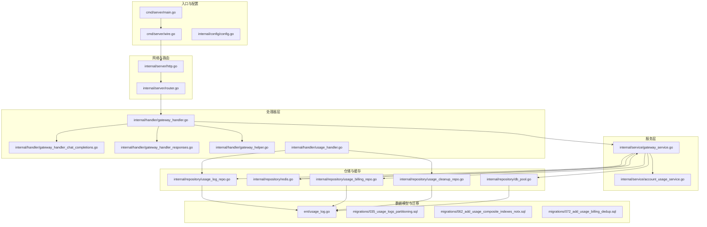
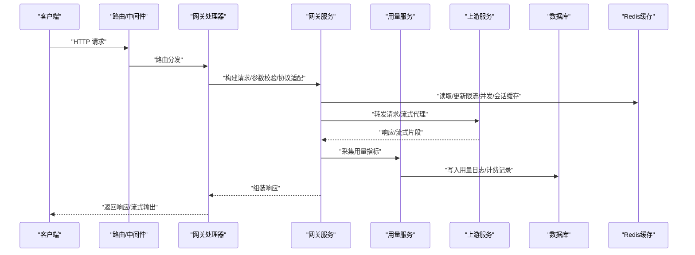
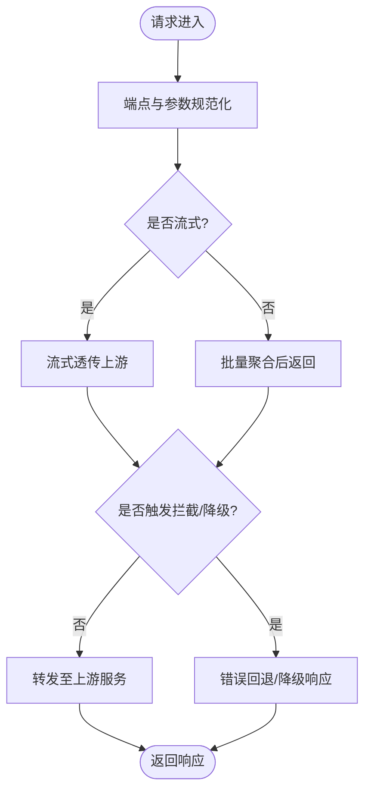
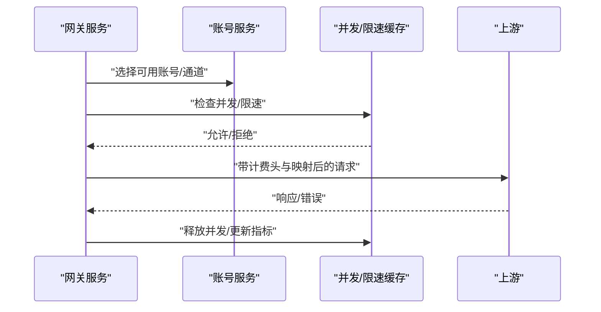
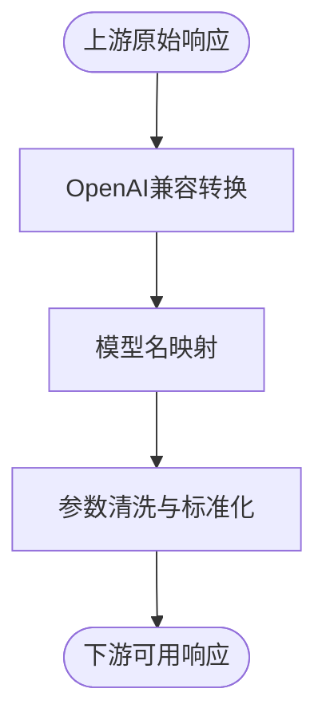
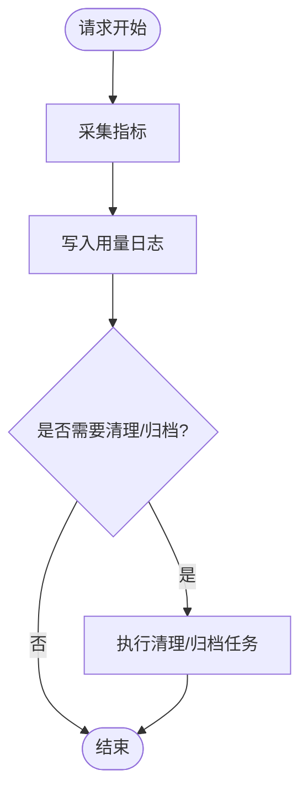
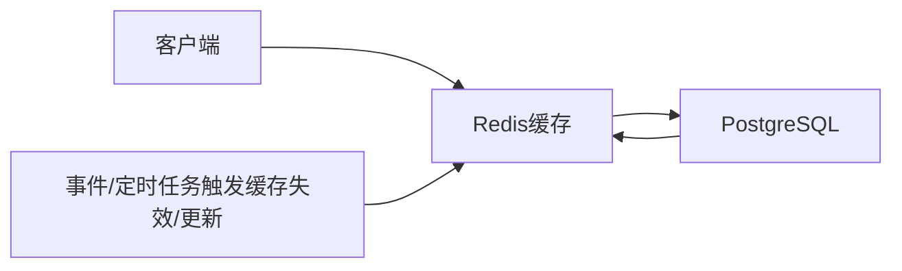
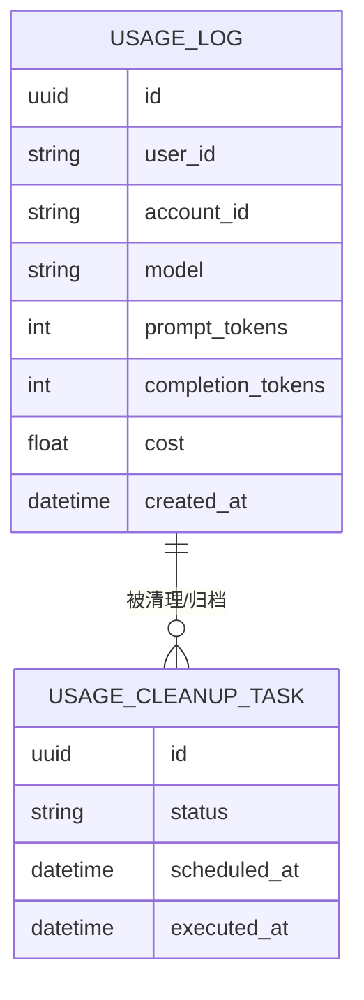
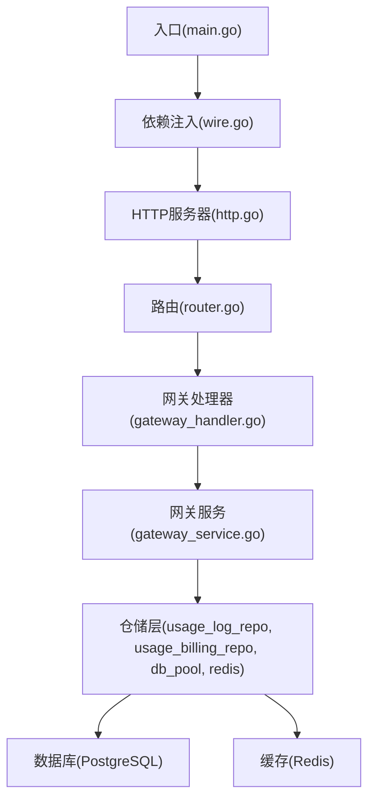

# 数据流分析

<cite>
**本文引用的文件**
- [backend/cmd/server/main.go](file://backend/cmd/server/main.go)
- [backend/cmd/server/wire.go](file://backend/cmd/server/wire.go)
- [backend/internal/handler/gateway_handler.go](file://backend/internal/handler/gateway_handler.go)
- [backend/internal/handler/gateway_handler_chat_completions.go](file://backend/internal/handler/gateway_handler_chat_completions.go)
- [backend/internal/handler/gateway_handler_responses.go](file://backend/internal/handler/gateway_handler_responses.go)
- [backend/internal/handler/gateway_helper.go](file://backend/internal/handler/gateway_helper.go)
- [backend/internal/handler/usage_handler.go](file://backend/internal/handler/usage_handler.go)
- [backend/internal/repository/usage_log_repo.go](file://backend/internal/repository/usage_log_repo.go)
- [backend/internal/repository/usage_billing_repo.go](file://backend/internal/repository/usage_billing_repo.go)
- [backend/internal/repository/usage_cleanup_repo.go](file://backend/internal/repository/usage_cleanup_repo.go)
- [backend/internal/repository/db_pool.go](file://backend/internal/repository/db_pool.go)
- [backend/internal/repository/redis.go](file://backend/internal/repository/redis.go)
- [backend/internal/service/gateway_service.go](file://backend/internal/service/gateway_service.go)
- [backend/internal/service/account_usage_service.go](file://backend/internal/service/account_usage_service.go)
- [backend/internal/pkg/usagestats/usagestats.go](file://backend/internal/pkg/usagestats/usagestats.go)
- [backend/internal/pkg/openai/openai_gateway_handler.go](file://backend/internal/pkg/openai/openai_gateway_handler.go)
- [backend/internal/pkg/apicompat/apicompat.go](file://backend/internal/pkg/apicompat/apicompat.go)
- [backend/internal/middleware/rate_limiter.go](file://backend/internal/middleware/rate_limiter.go)
- [backend/internal/server/router.go](file://backend/internal/server/router.go)
- [backend/internal/server/http.go](file://backend/internal/server/http.go)
- [backend/internal/config/config.go](file://backend/internal/config/config.go)
- [backend/ent/usage_log.go](file://backend/ent/usage_log.go)
- [backend/ent/usage_log_create.go](file://backend/ent/usage_log_create.go)
- [backend/ent/usage_log_query.go](file://backend/ent/usage_log_query.go)
- [backend/ent/usage_log_update.go](file://backend/ent/usage_log_update.go)
- [backend/ent/usage_log_delete.go](file://backend/ent/usage_log_delete.go)
- [backend/ent/usage_cleanup_task.go](file://backend/ent/usage_cleanup_task.go)
- [backend/ent/usage_cleanup_task_create.go](file://backend/ent/usage_cleanup_task_create.go)
- [backend/ent/usage_cleanup_task_query.go](file://backend/ent/usage_cleanup_task_query.go)
- [backend/ent/usage_cleanup_task_update.go](file://backend/ent/usage_cleanup_task_update.go)
- [backend/ent/usage_cleanup_task_delete.go](file://backend/ent/usage_cleanup_task_delete.go)
- [backend/migrations/035_usage_logs_partitioning.sql](file://backend/migrations/035_usage_logs_partitioning.sql)
- [backend/migrations/062_add_usage_composite_indexes_notx.sql](file://backend/migrations/062_add_usage_composite_indexes_notx.sql)
- [backend/migrations/072_add_usage_billing_dedup.sql](file://backend/migrations/072_add_usage_billing_dedup.sql)
- [backend/migrations/073_add_usage_billing_dedup_archive.sql](file://backend/migrations/073_add_usage_billing_dedup_archive.sql)
- [backend/migrations/076_add_usage_log_upstream_model_index_notx.sql](file://backend/migrations/076_add_usage_log_upstream_model_index_notx.sql)
- [backend/migrations/078_add_usage_log_requested_model_index_notx.sql](file://backend/migrations/078_add_usage_log_requested_model_index_notx.sql)
- [backend/migrations/087_usage_log_billing_mode.sql](file://backend/migrations/087_usage_log_billing_mode.sql)
- [backend/migrations/088_channel_billing_model_source.sql](file://backend/migrations/088_channel_billing_model_source.sql)
- [backend/migrations/089_usage_log_image_output_tokens.sql](file://backend/migrations/089_usage_log_image_output_tokens.sql)
- [backend/migrations/090_drop_sora.sql](file://backend/migrations/090_drop_sora.sql)
- [backend/migrations/144_add_opus48_to_model_mapping.sql](file://backend/migrations/144_add_opus48_to_model_mapping.sql)
</cite>

## 目录
1. [引言](#引言)
2. [项目结构](#项目结构)
3. [核心组件](#核心组件)
4. [架构总览](#架构总览)
5. [详细组件分析](#详细组件分析)
6. [依赖关系分析](#依赖关系分析)
7. [性能考量](#性能考量)
8. [故障排查指南](#故障排查指南)
9. [结论](#结论)
10. [附录](#附录)

## 引言
本文件面向Sub2API后端系统，聚焦“数据流”主题，系统性梳理从用户请求进入API网关，到上游服务调用、数据转换与映射、用量统计采集与计算、缓存层同步、数据库读写与一致性保障，直至最终响应返回的完整数据路径。文档同时提供多类Mermaid图示，帮助读者快速把握关键节点与流程。

## 项目结构
后端采用模块化分层设计：入口程序负责依赖注入与启动；路由层承接HTTP请求；处理器层实现业务编排与协议适配；服务层封装领域逻辑；仓储层负责数据持久化与缓存；配置与迁移管理数据库演进。

图表来源
- [backend/cmd/server/main.go](file://backend/cmd/server/main.go)
- [backend/cmd/server/wire.go](file://backend/cmd/server/wire.go)
- [backend/internal/server/http.go](file://backend/internal/server/http.go)
- [backend/internal/server/router.go](file://backend/internal/server/router.go)
- [backend/internal/handler/gateway_handler.go](file://backend/internal/handler/gateway_handler.go)
- [backend/internal/handler/gateway_handler_chat_completions.go](file://backend/internal/handler/gateway_handler_chat_completions.go)
- [backend/internal/handler/gateway_handler_responses.go](file://backend/internal/handler/gateway_handler_responses.go)
- [backend/internal/handler/gateway_helper.go](file://backend/internal/handler/gateway_helper.go)
- [backend/internal/handler/usage_handler.go](file://backend/internal/handler/usage_handler.go)
- [backend/internal/service/gateway_service.go](file://backend/internal/service/gateway_service.go)
- [backend/internal/service/account_usage_service.go](file://backend/internal/service/account_usage_service.go)
- [backend/internal/repository/db_pool.go](file://backend/internal/repository/db_pool.go)
- [backend/internal/repository/redis.go](file://backend/internal/repository/redis.go)
- [backend/internal/repository/usage_log_repo.go](file://backend/internal/repository/usage_log_repo.go)
- [backend/internal/repository/usage_billing_repo.go](file://backend/internal/repository/usage_billing_repo.go)
- [backend/internal/repository/usage_cleanup_repo.go](file://backend/internal/repository/usage_cleanup_repo.go)
- [backend/ent/usage_log.go](file://backend/ent/usage_log.go)
- [backend/migrations/035_usage_logs_partitioning.sql](file://backend/migrations/035_usage_logs_partitioning.sql)
- [backend/migrations/062_add_usage_composite_indexes_notx.sql](file://backend/migrations/062_add_usage_composite_indexes_notx.sql)
- [backend/migrations/072_add_usage_billing_dedup.sql](file://backend/migrations/072_add_usage_billing_dedup.sql)

章节来源
- [backend/cmd/server/main.go](file://backend/cmd/server/main.go)
- [backend/cmd/server/wire.go](file://backend/cmd/server/wire.go)
- [backend/internal/server/http.go](file://backend/internal/server/http.go)
- [backend/internal/server/router.go](file://backend/internal/server/router.go)

## 核心组件
- 入口与依赖注入：通过wire生成器集中装配服务、仓储与外部依赖，确保启动时即具备完整的运行环境。
- 网关处理器：统一承接OpenAI等兼容接口请求，完成协议适配、参数标准化、流式/非流式响应处理与错误回退。
- 网关服务：封装上游选择、重试与降级、用量记录、计费头生成、并发控制等核心逻辑。
- 用量统计：在请求生命周期内采集请求类型、模型、令牌数、耗时、错误码等指标，并落库与清理。
- 缓存层：Redis用于高频读取与限流、会话、并发控制等场景，降低数据库压力。
- 数据库与迁移：基于Ent ORM与SQL迁移，对用量日志进行分区、索引优化与去重归档，保障查询与聚合效率。

章节来源
- [backend/cmd/server/wire.go](file://backend/cmd/server/wire.go)
- [backend/internal/handler/gateway_handler.go](file://backend/internal/handler/gateway_handler.go)
- [backend/internal/service/gateway_service.go](file://backend/internal/service/gateway_service.go)
- [backend/internal/handler/usage_handler.go](file://backend/internal/handler/usage_handler.go)
- [backend/internal/repository/redis.go](file://backend/internal/repository/redis.go)
- [backend/ent/usage_log.go](file://backend/ent/usage_log.go)

## 架构总览
下图展示一次典型请求从进入API网关到上游调用、用量统计与响应返回的全链路数据流。

图表来源
- [backend/internal/server/router.go](file://backend/internal/server/router.go)
- [backend/internal/handler/gateway_handler.go](file://backend/internal/handler/gateway_handler.go)
- [backend/internal/service/gateway_service.go](file://backend/internal/service/gateway_service.go)
- [backend/internal/service/account_usage_service.go](file://backend/internal/service/account_usage_service.go)
- [backend/internal/repository/redis.go](file://backend/internal/repository/redis.go)
- [backend/ent/usage_log.go](file://backend/ent/usage_log.go)

## 详细组件分析

### API网关数据转发机制
- 协议适配与端点规范化：处理器将不同平台的请求参数映射为内部统一格式，确保后续服务无需感知上游差异。
- 流式与非流式处理：针对流式响应（如OpenAI的SSE）进行逐段透传，非流式则一次性聚合后返回。
- 错误回退与拦截：当上游异常或速率限制触发时，执行预设的降级策略与错误透传规则，保证用户体验与可观测性。
- 身份与配额校验：在转发前完成API Key鉴权、配额检查与组别隔离，避免无效请求进入上游。

图表来源
- [backend/internal/handler/gateway_handler.go](file://backend/internal/handler/gateway_handler.go)
- [backend/internal/handler/gateway_handler_chat_completions.go](file://backend/internal/handler/gateway_handler_chat_completions.go)
- [backend/internal/handler/gateway_handler_responses.go](file://backend/internal/handler/gateway_handler_responses.go)
- [backend/internal/handler/gateway_helper.go](file://backend/internal/handler/gateway_helper.go)

章节来源
- [backend/internal/handler/gateway_handler.go](file://backend/internal/handler/gateway_handler.go)
- [backend/internal/handler/gateway_handler_chat_completions.go](file://backend/internal/handler/gateway_handler_chat_completions.go)
- [backend/internal/handler/gateway_handler_responses.go](file://backend/internal/handler/gateway_handler_responses.go)
- [backend/internal/handler/gateway_helper.go](file://backend/internal/handler/gateway_helper.go)

### 上游服务调用流程
- 账号与通道选择：根据用户所属组别、模型支持与负载因子，动态选择最优上游账号与通道。
- 并发与限速：结合Redis缓存与服务内计数器，控制每账号/每组别的并发与速率，避免过载。
- 重试与退避：对可重试错误采用指数退避策略，提升稳定性。
- 计费头与模型映射：在请求头中注入计费信息，并按需进行模型名称映射以适配上游要求。

图表来源
- [backend/internal/service/gateway_service.go](file://backend/internal/service/gateway_service.go)
- [backend/internal/service/account_usage_service.go](file://backend/internal/service/account_usage_service.go)
- [backend/internal/repository/redis.go](file://backend/internal/repository/redis.go)

章节来源
- [backend/internal/service/gateway_service.go](file://backend/internal/service/gateway_service.go)
- [backend/internal/service/account_usage_service.go](file://backend/internal/service/account_usage_service.go)
- [backend/internal/repository/redis.go](file://backend/internal/repository/redis.go)

### 数据转换与映射规则
- OpenAI兼容层：将上游返回的消息结构、字段顺序与特殊标记进行兼容性转换，确保下游SDK稳定消费。
- 模型映射：依据渠道与定价配置，将请求中的模型名映射到上游实际支持的模型标识。
- 参数清洗：剔除不必要字段、标准化时间戳与数值精度，减少上游差异带来的兼容问题。

图表来源
- [backend/internal/pkg/openai/openai_gateway_handler.go](file://backend/internal/pkg/openai/openai_gateway_handler.go)
- [backend/internal/pkg/apicompat/apicompat.go](file://backend/internal/pkg/apicompat/apicompat.go)

章节来源
- [backend/internal/pkg/openai/openai_gateway_handler.go](file://backend/internal/pkg/openai/openai_gateway_handler.go)
- [backend/internal/pkg/apicompat/apicompat.go](file://backend/internal/pkg/apicompat/apicompat.go)

### 用量统计的数据收集与计算
- 采集维度：请求类型、模型、请求/输出令牌数、耗时、错误码、上游模型、请求模型、计费模式、服务等级等。
- 写入策略：在请求结束时异步写入用量日志表，同时维护计费相关记录，支持后续对账与报表。
- 清理与归档：定期清理过期用量日志，并将历史数据归档至专用表，降低在线表膨胀。

图表来源
- [backend/internal/handler/usage_handler.go](file://backend/internal/handler/usage_handler.go)
- [backend/internal/repository/usage_log_repo.go](file://backend/internal/repository/usage_log_repo.go)
- [backend/internal/repository/usage_cleanup_repo.go](file://backend/internal/repository/usage_cleanup_repo.go)
- [backend/internal/pkg/usagestats/usagestats.go](file://backend/internal/pkg/usagestats/usagestats.go)

章节来源
- [backend/internal/handler/usage_handler.go](file://backend/internal/handler/usage_handler.go)
- [backend/internal/repository/usage_log_repo.go](file://backend/internal/repository/usage_log_repo.go)
- [backend/internal/repository/usage_cleanup_repo.go](file://backend/internal/repository/usage_cleanup_repo.go)
- [backend/internal/pkg/usagestats/usagestats.go](file://backend/internal/pkg/usagestats/usagestats.go)

### 缓存层的数据同步机制
- 读写分离：高频只读数据（如配额、白名单、计费配置）优先从Redis读取；写操作通过单飞/队列确保一致性。
- 并发与限流：利用Redis原子操作实现分布式锁与计数器，保障高并发下的正确性。
- 失效策略：结合TTL与事件驱动，确保缓存与数据库状态一致，避免脏读。

图表来源
- [backend/internal/repository/redis.go](file://backend/internal/repository/redis.go)
- [backend/internal/service/gateway_service.go](file://backend/internal/service/gateway_service.go)

章节来源
- [backend/internal/repository/redis.go](file://backend/internal/repository/redis.go)
- [backend/internal/service/gateway_service.go](file://backend/internal/service/gateway_service.go)

### 数据库操作的数据流向
- ORM与事务：使用Ent进行对象建模与事务封装，保证跨表操作的一致性与可追踪性。
- 读写分离：通过连接池与只读副本，缓解主库压力；写操作集中在主库。
- 分区与索引：对用量日志表进行分区与复合索引优化，提升查询与聚合性能。
- 去重与归档：对计费重复数据进行去重处理，并将历史数据归档，保持在线表高效。

图表来源
- [backend/ent/usage_log.go](file://backend/ent/usage_log.go)
- [backend/ent/usage_cleanup_task.go](file://backend/ent/usage_cleanup_task.go)

章节来源
- [backend/ent/usage_log.go](file://backend/ent/usage_log.go)
- [backend/ent/usage_cleanup_task.go](file://backend/ent/usage_cleanup_task.go)
- [backend/internal/repository/db_pool.go](file://backend/internal/repository/db_pool.go)

## 依赖关系分析
- 组件耦合：处理器依赖服务层；服务层依赖仓储层与缓存；仓储层依赖数据库与缓存；入口通过wire集中装配。
- 外部依赖：上游服务、Redis、PostgreSQL、数据库迁移脚本。
- 循环依赖：未见循环依赖迹象，分层清晰。

图表来源
- [backend/cmd/server/main.go](file://backend/cmd/server/main.go)
- [backend/cmd/server/wire.go](file://backend/cmd/server/wire.go)
- [backend/internal/server/http.go](file://backend/internal/server/http.go)
- [backend/internal/server/router.go](file://backend/internal/server/router.go)
- [backend/internal/handler/gateway_handler.go](file://backend/internal/handler/gateway_handler.go)
- [backend/internal/service/gateway_service.go](file://backend/internal/service/gateway_service.go)
- [backend/internal/repository/usage_log_repo.go](file://backend/internal/repository/usage_log_repo.go)
- [backend/internal/repository/usage_billing_repo.go](file://backend/internal/repository/usage_billing_repo.go)
- [backend/internal/repository/db_pool.go](file://backend/internal/repository/db_pool.go)
- [backend/internal/repository/redis.go](file://backend/internal/repository/redis.go)

章节来源
- [backend/cmd/server/main.go](file://backend/cmd/server/main.go)
- [backend/cmd/server/wire.go](file://backend/cmd/server/wire.go)
- [backend/internal/server/http.go](file://backend/internal/server/http.go)
- [backend/internal/server/router.go](file://backend/internal/server/router.go)
- [backend/internal/handler/gateway_handler.go](file://backend/internal/handler/gateway_handler.go)
- [backend/internal/service/gateway_service.go](file://backend/internal/service/gateway_service.go)
- [backend/internal/repository/usage_log_repo.go](file://backend/internal/repository/usage_log_repo.go)
- [backend/internal/repository/usage_billing_repo.go](file://backend/internal/repository/usage_billing_repo.go)
- [backend/internal/repository/db_pool.go](file://backend/internal/repository/db_pool.go)
- [backend/internal/repository/redis.go](file://backend/internal/repository/redis.go)

## 性能考量
- 连接池与只读副本：通过连接池与只读副本降低主库压力，提升查询吞吐。
- 缓存命中率：热点数据尽量驻留Redis，减少数据库访问；合理设置TTL与失效策略。
- 索引与分区：对常用查询字段建立复合索引，对用量日志进行分区，缩短扫描范围。
- 流式透传：对长连接与流式响应采用边产生边透传，降低内存峰值与延迟。
- 限流与降级：在高并发场景启用限流与降级，保障系统稳定性。

## 故障排查指南
- 请求无响应或超时：检查上游连通性、限流与并发缓存状态、重试策略是否生效。
- 用量统计缺失：确认用量写入是否成功、清理任务是否按时执行、索引是否影响写入性能。
- 缓存不一致：核对缓存失效策略与事件触发，检查TTL设置与键空间冲突。
- 数据库慢查询：审查复合索引与分区策略，关注写放大与归档任务执行情况。

章节来源
- [backend/internal/middleware/rate_limiter.go](file://backend/internal/middleware/rate_limiter.go)
- [backend/internal/repository/redis.go](file://backend/internal/repository/redis.go)
- [backend/migrations/062_add_usage_composite_indexes_notx.sql](file://backend/migrations/062_add_usage_composite_indexes_notx.sql)
- [backend/migrations/072_add_usage_billing_dedup.sql](file://backend/migrations/072_add_usage_billing_dedup.sql)

## 结论
本系统通过清晰的分层与模块化设计，实现了从请求接入、协议适配、上游转发、用量统计到缓存与数据库的完整数据流闭环。配合索引、分区与归档策略，系统在高并发与大数据量场景下仍能保持稳定与高效。建议持续监控缓存命中率与数据库写入性能，结合迁移脚本迭代优化查询路径与存储结构。

## 附录
- 关键迁移要点
  - 用量日志分区：提升大规模写入与查询性能。
  - 复合索引：加速常用聚合与过滤查询。
  - 计费去重与归档：降低重复统计风险与在线表膨胀。
  - 计费模式与渠道映射：完善计费准确性与审计能力。

章节来源
- [backend/migrations/035_usage_logs_partitioning.sql](file://backend/migrations/035_usage_logs_partitioning.sql)
- [backend/migrations/062_add_usage_composite_indexes_notx.sql](file://backend/migrations/062_add_usage_composite_indexes_notx.sql)
- [backend/migrations/072_add_usage_billing_dedup.sql](file://backend/migrations/072_add_usage_billing_dedup.sql)
- [backend/migrations/073_add_usage_billing_dedup_archive.sql](file://backend/migrations/073_add_usage_billing_dedup_archive.sql)
- [backend/migrations/087_usage_log_billing_mode.sql](file://backend/migrations/087_usage_log_billing_mode.sql)
- [backend/migrations/088_channel_billing_model_source.sql](file://backend/migrations/088_channel_billing_model_source.sql)
- [backend/migrations/089_usage_log_image_output_tokens.sql](file://backend/migrations/089_usage_log_image_output_tokens.sql)
- [backend/migrations/090_drop_sora.sql](file://backend/migrations/090_drop_sora.sql)
- [backend/migrations/144_add_opus48_to_model_mapping.sql](file://backend/migrations/144_add_opus48_to_model_mapping.sql)