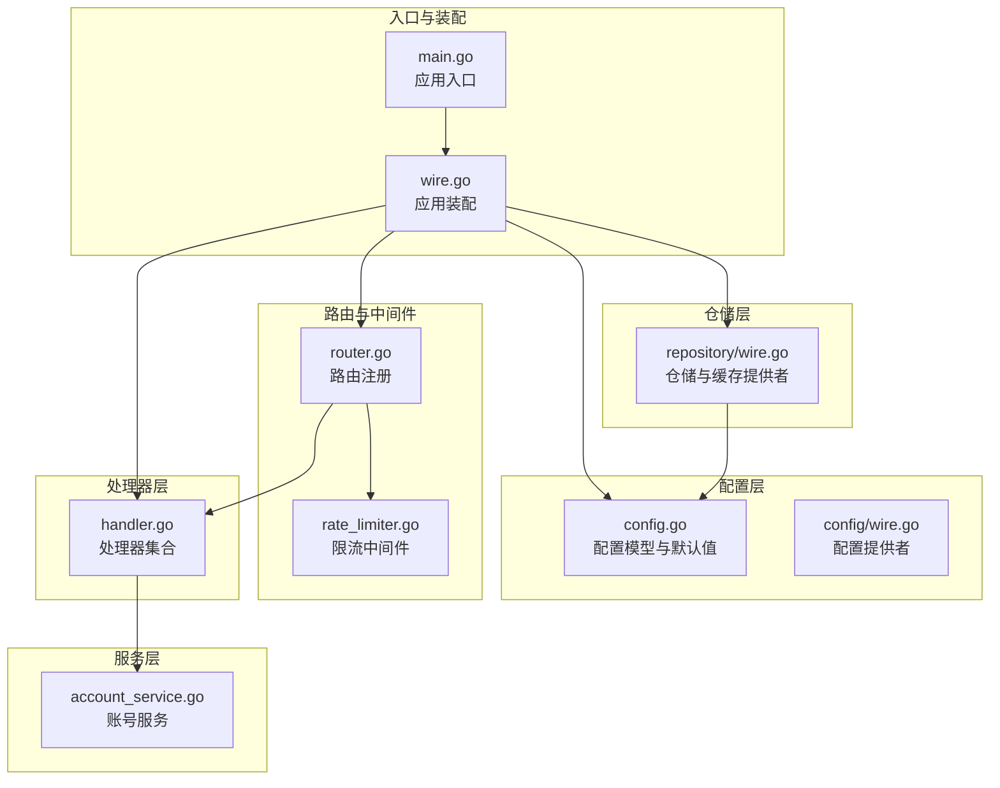
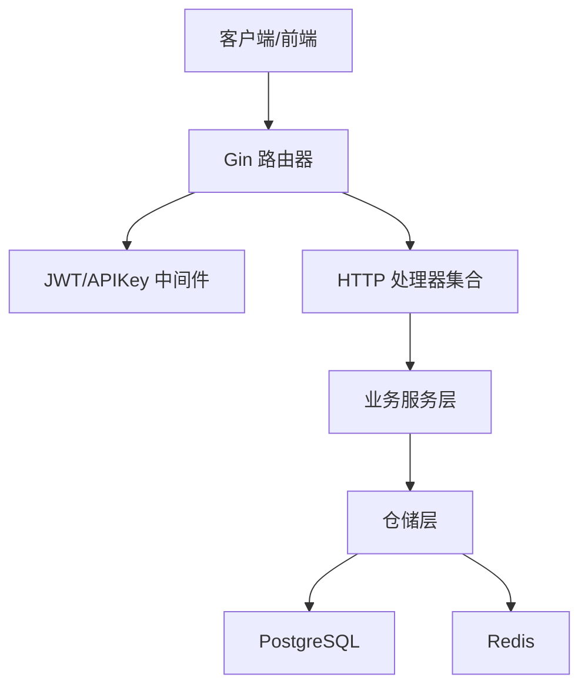
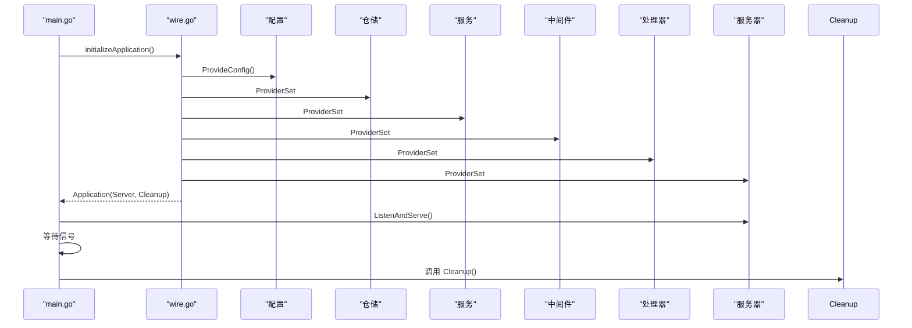
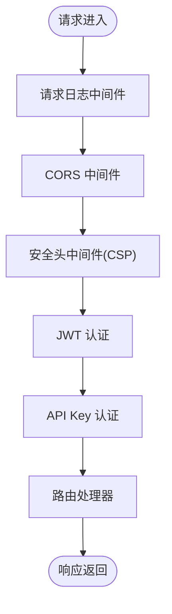
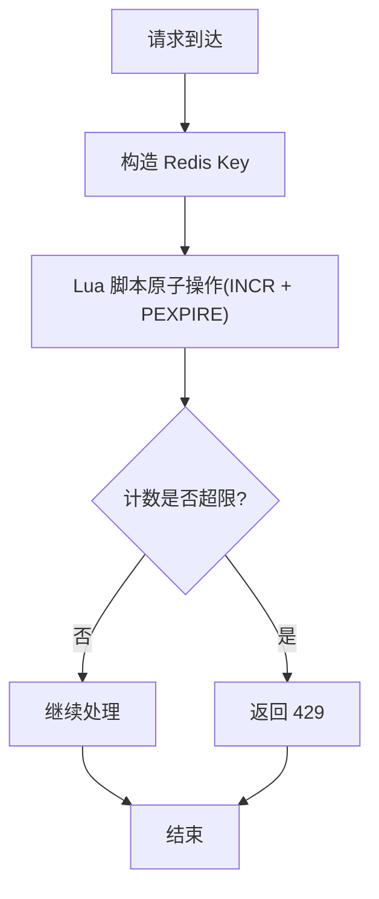
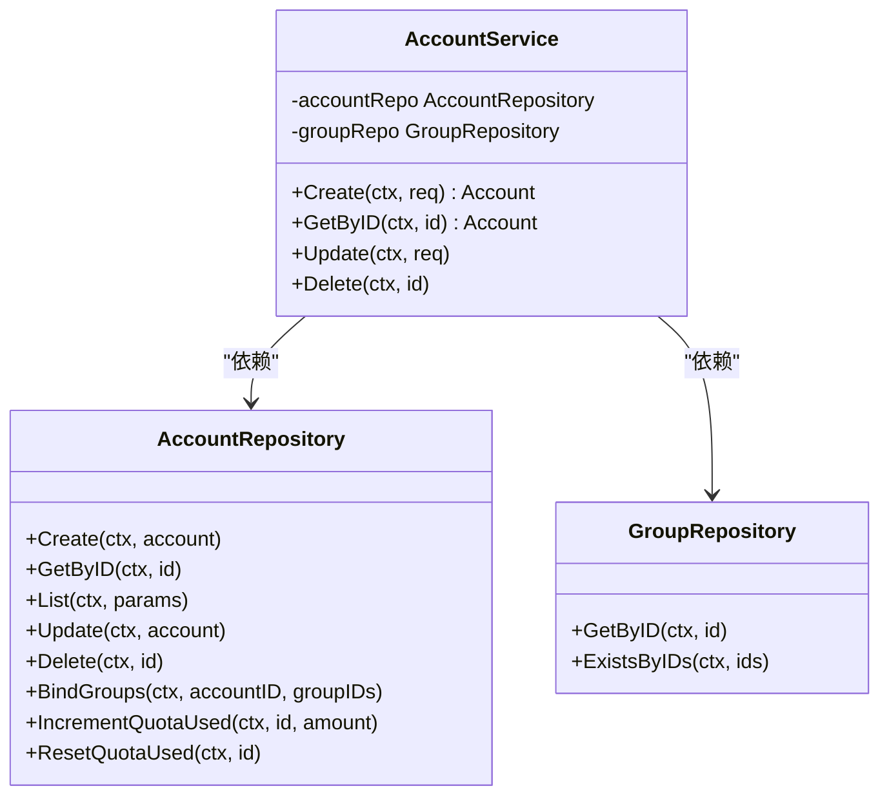
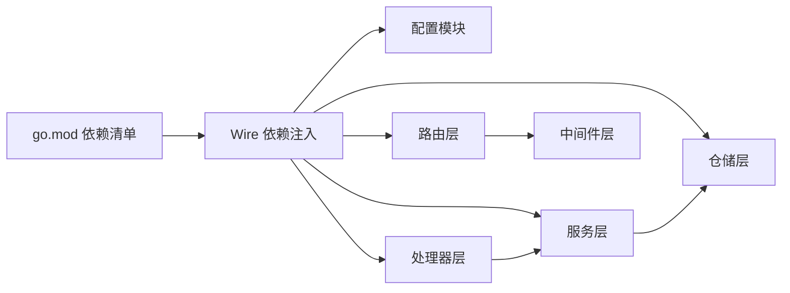

# 架构设计

<cite>
**本文引用的文件**
- [backend/cmd/server/main.go](file://backend/cmd/server/main.go)
- [backend/cmd/server/wire.go](file://backend/cmd/server/wire.go)
- [backend/internal/config/config.go](file://backend/internal/config/config.go)
- [backend/internal/config/wire.go](file://backend/internal/config/wire.go)
- [backend/internal/server/router.go](file://backend/internal/server/router.go)
- [backend/internal/handler/handler.go](file://backend/internal/handler/handler.go)
- [backend/internal/repository/wire.go](file://backend/internal/repository/wire.go)
- [backend/internal/service/account_service.go](file://backend/internal/service/account_service.go)
- [backend/internal/middleware/rate_limiter.go](file://backend/internal/middleware/rate_limiter.go)
- [backend/go.mod](file://backend/go.mod)
- [deploy/docker-compose.yml](file://deploy/docker-compose.yml)
- [README.md](file://README.md)
</cite>

## 目录
1. [引言](#引言)
2. [项目结构](#项目结构)
3. [核心组件](#核心组件)
4. [架构总览](#架构总览)
5. [详细组件分析](#详细组件分析)
6. [依赖分析](#依赖分析)
7. [性能考量](#性能考量)
8. [故障排查指南](#故障排查指南)
9. [结论](#结论)
10. [附录](#附录)

## 引言
本架构设计文档面向 Sub2API 的后端系统，聚焦其分层架构、微服务化思路、事件驱动与缓存/队列协同、以及跨领域横切关注点（安全、监控、日志、灾备）。文档旨在帮助开发者与运维人员快速理解系统如何组织、如何扩展、如何在生产环境中稳定运行。

## 项目结构
后端采用典型的分层架构：入口层（cmd/server）、配置层（internal/config）、路由与中间件层（internal/server）、处理器层（internal/handler）、仓储层（internal/repository）、业务服务层（internal/service），并辅以工具与包（internal/pkg）与基础设施（deploy）。

- 入口与装配
  - 入口程序负责初始化日志、加载配置、运行引导流程，并通过 Wire 进行依赖注入装配。
  - Wire 在编译期生成装配代码，将配置、仓储、服务、中间件、处理器、服务器等组件组装为可运行的应用。

- 配置与环境
  - 配置模块提供丰富的运行时配置项，涵盖服务器、日志、CORS、安全、账单熔断、数据库、Redis、运营监控、JWT、TOTP、网关、幂等、定价、并发、令牌刷新、Gemini、更新等。
  - 部署通过 Docker Compose 提供 PostgreSQL 与 Redis 的容器化依赖，以及自动初始化与健康检查。

- 路由与中间件
  - 路由层集中注册通用路由与 API v1 下的认证、用户、管理员、网关、支付等模块路由。
  - 中间件层提供日志、CORS、安全头、JWT、API Key 等横切能力。

- 仓储与服务
  - 仓储层封装数据库与缓存访问，提供统一的接口抽象，便于替换与测试。
  - 服务层承载业务规则与流程编排，结合缓存与定时任务实现高可用与高性能。

- 技术栈与依赖
  - 后端基于 Go 1.26.2、Gin、Ent ORM、Redis、PostgreSQL，配合 Wire 实现依赖注入，满足高并发与可维护性的双重需求。

**图表来源**
- [backend/cmd/server/main.go:55-182](file://backend/cmd/server/main.go#L55-L182)
- [backend/cmd/server/wire.go:30-57](file://backend/cmd/server/wire.go#L30-L57)
- [backend/internal/config/config.go:60-91](file://backend/internal/config/config.go#L60-L91)
- [backend/internal/server/router.go:22-92](file://backend/internal/server/router.go#L22-L92)
- [backend/internal/middleware/rate_limiter.go:61-122](file://backend/internal/middleware/rate_limiter.go#L61-L122)
- [backend/internal/handler/handler.go:37-55](file://backend/internal/handler/handler.go#L37-L55)
- [backend/internal/repository/wire.go:50-130](file://backend/internal/repository/wire.go#L50-L130)
- [backend/internal/service/account_service.go:125-141](file://backend/internal/service/account_service.go#L125-L141)

**章节来源**
- [backend/cmd/server/main.go:55-182](file://backend/cmd/server/main.go#L55-L182)
- [backend/internal/config/config.go:60-91](file://backend/internal/config/config.go#L60-L91)
- [backend/internal/server/router.go:22-122](file://backend/internal/server/router.go#L22-L122)
- [backend/internal/middleware/rate_limiter.go:61-162](file://backend/internal/middleware/rate_limiter.go#L61-L162)
- [backend/internal/handler/handler.go:37-62](file://backend/internal/handler/handler.go#L37-L62)
- [backend/internal/repository/wire.go:50-181](file://backend/internal/repository/wire.go#L50-L181)
- [backend/internal/service/account_service.go:125-200](file://backend/internal/service/account_service.go#L125-L200)

## 核心组件
- 应用入口与生命周期
  - 初始化日志、解析命令行参数、判断首次运行与自动初始化、加载配置、初始化日志、构建应用并启动 HTTP 服务器，监听系统信号优雅退出。
- 依赖注入与装配
  - 通过 Wire 将配置、仓储、服务、中间件、处理器、服务器等组件装配为 Application，统一提供 Cleanup 生命周期钩子。
- 路由与中间件
  - 路由层集中注册通用与模块路由，中间件层提供日志、CORS、安全头、JWT、API Key 等横切能力。
- 仓储与服务
  - 仓储层提供统一接口与缓存实现，服务层承载业务规则与流程编排，结合缓存与定时任务实现高可用与高性能。
- 配置体系
  - 配置模块提供大量运行时可调参数，覆盖服务器、日志、CORS、安全、账单熔断、数据库、Redis、运营监控、JWT、TOTP、网关、幂等、定价、并发、令牌刷新、Gemini、更新等。

**章节来源**
- [backend/cmd/server/main.go:55-182](file://backend/cmd/server/main.go#L55-L182)
- [backend/cmd/server/wire.go:30-97](file://backend/cmd/server/wire.go#L30-L97)
- [backend/internal/server/router.go:22-122](file://backend/internal/server/router.go#L22-L122)
- [backend/internal/middleware/rate_limiter.go:61-162](file://backend/internal/middleware/rate_limiter.go#L61-L162)
- [backend/internal/repository/wire.go:50-181](file://backend/internal/repository/wire.go#L50-L181)
- [backend/internal/config/config.go:60-91](file://backend/internal/config/config.go#L60-L91)

## 架构总览
Sub2API 采用分层架构与依赖注入相结合的设计，强调：
- 分层清晰：入口、配置、路由、中间件、处理器、仓储、服务、基础设施。
- 微服务化思路：服务边界以业务域划分（认证、用户、管理员、网关、支付、运营等），通过 HTTP API 交互。
- 事件驱动与缓存/队列：通过 Redis 缓存与异步队列（如使用量记录工作池）实现高并发与削峰填谷。
- 横切关注点：安全（CSP、URL 白名单、响应头过滤）、监控（运营指标与清理）、日志（结构化与轮转）、灾备（备份与恢复）。

**图表来源**
- [backend/internal/server/router.go:22-122](file://backend/internal/server/router.go#L22-L122)
- [backend/internal/handler/handler.go:37-55](file://backend/internal/handler/handler.go#L37-L55)
- [backend/internal/repository/wire.go:50-130](file://backend/internal/repository/wire.go#L50-L130)
- [backend/internal/service/account_service.go:125-141](file://backend/internal/service/account_service.go#L125-L141)

## 详细组件分析

### 组件 A：应用装配与生命周期（Wire）
- 职责
  - 通过 ProviderSet 将配置、仓储、服务、中间件、处理器、服务器等组件装配为 Application。
  - 提供 Cleanup 钩子，按并行与顺序策略关闭各类服务与基础设施。
- 关键点
  - 并行关闭：运营报告、清理、系统日志、告警评估、聚合、指标收集、调度快照、使用清理、幂等清理、令牌刷新、到期服务、订阅服务、定价、邮件队列、账单缓存、使用记录工作池、OAuth 服务、OpenAI WebSocket 连接池、群组状态运行器、定时测试运行器、备份服务。
  - 顺序关闭：Redis、Ent 客户端。
- 依赖
  - 配置、Ent 客户端、Redis 客户端、各类服务与工作池。

**图表来源**
- [backend/cmd/server/main.go:134-182](file://backend/cmd/server/main.go#L134-L182)
- [backend/cmd/server/wire.go:30-97](file://backend/cmd/server/wire.go#L30-L97)
- [backend/internal/config/wire.go:5-14](file://backend/internal/config/wire.go#L5-L14)
- [backend/internal/repository/wire.go:50-130](file://backend/internal/repository/wire.go#L50-L130)

**章节来源**
- [backend/cmd/server/wire.go:30-97](file://backend/cmd/server/wire.go#L30-L97)
- [backend/cmd/server/wire.go:98-297](file://backend/cmd/server/wire.go#L98-L297)

### 组件 B：路由与中间件（Gin + 中间件）
- 路由注册
  - 通用路由（健康检查等）与 API v1 下的认证、用户、管理员、网关、支付等模块路由。
- 中间件
  - 请求日志、结构化日志、CORS、安全头（含 CSP 动态注入 frame-src）、JWT 认证、API Key 认证。
- 动态安全头
  - 通过设置回调，在配置变更时刷新 CSP 的 frame-src 列表，确保 iframe 外链安全。

**图表来源**
- [backend/internal/server/router.go:22-92](file://backend/internal/server/router.go#L22-L92)
- [backend/internal/server/router.go:94-122](file://backend/internal/server/router.go#L94-L122)

**章节来源**
- [backend/internal/server/router.go:22-122](file://backend/internal/server/router.go#L22-L122)

### 组件 C：限流中间件（Redis 原子脚本）
- 设计要点
  - 使用 Lua 脚本原子地 INCR 并修复过期时间，保证计数与 TTL 的一致性。
  - 支持 Fail-Close/Fail-Open 两种故障模式，Redis 错误时可选择放行或拒绝。
- 复杂度
  - 单请求 O(1) 计算与一次 Redis 交互，具备高吞吐与低延迟特性。
- 配置
  - 通过 LimitWithOptions 支持自定义窗口与故障模式。

**图表来源**
- [backend/internal/middleware/rate_limiter.go:28-59](file://backend/internal/middleware/rate_limiter.go#L28-L59)
- [backend/internal/middleware/rate_limiter.go:83-122](file://backend/internal/middleware/rate_limiter.go#L83-L122)

**章节来源**
- [backend/internal/middleware/rate_limiter.go:61-162](file://backend/internal/middleware/rate_limiter.go#L61-L162)

### 组件 D：账号服务（仓储与服务）
- 仓储接口
  - 定义账号的增删改查、分页、过滤、绑定分组、状态管理、配额增量与重置等方法。
- 服务编排
  - 校验分组存在性、创建账号、绑定分组、类型与分组互斥校验（API Key 不可加入 OAuth 限制分组）。
- 依赖
  - 依赖 AccountRepository 与 GroupRepository，体现仓储模式与依赖倒置。

**图表来源**
- [backend/internal/service/account_service.go:20-77](file://backend/internal/service/account_service.go#L20-L77)
- [backend/internal/service/account_service.go:125-141](file://backend/internal/service/account_service.go#L125-L141)

**章节来源**
- [backend/internal/service/account_service.go:125-200](file://backend/internal/service/account_service.go#L125-L200)

### 组件 E：配置体系（分层与可调参数）
- 结构
  - Config 结构体包含 Server、Log、CORS、Security、Billing、Turnstile、Database、Redis、Ops、JWT、Totp、LinuxDo、GitHub、Default、RateLimit、Pricing、Gateway、APIKeyAuth、SubscriptionCache、SubscriptionMaintenance、Dashboard、DashboardAgg、UsageCleanup、Concurrency、TokenRefresh、RunMode、Timezone、Gemini、Update、Idempotency 等子配置。
- 关键参数
  - 网关：响应头超时、请求体大小、上游响应读取上限、连接池隔离策略、并发槽 TTL、会话空闲超时、流式超时与保活、TLS 指纹伪装、使用量记录队列与自动扩缩容、用户消息串行队列等。
  - 运营监控：启用开关、预聚合表、清理策略、指标收集缓存。
  - 数据库与 Redis：连接池参数、超时、TLS 等。
- 作用
  - 通过 viper 加载配置，支持环境变量与 YAML 文件，满足不同部署形态的灵活配置。

**章节来源**
- [backend/internal/config/config.go:60-91](file://backend/internal/config/config.go#L60-L91)
- [backend/internal/config/config.go:325-418](file://backend/internal/config/config.go#L325-L418)
- [backend/internal/config/config.go:755-794](file://backend/internal/config/config.go#L755-L794)
- [backend/internal/config/config.go:677-727](file://backend/internal/config/config.go#L677-L727)
- [backend/internal/config/config.go:729-749](file://backend/internal/config/config.go#L729-L749)

## 依赖分析
- 技术栈与版本
  - 后端：Go 1.26.2、Gin、Ent、Redis、PostgreSQL、Wire、Viper 等。
  - 前端：Vue 3、Vite、TailwindCSS。
  - 部署：Docker、Docker Compose。
- 外部依赖与集成
  - 通过 go.mod 明确列出依赖及其间接依赖，确保版本一致性与可审计性。
- 耦合与内聚
  - 通过 Wire 实现依赖注入，降低模块间耦合；仓储接口与服务编排提升内聚性。
- 潜在循环依赖
  - 通过 ProviderSet 与接口抽象避免循环依赖；路由与处理器解耦，中间件横切。

**图表来源**
- [backend/go.mod:1-177](file://backend/go.mod#L1-L177)
- [backend/cmd/server/wire.go:30-57](file://backend/cmd/server/wire.go#L30-L57)

**章节来源**
- [backend/go.mod:1-177](file://backend/go.mod#L1-L177)
- [backend/cmd/server/wire.go:30-57](file://backend/cmd/server/wire.go#L30-L57)

## 性能考量
- 连接池与隔离
  - 网关连接池隔离策略（按代理、账户、账户+代理）影响连接复用与资源消耗，建议根据账户规模与隔离需求选择。
  - 数据库与 Redis 连接池参数可调，避免频繁创建/销毁连接与慢查询阻塞。
- 缓存与队列
  - Redis 用于分布式锁、缓存、速率限制、实时统计；使用量记录队列支持自动扩缩容与溢出策略（丢弃/采样/同步）。
- 并发与会话
  - 并发槽 TTL 与会话空闲超时需大于最长请求时间，避免请求完成前槽位过期。
- TLS 指纹伪装
  - 通过 TLS 指纹配置模拟特定客户端握手特征，提高上游兼容性与稳定性。

[本节为通用指导，无需具体文件分析]

## 故障排查指南
- 启动与初始化
  - 首次运行或自动初始化失败：检查环境变量与配置文件，确认数据库与 Redis 可达。
- 路由与中间件
  - 跨域与安全头问题：检查 CORS 与 CSP 配置，确认动态 frame-src 刷新回调是否生效。
  - 限流异常：Redis 故障时的 Fail-Close/Fail-Open 策略会影响请求放行，需根据场景调整。
- 业务服务
  - 账号创建失败：检查分组存在性与类型限制（API Key 不可加入 OAuth 限制分组）。
- 清理与资源
  - Cleanup 钩子按并行与顺序关闭各类服务与基础设施，若出现超时需检查资源占用与依赖服务健康状况。

**章节来源**
- [backend/cmd/server/main.go:77-91](file://backend/cmd/server/main.go#L77-L91)
- [backend/internal/server/router.go:43-53](file://backend/internal/server/router.go#L43-L53)
- [backend/internal/middleware/rate_limiter.go:100-109](file://backend/internal/middleware/rate_limiter.go#L100-L109)
- [backend/internal/service/account_service.go:176-187](file://backend/internal/service/account_service.go#L176-L187)
- [backend/cmd/server/wire.go:98-297](file://backend/cmd/server/wire.go#L98-L297)

## 结论
Sub2API 通过清晰的分层架构与依赖注入，实现了高内聚、低耦合的系统设计；结合 Redis 缓存与异步队列，满足高并发与可扩展性需求；通过丰富的配置项与中间件，强化了安全、监控、日志与灾备等横切关注点。在生产部署中，建议结合 Docker Compose 快速落地，并依据业务规模调整连接池、缓存与队列参数，确保系统稳定与高效。

## 附录
- 部署拓扑
  - Docker Compose 提供 PostgreSQL 与 Redis 容器，应用容器通过健康检查与环境变量进行配置，支持一键部署与升级。
- 基础设施要求
  - Go 1.26.2、PostgreSQL 15+、Redis 7+、Docker 20.10+、Docker Compose v2+。
- 版本与兼容性
  - 后端 Go 版本与依赖版本在 go.mod 中明确；前端 Vue 与相关工具链版本在前端工程中定义。

**章节来源**
- [deploy/docker-compose.yml:14-238](file://deploy/docker-compose.yml#L14-L238)
- [README.md:103-111](file://README.md#L103-L111)
- [backend/go.mod:3](file://backend/go.mod#L3)