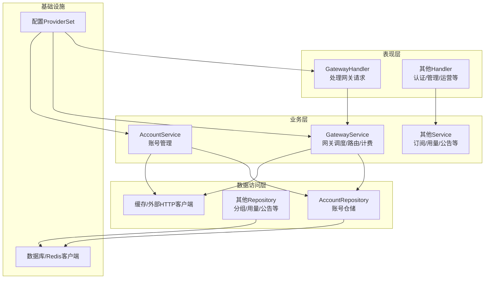
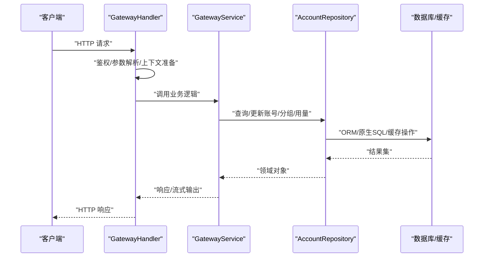
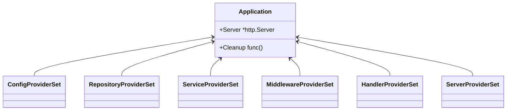
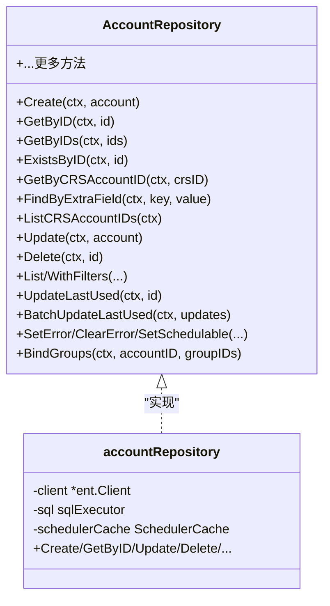
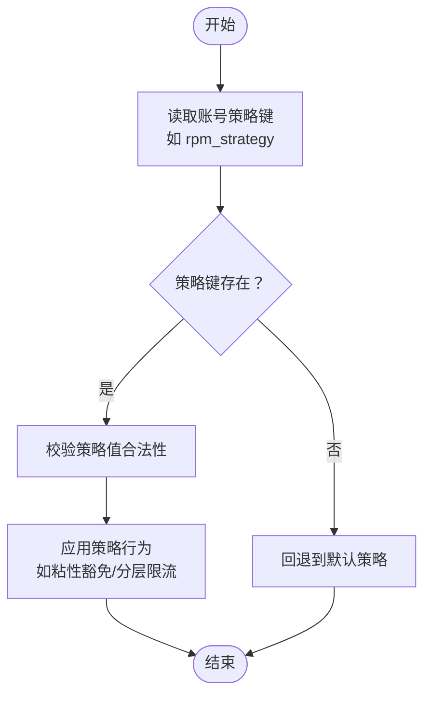
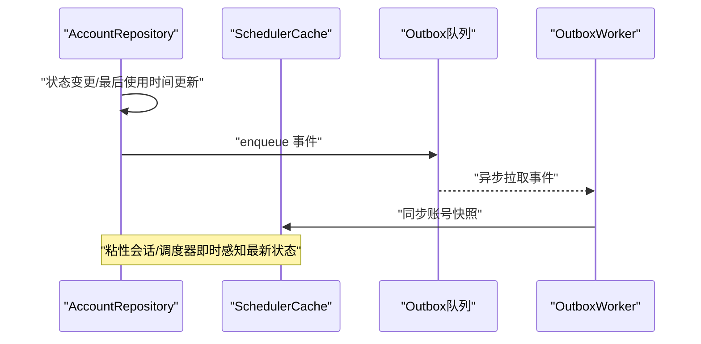
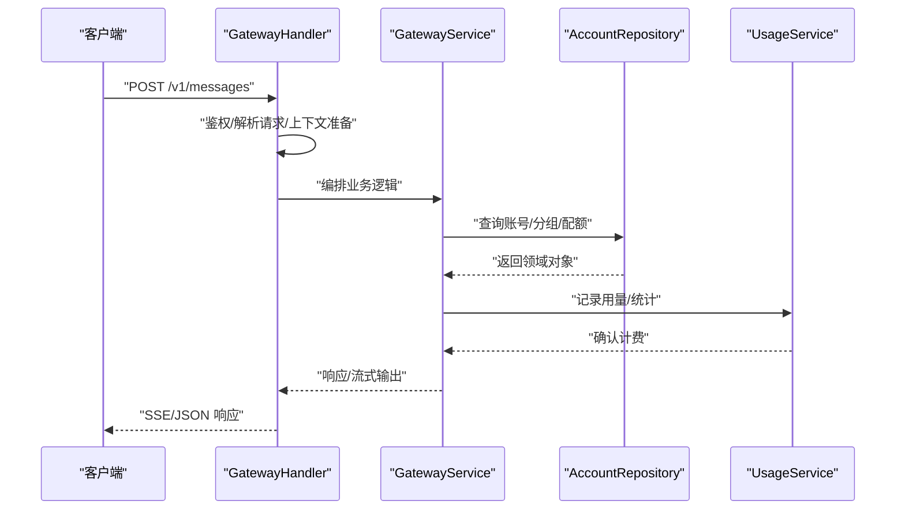
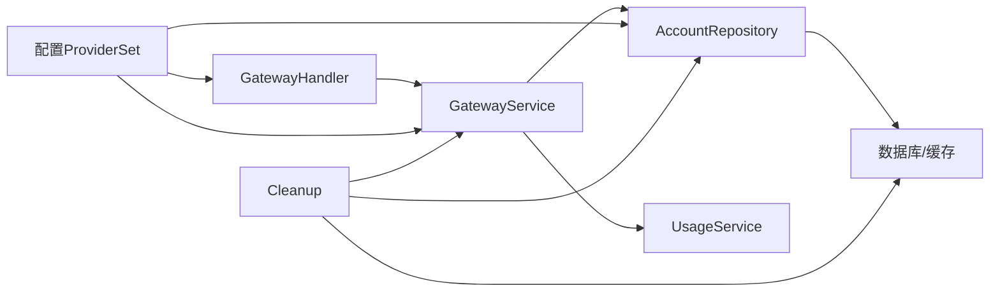

# 核心设计模式

<cite>
**本文引用的文件**
- [wire.go](file://backend/cmd/server/wire.go)
- [wire.go](file://backend/internal/config/wire.go)
- [wire.go](file://backend/internal/handler/wire.go)
- [wire.go](file://backend/internal/repository/wire.go)
- [account_service.go](file://backend/internal/service/account_service.go)
- [account_repo.go](file://backend/internal/repository/account_repo.go)
- [gateway_handler.go](file://backend/internal/handler/gateway_handler.go)
- [gateway_service.go](file://backend/internal/service/gateway_service.go)
</cite>

## 目录
1. [引言](#引言)
2. [项目结构](#项目结构)
3. [核心组件](#核心组件)
4. [架构总览](#架构总览)
5. [详细组件分析](#详细组件分析)
6. [依赖分析](#依赖分析)
7. [性能考虑](#性能考虑)
8. [故障排查指南](#故障排查指南)
9. [结论](#结论)

## 引言
本文件系统性梳理 Sub2API 的核心设计模式，重点覆盖以下方面：
- 依赖注入模式（Wire 框架）：如何在 Handler-Service-Repository 三层架构中通过 ProviderSet 组织依赖、解耦组件、简化启动流程。
- 仓储模式（Repository Pattern）：通过接口隔离数据访问与业务逻辑，结合 Ent ORM 与原生 SQL 的混合使用，提升可测试性与扩展性。
- 策略模式：在服务层根据配置或账号属性动态选择行为（例如 RPM 策略、并发控制策略）。
- 观察者模式：通过 Ent Hooks/Interceptors 与事件出站（outbox）机制实现跨模块的“观察-通知”协作。

目标是帮助读者快速理解项目如何通过这些设计模式达成高内聚、低耦合、易扩展与易维护的目标，并给出最佳实践建议。

## 项目结构
项目采用典型的分层架构：
- 表现层（Handler）：接收 HTTP 请求，进行参数校验与上下文准备，调用服务层处理业务。
- 业务层（Service）：封装业务规则与流程编排，协调多个仓储与外部服务。
- 数据访问层（Repository）：抽象数据库与缓存等持久化能力，提供面向业务的查询与写入接口。
- 基础设施（Infra）：配置、缓存、数据库连接、HTTP 客户端等。

图表来源
- [wire.go:30-57](file://backend/cmd/server/wire.go#L30-L57)
- [wire.go:133-183](file://backend/internal/handler/wire.go#L133-L183)
- [wire.go:50-130](file://backend/internal/repository/wire.go#L50-L130)

章节来源
- [wire.go:30-57](file://backend/cmd/server/wire.go#L30-L57)
- [wire.go:5-13](file://backend/internal/config/wire.go#L5-L13)
- [wire.go:133-183](file://backend/internal/handler/wire.go#L133-L183)
- [wire.go:50-130](file://backend/internal/repository/wire.go#L50-L130)

## 核心组件
- 依赖注入（Wire）：通过 ProviderSet 将配置、仓储、服务、中间件、处理器等组件集中注册，形成 Application 结构体，简化启动与测试。
- 仓储接口与实现：Service 层定义接口，Repository 层提供具体实现；既可使用 Ent ORM，也可在复杂场景下直接使用原生 SQL。
- 策略选择：在服务层依据配置或账号属性动态选择策略（如 RPM 策略），实现灵活的行为定制。
- 观察与事件：通过 Ent Hooks/Interceptors 与 outbox 事件队列，实现跨模块的观察与通知。

章节来源
- [wire.go:30-57](file://backend/cmd/server/wire.go#L30-L57)
- [wire.go:20-77](file://backend/internal/service/account_service.go#L20-L77)
- [wire.go:67-77](file://backend/internal/repository/account_repo.go#L67-L77)
- [wire.go:1769-1841](file://backend/internal/service/account_service.go#L1769-L1841)

## 架构总览
下图展示了从请求进入至持久化的典型链路，体现 Handler-Service-Repository 的协作与依赖注入的装配过程。

图表来源
- [gateway_handler.go:110-200](file://backend/internal/handler/gateway_handler.go#L110-L200)
- [gateway_service.go:1-200](file://backend/internal/service/gateway_service.go#L1-L200)
- [account_repo.go:147-161](file://backend/internal/repository/account_repo.go#L147-L161)

章节来源
- [gateway_handler.go:110-200](file://backend/internal/handler/gateway_handler.go#L110-L200)
- [gateway_service.go:1-200](file://backend/internal/service/gateway_service.go#L1-L200)
- [account_repo.go:147-161](file://backend/internal/repository/account_repo.go#L147-L161)

## 详细组件分析

### 依赖注入模式（Wire）
- ProviderSet 组织：配置、仓储、服务、中间件、处理器分别通过各自的 ProviderSet 注册，最终由 Application 聚合。
- 清理流程：提供统一的 Cleanup 函数，按并行与串行策略关闭各类服务与基础设施，确保优雅退出。
- 构造函数注入：Handler/Service/Repository 的构造函数直接接受所需依赖，配合 Wire 自动生成初始化代码。

图表来源
- [wire.go:30-57](file://backend/cmd/server/wire.go#L30-L57)
- [wire.go:5-13](file://backend/internal/config/wire.go#L5-L13)
- [wire.go:133-183](file://backend/internal/handler/wire.go#L133-L183)
- [wire.go:50-130](file://backend/internal/repository/wire.go#L50-L130)

章节来源
- [wire.go:30-57](file://backend/cmd/server/wire.go#L30-L57)
- [wire.go:70-296](file://backend/cmd/server/wire.go#L70-L296)
- [wire.go:5-13](file://backend/internal/config/wire.go#L5-L13)
- [wire.go:133-183](file://backend/internal/handler/wire.go#L133-L183)
- [wire.go:50-130](file://backend/internal/repository/wire.go#L50-L130)

### 仓储模式（Repository Pattern）
- 接口隔离：Service 层定义 AccountRepository 接口，屏蔽底层存储差异。
- 实现细节：AccountRepository 使用 Ent ORM 进行类型安全的查询与更新；在复杂场景（如批量更新、聚合统计）使用原生 SQL。
- 辅助能力：支持软删除过滤、事务保证、与调度器缓存的同步，确保状态一致性。

图表来源
- [account_service.go:20-77](file://backend/internal/service/account_service.go#L20-L77)
- [account_repo.go:67-77](file://backend/internal/repository/account_repo.go#L67-L77)

章节来源
- [account_service.go:20-77](file://backend/internal/service/account_service.go#L20-L77)
- [account_repo.go:67-77](file://backend/internal/repository/account_repo.go#L67-L77)
- [account_repo.go:316-405](file://backend/internal/repository/account_repo.go#L316-L405)
- [account_repo.go:595-628](file://backend/internal/repository/account_repo.go#L595-L628)

### 策略模式（策略选择与动态行为）
- 账号级策略：账号对象通过 Extra 字段携带策略键（如 rpm_strategy），服务层据此选择不同行为（如粘性豁免、分层限流）。
- 配置驱动：策略可由配置或账号属性决定，实现灵活的运行时行为切换。
- 场景示例：在网关调度与限流逻辑中，依据策略选择不同的窗口成本计算与缓存命中策略。

图表来源
- [account_service.go:1769-1841](file://backend/internal/service/account_service.go#L1769-L1841)

章节来源
- [account_service.go:1769-1841](file://backend/internal/service/account_service.go#L1769-L1841)

### 观察者模式（事件与通知）
- Ent Hooks/Interceptors：在实体变更时触发钩子或拦截器，实现跨模块的副作用（如更新缓存、入队 outbox 事件）。
- Outbox 事件：账号状态变更、最后使用时间更新等事件通过 outbox 入队，异步同步到调度器缓存，确保粘性会话及时感知最新状态。
- 协作关系：仓储层负责触发事件，缓存/调度器消费事件，形成松耦合的观察-通知链路。

图表来源
- [account_repo.go:141-144](file://backend/internal/repository/account_repo.go#L141-L144)
- [account_repo.go:398-404](file://backend/internal/repository/account_repo.go#L398-L404)
- [account_repo.go:588-592](file://backend/internal/repository/account_repo.go#L588-L592)
- [account_repo.go:638-643](file://backend/internal/repository/account_repo.go#L638-L643)
- [account_repo.go:704-703](file://backend/internal/repository/account_repo.go#L704-L703)

章节来源
- [account_repo.go:141-144](file://backend/internal/repository/account_repo.go#L141-L144)
- [account_repo.go:398-404](file://backend/internal/repository/account_repo.go#L398-L404)
- [account_repo.go:588-592](file://backend/internal/repository/account_repo.go#L588-L592)
- [account_repo.go:638-643](file://backend/internal/repository/account_repo.go#L638-L643)
- [account_repo.go:654-703](file://backend/internal/repository/account_repo.go#L654-L703)

### Handler-Service-Repository 协同流程（以网关消息处理为例）
- Handler 负责鉴权、参数解析、上下文准备与错误处理。
- Service 负责业务编排：路由解析、模型映射、并发控制、用量统计、错误透传等。
- Repository 负责数据访问：账号/分组/用量/公告等的读写与缓存同步。

图表来源
- [gateway_handler.go:110-200](file://backend/internal/handler/gateway_handler.go#L110-L200)
- [gateway_service.go:1-200](file://backend/internal/service/gateway_service.go#L1-L200)
- [account_repo.go:147-161](file://backend/internal/repository/account_repo.go#L147-L161)

章节来源
- [gateway_handler.go:110-200](file://backend/internal/handler/gateway_handler.go#L110-L200)
- [gateway_service.go:1-200](file://backend/internal/service/gateway_service.go#L1-L200)
- [account_repo.go:147-161](file://backend/internal/repository/account_repo.go#L147-L161)

## 依赖分析
- 组件耦合：Handler 依赖 Service；Service 依赖 Repository 接口；Repository 依赖数据库/缓存等基础设施；配置通过 ProviderSet 注入。
- 外部依赖：Ent ORM、Redis、HTTP 客户端等通过 ProviderSet 提供，便于替换与测试。
- 清理顺序：并行关闭业务服务，最后顺序关闭 Redis/Ent，避免资源竞争。

图表来源
- [wire.go:30-57](file://backend/cmd/server/wire.go#L30-L57)
- [wire.go:133-183](file://backend/internal/handler/wire.go#L133-L183)
- [wire.go:50-130](file://backend/internal/repository/wire.go#L50-L130)
- [wire.go:70-296](file://backend/cmd/server/wire.go#L70-L296)

章节来源
- [wire.go:30-57](file://backend/cmd/server/wire.go#L30-L57)
- [wire.go:133-183](file://backend/internal/handler/wire.go#L133-L183)
- [wire.go:50-130](file://backend/internal/repository/wire.go#L50-L130)
- [wire.go:70-296](file://backend/cmd/server/wire.go#L70-L296)

## 性能考虑
- 并发控制与粘性会话：通过并发缓存与调度器快照同步，降低抖动与错误路由概率。
- 批量更新与原生 SQL：在高频路径（如批量更新最后使用时间）采用原生 SQL，减少 ORM 开销。
- 缓存与单飞（singleflight）：对热点数据（如模型列表、用户组限流）使用缓存与单飞，降低重复计算与后端压力。
- 清理策略：并行关闭业务服务，顺序关闭基础设施，缩短停机时间。

## 故障排查指南
- 清理失败定位：Cleanup 中对每个步骤记录日志，若出现超时或失败，可按名称定位具体组件。
- 事件未生效：检查 outbox 是否入队成功、worker 是否正常运行、缓存同步是否报错。
- 依赖注入问题：确认 ProviderSet 是否正确注册、wire_gen 是否生成、构造函数参数是否齐全。

章节来源
- [wire.go:257-296](file://backend/cmd/server/wire.go#L257-L296)
- [account_repo.go:141-144](file://backend/internal/repository/account_repo.go#L141-L144)
- [account_repo.go:398-404](file://backend/internal/repository/account_repo.go#L398-L404)

## 结论
Sub2API 通过 Wire 依赖注入、仓储接口隔离、策略选择与事件观察等设计模式，构建了清晰的分层架构与可扩展的服务体系。Handler-Service-Repository 的职责边界明确，配合配置驱动与事件出站机制，实现了高可用、可观测与易演进的系统设计。建议在新增功能时遵循：
- 优先使用接口隔离仓储与服务；
- 通过配置或账号属性驱动策略；
- 在关键路径引入缓存与单飞；
- 通过 outbox 与钩子实现松耦合的观察-通知。